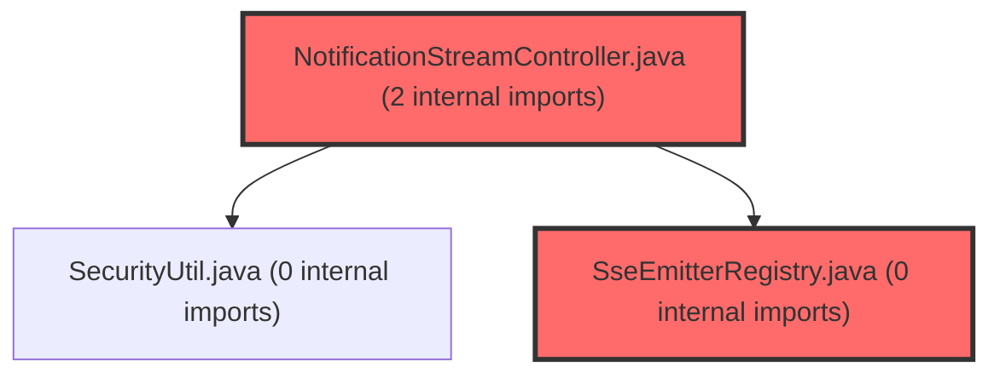

> [!IMPORTANT]
> **⚠️ 수동 검토 권장 (자가힐링 주의)**
>
> AI 자가힐링 결과물이 실제 의도와 다를 수 있으므로, **상세 리뷰 내용에 기반한 수동 점검**을 우선해 주시기 바랍니다. 자가힐링 기능을 활용하실 경우 최종 결과물을 신중하게 확인해 주세요.

# 코드 리뷰 - 55a99fcd

## 코드 복잡도 분석

**분석된 파일**: 11개 / 변경된 파일: 14개


### Import 의존관계 다이어그램



**범례**: 중심 파일 (변경됨) | 많은 import (10개 이상)


### 정상 범위 (NONE)


**`metaapplication.java`** (other)

- 평균 복잡도: **0.213**

- 최대 복잡도: 0.465

- 청크 수: 4개

- 평균 사용처: 9.8곳


**권장사항:**

- 복잡도 정상 범위


**`notificationstreamcontroller.java`** (other)

- 평균 복잡도: **0.011**

- 최대 복잡도: 0.011

- 청크 수: 1개


**권장사항:**

- 복잡도 정상 범위


**`notificationdto.java`** (other)

- 평균 복잡도: **0.007**

- 최대 복잡도: 0.010

- 청크 수: 2개


**권장사항:**

- 복잡도 정상 범위


**`notificationdebugcontroller.java`** (other)

- 평균 복잡도: **0.006**

- 최대 복잡도: 0.008

- 청크 수: 2개


**권장사항:**

- 복잡도 정상 범위


**`notificationheartbeatscheduler.java`** (other)

- 평균 복잡도: **0.005**

- 최대 복잡도: 0.006

- 청크 수: 2개


**권장사항:**

- 복잡도 정상 범위


**`inmemorydispatcher.java`** (other)

- 평균 복잡도: **0.004**

- 최대 복잡도: 0.006

- 청크 수: 2개


**권장사항:**

- 복잡도 정상 범위


**`notificationlistresponse.java`** (other)

- 평균 복잡도: **0.004**

- 최대 복잡도: 0.004

- 청크 수: 1개


**권장사항:**

- 복잡도 정상 범위


**`notificationcontroller.java`** (other)

- 평균 복잡도: **0.003**

- 최대 복잡도: 0.004

- 청크 수: 4개


**권장사항:**

- 복잡도 정상 범위


**`notificationservice.java`** (other)

- 평균 복잡도: **0.003**

- 최대 복잡도: 0.006

- 청크 수: 7개


**권장사항:**

- 복잡도 정상 범위


**`sseemitterregistry.java`** (other)

- 평균 복잡도: **0.003**

- 최대 복잡도: 0.006

- 청크 수: 6개


**권장사항:**

- 복잡도 정상 범위


**`notificationdispatcher.java`** (other)

- 평균 복잡도: **0.000**

- 최대 복잡도: 0.000

- 청크 수: 1개


**권장사항:**

- 복잡도 정상 범위


---


## 결론

이 커밋은 승인 가능한 수준입니다. Critical이나 High 등급의 이슈는 발견되지 않았으며, 3가지 Medium 수준의 개선 제안은 선택적 검토 사항입니다. 알림 모듈의 전체 아키텍처 설계와 구현 품질이 우수합니다.

**결론**: [WARN] 조건부 승인 (Approved with Comments)

---

## 변경사항 요약

알림(Notification) 기능의 BE 백엔드 전 계층을 구현한 커밋입니다. SSE 기반 실시간 스트리밍(SseEmitterRegistry, NotificationStreamController, HeartbeatScheduler), REST CRUD API 4종(목록조회/미확인개수/개별읽음/전체읽음), 전략 패턴 기반 디스패처(NotificationDispatcher 인터페이스 + InMemoryDispatcher 구현체), 그리고 FE 전달용 API 계약 문서까지 포함하여 총 14개 파일(+972/-113)이 변경되었습니다.

---

## [GOOD] 잘된 점

### 1. SSE 생명주기 관리의 철저함
`NotificationStreamController.java` 37-48라인에서 `onCompletion`, `onTimeout`, `onError` 세 가지 콜백을 모두 등록하여 Emitter 정리 로직을 일관되게 구성했습니다. 특히 세 경로 모두 `registry.remove(userNo, emitter)`를 호출하도록 하여, 사용자 연결이 어떤 방식으로 종료되든 메모리에서 누수 없이 정리됩니다.

```java
emitter.onCompletion(() -> {
    registry.remove(userNo, emitter);
    log.debug("[SSE] completion: userNo={}", userNo);
});
emitter.onTimeout(() -> {
    registry.remove(userNo, emitter);
    log.debug("[SSE] timeout: userNo={}", userNo);
});
emitter.onError(e -> {
    registry.remove(userNo, emitter);
    log.debug("[SSE] error: userNo={}, error={}", userNo, e.getMessage());
});
```

### 2. 디스패처 전략 패턴을 통한 확장성
`NotificationDispatcher.java`는 인터페이스로 정의되고, `InMemoryDispatcher.java`는 `@ConditionalOnProperty(name = "notification.pubsub.enabled", havingValue = "false", matchIfMissing = true)`로 조건부 Bean 등록됩니다. 이 구조는 Phase 2(Redis Pub/Sub)로 전환할 때 단순히 `RedisPubSubDispatcher` 구현체를 추가하고 환경변수만 변경하면 되므로, 마이그레이션 비용이 거의 0에 가깝습니다. 주석에도 "Phase 1: 단일 인스턴스 내 메모리 맵" / "Phase 2: Redis Pub/Sub 도입 시 NotificationDispatcher 구현만 교체"라고 명확히 문서화되어 있습니다.

### 3. Cursor 기반 페이징의 정확한 구현
`NotificationService.java` 88-95라인에서 `pageSize + 1` 만큼 조회한 후 `hasMore`를 판별하고 `subList(0, pageSize)`로 자르는 패턴이 정확합니다. 또한 `normalizeSize()` 메서드를 통해 size 파라미터의 null/0/음수/최대값을 안전하게 처리합니다.

```java
int pageSize = normalizeSize(size);
List<Notification> rows = mapper.findByUserNoWithCursor(userNo, cursor, category, pageSize + 1);

boolean hasMore = rows.size() > pageSize;
List<Notification> items = hasMore ? rows.subList(0, pageSize) : rows;
Long nextCursor = hasMore ? items.get(items.size() - 1).getNotificationId() : null;
```

### 4. Debug 컨트롤러의 프로파일 분리
`NotificationDebugController.java`에 `@Profile("local")`을 적용하여, 로컬 개발 환경에서만 test-send 엔드포인트가 활성화됩니다. 이 엔드포인트가 운영/개발 서버에서는 아예 Bean으로 로드되지 않으므로, 실수로 프로덕션에서 호출될 위험이 없습니다.

### 5. 포괄적인 문서화
`fe-api-contract.md`(403줄)에는 FE 개발자에게 전달할 API 명세가 상세히 작성되어 있고, `task-board.md`(282줄)에는 Phase 0부터 Phase 2까지의 작업 현황이 체계적으로 관리되고 있습니다. 문서와 코드가 동시에 커밋되어 협업 효율이 높습니다.

---

## [ISSUE] 개선이 필요한 부분

### Medium: createBatch() 시 SSE 이벤트의 notificationId가 null로 전달됨

**이유:**
`NotificationService.java` 73-78라인에서 `mapper.insertBatch(list)`는 MyBatis `<foreach>` 기반 batch insert를 사용합니다. MyBatis의 batch insert는 단일 insert와 달리 `useGeneratedKeys`와 `keyProperty` 설정이 동작하지 않습니다(JDBC의 `getGeneratedKeys()`가 개별 row 단위로 매핑되지 않음). 따라서 `insertBatch` 후 각 `Notification` 객체의 `notificationId`는 null이며, 이 상태로 `NotificationDto.from(n)`이 실행되어 SSE 이벤트에도 null notificationId가 전달됩니다.

**영향:**
FE가 SSE 이벤트로 새 알림을 수신했을 때, `notificationId`가 null이므로 읽음 처리(`POST /api/v1/notifications/{id}/read`)를 SSE 이벤트 기반으로 수행할 수 없습니다. FE는 SSE를 "새 알림 존재" 신호로만 사용하고, 실제 데이터는 list API로 재조회해야 합니다.

**위치:**
`NotificationService.java`, 73-78라인

**기존 코드:**
```java
mapper.insertBatch(list);

// insertBatch 후 개별 notificationId가 채워지지 않을 수 있어
// DTO는 각 사용자별로 최신 이벤트로 전달 (ID는 이후 조회 시 확인)
for (Notification n : list) {
    dispatcher.dispatch(n.getUserNo(), NotificationDto.from(n));
}
```

**해결 방안 (2가지 중 선택):**

*방안 A - 단건 insert 반복 사용 (권장)*
```java
@Transactional
public void createBatch(List<Long> userNos, NotificationCategory category,
                        String eventCode, String content, String link) {
    if (userNos == null || userNos.isEmpty()) return;
    LocalDateTime now = LocalDateTime.now();
    for (Long userNo : userNos) {
        Notification n = Notification.builder()
                .userNo(userNo).category(category).eventCode(eventCode)
                .content(content).link(link).createdAt(now).build();
        mapper.insert(n); // useGeneratedKeys로 notificationId 정확히 채워짐
        dispatcher.dispatch(userNo, NotificationDto.from(n));
    }
    log.info("[Notification] batch created: count={}, eventCode={}", userNos.size(), eventCode);
}
```

*방안 B - FE와 협의하여 SSE 이벤트를 "신호" 용도로만 사용하고 실제 데이터는 list API 조회로 처리 (현재 주석의 방식 유지)*

---

### Medium: broadcastHeartbeat()에서 IOException 발생 시 dead emitter 누적

**이유:**
`SseEmitterRegistry.java` 63-68라인에서 `broadcastHeartbeat()`는 `emitter.send()` 실패 시 IOException을 catch만 하고 아무 처리도 하지 않습니다. 연결이 끊긴(예: 탭을 닫은) emitter가 메모리에서 제거되지 않고 `CopyOnWriteArrayList`에 계속 남습니다. 이와 달리 같은 클래스의 `sendTo()` 메서드(36-48라인)는 IOException 시 `emitter.completeWithError(e)`를 호출하여 정리합니다. 두 메서드 간의 비일관성이 발생하고 있습니다.

**위치:**
`SseEmitterRegistry.java`, 63-68라인

**기존 코드:**
```java
public void broadcastHeartbeat() {
    store.forEach((userNo, emitters) -> {
        for (SseEmitter emitter : emitters) {
            try {
                emitter.send(SseEmitter.event().comment("heartbeat"));
            } catch (IOException ignored) {
                // 실패한 emitter는 다음 전송 시 정리됨
            }
        }
    });
}
```

**해결 방안:**
```java
public void broadcastHeartbeat() {
    store.forEach((userNo, emitters) -> {
        for (SseEmitter emitter : emitters) {
            try {
                emitter.send(SseEmitter.event().comment("heartbeat"));
            } catch (IOException e) {
                log.debug("[SSE] heartbeat failed, removing dead emitter: userNo={}", userNo);
                emitter.completeWithError(e); // onError 콜백에서 registry.remove() 자동 호출
            }
        }
    });
}
```

`synchronized` 락이 필요하지 않은 이유: `completeWithError()`는 `onError` 콜백을 호출하고, 이 콜백은 `NotificationStreamController`에서 이미 등록된 `registry.remove(userNo, emitter)`를 수행합니다. `remove()` 내부에서 `CopyOnWriteArrayList.remove()`는 안전합니다.

---

### Medium: markAsRead 응답 메시지 불일치

**이유:**
`NotificationController.java` 63라인에서 `markAsRead`의 응답 메시지만 `"읽음 처리 완료"`라는 한국어를 사용하고, 나머지 3개 엔드포인트(list, unread-count, read-all)는 모두 `"OK"`라는 영어 메시지를 사용합니다.

**위치:**
`NotificationController.java`, 63라인

**기존 코드:**
```java
return AidtCommonUtil.makeResultSuccess(null, null, "읽음 처리 완료");
```

**해결 방안:**
```java
return AidtCommonUtil.makeResultSuccess(null, null, "OK");
```

---

## 정리

이 커밋은 알림 기능이라는 비교적 큰 피처의 BE 전 계층을 단일 커밋으로 구현했습니다. 구조가 명확하고 주석과 문서화가 충실하며, Phase 2로의 확장성을 고려한 설계가 돋보입니다.

**핵심 개선 권장 사항 (Priority 순):**
1. `createBatch()`의 notificationId null 문제를 검토하여 FE-SSE 연동 품질 확보 (Medium)
2. `broadcastHeartbeat()` dead emitter 정리 로직 추가 (Medium)
3. markAsRead 응답 메시지 일관성 통일 (Medium)

명백한 버그(Critical)나 성능/보안 이슈(High)는 발견되지 않았으므로, 위 개선 사항을 검토한 후 프로덕션 릴리스 전 반영을 권장합니다.