> [!IMPORTANT]
> **⚠️ 수동 검토 권장 (자가힐링 주의)**
>
> AI 자가힐링 결과물이 실제 의도와 다를 수 있으므로, **상세 리뷰 내용에 기반한 수동 점검**을 우선해 주시기 바랍니다. 자가힐링 기능을 활용하실 경우 최종 결과물을 신중하게 확인해 주세요.

# 코드 리뷰 - 56c31817

## 코드 복잡도 분석

**분석된 파일**: 21개 / 변경된 파일: 22개


### Import 의존관계 다이어그램

```mermaid
flowchart TD
    F0["AiChatPanel.tsx (1 internal import)"]:::center
    F1["Layout.tsx (0 internal imports)"]
    F2["DataHelperChatbot.tsx (1 internal import)"]:::center
    F3["routes.tsx (20 internal imports)"]:::center
    F4["GuideAndConsentStep.tsx (1 internal import)"]:::center
    F5["PreExamFlowPage.tsx (2 internal imports)"]:::center
    F6["MinimalLayout.tsx (0 internal imports)"]
    F7["Stepper.tsx (1 internal import)"]:::center
    F8["classSummaryPrompts.ts (0 internal imports)"]
    F9["types.ts (1 internal import)"]:::center
    F10["MyExamListPage.tsx (3 internal imports)"]:::center
    F11["dataHelperService.ts (0 internal imports)"]:::center
    F12["SignUpPage.tsx (0 internal imports)"]
    F13["AuthContext.tsx (0 internal imports)"]
    F14["BasicInfoStep.tsx (1 internal import)"]:::center
    F15["AssessmentCodeModal.tsx (0 internal imports)"]
    F16["useConversations.ts (0 internal imports)"]
    F17["DataHelperAnswer.tsx (0 internal imports)"]:::center
    F18["StudentLayout.tsx (0 internal imports)"]
    F19["RightPanel.tsx (2 internal imports)"]:::center
    F3 --> F1
    F3 --> F6
    F3 --> F12
    F3 --> F13
    F3 --> F15
    F3 --> F16
    F3 --> F18
    F3 --> F8
    F0 --> F17
    F2 --> F19
    F19 --> F11
    F19 --> F0
    F5 --> F9
    F14 --> F9
    F4 --> F9
    F7 --> F9
    classDef center fill:#ff6b6b,stroke:#333,stroke-width:3px
    classDef high fill:#ffd93d,stroke:#333,stroke-width:2px
```



**범례**: 중심 파일 (변경됨) | 많은 import (10개 이상)


### 모니터링 권장 (LOW)


**`routes.tsx`** (other)

- 평균 복잡도: **0.240**

- 최대 복잡도: 0.528

- 청크 수: 48개

- 평균 사용처: 16.7곳


**권장사항:**

- **모니터링 권장**: 복잡도가 높은 편이지만 영향 범위 제한적

- 파일 크기가 큼 (48개 청크) - 파일 분리 검토


### 정상 범위 (NONE)


**`dgnssmapper.xml`** (other)

- 평균 복잡도: **0.243**

- 최대 복잡도: 0.474

- 청크 수: 2개

- 평균 사용처: 7.0곳


**권장사항:**

- 복잡도 정상 범위


**`dgnssmapper.java`** (other)

- 평균 복잡도: **0.188**

- 최대 복잡도: 0.466

- 청크 수: 198개

- 평균 사용처: 28.0곳


**권장사항:**

- 파일 크기가 큼 (198개 청크) - 파일 분리 검토


**`myexamlistpage.tsx`** (component)

- 평균 복잡도: **0.188**

- 최대 복잡도: 0.497

- 청크 수: 39개

- 평균 사용처: 38.1곳


**권장사항:**

- 파일 크기가 큼 (39개 청크) - 파일 분리 검토


**`index.ts`** (other)

- 평균 복잡도: **0.139**

- 최대 복잡도: 0.463

- 청크 수: 10개

- 평균 사용처: 19.0곳


**권장사항:**

- 복잡도 정상 범위


**`groupservice.java`** (other)

- 평균 복잡도: **0.137**

- 최대 복잡도: 0.471

- 청크 수: 7개

- 평균 사용처: 10.7곳


**권장사항:**

- 복잡도 정상 범위


**`dgnssservice.java`** (other)

- 평균 복잡도: **0.120**

- 최대 복잡도: 0.473

- 청크 수: 64개

- 평균 사용처: 13.8곳


**권장사항:**

- 파일 크기가 큼 (64개 청크) - 파일 분리 검토


**`dgnssgraphservice.java`** (other)

- 평균 복잡도: **0.005**

- 최대 복잡도: 0.008

- 청크 수: 6개


**권장사항:**

- 복잡도 정상 범위


**`dgnsslpaservice.java`** (other)

- 평균 복잡도: **0.004**

- 최대 복잡도: 0.007

- 청크 수: 20개


**권장사항:**

- 복잡도 정상 범위


**`types.ts`** (other)

- 평균 복잡도: **0.003**

- 최대 복잡도: 0.006

- 청크 수: 9개


**권장사항:**

- 복잡도 정상 범위


**`datahelperservice.ts`** (utility)

- 평균 복잡도: **0.002**

- 최대 복잡도: 0.008

- 청크 수: 32개


**권장사항:**

- 파일 크기가 큼 (32개 청크) - 파일 분리 검토


**`preexamflowpage.tsx`** (component)

- 평균 복잡도: **0.002**

- 최대 복잡도: 0.011

- 청크 수: 19개


**권장사항:**

- 복잡도 정상 범위


**`guideandconsentstep.tsx`** (component)

- 평균 복잡도: **0.002**

- 최대 복잡도: 0.005

- 청크 수: 15개


**권장사항:**

- 복잡도 정상 범위


**`datahelperanswer.tsx`** (utility)

- 평균 복잡도: **0.001**

- 최대 복잡도: 0.014

- 청크 수: 35개


**권장사항:**

- 파일 크기가 큼 (35개 청크) - 파일 분리 검토


**`datahelperchatbot.tsx`** (utility)

- 평균 복잡도: **0.001**

- 최대 복잡도: 0.003

- 청크 수: 18개


**권장사항:**

- 복잡도 정상 범위


**`basicinfostep.tsx`** (component)

- 평균 복잡도: **0.001**

- 최대 복잡도: 0.006

- 청크 수: 13개


**권장사항:**

- 복잡도 정상 범위


**`aichatpanel.tsx`** (other)

- 평균 복잡도: **0.000**

- 최대 복잡도: 0.004

- 청크 수: 47개


**권장사항:**

- 파일 크기가 큼 (47개 청크) - 파일 분리 검토


**`rightpanel.tsx`** (other)

- 평균 복잡도: **0.000**

- 최대 복잡도: 0.005

- 청크 수: 38개


**권장사항:**

- 파일 크기가 큼 (38개 청크) - 파일 분리 검토


**`stepper.tsx`** (component)

- 평균 복잡도: **0.000**

- 최대 복잡도: 0.000

- 청크 수: 3개


**권장사항:**

- 복잡도 정상 범위


**`index.ts`** (component)

- 평균 복잡도: **0.000**

- 최대 복잡도: 0.000

- 청크 수: 3개


**권장사항:**

- 복잡도 정상 범위


**`index.ts`** (other)

- 평균 복잡도: **0.000**

- 최대 복잡도: 0.000

- 청크 수: 1개


**권장사항:**

- 복잡도 정상 범위


---


## 변경 배경

이 커밋은 기존에 플로팅 챗봇(FAB, Speed Dial 형태)으로 독립적으로 동작하던 AI 데이터 해석 도우미를 **RightPanel 내부의 탭 형태로 통합**하는 리팩토링입니다. 기존 `DataHelperChatbot` 컴포넌트가 자체적으로 채팅 UI, 질문 목록, 답변 표시, 외부 클릭 감지 등 여러 책임을 한꺼번에 담당하던 구조에서, `AiChatPanel`이라는 새로운 전용 컴포넌트를 만들어 RightPanel의 탭 중 하나(`ai`)로 편입시켰습니다. 또한 기존에는 7개의 사전 정의된 질문만 가능했으나, `getDataHelperFreeAnswer` 함수를 추가하여 사용자가 직접 자유롭게 질문할 수 있는 기능을 새롭게 제공합니다.

- **목적**: AI 챗봇을 RightPanel의 탭으로 통합하여 일관된 UI/UX 제공 및 코드 중복 제거, 자유 질문 기능 추가
- **도메인**: UI (React 컴포넌트 리팩토링)
- **변경 방향**: 독립형 플로팅 패널 -> RightPanel 탭 기반 통합, 사전 정의 질문만 가능 -> 사전 정의 질문 + 자유 텍스트 질문 모두 지원

---

## [GOOD] 잘된 점

**1. 컴포넌트 분리와 단일 책임 원칙 준수**

기존 `DataHelperChatbot`은 채팅 UI, 질문 목록(`DataHelperQuestions`), 답변 표시(`DataHelperAnswer`), 상태 관리, 외부 클릭 감지 등 5가지 이상의 책임을 한 컴포넌트가 모두 담당하고 있었습니다. 이 커밋에서는 `AiChatPanel`이라는 전용 컴포넌트로 채팅 UI를 분리하여 각 컴포넌트의 역할을 명확히 했습니다. 변경 후 `DataHelperChatbot.tsx`는 179줄에서 불필요한 import와 로직이 제거되어 훨씬 가벼워졌습니다.

**2. 자유 질문(free-text) 기능 추가**

`dataHelperService.ts`에 추가된 `getDataHelperFreeAnswer` 함수는 기존 `getDataHelperAnswer`와 동일한 `agentChat`을 호출하지만, 질문 ID 대신 사용자 입력 문자열을 그대로 전달합니다. 이는 사용자 경험을 크게 개선하는 의미 있는 확장입니다. `sessionId`를 `data-helper-free-${Date.now()}`로 생성하여 기존 질문 ID 기반 세션과 충돌하지 않도록 한 점도 적절합니다.

**3. RightPanel의 레이아웃 구조 개선**

`PanelContainer`에 `position: sticky; top: 64px; max-height: calc(100vh - 64px)`를 적용하여, 스크롤이 긴 페이지에서도 패널이 화면 상단에 고정되어 보이도록 처리했습니다. `ContentArea`에 `flex: 1; overflow: auto; min-height: 0`을 적용하여 내부 콘텐츠가 넘칠 때만 독립적으로 스크롤되도록 한 설계도 적절합니다. 이로 인해 패널 헤더(탭)는 항상 고정되고, `AiChatPanel` 내부의 `MessagesArea`만 스크롤되는 구조가 완성되었습니다.

**4. 에러 처리 및 로딩 상태 관리**

`AiChatPanel`의 `sendMessage` 함수에서 `try/catch/finally`를 통해 에러 발생 시 사용자 친화적인 메시지("답변 생성 중 오류가 발생했습니다. 잠시 후 다시 시도해 주세요.")를 표시하고, `isLoading` 상태를 항상 해제하는 처리가 잘 되어 있습니다. 또한 로딩 중에는 입력창과 전송 버튼, 칩 버튼이 모두 `disabled` 처리되어 중복 요청을 방지합니다.

---

## [ISSUE] 개선이 필요한 부분

### Critical (즉시 수정 필요)

**없음**

### High (우선 수정 권장)

**1. `AiChatPanel.tsx` - 학생 변경 감지 `useEffect`의 `eslint-disable` 사용**

`AiChatPanel.tsx` 226-228번째 줄에서 학생 데이터가 변경될 때 대화를 초기화하는 `useEffect`가 `eslint-disable`로 경고를 억제하고 있습니다.

```typescript
// AiChatPanel.tsx, 라인 226-228
useEffect(() => {
    setMessages([]);
    setInputValue('');
    setIsLoading(false);
    // eslint-disable-next-line react-hooks/exhaustive-deps
}, [data.predictedType, data.tScores.join(',')]);
```

**문제점**: `eslint-disable`로 경고를 억제하면 향후 `StudentData` 타입에 새로운 필드가 추가되거나, `data` props의 구조가 변경될 때 이 `useEffect`가 올바르게 동작하지 않을 수 있습니다. 또한 `data.tScores.join(',')`는 매 렌더링마다 새로운 문자열을 생성하므로, `tScores` 배열의 내용이 변경되지 않았는데도 참조가 변경되어 불필요한 리셋이 발생할 가능성이 있습니다.

**해결 방안**: `eslint-disable`을 제거하고 `data` 객체 자체를 의존성으로 사용하는 것이 더 안전하고 유지보수에 유리합니다.

```typescript
useEffect(() => {
    setMessages([]);
    setInputValue('');
    setIsLoading(false);
}, [data]);
```

**단, 이 방식의 전제 조건**: 부모 컴포넌트에서 `data` props로 전달하는 객체가 매 렌더링마다 새로 생성되지 않고, 실제 학생 데이터가 변경될 때만 새로운 객체 참조가 전달되어야 합니다. 만약 부모에서 `{ tScores, predictedType, ... }`와 같이 inline 객체를 생성하여 전달한다면, `data`를 의존성으로 사용해도 매 렌더링마다 리셋이 발생합니다. 이 경우에는 개별 필드를 명시적으로 나열하는 것이 더 적절합니다.

```typescript
// data 객체가 매번 새로 생성되는 경우, 개별 필드를 명시
useEffect(() => {
    setMessages([]);
    setInputValue('');
    setIsLoading(false);
}, [data.predictedType, data.tScores, data.typeProbabilities, data.schoolLevel, data.deviations]);
```

**권장**: 부모 컴포넌트의 `data` 전달 방식을 확인한 후, 위 두 가지 중 적절한 방식을 선택하여 `eslint-disable`을 제거하세요.

### Medium (개선 권장)

**1. `RightPanel.tsx` - `TabLabel` 컴포넌트의 `fontsize` 오타**

`RightPanel.tsx` 115번째 줄에서 `TabLabel` styled component의 CSS 속성에 오타가 있습니다.

```typescript
// RightPanel.tsx, 라인 115
const TabLabel = styled.p`
  fontsize: 14px;
  min-width: max-content;
`;
```

`fontsize`는 유효한 CSS 속성이 아닙니다. 올바른 속성은 `font-size`입니다. Emotion/styled-components는 camelCase 속성(`fontSize`)을 자동으로 kebab-case(`font-size`)로 변환하지만, `fontsize`는 인식되지 않아 스타일이 적용되지 않습니다. 결과적으로 탭 레이블의 글자 크기가 의도보다 크게 표시될 가능성이 있습니다.

```typescript
const TabLabel = styled.p`
  font-size: 14px;
  min-width: max-content;
`;
```

**2. `AiChatPanel.tsx` - `handleKeyDown`에서 `void` 연산자 일관성**

`AiChatPanel.tsx` 262-267번째 줄에서 `handleKeyDown` 함수가 `handleSend()`를 직접 호출하고 있습니다. `handleSend`는 내부에서 `void sendMessage(text)`를 호출하므로 동작에는 문제가 없지만, `handleChipClick`과 `handleSend`에서는 `void` 연산자를 명시적으로 사용하고 있어 일관성이 떨어집니다.

```typescript
// AiChatPanel.tsx, 라인 262-267
const handleKeyDown = (e: React.KeyboardEvent<HTMLInputElement>) => {
    if (e.key === 'Enter' && !e.shiftKey) {
      e.preventDefault();
      handleSend();  // void 연산자 없음
    }
};
```

일관성을 위해 `void handleSend()`로 변경하는 것을 권장합니다. 이는 타입스크립트에서 Promise를 반환하는 함수를 의도적으로 무시할 때 사용하는 관용적인 패턴입니다.

---

## 주요 파일 분석

### AiChatPanel.tsx (신규, 350줄)

**변경 내용**: RightPanel 내에서 동작하는 AI 채팅 UI 컴포넌트를 신규 생성했습니다. 사전 정의 질문 칩(7개)과 자유 텍스트 입력을 모두 지원하며, `renderMarkdown`을 사용하여 AI 응답을 마크다운으로 렌더링합니다.

**핵심 로직 흐름**:
1. 사용자 입력(칩 클릭 또는 텍스트 입력) -> `sendMessage(userText, questionId?)` 호출
2. `questionId`가 있으면 `getDataHelperAnswer(questionId, data)` 호출 (사전 정의 질문)
3. `questionId`가 없으면 `getDataHelperFreeAnswer(userText, data)` 호출 (자유 질문)
4. 로딩 중에는 `loading: true`인 임시 메시지를 추가하여 로딩 애니메이션 표시
5. 응답 수신 후 임시 메시지를 실제 응답으로 교체

**개선 제안**:
- `QUESTION_CHIPS` 배열을 컴포넌트 외부에 상수로 선언한 것은 좋으나, `type-3`("개인별 특성은 어떻게 알 수 있어?")는 일반적인 설명 질문으로 칩보다는 자유 질문으로 처리하는 것이 더 적절할 수 있습니다. "이 학생의 학습 스타일은?"과 같은 개인화된 질문으로 대체를 검토하세요.

### DataHelperChatbot.tsx (리팩토링, 179줄 -> 110줄)

**변경 내용**: AI 채팅 관련 코드(채팅 패널, 질문 선택, 답변 표시, 외부 클릭 감지, `useEffect` 2개, `useRef`)를 모두 제거하고, RightPanel의 `onOpenPanel`로 위임했습니다. Speed Dial에서는 `ai` 항목이 제거되어 FAB 버튼은 패널 열기/닫기 전용으로 단순화되었습니다.

**핵심 변경 사항**:
- Props 인터페이스가 5개 개별 props(`tScores`, `predictedType`, `typeProbabilities`, `schoolLevel`, `deviations`)에서 2개(`onOpenPanel`, `isPanelOpen`)로 축소
- `handleToolSelect` 함수에서 `'ai'` 타입 처리 로직 제거
- `isActive` 상태에서 `isChatOpen` 제거

### RightPanel.tsx (리팩토링, 200줄)

**변경 내용**: `PanelTab` 타입에 `'ai'`를 추가하고, `AiChatPanel`을 임포트하여 조건부 렌더링합니다. 레이아웃을 `sticky` + `max-height` 기반으로 변경하고, `ContentArea`를 도입하여 내부 콘텐츠의 독립적 스크롤을 지원합니다.

**핵심 변경 사항**:
- `TABS` 배열에 `{ key: 'ai', label: 'AI 챗봇', icon: Sparkles }` 추가
- `PanelContainer` 너비 24rem -> 25rem으로 확장
- `ContentArea` 도입으로 `AiChatPanel`이 flex layout 내에서 올바르게 동작하도록 보장

### dataHelperService.ts (함수 추가, 254줄)

**변경 내용**: `getDataHelperFreeAnswer` 함수를 추가하여 자유 질문 기능을 지원합니다.

**핵심 로직**:
```typescript
export const getDataHelperFreeAnswer = async (
  question: string,
  data: StudentData,
): Promise<string> => {
  const studentContext = buildStudentContextMarkdown(data);
  const sessionId = `data-helper-free-${Date.now()}`;
  const contextData = {
    context: `${SYSTEM_PROMPT_DATA_HELPER}\n\n---\n\n${studentContext}`,
  };
  const response = await agentChat(question, sessionId, contextData);
  return response.response;
};
```

기존 `getDataHelperAnswer`와의 차이점:
- `questionId` 대신 `question: string`을 직접 받음
- `buildQuestion()`을 호출하지 않고 사용자 입력을 그대로 `agentChat`에 전달
- `contextData`에 `profile` 필드가 없음 (Neo4j Tool 호출 불가)
- `sessionId`가 `data-helper-free-` prefix 사용

---

## 최종 평가

**결론**:
- [ ] [OK] **승인 (Approved)** - Critical/High 이슈 없음
- [ ] [WARN] **조건부 승인 (Approved with Comments)** - Medium 이하 이슈만 존재
- [X] [FIX] **수정 필요 (Changes Requested)** - Critical/High 이슈 존재

**종합 의견:**

전반적으로 잘 설계된 리팩토링입니다. 기존 플로팅 챗봇의 복잡성을 RightPanel 탭 구조로 깔끔하게 통합했으며, 자유 질문 기능 추가로 사용자 경험도 개선되었습니다. 컴포넌트 분리, props 인터페이스 단순화, 레이아웃 개선 등 리팩토링의 기본 원칙을 잘 지키고 있습니다.

다만 **High 이슈 1건**(`AiChatPanel`의 `useEffect`에서 `eslint-disable` 사용으로 인한 잠재적 버그 위험)은 배포 전에 반드시 수정을 권장합니다. `data` 객체를 의존성으로 사용하거나 개별 필드를 명시적으로 나열하는 방식으로 변경하면, 향후 코드 변경 시에도 안전하게 동작할 것입니다.

또한 `RightPanel.tsx`의 `TabLabel` 컴포넌트에서 `fontsize` 오타(`font-size`로 수정 필요)도 함께 수정하면 좋겠습니다. 이 두 가지만 수정되면 바로 승인 가능한 수준의 퀄리티입니다. 수고하셨습니다.