> [!IMPORTANT]
> **⚠️ 수동 검토 권장 (자가힐링 주의)**
>
> AI 자가힐링 결과물이 실제 의도와 다를 수 있으므로, **상세 리뷰 내용에 기반한 수동 점검**을 우선해 주시기 바랍니다. 자가힐링 기능을 활용하실 경우 최종 결과물을 신중하게 확인해 주세요.

# 코드 리뷰 - 577a7f55

## 코드 복잡도 분석

**분석된 파일**: 25개 / 변경된 파일: 34개


### Import 의존관계 다이어그램

```mermaid
flowchart TD
    F0["useEveryCanvasEmbed.ts (1 internal import)"]:::center
    F1["types.ts (0 internal imports)"]:::center
    F2["mockLibraryItems.ts (1 internal import)"]:::center
    F3["ResourceCard.tsx (2 internal imports)"]:::center
    F4["LessonEditorEmbed.tsx (1 internal import)"]:::center
    F5["ResourceCardList.tsx (2 internal imports)"]:::center
    F6["mapCmsSetToLibItem.ts (2 internal imports)"]:::center
    F7["mapRefSetToLibItem.ts (2 internal imports)"]:::center
    F8["DeployPage.tsx (4 internal imports)"]:::center
    F9["LessonViewerEmbed.tsx (1 internal import)"]:::center
    F10["lmsRefSetService.ts (0 internal imports)"]:::center
    F11["cmsSetService.ts (0 internal imports)"]:::center
    F12["formatCreatedAt.ts (0 internal imports)"]:::center
    F13["queries.ts (4 internal imports)"]:::center
    F14["matchLibraryFilters.ts (1 internal import)"]:::center
    F15["everyCanvasEmbedSdk.ts (0 internal imports)"]:::center
    F16["queryKeys.ts (0 internal imports)"]:::center
    F13 --> F1
    F13 --> F11
    F13 --> F10
    F13 --> F16
    F0 --> F15
    F6 --> F1
    F6 --> F11
    F7 --> F1
    F7 --> F10
    F14 --> F1
    F2 --> F1
    F8 --> F1
    F8 --> F6
    F8 --> F7
    F8 --> F13
    F4 --> F0
    F9 --> F0
    F3 --> F1
    F3 --> F12
    F5 --> F1
    F5 --> F3
    classDef center fill:#ff6b6b,stroke:#333,stroke-width:3px
    classDef high fill:#ffd93d,stroke:#333,stroke-width:2px
```



**범례**: 중심 파일 (변경됨) | 많은 import (10개 이상)


### 정상 범위 (NONE)


**`button.tsx`** (other)

- 평균 복잡도: **0.234**

- 최대 복잡도: 0.471

- 청크 수: 20개

- 평균 사용처: 18.1곳


**권장사항:**

- 복잡도 정상 범위


**`routes.tsx`** (other)

- 평균 복잡도: **0.057**

- 최대 복잡도: 0.463

- 청크 수: 22개

- 평균 사용처: 2.5곳


**권장사항:**

- 파일 크기가 큼 (22개 청크) - 파일 분리 검토


**`env.ts`** (config)

- 평균 복잡도: **0.006**

- 최대 복잡도: 0.006

- 청크 수: 1개


**권장사항:**

- Config 파일은 높은 연결도가 정상적임


**`cmssetservice.ts`** (other)

- 평균 복잡도: **0.004**

- 최대 복잡도: 0.010

- 청크 수: 9개


**권장사항:**

- 복잡도 정상 범위


**`lessonviewerembed.tsx`** (component)

- 평균 복잡도: **0.003**

- 최대 복잡도: 0.015

- 청크 수: 12개


**권장사항:**

- 복잡도 정상 범위


**`lessonviewerpage.tsx`** (component)

- 평균 복잡도: **0.003**

- 최대 복잡도: 0.010

- 청크 수: 8개


**권장사항:**

- 복잡도 정상 범위


**`lmsrefsetservice.ts`** (other)

- 평균 복잡도: **0.002**

- 최대 복잡도: 0.003

- 청크 수: 16개


**권장사항:**

- 복잡도 정상 범위


**`queries.ts`** (other)

- 평균 복잡도: **0.002**

- 최대 복잡도: 0.007

- 청크 수: 26개


**권장사항:**

- 파일 크기가 큼 (26개 청크) - 파일 분리 검토


**`everycanvasembedsdk.ts`** (utility)

- 평균 복잡도: **0.002**

- 최대 복잡도: 0.005

- 청크 수: 13개


**권장사항:**

- 복잡도 정상 범위


**`formatcreatedat.ts`** (utility)

- 평균 복잡도: **0.002**

- 최대 복잡도: 0.002

- 청크 수: 2개


**권장사항:**

- 복잡도 정상 범위


**`mapcmssettolibitem.ts`** (utility)

- 평균 복잡도: **0.002**

- 최대 복잡도: 0.005

- 청크 수: 6개


**권장사항:**

- 복잡도 정상 범위


**`maprefsettolibitem.ts`** (utility)

- 평균 복잡도: **0.002**

- 최대 복잡도: 0.004

- 청크 수: 6개


**권장사항:**

- 복잡도 정상 범위


**`matchlibraryfilters.ts`** (utility)

- 평균 복잡도: **0.002**

- 최대 복잡도: 0.006

- 청크 수: 9개


**권장사항:**

- 복잡도 정상 범위


**`types.ts`** (other)

- 평균 복잡도: **0.002**

- 최대 복잡도: 0.008

- 청크 수: 10개


**권장사항:**

- 복잡도 정상 범위


**`lessoneditorpage.tsx`** (component)

- 평균 복잡도: **0.002**

- 최대 복잡도: 0.007

- 청크 수: 7개


**권장사항:**

- 복잡도 정상 범위


**`querykeys.ts`** (other)

- 평균 복잡도: **0.001**

- 최대 복잡도: 0.003

- 청크 수: 5개


**권장사항:**

- 복잡도 정상 범위


**`index.ts`** (other)

- 평균 복잡도: **0.001**

- 최대 복잡도: 0.005

- 청크 수: 22개


**권장사항:**

- 파일 크기가 큼 (22개 청크) - 파일 분리 검토


**`useeverycanvasembed.ts`** (utility)

- 평균 복잡도: **0.001**

- 최대 복잡도: 0.003

- 청크 수: 11개


**권장사항:**

- 복잡도 정상 범위


**`lessoneditorembed.tsx`** (other)

- 평균 복잡도: **0.001**

- 최대 복잡도: 0.005

- 청크 수: 11개


**권장사항:**

- 복잡도 정상 범위


**`lessonmypage.tsx`** (component)

- 평균 복잡도: **0.001**

- 최대 복잡도: 0.010

- 청크 수: 23개


**권장사항:**

- 파일 크기가 큼 (23개 청크) - 파일 분리 검토


**`mocklibraryitems.ts`** (utility)

- 평균 복잡도: **0.000**

- 최대 복잡도: 0.000

- 청크 수: 1개


**권장사항:**

- 복잡도 정상 범위


**`deploypage.tsx`** (component)

- 평균 복잡도: **0.000**

- 최대 복잡도: 0.005

- 청크 수: 167개


**권장사항:**

- 파일 크기가 큼 (167개 청크) - 파일 분리 검토


**`resourcecard.tsx`** (other)

- 평균 복잡도: **0.000**

- 최대 복잡도: 0.000

- 청크 수: 19개


**권장사항:**

- 복잡도 정상 범위


**`resourcecardlist.tsx`** (other)

- 평균 복잡도: **0.000**

- 최대 복잡도: 0.000

- 청크 수: 24개


**권장사항:**

- 파일 크기가 큼 (24개 청크) - 파일 분리 검토


**`lessonlibrarycontents.tsx`** (utility)

- 평균 복잡도: **0.000**

- 최대 복잡도: 0.004

- 청크 수: 10개


**권장사항:**

- 복잡도 정상 범위


---


## 변경 배경

이 커밋은 `vs-develop` 브랜치를 `feature/frontend-architecture`로 병합한 merge 커밋으로, 수업(lesson) 도메인의 LMS/CMS API 연동 계약을 실제 백엔드 코드(`ContentRefController`/`RefSetRegisterRequest`)에 맞춰 정리하고, everyCanvas SDK 1.5.0(`openSet`) 마이그레이션 준비 및 DeployPage 실시간 수업 흐름을 구현한 것이 핵심입니다.

- **목적**: LMS `ref-set` API의 참조-only 계약(`options` store-and-echo) 반영, CMS 세트 목록 페이지 응답 파싱, DeployPage→Viewer 실시간 수업 흐름 구현
- **도메인**: API 연동(비즈니스 로직) + UI(ResourceCard/DeployPage) + 문서(plan.md)
- **변경 방향**: `title`/`subjectCd`/`schoolLevelCd` 컬럼 제거 → `options`(title·thumbnailUrl)로 대체, `LibItem` 필수 필드를 `id`/`title`로 축소하고 나머지 선택화, SDK 1.5.0 `openSet` 계약 문서화

---

## [GOOD] 잘된 점

- **계약 문서화가 매우 충실함**: LMS/CMS 실측 응답을 기준으로 DTO 타입(`RefSetOptions`, `CmsSetListData`)과 매핑 로직을 명확히 정리했고, `TO FIX` 주석으로 미확정 항목을 투명하게 표기했습니다.
- **`LibItem` 선택 필드화**: `src`/`selArea`/`colorGroup`을 optional로 바꿔 CMS/LMS DTO 불일치를 유연하게 수용한 점이 좋습니다.
- **중복 등록 방지 및 invalidate 처리**: `useRegisterRefSetMutation`에서 cache 기반 중복 체크 후 `invalidateQueries`로 목록 자동 갱신을 처리한 흐름이 일관적입니다.

---

## 변경사항 요약

LMS `ref-set` 계약을 `options`(title·thumbnailUrl) 기반으로 재정의하고, CMS 세트 목록을 페이지 객체(`{list, pageNo, pageSize, totalCount}`)로 파싱하도록 수정했습니다. 또한 DeployPage 실시간 수업→Viewer 이동, ResourceCard 썸네일/삭제 UI, everyCanvas SDK 1.5.0 `openSet` 마이그레이션 체크리스트를 반영했습니다.

---

## [ISSUE] 개선이 필요한 부분

### Critical (즉시 수정 필요)

없음

### High (우선 수정 권장)

**1. `ResourceCard.tsx` 썸네일 URL 조합의 절대 URL 처리 누락**

`thumbnailUrl`이 `/`로 시작하지 않을 때 무조건 `${ENV.CMS_FILE_URL}/${item.thumbnailUrl}`로 조합합니다. CMS 실측 응답은 상대경로(`upload/6/...`)지만, `options.thumbnailUrl`(LMS store-and-echo)이나 향후 절대 URL(`https://cdn.example.com/...`)이 들어오면 `https://cbs.vsaidt.com/https://cdn...`처럼 깨진 URL이 됩니다. 문서의 예시(`https://cdn.example.com/thumbs/...`)가 절대 URL임을 고려하면 반드시 방어가 필요합니다.

### Medium (개선 권장)

**1. `useRegisterRefSetMutation` 중복 방지의 cache miss 한계**

cache 기반 중복 체크는 페이지 새로고침 등 cache miss 시 동일 `lcmsSetId`에 대한 중복 POST가 발생할 수 있습니다. 문서에도 명시되어 있으나, LMS가 중복을 허용하지 않는다면 서버 측 멱등성(Idempotency) 확보가 필요합니다.

**2. `LessonEditorPage.handleSaved`의 `onSaved` 의존**

SDK 1.5.0에서 `onSaved`가 제거될 예정이므로, 현재 `onSaved` 기반 LMS 등록 로직이 마이그레이션 시 `onStartLesson`/별도 Host 저장 UX로 재설계되어야 합니다. 문서의 §4.3.7 체크리스트가 코드에 반영되기 전까지는 임시 상태임을 명확히 인지할 필요가 있습니다.

**3. `DeployPage`의 `failHandledRef` 패턴**

실패 시 toast 후 `navigate(-1)`/`navigate('/lesson/library')`로 이동하는데, `failHandledRef`로 1회만 처리하는 것은 좋지만 `setId`가 없는 경우(`!setId`)도 실패로 간주되어 UX가 다소 급격할 수 있습니다. 라우트 가드에서 미리 처리하는 편이 더 명확합니다.

---

## 주요 파일 분석

### `frontend/src/features/lesson/ui/ResourceCard.tsx`

**변경 내용:** 썸네일 URL을 `ENV.CMS_FILE_URL`과 조합하고, my 모드에서 삭제 버튼(`onDelete`)과 `formatCreatedAt` 표시를 추가했습니다.

**개선 제안:**

1. 절대 URL 방어 로직 추가
   - **위치**: 썸네일 URL 조합 라인
   - **기존 코드**:
```ts
const thumbnailUrl = item.thumbnailUrl?.startsWith('/') ? `${ENV.CMS_FILE_URL}${item.thumbnailUrl}` : `${ENV.CMS_FILE_URL}/${item.thumbnailUrl}`;
```
   - **해결 방안 (수정 코드)**:
```ts
const thumbnailUrl = item.thumbnailUrl
  ? /^https?:\/\//.test(item.thumbnailUrl)
    ? item.thumbnailUrl
    : item.thumbnailUrl.startsWith('/')
      ? `${ENV.CMS_FILE_URL}${item.thumbnailUrl}`
      : `${ENV.CMS_FILE_URL}/${item.thumbnailUrl}`
  : undefined;
```
   - 절대 URL(`http(s)://`)은 그대로 사용하고, 상대경로만 `CMS_FILE_URL`과 조합하도록 분기했습니다. `thumbnailUrl`이 undefined일 때 `undefined`를 반환해 `ThumbImage` 렌더 조건(`item.thumbnailUrl ? ...`)과도 일치합니다.

### `frontend/src/features/lesson/api/lmsRefSetService.ts`

**변경 내용:** `RefSetOptions`(title·thumbnailUrl) 계약 추가, `title`/`subjectCd`/`schoolLevelCd` 제거, `getRefSet`/`deleteRefSet` 단건 조회·삭제 추가.

**개선 제안:**

- `lmsFetch`가 `resultData`만 반환하는데, `deleteRefSet`은 `lmsFetch<null>`로 호출합니다. DELETE 응답에 `resultData`가 없거나 `success`만 있는 구조라면 `json.resultData`가 undefined여도 타입상 문제없지만, 응답 body가 비어있을 경우 `res.json()`이 throw할 수 있습니다. DELETE의 경우 `204 No Content` 대응을 고려하면 좋습니다.

### `frontend/src/features/lesson/api/queries.ts`

**변경 내용:** `useRefSetQuery`, `useCmsSetDetailQuery`, `useDeleteRefSetMutation` 추가, 중복 방지 로직 포함.

**개선 제안:**

- `useRegisterRefSetMutation`의 중복 방지가 `queryClient.getQueryData`에 의존하므로, cache miss 시 중복 POST 위험이 있습니다. 서버 멱등성 확보가 어렵다면 최소한 mutation 내부에서 최근 등록한 `lcmsSetId`를 별도 ref로 추적하는 방식을 고려할 수 있습니다.

---

## 최종 평가

**결론**:
- [ ] [OK] **승인 (Approved)** - Critical/High 이슈 없음
- [x] [WARN] **조건부 승인 (Approved with Comments)** - Medium 이하 이슈만 존재
- [ ] [FIX] **수정 필요 (Changes Requested)** - Critical/High 이슈 존재

**종합 의견:**

LMS/CMS 계약을 실제 백엔드 코드와 실측 응답에 맞춰 정리하고, `LibItem`을 선택 필드 기반으로 유연하게 재설계한 점이 매우 인상적입니다. 특히 `options` store-and-echo 계약을 문서와 DTO 타입에 일관되게 반영한 것과, `CmsSetListData` 페이지 객체 파싱을 실측 데이터 기준으로 확정한 것은 실무적으로 큰 가치가 있습니다.

다만 `ResourceCard`의 썸네일 URL 조합이 절대 URL을 처리하지 못하는 점은 향후 LMS `options.thumbnailUrl`에 절대 URL이 들어올 경우 즉시 문제가 될 수 있으므로, 위 제안한 분기 로직을 적용하는 것을 권장합니다. 또한 `onSaved`→`openSet` 마이그레이션 전까지의 임시 상태를 명확히 인지하고, §4.3.7 체크리스트를 코드 작업 시 반드시 이행해야 합니다.

전반적으로 실무에서 통용 가능한 수준의 견고한 변경이며, 위 Medium 사항만 보완하면 충분합니다.