# 코드 리뷰 - 5c8ce611

## 코드 복잡도 분석

**분석된 파일**: 24개 / 변경된 파일: 35개


### Import 의존관계 다이어그램

```mermaid
flowchart TD
    F0["lmsLibraryItemService.ts (0 internal imports)"]:::center
    F1["useEveryCanvasEmbed.ts (1 internal import)"]:::center
    F2["buildDeployActivityBody.ts (1 internal import)"]:::center
    F3["LessonActivityJoinEmbed.tsx (2 internal imports)"]:::center
    F4["mapLibraryItemToLibItem.ts (2 internal imports)"]:::center
    F5["types.ts (0 internal imports)"]:::center
    F6["everyCanvasEmbedSdk.ts (0 internal imports)"]:::center
    F7["DeployPage.tsx (6 internal imports)"]:::center
    F8["ResourceCardList.tsx (2 internal imports)"]:::center
    F9["queries.ts (4 internal imports)"]:::center
    F10["lmsActivityService.ts (0 internal imports)"]:::center
    F11["ResourceCard.tsx (0 internal imports)"]:::center
    F12["collectAssigneeSubsFromGroups.ts (0 internal imports)"]:::center
    F13["buildLessonJoinUrl.ts (0 internal imports)"]:::center
    F14["queryKeys.ts (0 internal imports)"]:::center
    F15["LessonViewerEmbed.tsx (1 internal import)"]:::center
    F9 --> F0
    F9 --> F10
    F9 --> F5
    F9 --> F14
    F1 --> F6
    F2 --> F10
    F4 --> F0
    F4 --> F5
    F7 --> F2
    F7 --> F4
    F7 --> F5
    F7 --> F9
    F7 --> F12
    F7 --> F13
    F3 --> F1
    F3 --> F6
    F15 --> F1
    F8 --> F11
    F8 --> F5
    classDef center fill:#ff6b6b,stroke:#333,stroke-width:3px
    classDef high fill:#ffd93d,stroke:#333,stroke-width:2px
```



**범례**: 중심 파일 (변경됨) | 많은 import (10개 이상)


### 정상 범위 (NONE)


**`routes.tsx`** (other)

- 평균 복잡도: **0.052**

- 최대 복잡도: 0.463

- 청크 수: 24개

- 평균 사용처: 2.3곳


**권장사항:**

- 파일 크기가 큼 (24개 청크) - 파일 분리 검토


**`coachingadminmapper.xml`** (other)

- 평균 복잡도: **0.009**

- 최대 복잡도: 0.009

- 청크 수: 1개


**권장사항:**

- 복잡도 정상 범위


**`groupservice.ts`** (other)

- 평균 복잡도: **0.006**

- 최대 복잡도: 0.013

- 청크 수: 49개


**권장사항:**

- 파일 크기가 큼 (49개 청크) - 파일 분리 검토


**`collectassigneesubsfromgroups.ts`** (other)

- 평균 복잡도: **0.005**

- 최대 복잡도: 0.008

- 청크 수: 3개


**권장사항:**

- 복잡도 정상 범위


**`lmsactivityservice.ts`** (other)

- 평균 복잡도: **0.003**

- 최대 복잡도: 0.007

- 청크 수: 31개


**권장사항:**

- 파일 크기가 큼 (31개 청크) - 파일 분리 검토


**`lmslibraryitemservice.ts`** (utility)

- 평균 복잡도: **0.003**

- 최대 복잡도: 0.007

- 청크 수: 26개


**권장사항:**

- 파일 크기가 큼 (26개 청크) - 파일 분리 검토


**`queries.ts`** (other)

- 평균 복잡도: **0.003**

- 최대 복잡도: 0.012

- 청크 수: 48개


**권장사항:**

- 파일 크기가 큼 (48개 청크) - 파일 분리 검토


**`index.ts`** (other)

- 평균 복잡도: **0.003**

- 최대 복잡도: 0.011

- 청크 수: 92개


**권장사항:**

- 파일 크기가 큼 (92개 청크) - 파일 분리 검토


**`buildlessonjoinurl.ts`** (utility)

- 평균 복잡도: **0.002**

- 최대 복잡도: 0.002

- 청크 수: 2개


**권장사항:**

- 복잡도 정상 범위


**`everycanvasembedsdk.ts`** (utility)

- 평균 복잡도: **0.002**

- 최대 복잡도: 0.005

- 청크 수: 13개


**권장사항:**

- 복잡도 정상 범위


**`builddeployactivitybody.ts`** (other)

- 평균 복잡도: **0.002**

- 최대 복잡도: 0.010

- 청크 수: 13개


**권장사항:**

- 복잡도 정상 범위


**`types.ts`** (other)

- 평균 복잡도: **0.002**

- 최대 복잡도: 0.008

- 청크 수: 12개


**권장사항:**

- 복잡도 정상 범위


**`querykeys.ts`** (other)

- 평균 복잡도: **0.001**

- 최대 복잡도: 0.004

- 청크 수: 7개


**권장사항:**

- 복잡도 정상 범위


**`index.ts`** (other)

- 평균 복잡도: **0.001**

- 최대 복잡도: 0.005

- 청크 수: 27개


**권장사항:**

- 파일 크기가 큼 (27개 청크) - 파일 분리 검토


**`useeverycanvasembed.ts`** (utility)

- 평균 복잡도: **0.001**

- 최대 복잡도: 0.004

- 청크 수: 10개


**권장사항:**

- 복잡도 정상 범위


**`maplibraryitemtolibitem.ts`** (utility)

- 평균 복잡도: **0.001**

- 최대 복잡도: 0.004

- 청크 수: 7개


**권장사항:**

- 복잡도 정상 범위


**`lessonviewerembed.tsx`** (component)

- 평균 복잡도: **0.001**

- 최대 복잡도: 0.003

- 청크 수: 10개


**권장사항:**

- 복잡도 정상 범위


**`lessoneditorpage.tsx`** (component)

- 평균 복잡도: **0.001**

- 최대 복잡도: 0.011

- 청크 수: 27개


**권장사항:**

- 파일 크기가 큼 (27개 청크) - 파일 분리 검토


**`lessonjoinpage.tsx`** (component)

- 평균 복잡도: **0.001**

- 최대 복잡도: 0.007

- 청크 수: 12개


**권장사항:**

- 복잡도 정상 범위


**`lessonmypage.tsx`** (component)

- 평균 복잡도: **0.001**

- 최대 복잡도: 0.010

- 청크 수: 26개


**권장사항:**

- 파일 크기가 큼 (26개 청크) - 파일 분리 검토


**`deploypage.tsx`** (component)

- 평균 복잡도: **0.000**

- 최대 복잡도: 0.005

- 청크 수: 177개


**권장사항:**

- 파일 크기가 큼 (177개 청크) - 파일 분리 검토


**`lessonactivityjoinembed.tsx`** (other)

- 평균 복잡도: **0.000**

- 최대 복잡도: 0.004

- 청크 수: 12개


**권장사항:**

- 복잡도 정상 범위


**`resourcecard.tsx`** (other)

- 평균 복잡도: **0.000**

- 최대 복잡도: 0.003

- 청크 수: 44개


**권장사항:**

- 파일 크기가 큼 (44개 청크) - 파일 분리 검토


**`resourcecardlist.tsx`** (other)

- 평균 복잡도: **0.000**

- 최대 복잡도: 0.008

- 청크 수: 29개


**권장사항:**

- 파일 크기가 큼 (29개 청크) - 파일 분리 검토


---


## 변경 배경

이 커밋은 코칭 관리자 화면(강점/보완점)의 목록과 변경 이력에 **수정자 정보**를 표시하는 기능을 추가하고, everyCanvas LMS 통합 계획 문서를 Phase A·B 구현 완료 상태로 갱신한 것입니다.

- **목적**: 관리자가 누가 언제 데이터를 수정했는지 추적 가능하도록 `updated_by`/`changed_by`를 `admin_account`와 LEFT JOIN하여 닉네임을 노출
- **도메인**: Backend(MyBatis Mapper + Thymeleaf UI) / Frontend(설계 문서)
- **변경 방향**: 기존에는 수정자 ID만 존재해 식별이 어려웠으나, 닉네임 조인으로 가독성과 감사(audit) 추적성을 개선

---

## [GOOD] 잘된 점

1. **LEFT JOIN 사용으로 안전성 확보**: `updated_by`가 0(시스템)이거나 삭제된 계정이어도 목록 조회가 깨지지 않도록 LEFT JOIN을 사용한 점이 안전합니다. INNER JOIN이었다면 시스템 수정 데이터가 목록에서 누락될 수 있었습니다.

2. **별칭 도입으로 쿼리 가독성 향상**: 이력 조회 쿼리에서 테이블 별칭(`h`, `aa`)을 도입해 다중 테이블 조인 시 컬럼 충돌을 방지하고 가독성을 높였습니다.

3. **colspan 정확한 갱신**: 템플릿에서 `colspan` 값을 새 컬럼 수(5, 9, 7)에 맞게 정확히 갱신하여 테이블 레이아웃이 깨지지 않도록 한 점이 꼼꼼합니다.

---

## 변경사항 요약

코칭 관리자 목록·이력 화면에 수정자 닉네임 컬럼을 추가하고, 관련 MyBatis 쿼리에 `admin_account` LEFT JOIN을 반영했습니다. 동시에 everyCanvas LMS 통합 계획 문서를 Phase A·B 구현 완료 상태로 갱신했습니다.

---

## [ISSUE] 개선이 필요한 부분

### Critical (즉시 수정 필요)

없음

### High (우선 수정 권장)

없음

### Medium (개선 권장)

**1. 수정자 표시 로직의 화면 간 불일치**

`coaching-history.html`은 `changedByName`이 null이고 `changedBy != 0`이면 `'#' + changedBy`로 ID를 표시하는 반면, `coaching-strength.html`과 `coaching-moderation.html`은 같은 상황에서 `'-'`로 표시합니다. 동일한 의미의 데이터를 화면마다 다르게 렌더링하여 일관성이 떨어집니다.

- **위치**: `coaching-strength.html` / `coaching-moderation.html`의 수정자 셀
- **기존 코드**:
```
<td class="text-muted" th:text="${r.updatedByName != null} ? ${r.updatedByName} : (${r.updatedBy} == 0 ? '시스템' : '-')"></td>
```
- **해결 방안 (수정 코드)**:
```
<td class="text-muted" th:text="${r.updatedByName != null} ? ${r.updatedByName} : (${r.updatedBy} == 0 ? '시스템' : ('#' + ${r.updatedBy}))"></td>
```

history 화면과 동일하게 `'#' + id`로 통일하면, 닉네임이 없는 계정도 최소한 식별 가능한 ID가 노출되어 감사 추적성이 향상됩니다.

**2. `updated_by` 컬럼의 인덱스 고려 (선택적)**

`LEFT JOIN admin_account aa ON aa.id = cs.updated_by`가 목록 조회마다 수행됩니다. `coaching_strength.updated_by`와 `coaching_moderation.updated_by`에 인덱스가 없다면 데이터가 많아질수록 조인 비용이 증가할 수 있습니다. 데이터 규모가 커지면 인덱스 추가를 검토할 수 있습니다.

---

## 주요 파일 분석

### backend/src/main/resources/mapper/admin/CoachingAdminMapper.xml

**변경 내용:**
목록·이력 조회 쿼리에 `admin_account` LEFT JOIN을 추가하여 `updatedByName`/`changedByName` 닉네임을 함께 반환하도록 수정.

**분석:**
- `selectStrengthList`와 `selectModerationList`의 LEFT JOIN은 `updated_by`가 0(시스템)인 행을 포함해도 결과가 유지되므로 안전합니다.
- `selectStrengthHistory`와 `selectModerationHistory`에서도 동일한 패턴으로 `changedByName`을 조회하여 이력 화면에서도 수정자 닉네임을 표시할 수 있게 되었습니다.
- `LEFT JOIN`이므로 `admin_account`에 없는 `updated_by` 값(예: 삭제된 계정)이어도 해당 행은 결과에 포함됩니다.

### backend/src/main/resources/templates/admin/coaching-history.html

**변경 내용:**
이력 테이블에 '수정자' 컬럼을 추가하고, `changedByName`/`changedBy` 기반 분기 렌더링 및 `colspan`을 5로 갱신.

**분석:**
- `changedByName != null`이면 닉네임을, `changedBy == 0`이면 '시스템'을, 그 외에는 `'#' + changedBy`를 표시하는 3단 분기가 명확합니다.
- `colspan="5"`로 갱신되어 빈 이력 시 테이블 레이아웃이 유지됩니다.

### frontend/docs/lesson/lesson-library.plan.md

**변경 내용:**
everyCanvas LMS 통합 계획 문서를 Phase A·B 구현 완료 상태로 갱신하고, 학생 참여 키를 `activityId`에서 `accessKey`로 정정.

**분석:**
- `assigneeSubs = spUserId` 연동, `POST /participations` → `content.lcmsSetId` 등 실제 구현된 계약이 상세히 기록되어 있어 후속 작업자에게 유용합니다.
- 학생 URL param을 `:accessKey`로 통일하고, `activityId`(LMS 내부 UUID)와의 혼동을 방지한 점이 좋습니다.

---

## 최종 평가

**결론**:
- [x] [OK] **승인 (Approved)** - Critical/High 이슈 없음

**종합 의견:**

이 커밋은 코칭 관리 화면의 감사 추적성을 개선한 실용적인 변경입니다. `LEFT JOIN`과 null 분기 처리가 안전하게 설계되었고, 문서 갱신도 Phase A·B 구현 상태를 정확히 반영하고 있습니다. 수정자 표시 로직의 화면 간 일관성(Medium)만 정리하면 더 완성도가 높아질 것입니다.