> [!IMPORTANT]
> **⚠️ 수동 검토 권장 (자가힐링 주의)**
>
> AI 자가힐링 결과물이 실제 의도와 다를 수 있으므로, **상세 리뷰 내용에 기반한 수동 점검**을 우선해 주시기 바랍니다. 자가힐링 기능을 활용하실 경우 최종 결과물을 신중하게 확인해 주세요.

# 코드 리뷰 - 5d481cc1

## 코드 복잡도 분석

**분석된 파일**: 55개 / 변경된 파일: 80개


### Import 의존관계 다이어그램

```mermaid
flowchart TD
    F0["InfoTooltip.tsx (0 internal imports)"]:::center
    F1["tools (1 internal import)"]:::center
    F2["SelfregStudentResultView.tsx (2 internal imports)"]:::center
    F3["srlDefinitions.ts (0 internal imports)"]:::center
    F4["everyCanvasEmbedSdk.ts (0 internal imports)"]:::center
    F5["ResourceCardList.tsx (2 internal imports)"]:::center
    F6["SelfregAssessmentPage.tsx (2 internal imports)"]:::center
    F7["ExamShareModal.tsx (0 internal imports)"]:::center
    F8["domain_knowledge_tools.py (0 internal imports)"]:::center
    F9["useEveryCanvasEmbed.ts (1 internal import)"]:::center
    F10["DeployPage.tsx (1 internal import)"]:::center
    F11["LessonEditorEmbed.tsx (1 internal import)"]:::center
    F12["ExamManagementView.tsx (1 internal import)"]:::center
    F13["LessonActivityJoinEmbed.tsx (2 internal imports)"]:::center
    F14["ResourceCard.tsx (0 internal imports)"]:::center
    F15["SelfregClassTrackingView.tsx (1 internal import)"]:::center
    F16["SelfregStudentTrackingView.tsx (2 internal imports)"]:::center
    F17["SrlProfileTable.tsx (0 internal imports)"]:::center
    F18["SelfregClassResultView.tsx (1 internal import)"]:::center
    F19["queries.ts (0 internal imports)"]:::center
    F20["SelfregOverviewChart.tsx (2 internal imports)"]:::center
    F1 --> F8
    F9 --> F4
    F10 --> F19
    F13 --> F9
    F13 --> F4
    F11 --> F9
    F5 --> F14
    F5 --> F5
    F12 --> F7
    F15 --> F17
    F20 --> F3
    F20 --> F0
    F2 --> F20
    F2 --> F17
    F16 --> F15
    F16 --> F17
    F6 --> F18
    classDef center fill:#ff6b6b,stroke:#333,stroke-width:3px
    classDef high fill:#ffd93d,stroke:#333,stroke-width:2px
```



**범례**: 중심 파일 (변경됨) | 많은 import (10개 이상)


### 정상 범위 (NONE)


**`dgnssmapper.xml`** (other)

- 평균 복잡도: **0.243**

- 최대 복잡도: 0.474

- 청크 수: 2개

- 평균 사용처: 7.0곳


**권장사항:**

- 복잡도 정상 범위


**`button.tsx`** (other)

- 평균 복잡도: **0.223**

- 최대 복잡도: 0.471

- 청크 수: 21개

- 평균 사용처: 17.3곳


**권장사항:**

- 파일 크기가 큼 (21개 청크) - 파일 분리 검토


**`dgnsscontroller.java`** (other)

- 평균 복잡도: **0.202**

- 최대 복잡도: 0.470

- 청크 수: 26개

- 평균 사용처: 24.8곳


**권장사항:**

- 파일 크기가 큼 (26개 청크) - 파일 분리 검토


**`dgnssmapper.java`** (other)

- 평균 복잡도: **0.185**

- 최대 복잡도: 0.466

- 청크 수: 201개

- 평균 사용처: 27.6곳


**권장사항:**

- 파일 크기가 큼 (201개 청크) - 파일 분리 검토


**`dgnssservice.java`** (other)

- 평균 복잡도: **0.110**

- 최대 복잡도: 0.473

- 청크 수: 70개

- 평균 사용처: 12.6곳


**권장사항:**

- 파일 크기가 큼 (70개 청크) - 파일 분리 검토


**`index.ts`** (component)

- 평균 복잡도: **0.092**

- 최대 복잡도: 0.463

- 청크 수: 25개

- 평균 사용처: 6.6곳


**권장사항:**

- 파일 크기가 큼 (25개 청크) - 파일 분리 검토


**`agent_service.py`** (other)

- 평균 복잡도: **0.080**

- 최대 복잡도: 0.464

- 청크 수: 18개

- 평균 사용처: 3.1곳


**권장사항:**

- 복잡도 정상 범위


**`routes.tsx`** (other)

- 평균 복잡도: **0.052**

- 최대 복잡도: 0.463

- 청크 수: 24개

- 평균 사용처: 2.3곳


**권장사항:**

- 파일 크기가 큼 (24개 청크) - 파일 분리 검토


**`index.ts`** (component)

- 평균 복잡도: **0.028**

- 최대 복잡도: 0.461

- 청크 수: 33개

- 평균 사용처: 1.8곳


**권장사항:**

- 파일 크기가 큼 (33개 청크) - 파일 분리 검토


**`__init__.py`** (other)

- 평균 복잡도: **0.006**

- 최대 복잡도: 0.006

- 청크 수: 1개


**권장사항:**

- 복잡도 정상 범위


**`env.ts`** (config)

- 평균 복잡도: **0.006**

- 최대 복잡도: 0.006

- 청크 수: 1개


**권장사항:**

- Config 파일은 높은 연결도가 정상적임


**`agent_graph.py`** (other)

- 평균 복잡도: **0.004**

- 최대 복잡도: 0.007

- 청크 수: 6개


**권장사항:**

- 복잡도 정상 범위


**`school_record_policy.py`** (other)

- 평균 복잡도: **0.004**

- 최대 복잡도: 0.008

- 청크 수: 5개


**권장사항:**

- 복잡도 정상 범위


**`school_record_service.py`** (other)

- 평균 복잡도: **0.004**

- 최대 복잡도: 0.010

- 청크 수: 10개


**권장사항:**

- 복잡도 정상 범위


**`domain_knowledge_index.py`** (other)

- 평균 복잡도: **0.004**

- 최대 복잡도: 0.009

- 청크 수: 6개


**권장사항:**

- 복잡도 정상 범위


**`test_domain_knowledge_index.py`** (other)

- 평균 복잡도: **0.004**

- 최대 복잡도: 0.009

- 청크 수: 7개


**권장사항:**

- 복잡도 정상 범위


**`test_school_record.py`** (other)

- 평균 복잡도: **0.004**

- 최대 복잡도: 0.010

- 청크 수: 33개


**권장사항:**

- 파일 크기가 큼 (33개 청크) - 파일 분리 검토


**`examreminderservice.java`** (other)

- 평균 복잡도: **0.004**

- 최대 복잡도: 0.004

- 청크 수: 1개


**권장사항:**

- 복잡도 정상 범위


**`individualcoachingcontent.ts`** (other)

- 평균 복잡도: **0.004**

- 최대 복잡도: 0.004

- 청크 수: 2개


**권장사항:**

- 복잡도 정상 범위


**`srlprofiletable.tsx`** (component)

- 평균 복잡도: **0.003**

- 최대 복잡도: 0.010

- 청크 수: 21개


**권장사항:**

- 파일 크기가 큼 (21개 청크) - 파일 분리 검토


**`level.ts`** (utility)

- 평균 복잡도: **0.003**

- 최대 복잡도: 0.004

- 청크 수: 4개


**권장사항:**

- 복잡도 정상 범위


**`domain_knowledge_tools.py`** (other)

- 평균 복잡도: **0.002**

- 최대 복잡도: 0.002

- 청크 수: 1개


**권장사항:**

- 복잡도 정상 범위


**`lmsactivityservice.ts`** (other)

- 평균 복잡도: **0.002**

- 최대 복잡도: 0.002

- 청크 수: 4개


**권장사항:**

- 복잡도 정상 범위


**`queries.ts`** (other)

- 평균 복잡도: **0.002**

- 최대 복잡도: 0.007

- 청크 수: 29개


**권장사항:**

- 파일 크기가 큼 (29개 청크) - 파일 분리 검토


**`everycanvasembedsdk.ts`** (utility)

- 평균 복잡도: **0.002**

- 최대 복잡도: 0.005

- 청크 수: 13개


**권장사항:**

- 복잡도 정상 범위


**`lessonjoinpage.tsx`** (component)

- 평균 복잡도: **0.002**

- 최대 복잡도: 0.012

- 청크 수: 14개


**권장사항:**

- 복잡도 정상 범위


**`infotooltip.tsx`** (component)

- 평균 복잡도: **0.002**

- 최대 복잡도: 0.009

- 청크 수: 10개


**권장사항:**

- 복잡도 정상 범위


**`selfregclasstrackingview.tsx`** (component)

- 평균 복잡도: **0.002**

- 최대 복잡도: 0.011

- 청크 수: 30개


**권장사항:**

- 파일 크기가 큼 (30개 청크) - 파일 분리 검토


**`selfregoverviewchart.tsx`** (component)

- 평균 복잡도: **0.002**

- 최대 복잡도: 0.010

- 청크 수: 24개


**권장사항:**

- 파일 크기가 큼 (24개 청크) - 파일 분리 검토


**`selfregstudentresultview.tsx`** (component)

- 평균 복잡도: **0.002**

- 최대 복잡도: 0.008

- 청크 수: 20개


**권장사항:**

- 복잡도 정상 범위


**`selfregstudenttrackingview.tsx`** (component)

- 평균 복잡도: **0.002**

- 최대 복잡도: 0.010

- 청크 수: 27개


**권장사항:**

- 파일 크기가 큼 (27개 청크) - 파일 분리 검토


**`srldefinitions.ts`** (component)

- 평균 복잡도: **0.002**

- 최대 복잡도: 0.003

- 청크 수: 7개


**권장사항:**

- 복잡도 정상 범위


**`selfregclassresultview.tsx`** (component)

- 평균 복잡도: **0.002**

- 최대 복잡도: 0.011

- 청크 수: 61개


**권장사항:**

- 파일 크기가 큼 (61개 청크) - 파일 분리 검토


**`examtypecontext.tsx`** (other)

- 평균 복잡도: **0.002**

- 최대 복잡도: 0.004

- 청크 수: 6개


**권장사항:**

- 복잡도 정상 범위


**`selfregfactors.ts`** (other)

- 평균 복잡도: **0.002**

- 최대 복잡도: 0.007

- 청크 수: 19개


**권장사항:**

- 복잡도 정상 범위


**`individualtypecharacteristics.ts`** (other)

- 평균 복잡도: **0.001**

- 최대 복잡도: 0.003

- 청크 수: 5개


**권장사항:**

- 복잡도 정상 범위


**`index.ts`** (other)

- 평균 복잡도: **0.001**

- 최대 복잡도: 0.005

- 청크 수: 24개


**권장사항:**

- 파일 크기가 큼 (24개 청크) - 파일 분리 검토


**`useeverycanvasembed.ts`** (utility)

- 평균 복잡도: **0.001**

- 최대 복잡도: 0.004

- 청크 수: 11개


**권장사항:**

- 복잡도 정상 범위


**`lessoneditorembed.tsx`** (other)

- 평균 복잡도: **0.001**

- 최대 복잡도: 0.007

- 청크 수: 11개


**권장사항:**

- 복잡도 정상 범위


**`lessoneditorpage.tsx`** (component)

- 평균 복잡도: **0.001**

- 최대 복잡도: 0.009

- 청크 수: 26개


**권장사항:**

- 파일 크기가 큼 (26개 청크) - 파일 분리 검토


**`lessonlibrarypage.tsx`** (utility)

- 평균 복잡도: **0.001**

- 최대 복잡도: 0.008

- 청크 수: 14개


**권장사항:**

- 복잡도 정상 범위


**`lessonmypage.tsx`** (component)

- 평균 복잡도: **0.001**

- 최대 복잡도: 0.010

- 청크 수: 25개


**권장사항:**

- 파일 크기가 큼 (25개 청크) - 파일 분리 검토


**`lessonlibrarycontents.tsx`** (utility)

- 평균 복잡도: **0.001**

- 최대 복잡도: 0.004

- 청크 수: 12개


**권장사항:**

- 복잡도 정상 범위


**`exammanagementview.tsx`** (component)

- 평균 복잡도: **0.001**

- 최대 복잡도: 0.006

- 청크 수: 22개


**권장사항:**

- 파일 크기가 큼 (22개 청크) - 파일 분리 검토


**`examsharemodal.tsx`** (component)

- 평균 복잡도: **0.001**

- 최대 복잡도: 0.004

- 청크 수: 4개


**권장사항:**

- 복잡도 정상 범위


**`selfregassessmentpage.tsx`** (component)

- 평균 복잡도: **0.001**

- 최대 복잡도: 0.007

- 청크 수: 52개


**권장사항:**

- 파일 크기가 큼 (52개 청크) - 파일 분리 검토


**`deploypage.tsx`** (component)

- 평균 복잡도: **0.000**

- 최대 복잡도: 0.005

- 청크 수: 174개


**권장사항:**

- 파일 크기가 큼 (174개 청크) - 파일 분리 검토


**`filterpanel.tsx`** (other)

- 평균 복잡도: **0.000**

- 최대 복잡도: 0.006

- 청크 수: 47개


**권장사항:**

- 파일 크기가 큼 (47개 청크) - 파일 분리 검토


**`lessonactivityjoinembed.tsx`** (other)

- 평균 복잡도: **0.000**

- 최대 복잡도: 0.004

- 청크 수: 12개


**권장사항:**

- 복잡도 정상 범위


**`resourcecard.tsx`** (other)

- 평균 복잡도: **0.000**

- 최대 복잡도: 0.003

- 청크 수: 43개


**권장사항:**

- 파일 크기가 큼 (43개 청크) - 파일 분리 검토


**`resourcecardlist.tsx`** (other)

- 평균 복잡도: **0.000**

- 최대 복잡도: 0.008

- 청크 수: 29개


**권장사항:**

- 파일 크기가 큼 (29개 청크) - 파일 분리 검토


**`coachingindividualpage.tsx`** (component)

- 평균 복잡도: **0.000**

- 최대 복잡도: 0.000

- 청크 수: 4개


**권장사항:**

- 복잡도 정상 범위


**`individualcoachingsection.tsx`** (other)

- 평균 복잡도: **0.000**

- 최대 복잡도: 0.008

- 청크 수: 120개


**권장사항:**

- 파일 크기가 큼 (120개 청크) - 파일 분리 검토


**`index.ts`** (other)

- 평균 복잡도: **0.000**

- 최대 복잡도: 0.000

- 청크 수: 3개


**권장사항:**

- 복잡도 정상 범위


**`index-7pq3_6we.js`** (other)

- 평균 복잡도: **0.000**

- 최대 복잡도: 0.000

- 청크 수: 14개


**권장사항:**

- 복잡도 정상 범위


---


## 변경 배경

이 커밋은 AI 어시스턴트(에이전트)가 학습심리정서 도메인 지식을 갖추도록 시스템 프롬프트를 강화하고, 생활기록부 문구 생성 API에 대한 문서화를 추가한 변경입니다.

- **목적**: 에이전트가 교사용 사용 설명서(PPTX)를 JSON으로 구조화한 도메인 지식 파일을 시스템 프롬프트에 주입하여, 검사 개념·척도 정의·점수 체계·해석 절차에 대한 질의응답 품질을 높이고자 함
- **도메인**: AI 에이전트(백엔드 비즈니스 로직) + 문서화
- **변경 방향**: 기존에는 `role_and_rules` 프롬프트만으로 동작하던 시스템 프롬프트에, `domain_knowledge_basic_info`, `domain_knowledge_operations`, `domain_knowledge_ai_assistant` 세 개의 도메인 지식 문서를 추가로 주입하여 에이전트의 도메인 이해도를 높이는 방향으로 개선

---

## [GOOD] 잘된 점

1. **도메인 지식의 외부 파일 분리**: `load_prompt()` 함수를 통해 `.md` 파일에서 프롬프트를 로드하는 기존 패턴을 그대로 따르면서, 도메인 지식도 동일한 방식으로 분리했습니다. 이는 기획자가 Python 코드 수정 없이 프롬프트 문구를 수정할 수 있게 하는 기존 설계 철학과 일관됩니다.
2. **도메인 지식의 계층적 구성**: `basic_info`(기본 정보), `operations`(운영), `ai_assistant`(AI 어시스턴트)로 역할을 구분하여, 각각의 목적에 맞는 지식이 체계적으로 정리되어 있습니다.
3. **README 문서화 충실성**: 생활기록부 문구 생성 API의 요청/응답 예시, `is_positive` 방향 보정 원리, PII 원칙(이름·학번 미전송)까지 상세히 문서화하여 API 사용자와 유지보수 담당자 모두에게 명확한 가이드를 제공합니다.

---

## 변경사항 요약

- `agent/app/core/agent_graph.py`: `_build_system_prompt()` 함수에 `domain_knowledge` 블록을 추가하여 시스템 프롬프트에 도메인 지식 3종을 주입
- `agent/app/core/data/domain_knowledge/teacher_guide.json`: 교사용 사용 설명서(PPTX)를 구조화한 3,886줄 규모의 JSON 신규 추가
- `agent/README.md`: 생활기록부 문구 생성 API(`/school-record/generate`, `/generate/stream`) 문서화 및 `is_positive` 방향 보정 검증 예시 추가

---

## [ISSUE] 개선이 필요한 부분

### Critical (즉시 수정 필요)

없음

### High (우선 수정 권장)

1. **`teacher_guide.json`의 시스템 프롬프트 미활용 — 도메인 지식 파일이 실제로 주입되지 않음**
   - **위치**: `agent/app/core/agent_graph.py` 라인 142-146 (`domain_knowledge` 변수)
   - **기존 코드**:
     ```python
     domain_knowledge = (
         f"{load_prompt('domain_knowledge_basic_info')}\n\n"
         f"{load_prompt('domain_knowledge_operations')}\n\n"
         f"{load_prompt('domain_knowledge_ai_assistant')}"
     )
     ```
   - **문제점**: 이번 커밋에서 추가된 `teacher_guide.json`(3,886줄)은 `agent/app/core/data/domain_knowledge/` 디렉토리에 위치하지만, `_build_system_prompt()`에서 실제로 로드하는 것은 `agent/app/core/prompts/` 디렉토리의 `.md` 파일 3개입니다. `teacher_guide.json`은 시스템 프롬프트에 주입되지 않으며, 이 파일이 실제로 어떻게 사용되는지(검색 인덱스? RAG? 수동 참조?)에 대한 코드가 이 커밋에 포함되어 있지 않습니다. 만약 이 JSON이 단순히 추가만 되고 실제 로직에 연결되지 않았다면, 3,886줄의 대용량 파일이 배포 산출물에만 포함되고 기능적으로는 무의미한 상태입니다.
   - **해결 방안**: `teacher_guide.json`의 실제 사용처(로딩 코드, 검색 인덱스 구축, RAG 파이프라인 등)를 확인하고, 사용되지 않는다면 다음 중 하나를 선택하세요:
     - (a) `load_prompt()`와 동일한 패턴으로 JSON을 로드하는 함수를 추가하고 시스템 프롬프트에 포함
     - (b) RAG/벡터 검색용 인덱스로 활용하는 코드를 별도 커밋으로 추가
     - (c) 당장 사용하지 않는다면 이 커밋에서 제외하고, 사용 시점에 추가
   - **[수정 코드 제시 불가 — 문맥 파악 불충분]**: `teacher_guide.json`의 의도된 사용 방식(프롬프트 주입인지, RAG 검색인지)이 코드베이스에서 확인되지 않아, 안전한 수정 코드를 제시할 수 없습니다.

2. **시스템 프롬프트 크기 증가로 인한 토큰 비용 및 지연 시간 증가**
   - **위치**: `agent/app/core/agent_graph.py` 라인 142-146
   - **문제점**: `domain_knowledge_basic_info.md`가 417줄에 달하며, 여기에 `operations`와 `ai_assistant`까지 합치면 시스템 프롬프트가 상당히 커집니다. 이는 모든 요청(학생 조회, 학급 조회, 교사 조회, 도구 호출 없음 등 모든 모드)에 대해 동일하게 주입되므로, 도메인 지식이 필요하지 않은 단순 질의에도 불필요한 토큰이 소모됩니다. `_build_system_prompt()`는 `mode`에 따라 `profile_block`과 `tool_policy`를 분기하지만, `domain_knowledge`는 모든 모드에 무조건 포함됩니다.
   - **해결 방안**: 도메인 지식 블록을 모드별로 선택적으로 주입하거나, 관련 도메인 질의가 감지될 때만 포함하는 방식으로 전환하는 것을 고려하세요. 예를 들어 `mode`가 `student`/`class`/`all`일 때만 도메인 지식을 포함하고, `tool_policy_none`(도구 없음) 모드에서는 생략하는 방식입니다.

### Medium (개선 권장)

1. **`teacher_guide.json`의 메타데이터와 실제 데이터 간 일관성 관리**
   - `_meta` 섹션에 `원본_sha256`, `슬라이드수`, `통계` 등이 포함되어 있어 추적성이 좋습니다. 다만, 원본 PPTX가 업데이트될 때 이 JSON을 재생성하는 프로세스(스크립트, 문서화)가 코드베이스에 명시되어 있지 않습니다. 재생성 절차를 스크립트나 문서로 남겨두면 유지보수성이 향상됩니다.

2. **README의 `is_positive` 보정 로직 참조 명확화**
   - README에서 `frontend/src/features/school-record/model/computeStudentProfile.ts`의 `meritScore` 계산을 참조하고 있는데, 이 파일이 실제로 존재하는지 확인이 필요합니다. 문서화된 참조 경로가 실제 코드와 일치하는지 검증하세요.

---

## 주요 파일 분석

### agent/app/core/agent_graph.py

**변경 내용:**
`_build_system_prompt()` 함수에 도메인 지식 블록을 추가하여, 시스템 프롬프트에 `domain_knowledge_basic_info`, `domain_knowledge_operations`, `domain_knowledge_ai_assistant` 세 개의 문서를 주입합니다.

**개선 제안:**

1. **도메인 지식 주입의 조건부 적용**
   - **위치**: `agent/app/core/agent_graph.py` 라인 142-146
   - **기존 코드**:
     ```python
     domain_knowledge = (
         f"{load_prompt('domain_knowledge_basic_info')}\n\n"
         f"{load_prompt('domain_knowledge_operations')}\n\n"
         f"{load_prompt('domain_knowledge_ai_assistant')}"
     )
     ```
   - **해결 방안**: 도메인 지식이 항상 필요한 것은 아니므로, `mode`에 따라 선택적으로 주입하는 것을 제안합니다. 다만 이는 제품 요구사항(모든 모드에서 도메인 지식이 필요한지)에 따라 결정되어야 하므로, **[수정 코드 제시 불가 — 문맥 파악 불충분]** 으로 표시합니다.

2. **`teacher_guide.json`의 실제 활용 방안 명시**
   - 이 파일이 이번 커밋에서 추가되었지만 시스템 프롬프트에 포함되지 않았습니다. 만약 RAG(검색 증강 생성)용으로 사용하려는 의도라면, `agent/app/tools/domain_knowledge_tools.py`와 연계하여 검색 도구로 노출하는 방안을 검토하세요. 이 파일의 `_meta.권장_활용` 섹션에 "교사 상담·코칭 지원 문안 작성 시 근거 자료 참조"라고 명시되어 있으므로, 에이전트가 필요할 때 이 JSON을 검색할 수 있는 도구를 제공하는 것이 자연스러운 활용 방안입니다.

### agent/app/core/data/domain_knowledge/teacher_guide.json

**변경 내용:**
교사용 사용 설명서(PPTX 40슬라이드)를 구조화한 JSON 파일로, `_meta`(문서 메타데이터), `report_fixed_phrases`(리포트 고정 문구), `slides`(슬라이드별 블록 구조)로 구성되어 있습니다.

**개선 제안:**

1. **파일 크기 관리**: 3,886줄의 대용량 JSON이므로, 시스템 프롬프트에 직접 주입하는 것은 토큰 비용 측면에서 비효율적입니다. RAG(벡터 검색) 또는 키워드 검색 기반으로 필요한 슬라이드만 추출하여 사용하는 방식을 권장합니다.

2. **스키마 검증 추가**: JSON 구조가 복잡하므로, 로딩 시 Pydantic 모델이나 JSON Schema로 검증하는 코드를 추가하면 데이터 무결성을 보장할 수 있습니다.

### agent/README.md

**변경 내용:**
생활기록부 문구 생성 API(`/school-record/generate`, `/generate/stream`)의 요청/응답 계약, `is_positive` 방향 보정 원리, PII 원칙, 검증 예시를 문서화했습니다.

**개선 제안:**

1. **문서와 실제 구현의 일치 확인**: README에 명시된 `MAX_STUDENTS_PER_REQUEST`(30명), `PREFETCH_CONCURRENCY`(3명) 등의 상수가 실제 코드에 존재하는지 확인하고, 존재한다면 해당 코드 위치를 문서에 링크로 추가하면 좋습니다.

---

## 최종 평가

**결론**:
- [ ] [OK] **승인 (Approved)** - Critical/High 이슈 없음
- [x] [WARN] **조건부 승인 (Approved with Comments)** - Medium 이하 이슈만 존재
- [ ] [FIX] **수정 필요 (Changes Requested)** - Critical/High 이슈 존재

**종합 의견:**

이 커밋은 에이전트의 도메인 이해도를 높이기 위한 방향성은 훌륭하며, 프롬프트를 외부 파일로 분리하는 기존 패턴을 일관되게 따르고 있습니다. 다만 `teacher_guide.json`(3,886줄)이 실제 시스템 프롬프트나 검색 로직에 연결되지 않은 채 추가만 된 상태라는 점, 그리고 도메인 지식이 모든 모드에 무조건 주입되어 토큰 비용이 증가할 수 있다는 점을 확인해야 합니다. `teacher_guide.json`의 실제 활용 방안(프롬프트 주입 vs RAG 검색)을 명확히 하고, 도메인 지식 주입을 조건부로 전환하는 것을 다음 커밋에서 검토하시길 권장합니다. 전반적으로 코드 품질과 문서화 수준은 우수하며, 위 사항만 정리되면 바로 승인 가능한 수준입니다.