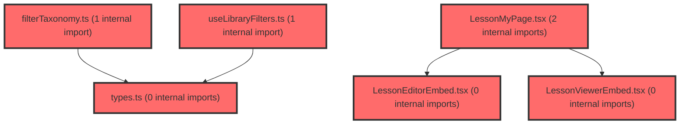

> [!IMPORTANT]
> **⚠️ 수동 검토 권장 (자가힐링 주의)**
>
> AI 자가힐링 결과물이 실제 의도와 다를 수 있으므로, **상세 리뷰 내용에 기반한 수동 점검**을 우선해 주시기 바랍니다. 자가힐링 기능을 활용하실 경우 최종 결과물을 신중하게 확인해 주세요.

# 코드 리뷰 - 60bde2c2

## 코드 복잡도 분석

**분석된 파일**: 15개 / 변경된 파일: 17개


### Import 의존관계 다이어그램



**범례**: 중심 파일 (변경됨) | 많은 import (10개 이상)


### 정상 범위 (NONE)


**`routes.tsx`** (other)

- 평균 복잡도: **0.057**

- 최대 복잡도: 0.463

- 청크 수: 22개

- 평균 사용처: 2.5곳


**권장사항:**

- 파일 크기가 큼 (22개 청크) - 파일 분리 검토


**`index.ts`** (component)

- 평균 복잡도: **0.034**

- 최대 복잡도: 0.461

- 청크 수: 27개

- 평균 사용처: 2.3곳


**권장사항:**

- 파일 크기가 큼 (27개 청크) - 파일 분리 검토


**`uselibraryfilters.ts`** (utility)

- 평균 복잡도: **0.004**

- 최대 복잡도: 0.010

- 청크 수: 8개


**권장사항:**

- 복잡도 정상 범위


**`lessonlibrarypage.tsx`** (utility)

- 평균 복잡도: **0.003**

- 최대 복잡도: 0.014

- 청크 수: 10개


**권장사항:**

- 복잡도 정상 범위


**`filterpanel.tsx`** (other)

- 평균 복잡도: **0.002**

- 최대 복잡도: 0.006

- 청크 수: 13개


**권장사항:**

- 복잡도 정상 범위


**`lessoneditorembed.tsx`** (component)

- 평균 복잡도: **0.002**

- 최대 복잡도: 0.007

- 청크 수: 6개


**권장사항:**

- 복잡도 정상 범위


**`lessonviewerembed.tsx`** (component)

- 평균 복잡도: **0.002**

- 최대 복잡도: 0.007

- 청크 수: 6개


**권장사항:**

- 복잡도 정상 범위


**`index.ts`** (other)

- 평균 복잡도: **0.001**

- 최대 복잡도: 0.005

- 청크 수: 6개


**권장사항:**

- 복잡도 정상 범위


**`filtertaxonomy.ts`** (other)

- 평균 복잡도: **0.001**

- 최대 복잡도: 0.005

- 청크 수: 12개


**권장사항:**

- 복잡도 정상 범위


**`types.ts`** (other)

- 평균 복잡도: **0.001**

- 최대 복잡도: 0.003

- 청크 수: 5개


**권장사항:**

- 복잡도 정상 범위


**`lessonlibraryheader.tsx`** (utility)

- 평균 복잡도: **0.001**

- 최대 복잡도: 0.007

- 청크 수: 12개


**권장사항:**

- 복잡도 정상 범위


**`index.ts`** (other)

- 평균 복잡도: **0.000**

- 최대 복잡도: 0.000

- 청크 수: 1개


**권장사항:**

- 복잡도 정상 범위


**`lessonmypage.tsx`** (component)

- 평균 복잡도: **0.000**

- 최대 복잡도: 0.000

- 청크 수: 8개


**권장사항:**

- 복잡도 정상 범위


**`lessonresultpage.tsx`** (component)

- 평균 복잡도: **0.000**

- 최대 복잡도: 0.001

- 청크 수: 5개


**권장사항:**

- 복잡도 정상 범위


**`index.ts`** (other)

- 평균 복잡도: **0.000**

- 최대 복잡도: 0.000

- 청크 수: 1개


**권장사항:**

- 복잡도 정상 범위


---


## 변경 배경

이 커밋은 `meta-dashboard` 프론트엔드에 **수업(lesson) 도메인**의 초기 골격을 추가하는 작업입니다. 기존에 `V2Placeholder`로만 존재하던 `/lesson/library`, `/lesson/my`, `/lesson/result` 라우트를 실제 페이지로 교체하고, everyCanvas SDK 임베드(저작/뷰어) PoC와 자료실 필터 UI를 구현했습니다.

- **목적**: 수업 자료실·나의 자료 화면의 UI 골격과 everyCanvas 슬라이드 임베드 PoC 구축
- **도메인**: UI (프론트엔드), 외부 SDK 연동 (everyCanvas)
- **변경 방향**: Placeholder → 실제 페이지/위젯/피처 구조로 전환, FSD Lite 구조 준수 시도

---

## [GOOD] 잘된 점

- **FSD 구조 준수**: `features/lesson`(필터 로직·UI), `widgets/lesson`(Header 조합), `pages/lesson`(조합만)으로 레이어를 명확히 분리했고, `pages`는 얇게 유지하려는 의도가 보입니다.
- **제어 컴포넌트 패턴**: `FilterPanel`이 상태를 소유하지 않고 `filters/sort/onToggle/onClear/onSort` props로 제어되어 재사용성과 테스트 용이성이 좋습니다.
- **임베드 cleanup 처리**: `LessonEditorEmbed`/`LessonViewerEmbed`에서 `cancelled` 플래그와 `handle?.destroy?.()`로 언마운트 시 SDK 인스턴스를 정리하는 패턴이 견고합니다.

---

## 변경사항 요약

수업 도메인의 라우트를 실제 페이지로 교체하고, everyCanvas SDK 임베드 PoC(저작/뷰어)와 자료실 다축 필터 UI(FilterPanel)를 FSD 구조로 신규 추가했습니다. 문서 2건(연동 계획, 필터 계획)도 함께 포함됩니다.

---

## [ISSUE] 개선이 필요한 부분

### Critical (즉시 수정 필요)

없음

### High (우선 수정 권장)

**LessonLibraryPage의 `getToken` 응답 처리 불일치**

`LessonEditorEmbed`/`LessonViewerEmbed`는 `json.token ?? json.resultData?.token` 폴백을 처리하지만, `LessonLibraryPage`는 `(await res.json()).token`만 접근합니다. LMS envelope 규격(`resultData`)에 따르면 실제 데이터는 `resultData`에 있으므로, 백엔드가 `resultData.token` 형태로 응답하면 `token`이 `undefined`가 되어 임베드가 실패합니다. 또한 `res.ok` 체크가 없어 4xx/5xx 응답 시 예외가 아닌 undefined 반환으로 이어집니다.

### Medium (개선 권장)

- **하드코딩된 상수 중복**: `EMBED_BASE_URL`(`https://t-everyclass.vsaidt.com`)과 `SLIDE_ID`(`slide_123`)가 `LessonEditorEmbed`, `LessonViewerEmbed`, `LessonLibraryPage` 3곳에 중복 정의되어 있습니다. 계획 문서에서도 `shared/config/env.ts`에 `EVERYCLASS_EMBED_BASE_URL` 추가를 검토 중이므로, 공통 상수로 추출하는 것이 좋습니다.
- **routes.tsx의 주석 처리된 중복 라우트**: `/lesson/library` 라우트가 주석으로 남아있어 혼란을 줄 수 있습니다. 제거하거나 명확한 TODO로 대체하는 것이 좋습니다.
- **`FilterGroup`의 `label` 타입 캐스팅**: `label: FilterAxis | 'sort'`에서 `'sort'`가 `FilterAxis`에 포함되지 않아 `label as FilterAxis` 캐스팅이 반복됩니다. `FilterAxis`에 `'sort'`를 포함하거나 별도 타입으로 분리하면 타입 안전성이 높아집니다.

---

## 주요 파일 분석

### frontend/src/pages/lesson/LessonLibraryPage.tsx

**변경 내용:** 자료실 페이지에 FilterPanel(Header)과 everyCanvas 뷰어 임베드 PoC를 추가.

**개선 제안:**

1. `getToken` 응답 처리 및 오류 체크 보강
   - **위치 (라인 30-34)**: `getToken` 콜백
   - **기존 코드**:
```ts
getToken: async () => {
  const res = await fetch(`/api/everyclass/embed-token?slideId=${SLIDE_ID}`);
  return (await res.json()).token;
},
```
   - **해결 방안 (수정 코드)**:
```ts
getToken: async () => {
  const res = await fetch(`/api/everyclass/embed-token?slideId=${SLIDE_ID}`);
  if (!res.ok) {
    throw new Error(`embed-token 발급 실패: ${res.status}`);
  }
  const json = (await res.json()) as {
    token?: string;
    resultData?: { token?: string };
  };
  const token = json.token ?? json.resultData?.token;
  if (!token) {
    throw new Error('embed-token 응답에 token 이 없습니다.');
  }
  return token;
},
```
   > LessonEditorEmbed/ViewerEmbed와 동일한 패턴으로 통일하여 envelope 규격과 오류 처리 일관성을 확보합니다.

2. 하드코딩 상수 제거
   - **위치 (라인 10-11)**: `EMBED_BASE_URL`, `SLIDE_ID`
   - **기존 코드**:
```ts
const EMBED_BASE_URL = 'https://t-everyclass.vsaidt.com';
const SLIDE_ID = 'slide_123';
```
   - **해결 방안 (수정 코드)**: `shared/config/env.ts`에 `EVERYCLASS_EMBED_BASE_URL`을 추가하고, `SLIDE_ID`는 PoC용이므로 명시적 상수로 분리하거나 주석으로 PoC임을 명시.
   > 계획 문서(§6)에서도 env 정리를 검토 중이므로, 이번 커밋에서 최소한 `EMBED_BASE_URL`을 공통 상수로 추출하는 것을 권장합니다.

### frontend/src/features/lesson/ui/FilterPanel/FilterPanel.tsx

**변경 내용:** 다축 필터 칩 UI를 Emotion으로 구현.

**개선 제안:**

1. `FilterGroup`의 `label` 타입 안전성 개선
   - **위치 (라인 70-72)**: `label: FilterAxis | 'sort'` 및 `label as FilterAxis` 캐스팅
   - **기존 코드**:
```ts
label: FilterAxis | 'sort';
...
onToggle?.(label as FilterAxis, value);
```
   - **해결 방안 (수정 코드)**: `FilterAxis`에 `'sort'`를 포함하거나, `FilterGroup`의 `label`을 `FilterAxis`로 제한하고 정렬은 별도 컴포넌트로 분리.
   > `'sort'`가 `FilterAxis`에 없어 `as` 캐스팅이 반복됩니다. 타입을 명확히 하면 캐스팅 제거가 가능합니다.

### frontend/src/app/router/routes.tsx

**변경 내용:** `/lesson/*` 라우트를 실제 페이지로 교체.

**개선 제안:**

1. 주석 처리된 중복 라우트 제거
   - **위치 (라인 268)**: `{/* <Route path='/lesson/library' element={<LessonLibraryPage />} /> */}`
   - **기존 코드**:
```tsx
{/* <Route path='/lesson/library' element={<LessonLibraryPage />} /> */}
```
   - **해결 방안 (수정 코드)**: 해당 주석 라인 제거.
   > 이미 상단에서 `/lesson/library`를 `LessonLibraryPage`로 매핑했으므로 중복 주석은 혼란만 유발합니다.

---

## 최종 평가

**결론**:
- [ ] [OK] **승인 (Approved)** - Critical/High 이슈 없음
- [x] [WARN] **조건부 승인 (Approved with Comments)** - Medium 이하 이슈만 존재
- [ ] [FIX] **수정 필요 (Changes Requested)** - Critical/High 이슈 존재

**종합 의견:**

FSD 구조와 제어 컴포넌트 패턴을 잘 지키며 수업 도메인의 초기 골격을 깔끔하게 잡았습니다. 다만 `LessonLibraryPage`의 `getToken`이 다른 임베드 컴포넌트와 응답 처리 방식이 달라 envelope 규격에서 실패할 가능성이 있으므로, 이를 통일하고 하드코딩 상수를 공통화하면 더 견고해질 것입니다. PoC 단계임을 감안하면 전반적으로 양호한 커밋입니다.