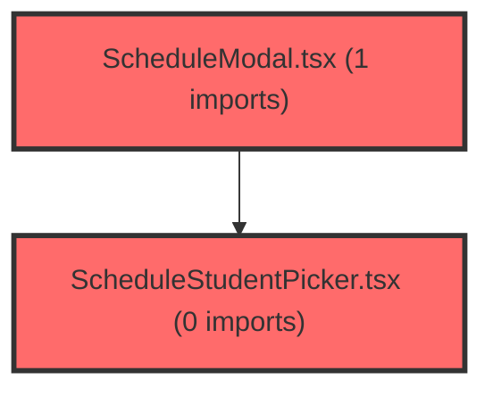

> [!IMPORTANT]
> **⚠️ 수동 검토 권장 (자가힐링 주의)**
>
> AI 자가힐링 결과물이 실제 의도와 다를 수 있으므로, **상세 리뷰 내용에 기반한 수동 점검**을 우선해 주시기 바랍니다. 자가힐링 기능을 활용하실 경우 최종 결과물을 신중하게 확인해 주세요.

# 코드 리뷰 - 611498c8

## 코드 복잡도 분석

**분석된 파일**: 4개 / 변경된 파일: 4개


### Import 의존관계 다이어그램



**범례**: 중심 파일 (변경됨) | 많은 import (10개 이상)


### 정상 범위 (NONE)


**`schedulemodal.tsx`** (other)

- 평균 복잡도: **0.001**

- 최대 복잡도: 0.013

- 청크 수: 52개


**권장사항:**

- 파일 크기가 큼 (52개 청크) - 파일 분리 검토


**`schedulepage.tsx`** (component)

- 평균 복잡도: **0.001**

- 최대 복잡도: 0.006

- 청크 수: 100개


**권장사항:**

- 파일 크기가 큼 (100개 청크) - 파일 분리 검토


**`classsummarycards.tsx`** (other)

- 평균 복잡도: **0.000**

- 최대 복잡도: 0.005

- 청크 수: 34개


**권장사항:**

- 파일 크기가 큼 (34개 청크) - 파일 분리 검토


**`schedulestudentpicker.tsx`** (other)

- 평균 복잡도: **0.000**

- 최대 복잡도: 0.007

- 청크 수: 102개


**권장사항:**

- 파일 크기가 큼 (102개 청크) - 파일 분리 검토


---


## [STATUS] 심각도별 이슈 요약

### Critical (즉시 수정 필요)
- 발견된 치명적 이슈 없음

### High (우선 수정 권장)
- 발견된 중요 이슈 없음

### Medium (개선 권장)
- 데이터 패칭 로직의 에러 처리 및 로딩 상태 관리 미흡
- 컴포넌트 프로퍼티 타입 안정성 및 기본값 처리 개선 필요
- 반 데이터가 없는 경우의 Edge Case 처리 부재

### Low (참고 사항)
- `useEffect` 의존성 배열의 불완전성
- 색상 팔레트 순환 로직의 예측 가능성 부족
- 일관되지 않은 널 체크 연산자 사용

## 변경사항 요약
이 커밋은 상담일정 기능에서 하드코딩된 mock 데이터를 실제 API 연동으로 전환하는 작업입니다. 주요 변경사항은:
1. `SchedulePage`에서 `groupService`를 통해 사용자의 소유 그룹(반)과 멤버(학생) 데이터를 동적으로 로드
2. 로드된 반 및 학생 데이터를 하위 컴포넌트(`ClassSummaryCards`, `ScheduleModal`, `ScheduleStudentPicker`)에 props로 전달
3. 반별 색상을 로컬 팔레트(`CLASS_COLOR_PALETTE`)에서 동적으로 할당
4. 기존 mock 데이터 임포트(`SCHEDULE_CLASSES`, `CLASS_COLORS`)를 타입 임포트로 대체

## 파일별 상세 분석

### frontend/src/pages/schedule/SchedulePage.tsx
**변경 내용:**
- `useAuth`와 `groupService`를 도입하여 실시간 반/학생 데이터 패칭
- `scheduleClasses`, `studentsMap`, `classColors` 상태 변수 추가 및 관리
- 하위 컴포넌트에 동적 데이터 전달을 위한 props 추가

**[PROBLEM] 발견된 문제:**
1. **[에러 처리 미흡]**: 데이터 패칭 실패 시 빈 목록만 유지하고 사용자 피드백 제공 안함
   - **위치 (라인 번호)**: 라인 287-292 (`catch` 블록)
   - **기존 코드**: 
     ```typescript
     } catch {
       // 에러 시 빈 목록 유지
     }
     ```
   - **해결 방안 (수정 코드)**:
     ```typescript
     } catch (error) {
       console.error('반/학생 데이터 로드 실패:', error);
       // 사용자에게 오류 알림 표시
       setScheduleClasses([]);
       setStudentsMap({});
       setClassColors({});
       // 오류 상태를 추적할 수 있는 상태 변수 추가 고려
     }
     ```
   - **위험도**: Medium
   - **영향**: API 호출 실패 시 사용자가 원인을 파악할 수 없으며, 빈 화면만 표시됨

2. **[로딩 상태 관리 부재]**: 데이터 로드 중임을 나타내는 UI 상태 없음
   - **위치 (라인 번호)**: 라인 249-251 (상태 선언 부분)
   - **기존 코드**: 로딩 상태 관련 변수 없음
   - **해결 방안 (수정 코드)**:
     ```typescript
     const [isLoading, setIsLoading] = useState(false);
     
     // useEffect 내부
     void (async () => {
       setIsLoading(true);
       try {
         // ... 기존 로직
       } catch (error) {
         // ... 에러 처리
       } finally {
         setIsLoading(false);
       }
     })();
     ```
   - **위험도**: Medium
   - **영향**: 데이터 로드 중 사용자가 빈 화면을 보게 되며, 로딩 지연 시 사용자 경험 저하

3. **[타입 안정성 문제]**: `CounselingStudent` 타입의 `id` 필드 처리 불일치
   - **위치 (라인 번호)**: 라인 279 (`stdtId || m.id`)
   - **기존 코드**:
     ```typescript
     id: m.stdtId || m.id,
     ```
   - **해결 방안 (수정 코드)**:
     ```typescript
     id: m.stdtId ?? m.id, // nullish coalescing 연산자 사용
     ```
   - **위험도**: Low
   - **영향**: `m.stdtId`가 빈 문자열('')일 경우 의도치 않게 `m.id`가 사용될 수 있음

**[GOOD] 잘된 점:**
- mock 데이터 의존성 제거로 실제 운영 환경 대응력 향상
- 반별 색상 동적 할당 로직의 단순성 유지
- 컴포넌트 분리와 props 전달 구조의 일관성 유지

### frontend/src/features/schedule/ui/ScheduleStudentPicker.tsx
**변경 내용:**
- 외부에서 주입받은 `classes`, `studentsMap`, `classColors` props 사용
- 초기 `activeTab` 설정 로직 수정

**[PROBLEM] 발견된 문제:**
1. **[초기 상태 설정 문제]**: `classes` 배열이 비어 있을 때 `activeTab` 상태 처리 미흡
   - **위치 (라인 번호)**: 라인 348-351 (`useState` 및 `useEffect`)
   - **기존 코드**:
     ```typescript
     const [activeTab, setActiveTab] = useState(classes[0]?.id ?? '');
     // ...
     useEffect(() => {
       if (isOpen) {
         setLocalSelection(selectedStudents);
         if (!activeTab && classes[0]?.id) {
           setActiveTab(classes[0].id);
         }
       }
     }, [isOpen, selectedStudents, classes, activeTab]);
     ```
   - **해결 방안 (수정 코드)**:
     ```typescript
     const [activeTab, setActiveTab] = useState('');
     
     useEffect(() => {
       if (isOpen) {
         setLocalSelection(selectedStudents);
         // classes가 비어있지 않으면서 activeTab이 설정되지 않았거나 유효하지 않을 때
         if (classes.length > 0 && (!activeTab || !classes.some(c => c.id === activeTab))) {
           setActiveTab(classes[0].id);
         }
       }
     }, [isOpen, selectedStudents, classes]);
     ```
   - **위험도**: Medium
   - **영향**: `classes` 배열이 비어있을 경우 빈 문자열 `activeTab`으로 인해 `studentsMap[activeTab]` 접근 시 빈 배열 반환

2. **[의존성 배열 불완전성]**: `useEffect` 의존성 배열에 `activeTab` 포함으로 인한 불필요한 재실행
   - **위치 (라인 번호)**: 라인 352 (의존성 배열)
   - **기존 코드**: `[isOpen, selectedStudents, classes, activeTab]`
   - **해결 방안 (수정 코드)**: `activeTab` 제거 (위 수정안 참고)
   - **위험도**: Low
   - **영향**: `activeTab`이 변경될 때마다 `useEffect`가 재실행되어 성능 저하 가능성

### frontend/src/features/schedule/ui/ClassSummaryCards.tsx
**변경 내용:**
- `classes`와 `classColors` props 추가
- `SCHEDULE_CLASSES`, `CLASS_COLORS` 대신 props 사용

**[PROBLEM] 발견된 문제:**
1. **[널 체크 일관성 부족]**: `classColors[cls.id]` 접근 시 다른 컴포넌트와 다른 널 체크 방식 사용
   - **위치 (라인 번호)**: 라인 130
   - **기존 코드**:
     ```typescript
     const color = classColors[cls.id] || '#9CA3AF';
     ```
   - **해결 방안 (수정 코드)**:
     ```typescript
     const color = classColors[cls.id] ?? '#9CA3AF'; // nullish coalescing 연산자로 일관성 유지
     ```
   - **위험도**: Low
   - **영향**: `classColors[cls.id]`가 빈 문자열('')일 경우 기본 색상이 적용되지 않음 (현재 로직상 발생 가능성 낮음)

## 보안 분석
**발견된 보안 취약점:**
특별한 보안 취약점은 발견되지 않았습니다. API 호출 시 인증된 사용자(`user.id`)를 사용하며, 민감 정보 노출 위험이 낮습니다.

**보안 체크리스트:**
- [✅] 인증/인가 검증: `useAuth` 훅을 통한 사용자 인증 확인
- [✅] 입력 검증 및 Sanitization: 내부 API 호출로 제한된 입력 소스
- [✅] 민감 정보 보호: 학생 정보는 인증된 사용자만 접근 가능
- [N/A] HTTPS/암호화 사용: 네트워크 레이어 이슈로 프론트엔드 단독 검증 불가

## 버그 가능성 분석
**잠재적 버그:**
1. **빈 반 목록 시 UI 오작동**: 사용자가 소유한 반이 없을 경우 컴포넌트들이 빈 데이터로 렌더링되어 기능 불가 상태
   - **재현 조건**: `ownerGroups`가 빈 배열인 경우
   - **예상 결과**: `ClassSummaryCards`에 카드가 표시되지 않으며, `ScheduleStudentPicker` 탭이 비어있음
   - **수정 방법**: 빈 상태에 대한 처리 UI 추가 (예: "소유한 반이 없습니다" 메시지)

2. **색상 할당의 비예측성**: `CLASS_COLOR_PALETTE` 순환 로직이 반 추가/삭제 시 색상 변화 발생
   - **재현 조건**: 반 구성이 변경된 후 페이지 재접속
   - **예상 결과**: 동일한 반이 다른 색상으로 표시되어 사용자 혼란
   - **수정 방법**: 반 ID 기반 결정적(deterministic) 색상 할당 알고리즘 적용

**Edge Case 검증:**
- [⚠️] Null/Undefined 처리: 대부분 처리되었으나 일부 개선 필요
- [❌] 빈 배열/객체 처리: 빈 반 목록 시 처리 미흡
- [✅] 경계값 (0, 음수, 최대값): 학생 번호(`number`)에 음수 처리 없음
- [N/A] 동시성 문제: 단일 사용자 환경에서 발생 가능성 낮음

## 성능 분석
**성능 이슈:**
1. **불필요한 재렌더링**: `ScheduleStudentPicker`의 `useEffect` 의존성 배열에 `activeTab` 포함으로 인한 재실행
   - **영향**: 탭 전환 시 불필요한 상태 설정 로직 실행
   - **개선 방법**: 의존성 배열에서 `activeTab` 제거 (위 수정안 참고)

2. **병렬 API 호출**: `ownerGroups.map` 내에서 `groupService.getGroupMembers` 병렬 호출
   - **영향**: 대량의 반 소유 시 API 호출 수가 증가하여 서버 부하 가능성
   - **개선 방법**: 필요한 경우 페이지네이션이나 배치 처리 고려

**성능 체크리스트:**
- [⚠️] 불필요한 연산 제거: `useEffect` 의존성 최적화 필요
- [✅] 캐싱 활용: 현재 미적용 (향상 기회 존재)
- [✅] 비동기 처리: `Promise.all`을 통한 효율적 병렬 처리
- [✅] 메모리 효율성: 큰 메모리 누수 위험 없음

## 코드 품질 평가
- **가독성**: 8/10 - 컴포넌트 분리와 props 전달이 명확하며, 타입 임포트가 적절히 사용됨
- **유지보수성**: 7/10 - mock 데이터 제거로 실제 환경 대응력 향상, 그러나 에러 처리와 로딩 상태 관리 개선 필요
- **테스트 커버리지**: 평가 불가 - 테스트 코드 없음
- **문서화**: 6/10 - 주석이 최소한으로만 사용되었으며, 복잡한 데이터 변환 로직에 대한 설명 부족

---

## 개선 제안 (우선순위별)

### 필수 (Must Fix)
1. 데이터 패칭 에러 처리 강화 - 사용자 피드백 메커니즘 추가
2. 로딩 상태 관리 구현 - 데이터 로드 중임을 나타내는 UI 제공

### 권장 (Should Fix)
1. 빈 반 목록 Edge Case 처리 - "소유한 반 없음" 상태 UI 구현
2. `useEffect` 의존성 배열 최적화 - 불필요한 재실행 방지
3. 타입 안정성 개선 - nullish coalescing 연산자 일관적 적용

### 선택 (Nice to Have)
1. 결정적(deterministic) 색상 할당 알고리즘 구현 - 반 ID 기반 색상 고정
2. API 호출 최적화 - 대량 반 소유 시 배치 처리 고려
3. 컴포넌트 내 지역 상태 기본값 개선 - 빈 데이터 처리 로직 통합

---

## 최종 평가

**종합 점수**: 75/100

**결론**: 
- [ ] [OK] **승인 (Approved)** - 문제 없음
- [✅] [WARN] **조건부 승인 (Approved with Comments)** - 경미한 이슈만 존재
- [ ] [FIX] **수정 필요 (Changes Requested)** - 중요 이슈 수정 후 재검토
- [ ] [REJECT] **거부 (Rejected)** - 치명적 이슈로 인한 병합 불가

**핵심 코멘트:**
본 커밋은 상담일정 기능의 mock 데이터 의존성을 제거하고 실제 API 연동으로 전환한 중요한 구조 개선 작업입니다. 기본적인 구현은 정상적으로 동작하지만, 프로덕션 환경에서의 안정성을 위해 에러 처리와 로딩 상태 관리가 반드시 보강되어야 합니다. 또한 데이터가 없는 Edge Case 상황에 대한 UI/UX 고려가 필요합니다.

**리뷰어 노트:**
- 검토 시간: 예상 45분
- 우선 수정 항목:
  1. 데이터 패칭 에러 처리 및 사용자 피드백 구현
  2. 로딩 상태 표시 UI 추가
  3. 빈 반 목록 상태 처리 로직 구현