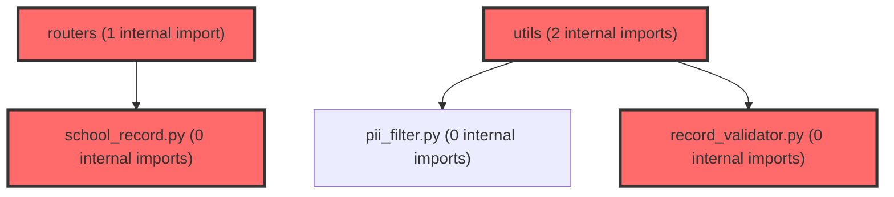

> [!IMPORTANT]
> **⚠️ 수동 검토 권장 (자가힐링 주의)**
>
> AI 자가힐링 결과물이 실제 의도와 다를 수 있으므로, **상세 리뷰 내용에 기반한 수동 점검**을 우선해 주시기 바랍니다. 자가힐링 기능을 활용하실 경우 최종 결과물을 신중하게 확인해 주세요.

# 코드 리뷰 - 61c07127

## 코드 복잡도 분석

**분석된 파일**: 9개 / 변경된 파일: 17개


### Import 의존관계 다이어그램



**범례**: 중심 파일 (변경됨) | 많은 import (10개 이상)


### 정상 범위 (NONE)


**`main.py`** (other)

- 평균 복잡도: **0.204**

- 최대 복잡도: 0.471

- 청크 수: 7개

- 평균 사용처: 6.9곳


**권장사항:**

- 복잡도 정상 범위


**`__init__.py`** (utility)

- 평균 복잡도: **0.157**

- 최대 복잡도: 0.304

- 청크 수: 2개

- 평균 사용처: 3.0곳


**권장사항:**

- 복잡도 정상 범위


**`school_record.py`** (other)

- 평균 복잡도: **0.005**

- 최대 복잡도: 0.009

- 청크 수: 3개


**권장사항:**

- 복잡도 정상 범위


**`__init__.py`** (other)

- 평균 복잡도: **0.004**

- 최대 복잡도: 0.004

- 청크 수: 1개


**권장사항:**

- 복잡도 정상 범위


**`school_record_service.py`** (other)

- 평균 복잡도: **0.004**

- 최대 복잡도: 0.010

- 청크 수: 10개


**권장사항:**

- 복잡도 정상 범위


**`test_school_record.py`** (other)

- 평균 복잡도: **0.004**

- 최대 복잡도: 0.010

- 청크 수: 32개


**권장사항:**

- 파일 크기가 큼 (32개 청크) - 파일 분리 검토


**`school_record_policy.py`** (other)

- 평균 복잡도: **0.003**

- 최대 복잡도: 0.005

- 청크 수: 5개


**권장사항:**

- 복잡도 정상 범위


**`school_record.py`** (other)

- 평균 복잡도: **0.003**

- 최대 복잡도: 0.006

- 청크 수: 10개


**권장사항:**

- 복잡도 정상 범위


**`record_validator.py`** (utility)

- 평균 복잡도: **0.002**

- 최대 복잡도: 0.006

- 청크 수: 5개


**권장사항:**

- 복잡도 정상 범위


---


## 변경 배경
이 커밋은 생활기록부(행동특성 및 종합의견) 문구를 AI로 생성하는 신규 기능을 추가합니다. 프론트엔드가 전달한 학생 정보(검사 요인, 관찰 입력)를 바탕으로 단건/일괄 생성 API 2종(단발, SSE 스트림)을 제공합니다.
- **목적**: 학교생활기록부 기재 정책을 준수하는 문구를 자동 생성하고, 단건·일괄을 하나의 요청 계약으로 통합
- **도메인**: 비즈니스 로직 (AI 에이전트 API 서버)
- **변경 방향**: 기존 `/chat` 계열과 분리된 신규 도메인 라우터를 신설하고, 정책 텍스트를 `.md` 파일로 분리해 기획자가 직접 수정 가능하게 함

## [GOOD] 잘된 점
- **정책과 코드의 분리**: 프롬프트 문구를 `prompts/school_record_*.md`로 분리하고, 코드에는 구조화된 값만 두어 기획자와 개발자의 책임 경계가 명확함
- **PII 원칙 준수**: 학생 이름·학번을 요청 스키마에 아예 포함하지 않는 "미전송" 방식으로 설계해 마스킹보다 근본적으로 개인정보 노출을 차단함
- **오탐 방지에 대한 깊은 고민**: `record_validator.py`에서 원본 `PROHIBITED_KEYWORDS`의 부분문자열 오탐 문제를 분석하고 `_DROPPED_KEYWORDS`로 제외 사유를 명시한 점이 우수함
- **학생 단위 실패 격리**: `_guarded`로 예외를 학생 단위로 가둬 10명 중 1명 실패가 나머지 결과를 버리지 않도록 설계함

## 변경사항 요약
생활기록부 문구 생성 기능을 위한 라우터/서비스/모델/정책/검증 모듈을 신규 추가하고, 학교급별 프롬프트 지침을 `.md` 파일로 분리했습니다. 단건·일괄을 하나의 요청 계약으로 통합하고 SSE 스트리밍을 지원합니다.

---

## [ISSUE] 개선이 필요한 부분

### Critical (즉시 수정 필요)
없음

### High (우선 수정 권장)
1. **`_stream_sequential`의 재생성 경로에서 이중 타임아웃 및 heartbeat 누락 가능성**
   - `_stream_with_heartbeat`가 이미 `STUDENT_TIMEOUT_SECONDS`(30초)로 생성 시간을 제한하지만, 재생성 경로에서 `_guarded`를 `asyncio.create_task`로 실행하고 `_await_with_heartbeat`로 기다립니다. `_guarded` 내부에서 다시 `asyncio.wait_for(..., timeout=STUDENT_TIMEOUT_SECONDS)`를 걸어 이중 타임아웃이 됩니다. 이는 치명적이진 않지만, 재생성에 30초가 걸리면 전체 스트림이 60초까지 늘어날 수 있습니다.
   - **위치**: `agent/app/services/school_record_service.py` `_stream_sequential` 내 재생성 블록

2. **`_stream_prefetched`에서 `_await_with_heartbeat`가 타임아웃 없이 무한 대기 가능**
   - `_await_with_heartbeat`는 `asyncio.wait({task}, timeout=HEARTBEAT_SECONDS)`로 heartbeat만 보내고 task 완료를 무한정 기다립니다. task 내부 `_guarded`가 30초 타임아웃을 걸긴 하지만, `_guarded`의 `asyncio.wait_for`가 취소되면 `CancelledError`가 발생해 `_guarded`의 `except asyncio.CancelledError: raise`로 전파됩니다. 이 경우 task가 예외로 끝나 `task.result()`에서 예외가 발생해 스트림이 중단될 수 있습니다. 다만 `_await_with_heartbeat`의 `finally`에서 task를 취소하므로 자원 누수는 없습니다.

### Medium (개선 권장)
1. **`_finalize`에서 재생성 후 남은 위반 경고 중복**
   - `_generate_one`에서 재생성 후에도 `needs_retry`가 True면 `warnings + check_blocking(text)`를 추가합니다. 그런데 `_finalize`가 이미 `warnings`에 `check_warnings` 결과를 담고, `check_blocking`은 별도로 호출해 `ForbiddenHit`로 변환합니다. 이때 `check_blocking`이 반환한 항목이 `warnings`에 이미 포함된 `check_warnings` 항목과 중복될 수 있습니다(예: "경시대회"는 `_BLOCKING_PATTERNS`와 `_WARNING_PATTERNS` 양쪽에 존재). 중복 경고가 교사에게 혼선을 줄 수 있습니다.
   - **위치**: `agent/app/services/school_record_service.py` `_generate_one` 마지막 부분

2. **`_system_prompt`의 `SCHOOL_LEVEL_GUIDELINES.get(req.school_level_code, ...)` 타입 안전성**
   - `req.school_level_code`는 `Optional[SchoolLevelCode]`이지만 `model_validator`에서 항상 유도되므로 실제로는 None이 아닙니다. 다만 타입 시스템상 Optional이므로, `get()`의 기본값 분기가 사실상 죽은 코드입니다. 명시적으로 `assert`하거나 타입을 좁히면 가독성이 좋아집니다.

3. **`_stream_sequential`의 `_stream_with_heartbeat`와 `_await_with_heartbeat`의 타임아웃 정책 불일치**
   - `_stream_with_heartbeat`는 생성 시간에만 타임아웃을 걸지만, `_await_with_heartbeat`는 타임아웃이 없어 heartbeat만 계속 보냅니다. 두 경로의 타임아웃 정책이 달라 일관성이 부족합니다.

---

## 주요 파일 분석

### agent/app/services/school_record_service.py
**변경 내용:**
생활기록부 문구 생성 오케스트레이션 서비스. 단발/스트리밍 경로를 분리하고, 학생 단위 실패 격리와 heartbeat를 구현.

**개선 제안:**
1. **재생성 경로의 이중 타임아웃 제거**
   - **위치**: `_stream_sequential` 재생성 블록 (약 470-490행)
   - **기존 코드**:
```python
retry = asyncio.create_task(
    self._guarded(req, student, index, avoid_openings)
)
result = error = None
async for kind, payload in self._await_with_heartbeat(retry):
```
   - **해결 방안**: `_guarded`가 이미 30초 타임아웃을 걸므로, 재생성 경로에서는 `_await_with_heartbeat` 대신 `_guarded`의 결과를 직접 기다리되 heartbeat를 유지하는 별도 헬퍼를 사용하거나, `_guarded`의 타임아웃을 재생성 시 더 짧게 조정하는 것을 고려하세요. 다만 이는 설계 판단이 필요하므로 **[수정 코드 제시 불가 — 문맥 파악 충분하나 설계 결정 필요]**

2. **경고 중복 방지**
   - **위치**: `_generate_one` 마지막 부분
   - **기존 코드**:
```python
if needs_retry:
    warnings = warnings + [ForbiddenHit(**hit) for hit in check_blocking(text)]
```
   - **해결 방안**: `check_blocking` 결과를 `warnings`에 추가하기 전에, 이미 `warnings`에 같은 `match`가 있는지 필터링하세요.
```python
if needs_retry:
    existing = {w.match for w in warnings}
    warnings = warnings + [
        ForbiddenHit(**hit) for hit in check_blocking(text)
        if hit["match"] not in existing
    ]
```

### agent/app/utils/record_validator.py
**변경 내용:**
금지어 2단 검증(차단/경고), 마크다운 제거, 글자 수 계산.

**개선 제안:**
1. **`_BLOCKING_PATTERNS`와 `_WARNING_PATTERNS`의 중복 키워드**
   - "경시대회"가 `_BLOCKING_PATTERNS`(대회·수상 표현)와 `_WARNING_PATTERNS`(외부 실적) 양쪽에 존재합니다. 차단이 우선이므로 경고에서 제외해 중복을 방지하는 것이 좋습니다.
   - **위치**: `_WARNING_PATTERNS`의 `(re.compile(r"자격증|영재교육원|경시대회"), "외부 실적")` 라인
   - **기존 코드**:
```python
(re.compile(r"자격증|영재교육원|경시대회"), "외부 실적"),
```
   - **해결 방안**:
```python
(re.compile(r"자격증|영재교육원"), "외부 실적"),
```

### agent/app/models/school_record.py
**변경 내용:**
요청/응답/이벤트 스키마 정의. PII 미전송 원칙과 검증 로직 포함.

**개선 제안:**
1. **`school_level_code` Optional 타입과 validator의 불일치**
   - `model_validator`에서 항상 값을 유도하므로, `school_level_code`가 None이 될 수 없습니다. 타입을 명확히 하거나 validator에서 `assert`로 보장하면 타입 안전성이 높아집니다.

---

## 최종 평가

**결론**: 
- [ ] [OK] **승인 (Approved)** - Critical/High 이슈 없음
- [x] [WARN] **조건부 승인 (Approved with Comments)** - Medium 이하 이슈만 존재
- [ ] [FIX] **수정 필요 (Changes Requested)** - Critical/High 이슈 존재

**종합 의견:**
전반적으로 설계가 매우 성숙하고 정책 준수에 대한 고민이 깊게 반영된 우수한 커밋입니다. PII 미전송 원칙, 학생 단위 실패 격리, 오탐 방지 분석 등이 특히 돋보입니다. 다만 스트리밍 경로의 타임아웃 정책이 경로별로 일관되지 않고, 차단/경고 패턴 간 키워드 중복으로 인한 경고 중복 가능성이 있어 이 부분만 정리하면 더 견고해질 것입니다.