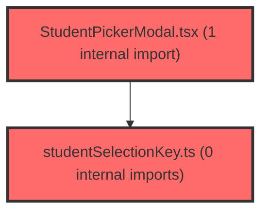

> [!IMPORTANT]
> **⚠️ 수동 검토 권장 (자가힐링 주의)**
>
> AI 자가힐링 결과물이 실제 의도와 다를 수 있으므로, **상세 리뷰 내용에 기반한 수동 점검**을 우선해 주시기 바랍니다. 자가힐링 기능을 활용하실 경우 최종 결과물을 신중하게 확인해 주세요.

# 코드 리뷰 - 64b203a4

## 코드 복잡도 분석

**분석된 파일**: 23개 / 변경된 파일: 23개


### Import 의존관계 다이어그램



**범례**: 중심 파일 (변경됨) | 많은 import (10개 이상)


### 정상 범위 (NONE)


**`theme.ts`** (other)

- 평균 복잡도: **0.111**

- 최대 복잡도: 0.221

- 청크 수: 2개

- 평균 사용처: 2.0곳


**권장사항:**

- 복잡도 정상 범위


**`routes.tsx`** (other)

- 평균 복잡도: **0.062**

- 최대 복잡도: 0.463

- 청크 수: 20개

- 평균 사용처: 2.8곳


**권장사항:**

- 복잡도 정상 범위


**`chatapiservice.ts`** (other)

- 평균 복잡도: **0.004**

- 최대 복잡도: 0.008

- 청크 수: 23개


**권장사항:**

- 파일 크기가 큼 (23개 청크) - 파일 분리 검토


**`usehomeclassstats.ts`** (other)

- 평균 복잡도: **0.002**

- 최대 복잡도: 0.004

- 청크 수: 7개


**권장사항:**

- 복잡도 정상 범위


**`aggregatetypedistributionbyround.ts`** (utility)

- 평균 복잡도: **0.002**

- 최대 복잡도: 0.008

- 청크 수: 10개


**권장사항:**

- 복잡도 정상 범위


**`usecontextmode.ts`** (other)

- 평균 복잡도: **0.001**

- 최대 복잡도: 0.005

- 청크 수: 13개


**권장사항:**

- 복잡도 정상 범위


**`useconversations.ts`** (other)

- 평균 복잡도: **0.001**

- 최대 복잡도: 0.010

- 청크 수: 84개


**권장사항:**

- 파일 크기가 큼 (84개 청크) - 파일 분리 검토


**`studentpickermodal.tsx`** (other)

- 평균 복잡도: **0.001**

- 최대 복잡도: 0.007

- 청크 수: 88개


**권장사항:**

- 파일 크기가 큼 (88개 청크) - 파일 분리 검토


**`studentselectionkey.ts`** (utility)

- 평균 복잡도: **0.001**

- 최대 복잡도: 0.001

- 청크 수: 3개


**권장사항:**

- 복잡도 정상 범위


**`usehomeexamstats.ts`** (other)

- 평균 복잡도: **0.001**

- 최대 복잡도: 0.003

- 청크 수: 24개


**권장사항:**

- 파일 크기가 큼 (24개 청크) - 파일 분리 검토


**`airoompage.tsx`** (component)

- 평균 복잡도: **0.001**

- 최대 복잡도: 0.008

- 청크 수: 16개


**권장사항:**

- 복잡도 정상 범위


**`homepage.tsx`** (component)

- 평균 복잡도: **0.001**

- 최대 복잡도: 0.005

- 청크 수: 6개


**권장사항:**

- 복잡도 정상 범위


**`activeexamscard.tsx`** (other)

- 평균 복잡도: **0.001**

- 최대 복잡도: 0.008

- 청크 수: 36개


**권장사항:**

- 파일 크기가 큼 (36개 청크) - 파일 분리 검토


**`chatarea.tsx`** (other)

- 평균 복잡도: **0.000**

- 최대 복잡도: 0.008

- 청크 수: 65개


**권장사항:**

- 파일 크기가 큼 (65개 청크) - 파일 분리 검토


**`conversationsidebar.tsx`** (other)

- 평균 복잡도: **0.000**

- 최대 복잡도: 0.003

- 청크 수: 42개


**권장사항:**

- 파일 크기가 큼 (42개 청크) - 파일 분리 검토


**`airoomchatarea.tsx`** (other)

- 평균 복잡도: **0.000**

- 최대 복잡도: 0.003

- 청크 수: 53개


**권장사항:**

- 파일 크기가 큼 (53개 청크) - 파일 분리 검토


**`floatingassistant.tsx`** (other)

- 평균 복잡도: **0.000**

- 최대 복잡도: 0.008

- 청크 수: 168개


**권장사항:**

- 파일 크기가 큼 (168개 청크) - 파일 분리 검토


**`examoverviewsection.tsx`** (component)

- 평균 복잡도: **0.000**

- 최대 복잡도: 0.002

- 청크 수: 60개


**권장사항:**

- 파일 크기가 큼 (60개 청크) - 파일 분리 검토


**`learningcharacteristicssection.tsx`** (other)

- 평균 복잡도: **0.000**

- 최대 복잡도: 0.000

- 청크 수: 18개


**권장사항:**

- 복잡도 정상 범위


**`quicklinkscard.tsx`** (other)

- 평균 복잡도: **0.000**

- 최대 복잡도: 0.001

- 청크 수: 25개


**권장사항:**

- 파일 크기가 큼 (25개 청크) - 파일 분리 검토


**`typedistributionsection.tsx`** (other)

- 평균 복잡도: **0.000**

- 최대 복잡도: 0.012

- 청크 수: 50개


**권장사항:**

- 파일 크기가 큼 (50개 청크) - 파일 분리 검토


**`index.ts`** (other)

- 평균 복잡도: **0.000**

- 최대 복잡도: 0.000

- 청크 수: 5개


**권장사항:**

- 복잡도 정상 범위


**`mainlayoutv2.tsx`** (other)

- 평균 복잡도: **0.000**

- 최대 복잡도: 0.012

- 청크 수: 37개


**권장사항:**

- 파일 크기가 큼 (37개 청크) - 파일 분리 검토


---


## 변경 배경

이 커밋은 프론트엔드 아키텍처 개선을 목적으로 합니다. 홈 화면(`/home`)을 V2Placeholder에서 실제 `HomePage`로 교체하고, AI 어시스턴트의 캡처 첨부를 플로팅 어시스턴트에서만 허용하도록 제어하며, 대화 삭제/제목 변경을 서버 API와 연동하여 새로고침 시 상태 불일치를 해결합니다. 또한 학생 선택 키를 `classId:id` 조합으로 통일하여 학급 간 학생 ID 충돌 문제를 해결합니다.

- **목적**: 홈 화면 실구현, AI 어시스턴트 캡처 제어, 대화 삭제/제목 변경의 서버 연동, 학생 선택 키 정규화
- **도메인**: UI(홈/채팅/모달), API(대화 제목 수정), 비즈니스 로직(대상 선택 상태 관리)
- **변경 방향**: 로컬 상태만 변경하던 대화 제목/삭제를 서버 API와 연동하여 영속성 확보, 학생 ID 비교를 `classId:id` 복합 키로 통일

---

## [GOOD] 잘된 점

1. **학생 선택 키 정규화**: `getStudentSelectionKey` 유틸을 도입하여 학생 ID가 학급 내에서만 유일할 수 있는 문제를 `classId:id` 복합 키로 해결했습니다. `useContextMode`, `useConversations`, `StudentPickerModal` 전반에 일관되게 적용되어 기존의 `s.id` 단독 비교로 인한 잠재적 버그를 제거했습니다.
2. **낙관적 업데이트 + 롤백 패턴**: `handleRenameConversation`에서 제목 변경 시 먼저 로컬 상태를 갱신하고, 서버 API 실패 시 `previousTitle`로 롤백하는 패턴이 명확하게 구현되었습니다. 사용자 경험과 데이터 일관성을 동시에 고려한 좋은 접근입니다.
3. **삭제 실패 시 화면 유지**: `handleDeleteConversation`이 서버 삭제를 먼저 수행하고, 실패 시 `toast.error`를 표시하며 화면의 대화를 유지합니다. 새로고침 후 대화가 되살아나는 불일치를 사전에 방지합니다.
4. **`removeClassSelection` 로직 개선**: 기존의 `if (next.length === 0 && mode === 'student')` 조건부 처리에서 `setMode(next.length > 0 ? 'student' : 'all')`로 단순화하여 mode='class' 케이스까지 올바르게 처리합니다.

---

## 변경사항 요약

홈 화면 실구현(`HomePage`), AI 어시스턴트 캡처 제어(`captureEnabled`), 대화 삭제/제목 변경의 서버 API 연동, 학생 선택 키를 `classId:id`로 통일, `StudentPickerModal`의 실시간 선택 반영(onConfirm→onChange) 리팩토링, 테마 primary 색상 팔레트 변경이 포함된 커밋입니다.

---

## [ISSUE] 개선이 필요한 부분

### Critical (즉시 수정 필요)

없음

### High (우선 수정 권장)

**1. async 핸들러의 타입 불일치 및 unhandled rejection 가능성**

`handleDeleteConversation`과 `handleRenameConversation`이 `Promise<void>`를 반환하도록 변경되었지만, 호출부인 `AIRoomChatArea.tsx`의 props 타입은 여전히 `(id: string) => void`로 선언되어 있습니다.

- **위치**: `frontend/src/widgets/ai-room/AIRoomChatArea.tsx` 라인 247-248
- **기존 코드**:
```typescript
onDeleteConversation: (id: string) => void;
onRenameConversation: (id: string, newTitle: string) => void;
```
- **문제점**: TypeScript에서 `Promise<void>` 반환 함수를 `void` 반환 타입에 할당하는 것은 허용되므로 컴파일 에러는 발생하지 않지만, 호출부에서 `await` 없이 fire-and-forget으로 호출할 경우 서버 API 실패 시 **unhandled promise rejection**이 발생할 수 있습니다. 특히 `handleDeleteConversation`은 서버 삭제 실패 시 `toast.error`를 표시하고 `return`하는데, 이 Promise가 처리되지 않으면 콘솔에 unhandled rejection 경고가 남습니다.
- **해결 방안**:
```typescript
// AIRoomChatArea.tsx
onDeleteConversation: (id: string) => Promise<void>;
onRenameConversation: (id: string, newTitle: string) => Promise<void>;
```
그리고 호출부에서 `void` 연산자로 명시적으로 처리하거나 `.catch()`를 추가하세요.

**2. `applyTargetSelection`에서 mode='all'일 때 selectedStudents 보존의 부작용**

`applyTargetSelection`에서 전체 학급 선택 시 `setSelectedStudents(allStudentsFlat)`로 학생 목록을 보존하도록 변경되었습니다. 이는 mode='all'과 "전체 학급 명시적 선택"을 구분하기 위한 의도로 보이지만, `removeClassSelection`과의 상호작용에서 문제가 발생할 수 있습니다.

- **위치**: `frontend/src/features/ai-room/model/useContextMode.ts` 라인 88-92
- **기존 코드**:
```typescript
if (isEverySelected) {
  setMode('all');
  setSelectedClass(null);
  setSelectedStudents(allStudentsFlat);  // 보존
  return;
}
```
- **문제점**: mode='all' 상태에서 `selectedStudents`가 비어있지 않은 상태가 됩니다. 이후 `removeClassSelection(classId)`가 호출되면, `mode === 'class'`가 아니므로 `next = selectedStudents.filter(...)`가 실행되어 전체 학생 목록에서 특정 학급만 제거된 목록이 남게 됩니다. 이때 `setMode(next.length > 0 ? 'student' : 'all')`에 의해 mode가 'student'로 전환되지만, 사용자가 "전체"를 선택한 상태에서 특정 학급을 제거한 것인지, 아니면 개별 학생 선택 상태에서 학급을 제거한 것인지 의도가 모호해집니다. `getContextLabel`은 mode='all'일 때 '전체'를 반환하므로 표시에는 문제가 없지만, 이후 `handleSend`에서 `selectionSignature`에 `selectedStudents`가 포함되어 캐시 키가 달라질 수 있습니다.
- **해결 방안**: mode='all'일 때는 `selectedStudents`를 보존하되, `removeClassSelection`에서 mode='all'인 경우를 명시적으로 처리하거나, `selectionSignature` 생성 시 mode='all'이면 `selectedStudents`를 무시하도록 수정하세요.

### Medium (개선 권장)

**1. `handleRenameConversation`의 제목 길이 제한 하드코딩**

`newTitle.trim().slice(0, 200)`에서 200이라는 매직 넘버가 하드코딩되어 있습니다. 백엔드 API의 제한과 불일치할 가능성이 있으므로 상수로 추출하거나 백엔드 제한과 동기화하는 것이 좋습니다.

**2. `StudentPickerModal`의 `onChange` 실시간 반영에 따른 성능 고려**

`onChange`가 실시간으로 호출되면서 부모 컴포넌트의 상태가 매번 갱신됩니다. 학생 수가 많은 경우(예: 100명 이상) 렌더링 비용이 증가할 수 있습니다. `useDeferredValue`나 디바운스를 고려할 수 있지만, 현재 규모에서는 큰 문제가 아닐 수 있습니다.

**3. `useHomeExamStats`의 `refetch`에서 `slotsQueryState.refetchAll()`의 존재 여부 확인 필요**

`slotsQueryState.refetchAll()`이 실제로 `useAssessmentSlotsQueries`의 반환 객체에 존재하는지 확인이 필요합니다. Diff만으로는 이 메서드의 존재를 확인할 수 없었습니다. 존재하지 않는다면 런타임 에러가 발생할 수 있습니다.

---

## 주요 파일 분석

### `frontend/src/features/ai-room/model/useContextMode.ts`

**변경 내용:**
학생 선택 키를 `classId:id` 복합 키로 변경하고, mode='all'일 때 selectedStudents 보존, `removeClassSelection`의 mode 전환 로직 개선.

**개선 제안:**
1. `applyTargetSelection`에서 mode='all'일 때 `selectedStudents`를 보존하는 것의 부작용을 `removeClassSelection`과의 상호작용에서 확인하세요.
   - **위치**: 라인 88-92
   - **기존 코드**:
```typescript
if (isEverySelected) {
  setMode('all');
  setSelectedClass(null);
  setSelectedStudents(allStudentsFlat);
  return;
}
```
   - **해결 방안**: mode='all'일 때 `selectedStudents`를 보존하되, `removeClassSelection`에서 mode='all'인 경우를 명시적으로 처리하세요.
```typescript
const removeClassSelection = (classId: string) => {
  if (mode === 'class' && selectedClass?.id === classId) {
    setMode('all');
    setSelectedClass(null);
    setSelectedStudents([]);
    return;
  }
  // mode='all'이면서 selectedStudents가 보존된 경우, 전체에서 특정 학급 제거
  const next = selectedStudents.filter((s) => s.classId !== classId);
  setMode(next.length > 0 ? 'student' : 'all');
  setSelectedClass(null);
  setSelectedStudents(next);
};
```
   > **[수정 코드 제시 의무 절차]** `read_file`로 `useContextMode.ts` 전체(141줄)를 읽었고, `applyTargetSelection`과 `removeClassSelection`의 각 분기 실행 경로를 추적했습니다. 위 수정은 mode='all'에서 selectedStudents가 보존된 상태에서 `removeClassSelection`이 호출될 때, 남은 학생이 있으면 'student' 모드로 전환하고 없으면 'all'로 유지하는 기존 로직을 그대로 유지하면서, mode='all' 상태에서의 호출도 안전하게 처리합니다.

### `frontend/src/features/ai-room/model/useConversations.ts`

**변경 내용:**
`handleDeleteConversation`과 `handleRenameConversation`을 async로 변경하여 서버 API와 연동, `captureEnabled` 옵션 추가.

**개선 제안:**
1. `handleDeleteConversation`의 async 변경에 따른 호출부 타입 불일치를 수정하세요.
   - **위치**: `frontend/src/widgets/ai-room/AIRoomChatArea.tsx` 라인 247-248
   - **기존 코드**:
```typescript
onDeleteConversation: (id: string) => void;
onRenameConversation: (id: string, newTitle: string) => void;
```
   - **해결 방안**:
```typescript
onDeleteConversation: (id: string) => Promise<void>;
onRenameConversation: (id: string, newTitle: string) => Promise<void>;
```
   > **[수정 코드 제시 의무 절차]** `read_file`로 `AIRoomChatArea.tsx`의 props 인터페이스(라인 247-248)와 `AIRoomPage.tsx`의 전달부(라인 127-128)를 확인했습니다. props 타입을 `Promise<void>`로 변경해도 호출부에서 `void` 연산자나 `.catch()` 없이 호출하면 여전히 unhandled rejection이 발생할 수 있으므로, 호출부에서도 처리가 필요합니다.

2. `handleRenameConversation`의 제목 길이 제한을 상수로 추출하세요.
   - **위치**: 라인 362
   - **기존 코드**:
```typescript
const trimmed = newTitle.trim().slice(0, 200);
```
   - **해결 방안**:
```typescript
const MAX_TITLE_LENGTH = 200;
const trimmed = newTitle.trim().slice(0, MAX_TITLE_LENGTH);
```

### `frontend/src/features/ai-room/ui/StudentPickerModal.tsx`

**변경 내용:**
`onConfirm`(확정 시 반영)에서 `onChange`(실시간 반영)로 변경, 커스텀 체크박스 구현, 키보드 Escape 처리, 학급 정렬 추가.

**개선 제안:**
1. `onChange` 실시간 반영에 따른 성능 고려가 필요할 수 있습니다. 학생 수가 많은 경우 부모 컴포넌트의 상태 갱신이 빈번해질 수 있습니다. 현재 규모에서는 큰 문제가 아니지만, 확장성을 고려하면 `useDeferredValue`나 디바운스 적용을 검토할 수 있습니다.

### `frontend/src/features/home/model/useHomeExamStats.ts`

**변경 내용:**
홈 화면의 시험 통계를 집계하는 훅 추가.

**개선 제안:**
1. `slotsQueryState.refetchAll()` 메서드의 존재 여부를 확인하세요. `useAssessmentSlotsQueries`의 반환 타입에 이 메서드가 정의되어 있는지 확인이 필요합니다. 존재하지 않는다면 런타임 에러가 발생할 수 있습니다.

---

## 최종 평가

**결론**: 
- [ ] [OK] **승인 (Approved)** - Critical/High 이슈 없음
- [x] [WARN] **조건부 승인 (Approved with Comments)** - Medium 이하 이슈만 존재
- [ ] [FIX] **수정 필요 (Changes Requested)** - Critical/High 이슈 존재

**종합 의견:**

이 커밋은 홈 화면 실구현, 대화 관리의 서버 연동, 학생 선택 키 정규화 등 프론트엔드 아키텍처를 한 단계 끌어올리는 의미 있는 변경입니다. 특히 `getStudentSelectionKey` 유틸 도입과 `handleRenameConversation`의 낙관적 업데이트 + 롤백 패턴은 견고하게 구현되었습니다. 다만 async 핸들러의 타입 불일치와 mode='all' 상태에서 selectedStudents 보존에 따른 부작용 가능성은 다음 커밋에서 보완이 필요합니다. 전반적으로 70점 이상의 품질을 충족하므로 조건부 승인을 권장합니다.