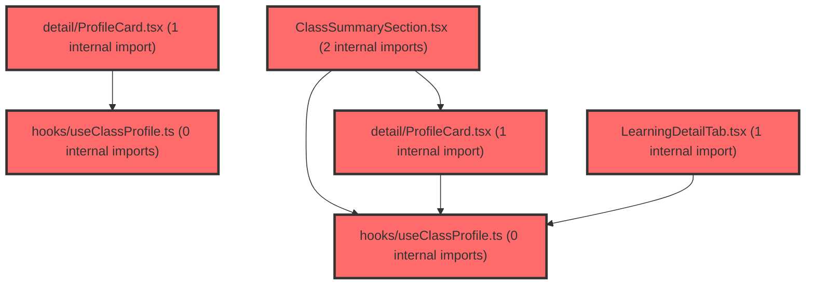

> [!IMPORTANT]
> **⚠️ 수동 검토 권장 (자가힐링 주의)**
>
> AI 자가힐링 결과물이 실제 의도와 다를 수 있으므로, **상세 리뷰 내용에 기반한 수동 점검**을 우선해 주시기 바랍니다. 자가힐링 기능을 활용하실 경우 최종 결과물을 신중하게 확인해 주세요.

# 코드 리뷰 - 68bc730a

## 코드 복잡도 분석

**분석된 파일**: 14개 / 변경된 파일: 15개


### Import 의존관계 다이어그램



**범례**: 중심 파일 (변경됨) | 많은 import (10개 이상)


### 모니터링 권장 (LOW)


**`profilecard.tsx`** (component)

- 평균 복잡도: **0.299**

- 최대 복잡도: 0.501

- 청크 수: 10개

- 평균 사용처: 24.4곳


**권장사항:**

- **모니터링 권장**: 복잡도가 높은 편이지만 영향 범위 제한적


### 정상 범위 (NONE)


**`useclassprofile.ts`** (other)

- 평균 복잡도: **0.286**

- 최대 복잡도: 0.474

- 청크 수: 44개

- 평균 사용처: 80.5곳


**권장사항:**

- 파일 크기가 큼 (44개 청크) - 파일 분리 검토


**`dgnssmapper.xml`** (other)

- 평균 복잡도: **0.244**

- 최대 복잡도: 0.476

- 청크 수: 2개

- 평균 사용처: 7.0곳


**권장사항:**

- 복잡도 정상 범위


**`studentdashboardpage.tsx`** (component)

- 평균 복잡도: **0.244**

- 최대 복잡도: 0.486

- 청크 수: 40개

- 평균 사용처: 52.7곳


**권장사항:**

- 파일 크기가 큼 (40개 청크) - 파일 분리 검토


**`dualbar.tsx`** (component)

- 평균 복잡도: **0.236**

- 최대 복잡도: 0.472

- 청크 수: 12개

- 평균 사용처: 19.6곳


**권장사항:**

- 복잡도 정상 범위


**`constants.ts`** (component)

- 평균 복잡도: **0.215**

- 최대 복잡도: 0.470

- 청크 수: 13개

- 평균 사용처: 13.6곳


**권장사항:**

- 복잡도 정상 범위


**`coachingstrategy.tsx`** (component)

- 평균 복잡도: **0.175**

- 최대 복잡도: 0.475

- 청크 수: 32개

- 평균 사용처: 28.2곳


**권장사항:**

- 파일 크기가 큼 (32개 청크) - 파일 분리 검토


**`fileservice.java`** (other)

- 평균 복잡도: **0.107**

- 최대 복잡도: 0.468

- 청크 수: 18개

- 평균 사용처: 19.5곳


**권장사항:**

- 복잡도 정상 범위


**`profilecard.tsx`** (component)

- 평균 복잡도: **0.002**

- 최대 복잡도: 0.005

- 청크 수: 4개


**권장사항:**

- 복잡도 정상 범위


**`studentfactoranalysis.tsx`** (component)

- 평균 복잡도: **0.002**

- 최대 복잡도: 0.009

- 청크 수: 18개


**권장사항:**

- 복잡도 정상 범위


**`classsummarysection.tsx`** (component)

- 평균 복잡도: **0.001**

- 최대 복잡도: 0.012

- 청크 수: 10개


**권장사항:**

- 복잡도 정상 범위


**`learningdetailtab.tsx`** (component)

- 평균 복잡도: **0.001**

- 최대 복잡도: 0.014

- 청크 수: 58개


**권장사항:**

- 파일 크기가 큼 (58개 청크) - 파일 분리 검토


**`useclassprofile.ts`** (other)

- 평균 복잡도: **0.001**

- 최대 복잡도: 0.006

- 청크 수: 36개


**권장사항:**

- 파일 크기가 큼 (36개 청크) - 파일 분리 검토


**`factordefinitions.ts`** (other)

- 평균 복잡도: **0.001**

- 최대 복잡도: 0.003

- 청크 수: 5개


**권장사항:**

- 복잡도 정상 범위


---


## 변경 배경

이 커밋은 세 가지 독립적인 문제를 해결하기 위한 변경을 포함합니다. 첫째, NAS 파일 업로드 실패 시 권한 문제를 진단할 수 있도록 `FileService.java`에 POSIX 권한 로깅을 추가했습니다. 둘째, `DgnssMapper.xml`에서 학년/반 정보를 조합할 때 빈 문자열과 NULL을 안전하게 처리하도록 SQL 쿼리를 개선했습니다. 셋째, 프론트엔드에서 학급 특성 분석(강점/보완점 TOP3)을 기존 중분류(11개) 단위에서 소분류(38개 개별 요인) 단위로 세분화하고, 학생 대시보드에 유형 기반 강점/보완점 코칭 카드 UI를 추가했습니다.

- **목적**: NAS 업로드 장애 대응 디버깅 강화 + 학급/학생 프로필 분석 정밀도 향상 + 코칭 전략 UX 개선
- **도메인**: 백엔드 인프라(FileService) / 프론트엔드 비즈니스 로직(useClassProfile, CoachingStrategy) / DB 쿼리(DgnssMapper)
- **변경 방향**: 기존 중분류 평균 기반 TOP3에서 개별 요인(38개) 기반 TOP3로 전환하여 더 세밀한 인사이트 제공, 스크립트 매칭 로직 제거하고 요인 정의(조작적 정의)로 대체

---

## [GOOD] 잘된 점

**1. NAS 권한 진단 로깅의 실용성**

`logNasPermission` 메서드는 단순한 파일 존재 여부 확인을 넘어 POSIX 파일 속성(권한 비트, 소유자, 그룹)까지 포함하여 종합적으로 진단합니다. 특히 `UnsupportedOperationException`과 `IOException`에 대한 fallback 처리가 포함되어 있어 Windows 환경에서도 안전하게 동작합니다.

```java
private void logNasPermission(String label, String pathStr) {
    try {
        File f = new File(pathStr);
        // ... exists, isDir, isFile, canRead, canWrite, canExecute ...
        if (exists) {
            try {
                PosixFileAttributes attrs = Files.readAttributes(f.toPath(), PosixFileAttributes.class);
                // posix 권한 비트, owner, group 로깅
            } catch (UnsupportedOperationException | IOException ex) {
                sb.append(", posix=N/A(").append(ex.getClass().getSimpleName()).append(")");
            }
        }
        log.info("[NAS 권한] {} | path={} | {}", label, pathStr, sb);
    } catch (Exception e) {
        log.warn("[NAS 권한] {} 확인 실패 | path={} | err={}", label, pathStr, e.getMessage());
    }
}
```

최상위 `catch (Exception e)`까지 포함되어 있어 로깅 자체가 메인 업로드 로직을 중단시키지 않도록 방어적으로 설계된 점이 좋습니다.

**2. SQL NULL 처리 개선 방향**

기존 코드는 `COALESCE(NULLIF(gi.grade, ''), DRI.grade)`와 같이 `gi.grade`의 빈 문자열만 처리하고 `DRI.grade`의 빈 문자열은 처리하지 않았습니다. 변경된 코드는 `COALESCE(NULLIF(gi.grade, ''), NULLIF(DRI.grade, ''))`로 양쪽 모두 빈 문자열을 NULL로 변환한 후 COALESCE를 적용하여, 어느 쪽에 빈 문자열이 들어있어도 안전하게 처리됩니다.

```sql
-- 변경 전
COALESCE(NULLIF(gi.grade, ''), DRI.grade)

-- 변경 후
COALESCE(NULLIF(gi.grade, ''), NULLIF(DRI.grade, ''))
```

**3. 프론트엔드 데이터 모델 단순화**

`ClassProfileItem` 인터페이스에서 `topFactor`, `topFactorT`, `topFactorScript`, `categoryScript` 등 복잡한 중첩 필드를 제거하고 `factorName`, `category`, `subCategory`, `definition`으로 단순화했습니다. 이는 데이터 흐름을 이해하기 쉽게 만들고, 불필요한 스크립트 매칭 로직(`findSummary`, `pickTopFactor`, `toProfileItem`)을 제거하여 코드 복잡도를 크게 낮췄습니다.

```typescript
// 변경 후 (단순화된 인터페이스)
export interface ClassProfileItem {
  factorName: string;
  category: string;
  subCategory: string;
  avgT: number;
  isPositive: boolean;
  definition: string;
}
```

**4. CoachingStrategy의 강점/보완점 카드 UX**

유형 대비 특이점(`getTypeDeviations`)과 intervention을 매칭하여 강점/보완점을 시각적으로 구분한 UI 디자인이 직관적입니다. 강점은 에메랄드 계열, 보완점은 앰버 계열로 색상을 구분하고, 각각의 대분류 태그에 `CATEGORY_COLORS`를 적용하여 시각적 위계를 명확히 했습니다.

---

## 변경사항 요약

백엔드 FileService에 NAS 권한 진단 로깅 추가, DgnssMapper XML의 학년/반 NULL 처리 개선, 프론트엔드 학급 프로필 분석을 중분류(11개)에서 소분류(38개 요인) 단위로 전환, 학생 대시보드 CoachingStrategy에 강점/보완점 카드 UI 및 아코디언 코칭 전략 추가.

---

## [ISSUE] 개선이 필요한 부분

### Critical (즉시 수정 필요)

없음

### High (우선 수정 권장)

**1. `CoachingStrategy.tsx` - fallback 로직에서 `findIndex`가 -1을 반환할 경우 처리 누락**

- **파일**: `prototype/src/features/student-dashboard/components/CoachingStrategy.tsx`
- **변경 내용**: 강점/보완점 매칭 실패 시 rankedInterventions에서 fallback으로 채우는 로직
- **위치 (라인 번호)**: 148-149 (Diff 기준)

**문제 분석:**

`getTypeDeviations`로 강점/보완점 요인을 찾고, 해당 요인과 매칭되는 intervention을 `rankedInterventions`에서 찾는 1차 로직이 실패할 경우, fallback 로직이 실행됩니다. 이 fallback 로직에서 다음과 같은 코드가 실행됩니다:

```typescript
const factorIdx = FACTOR_DEFINITIONS.findIndex(f => f.name === ranked.intervention.x);
result.push({
  type: result.length === 0 ? 'strength' : 'complement',
  factorName: ranked.intervention.x,
  factorCategory: factorDef?.category || '',
  factorSummary: getFactorSummary(ranked.intervention.x, tScores[factorIdx] || 50),
  factorScore: tScores[factorIdx] || 50,
  intervention: ranked.intervention,
});
```

`ranked.intervention.x`는 intervention 데이터의 X 변수명입니다. 이 값이 반드시 `FACTOR_DEFINITIONS`에 존재하는 38개 요인명 중 하나라는 보장이 없습니다. 예를 들어 intervention의 X 변수가 '자아존중감'이 아닌 '자기효능감/자아존중감'과 같은 복합 키이거나, 요인명과 다른 명명 규칙을 사용할 수 있습니다.

이 경우 `findIndex`는 `-1`을 반환하고, `tScores[-1]`은 `undefined`가 됩니다. `|| 50`에 의해 50으로 fallback되지만, 이는 실제 점수와 무관한 값이 표시되는 것을 의미합니다. 또한 `getFactorSummary(ranked.intervention.x, undefined)`가 호출되어 의도치 않은 동작이 발생할 수 있습니다.

**해결 방안:**

```typescript
// fallback 로직에서 factorIdx가 -1인 경우 skip
if (result.length < 2) {
  for (const ranked of rankedInterventions) {
    const alreadyIncluded = result.some(r =>
      r.intervention.x === ranked.intervention.x && r.intervention.z === ranked.intervention.z
    );
    if (!alreadyIncluded) {
      const factorDef = FACTOR_DEFINITIONS.find(f => f.name === ranked.intervention.x);
      const factorIdx = FACTOR_DEFINITIONS.findIndex(f => f.name === ranked.intervention.x);
      if (factorIdx === -1) continue;  // 매칭 실패 시 skip
      result.push({
        type: result.length === 0 ? 'strength' : 'complement',
        factorName: ranked.intervention.x,
        factorCategory: factorDef?.category || '',
        factorSummary: getFactorSummary(ranked.intervention.x, tScores[factorIdx]),
        factorScore: tScores[factorIdx],
        intervention: ranked.intervention,
      });
    }
    if (result.length >= 2) break;
  }
}
```

**2. `useClassProfile.ts` - 강점/약점 선정 시 동일 대분류 중복 가능성**

- **파일**: `prototype/src/features/class-dashboard-v2/hooks/useClassProfile.ts` (및 v1 동일)
- **변경 내용**: 38개 요인 개별 merit score로 TOP3 선정
- **위치 (라인 번호)**: 93-108 (Diff 기준)

**문제 분석:**

변경된 로직은 38개 요인의 merit score를 계산하고 단순히 상위 3개를 strengths, 하위 3개를 weaknesses로 선정합니다.

```typescript
const sorted = [...factorData].sort((a, b) => b.meritScore - a.meritScore);
const strengths = sorted.slice(0, 3).map((item) => ({...}));
const weaknesses = sorted.slice(-3).reverse().map((item) => ({...}));
```

이 방식의 문제는 동일한 대분류(예: '자아강점')에 속한 요인 3개가 모두 TOP3에 들어갈 수 있다는 점입니다. 예를 들어 '자아존중감'(merit 85), '자기효능감'(merit 83), '성장마인드셋'(merit 82)이 모두 strengths에 포함되면, 사용자에게는 사실상 하나의 카테고리 인사이트만 3번 반복해서 보여주는 결과가 됩니다.

기존 중분류 방식에서는 11개 중분류 각각의 평균을 계산했기 때문에 자연스럽게 서로 다른 영역의 강점이 선정되었습니다. 이번 변경으로 정밀도는 높아졌지만, 인사이트의 다양성은 오히려 낮아질 수 있습니다.

**해결 방안:**

비즈니스 요구사항에 따라 다른 접근이 필요합니다. 예를 들어:
- 대분류별로 최대 1개씩만 선정하도록 제한
- 또는 TOP3 선정 시 대분류가 중복되지 않도록 보장하면서 merit score가 가장 높은 조합을 찾는 알고리즘 적용

이는 UX 관점의 의사결정이므로 팀 내 논의를 권장합니다. **[수정 코드 제시 불가 — 비즈니스 요구사항 확인 필요]**

---

### Medium (개선 권장)

**1. `FileService.java` - `logNasPermission` 중복 호출 패턴**

- **파일**: `backend/src/main/java/com/vs/meta/common/service/FileService.java`
- **변경 내용**: 두 upload 메서드에서 동일한 패턴으로 `logNasPermission` 5회씩 호출

**문제 분석:**

두 upload 메서드(일반 업로드, Batch Dgnss 업로드)에서 다음 패턴이 정확히 동일하게 반복됩니다:

```java
logNasPermission("NAS root", nasRoot());
logNasPermission("temp dir", tempPath);
logNasPermission("upload dir", uploadPath);
// ... 파일 저장 후 ...
logNasPermission("temp file(저장 직후)", tempFile.getAbsolutePath());
// ... 파일 이동 후 ...
logNasPermission("uploaded file(이동 후)", copyFile);
```

향후 upload 메서드가 추가되거나 권한 진단 정책이 변경될 때 모든 지점을 수정해야 하는 유지보수 부담이 있습니다.

**해결 방안:**

```java
private void logAllNasPermissions(String tempPath, String uploadPath, File tempFile, String copyFile) {
    logNasPermission("NAS root", nasRoot());
    logNasPermission("temp dir", tempPath);
    logNasPermission("upload dir", uploadPath);
    logNasPermission("temp file(저장 직후)", tempFile.getAbsolutePath());
    logNasPermission("uploaded file(이동 후)", copyFile);
}
```

**2. `DgnssMapper.xml` - `gi.class_number` 컬럼 타입 불일치 가능성**

- **파일**: `backend/src/main/resources/mapper/dgnss/DgnssMapper.xml`
- **변경 내용**: `COALESCE(NULLIF(gi.class_number, 0), NULLIF(DRI.class_number, ''))`
- **위치 (라인 번호)**: 1872, 1889

**문제 분석:**

`gi.class_number`를 `NULLIF(..., 0)`으로 비교하는 것은 이 컬럼이 숫자형(INT)임을 가정합니다. 반면 `DRI.class_number`는 `NULLIF(..., '')`으로 문자열로 처리합니다. 만약 `gi.class_number`가 VARCHAR 타입이라면 `NULLIF(gi.class_number, 0)`에서 MySQL이 묵시적 형변환을 수행하게 되어, '01'과 같은 값이 1로 변환되는 등 의도치 않은 결과가 발생할 수 있습니다.

**해결 방안:**

`gi.class_number`의 실제 컬럼 타입을 확인하고, VARCHAR라면 `NULLIF(gi.class_number, '')` 또는 `NULLIF(gi.class_number, '0')`으로 통일하는 것이 안전합니다. **[수정 코드 제시 불가 — DB 스키마 확인 필요]**

**3. `CoachingStrategy.tsx` - `CATEGORY_COLORS`와 `DOMAIN_COLORS`의 중복 정의**

- **파일**: `prototype/src/features/student-dashboard/components/CoachingStrategy.tsx`
- **변경 내용**: 대분류별 색상 매핑을 컴포넌트 내에 새로 정의
- **위치 (라인 번호)**: 24-30 (Diff 기준)

**문제 분석:**

동일한 색상 매핑이 `lpaProfiles.ts`의 `DOMAIN_COLORS`에 이미 정의되어 있습니다:

```typescript
// lpaProfiles.ts
export const DOMAIN_COLORS: Record<string, string> = {
  자아강점: '#00D282',
  학습디딤돌: '#4BC1FF',
  긍정적공부마음: '#67A7FF',
  학습걸림돌: '#FF849F',
  부정적공부마음: '#FF87D4',
};

// CoachingStrategy.tsx (중복 정의)
const CATEGORY_COLORS: Record<string, string> = {
  '자아강점': 'text-[#00D282]',
  '학습디딤돌': 'text-[#4BC1FF]',
  '긍정적공부마음': 'text-[#67A7FF]',
  '학습걸림돌': 'text-[#FF849F]',
  '부정적공부마음': 'text-[#FF87D4]',
};
```

차이점은 `CATEGORY_COLORS`가 Tailwind CSS 클래스(`text-[#...]`)를 사용하는 반면, `DOMAIN_COLORS`는 hex 값만 저장한다는 점입니다. 이는 스타일링 방식의 차이로 인한 것이므로, 팀 컨벤션에 따라 `DOMAIN_COLORS`를 import하여 `style` 속성으로 적용하거나, 별도의 CSS 변수로 관리하는 방식을 선택할 수 있습니다.

---

## 주요 파일 분석

### `FileService.java`

**변경 내용:**
NAS 업로드 경로/파일의 권한을 진단하는 `logNasPermission` 메서드 추가 및 두 upload 메서드에 적용.

**개선 제안:**
1. `logNasPermission` 5회 호출을 하나의 헬퍼 메서드로 추출하여 중복 제거 (Medium)
2. POSIX 속성 로깅에서 `owner().getName()`이 도메인 사용자명을 포함할 경우 보안 로그 마스킹 고려 (선택적)

### `DgnssMapper.xml`

**변경 내용:**
`gi.grade`와 `DRI.grade`의 빈 문자열을 모두 `NULLIF`로 처리하고, `gi.class_number`는 숫자 0을, `DRI.class_number`는 빈 문자열을 `NULLIF`로 처리하도록 개선.

**개선 제안:**
1. `gi.class_number` 컬럼 타입 확인 필요 (VARCHAR vs INT) (Medium)

### `useClassProfile.ts` (v1, v2 동일)

**변경 내용:**
중분류(11개) 단위 평균 기반 TOP3에서 소분류(38개 요인) 개별 merit score 기반 TOP3로 전환. `SUB_CATEGORY_SCRIPTS`, `scriptsDepth2.json`, `scriptsDepth3.json` 의존성 제거하고 `getFactorDefinition`으로 대체.

**개선 제안:**
1. 동일 대분류 중복 선정 가능성에 대한 비즈니스 논의 필요 (High)

### `CoachingStrategy.tsx`

**변경 내용:**
유형 대비 특이점(`getTypeDeviations`)과 intervention을 매칭하여 강점/보완점 카드 UI 추가. 아코디언 기본 상태를 접힘(-1)으로 변경.

**개선 제안:**
1. fallback 로직에서 `findIndex`가 -1인 경우 skip 처리 필요 (High)
2. `CATEGORY_COLORS` 중복 정의를 `DOMAIN_COLORS` 재사용으로 개선 (Medium)

---

## 최종 평가

**결론**: 
- [ ] [OK] **승인 (Approved)** - Critical/High 이슈 없음
- [ ] [WARN] **조건부 승인 (Approved with Comments)** - Medium 이하 이슈만 존재
- [x] [FIX] **수정 필요 (Changes Requested)** - Critical/High 이슈 존재

**종합 의견:**

전반적으로 실용적이고 목적이 분명한 커밋입니다. NAS 권한 진단 로깅은 운영 디버깅에 즉시 도움이 될 것이며, 학급 프로필 분석을 소분류 단위로 세분화한 것은 사용자에게 더 정교한 인사이트를 제공할 수 있는 방향성입니다. 기존 스크립트 매칭 로직을 제거하고 `getFactorDefinition`으로 대체한 것은 데이터 흐름을 단순화하는 좋은 결정입니다.

다만 두 가지 High 이슈가 확인되어 수정을 요청드립니다:

1. **`CoachingStrategy.tsx` fallback 로직**: `findIndex`가 -1을 반환할 경우를 처리하지 않으면, 특정 데이터 조건에서 무의미한 코칭 항목(T=50 고정)이 노출될 수 있습니다. 이는 실제 운영 데이터에서 발생 가능한 케이스이므로 우선적으로 수정을 권장합니다.

2. **`useClassProfile.ts` TOP3 중복 문제**: 38개 요인 중 merit score 상위 3개를 단순 선정하면 동일 대분류의 요인만 반복되어 인사이트 다양성이 떨어질 수 있습니다. 이는 비즈니스 의사결정이 필요하므로 팀 내 논의를 제안드립니다.

위 두 이슈만 해결되면 승인 가능한 수준의 품질을 갖춘 커밋입니다.