> [!IMPORTANT]
> **⚠️ 수동 검토 권장 (자가힐링 주의)**
>
> AI 자가힐링 결과물이 실제 의도와 다를 수 있으므로, **상세 리뷰 내용에 기반한 수동 점검**을 우선해 주시기 바랍니다. 자가힐링 기능을 활용하실 경우 최종 결과물을 신중하게 확인해 주세요.

# 코드 리뷰 - 6944eff0

## 코드 복잡도 분석

**분석된 파일**: 16개 / 변경된 파일: 16개


### Import 의존관계 다이어그램

```mermaid
flowchart TD
    F0["Layout.tsx (0 internal imports)"]
    F1["StudentLayout.tsx (0 internal imports)"]
    F2["PdfUploadModal.tsx (0 internal imports)"]
    F3["types.ts (1 internal import)"]:::center
    F4["MinimalLayout.tsx (0 internal imports)"]
    F5["MyExamListPage.tsx (3 internal imports)"]:::center
    F6["SignUpPage.tsx (0 internal imports)"]
    F7["AuthContext.tsx (0 internal imports)"]
    F8["groupService.ts (0 internal imports)"]
    F9["PreExamFlowPage.tsx (2 internal imports)"]:::center
    F10["GuideAndConsentStep.tsx (1 internal import)"]:::center
    F11["CommunityWritePage.tsx (0 internal imports)"]
    F12["FeaturesSection.tsx (0 internal imports)"]
    F13["CounselingFrequencyChart.tsx (0 internal imports)"]
    F14["Stepper.tsx (1 internal import)"]:::center
    F15["ExamCodeEntryPage.tsx (0 internal imports)"]
    F16["routes.tsx (20 internal imports)"]:::center
    F17["QuickPrompts.tsx (0 internal imports)"]
    F18["BasicInfoStep.tsx (1 internal import)"]:::center
    F19["useClassDetailData.ts (0 internal imports)"]
    F16 --> F0
    F16 --> F1
    F16 --> F2
    F16 --> F4
    F16 --> F6
    F16 --> F7
    F16 --> F8
    F16 --> F11
    F16 --> F12
    F16 --> F13
    F16 --> F15
    F16 --> F17
    F16 --> F19
    F9 --> F3
    F18 --> F3
    F10 --> F3
    F14 --> F3
    classDef center fill:#ff6b6b,stroke:#333,stroke-width:3px
    classDef high fill:#ffd93d,stroke:#333,stroke-width:2px
```



**범례**: 중심 파일 (변경됨) | 많은 import (10개 이상)


### 모니터링 권장 (LOW)


**`routes.tsx`** (other)

- 평균 복잡도: **0.240**

- 최대 복잡도: 0.528

- 청크 수: 48개

- 평균 사용처: 16.7곳


**권장사항:**

- **모니터링 권장**: 복잡도가 높은 편이지만 영향 범위 제한적

- 파일 크기가 큼 (48개 청크) - 파일 분리 검토


### 정상 범위 (NONE)


**`dgnssmapper.xml`** (other)

- 평균 복잡도: **0.243**

- 최대 복잡도: 0.475

- 청크 수: 2개

- 평균 사용처: 7.0곳


**권장사항:**

- 복잡도 정상 범위


**`dgnssmapper.java`** (other)

- 평균 복잡도: **0.188**

- 최대 복잡도: 0.467

- 청크 수: 198개

- 평균 사용처: 28.0곳


**권장사항:**

- 파일 크기가 큼 (198개 청크) - 파일 분리 검토


**`myexamlistpage.tsx`** (component)

- 평균 복잡도: **0.188**

- 최대 복잡도: 0.497

- 청크 수: 39개

- 평균 사용처: 38.1곳


**권장사항:**

- 파일 크기가 큼 (39개 청크) - 파일 분리 검토


**`index.ts`** (other)

- 평균 복잡도: **0.139**

- 최대 복잡도: 0.463

- 청크 수: 10개

- 평균 사용처: 19.0곳


**권장사항:**

- 복잡도 정상 범위


**`groupservice.java`** (other)

- 평균 복잡도: **0.137**

- 최대 복잡도: 0.471

- 청크 수: 7개

- 평균 사용처: 10.7곳


**권장사항:**

- 복잡도 정상 범위


**`dgnssservice.java`** (other)

- 평균 복잡도: **0.120**

- 최대 복잡도: 0.473

- 청크 수: 64개

- 평균 사용처: 13.8곳


**권장사항:**

- 파일 크기가 큼 (64개 청크) - 파일 분리 검토


**`dgnssgraphservice.java`** (other)

- 평균 복잡도: **0.005**

- 최대 복잡도: 0.008

- 청크 수: 6개


**권장사항:**

- 복잡도 정상 범위


**`dgnsslpaservice.java`** (other)

- 평균 복잡도: **0.004**

- 최대 복잡도: 0.007

- 청크 수: 20개


**권장사항:**

- 복잡도 정상 범위


**`types.ts`** (other)

- 평균 복잡도: **0.003**

- 최대 복잡도: 0.006

- 청크 수: 9개


**권장사항:**

- 복잡도 정상 범위


**`preexamflowpage.tsx`** (component)

- 평균 복잡도: **0.002**

- 최대 복잡도: 0.011

- 청크 수: 19개


**권장사항:**

- 복잡도 정상 범위


**`guideandconsentstep.tsx`** (component)

- 평균 복잡도: **0.002**

- 최대 복잡도: 0.005

- 청크 수: 15개


**권장사항:**

- 복잡도 정상 범위


**`basicinfostep.tsx`** (component)

- 평균 복잡도: **0.001**

- 최대 복잡도: 0.006

- 청크 수: 13개


**권장사항:**

- 복잡도 정상 범위


**`stepper.tsx`** (component)

- 평균 복잡도: **0.000**

- 최대 복잡도: 0.000

- 청크 수: 3개


**권장사항:**

- 복잡도 정상 범위


**`index.ts`** (component)

- 평균 복잡도: **0.000**

- 최대 복잡도: 0.000

- 청크 수: 3개


**권장사항:**

- 복잡도 정상 범위


**`index.ts`** (other)

- 평균 복잡도: **0.000**

- 최대 복잡도: 0.000

- 청크 수: 1개


**권장사항:**

- 복잡도 정상 범위


---


## 변경 배경

이 커밋은 **학습심리정서검사(학심정) 시스템**의 두 가지 핵심 기능을 구현합니다:

- **목적**: (1) 그룹(학급) 가입 시 진행 중인 검사를 자동 배부하는 기능 리팩토링, (2) LPA(Latent Profile Analysis) 결과 기반 개인화 코칭 경로 추천 로직 고도화, (3) 학생 검사 응시 전 Pre-Exam Flow 페이지 신규 구현
- **도메인**: 백엔드 비즈니스 로직 (Dgnss/Group 서비스) + 프론트엔드 UI (React)
- **변경 방향**: 기존에는 단일 검사(dgnssId 1개)만 처리하던 `registerActiveDgnssIfNeeded`를 복수 검사(종합+자기조절) 배부로 확장하고, LPA 결과에 개인 T점수 기반 강점/보완점 분석을 추가했습니다. 또한 학생 검사 진입 경로를 Pre-Exam Flow 페이지로 분리하여 UX를 개선했습니다.

## [GOOD] 잘된 점

1. **메서드 추출을 통한 중복 제거**: `queryModerationPaths`에서 인라인으로 작성되었던 Neo4j Record 매핑 로직을 `mapModerationPathRow()`로 추출하여 `queryModerationPathsByZFactor`와 공유한 점은 유지보수성 향상에 효과적입니다. 기존에는 두 메서드가 동일한 Record-to-Map 변환 로직을 각각 인라인으로 가지고 있었으나, 이제 하나의 메서드로 통합되었습니다.

2. **명확한 도메인 용어 사용**: `computeFactorDeviations`에서 `need`, `deviation`, `direction` 등 기술명세서(4.4)의 용어를 코드에 그대로 반영하여 비즈니스 의도를 명확히 전달합니다. 특히 정적요인/부적요인에 따른 `need` 계산 로직이 주석과 함께 상세히 문서화되어 있습니다.

3. **폴백(fallback) 처리**: 개인 T점수나 집단 평균(GROUP_TSCORE)이 없을 경우 기존 유형 기반 경로로 폴백하는 로직(`deviations.isEmpty()` 분기)이 있어 장애 내성을 확보했습니다. 이는 데이터 미확보 상황에서도 최소한의 추천 결과를 제공할 수 있게 합니다.

## 변경사항 요약

- **DgnssGraphService**: LPA 결과에 개인 T점수 기반 강점/보완점(각 3개) 분석 및 Z_INDIVIDUAL 관계 기반 코칭 경로 조회 추가
- **DgnssService/GroupService**: 그룹 가입 시 진행 중인 검사(종합+자기조절)를 학생에게 자동 배부하는 `assignActiveDgnssToStudent` 메서드 신규 구현 및 기존 단일 검사 로직 대체
- **DgnssMapper/XML**: `findActiveDgnssListByClaId`, `selectFactorScoresByAnswerIdx` 쿼리 추가, 적격성 쿼리에 `stdtId` 조건 분기 추가
- **PreExamFlowPage**: 검사 시작 전 안내 및 기본 정보 입력 페이지 신규 구현, 라우팅 연결

---

## [ISSUE] 개선이 필요한 부분

### Critical (즉시 수정 필요)

없음

### High (우선 수정 권장)

#### 1. `DgnssGraphService` - `queryModerationPathsByZFactor`의 예외가 상위로 전파되어 API 500 발생

**변경 내용:**
`queryModerationPathsByZFactor` 메서드는 Neo4j 조회 실패 시 `IllegalStateException("Neo4j 조회 중 오류가 발생했습니다.")`를 던집니다. 이 예외는 `getRecommendations` 메서드의 `for` 루프 내에서 호출되지만, catch되지 않고 상위 호출자(Controller)로 전파됩니다.

**문제 분석:**
`getRecommendations` 메서드(약 79-130번 라인)의 구조를 보면:

```java
// deviations가 비어있을 때는 폴백 처리 있음
if (deviations.isEmpty()) {
    List<Map<String, Object>> fallback = queryModerationPaths(className, schoolLevel, limit);
    // ... 폴백 결과 반환
    return result;
}

// 코칭경로: 보완점 요인이 Z(조절변수)인 ModerationPath
List<Map<String, Object>> moderationPaths = new ArrayList<>();
for (Map<String, Object> w : weaknesses) {
    moderationPaths.addAll(
            queryModerationPathsByZFactor(className, schoolLevel, MapUtils.getString(w, "factorName", "")));
}
```

`deviations`가 비어있지 않은 경우(즉, 개인 T점수와 집단 평균이 모두 존재하는 경우)에만 `queryModerationPathsByZFactor`가 호출됩니다. 이때 Neo4j에 장애가 발생하면 예외가 catch되지 않고 Controller까지 전파되어 HTTP 500 응답이 반환됩니다.

**영향:**
- Neo4j에 부분 장애가 발생하면 개인화 코칭 경로 추천 API 전체가 500 오류로 응답
- `deviations`가 비어있을 때의 폴백 경로(`queryModerationPaths`)도 동일한 Neo4j를 사용하므로, Neo4j 장애 시에는 폴백도 실패함
- 결과적으로 Neo4j 장애 시 추천 API 전체가 사용 불가능

**개선 제안:**
`getRecommendations` 메서드에서 `queryModerationPathsByZFactor` 호출부를 try-catch로 감싸거나, 루프 전체를 try-catch로 감싸서 Neo4j 장애 시에도 최소한의 응답(강점/보완점 정보만이라도)을 반환할 수 있도록 개선해야 합니다.

- **위치 (라인 번호)**: DgnssGraphService.java, `getRecommendations` 메서드 내 moderationPaths 수집 for 루프 (약 115-119번 라인)

```
// 현재 코드 (약 115-119번 라인)
List<Map<String, Object>> moderationPaths = new ArrayList<>();
for (Map<String, Object> w : weaknesses) {
    moderationPaths.addAll(
            queryModerationPathsByZFactor(className, schoolLevel, MapUtils.getString(w, "factorName", "")));
}

// 제안 코드
List<Map<String, Object>> moderationPaths = new ArrayList<>();
for (Map<String, Object> w : weaknesses) {
    try {
        moderationPaths.addAll(
                queryModerationPathsByZFactor(className, schoolLevel, MapUtils.getString(w, "factorName", "")));
    } catch (Exception e) {
        log.warn("Z factor moderation path 조회 실패, 건너뜀: factor={}", 
                 MapUtils.getString(w, "factorName", ""), e);
    }
}
// moderationPaths가 비어있으면 폴백
if (moderationPaths.isEmpty()) {
    moderationPaths = queryModerationPaths(className, schoolLevel, limit);
}
```

이렇게 수정하면 특정 요인에 대한 Neo4j 조회가 실패하더라도 나머지 요인에 대한 경로는 정상 수집되고, 모든 조회가 실패하면 기존 유형 기반 경로로 폴백됩니다.

#### 2. `DgnssGraphService` - `loadStudentTScores`에서 `putIfAbsent` 사용으로 데이터 중복 무시

**변경 내용:**
`loadStudentTScores` 메서드(약 147-160번 라인)에서 동일한 `sectionNm`이 여러 row에 존재할 경우 첫 번째 값만 저장하고 나머지를 조용히 무시합니다.

```java
private Map<String, Double> loadStudentTScores(int answerIdx) {
    Map<String, Double> scores = new HashMap<>();
    List<Map<String, Object>> rows = dgnssMapper.selectFactorScoresByAnswerIdx(answerIdx);
    if (CollectionUtils.isEmpty(rows)) {
        return scores;
    }
    for (Map<String, Object> row : rows) {
        String name = MapUtils.getString(row, "sectionNm", "");
        if (StringUtils.isNotBlank(name)) {
            scores.putIfAbsent(name, MapUtils.getDoubleValue(row, "tScore", 50.0));
        }
    }
    return scores;
}
```

**문제 분석:**
`putIfAbsent`는 동일 키가 이미 존재하면 값을 덮어쓰지 않습니다. 즉, 동일한 `sectionNm`을 가진 두 번째 row가 있더라도 첫 번째 T점수만 사용됩니다. 이는 다음과 같은 문제를 야기할 수 있습니다:
- 데이터 중복이 발생해도 감지되지 않음
- 어떤 T점수가 선택되었는지(첫 번째 row의 값)가 불명확
- 데이터 품질 문제를 조용히掩盖

**개선 제안:**
의도된 동작(첫 번째 값 우선)이라면 주석으로 명시하거나, 중복 발견 시 `log.warn`을 남겨 데이터 품질 모니터링이 가능하도록 개선하는 것이 좋습니다.

- **위치 (라인 번호)**: DgnssGraphService.java, `loadStudentTScores` 메서드 (약 147-160번 라인)

```
// 제안 코드 (중복 로깅 추가)
private Map<String, Double> loadStudentTScores(int answerIdx) {
    Map<String, Double> scores = new HashMap<>();
    List<Map<String, Object>> rows = dgnssMapper.selectFactorScoresByAnswerIdx(answerIdx);
    if (CollectionUtils.isEmpty(rows)) {
        return scores;
    }
    for (Map<String, Object> row : rows) {
        String name = MapUtils.getString(row, "sectionNm", "");
        if (StringUtils.isNotBlank(name)) {
            if (scores.containsKey(name)) {
                log.warn("중복 요인 T점수 발견: answerIdx={}, sectionNm={}, 기존T={}, 무시된T={}",
                         answerIdx, name, scores.get(name), MapUtils.getDoubleValue(row, "tScore", 50.0));
            } else {
                scores.put(name, MapUtils.getDoubleValue(row, "tScore", 50.0));
            }
        }
    }
    return scores;
}
```

---

### Medium (개선 권장)

#### 1. `DgnssGraphService` - `computeFactorDeviations`의 `need` 계산 로직 가독성

**변경 내용:**
`computeFactorDeviations` 메서드(약 195-230번 라인)에서 `need` 값 계산 시 `negative ? deviation : -deviation` 패턴을 사용합니다.

```java
double deviation = individualT - groupT;
double need = negative ? deviation : -deviation;
```

이는 수학적으로는 정확하지만, 코드를 처음 보는 사람이 "왜 부적요인(negative)일 때 deviation이 그대로 need가 되는가"를 이해하기 위해 주석을 다시 읽어야 합니다. 명시적인 조건문으로 풀어쓰면 가독성이 향상됩니다.

```
// 제안
double need;
if (negative) {
    // 부적요인: 개인T가 높을수록 더 부정적 = 보완 필요
    need = deviation;
} else {
    // 정적요인: 개인T가 낮을수록 보완 필요
    need = -deviation;
}
```

#### 2. `PreExamFlowPage` - Mock 데이터 하드코딩

**변경 내용:**
`PreExamFlowPage.tsx`에서 `groupInfo`가 Mock 데이터(`schoolName: '비상중학교'`)로 하드코딩되어 있습니다(약 130번 라인). 이는 프로토타입 단계에서는 이해할 수 있으나, 실제 사용자 데이터로 대체되어야 합니다. `location.state`나 사용자 컨텍스트에서 실제 그룹 정보를 가져오도록 TODO 주석을 추가하거나, 실제 데이터 연동을 위한 인터페이스를 미리 정의해두는 것이 좋습니다.

#### 3. `DgnssMapper.xml` - `selectFactorScoresByAnswerIdx`에서 T_SCORE 음수 클리핑

**변경 내용:**
`selectFactorScoresByAnswerIdx` 쿼리에서 `IF(d1.T_SCORE <![CDATA[<]]> 0, 0, d1.T_SCORE)`로 음수 T점수를 0으로 클리핑합니다. T점수는 원칙적으로 평균 50, 표준편차 10인 정규분포를 따르므로 음수가 나올 수 없습니다. 만약 음수가 발생한다면 데이터 적재 과정의 오류일 가능성이 높은데, 이를 조용히 0으로 변환하면 문제 탐지가 어렵습니다. 데이터 품질 관점에서 음수 T점수가 발생한 경우 로그를 남기거나, 최소한 주석으로 이 클리핑의 의도를 명시하는 것이 좋습니다.

---

## 주요 파일 분석

### DgnssGraphService.java
**변경 내용:** LPA 결과 기반 개인화 코칭 경로 추천 로직 고도화 (강점/보완점 분석, Z_INDIVIDUAL 기반 경로 조회)

**핵심 로직 흐름:**
1. `selectRecommendationByAnswerIdx` 진입
2. `loadStudentTScores`로 개인 T점수 로드
3. `queryGroupTScores`로 LPA 집단 평균(GROUP_TSCORE) 로드
4. `computeFactorDeviations`로 요인별 편차 및 보완 필요도(need) 계산
5. need 내림차순 정렬 -> 상위 3개 = 보완점, 하위 3개 = 강점
6. 보완점 요인별로 `queryModerationPathsByZFactor` 호출하여 코칭 경로 수집

**개선 필요:**
- `queryModerationPathsByZFactor` 예외 처리 (High #1)
- `loadStudentTScores` 중복 데이터 로깅 (High #2)

### DgnssService.java / GroupService.java
**변경 내용:** 그룹 가입 시 복수 검사 자동 배부 로직으로 리팩토링

**핵심 변경:**
- 기존: `registerActiveDgnssIfNeeded`가 단일 `dgnssId`만 반환 -> `paramData.put("dgnssId", activeDgnssId)`
- 변경: `registerActiveDgnssIfNeeded`가 `List<Integer>` 반환 -> `paramData.put("dgnssIds", assignedDgnssIds)`

**주의사항:**
`paramData`의 키가 `"dgnssId"`에서 `"dgnssIds"`로 변경되었습니다. 이 키를 소비하는 FE나 API 응답 DTO 측의 변경이 함께 이루어졌는지 확인이 필요합니다. 만약 FE에서 여전히 `dgnssId`를 기대한다면 런타임 오류가 발생할 수 있습니다.

### PreExamFlowPage.tsx (신규)
**변경 내용:** 검사 시작 전 안내 및 기본 정보 입력 페이지 신규 구현

**구성:**
- 헤더: 검사 종류 뱃지 + 타이틀 "검사 시작 준비"
- 1단계: 검사 안내 (진행 방법 4가지 + 예시 문제 with 5점 Likert 척도)
- 2단계: 기본 정보 입력 (좌: 그룹 정보 카드, 우: 출석번호/이름/성별 입력)
- 푸터: 검사 목록 / 검사 시작하기 버튼

**개선 필요:**
- Mock 데이터 제거 (Medium #2)
- 에러 바운더리 부재 - `handleStartExam`에서 `navigate` 호출 전에만 try-catch가 있고, 실제 라우팅 이후의 오류는 처리되지 않음

---

## 최종 평가

**결론**: 
- [ ] [OK] **승인 (Approved)** - Critical/High 이슈 없음
- [ ] [WARN] **조건부 승인 (Approved with Comments)** - Medium 이하 이슈만 존재
- [X] [FIX] **수정 필요 (Changes Requested)** - Critical/High 이슈 존재

**종합 의견:**
전반적으로 도메인 로직이 명확하게 구현되었고, 기술명세서의 용어를 코드에 잘 반영한 점이 인상적입니다. 특히 `computeFactorDeviations`의 정적요인/부적요인 구분 로직과 `buildTypeDeviations`의 FE 렌더 필드명 매핑은 비즈니스 요구사항을 정확히 코드로 옮긴 좋은 예시입니다.

다만 두 가지 High 이슈가 수정되어야 합니다:

1. **`queryModerationPathsByZFactor`의 예외 처리 (High #1)**: Neo4j 부분 장애 시 API 전체가 500으로 응답하는 문제입니다. for 루프 내에서 개별 예외를 catch하고 폴백 경로를 제공하도록 수정이 필요합니다.

2. **`loadStudentTScores`의 데이터 중복 무시 (High #2)**: `putIfAbsent`로 인해 동일 요인명의 중복 T점수가 조용히 무시됩니다. 최소한 `log.warn`을 추가하여 데이터 품질 모니터링이 가능하도록 개선이 필요합니다.

이 두 가지 이슈만 해결되면 승인 가능한 수준입니다. Medium 이슈들은 코드 품질 향상을 위한 제안사항으로, 필요에 따라 선택적으로 반영하시면 됩니다.