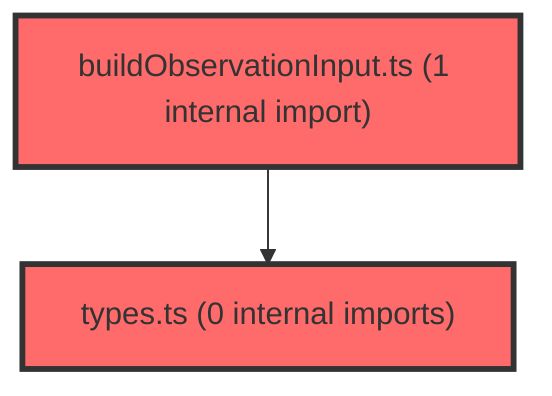

> [!IMPORTANT]
> **⚠️ 수동 검토 권장 (자가힐링 주의)**
>
> AI 자가힐링 결과물이 실제 의도와 다를 수 있으므로, **상세 리뷰 내용에 기반한 수동 점검**을 우선해 주시기 바랍니다. 자가힐링 기능을 활용하실 경우 최종 결과물을 신중하게 확인해 주세요.

# 코드 리뷰 - 6ac0576f

## 코드 복잡도 분석

**분석된 파일**: 6개 / 변경된 파일: 6개


### Import 의존관계 다이어그램



**범례**: 중심 파일 (변경됨) | 많은 import (10개 이상)


### 정상 범위 (NONE)


**`buildobservationinput.ts`** (utility)

- 평균 복잡도: **0.004**

- 최대 복잡도: 0.007

- 청크 수: 6개


**권장사항:**

- 복잡도 정상 범위


**`schoolrecordapi.ts`** (other)

- 평균 복잡도: **0.003**

- 최대 복잡도: 0.007

- 청크 수: 9개


**권장사항:**

- 복잡도 정상 범위


**`buildagentrequest.ts`** (utility)

- 평균 복잡도: **0.003**

- 최대 복잡도: 0.009

- 청크 수: 25개


**권장사항:**

- 파일 크기가 큼 (25개 청크) - 파일 분리 검토


**`schoolrecordagentapi.ts`** (other)

- 평균 복잡도: **0.002**

- 최대 복잡도: 0.006

- 청크 수: 18개


**권장사항:**

- 복잡도 정상 범위


**`types.ts`** (other)

- 평균 복잡도: **0.002**

- 최대 복잡도: 0.006

- 청크 수: 15개


**권장사항:**

- 복잡도 정상 범위


**`studentwritingsection.tsx`** (other)

- 평균 복잡도: **0.000**

- 최대 복잡도: 0.010

- 청크 수: 139개


**권장사항:**

- 파일 크기가 큼 (139개 청크) - 파일 분리 검토


---


## 변경 배경

이 커밋은 생활기록부(생기부) 생성 기능을 에이전트(LLM) 기반으로 확장하기 위한 프런트엔드 작업입니다. 기존에는 저장된 초안(draft)의 `source` 필드가 코드값 그대로 전달되던 것을 의미 있는 enum 값으로 매핑하고, 관찰 입력에 `continuityCode`(변화·지속 정도)를 추가하며, 에이전트 SSE 스트리밍 API 호출부와 요청 빌더를 신규 도입했습니다.

- **목적**: 생활기록부 생성 요청을 에이전트 API로 스트리밍 전송하고, 저장 데이터의 source/continuityCode 메타데이터를 정확히 보존·전달
- **도메인**: API (SSE 스트리밍 클라이언트), 비즈니스 로직 (요청 빌더, 데이터 매핑)
- **변경 방향**: 코드 기반의 원시값 처리에서 타입 안전한 enum 매핑으로 개선하고, 에이전트 연동을 위한 전용 파서·빌더 계층을 분리

## [GOOD] 잘된 점

- `schoolRecordApi.ts`의 `SOURCE_FROM_CODE` / 역방향 매핑을 `as const` 객체로 선언하여 코드↔enum 변환을 타입 안전하게 처리하고, 미지의 코드는 `?? null`로 안전하게 폴백 처리한 점이 견고합니다.
- `buildAgentRequest.ts`의 `maskKnownName`으로 학생 이름을 마스킹하는 개인정보 보호 로직이 명확하고, `buildRoundChanges`에서 요인별 방향성(긍정/부정)을 고려한 meritDelta 계산이 논리적으로 정확합니다.
- SSE 스트리밍에서 `eventChain`을 통해 이벤트를 순차 처리하고, `receivedDone` 플래그로 연결 종료 시 완료 여부를 검증하는 흐름 제어가 잘 설계되었습니다.

## 변경사항 요약

생기부 에이전트 연동을 위해 SSE 스트리밍 API(`schoolRecordAgentApi.ts`)와 요청 빌더(`buildAgentRequest.ts`)를 신규 추가하고, 저장 API의 source 코드 매핑과 observationInput의 continuityCode 전달을 개선했습니다.

---

## [ISSUE] 개선이 필요한 부분

### Critical (즉시 수정 필요)

없음

### High (우선 수정 권장)

- **`schoolRecordAgentApi.ts`의 `onmessage` 내부 `throw`가 이벤트 루프에서 무시될 가능성**: `onmessage` 콜백 내부에서 `throw new Error(...)`를 사용하지만, 이는 `fetchEventSource`의 내부 이벤트 핸들러에서 호출되므로 예외가 `streamSchoolRecordGeneration`의 `await fetchEventSource(...)`로 전파되지 않을 수 있습니다. `onerror` 콜백에서도 `throw error`를 하고 있으나, `fetch-event-source` 라이브러리는 `onerror`에서 throw 시 재연결을 시도하는 기본 동작이 있어 의도와 다르게 동작할 수 있습니다. 주석에서 "POST 재시도는 LLM 중복 호출을 만들 수 있어 자동 재시도하지 않는다"고 명시했으므로, `onerror`에서 재연결을 방지하는 처리가 필요합니다.
  - **위치**: `schoolRecordAgentApi.ts` 118~137줄 (`onmessage`, `onclose`, `onerror`)
  - **기존 코드**:
```ts
onerror(error) {
  throw error;
},
```
  - **해결 방안**: `fetch-event-source`는 `onerror`에서 throw하면 재연결을 시도합니다. 재연결을 막으려면 `close()`를 호출하고 throw해야 합니다. 다만 이 라이브러리의 정확한 재연결 동작을 확인하지 못해 **[수정 코드 제시 불가 — 문맥 파악 불충분]** 으로 표시합니다. `onmessage` 내부의 throw 역시 `fetchEventSource`의 Promise로 전파되지 않을 수 있어, 별도 오류 상태 변수로 관리하는 방식을 권장합니다.

### Medium (개선 권장)

- **`buildAgentRequest.ts`의 `maskKnownName`**: `text.split(trimmedName).join(...)` 방식은 이름이 여러 번 등장해도 모두 마스킹하므로 동작은 정확하지만, 이름이 1글자인 경우 `'*'.repeat(Math.max(1, 0))`로 1개 별표가 되어 원본 1글자가 1개 별표로 치환됩니다. 이는 의도된 동작으로 보이나, 1글자 이름의 경우 마스킹 효과가 제한적입니다. (선택적 개선)
- **`schoolRecordApi.ts`의 `SOURCE_FROM_CODE`와 역방향 매핑 중복**: `SOURCE_FROM_CODE`(코드→enum)와 `saveDraft` 내부의 인라인 객체(enum→코드)가 별도로 정의되어 있어, 양방향 매핑이 두 곳에 분산되어 있습니다. 하나의 매핑 테이블로 통합하면 유지보수성이 향상됩니다. (선택적 개선)

---

## 주요 파일 분석

### frontend/src/features/school-record/api/schoolRecordAgentApi.ts

**변경 내용:**
생기부 전용 POST SSE 스트리밍 클라이언트 신규 추가. `fetchEventSource` 기반으로 토큰 인증, 이벤트 순차 처리, 완료 검증을 수행합니다.

**개선 제안:**

1. `onmessage`/`onerror` 내부의 `throw`가 `fetchEventSource`의 Promise로 전파되지 않을 가능성
   - **위치 (라인 번호)**: 118~137줄
   - **기존 코드**:
```ts
onmessage(message) {
  ...
  if (!isGenerationEvent(parsed)) {
    throw new Error('생활기록부 생성 응답 형식이 올바르지 않습니다.');
  }
  ...
},
onerror(error) {
  throw error;
},
```
   - **해결 방안**: `fetch-event-source`의 콜백 내부 throw는 라이브러리 내부에서 처리되어 호출부 Promise로 전파되지 않을 수 있습니다. 오류를 외부 변수에 저장하고 `onclose`에서 검증하거나, `onerror`에서 `close()` 후 throw하는 방식으로 변경을 권장합니다. 정확한 라이브러리 동작 확인이 필요하여 **[수정 코드 제시 불가 — 문맥 파악 불충분]** 으로 표시합니다.

### frontend/src/features/school-record/utils/buildAgentRequest.ts

**변경 내용:**
에이전트 요청 빌더 신규 추가. 학생별 입력, 라운드 변화, 관찰 데이터, 공통 컨텍스트를 조합하여 `SchoolRecordGenerationRequest`를 생성합니다.

**개선 제안:**

1. `buildRoundChanges`의 `direction` 타입에 '유지'가 정의되어 있으나 실제로는 '개선'/'하락'만 반환
   - **위치 (라인 번호)**: 52~73줄
   - **기존 코드**:
```ts
return {
  category: factor.name,
  direction: meritDelta > 0 ? ('개선' as const) : ('하락' as const),
  magnitude: Math.abs(rawDelta),
};
```
   - **해결 방안**: `AgentRoundChange.direction`에 '유지'가 포함되어 있지만, `Math.abs(rawDelta) < 5`인 경우는 `null`로 필터링되어 '유지'가 반환될 수 없습니다. 타입 정의에서 '유지'를 제거하거나, 임계값 미만을 '유지'로 반환하도록 로직을 조정하는 것이 타입과 실제 동작의 일관성을 높입니다. 다만 이는 의도된 설계일 수 있어 **[수정 코드 제시 불가 — 문맥 파악 불충분]** 으로 표시합니다.

### frontend/src/features/school-record/api/schoolRecordApi.ts

**변경 내용:**
source 필드의 코드↔enum 양방향 매핑과 generatedText 전달 추가.

**개선 제안:**

1. 양방향 매핑이 두 곳에 분산
   - **위치 (라인 번호)**: 36~42줄 (`SOURCE_FROM_CODE`) 및 102~108줄 (saveDraft 인라인 매핑)
   - **기존 코드**:
```ts
const SOURCE_FROM_CODE = {
  '1': 'TEST_ONLY',
  '2': 'COMMON_CONTEXT',
  '3': 'INDIVIDUAL_OBSERVATION',
} as const;
```
   - **해결 방안**: enum→코드 매핑도 별도 상수로 추출하여 `SOURCE_FROM_CODE`와 함께 정의하면, 양방향 변환 로직이 한 곳에 모여 유지보수가 용이해집니다. (선택적 개선)

---

## 최종 평가

**결론**:
- [ ] [OK] **승인 (Approved)** - Critical/High 이슈 없음
- [x] [WARN] **조건부 승인 (Approved with Comments)** - Medium 이하 이슈만 존재
- [ ] [FIX] **수정 필요 (Changes Requested)** - Critical/High 이슈 존재

**종합 의견:**

CP님의 이번 커밋은 생기부 에이전트 연동을 위한 타입 안전한 데이터 매핑과 전용 SSE 클라이언트 도입으로 전반적으로 잘 구성되었습니다. 특히 `SOURCE_FROM_CODE`의 `as const` 기반 매핑, `maskKnownName`의 개인정보 보호, `eventChain`을 통한 이벤트 순차 처리 등 견고한 설계가 돋보입니다.

다만 `fetchEventSource` 콜백 내부의 `throw`가 호출부 Promise로 전파되지 않을 가능성과 재연결 방지 처리에 대한 검증이 필요합니다. 이 부분은 라이브러리 동작 확인 후 보완하면 충분히 승인 가능한 수준입니다. `onerror`에서의 재연결 방지 처리는 LLM 중복 호출을 방지한다는 주석의 의도를 지키기 위해 반드시 확인이 필요한 사항입니다.