> [!IMPORTANT]
> **⚠️ 수동 검토 권장 (자가힐링 주의)**
>
> AI 자가힐링 결과물이 실제 의도와 다를 수 있으므로, **상세 리뷰 내용에 기반한 수동 점검**을 우선해 주시기 바랍니다. 자가힐링 기능을 활용하실 경우 최종 결과물을 신중하게 확인해 주세요.

# 코드 리뷰 - 6e5cf9bb

## 코드 복잡도 분석

**분석된 파일**: 104개 / 변경된 파일: 158개


### Import 의존관계 다이어그램

```mermaid
flowchart TD
    F0["StudentResourcePage.tsx (2 internal imports)"]:::center
    F1["format.ts (2 internal imports)"]:::center
    F2["components/badges.tsx (1 internal import)"]:::center
    F3["AIRoomPage.tsx (3 internal imports)"]:::center
    F4["StudentTab.tsx (8 internal imports)"]:::center
    F5["service.ts (1 internal import)"]:::center
    F6["resources/mock-data.ts (0 internal imports)"]:::center
    F7["ReportSummary.tsx (4 internal imports)"]:::center
    F8["ClassStatusView.tsx (4 internal imports)"]:::center
    F9["ChatArea.tsx (1 internal import)"]:::center
    F10["PageContent.tsx (7 internal imports)"]:::center
    F11["mysql_tools.py (0 internal imports)"]:::center
    F12["tools (1 internal import)"]:::center
    F13["ErrataSummaryTable.tsx (3 internal imports)"]:::center
    F14["SelfregClassResultView.tsx (0 internal imports)"]:::center
    F15["AssessmentPage.tsx (2 internal imports)"]:::center
    F16["PageTab.tsx (4 internal imports)"]:::center
    F17["IndividualCoachingPage.tsx (1 internal import)"]:::center
    F18["StudentWritingView.tsx (5 internal imports)"]:::center
    F19["data.ts (1 internal import)"]:::center
    F20["ai-room/types.ts (0 internal imports)"]:::center
    F21["ClassCoachingPage.tsx (1 internal import)"]:::center
    F22["counseling-dashboard/types.ts (0 internal imports)"]:::center
    F23["UnifiedResponseCard.tsx (3 internal imports)"]:::center
    F24["SchoolRecordView.tsx (5 internal imports)"]:::center
    F25["download.ts (2 internal imports)"]:::center
    F26["ResourcesContext.tsx (3 internal imports)"]:::center
    F27["SelfregAssessmentPage.tsx (2 internal imports)"]:::center
    F28["StudentReportDashboard.tsx (2 internal imports)"]:::center
    F29["utils (2 internal imports)"]:::center
    F30["CoachingPage.tsx (1 internal import)"]:::center
    F31["school-record/shared.tsx (2 internal imports)"]:::center
    F32["detail/shared.tsx (2 internal imports)"]:::center
    F33["aggregation.ts (1 internal import)"]:::center
    F34["student-resources/types.ts (0 internal imports)"]:::center
    F35["RdTabBar.tsx (1 internal import)"]:::center
    F36["StudentCoachingView.tsx (1 internal import)"]:::center
    F37["image_validation.py (0 internal imports)"]:::center
    F38["components/index.ts (0 internal imports)"]:::center
    F39["StatusPanel.tsx (3 internal imports)"]:::center
    F40["ReportCard.tsx (4 internal imports)"]:::center
    F41["PageList.tsx (4 internal imports)"]:::center
    F42["resources/types.ts (0 internal imports)"]:::center
    F43["ClassCoachingView.tsx (1 internal import)"]:::center
    F44["LayoutV2.tsx (0 internal imports)"]:::center
    F45["school-record/index.ts (0 internal imports)"]:::center
    F46["school-record/types.ts (0 internal imports)"]:::center
    F47["BulkGenerateView.tsx (3 internal imports)"]:::center
    F48["SummaryStrip.tsx (2 internal imports)"]:::center
    F49["ReportDetail.tsx (6 internal imports)"]:::center
    F50["SchoolRecordPage.tsx (1 internal import)"]:::center
    F51["report/badges.tsx (1 internal import)"]:::center
    F52["StudentDetailReport.tsx (2 internal imports)"]:::center
    F53["StudentLayout.tsx (0 internal imports)"]:::center
    F54["routesV2.tsx (16 internal imports)"]:::center
    F55["schoolInfo.ts (0 internal imports)"]:::center
    F56["student-resources/mock-data.ts (1 internal import)"]:::center
    F57["agentApiService.ts (0 internal imports)"]:::center
    F58["assistantService.ts (2 internal imports)"]:::center
    F29 --> F37
    F15 --> F27
    F12 --> F11
    F58 --> F57
    F58 --> F20
    F9 --> F20
    F54 --> F44
    F54 --> F45
    F54 --> F17
    F54 --> F53
    F54 --> F52
    F27 --> F14
    F43 --> F22
    F36 --> F22
    F21 --> F38
    F30 --> F38
    F17 --> F38
    F10 --> F42
    F10 --> F32
    F10 --> F33
    F10 --> F48
    F10 --> F51
    F10 --> F23
    F10 --> F26
    F41 --> F42
    F41 --> F51
    F41 --> F26
    F41 --> F33
    F16 --> F42
    F16 --> F41
    F16 --> F33
    F16 --> F10
    F35 --> F26
    F40 --> F42
    F40 --> F51
    F40 --> F26
    F40 --> F33
    F49 --> F16
    F49 --> F35
    F49 --> F4
    F49 --> F6
    F49 --> F7
    F49 --> F26
    F7 --> F6
    F7 --> F1
    F7 --> F42
    F7 --> F51
    F39 --> F1
    F39 --> F26
    F39 --> F33
    F4 --> F1
    F4 --> F42
    F4 --> F32
    F4 --> F33
    F4 --> F51
    F4 --> F23
    F4 --> F26
    F4 --> F13
    F51 --> F42
    F13 --> F42
    F13 --> F51
    F13 --> F33
    F48 --> F42
    F48 --> F33
    F23 --> F42
    F23 --> F51
    F23 --> F32
    F32 --> F42
    F32 --> F33
    F26 --> F6
    F26 --> F1
    F26 --> F42
    F33 --> F42
    F1 --> F6
    F1 --> F42
    F47 --> F5
    F47 --> F46
    F47 --> F19
    F8 --> F31
    F8 --> F25
    F8 --> F55
    F8 --> F46
    F50 --> F24
    F24 --> F46
    F24 --> F18
    F24 --> F47
    F24 --> F19
    F24 --> F8
    F18 --> F31
    F18 --> F46
    F18 --> F19
    F18 --> F5
    F18 --> F55
    F19 --> F46
    F25 --> F31
    F25 --> F46
    F5 --> F46
    F31 --> F46
    F31 --> F19
    F52 --> F2
    F52 --> F56
    F28 --> F2
    F28 --> F56
    F2 --> F34
    F56 --> F34
    F0 --> F52
    F0 --> F28
    classDef center fill:#ff6b6b,stroke:#333,stroke-width:3px
    classDef high fill:#ffd93d,stroke:#333,stroke-width:2px
```



**범례**: 중심 파일 (변경됨) | 많은 import (10개 이상)


### 모니터링 권장 (LOW)


**`assessmentpage.tsx`** (component)

- 평균 복잡도: **0.261**

- 최대 복잡도: 0.526

- 청크 수: 58개

- 평균 사용처: 34.0곳


**권장사항:**

- **모니터링 권장**: 복잡도가 높은 편이지만 영향 범위 제한적

- 파일 크기가 큼 (58개 청크) - 파일 분리 검토


### 정상 범위 (NONE)


**`dgnssmapper.xml`** (other)

- 평균 복잡도: **0.242**

- 최대 복잡도: 0.473

- 청크 수: 2개

- 평균 사용처: 7.0곳


**권장사항:**

- 복잡도 정상 범위


**`studentlayout.tsx`** (other)

- 평균 복잡도: **0.224**

- 최대 복잡도: 0.477

- 청크 수: 23개

- 평균 사용처: 26.0곳


**권장사항:**

- 파일 크기가 큼 (23개 청크) - 파일 분리 검토


**`dgnsscontroller.java`** (other)

- 평균 복잡도: **0.210**

- 최대 복잡도: 0.470

- 청크 수: 25개

- 평균 사용처: 25.8곳


**권장사항:**

- 파일 크기가 큼 (25개 청크) - 파일 분리 검토


**`main.py`** (other)

- 평균 복잡도: **0.203**

- 최대 복잡도: 0.471

- 청크 수: 7개

- 평균 사용처: 6.9곳


**권장사항:**

- 복잡도 정상 범위


**`dgnssmapper.java`** (other)

- 평균 복잡도: **0.187**

- 최대 복잡도: 0.466

- 청크 수: 199개

- 평균 사용처: 27.9곳


**권장사항:**

- 파일 크기가 큼 (199개 청크) - 파일 분리 검토


**`index.ts`** (other)

- 평균 복잡도: **0.185**

- 최대 복잡도: 0.463

- 청크 수: 5개

- 평균 사용처: 13.0곳


**권장사항:**

- 복잡도 정상 범위


**`schemas.py`** (other)

- 평균 복잡도: **0.166**

- 최대 복잡도: 0.464

- 청크 수: 7개

- 평균 사용처: 5.0곳


**권장사항:**

- 복잡도 정상 범위


**`__init__.py`** (utility)

- 평균 복잡도: **0.153**

- 최대 복잡도: 0.304

- 청크 수: 2개

- 평균 사용처: 3.0곳


**권장사항:**

- 복잡도 정상 범위


**`index.ts`** (component)

- 평균 복잡도: **0.144**

- 최대 복잡도: 0.463

- 청크 수: 16개

- 평균 사용처: 10.2곳


**권장사항:**

- 복잡도 정상 범위


**`airoompage.tsx`** (component)

- 평균 복잡도: **0.117**

- 최대 복잡도: 0.471

- 청크 수: 49개

- 평균 사용처: 5.4곳


**권장사항:**

- 파일 크기가 큼 (49개 청크) - 파일 분리 검토


**`dgnssservice.java`** (other)

- 평균 복잡도: **0.111**

- 최대 복잡도: 0.473

- 청크 수: 69개

- 평균 사용처: 12.8곳


**권장사항:**

- 파일 크기가 큼 (69개 청크) - 파일 분리 검토


**`index.ts`** (component)

- 평균 복잡도: **0.102**

- 최대 복잡도: 0.461

- 청크 수: 9개

- 평균 사용처: 3.3곳


**권장사항:**

- 복잡도 정상 범위


**`agent_service.py`** (other)

- 평균 복잡도: **0.080**

- 최대 복잡도: 0.464

- 청크 수: 18개

- 평균 사용처: 3.1곳


**권장사항:**

- 복잡도 정상 범위


**`routes.tsx`** (other)

- 평균 복잡도: **0.073**

- 최대 복잡도: 0.463

- 청크 수: 17개

- 평균 사용처: 3.3곳


**권장사항:**

- 복잡도 정상 범위


**`index.ts`** (other)

- 평균 복잡도: **0.052**

- 최대 복잡도: 0.261

- 청크 수: 5개

- 평균 사용처: 1.0곳


**권장사항:**

- 복잡도 정상 범위


**`trialmonitormapper.xml`** (other)

- 평균 복잡도: **0.007**

- 최대 복잡도: 0.007

- 청크 수: 1개


**권장사항:**

- 복잡도 정상 범위


**`__init__.py`** (other)

- 평균 복잡도: **0.006**

- 최대 복잡도: 0.006

- 청크 수: 1개


**권장사항:**

- 복잡도 정상 범위


**`test_stateless_memory.py`** (store)

- 평균 복잡도: **0.006**

- 최대 복잡도: 0.008

- 청크 수: 7개


**권장사항:**

- Store 파일은 높은 연결도가 정상적임


**`coachingpage.tsx`** (component)

- 평균 복잡도: **0.006**

- 최대 복잡도: 0.014

- 청크 수: 5개


**권장사항:**

- 복잡도 정상 범위


**`mysql_tools.py`** (other)

- 평균 복잡도: **0.005**

- 최대 복잡도: 0.011

- 청크 수: 8개


**권장사항:**

- 복잡도 정상 범위


**`image_validation.py`** (utility)

- 평균 복잡도: **0.005**

- 최대 복잡도: 0.010

- 청크 수: 2개


**권장사항:**

- 복잡도 정상 범위


**`rdtabbar.tsx`** (component)

- 평균 복잡도: **0.005**

- 최대 복잡도: 0.009

- 청크 수: 5개


**권장사항:**

- 복잡도 정상 범위


**`studentbanner.tsx`** (component)

- 평균 복잡도: **0.005**

- 최대 복잡도: 0.007

- 청크 수: 3개


**권장사항:**

- 복잡도 정상 범위


**`agent_graph.py`** (other)

- 평균 복잡도: **0.004**

- 최대 복잡도: 0.007

- 청크 수: 6개


**권장사항:**

- 복잡도 정상 범위


**`agentapiservice.ts`** (other)

- 평균 복잡도: **0.004**

- 최대 복잡도: 0.012

- 청크 수: 9개


**권장사항:**

- 복잡도 정상 범위


**`chatapiservice.ts`** (other)

- 평균 복잡도: **0.004**

- 최대 복잡도: 0.008

- 청크 수: 21개


**권장사항:**

- 파일 크기가 큼 (21개 청크) - 파일 분리 검토


**`captureregion.ts`** (utility)

- 평균 복잡도: **0.004**

- 최대 복잡도: 0.012

- 청크 수: 8개


**권장사항:**

- 복잡도 정상 범위


**`dashboardservice.ts`** (other)

- 평균 복잡도: **0.004**

- 최대 복잡도: 0.010

- 청크 수: 59개


**권장사항:**

- 파일 크기가 큼 (59개 청크) - 파일 분리 검토


**`trialmonitorcontroller.java`** (other)

- 평균 복잡도: **0.003**

- 최대 복잡도: 0.006

- 청크 수: 4개


**권장사항:**

- 복잡도 정상 범위


**`datahelperservice.ts`** (utility)

- 평균 복잡도: **0.003**

- 최대 복잡도: 0.008

- 청크 수: 34개


**권장사항:**

- 파일 크기가 큼 (34개 청크) - 파일 분리 검토


**`usecapturestore.ts`** (store)

- 평균 복잡도: **0.003**

- 최대 복잡도: 0.012

- 청크 수: 12개


**권장사항:**

- Store 파일은 높은 연결도가 정상적임


**`index.ts`** (other)

- 평균 복잡도: **0.003**

- 최대 복잡도: 0.011

- 청크 수: 92개


**권장사항:**

- 파일 크기가 큼 (92개 청크) - 파일 분리 검토


**`scopeconfig.ts`** (config)

- 평균 복잡도: **0.003**

- 최대 복잡도: 0.010

- 청크 수: 12개


**권장사항:**

- Config 파일은 높은 연결도가 정상적임


**`classcoachingpage.tsx`** (component)

- 평균 복잡도: **0.003**

- 최대 복잡도: 0.008

- 청크 수: 6개


**권장사항:**

- 복잡도 정상 범위


**`individualcoachingpage.tsx`** (component)

- 평균 복잡도: **0.003**

- 최대 복잡도: 0.010

- 청크 수: 6개


**권장사항:**

- 복잡도 정상 범위


**`types.ts`** (other)

- 평균 복잡도: **0.003**

- 최대 복잡도: 0.009

- 청크 수: 31개


**권장사항:**

- 파일 크기가 큼 (31개 청크) - 파일 분리 검토


**`types.ts`** (other)

- 평균 복잡도: **0.003**

- 최대 복잡도: 0.007

- 청크 수: 18개


**권장사항:**

- 복잡도 정상 범위


**`data.ts`** (other)

- 평균 복잡도: **0.003**

- 최대 복잡도: 0.006

- 청크 수: 13개


**권장사항:**

- 복잡도 정상 범위


**`download.ts`** (other)

- 평균 복잡도: **0.003**

- 최대 복잡도: 0.006

- 청크 수: 9개


**권장사항:**

- 복잡도 정상 범위


**`__init__.py`** (other)

- 평균 복잡도: **0.002**

- 최대 복잡도: 0.002

- 청크 수: 1개


**권장사항:**

- 복잡도 정상 범위


**`assistantservice.ts`** (other)

- 평균 복잡도: **0.002**

- 최대 복잡도: 0.012

- 청크 수: 14개


**권장사항:**

- 복잡도 정상 범위


**`useconversations.ts`** (other)

- 평균 복잡도: **0.002**

- 최대 복잡도: 0.010

- 청크 수: 73개


**권장사항:**

- 파일 크기가 큼 (73개 청크) - 파일 분리 검토


**`types.ts`** (other)

- 평균 복잡도: **0.002**

- 최대 복잡도: 0.004

- 청크 수: 10개


**권장사항:**

- 복잡도 정상 범위


**`useapidata.ts`** (other)

- 평균 복잡도: **0.002**

- 최대 복잡도: 0.010

- 청크 수: 59개


**권장사항:**

- 파일 크기가 큼 (59개 청크) - 파일 분리 검토


**`authcontext.tsx`** (other)

- 평균 복잡도: **0.002**

- 최대 복잡도: 0.008

- 청크 수: 16개


**권장사항:**

- 복잡도 정상 범위


**`layoutv2.tsx`** (other)

- 평균 복잡도: **0.002**

- 최대 복잡도: 0.009

- 청크 수: 45개


**권장사항:**

- 파일 크기가 큼 (45개 청크) - 파일 분리 검토


**`selfregstudentresultview.tsx`** (component)

- 평균 복잡도: **0.002**

- 최대 복잡도: 0.008

- 청크 수: 31개


**권장사항:**

- 파일 크기가 큼 (31개 청크) - 파일 분리 검토


**`selfregassessmentpage.tsx`** (component)

- 평균 복잡도: **0.002**

- 최대 복잡도: 0.007

- 청크 수: 38개


**권장사항:**

- 파일 크기가 큼 (38개 청크) - 파일 분리 검토


**`selfregclassresultview.tsx`** (component)

- 평균 복잡도: **0.002**

- 최대 복잡도: 0.011

- 청크 수: 63개


**권장사항:**

- 파일 크기가 큼 (63개 청크) - 파일 분리 검토


**`resultoverviewview.tsx`** (component)

- 평균 복잡도: **0.002**

- 최대 복잡도: 0.007

- 청크 수: 17개


**권장사항:**

- 복잡도 정상 범위


**`pagetab.tsx`** (component)

- 평균 복잡도: **0.002**

- 최대 복잡도: 0.007

- 청크 수: 7개


**권장사항:**

- 복잡도 정상 범위


**`badges.tsx`** (component)

- 평균 복잡도: **0.002**

- 최대 복잡도: 0.004

- 청크 수: 12개


**권장사항:**

- 복잡도 정상 범위


**`shared.tsx`** (component)

- 평균 복잡도: **0.002**

- 최대 복잡도: 0.006

- 청크 수: 11개


**권장사항:**

- 복잡도 정상 범위


**`mock-data.ts`** (other)

- 평균 복잡도: **0.002**

- 최대 복잡도: 0.004

- 청크 수: 27개


**권장사항:**

- 파일 크기가 큼 (27개 청크) - 파일 분리 검토


**`schoolrecordpage.tsx`** (component)

- 평균 복잡도: **0.002**

- 최대 복잡도: 0.005

- 청크 수: 6개


**권장사항:**

- 복잡도 정상 범위


**`factorinfo.ts`** (other)

- 평균 복잡도: **0.002**

- 최대 복잡도: 0.005

- 청크 수: 8개


**권장사항:**

- 복잡도 정상 범위


**`schoolinfo.ts`** (other)

- 평균 복잡도: **0.002**

- 최대 복잡도: 0.002

- 청크 수: 3개


**권장사항:**

- 복잡도 정상 범위


**`shared.tsx`** (other)

- 평균 복잡도: **0.002**

- 최대 복잡도: 0.005

- 청크 수: 11개


**권장사항:**

- 복잡도 정상 범위


**`types.ts`** (other)

- 평균 복잡도: **0.002**

- 최대 복잡도: 0.008

- 청크 수: 9개


**권장사항:**

- 복잡도 정상 범위


**`selfregfactoranalysis.tsx`** (component)

- 평균 복잡도: **0.002**

- 최대 복잡도: 0.008

- 청크 수: 18개


**권장사항:**

- 복잡도 정상 범위


**`mock-data.ts`** (other)

- 평균 복잡도: **0.002**

- 최대 복잡도: 0.006

- 청크 수: 5개


**권장사항:**

- 복잡도 정상 범위


**`studentresourcepage.tsx`** (component)

- 평균 복잡도: **0.002**

- 최대 복잡도: 0.008

- 청크 수: 8개


**권장사항:**

- 복잡도 정상 범위


**`types.ts`** (other)

- 평균 복잡도: **0.002**

- 최대 복잡도: 0.006

- 청크 수: 8개


**권장사항:**

- 복잡도 정상 범위


**`aichatpanel.tsx`** (other)

- 평균 복잡도: **0.001**

- 최대 복잡도: 0.004

- 청크 수: 48개


**권장사항:**

- 파일 크기가 큼 (48개 청크) - 파일 분리 검토


**`datahelperchatbot.tsx`** (utility)

- 평균 복잡도: **0.001**

- 최대 복잡도: 0.008

- 청크 수: 22개


**권장사항:**

- 파일 크기가 큼 (22개 청크) - 파일 분리 검토


**`schoolrecordpanel.tsx`** (other)

- 평균 복잡도: **0.001**

- 최대 복잡도: 0.007

- 청크 수: 59개


**권장사항:**

- 파일 크기가 큼 (59개 청크) - 파일 분리 검토


**`airoompage.tsx`** (component)

- 평균 복잡도: **0.001**

- 최대 복잡도: 0.008

- 청크 수: 9개


**권장사항:**

- 복잡도 정상 범위


**`studentdashboardpage.tsx`** (component)

- 평균 복잡도: **0.001**

- 최대 복잡도: 0.008

- 청크 수: 50개


**권장사항:**

- 파일 크기가 큼 (50개 청크) - 파일 분리 검토


**`captureoverlay.tsx`** (other)

- 평균 복잡도: **0.001**

- 최대 복잡도: 0.004

- 청크 수: 25개


**권장사항:**

- 파일 크기가 큼 (25개 청크) - 파일 분리 검토


**`floatingcapturebutton.tsx`** (other)

- 평균 복잡도: **0.001**

- 최대 복잡도: 0.008

- 청크 수: 16개


**권장사항:**

- 복잡도 정상 범위


**`examoverviewtable.tsx`** (component)

- 평균 복잡도: **0.001**

- 최대 복잡도: 0.003

- 청크 수: 7개


**권장사항:**

- 복잡도 정상 범위


**`classcoachingview.tsx`** (component)

- 평균 복잡도: **0.001**

- 최대 복잡도: 0.004

- 청크 수: 12개


**권장사항:**

- 복잡도 정상 범위


**`studentcoachingview.tsx`** (component)

- 평균 복잡도: **0.001**

- 최대 복잡도: 0.005

- 청크 수: 13개


**권장사항:**

- 복잡도 정상 범위


**`reportsummary.tsx`** (component)

- 평균 복잡도: **0.001**

- 최대 복잡도: 0.003

- 청크 수: 8개


**권장사항:**

- 복잡도 정상 범위


**`studenttab.tsx`** (component)

- 평균 복잡도: **0.001**

- 최대 복잡도: 0.006

- 청크 수: 16개


**권장사항:**

- 복잡도 정상 범위


**`erratasummarytable.tsx`** (component)

- 평균 복잡도: **0.001**

- 최대 복잡도: 0.002

- 청크 수: 4개


**권장사항:**

- 복잡도 정상 범위


**`resourcescontext.tsx`** (store)

- 평균 복잡도: **0.001**

- 최대 복잡도: 0.007

- 청크 수: 28개


**권장사항:**

- 파일 크기가 큼 (28개 청크) - 파일 분리 검토

- Store 파일은 높은 연결도가 정상적임


**`aggregation.ts`** (utility)

- 평균 복잡도: **0.001**

- 최대 복잡도: 0.006

- 청크 수: 54개


**권장사항:**

- 파일 크기가 큼 (54개 청크) - 파일 분리 검토


**`format.ts`** (utility)

- 평균 복잡도: **0.001**

- 최대 복잡도: 0.002

- 청크 수: 16개


**권장사항:**

- 복잡도 정상 범위


**`bulkgenerateview.tsx`** (component)

- 평균 복잡도: **0.001**

- 최대 복잡도: 0.004

- 청크 수: 17개


**권장사항:**

- 복잡도 정상 범위


**`classstatusview.tsx`** (component)

- 평균 복잡도: **0.001**

- 최대 복잡도: 0.004

- 청크 수: 32개


**권장사항:**

- 파일 크기가 큼 (32개 청크) - 파일 분리 검토


**`schoolrecordview.tsx`** (component)

- 평균 복잡도: **0.001**

- 최대 복잡도: 0.006

- 청크 수: 22개


**권장사항:**

- 파일 크기가 큼 (22개 청크) - 파일 분리 검토


**`studentwritingview.tsx`** (component)

- 평균 복잡도: **0.001**

- 최대 복잡도: 0.005

- 청크 수: 30개


**권장사항:**

- 파일 크기가 큼 (30개 청크) - 파일 분리 검토


**`service.ts`** (other)

- 평균 복잡도: **0.001**

- 최대 복잡도: 0.005

- 청크 수: 15개


**권장사항:**

- 복잡도 정상 범위


**`badges.tsx`** (component)

- 평균 복잡도: **0.001**

- 최대 복잡도: 0.003

- 청크 수: 7개


**권장사항:**

- 복잡도 정상 범위


**`trialmonitormapper.java`** (other)

- 평균 복잡도: **0.000**

- 최대 복잡도: 0.001

- 청크 수: 9개


**권장사항:**

- 복잡도 정상 범위


**`chatarea.tsx`** (other)

- 평균 복잡도: **0.000**

- 최대 복잡도: 0.008

- 청크 수: 81개


**권장사항:**

- 파일 크기가 큼 (81개 청크) - 파일 분리 검토


**`airoomchatarea.tsx`** (other)

- 평균 복잡도: **0.000**

- 최대 복잡도: 0.000

- 청크 수: 52개


**권장사항:**

- 파일 크기가 큼 (52개 청크) - 파일 분리 검토


**`index.ts`** (other)

- 평균 복잡도: **0.000**

- 최대 복잡도: 0.000

- 청크 수: 2개


**권장사항:**

- 복잡도 정상 범위


**`routesv2.tsx`** (other)

- 평균 복잡도: **0.000**

- 최대 복잡도: 0.003

- 청크 수: 23개


**권장사항:**

- 파일 크기가 큼 (23개 청크) - 파일 분리 검토


**`coachingoverviewview.tsx`** (component)

- 평균 복잡도: **0.000**

- 최대 복잡도: 0.000

- 청크 수: 2개


**권장사항:**

- 복잡도 정상 범위


**`pagecontent.tsx`** (component)

- 평균 복잡도: **0.000**

- 최대 복잡도: 0.000

- 청크 수: 7개


**권장사항:**

- 복잡도 정상 범위


**`pagelist.tsx`** (component)

- 평균 복잡도: **0.000**

- 최대 복잡도: 0.000

- 청크 수: 4개


**권장사항:**

- 복잡도 정상 범위


**`reportcard.tsx`** (component)

- 평균 복잡도: **0.000**

- 최대 복잡도: 0.002

- 청크 수: 8개


**권장사항:**

- 복잡도 정상 범위


**`reportdetail.tsx`** (component)

- 평균 복잡도: **0.000**

- 최대 복잡도: 0.000

- 청크 수: 7개


**권장사항:**

- 복잡도 정상 범위


**`statuspanel.tsx`** (component)

- 평균 복잡도: **0.000**

- 최대 복잡도: 0.004

- 청크 수: 13개


**권장사항:**

- 복잡도 정상 범위


**`summarystrip.tsx`** (component)

- 평균 복잡도: **0.000**

- 최대 복잡도: 0.000

- 청크 수: 6개


**권장사항:**

- 복잡도 정상 범위


**`unifiedresponsecard.tsx`** (component)

- 평균 복잡도: **0.000**

- 최대 복잡도: 0.000

- 청크 수: 5개


**권장사항:**

- 복잡도 정상 범위


**`index.ts`** (component)

- 평균 복잡도: **0.000**

- 최대 복잡도: 0.000

- 청크 수: 11개


**권장사항:**

- 복잡도 정상 범위


**`index.ts`** (other)

- 평균 복잡도: **0.000**

- 최대 복잡도: 0.000

- 청크 수: 2개


**권장사항:**

- 복잡도 정상 범위


**`studentdetailreport.tsx`** (component)

- 평균 복잡도: **0.000**

- 최대 복잡도: 0.003

- 청크 수: 7개


**권장사항:**

- 복잡도 정상 범위


**`studentreportdashboard.tsx`** (component)

- 평균 복잡도: **0.000**

- 최대 복잡도: 0.002

- 청크 수: 5개


**권장사항:**

- 복잡도 정상 범위


**`index.ts`** (component)

- 평균 복잡도: **0.000**

- 최대 복잡도: 0.000

- 청크 수: 7개


**권장사항:**

- 복잡도 정상 범위


---


## 변경 배경

이 커밋은 AI 에이전트 서비스의 **오케스트레이션 레이어를 LangGraph 기반으로 확장**하고, **MySQL 데이터베이스 연동을 추가**하여 학생/학급/교사 단위의 다양한 데이터 조회를 가능하게 하는 대규모 아키텍처 개선입니다.

- **목적**: 기존 수작업 ReAct 루프(legacy)와 LangGraph StateGraph 기반 구현을 `AGENT_BACKEND` 환경 변수로 병행 운영할 수 있게 하고, 프롬프트를 코드에서 분리하여 기획자도 수정 가능하게 하며, MySQL Tool을 통한 실제 검사/상담/생기부 데이터 조회 기능 추가
- **도메인**: AI Agent 백엔드 (오케스트레이션, Tool 통합, 프롬프트 관리)
- **변경 방향**: 단일 구현체(MetaAgentService)에서 플러그인 가능한 2개 구현체(legacy + langgraph)로 확장, 하드코딩된 프롬프트를 `.md` 파일로 분리, Neo4j 전용에서 Neo4j+MySQL 통합 Tool 레이어로 확장

---

## [GOOD] 잘된 점

### 1. 프롬프트 분리 아키텍처가 우수함

`app/core/prompts/` 디렉토리로 시스템 프롬프트와 Tool 정책을 `.md` 파일로 분리하고, `load_prompt()`가 매 요청마다 파일을 새로 읽어 서버 재시작 없이 즉시 반영되도록 한 설계는 실용적입니다. 특히 Tool 함수의 docstring은 개발자 영역으로 남겨두고 정책 문구만 분리한 결정이 명확합니다.

```python
# agent/app/core/prompts/__init__.py
def load_prompt(name: str) -> str:
    """prompts/{name}.md 파일 내용을 읽어 반환한다 (앞뒤 개행 제거)."""
    path = _PROMPTS_DIR / f"{name}.md"
    return path.read_text(encoding="utf-8").strip("\n")
```

`load_prompt()`는 캐싱 없이 매번 파일을 읽지만, 요청당 1-2회만 호출되므로 파일 I/O 비용은 무시할 수 있습니다. 대신 기획자가 `.md` 파일만 수정하면 서버 재시작 없이 다음 요청부터 즉시 반영되는 장점이 있습니다.

### 2. AGENT_BACKEND 전환 메커니즘이 깔끔함

`agent_service.py` 하단에서 환경 변수로 두 구현체 중 하나를 `meta_agent_service` 싱글톤으로 선택하는 패턴은 `main.py`나 클라이언트 코드를 전혀 수정하지 않아도 되어 마이그레이션 리스크를 최소화했습니다.

```python
# agent/app/services/agent_service.py (lines 732-740)
AGENT_BACKEND = os.getenv("AGENT_BACKEND", "legacy").strip().lower()

if AGENT_BACKEND == "langgraph":
    logger.info("AGENT_BACKEND=langgraph: LangGraph 기반 MetaAgentService 사용")
    meta_agent_service = LangGraphAgentService()
else:
    logger.info("AGENT_BACKEND=legacy: 기존 수작업 ReAct 루프 기반 MetaAgentService 사용")
    meta_agent_service = MetaAgentService()
```

`LangGraphAgentService`가 `MetaAgentService`와 동일한 인터페이스(`run_agent`, `run_agent_stream`, `clear_session`)를 제공하는 점도 잘 설계되었습니다. 두 구현 모두 API 계약(`/chat`, `/chat/stream`, `DELETE /chat/{session_id}`의 요청/응답 스키마)이 완전히 동일하므로 전환 시 클라이언트 코드 수정이 전혀 필요 없습니다.

### 3. 무상태(stateless) 모드 도입이 현명함

`history` 파라미터를 통해 프론트엔드가 대화 이력의 정본을 DB에서 관리하고 매 요청마다 replay하는 모드를 지원함으로써, 인메모리 세션의 휘발성 문제를 우회할 수 있는 경로를 열었습니다.

```python
# agent/app/services/agent_service.py, _build_messages() (lines 175-195)
# --- 무상태 모드: 이력의 정본은 DB, 프론트가 매 턴 replay ---
if history is not None:
    masked = mask_pii_data(context_data) if context_data else None
    system_prompt = self._build_system_prompt(masked)
    messages = [{"role": "system", "content": system_prompt}]
    for msg in history:
        role = getattr(msg, "role", None)
        content = getattr(msg, "content", None)
        if role in ("user", "assistant") and content:
            messages.append({"role": role, "content": content})
    self._append_user_turn(messages, text, images)
    return messages, None  # session_history = None = 영속 대상 없음
```

`session_history is None`으로 무상태 모드를 감지하고 이력 저장을 건너뛰는 로직이 일관성 있게 적용되어 있습니다. `run_agent()`와 `run_agent_stream()` 모두 이 패턴을 따릅니다.

### 4. LangGraph 그래프의 스트리밍 통일

`call_model_node`에서 `stream=True`로 통일하고 `get_stream_writer()`를 통해 `/chat`(ainvoke)과 `/chat/stream`(astream)이 완전히 동일한 노드 구현을 공유하도록 한 설계는 유지보수성을 크게 높입니다.

```python
# agent/app/core/agent_graph.py, call_model_node() (lines 170-210)
async for chunk in _stream_llm_call(openai_messages, _TOOL_SCHEMAS):
    delta = chunk.choices[0].delta
    if getattr(delta, "content", None):
        content_buffer += delta.content
        writer({"type": "token", "text": delta.content})  # 커스텀 스트림
```

`get_stream_writer()`는 커스텀 스트림 소비자가 없는 컨텍스트(ainvoke)에서도 안전한 no-op으로 동작함을 런타임으로 확인했다는 주석이 신뢰를 줍니다.

### 5. LangGraph의 스트리밍 LLM 호출을 @traceable로 감싼 점

레거시에서는 스트리밍 LLM 호출이 `@traceable` 적용 불가로 개별 추적이 안 되었으나, LangGraph 구현에서는 `_stream_llm_call()`을 `@traceable(run_type="llm")`로 감싸 LangSmith에 nested LLM span으로 기록할 수 있게 되었습니다.

```python
# agent/app/core/agent_graph.py (lines 140-155)
@traceable(run_type="llm", name="LiteLLM")
async def _stream_llm_call(messages: list, tools: list):
    response = await llm_router.acompletion(
        model=ROUTER_MODEL_NAME, messages=messages, tools=tools, stream=True,
    )
    async for chunk in response:
        yield chunk
```

---

## 변경사항 요약

LangGraph 기반 새 오케스트레이션 엔진(`agent_graph.py`)과 프롬프트 파일 분리(`prompts/` 디렉토리), MySQL Tool 통합(`all_tools_list`), 멀티모달 이미지 입력(`images` 필드), 무상태 모드(`history` 파라미터)를 추가하고, README 문서를 대폭 개선한 커밋입니다.

---

## [ISSUE] 개선이 필요한 부분

### Critical (즉시 수정 필요)

**없음.** 명백한 버그, 보안 취약점, 데이터 손실 가능성은 발견되지 않았습니다.

---

### High (우선 수정 권장)

#### 이슈 1: `_build_system_prompt()`가 두 구현체에 중복됨

**문제:**
LangGraph 구현(`agent_graph.py`)과 레거시 구현(`agent_service.py`)이 동일한 `_build_system_prompt()` 정적 메서드를 각각 독립적으로 유지하고 있습니다. Diff에서 확인된 두 함수의 로직이 거의 동일합니다(둘 다 `mode`/`profile` 기반 분기, `load_prompt()` 호출, `high_school_notice` 포함).

**영향:**
한쪽의 프롬프트 생성 로직만 수정되었을 때 다른 쪽이 낡은 로직을 그대로 사용하는 불일치가 발생할 위험이 있습니다. 예를 들어, `agent_graph.py`의 `_build_system_prompt()`에 새로운 mode를 추가했는데 `agent_service.py`에는 반영되지 않으면, `AGENT_BACKEND=legacy`로 전환했을 때 해당 mode가 동작하지 않습니다.

**위치:**
- `agent/app/core/agent_graph.py` (lines 60-130)
- `agent/app/services/agent_service.py` (lines 105-175)

**해결 방안:**
두 구현체가 공유하는 `_build_system_prompt()`를 별도 유틸리티 모듈(예: `app/core/prompt_builder.py`)로 추출하고, 두 서비스 클래스가 이를 import하여 사용하도록 리팩토링하세요.

```python
# 신규: agent/app/core/prompt_builder.py
from app.core.prompts import load_prompt

def build_system_prompt(masked_context: dict | None) -> str:
    """mode + profile 기반으로 Tool 호출 가이드 및 할루시네이션 방지 규칙을 포함한 시스템 프롬프트를 생성한다."""
    # ... (기존 _build_system_prompt 로직을 그대로 이전)
```

```python
# agent/app/services/agent_service.py
from app.core.prompt_builder import build_system_prompt

class MetaAgentService:
    # _build_system_prompt 제거, build_system_prompt 직접 사용
```

```python
# agent/app/core/agent_graph.py
from app.core.prompt_builder import build_system_prompt

# _build_system_prompt 제거, build_system_prompt 직접 사용
```

> **참고**: 이 리팩토링은 현재 커밋 범위를 벗어나므로 별도 작업으로 진행하는 것을 권장합니다. 현재 커밋의 승인 여부에 영향을 주지는 않습니다.

---

#### 이슈 2: `LangGraphAgentService._prepare_invocation()`의 ephemeral thread 정리 시점

**문제:**
`LangGraphAgentService.run_agent()`와 `run_agent_stream()`에서 무상태 모드(history != None)일 때 ephemeral thread를 생성하고, `finally` 블록에서 `self.graph.checkpointer.delete_thread(thread_id)`로 정리합니다.

```python
# agent/app/services/agent_service.py (lines 650-680)
try:
    try:
        result = await self.graph.ainvoke(...)
    except GraphRecursionError:
        await self._recover_from_recursion_limit(thread_id)
        # aupdate_state로 상태 변경
finally:
    if ephemeral:
        self.graph.checkpointer.delete_thread(thread_id)
```

**영향:**
`_recover_from_recursion_limit()`가 `aupdate_state`를 호출한 후 `finally`에서 thread가 삭제되면, 복구 메시지가 체크포인트에 기록되기도 전에 삭제될 위험이 있습니다. `MemorySaver`의 `delete_thread`가 `aupdate_state`로 기록된 상태까지 안전하게 삭제하는지 LangGraph 문서에서 확인이 필요합니다.

**위치:**
`agent/app/services/agent_service.py`, `LangGraphAgentService.run_agent()` (lines 650-680) 및 `run_agent_stream()` (lines 690-730)

**해결 방안:**
`_recover_from_recursion_limit()` 호출 후 `finally`에서 thread 삭제가 안전한지 LangGraph `MemorySaver`의 동작을 문서로 확인하거나, ephemeral 모드에서는 `GraphRecursionError` 발생 시 폴백 메시지를 반환만 하고 thread를 삭제하지 않는 방향으로 변경을 검토하세요. ephemeral thread는 어차피 재사용되지 않으므로, 메모리 누수보다는 안전한 복구가 우선입니다.

> **참고**: LangGraph MemorySaver의 내부 동작에 대한 추가 확인이 필요하여 수정 코드를 확정적으로 제시할 수 없습니다. 운영 환경 배포 전에 이 부분의 동작을 검증하는 테스트를 추가하는 것을 권장합니다.

---

### Medium (개선 권장)

#### 이슈 3: `agent_graph.py`의 `_inject_pending_images()`가 원본 `state["messages"]`를 변경함

**문제:**
`_inject_pending_images()`는 `openai_messages` 리스트 내의 user 메시지 `content`를 문자열에서 멀티모달 블록 리스트로 직접 변경(mutate)합니다.

```python
# agent/app/core/agent_graph.py (lines 155-165)
def _inject_pending_images(openai_messages: list, pending_images: Optional[list]) -> None:
    if not pending_images:
        return
    for msg in reversed(openai_messages):
        if msg.get("role") == "user":
            text_content = msg["content"]
            image_blocks = [{"type": "image_url", "image_url": {"url": img}} for img in pending_images]
            msg["content"] = [{"type": "text", "text": text_content}] + image_blocks
            break
```

**영향:**
현재 방식은 `convert_to_openai_messages()`로 생성된 새 리스트를 변경하므로 원본 `state["messages"]`에는 영향을 주지 않습니다. 함수명과 시그니처가 "inject"라는 부수 효과를 암시하지만, 동작에는 문제가 없습니다. 우선순위가 낮은 개선 사항입니다.

**해결 방안:**
함수형 스타일을 유지하려면 새 메시지 리스트를 반환하는 방식이 더 명확합니다.

```python
def _inject_pending_images(openai_messages: list, pending_images: Optional[list]) -> list:
    """이미지를 주입한 새 메시지 리스트를 반환한다."""
    if not pending_images:
        return openai_messages
    result = list(openai_messages)
    for i in range(len(result) - 1, -1, -1):
        if result[i].get("role") == "user":
            text_content = result[i]["content"]
            image_blocks = [{"type": "image_url", "image_url": {"url": img}} for img in pending_images]
            result[i] = {**result[i], "content": [{"type": "text", "text": text_content}] + image_blocks}
            break
    return result
```

---

## 주요 파일 분석

### `agent/app/core/agent_graph.py` (신규, 262줄)

LangGraph StateGraph 기반 Agent 오케스트레이션 구현입니다. `call_model_node`와 `ToolNode` 두 노드로 구성된 단순한 ReAct 그래프입니다.

**핵심 설계 결정:**
- `prebuilt create_react_agent`를 사용하지 않고 커스텀 노드로 구성한 이유: 기존 `llm_router`(LiteLLM Router, 멀티키 로테이션 + OpenAI->Gemini 폴백)를 그대로 재사용하기 위함
- `stream=True`로 통일하여 `/chat`(ainvoke)과 `/chat/stream`(astream)이 동일한 노드 구현 공유
- `recursion_limit = MAX_ITERATIONS * 2`로 설정 (왕복 1회당 call_model + tools 2 super-step 소비)

**예외 처리:**
`_LITELLM_ERROR_MESSAGES` 튜플을 순회하며 `isinstance` 검사하는 패턴은 레거시의 개별 `except` 블록보다 우아합니다. 구체적인 예외부터 나열되어 있어 상속 계층에 따른 오분류를 방지합니다.

```python
_LITELLM_ERROR_MESSAGES = (
    (litellm.exceptions.AuthenticationError, "API 키 인증 오류가 발생했습니다. 관리자에게 문의하세요."),
    (litellm.exceptions.RateLimitError, "현재 요청이 많아 일시적으로 서비스 제한이 발생했습니다."),
    (litellm.exceptions.Timeout, "응답 시간이 초과되었습니다."),
    (litellm.exceptions.APIError, "AI 서비스 연동 중 오류가 발생했습니다."),
)
```

---

### `agent/app/services/agent_service.py` (대규모 수정, 741줄)

**변경 내용:**
- `MetaAgentService`: 무상태 모드, 멀티모달 이미지, MySQL Tool 통합 추가
- `LangGraphAgentService` 클래스: 신규 추가 (lines 567-730)
- 모듈 하단에서 `AGENT_BACKEND`로 싱글톤 선택 (lines 732-740)

**`LangGraphAgentService`의 주요 설계:**
- `_prepare_invocation()`: 무상태 모드에서 ephemeral thread ID 생성 (`session_id:uuid`), 레거시 모드에서 `session_id` 그대로 사용
- `_history_count()`: tool_calls가 없는 AIMessage만 카운트하여 레거시의 `ChatMessageHistory`와 의미를 맞춤
- `_resolve_student_context_update()`: 마스킹 결과가 falsy하면 None 반환하여 기존 student_context 보존

---

### `agent/app/core/prompts/` (신규 디렉토리, 5개 파일)

**파일 구성:**
| 파일명 | 용도 |
|---|---|
| `role_and_rules.md` | 역할 정의, 답변 범위, 할루시네이션 방지 규칙 |
| `tool_policy_student.md` | 학생 모드: Neo4j + MySQL Tool 정책 |
| `tool_policy_class.md` | 학급 모드: 학급 단위 MySQL Tool 정책 |
| `tool_policy_teacher.md` | 교사 전체 모드: 교사 단위 MySQL Tool 정책 |
| `tool_policy_none.md` | 식별자 없음: Tool 호출 금지 |

**`tool_policy_class.md`의 우수한 사례:**
회차 비교 질문, 기간 지정 질문, 제약 사항, 개인정보 주의 등 LLM이 실제로 헷갈릴 수 있는 엣지 케이스를 구체적으로 명시하고 있습니다.

```
### 회차 비교 질문
"1차 대비 2차 뭐가 달라졌어?"처럼 회차를 비교하는 질문이면, `query_class_dgnss_overview`의
`sessions`에서 확인한 `ord_no` 값으로 `query_class_dgnss_overview`/`query_class_midcategory_scores`를
회차별로 각각 호출해 두 결과를 비교하십시오.
```

---

### `agent/app/models/schemas.py` (수정)

**변경 내용:**
`AgentQuery`에 `history`(무상태 모드)와 `images`(멀티모달) 필드 추가.

```python
class AgentQuery(BaseModel):
    text: str = Field(..., description="사용자의 질문 내용")
    session_id: str = Field(..., description="대화 세션 ID (트레이싱/로그 상관관계용)")
    context_data: Optional[Dict[str, Any]] = Field(None)
    history: Optional[List[ChatMessage]] = Field(None, description="...")
    images: Optional[List[str]] = Field(None, description="...")
```

`images` 필드에 대한 Pydantic validator를 추가하여 data URI 형식 검증을 스키마 레벨에서 수행하면 `main.py`의 엔드포인트에서 별도 검증 로직(`image_validation.py`)을 호출하지 않아도 됩니다. 다만 파일 크기 검증은 스키마 레벨에서 불가능하므로 현재의 이중 검증 구조도 합리적입니다.

---

### `agent/app/tools/__init__.py` (수정)

**변경 내용:**
Neo4j 전용에서 Neo4j + MySQL 통합 Tool 목록으로 확장.

```python
from .neo4j_tools import Neo4jConnectionManager, neo4j_tools_list
from .mysql_tools import MySQLConnectionManager, mysql_tools_list

all_tools_list = neo4j_tools_list + mysql_tools_list
```

`all_tools_list`는 LangGraph/legacy 두 서비스가 함께 등록하는 전체 Tool 목록입니다. Neo4j 5종 + MySQL 8종으로 총 13개의 Tool이 통합 등록됩니다.

---

## 최종 평가

**결론**: 
- [ ] [OK] **승인 (Approved)** - Critical/High 이슈 없음
- [x] [WARN] **조건부 승인 (Approved with Comments)** - Medium 이하 이슈만 존재
- [ ] [FIX] **수정 필요 (Changes Requested)** - Critical/High 이슈 존재

**종합 의견:**

이 커밋은 아키텍처 관점에서 매우 잘 설계되었습니다. LangGraph 마이그레이션 경로를 병행 운영 가능하게 열어둔 점, 프롬프트를 코드에서 분리한 점, MySQL Tool을 통합한 점 모두 실무적으로 탁월한 결정입니다.

가장 중요한 개선 사항은 `_build_system_prompt()`의 중복을 제거하여 두 백엔드 구현체 간의 프롬프트 생성 로직 불일치를 방지하는 것입니다. 이는 현재 커밋의 완성도를 높이기 위해 후속 작업으로 진행하는 것을 권장합니다. 또한 `LangGraphAgentService`의 ephemeral thread 정리 시점에 대한 LangGraph MemorySaver의 동작 검증을 운영 배포 전에 수행하세요.

전반적으로 70점 기준을 충분히 상회하는 퀄리티이며, 조건부 승인합니다.