> [!IMPORTANT]
> **⚠️ 수동 검토 권장 (자가힐링 주의)**
>
> AI 자가힐링 결과물이 실제 의도와 다를 수 있으므로, **상세 리뷰 내용에 기반한 수동 점검**을 우선해 주시기 바랍니다. 자가힐링 기능을 활용하실 경우 최종 결과물을 신중하게 확인해 주세요.

# 코드 리뷰 - 7051c813

## 코드 복잡도 분석

**분석된 파일**: 65개 / 변경된 파일: 96개


### Import 의존관계 다이어그램

```mermaid
flowchart TD
    F0["student-exam/types.ts (0 internal imports)"]
    F1["ui/GroupCard.tsx (0 internal imports)"]:::center
    F2["TypeDistributionChart.tsx (0 internal imports)"]
    F3["pre-exam-flow/types.ts (1 internal import)"]:::center
    F4["components/StudentManagementPanel.tsx (0 internal imports)"]:::center
    F5["ui/GroupListView.tsx (1 internal import)"]:::center
    F6["IdGenerator.java (0 internal imports)"]
    F7["components/GroupDetailView.tsx (1 internal import)"]:::center
    F8["PreExamFlowPage.tsx (1 internal import)"]:::center
    F9["User.java (0 internal imports)"]:::center
    F10["ui/StudentManagementPanel.tsx (0 internal imports)"]:::center
    F11["components/GroupCard.tsx (0 internal imports)"]:::center
    F12["components/GroupListView.tsx (1 internal import)"]:::center
    F13["UserMapper.java (0 internal imports)"]:::center
    F14["ui/GroupDetailView.tsx (1 internal import)"]:::center
    F15["SsoUserProvisioningService.java (4 internal imports)"]:::center
    F16["AssessmentPageV2.tsx (1 internal import)"]:::center
    F17["TeacherDashboardPage.tsx (1 internal import)"]:::center
    F18["UserStatus.java (0 internal imports)"]
    F17 --> F2
    F15 --> F13
    F15 --> F18
    F15 --> F9
    F15 --> F6
    F14 --> F10
    F5 --> F1
    F7 --> F4
    F12 --> F11
    F16 --> F12
    F8 --> F0
    F3 --> F0
    classDef center fill:#ff6b6b,stroke:#333,stroke-width:3px
    classDef high fill:#ffd93d,stroke:#333,stroke-width:2px
```



**범례**: 중심 파일 (변경됨) | 많은 import (10개 이상)


### 정상 범위 (NONE)


**`usermapper.java`** (other)

- 평균 복잡도: **0.257**

- 최대 복잡도: 0.463

- 청크 수: 9개

- 평균 사용처: 21.9곳


**권장사항:**

- 복잡도 정상 범위


**`teacherdashboardpage.tsx`** (component)

- 평균 복잡도: **0.252**

- 최대 복잡도: 0.472

- 청크 수: 36개

- 평균 사용처: 37.6곳


**권장사항:**

- 파일 크기가 큼 (36개 청크) - 파일 분리 검토


**`studentdashboardpage.tsx`** (component)

- 평균 복잡도: **0.244**

- 최대 복잡도: 0.486

- 청크 수: 40개

- 평균 사용처: 52.7곳


**권장사항:**

- 파일 크기가 큼 (40개 청크) - 파일 분리 검토


**`dgnssmapper.xml`** (other)

- 평균 복잡도: **0.243**

- 최대 복잡도: 0.474

- 청크 수: 2개

- 평균 사용처: 7.0곳


**권장사항:**

- 복잡도 정상 범위


**`groupmembermapper.xml`** (other)

- 평균 복잡도: **0.238**

- 최대 복잡도: 0.469

- 청크 수: 2개

- 평균 사용처: 7.0곳


**권장사항:**

- 복잡도 정상 범위


**`groupinfomapper.xml`** (other)

- 평균 복잡도: **0.238**

- 최대 복잡도: 0.468

- 청크 수: 2개

- 평균 사용처: 7.0곳


**권장사항:**

- 복잡도 정상 범위


**`usermapper.xml`** (other)

- 평균 복잡도: **0.238**

- 최대 복잡도: 0.469

- 청크 수: 2개

- 평균 사용처: 7.0곳


**권장사항:**

- 복잡도 정상 범위


**`drawpdfservice.java`** (other)

- 평균 복잡도: **0.235**

- 최대 복잡도: 0.470

- 청크 수: 16개

- 평균 사용처: 31.4곳


**권장사항:**

- 복잡도 정상 범위


**`groupinfo.java`** (other)

- 평균 복잡도: **0.234**

- 최대 복잡도: 0.466

- 청크 수: 4개

- 평균 사용처: 34.0곳


**권장사항:**

- 복잡도 정상 범위


**`user.java`** (other)

- 평균 복잡도: **0.233**

- 최대 복잡도: 0.464

- 청크 수: 6개

- 평균 사용처: 42.3곳


**권장사항:**

- 복잡도 정상 범위


**`groupcontroller.java`** (other)

- 평균 복잡도: **0.224**

- 최대 복잡도: 0.467

- 청크 수: 21개

- 평균 사용처: 27.2곳


**권장사항:**

- 파일 크기가 큼 (21개 청크) - 파일 분리 검토


**`dgnsscontroller.java`** (other)

- 평균 복잡도: **0.218**

- 최대 복잡도: 0.470

- 청크 수: 24개

- 평균 사용처: 26.9곳


**권장사항:**

- 파일 크기가 큼 (24개 청크) - 파일 분리 검토


**`groupmembermapper.java`** (other)

- 평균 복잡도: **0.206**

- 최대 복잡도: 0.465

- 청크 수: 18개

- 평균 사용처: 16.2곳


**권장사항:**

- 복잡도 정상 범위


**`securityutil.java`** (utility)

- 평균 복잡도: **0.177**

- 최대 복잡도: 0.475

- 청크 수: 8개

- 평균 사용처: 19.5곳


**권장사항:**

- 복잡도 정상 범위


**`groupinfomapper.java`** (other)

- 평균 복잡도: **0.174**

- 최대 복잡도: 0.464

- 청크 수: 16개

- 평균 사용처: 15.4곳


**권장사항:**

- 복잡도 정상 범위


**`groupservice.java`** (other)

- 평균 복잡도: **0.137**

- 최대 복잡도: 0.471

- 청크 수: 7개

- 평균 사용처: 10.7곳


**권장사항:**

- 복잡도 정상 범위


**`dgnssservice.java`** (other)

- 평균 복잡도: **0.118**

- 최대 복잡도: 0.473

- 청크 수: 65개

- 평균 사용처: 13.6곳


**권장사항:**

- 파일 크기가 큼 (65개 청크) - 파일 분리 검토


**`routes.tsx`** (other)

- 평균 복잡도: **0.073**

- 최대 복잡도: 0.463

- 청크 수: 17개

- 평균 사용처: 3.3곳


**권장사항:**

- 복잡도 정상 범위


**`index.ts`** (component)

- 평균 복잡도: **0.033**

- 최대 복잡도: 0.461

- 청크 수: 28개

- 평균 사용처: 2.2곳


**권장사항:**

- 파일 크기가 큼 (28개 청크) - 파일 분리 검토


**`rpgroupdto.java`** (other)

- 평균 복잡도: **0.012**

- 최대 복잡도: 0.012

- 청크 수: 1개


**권장사항:**

- 복잡도 정상 범위


**`ssouserprovisioningservice.java`** (other)

- 평균 복잡도: **0.011**

- 최대 복잡도: 0.011

- 청크 수: 1개


**권장사항:**

- 복잡도 정상 범위


**`rpgroupchangedto.java`** (other)

- 평균 복잡도: **0.008**

- 최대 복잡도: 0.008

- 청크 수: 1개


**권장사항:**

- 복잡도 정상 범위


**`groupfullresyncscheduler.java`** (other)

- 평균 복잡도: **0.008**

- 최대 복잡도: 0.010

- 청크 수: 2개


**권장사항:**

- 복잡도 정상 범위


**`rpgrouppagedto.java`** (component)

- 평균 복잡도: **0.007**

- 최대 복잡도: 0.007

- 청크 수: 1개


**권장사항:**

- 복잡도 정상 범위


**`rpmemberdto.java`** (other)

- 평균 복잡도: **0.007**

- 최대 복잡도: 0.007

- 청크 수: 1개


**권장사항:**

- 복잡도 정상 범위


**`groupsyncscheduler.java`** (other)

- 평균 복잡도: **0.007**

- 최대 복잡도: 0.009

- 청크 수: 2개


**권장사항:**

- 복잡도 정상 범위


**`rpgroupchangefeeddto.java`** (other)

- 평균 복잡도: **0.006**

- 최대 복잡도: 0.006

- 청크 수: 1개


**권장사항:**

- 복잡도 정상 범위


**`ssouserregistrationservice.java`** (other)

- 평균 복잡도: **0.006**

- 최대 복잡도: 0.008

- 청크 수: 2개


**권장사항:**

- 복잡도 정상 범위


**`groupsyncproperties.java`** (config)

- 평균 복잡도: **0.006**

- 최대 복잡도: 0.006

- 청크 수: 1개


**권장사항:**

- Config 파일은 높은 연결도가 정상적임


**`groupcard.tsx`** (component)

- 평균 복잡도: **0.006**

- 최대 복잡도: 0.015

- 청크 수: 5개


**권장사항:**

- 복잡도 정상 범위


**`dgnssgraphservice.java`** (other)

- 평균 복잡도: **0.004**

- 최대 복잡도: 0.008

- 청크 수: 7개


**권장사항:**

- 복잡도 정상 범위


**`dgnsslpaservice.java`** (other)

- 평균 복잡도: **0.004**

- 최대 복잡도: 0.007

- 청크 수: 20개


**권장사항:**

- 복잡도 정상 범위


**`groupsyncservice.java`** (other)

- 평균 복잡도: **0.004**

- 최대 복잡도: 0.007

- 청크 수: 5개


**권장사항:**

- 복잡도 정상 범위


**`groupupsertservice.java`** (other)

- 평균 복잡도: **0.004**

- 최대 복잡도: 0.009

- 청크 수: 12개


**권장사항:**

- 복잡도 정상 범위


**`index.ts`** (other)

- 평균 복잡도: **0.004**

- 최대 복잡도: 0.004

- 청크 수: 1개


**권장사항:**

- 복잡도 정상 범위


**`rpgroupclient.java`** (other)

- 평균 복잡도: **0.003**

- 최대 복잡도: 0.007

- 청크 수: 10개


**권장사항:**

- 복잡도 정상 범위


**`groupupsertmappingtest.java`** (other)

- 평균 복잡도: **0.003**

- 최대 복잡도: 0.004

- 청크 수: 5개


**권장사항:**

- 복잡도 정상 범위


**`dgnssservice.ts`** (other)

- 평균 복잡도: **0.003**

- 최대 복잡도: 0.005

- 청크 수: 18개


**권장사항:**

- 복잡도 정상 범위


**`mypage.ts`** (utility)

- 평균 복잡도: **0.003**

- 최대 복잡도: 0.004

- 청크 수: 3개


**권장사항:**

- 복잡도 정상 범위


**`types.ts`** (other)

- 평균 복잡도: **0.003**

- 최대 복잡도: 0.006

- 청크 수: 13개


**권장사항:**

- 복잡도 정상 범위


**`spservicetokenprovider.java`** (other)

- 평균 복잡도: **0.002**

- 최대 복잡도: 0.006

- 청크 수: 5개


**권장사항:**

- 복잡도 정상 범위


**`groupondemandsyncservice.java`** (other)

- 평균 복잡도: **0.002**

- 최대 복잡도: 0.002

- 청크 수: 2개


**권장사항:**

- 복잡도 정상 범위


**`useapidata.ts`** (other)

- 평균 복잡도: **0.002**

- 최대 복잡도: 0.010

- 청크 수: 58개


**권장사항:**

- 파일 크기가 큼 (58개 청크) - 파일 분리 검토


**`assessmentpagev2.tsx`** (component)

- 평균 복잡도: **0.002**

- 최대 복잡도: 0.010

- 청크 수: 63개


**권장사항:**

- 파일 크기가 큼 (63개 청크) - 파일 분리 검토


**`assessmentpage.tsx`** (component)

- 평균 복잡도: **0.002**

- 최대 복잡도: 0.011

- 청크 수: 52개


**권장사항:**

- 파일 크기가 큼 (52개 청크) - 파일 분리 검토


**`studentmanagementpanel.tsx`** (component)

- 평균 복잡도: **0.002**

- 최대 복잡도: 0.012

- 청크 수: 8개


**권장사항:**

- 복잡도 정상 범위


**`assessmentpagev2.tsx`** (component)

- 평균 복잡도: **0.002**

- 최대 복잡도: 0.012

- 청크 수: 68개


**권장사항:**

- 파일 크기가 큼 (68개 청크) - 파일 분리 검토


**`preexamflowpage.tsx`** (component)

- 평균 복잡도: **0.002**

- 최대 복잡도: 0.011

- 청크 수: 29개


**권장사항:**

- 파일 크기가 큼 (29개 청크) - 파일 분리 검토


**`overviewsummarypanel.tsx`** (component)

- 평균 복잡도: **0.002**

- 최대 복잡도: 0.008

- 청크 수: 31개


**권장사항:**

- 파일 크기가 큼 (31개 청크) - 파일 분리 검토


**`groupdetailview.tsx`** (component)

- 평균 복잡도: **0.001**

- 최대 복잡도: 0.007

- 청크 수: 18개


**권장사항:**

- 복잡도 정상 범위


**`grouplistview.tsx`** (component)

- 평균 복잡도: **0.001**

- 최대 복잡도: 0.004

- 청크 수: 9개


**권장사항:**

- 복잡도 정상 범위


**`studentmanagementpanel.tsx`** (other)

- 평균 복잡도: **0.001**

- 최대 복잡도: 0.004

- 청크 수: 7개


**권장사항:**

- 복잡도 정상 범위


**`studentdashboardpage.tsx`** (component)

- 평균 복잡도: **0.001**

- 최대 복잡도: 0.008

- 청크 수: 48개


**권장사항:**

- 파일 크기가 큼 (48개 청크) - 파일 분리 검토


**`groupdetailview.tsx`** (component)

- 평균 복잡도: **0.001**

- 최대 복잡도: 0.007

- 청크 수: 15개


**권장사항:**

- 복잡도 정상 범위


**`grouplistview.tsx`** (component)

- 평균 복잡도: **0.001**

- 최대 복잡도: 0.004

- 청크 수: 6개


**권장사항:**

- 복잡도 정상 범위


**`classdashboardpage.tsx`** (component)

- 평균 복잡도: **0.001**

- 최대 복잡도: 0.005

- 청크 수: 34개


**권장사항:**

- 파일 크기가 큼 (34개 청크) - 파일 분리 검토


**`lpacomparisonsection.tsx`** (component)

- 평균 복잡도: **0.001**

- 최대 복잡도: 0.008

- 청크 수: 11개


**권장사항:**

- 복잡도 정상 범위


**`emptystate.tsx`** (store)

- 평균 복잡도: **0.000**

- 최대 복잡도: 0.000

- 청크 수: 2개


**권장사항:**

- Store 파일은 높은 연결도가 정상적임


**`groupcard.tsx`** (other)

- 평균 복잡도: **0.000**

- 최대 복잡도: 0.000

- 청크 수: 4개


**권장사항:**

- 복잡도 정상 범위


**`index.ts`** (other)

- 평균 복잡도: **0.000**

- 최대 복잡도: 0.000

- 청크 수: 6개


**권장사항:**

- 복잡도 정상 범위


**`index.ts`** (other)

- 평균 복잡도: **0.000**

- 최대 복잡도: 0.000

- 청크 수: 1개


**권장사항:**

- 복잡도 정상 범위


**`myresultpage.tsx`** (component)

- 평균 복잡도: **0.000**

- 최대 복잡도: 0.008

- 청크 수: 91개


**권장사항:**

- 파일 크기가 큼 (91개 청크) - 파일 분리 검토


**`studentgroupspage.tsx`** (component)

- 평균 복잡도: **0.000**

- 최대 복잡도: 0.008

- 청크 수: 75개


**권장사항:**

- 파일 크기가 큼 (75개 청크) - 파일 분리 검토


**`mainlayout.tsx`** (other)

- 평균 복잡도: **0.000**

- 최대 복잡도: 0.008

- 청크 수: 136개


**권장사항:**

- 파일 크기가 큼 (136개 청크) - 파일 분리 검토


**`studentlayout.tsx`** (other)

- 평균 복잡도: **0.000**

- 최대 복잡도: 0.007

- 청크 수: 94개


**권장사항:**

- 파일 크기가 큼 (94개 청크) - 파일 분리 검토


---


## 변경 배경

이 커밋은 세 가지 주요 목적을 가집니다: (1) LPA(잠재프로파일분석) 그래프 데이터를 Neo4j에 적재하는 API 추가 및 그래프 추천 로직의 예외 처리 개선, (2) IDP(Identity Provider) 그룹 동기화 인프라 구축(on-demand 동기화, 변경 피드 폴링, 전체 재동기화 스케줄러), (3) 학생 정보 입력값 검증 강화 및 PDF 출력 null-safe 처리.

- **목적**: LPA 그래프 적재 자동화, IDP 그룹 동기화 체계 구축, 입력값 검증 및 null-safe 개선
- **도메인**: API / 비즈니스 로직 / 인프라 (SSO 동기화)
- **변경 방향**: 예외 발생 대신 빈 응답/폴백 처리로 견고성 향상, scope별 토큰 캐시 분리로 확장성 확보, on-demand 동기화로 UX 지연 최소화

---

## [GOOD] 잘된 점

**1. 예외 처리 개선 - LPA 미분류 케이스에 대한 우아한 처리**

`DgnssGraphService.selectRecommendationByAnswerIdx()`에서 LPA 결과/유형이 없을 때 `IllegalArgumentException`을 던지던 것을 `emptyRecommendation()`으로 빈 응답을 반환하도록 변경했습니다. 이는 자기조절학습(paperIdx=2) 등 LPA 분류 대상이 아닌 케이스에서도 프론트엔드가 정상 동작할 수 있게 합니다.

```java
// DgnssGraphService.java, selectRecommendationByAnswerIdx 메서드
String className = MapUtils.isEmpty(lpaResult) ? "" : MapUtils.getString(lpaResult, "typeName", "");
// LPA 결과/유형이 없으면(자기조절·미분류 등) 예외 대신 빈 추천을 반환한다.
if (MapUtils.isEmpty(lpaResult) || StringUtils.isBlank(className)) {
    return emptyRecommendation(answerIdx);
}
```

함께 추가된 `DgnssLpaService.processAndSave()`의 paperIdx 필터링과 시너지를 발휘합니다. LPA 분류 자체를 종합검사(paperIdx=1)로 제한하여, 자기조절검사(paperIdx=2)는 LPA 분류를 아예 시도하지 않으므로 `selectRecommendationByAnswerIdx`가 호출되어도 빈 응답이 자연스럽게 반환됩니다.

**2. scope별 토큰 캐시 분리 - 확장 가능한 설계**

`SpServiceTokenProvider`가 단일 scope(`events:read`)만 지원하던 것을 `ConcurrentHashMap` 기반 scope별 캐시로 리팩토링했습니다. `record CachedToken`을 사용한 불변 객체 설계와 `stillValid()` 메서드로 만료 체크 로직을 캡슐화한 점이 깔끔합니다.

```java
// SpServiceTokenProvider.java
private record CachedToken(String token, Instant expiresAt) {
    boolean stillValid() {
        return Instant.now().isBefore(expiresAt.minusSeconds(EXPIRY_MARGIN_SECONDS));
    }
}

private final Map<String, CachedToken> cache = new ConcurrentHashMap<>();

public String getToken(String scope) {
    CachedToken current = cache.get(scope);
    if (current != null && current.stillValid()) {
        return current.token();
    }
    synchronized (this) {
        current = cache.get(scope);
        if (current != null && current.stillValid()) {
            return current.token();
        }
        CachedToken fresh = issue(scope);
        cache.put(scope, fresh);
        return fresh.token();
    }
}
```

기존 `getToken()` 메서드는 `getToken(SCOPE_EVENTS_READ)`를 호출하도록 변경되어 하위 호환성을 유지했습니다. `invalidate()`도 동일한 패턴으로 유지되어 기존 호출자(RP Event Feed 폴링)에 영향을 주지 않습니다.

**3. on-demand 동기화 디바운스 - 실용적인 UX 개선**

`GroupOnDemandSyncService`에 `ConcurrentHashMap` 기반 5초 디바운스를 적용하여, 그룹 목록 조회 API 연타 시 Auth API 호출 폭주를 방지하면서도 mypage 수정 후 복귀는 빠르게 반영되도록 설계했습니다.

```java
// GroupOnDemandSyncService.java
private static final long DEBOUNCE_MS = 5_000L;
private final ConcurrentHashMap<String, Long> lastSyncAt = new ConcurrentHashMap<>();

private boolean isDue(String spUserId) {
    long last = lastSyncAt.getOrDefault(spUserId, 0L);
    return (now() - last) >= DEBOUNCE_MS;
}
```

디바운스 시간을 30초에서 5초로 단축한 이력(주석에 명시)이 보여주듯, 실제 운영 경험을 반영한 튜닝이 인상적입니다. 또한 `syncMyGroups` 내부에서 모든 예외를 흡입(log.warn)하여, Auth 장애 시에도 로컬 DB 기준으로 화면을 보여줄 수 있도록 한 점이 실용적입니다.

---

## [ISSUE] 개선이 필요한 부분

### Critical (즉시 수정 필요)

없음. 명백한 버그나 보안 취약점은 발견되지 않았습니다.

### High (우선 수정 권장)

#### 1. `readCypherStatements`의 구문 파싱 로직이 취약함

**파일**: `DgnssGraphService.java`, `readCypherStatements` 메서드 (약 80-110번 라인)

**문제 분석**:
현재 구현은 `;`가 반드시 한 줄의 끝에 위치할 것이라고 가정합니다. `trimmed.endsWith(";")`로 구문 종료를 판단하는데, 이는 다음과 같은 경우에 오동작합니다:

- Cypher 구문이 `;` 없이도 유효한 경우 (Neo4j Browser 등 일부 클라이언트는 `;`를 요구하지 않음)
- `;` 뒤에 공백이나 주석이 있는 경우 (`MATCH (n) RETURN n; // comment`)
- 문자열 리터럴 내에 `;`가 포함된 경우 (드물지만 Cypher에서 문자열 값에 `;`가 들어갈 수 있음)

또한 `//` 주석 처리는 단순하지만, Cypher의 `/* */` 블록 주석은 처리하지 않습니다.

**기존 코드**:
```java
while ((line = reader.readLine()) != null) {
    String trimmed = line.trim();
    if (trimmed.isEmpty() || trimmed.startsWith("//")) {
        continue;
    }
    buffer.append(line).append('\n');
    if (trimmed.endsWith(";")) {
        String statement = buffer.toString().trim();
        statement = statement.substring(0, statement.length() - 1).trim();
        if (!statement.isEmpty()) {
            statements.add(statement);
        }
        buffer.setLength(0);
    }
}
```

**해결 방안**:
`;`가 줄 중간에 있을 가능성을 고려하여 `contains(";")`로 판단하고, 마지막 `;` 이후를 제거하는 방식으로 변경합니다. 블록 주석 처리는 실제 리소스 파일이 `//`만 사용한다는 전제라면 현재 구현도 실용적으로 동작하므로, 최소한의 보강만 제안합니다.

```java
while ((line = reader.readLine()) != null) {
    String trimmed = line.trim();
    if (trimmed.isEmpty() || trimmed.startsWith("//") || trimmed.startsWith("/*")) {
        continue;
    }
    if (trimmed.endsWith("*/")) {
        continue;
    }
    buffer.append(line).append('\n');
    if (trimmed.contains(";")) {
        String statement = buffer.toString().trim();
        int lastSemi = statement.lastIndexOf(';');
        if (lastSemi >= 0) {
            statement = statement.substring(0, lastSemi).trim();
        }
        if (!statement.isEmpty()) {
            statements.add(statement);
        }
        buffer.setLength(0);
    }
}
```

**참고**: 실제 리소스 파일(`lpa_graph_all_merge_safe.cypher`)이 어떤 포맷인지 확인할 수 없어, 위 제안은 일반적인 방어 코드입니다. 만약 모든 구문이 `;`로 끝나는 단일 라인이라면 현재 구현도 문제없습니다. 그러나 향후 Cypher 파일이 변경될 가능성을 고려하면 `contains` 방식이 더 안전합니다.

#### 2. `GroupOnDemandSyncService.syncMyGroups`의 `reconcileDeleted` 책임 소재

**파일**: `GroupOnDemandSyncService.java`, `syncMyGroups` 메서드 (약 80-100번 라인)

**문제 분석**:
`syncMyGroups`는 Auth "내 그룹 목록"에 없는 로컬 활성 그룹을 비활성 처리하기 위해 `reconcileDeleted`를 호출합니다. 이 로직은 on-demand 서비스의 책임 범위를 넓힙니다.

더 근본적인 문제는, `reconcileDeleted`가 **사용자가 속한 모든 그룹**을 조회해야 한다는 점입니다. `GroupOnDemandSyncService`는 현재 `groupInfoMapper`와 `userMapper`에 의존하고 있는데, 이는 `GroupUpsertService`가 담당해야 할 upsert 책임과 중복됩니다.

또한 on-demand 동기화는 "보기 위한 sync"이고 알림은 폴링이 담당한다는 설계 의도(주석에 명시)와 달리, `reconcileDeleted`는 삭제(비활성)를 수행하므로 이 역시 알림이 필요한 작업일 수 있습니다. `upsertGroupFromRp` 호출 시 `suppressNotifications=true`를 전달하지만, `reconcileDeleted` 내부에서도 알림 억제가 일관되게 적용되는지 확인이 필요합니다.

**제안**:
`reconcileDeleted` 로직을 `GroupUpsertService`로 이동하여 일관된 upsert 책임을 유지하세요. on-demand 서비스는 오케스트레이션만 담당하고, 실제 데이터 변경은 `GroupUpsertService`에 위임하는 것이 단일 책임 원칙에 부합합니다.

**[수정 코드 제시 불가 -- `reconcileDeleted` 메서드의 전체 구현을 확인하지 못하여 정확한 수정 코드를 제시할 수 없습니다. `read_file`로 해당 메서드를 확인한 후 리팩토링을 진행하세요.]**

### Medium (개선 권장)

#### 3. `DgnssGraphService.loadLpaGraph()`에서 제약조건 실행 실패 로깅

**파일**: `DgnssGraphService.java`, `loadLpaGraph()` 메서드 (약 55-80번 라인)

**문제 분석**:
제약조건(constraints)을 autocommit 세션으로 먼저 실행한 후, 데이터 구문(statements)을 단일 쓰기 트랜잭션으로 실행합니다. 제약조건 실행이 실패하면 `session.run(constraint).consume()`에서 예외가 발생하여 `catch` 블록으로 빠지고, 데이터 구문은 실행되지 않습니다. 이는 의도된 동작이지만, 어떤 제약조건이 실패했는지 로그에 명시적으로 기록되지 않아 운영 디버깅이 어렵습니다.

**기존 코드**:
```java
for (String constraint : constraints) {
    session.run(constraint).consume();
}
```

**해결 방안**:
제약조건은 `IF NOT EXISTS`로 멱등하므로, 실패해도 기존 제약조건이 존재하는 경우일 가능성이 높습니다. `log.warn`으로 기록하고 계속 진행해도 무방합니다.

```java
for (String constraint : constraints) {
    try {
        session.run(constraint).consume();
    } catch (Exception e) {
        log.warn("[LPA-GRAPH] 제약조건 실행 실패(무시 가능): {}", constraint, e);
    }
}
```

#### 4. `DrawPdfService`의 CLASS_NO null 처리 코드 중복 및 잠재적 버그

**파일**: `DrawPdfService.java`, CLASS_NO 출력 부분 5곳 (약 2728번 라인 및 유사 패턴)

**문제 분석**:
`String.valueOf(userInfo.getOrDefault("CLASS_NO", "")).isBlank()`는 동작은 정상이지만, `getOrDefault`가 이미 `""`를 반환하므로 `String.valueOf`가 불필요합니다. 더 큰 문제는 `userInfo.get("CLASS_NO") + "번"`에서 `get("CLASS_NO")`가 null이면 `"null번"`이 출력된다는 점입니다. 삼항 연산자의 true 분기에서 `"-"`를 반환하므로 실제로는 `get("CLASS_NO")`가 null인 경우에 도달하지 않지만, 코드 가독성이 떨어집니다.

**기존 코드**:
```java
pioPdfVO.drawTextC(
    (String.valueOf(userInfo.getOrDefault("CLASS_NO", "")).isBlank() ? "-" : userInfo.get("CLASS_NO") + "번"),
    x[0], y[i] + textHeight, x[1] - x[0], "", fontSize);
```

**해결 방안**:
로컬 변수로 분리하여 가독성을 높이고, null 안전성을 명확히 합니다. 5곳의 중복을 제거하기 위해 유틸리티 메서드로 추출하는 것도 좋습니다.

```java
// 방법 1: 인라인 개선
Object classNo = userInfo.get("CLASS_NO");
String display = (classNo == null || classNo.toString().isBlank()) ? "-" : classNo + "번";
pioPdfVO.drawTextC(display, x[0], y[i] + textHeight, x[1] - x[0], "", fontSize);

// 방법 2: 유틸리티 메서드 추출 (5곳 중복 제거)
private String formatClassNo(Map<String, Object> userInfo) {
    Object classNo = userInfo.get("CLASS_NO");
    return (classNo == null || classNo.toString().isBlank()) ? "-" : classNo + "번";
}
```

#### 5. `DgnssService.selectStAnalysis`에서 `stUserInfo` 제거로 인한 하위 호환성

**파일**: `DgnssService.java`, `selectUnifiedStAnalysis` 메서드 (약 1373번 라인)

**문제 분석**:
응답에서 `stUserInfo`가 제거되었습니다. 주석이나 커밋 메시지에 이 변경에 대한 설명이 없어, 프론트엔드에서 이 필드를 사용하고 있었다면 장애가 발생할 수 있습니다.

```java
// 제거된 코드
// resultMap.put("stUserInfo", stUserInfo);
```

**제안**:
이 변경이 의도된 것이라면, 프론트엔드 팀과의 사전 협의가 있었는지 확인하세요. 만약 아직 프론트엔드에서 사용 중이라면, 당분간 필드를 유지하거나 마이그레이션 기간을 두고 제거하는 것이 안전합니다. 변경 로그나 릴리스 노트에 이 호환성 이슈를 명시하는 것을 권장합니다.

---

## 주요 파일 분석

### DgnssGraphService.java
**변경 내용**: LPA 그래프 Cypher 적재 메서드(`loadLpaGraph`) 추가, Cypher 쿼리에서 미사용 필드(`pathColor`, `keywordInterp`, `keywordStrat`) 제거, 예외 대신 빈 추천 반환으로 변경

**핵심 로직 흐름**:
1. `loadLpaGraph()`: classpath 리소스에서 Cypher 구문을 읽어 Neo4j에 실행. 제약조건은 autocommit, 데이터는 단일 트랜잭션으로 원자 적용
2. `readCypherStatements()`: `;`를 구분자로 Cypher 파일을 파싱. `//` 주석과 빈 줄 제거
3. `selectRecommendationByAnswerIdx()`: LPA 결과가 없으면 `emptyRecommendation()` 반환. 있으면 개인 T점수와 집단 평균 편차로 강점/보완점 각 3개 선별

### GroupOnDemandSyncService.java (신규)
**변경 내용**: 사용자가 그룹 화면 진입 시 본인 그룹만 즉시 동기화하는 on-demand 서비스

**핵심 로직 흐름**:
1. `syncMyGroups()`: 디바운스 체크 후, userType에 따라 `myTeacherGroupIds()` 또는 `myStudentGroupIds()` 호출
2. 각 groupId를 service AT로 `rpGroupClient.detail()` 호출하여 상세 정보 조회
3. `upsertService.upsertGroupFromRp(rp, true)`로 로컬 DB에 반영 (알림 억제)
4. `reconcileDeleted()`로 Auth 목록에 없는 로컬 그룹 비활성화

### SpServiceTokenProvider.java
**변경 내용**: 단일 scope 캐시에서 `ConcurrentHashMap` 기반 scope별 캐시로 리팩토링

**핵심 로직 흐름**:
1. `getToken(scope)`: 캐시 hit 시 `stillValid()` 체크 후 반환, miss 시 `synchronized` 블록에서 이중 체크 후 `issue(scope)` 호출
2. `issue(scope)`: OAuth2 client_credentials grant로 AT 발급, `CachedToken` 레코드로 반환
3. `invalidate(scope)`: `cache.remove(scope)`로 특정 scope만 무효화

---

## 최종 평가

**결론**:
- [ ] [OK] **승인 (Approved)** - Critical/High 이슈 없음
- [ ] [WARN] **조건부 승인 (Approved with Comments)** - Medium 이하 이슈만 존재
- [x] [FIX] **수정 필요 (Changes Requested)** - Critical/High 이슈 존재

**종합 의견**:
전반적으로 잘 설계된 커밋입니다. 특히 LPA 미분류 케이스에 대한 예외-빈응답 전환, scope별 토큰 캐시 분리, on-demand 디바운스 등 실무 경험이 느껴지는 개선들이 돋보입니다. 대규모 신규 코드(그룹 동기화)도 주석과 설계 문서 참조가 충실하여 이해하기 쉬웠습니다.

다만 `readCypherStatements`의 구문 파싱 로직이 `;` 위치에 대해 취약하여, Cypher 파일 포맷이 조금만 달라져도 오동작할 가능성이 있습니다. 이 부분은 실제 운영 데이터로 테스트한 후 보강을 권장합니다. 또한 `reconcileDeleted`의 책임 소재는 on-demand 서비스보다 `GroupUpsertService`가 더 적합해 보여, 추후 리팩토링을 고려해볼 만합니다.

High 이슈 2건(구문 파싱 취약점, reconcileDeleted 책임 소재)에 대해 수정을 권합니다. Medium 이슈들은 코드 품질 향상을 위한 제안사항으로, 다음 스프린트에서 검토해보시면 좋겠습니다.