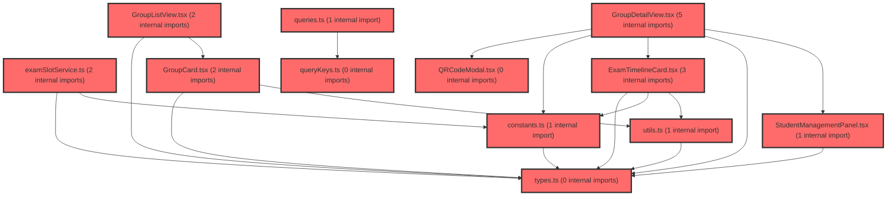

> [!IMPORTANT]
> **⚠️ 수동 검토 권장 (자가힐링 주의)**
>
> AI 자가힐링 결과물이 실제 의도와 다를 수 있으므로, **상세 리뷰 내용에 기반한 수동 점검**을 우선해 주시기 바랍니다. 자가힐링 기능을 활용하실 경우 최종 결과물을 신중하게 확인해 주세요.

# 코드 리뷰 - 7606d215

## 코드 복잡도 분석

**분석된 파일**: 21개 / 변경된 파일: 31개


### Import 의존관계 다이어그램



**범례**: 중심 파일 (변경됨) | 많은 import (10개 이상)


### 정상 범위 (NONE)


**`routes.tsx`** (other)

- 평균 복잡도: **0.078**

- 최대 복잡도: 0.463

- 청크 수: 16개

- 평균 사용처: 3.5곳


**권장사항:**

- 복잡도 정상 범위


**`index.ts`** (component)

- 평균 복잡도: **0.035**

- 최대 복잡도: 0.461

- 청크 수: 26개

- 평균 사용처: 2.3곳


**권장사항:**

- 파일 크기가 큼 (26개 청크) - 파일 분리 검토


**`index.ts`** (other)

- 평균 복잡도: **0.004**

- 최대 복잡도: 0.004

- 청크 수: 1개


**권장사항:**

- 복잡도 정상 범위


**`examslotservice.ts`** (other)

- 평균 복잡도: **0.003**

- 최대 복잡도: 0.013

- 청크 수: 5개


**권장사항:**

- 복잡도 정상 범위


**`queries.ts`** (other)

- 평균 복잡도: **0.003**

- 최대 복잡도: 0.012

- 청크 수: 46개


**권장사항:**

- 파일 크기가 큼 (46개 청크) - 파일 분리 검토


**`examservice.ts`** (other)

- 평균 복잡도: **0.003**

- 최대 복잡도: 0.011

- 청크 수: 35개


**권장사항:**

- 파일 크기가 큼 (35개 청크) - 파일 분리 검토


**`index.ts`** (other)

- 평균 복잡도: **0.003**

- 최대 복잡도: 0.011

- 청크 수: 92개


**권장사항:**

- 파일 크기가 큼 (92개 청크) - 파일 분리 검토


**`useapidata.ts`** (other)

- 평균 복잡도: **0.002**

- 최대 복잡도: 0.010

- 청크 수: 58개


**권장사항:**

- 파일 크기가 큼 (58개 청크) - 파일 분리 검토


**`querykeys.ts`** (other)

- 평균 복잡도: **0.002**

- 최대 복잡도: 0.003

- 청크 수: 3개


**권장사항:**

- 복잡도 정상 범위


**`types.ts`** (other)

- 평균 복잡도: **0.002**

- 최대 복잡도: 0.006

- 청크 수: 10개


**권장사항:**

- 복잡도 정상 범위


**`utils.ts`** (utility)

- 평균 복잡도: **0.002**

- 최대 복잡도: 0.006

- 청크 수: 15개


**권장사항:**

- 복잡도 정상 범위


**`assessmentpage.tsx`** (component)

- 평균 복잡도: **0.002**

- 최대 복잡도: 0.011

- 청크 수: 47개


**권장사항:**

- 파일 크기가 큼 (47개 청크) - 파일 분리 검토


**`constants.ts`** (other)

- 평균 복잡도: **0.001**

- 최대 복잡도: 0.002

- 청크 수: 7개


**권장사항:**

- 복잡도 정상 범위


**`examtimelinecard.tsx`** (other)

- 평균 복잡도: **0.001**

- 최대 복잡도: 0.006

- 청크 수: 19개


**권장사항:**

- 복잡도 정상 범위


**`groupdetailview.tsx`** (component)

- 평균 복잡도: **0.001**

- 최대 복잡도: 0.007

- 청크 수: 25개


**권장사항:**

- 파일 크기가 큼 (25개 청크) - 파일 분리 검토


**`grouplistview.tsx`** (component)

- 평균 복잡도: **0.001**

- 최대 복잡도: 0.004

- 청크 수: 9개


**권장사항:**

- 복잡도 정상 범위


**`qrcodemodal.tsx`** (other)

- 평균 복잡도: **0.001**

- 최대 복잡도: 0.006

- 청크 수: 10개


**권장사항:**

- 복잡도 정상 범위


**`studentmanagementpanel.tsx`** (other)

- 평균 복잡도: **0.001**

- 최대 복잡도: 0.004

- 청크 수: 7개


**권장사항:**

- 복잡도 정상 범위


**`emptystate.tsx`** (store)

- 평균 복잡도: **0.000**

- 최대 복잡도: 0.000

- 청크 수: 2개


**권장사항:**

- Store 파일은 높은 연결도가 정상적임


**`groupcard.tsx`** (other)

- 평균 복잡도: **0.000**

- 최대 복잡도: 0.000

- 청크 수: 4개


**권장사항:**

- 복잡도 정상 범위


**`index.ts`** (other)

- 평균 복잡도: **0.000**

- 최대 복잡도: 0.000

- 청크 수: 8개


**권장사항:**

- 복잡도 정상 범위


---


## 변경 배경

이 커밋은 `features/assessment-v2/` 디렉토리를 `features/assessment/`로 통합하는 리팩토링입니다. 기존에 `assessment`와 `assessment-v2`로 분리되어 있던 검사(assessment) 관련 기능을 단일 feature로 병합하고, 사용되지 않는 레거시 코드를 정리하였습니다.

- **목적**: 중복된 feature 디렉토리 구조 통합 및 데드 코드 제거를 통한 유지보수성 향상
- **도메인**: 비즈니스 로직 / UI (프론트엔드 아키텍처)
- **변경 방향**: `assessment-v2`의 컴포넌트와 서비스를 `assessment`로 승격시키고, 레거시 `assessment`의 미사용 코드를 제거하여 단일 책임을 가진 feature로 정리

## [GOOD] 잘된 점

1. **데드 코드 제거의 명확성**: `assessmentMetaStorage.ts`(로컬 스토리지 기반 메타데이터 저장소), `config.ts`(QR 코드 카운터/학교급 변환), `AssessmentCodeModal.tsx`, `AssessmentList.tsx`, `CreateAssessmentModal.tsx`, `DataReviewTable.tsx` 등 사용되지 않는 코드를 과감히 제거하여 코드베이스의 복잡도를 낮췄습니다. `get_symbol_references` 도구로 확인한 결과, 제거된 심볼들(`useAssessmentExamListByGroupsQuery`, `assessmentMetaStorage`)이 실제로 어디에서도 참조되지 않음을 확인하였습니다.

2. **쿼리 키 정리**: `queryKeys.ts`에서 `examLists()`와 `examListByGroups()` 키를 제거하고, `useInvalidateAssessmentGroup`에서 불필요한 `assessmentKeys.examLists()` 무효화 호출을 제거한 것은 TanStack Query 캐시 관리 측면에서 올바른 방향입니다. 불필요한 캐시 무효화를 줄여 불필요한 네트워크 요청을 방지합니다.

3. **파일 이동의 일관성**: `examSlotService.ts`, `constants.ts`, `types.ts`를 `assessment-v2`에서 `assessment`로 이동하면서 파일 내용은 그대로 유지하여(similarity index 100%) 기능 변경 없이 구조만 개선한 점이 좋습니다.

## 변경사항 요약

- `assessment-v2/` 디렉토리 삭제 및 모든 파일을 `assessment/`로 이동
- `AssessmentPageV2` → `AssessmentPage`로 라우트 컴포넌트명 변경
- `queries.ts`에서 `useAssessmentExamListByGroupsQuery` 훅 제거 및 관련 쿼리 키 정리
- 6개의 레거시 UI 컴포넌트 및 2개의 유틸리티 모듈(`assessmentMetaStorage.ts`, `config.ts`) 삭제
- `assessment/index.ts`의 public API를 v2 컴포넌트 중심으로 재구성

---

## [ISSUE] 개선이 필요한 부분

### Critical (즉시 수정 필요)

없음

### High (우선 수정 권장)

없음

### Medium (개선 권장)

1. **`fetchExamList` 함수의 미사용 파라미터**

   `assessmentService.ts`의 `fetchExamList` 함수는 `_tcId`와 `_paperIdx` 파라미터를 underscore prefix로 받고 있지만 실제로 사용하지 않고, `claId`만으로 API를 호출합니다. `examSlotService.ts`에서 이 함수를 호출할 때 `tcId`를 전달하지만 무시됩니다.

   - **위치**: `frontend/src/features/assessment/api/assessmentService.ts`, 라인 94-95
   - **기존 코드**:
   ```typescript
   export async function fetchExamList(
     claId: string,
     _tcId: string,
     _paperIdx?: string,
   ): Promise<ExamListItem[]> {
     const endpoint = `/api/dgnss/tc/info?claId=${claId}`;
   ```
   - **해결 방안**: 이 함수의 시그니처를 실제 사용에 맞게 단순화하는 것이 좋습니다. 다만 `examSlotService.ts`에서 `tcId`를 인자로 받아 전달하는 구조이므로, 함수 시그니처 변경 시 호출부도 함께 수정해야 합니다. 이는 이번 커밋의 범위를 벗어나므로 별도 이슈로 기록하는 것을 권장합니다.

2. **`examSlotService.ts`의 `tcId` 파라미터 불일치**

   `examSlotService.ts`의 `getExamSlots` 함수는 `tcId`를 파라미터로 받아 `fetchExamList`에 전달하지만, `fetchExamList`는 `tcId`를 무시합니다. `tcId`가 향후 API 변경에 대비한 예비 파라미터라면 명시적인 주석이 있으면 좋겠습니다.

   - **위치**: `frontend/src/features/assessment/api/examSlotService.ts`, 라인 3
   - **기존 코드**:
   ```typescript
   export async function getExamSlots(claId: string, tcId: string): Promise<ExamSlotState[]> {
     const items = await fetchExamList(claId, tcId);
   ```
   - **해결 방안**: `tcId`가 현재 사용되지 않는다면 `fetchExamList` 호출 시 생략하거나, 향후 사용 계획에 대한 주석을 추가하는 것이 좋습니다.

---

## 최종 평가

**결론**:
- [ ] [OK] **승인 (Approved)** - Critical/High 이슈 없음
- [x] [WARN] **조건부 승인 (Approved with Comments)** - Medium 이하 이슈만 존재
- [ ] [FIX] **수정 필요 (Changes Requested)** - Critical/High 이슈 존재

**종합 의견**: 이 커밋은 `assessment-v2`를 `assessment`로 통합하고 데드 코드를 제거하는 명확한 목적을 가진 리팩토링입니다. 제거된 모든 코드가 실제로 미사용 상태임을 확인하였고, 파일 이동과 라우트 변경이 일관성 있게 수행되었습니다. `fetchExamList`의 미사용 파라미터 문제는 이 커밋 이전부터 존재하던 사항으로, 별도 이슈로 추적하는 것을 권장합니다. 전반적으로 코드베이스의 유지보수성을 높이는 긍정적인 변경입니다.