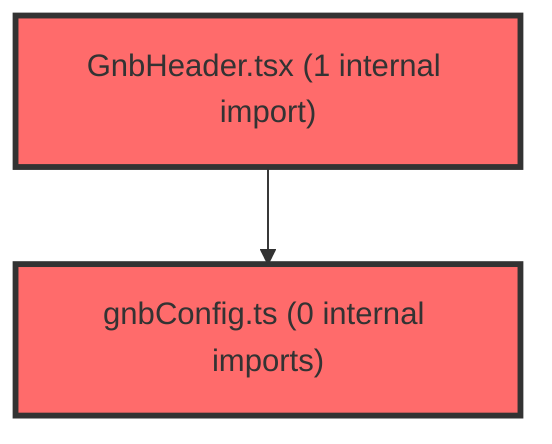

> [!IMPORTANT]
> **⚠️ 수동 검토 권장 (자가힐링 주의)**
>
> AI 자가힐링 결과물이 실제 의도와 다를 수 있으므로, **상세 리뷰 내용에 기반한 수동 점검**을 우선해 주시기 바랍니다. 자가힐링 기능을 활용하실 경우 최종 결과물을 신중하게 확인해 주세요.

# 코드 리뷰 - 76c52a87

## 코드 복잡도 분석

**분석된 파일**: 3개 / 변경된 파일: 4개


### Import 의존관계 다이어그램



**범례**: 중심 파일 (변경됨) | 많은 import (10개 이상)


### 정상 범위 (NONE)


**`scopeconfig.ts`** (config)

- 평균 복잡도: **0.003**

- 최대 복잡도: 0.009

- 청크 수: 13개


**권장사항:**

- Config 파일은 높은 연결도가 정상적임


**`gnbconfig.ts`** (config)

- 평균 복잡도: **0.003**

- 최대 복잡도: 0.013

- 청크 수: 9개


**권장사항:**

- Config 파일은 높은 연결도가 정상적임


**`gnbheader.tsx`** (other)

- 평균 복잡도: **0.000**

- 최대 복잡도: 0.003

- 청크 수: 54개


**권장사항:**

- 파일 크기가 큼 (54개 청크) - 파일 분리 검토


---


## 변경 배경

이 커밋은 v2 IA(Information Architecture) 기반의 새로운 GNB(Global Navigation Bar) 헤더를 구현하고, '생활기록부 작성' 메뉴를 추가하는 작업입니다.

- **목적**: v2 레이아웃 시스템의 GNB 헤더 컴포넌트 도입 및 '생활기록부 작성(exam/record)' 서브탭 추가
- **도메인**: UI / 레이아웃 (프론트엔드)
- **변경 방향**: 기존 v1 GNB를 대체하는 v2 GNB 헤더를 신규 작성. 메뉴 활성 상태를 컨텍스트가 아닌 pathname 기반으로 파생하여 단순화하고, 스코프 쿼리 유지 로직을 내장

---

## [GOOD] 잘된 점

1. **단일 소스(Single Source of Truth) 설계**: `gnbConfig.ts`에 GNB 아이템과 서브탭을 한 곳에 정의하고, `GnbHeader`와 이후 서브탭 바(P1-6)가 같은 데이터를 공유하도록 설계한 점이 좋습니다. `getActiveGnbId`, `getActiveSubTabId` 같은 순수 함수로 활성 상태를 pathname에서 파생하는 접근도 깔끔합니다.

2. **스코프 쿼리 유지 로직**: GNB pill 클릭 시 `buildScopeQueryString(scope)`를 통해 현재 스코프(`?class=&student=`)를 유지한 채 이동하도록 구현한 점이 사용자 경험 측면에서 적절합니다. `buildScopeQueryString` 함수는 `useScopeSync.ts`에서 `classId`와 `studentId`가 있을 때만 쿼리 파라미터를 구성하도록 구현되어 있어 불필요한 빈 쿼리스트링을 방지합니다.

3. **접근성 고려**: `aria-label` 속성을 로고 버튼(`'홈'`), GNB 네비게이션(`'주요 메뉴'`), AI 어시스턴트 버튼(`'AI 어시스턴트'`), 로그아웃 버튼(`'로그아웃'`) 등 주요 인터랙티브 요소에 적용한 점이 좋습니다.

4. **Emotion styled-components의 테마 시스템 활용**: `theme.colors`, `theme.spacing`, `theme.radius`, `theme.zIndex`, `theme.shadows`, `theme.transitions`, `theme.typography` 등 테마 변수를 일관되게 사용하여 디자인 시스템과의 정합성을 유지했습니다.

---

## 변경사항 요약

- `scopeConfig.ts`: `MenuKey`에 `'exam/record'` 추가 및 `MENU_SCOPE_MATRIX`에 `{ all: true, class: true, student: true }`로 등록
- `gnbConfig.ts` (신규): GNB 3개(검사·코칭·수업)와 서브탭 구성 데이터, 활성 GNB/서브탭 판별 함수 정의
- `GnbHeader.tsx` (신규): 고정 헤더 컴포넌트 (좌: 로고, 중앙: GNB pill, 우: 알림벨 + AI어시스턴트 + 유저메뉴)
- `ai-owl-icon.png` (신규): AI 어시스턴트 아이콘 이미지

---

## [ISSUE] 개선이 필요한 부분

### Critical (즉시 수정 필요)

없음

### High (우선 수정 권장)

**1. `handleLogout`에서 `navigate('/')` 호출 시점 문제**

- **파일**: `frontend/src/widgets/layout/v2/GnbHeader.tsx`
- **위치 (라인 번호)**: 237-240
- **기존 코드**:
```typescript
const handleLogout = () => {
    logout();
    navigate('/');
  };
```
- **문제점**: `logout()` 호출 후 `navigate('/')`가 실행되는 시점에 이미 `AuthContext`의 `user` 상태가 `null`로 변경되어 있을 가능성이 있습니다. `AuthContext.tsx`의 `AuthContextType` 인터페이스를 보면 `logout`은 `() => void` 타입으로 동기 함수입니다. 그러나 `AuthProvider` 내부에서 `logout()`이 `setUser(null)`을 호출한 후 React의 상태 업데이트가 배치(batch) 처리되면서 `navigate('/')`가 실행되는 시점에는 아직 `user`가 `null`로 변경되지 않았을 수 있습니다.

  더 중요한 것은, `AuthProvider`가 `user`를 `null`로 설정하면 보호된 라우트(ProtectedRoute)에서 자동으로 `/`로 리다이렉트할 가능성이 높다는 점입니다. 이 경우 `navigate('/')`는 중복 호출이 됩니다. `AuthContext.tsx`의 `logout` 함수 구현을 확인해보면 SDK의 `clearTokens()`를 호출하고 `onAuthChange(null)` 콜백을 통해 상태를 변경하는 구조이므로, `navigate('/')`는 제거하거나 `logout()`이 완전히 완료된 후에 호출되도록 보장해야 합니다.

- **해결 방안 (수정 코드)**:
```typescript
const handleLogout = () => {
    logout();
    // logout() 내부에서 AuthContext 상태 변경 → ProtectedRoute가 리다이렉트 처리
    // 별도 navigate('/') 호출은 중복이므로 제거
  };
```
  만약 `ProtectedRoute`에서 자동 리다이렉트를 처리하지 않는 구조라면, `logout()`이 Promise를 반환하도록 변경하거나 `useEffect`를 통해 `user` 상태 변화를 감지하여 리다이렉트하는 방식이 더 안전합니다.

### Medium (개선 권장)

**1. `GnbButton`의 `$active` prop에 대한 `:hover` 스타일 중복**

- **파일**: `frontend/src/widgets/layout/v2/GnbHeader.tsx`
- **위치 (라인 번호)**: 82-93
- **기존 코드**:
```typescript
const GnbButton = styled.button<{ $active: boolean }>`
  ...
  color: ${({ theme, $active }) => ($active ? theme.colors.primary[600] : theme.colors.gray[500])};
  box-shadow: ${({ theme, $active }) => ($active ? theme.shadows.sm : 'none')};

  &:hover {
    color: ${({ theme, $active }) =>
      $active ? theme.colors.primary[600] : theme.colors.gray[700]};
  }
`;
```
- **개선 제안**: `$active`가 `true`일 때 `:hover`의 `color`가 기본 상태와 동일한 `primary[600]`입니다. 이는 활성화된 pill에 마우스를 올려도 시각적 피드백이 전혀 없음을 의미합니다. 비활성 pill에만 hover 효과를 주려는 의도라면, `$active`가 `true`일 때 `:hover` 스타일을 아예 생략하거나 `cursor: default`를 추가하여 사용자에게 "이 버튼은 이미 활성화되어 있어 클릭해도 변화가 없다"는 것을 명시적으로 전달하는 것이 좋습니다.

```typescript
const GnbButton = styled.button<{ $active: boolean }>`
  ...
  cursor: ${({ $active }) => ($active ? 'default' : 'pointer')};
  color: ${({ theme, $active }) => ($active ? theme.colors.primary[600] : theme.colors.gray[500])};
  box-shadow: ${({ theme, $active }) => ($active ? theme.shadows.sm : 'none')};

  &:hover {
    color: ${({ theme, $active }) =>
      $active ? theme.colors.primary[600] : theme.colors.gray[700]};
  }
`;
```

**2. `GnbNav`의 중앙 정렬 방식**

- **파일**: `frontend/src/widgets/layout/v2/GnbHeader.tsx`
- **위치 (라인 번호)**: 62-69
- **기존 코드**:
```typescript
const GnbNav = styled.nav`
  position: absolute;
  left: 50%;
  transform: translateX(-50%);
  ...
`;
```
- **개선 제안**: `HeaderContent`가 `display: flex; justify-content: space-between`이므로, GNB pill이 좌우 요소(로고, 우측 액션) 사이에서 정확히 중앙에 위치해야 합니다. `position: absolute` 방식은 좌우 요소의 너비에 따라 중앙 정렬이 깨질 수 있습니다. `flex: 1`을 가진 중간 영역을 별도로 두고 `justify-content: center`로 정렬하는 방식이 더 안정적입니다. 다만 현재 동작에 문제가 없다면 우선순위가 낮은 개선 사항입니다.

---

## 주요 파일 분석

### `frontend/src/widgets/layout/v2/gnbConfig.ts` (신규)

**변경 내용:**
GNB 3개 메뉴(검사·코칭·수업)와 각 서브탭을 정의하는 설정 파일. `getActiveGnbId`, `getActiveSubTabId` 순수 함수 제공.

**분석:**
- `GnbItem` 인터페이스는 `id`, `label`, `path`, `subTabs` 필드로 구성되어 있으며, `subTabs`는 `GnbSubTab[]` 배열입니다.
- `getActiveGnbId`는 `pathname === item.path || pathname.startsWith(item.path + '/')` 조건으로 매칭합니다. 이는 `/exam/management`와 같은 하위 경로도 `exam` GNB에 속하도록 처리합니다.
- `getActiveSubTabId`는 동일한 방식으로 서브탭을 매칭합니다.
- `getActiveSubTabId` 함수가 현재 `GnbHeader`에서 사용되지 않음 (P1-6에서 사용 예정). 사용 시점에 추가 검토 필요.

### `frontend/src/shared/scope/scopeConfig.ts`

**변경 내용:**
`MenuKey` 타입과 `MENU_SCOPE_MATRIX`에 `'exam/record'` 항목 추가 (all/class/student 모두 true).

**분석:**
- 기존 패턴과 완전히 일관되게 추가되어 있습니다.
- `getMenuKeyFromPath` 함수는 2-depth 경로(`exam/record`)를 먼저 매칭하므로, `/exam/record` 경로가 정확히 `'exam/record'` 메뉴 키로 매핑됩니다.
- `MENU_SCOPE_MATRIX`에서 `'exam/record'`는 `{ all: true, class: true, student: true }`로 설정되어 있어, 전체/반/학생 모든 스코프 레벨을 지원합니다.

### `frontend/src/widgets/layout/v2/GnbHeader.tsx` (신규)

**변경 내용:**
고정 헤더 컴포넌트. 좌측 로고 버튼, 중앙 GNB pill 네비게이션, 우측 알림벨 + AI어시스턴트 + 유저메뉴 영역으로 구성.

**분석:**
- `GNB_HEADER_HEIGHT = 58`로 상수화하여 다른 컴포넌트에서도 참조 가능하도록 export
- `handleGnbClick`에서 `item.subTabs[0]?.path ?? item.path`로 첫 번째 서브탭으로 이동하는 로직이 안전하게 처리됨 (옵셔널 체이닝 + nullish coalescing)
- `isAssistantActive`는 `pathname === '/ai-assistant' || pathname.startsWith('/ai-assistant/')`로 정확히 매칭
- `BellWithPanel` 컴포넌트는 `@features/notifications`에서 import하여 알림 기능과 분리
- 유저 아바타는 `user.profileImage`가 있을 때만 이미지를 렌더링하고, 없으면 `UserAvatarPlaceholder`로 대체

---

## 최종 평가

**결론**:
- [ ] [OK] **승인 (Approved)** - Critical/High 이슈 없음
- [x] [WARN] **조건부 승인 (Approved with Comments)** - Medium 이하 이슈만 존재
- [ ] [FIX] **수정 필요 (Changes Requested)** - Critical/High 이슈 존재

**종합 의견:**

전반적으로 깔끔하고 일관성 있는 코드입니다. `gnbConfig.ts`의 단일 소스 설계와 pathname 기반 활성 상태 파생 방식이 좋습니다. `handleLogout`의 `navigate('/')` 중복 호출 가능성(High)은 실제 `ProtectedRoute`의 동작을 확인한 후 제거 여부를 결정하시면 됩니다. `GnbButton`의 hover 스타일 중복(Medium)은 사소하지만 접근성 측면에서 개선을 권장합니다. `scopeConfig.ts`의 `'exam/record'` 추가는 기존 패턴과 완벽히 일관되어 추가 검토가 필요하지 않습니다.