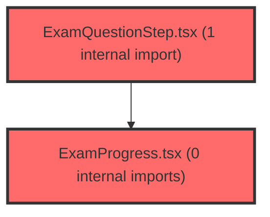

> [!IMPORTANT]
> **⚠️ 수동 검토 권장 (자가힐링 주의)**
>
> AI 자가힐링 결과물이 실제 의도와 다를 수 있으므로, **상세 리뷰 내용에 기반한 수동 점검**을 우선해 주시기 바랍니다. 자가힐링 기능을 활용하실 경우 최종 결과물을 신중하게 확인해 주세요.

# 코드 리뷰 - 79f83faa

## 코드 복잡도 분석

**분석된 파일**: 8개 / 변경된 파일: 8개


### Import 의존관계 다이어그램



**범례**: 중심 파일 (변경됨) | 많은 import (10개 이상)


### 정상 범위 (NONE)


**`examservice.ts`** (other)

- 평균 복잡도: **0.003**

- 최대 복잡도: 0.011

- 청크 수: 37개


**권장사항:**

- 파일 크기가 큼 (37개 청크) - 파일 분리 검토


**`useexamstate.ts`** (store)

- 평균 복잡도: **0.002**

- 최대 복잡도: 0.011

- 청크 수: 31개


**권장사항:**

- 파일 크기가 큼 (31개 청크) - 파일 분리 검토

- Store 파일은 높은 연결도가 정상적임


**`exampage.tsx`** (component)

- 평균 복잡도: **0.002**

- 최대 복잡도: 0.013

- 청크 수: 40개


**권장사항:**

- 파일 크기가 큼 (40개 청크) - 파일 분리 검토


**`studentdashboardpage.tsx`** (component)

- 평균 복잡도: **0.001**

- 최대 복잡도: 0.008

- 청크 수: 48개


**권장사항:**

- 파일 크기가 큼 (48개 청크) - 파일 분리 검토


**`examprogress.tsx`** (other)

- 평균 복잡도: **0.000**

- 최대 복잡도: 0.004

- 청크 수: 27개


**권장사항:**

- 파일 크기가 큼 (27개 청크) - 파일 분리 검토


**`examquestionstep.tsx`** (other)

- 평균 복잡도: **0.000**

- 최대 복잡도: 0.000

- 청크 수: 30개


**권장사항:**

- 파일 크기가 큼 (30개 청크) - 파일 분리 검토


**`myexamlistpage.tsx`** (component)

- 평균 복잡도: **0.000**

- 최대 복잡도: 0.005

- 청크 수: 105개


**권장사항:**

- 파일 크기가 큼 (105개 청크) - 파일 분리 검토


**`myresultpage.tsx`** (component)

- 평균 복잡도: **0.000**

- 최대 복잡도: 0.008

- 청크 수: 91개


**권장사항:**

- 파일 크기가 큼 (91개 청크) - 파일 분리 검토


---


## 변경 배경

이 커밋은 기존 학습종합검사(124문항, 7페이지 구조)만 지원하던 검사 시스템에 **자기조절학습검사(paperIdx='2')** 를 추가하는 기능 확장입니다. 또한 대시보드에서 DataHelperChatbot/RightPanel 컴포넌트를 주석 처리하여 UI를 정리하고, 검사 초기 상태값(totalQuestions, totalPages)을 하드코딩된 값에서 동적 할당 방식으로 변경하였습니다.

- **목적**: 자기조절학습검사(SRL) 지원 추가 및 불필요한 UI 요소 제거
- **도메인**: 비즈니스 로직 (API 서비스, 상태 관리, UI 컴포넌트)
- **변경 방향**: paperIdx 파라미터를 통해 검사지 종류를 분기 처리하여, 학습종합검사는 기존 7페이지+mock 문항 로직을 유지하고 자기조절검사는 단순 페이징으로 처리

---

## [GOOD] 잘된 점

**1. paperIdx 파라미터 기본값 설계**

모든 함수에서 `paperIdx = '1'`을 기본값으로 설정하여 기존 호출 코드와의 하위 호환성을 유지한 점이 좋습니다. 기존 학습종합검사 코드는 변경 없이 그대로 동작합니다.

```typescript
// examService.ts
export function getPageFromAnsweredCount(answeredCount: number, paperIdx: string = '1'): number {
  if (paperIdx !== '1') {
    return Math.floor((answeredCount - 1) / 20);
  }
  // 학습종합검사 (124문항, 7페이지 구조)
  // ...
}
```

**2. 명확한 분기 처리**

`fetchQuestions`, `resetExam`, `getPageFromAnsweredCount`에서 `paperIdx !== '1'` 조건으로 자기조절검사 로직을 조기에 return 처리하여, 학습종합검사의 복잡한 7페이지+mock 로직과의 결합도를 낮췄습니다.

```typescript
// examService.ts - fetchQuestions
export async function fetchQuestions(
  dgnssResultId: number,
  page: number = 0,
  _size: number = 20,
  paperIdx: string = '1',
): Promise<FetchQuestionsResponse> {
  if (paperIdx !== '1') {
    // 자기조절학습검사: 단순 페이징, 백엔드 응답 그대로 사용
    const res = await apiClient.post<QuestionsResponseData>(
      '/api/dgnss/st/start',
      { dgnssResultId, paperIdx: Number(paperIdx), page, size: 20 },
    );
    return {
      omrIdx: res.resultData.omrIdx,
      questions: res.resultData.dgnssQuesList.sort((a, b) => a.NO - b.NO),
      totalPages: res.resultData.page.totalPages,
      totalQuestions: res.resultData.page.totalElements,
      answeredCount: res.resultData.stAnsCnt,
    };
  }
  // 학습종합검사: 7페이지 구조 + 120-124번 mock 문항
  // ...
}
```

**3. SRL 전용 색상 상수 분리**

`ExamProgress.tsx`에서 `SRL_COLOR` 상수를 `as const`로 선언하여 테마 색상과 독립적으로 관리한 점이 깔끔합니다. `$isSrl` transient prop을 통해 스타일드 컴포넌트에 조건부 스타일링을 적용한 방식도 적절합니다.

```typescript
// ExamProgress.tsx
const SRL_COLOR = {
  main: '#009F88',
  dark: '#007a6a',
  light: '#cdf0ec',
} as const;

const Count = styled.span<{ $isSrl: boolean }>`
  color: ${({ $isSrl, theme }) => ($isSrl ? SRL_COLOR.dark : theme.colors.primary[600])};
`;
```

**4. 초기 상태값을 하드코딩에서 동적 할당으로 변경**

`useExamState.ts`에서 `totalQuestions: 124`, `totalPages: 7`을 각각 `0`으로 변경하여, API 응답에 따라 동적으로 설정되도록 개선한 점이 좋습니다. 이는 자기조절검사(문항 수가 다름)를 지원하기 위한 필수 변경입니다.

```typescript
// useExamState.ts
const initialState: ExamState = {
  // ...
  totalQuestions: 0,  // 124 -> 0 (동적 할당)
  totalPages: 0,      // 7 -> 0 (동적 할당)
  // ...
};
```

---

## 변경사항 요약

7개 파일이 변경되었습니다. 핵심은 `examService.ts`의 `fetchQuestions`, `resetExam`, `getPageFromAnsweredCount`에 `paperIdx` 파라미터를 추가하고 자기조절검사 분기 로직을 구현한 것입니다. `ExamProgress.tsx`와 `ExamQuestionStep.tsx`에는 SRL 색상 테마가 추가되었고, `useExamState.ts`의 초기값이 하드코딩에서 동적 할당으로 변경되었습니다. `StudentDashboardPage.tsx`와 `MyResultPage.tsx`에서는 DataHelperChatbot/RightPanel이 주석 처리되었습니다.

---

## [ISSUE] 개선이 필요한 부분

### Critical (즉시 수정 필요)

**없음**

### High (우선 수정 권장)

**1. `ExamPage.tsx`의 `useCallback` 의존성 배열에서 `examPaperIdx` 누락 (stale closure)**

`handleStartExam`, `handleGuideStart`, `handleNextPage`, `handlePrevPage`, `handleSubmit` 다섯 개의 `useCallback`에서 `examPaperIdx`를 내부에서 참조하고 있지만, **의존성 배열에 `examPaperIdx`가 포함되어 있지 않습니다.**

**영향 분석:**

`examPaperIdx`는 `ExamPage` 컴포넌트 최상위에서 다음과 같이 선언됩니다:

```typescript
// ExamPage.tsx 라인 160
const examPaperIdx = studentExamState?.paperIdx ?? '1';
```

이 값은 `location.state`에서 추출되며, 컴포넌트가 마운트될 때 한 번 결정됩니다. 따라서 현재 구현에서는 `examPaperIdx`가 런타임에 변경될 가능성이 낮아 실제 버그가 발생하지는 않을 가능성이 높습니다. 그러나 React의 `useCallback` 규칙을 위반하는 코드이므로, 향후 리팩토링(예: 검사 전환 기능 추가) 시 예기치 않은 stale closure 버그의 원인이 될 수 있습니다.

**각 콜백의 의존성 배열 현황:**

| 콜백 | 라인 | 현재 의존성 배열 | 누락 여부 |
|------|------|-----------------|-----------|
| handleStartExam | 508 | `[state.dgnssResultId, isRestartMode, loadQuestions, loadExistingAnswers, setStep]` | 누락 |
| handleGuideStart | 608 | (전체 확인 필요) | 누락 |
| handleNextPage | 658 | `[state, loadQuestions, loadExistingAnswers, setCurrentPage]` | 누락 |
| handlePrevPage | 693 | `[state, loadQuestions, loadExistingAnswers, setCurrentPage]` | 누락 |
| handleSubmit | 709 | (전체 확인 필요) | 누락 |

**해결 방안:**

각 `useCallback`의 의존성 배열 마지막에 `examPaperIdx`를 추가하세요. 예를 들어 `handleNextPage`의 경우:

```typescript
// 수정 전 (라인 658)
}, [state, loadQuestions, loadExistingAnswers, setCurrentPage]);

// 수정 후
}, [state, loadQuestions, loadExistingAnswers, setCurrentPage, examPaperIdx]);
```

`handleStartExam`의 경우:

```typescript
// 수정 전 (라인 508)
}, [state.dgnssResultId, isRestartMode, loadQuestions, loadExistingAnswers, setStep]);

// 수정 후
}, [state.dgnssResultId, isRestartMode, loadQuestions, loadExistingAnswers, setStep, examPaperIdx]);
```

> **참고**: `handleGuideStart`와 `handleSubmit`의 정확한 의존성 배열 전체 내용은 Diff 범위 밖의 코드이므로, CP님께서 직접 해당 `useCallback`의 닫는 괄호(`]`) 직전에 `examPaperIdx`를 추가해 주시기 바랍니다.

---

### Medium (개선 권장)

**1. `resetExam`의 자기조절검사 분기에서 불필요한 API 호출**

`resetExam` 함수에서 자기조절검사(paperIdx !== '1')의 경우, `GET /api/dgnss/st/new`로 reset을 수행한 후 **항상 `POST /api/dgnss/st/start`로 page=0부터 재조회**합니다. 그런데 `resetExam`의 `page` 파라미터는 전혀 사용되지 않고 무시됩니다.

```typescript
// examService.ts 라인 295-310
if (paperIdx !== '1') {
    await apiClient.get<QuestionsResponseData>(
      `/api/dgnss/st/new?dgnssResultId=${dgnssResultId}&paperIdx=${paperIdx}&page=${page}&size=20`,
    );
    const startRes = await apiClient.post<QuestionsResponseData>(
      '/api/dgnss/st/start',
      { dgnssResultId, paperIdx: Number(paperIdx), page: 0, size: 20 },
    );
    // ...
}
```

**문제점:**
1. `GET /api/dgnss/st/new`에 `page=${page}`를 전달하지만, reset API는 모든 답안을 초기화하는 것이 목적이므로 page 파라미터가 무의미합니다.
2. reset 후 항상 page=0부터 재조회하는데, `ExamPage.tsx`의 호출부(`resetExam(state.dgnssResultId, 0, 20, examPaperIdx)`)에서는 항상 page=0을 전달하므로 실제로는 문제가 없지만, 함수 시그니처가 오해의 소지가 있습니다.

**제안:** `page` 파라미터가 자기조절검사에서 사용되지 않음을 주석으로 명시하거나, 함수 시그니처를 개선하는 것을 검토하세요.

**2. `ExamProgress.tsx`의 `isSrl` 조건이 `paperIdx !== '1'`로만 판단됨**

`isSrl`이 `paperIdx !== '1'`로만 결정되는데, 이는 paperIdx가 '1' 또는 '2'만 있다는 가정에 의존합니다. 향후 '3', '4' 등의 새로운 검사지 타입이 추가되면 모두 SRL 색상으로 표시됩니다.

```typescript
// ExamProgress.tsx 라인 113
const isSrl = paperIdx !== '1';
```

**제안:** `paperIdx === '2'`로 명시적으로 비교하거나, 검사지 타입별 색상 맵을 도입하는 것이 더 확장성 있습니다. 다만 현재 요구사항에는 부합하므로 Medium 수준으로만 기록합니다.

**3. `ExamQuestionStep.tsx`의 `canSubmit` 조건 중복**

`canSubmit` 조건에서 `answeredCount >= totalQuestions`가 이미 `paperIdx === '1' && answeredCount >= 124`를 포함하는 경우가 있습니다(자기조절검사는 totalQuestions가 정확하므로). 학습종합검사에서도 `totalQuestions`가 124로 설정되므로, 사실상 `answeredCount >= 124` 조건은 `answeredCount >= totalQuestions`에 의해 항상 커버됩니다.

```typescript
// ExamQuestionStep.tsx 라인 161-162
const canSubmit =
    allCurrentPageAnswered &&
    (answeredCount >= totalQuestions || (paperIdx === '1' && answeredCount >= 124));
```

**제안:** `paperIdx === '1' && answeredCount >= 124` 조건은 `answeredCount >= totalQuestions`와 중복됩니다(학습종합검사의 totalQuestions는 124로 설정됨). 불필요한 fallback 조건이므로 제거를 검토할 수 있습니다. 다만 API 응답의 totalQuestions가 불확실한 상황을 대비한 안전장치로 의도된 것이라면 유지해도 무방합니다.

---

## 최종 평가

**결론**: [FIX] **수정 필요 (Changes Requested)**

**종합 의견:**

전반적으로 자기조절학습검사 지원을 위한 변경 방향은 적절하며, paperIdx 파라미터를 통한 분기 처리와 하위 호환성 유지도 잘 설계되었습니다. SRL 전용 색상 상수 분리, 초기 상태값 동적 할당 변경 등 세부 구현도 깔끔합니다.

다만 **`ExamPage.tsx`의 5개 `useCallback`에서 `examPaperIdx`가 의존성 배열에서 누락된 stale closure 문제**는 반드시 수정이 필요합니다. 현재 `examPaperIdx`가 컴포넌트 생명주기 동안 변경되지 않는 값이므로 실제 버그가 발생하지는 않을 가능성이 높지만, React의 `useCallback` 규칙을 위반하는 코드이므로 향후 리팩토링 시 예기치 않은 버그의 원인이 될 수 있습니다. 의존성 배열에 `examPaperIdx`를 추가하는 간단한 수정으로 해결되므로, 커밋 전에 반드시 확인해 주시기 바랍니다.