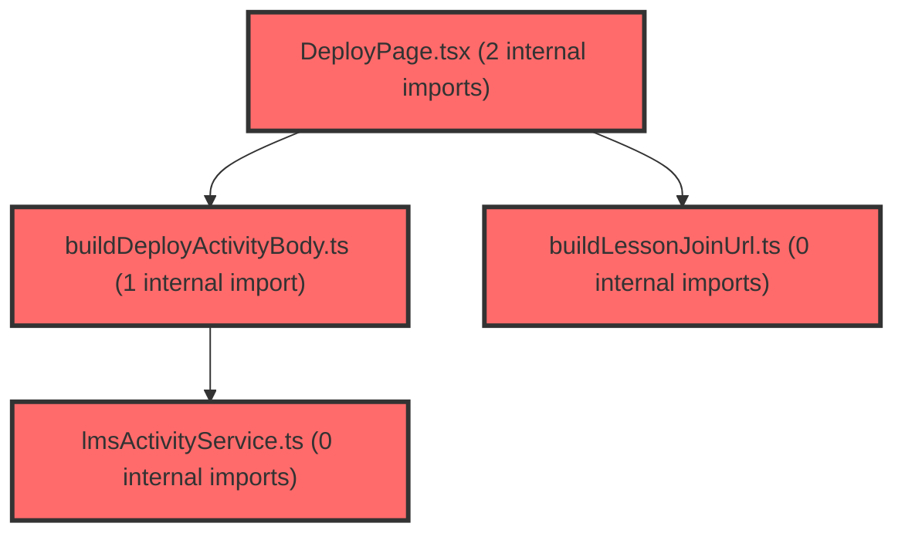

> [!IMPORTANT]
> **⚠️ 수동 검토 권장 (자가힐링 주의)**
>
> AI 자가힐링 결과물이 실제 의도와 다를 수 있으므로, **상세 리뷰 내용에 기반한 수동 점검**을 우선해 주시기 바랍니다. 자가힐링 기능을 활용하실 경우 최종 결과물을 신중하게 확인해 주세요.

# 코드 리뷰 - 7b0c5aa7

## 코드 복잡도 분석

**분석된 파일**: 8개 / 변경된 파일: 9개


### Import 의존관계 다이어그램



**범례**: 중심 파일 (변경됨) | 많은 import (10개 이상)


### 정상 범위 (NONE)


**`routes.tsx`** (other)

- 평균 복잡도: **0.054**

- 최대 복잡도: 0.463

- 청크 수: 23개

- 평균 사용처: 2.4곳


**권장사항:**

- 파일 크기가 큼 (23개 청크) - 파일 분리 검토


**`buildlessonjoinurl.ts`** (utility)

- 평균 복잡도: **0.004**

- 최대 복잡도: 0.004

- 청크 수: 2개


**권장사항:**

- 복잡도 정상 범위


**`lmsactivityservice.ts`** (other)

- 평균 복잡도: **0.003**

- 최대 복잡도: 0.007

- 청크 수: 26개


**권장사항:**

- 파일 크기가 큼 (26개 청크) - 파일 분리 검토


**`builddeployactivitybody.ts`** (other)

- 평균 복잡도: **0.002**

- 최대 복잡도: 0.010

- 청크 수: 13개


**권장사항:**

- 복잡도 정상 범위


**`lessonjoinpage.tsx`** (component)

- 평균 복잡도: **0.002**

- 최대 복잡도: 0.013

- 청크 수: 14개


**권장사항:**

- 복잡도 정상 범위


**`index.ts`** (other)

- 평균 복잡도: **0.001**

- 최대 복잡도: 0.005

- 청크 수: 27개


**권장사항:**

- 파일 크기가 큼 (27개 청크) - 파일 분리 검토


**`lessoneditorpage.tsx`** (component)

- 평균 복잡도: **0.001**

- 최대 복잡도: 0.011

- 청크 수: 27개


**권장사항:**

- 파일 크기가 큼 (27개 청크) - 파일 분리 검토


**`deploypage.tsx`** (component)

- 평균 복잡도: **0.000**

- 최대 복잡도: 0.005

- 청크 수: 175개


**권장사항:**

- 파일 크기가 큼 (175개 청크) - 파일 분리 검토


---


## 변경 배경

이 커밋은 lesson 기능의 LMS 활동 배포(추가계획11·12) Phase B 구현입니다. 기존에는 DeployPage의 `doDeploy`가 로컬 상태만 변경하고 API 호출이 없었으나, 이번 변경으로 `POST /activities` → `publish` 순차 호출을 통해 실제 활동을 생성하고 `accessKey`를 받아 참여 URL·QR을 조립합니다. 또한 학생용 `/student/lesson/:activityId` 라우트에 임시 `:setId` path를 추가하여 Phase B API 연동 전까지 embed 확인이 가능하도록 했습니다.

- **목적**: 교사가 수업을 배포(시작)할 때 LMS 활동을 생성·발행하고, 학생 참여 링크·QR을 실제 값으로 제공
- **도메인**: API 연동 (LMS), 비즈니스 로직 (배포 파이프라인), UI (DeployPage)
- **변경 방향**: 스켈레톤(throw) → 실호출, 단일 호출 → 순차 파이프라인(create→assign→publish), 중도 실패 시 단계별 재시도 지원

## [GOOD] 잘된 점

1. **순차 파이프라인과 재시도 설계가 명확함**: `deployLessonActivity`가 create → assignees(조건부) → publish를 순서대로 호출하고, `resume` 파라미터로 실패한 단계부터 재개할 수 있게 설계했습니다. `shouldRunStep`이 단계 순서를 비교하여 이전 단계를 건너뛰는 로직이 간결하고 정확합니다.
2. **실패 상태를 타입으로 명시**: `DeployLessonActivityFailure`에 `failedStep`, `status`, `activityId`를 포함시켜 호출부가 어떤 단계에서 실패했는지 정확히 알 수 있습니다. `LmsHttpError`에 `status`와 `errorCode`를 포함한 것도 적절합니다.
3. **임시 코드의 제거 계획이 문서화됨**: `buildLessonJoinUrl`의 `lcmsSetId` 인자, `:setId` 라우트, `LessonJoinPage`의 fallback 분기가 모두 "임시"로 명시되고 제거 체크리스트가 plan 문서에 정리되어 있어, 추후 Phase B 착수 시 누락 없이 정리할 수 있습니다.
4. **assignees 매핑 미결 사항을 안전하게 처리**: `ASSIGNEES_MAPPING_PENDING` 상수로 `audienceType`을 강제 `OPEN`으로 고정하여, assigneeSubs 매핑이 확정되기 전에 publish가 409로 실패하는 상황을 방지했습니다.

## 변경사항 요약

- `lmsActivityService.ts`: `createActivity`, `putActivityAssignees`, `publishActivity`, `deployLessonActivity` 실구현 + `LmsHttpError`/`lmsFetch` 공통 처리
- `buildDeployActivityBody.ts` (신규): DeployPage 입력 → `CreateActivityBody` 변환 (mode별 openAt/closeAt, items 구성)
- `buildLessonJoinUrl.ts` (신규): origin + `/student/lesson/:activityId` (+ 임시 `/:setId`)
- `routes.tsx`: `/student/lesson/:activityId/:setId` 임시 라우트 추가
- `index.ts`: `buildLessonJoinUrl` 및 activity service export

---

## [ISSUE] 개선이 필요한 부분

### Critical (즉시 수정 필요)

없음

### High (우선 수정 권장)

1. **`lmsFetch`의 JSON 파싱 실패 처리 부재** (`lmsActivityService.ts`)

   `lmsFetch`는 `res.ok`가 true여도 `res.json()`이 실패할 수 있습니다. 예를 들어 서버가 200 OK지만 빈 본문이나 HTML을 반환하는 경우, `SyntaxError`가 발생하고 이는 `LmsHttpError`가 아닌 일반 `Error`로 전파됩니다. `deployLessonActivity`의 `toFailure`는 `error instanceof LmsHttpError`일 때만 `status`를 추출하므로, JSON 파싱 실패 시 `status: 0`으로 처리되어 디버깅이 어렵습니다.

   - **위치**: `lmsActivityService.ts` `lmsFetch` 함수 내 `res.json()` 호출부
   - **기존 코드**:
   ```ts
   const json = (await res.json()) as LmsApiResponse<T>;
   ```
   - **해결 방안**:
   ```ts
   let json: LmsApiResponse<T>;
   try {
     json = (await res.json()) as LmsApiResponse<T>;
   } catch {
     throw new LmsHttpError(`LMS API 응답 파싱 실패: ${res.status}`, res.status);
   }
   ```

2. **`deployLessonActivity`의 `resume` 없이 assignees 생략 시 publish 단계가 무조건 실행되는 흐름** (`lmsActivityService.ts`)

   `shouldRunStep('publish', resume)`은 `resume`이 없으면 항상 `true`를 반환합니다. 만약 `audienceType: 'ASSIGNED'`이고 `assigneeSubs`가 비어 있어 assignees 단계가 생략된 경우에도 publish가 실행됩니다. plan 문서에 "명단이 비면 `ASSIGNED` 활동은 publish가 409"라고 명시되어 있으므로, 이 경우 409 응답을 받게 됩니다. 이는 의도된 동작일 수 있으나, `shouldRunAssignees`가 false일 때 `audienceType`이 `ASSIGNED`인지 확인하여 사전에 막거나, 최소한 주석으로 명시하는 것이 좋습니다.

   - **위치**: `lmsActivityService.ts` `deployLessonActivity` 함수 내 publish 단계
   - **기존 코드**:
   ```ts
   if (shouldRunStep('publish', resume)) {
   ```
   - **해결 방안** (주석 추가 또는 사전 검증):
   ```ts
   // audienceType이 ASSIGNED인데 assigneeSubs가 없으면 publish가 409가 될 수 있음.
   // assignees 매핑 확정 전에는 buildDeployActivityBody가 OPEN으로 강제하므로 현재는 발생하지 않음.
   if (shouldRunStep('publish', resume)) {
   ```

### Medium (개선 권장)

1. **`buildDeployActivityBody`의 `ASSIGNEES_MAPPING_PENDING` 상수 사용 방식**

   `ASSIGNEES_MAPPING_PENDING = true` 상수가 `audienceType`을 `OPEN`으로 강제하는 데 사용되고 있습니다. 이는 임시 방편이므로, 추후 assignees 매핑이 확정되면 이 상수를 제거하고 `audienceType`을 입력값에 따라 결정하도록 변경해야 합니다. 현재는 상수명이 "매핑 보류 중"이라는 의미를 담고 있어 의도는 명확하지만, 상수값이 `true`일 때 `OPEN`으로 고정되는 로직이 다소 암시적입니다.

   - **위치**: `buildDeployActivityBody.ts` 14-15행, 34행
   - **기존 코드**:
   ```ts
   const ASSIGNEES_MAPPING_PENDING = true;
   // ...
   audienceType: ASSIGNEES_MAPPING_PENDING ? 'OPEN' : 'ASSIGNED',
   ```
   - **해결 방안**:
   ```ts
   // assignees 매핑 확정 후 아래 상수 제거하고 audienceType을 input에서 받도록 변경
   const audienceType: 'ASSIGNED' | 'OPEN' = 'OPEN'; // 임시
   // ...
   audienceType,
   ```

2. **`buildItemsFromCmsSet`의 `sort`가 원본 배열을 변경할 수 있음**

   `[...detail.slides].sort(...)`로 복사 후 정렬하고 있어 원본 배열을 변경하지 않으므로 문제는 없습니다. 다만 `slide.article?.articleId`가 `undefined`인 경우를 필터링한 후 `seq`를 다시 매기는데, 이때 원본 `order` 값과 `seq`가 달라질 수 있습니다. `seq`가 1부터 순차적으로 매겨지는 것이 의도라면 문제없지만, 만약 `order` 값 자체를 `seq`로 사용해야 한다면 주의가 필요합니다.

3. **`buildLessonJoinUrl`의 임시 `lcmsSetId` 인자 제거 시 호출부 일괄 수정 필요**

   현재 `DeployPage`에서 `buildLessonJoinUrl(result.accessKey, setId)`로 호출하고 있습니다. Phase B에서 두 번째 인자를 제거할 때 `DeployPage`뿐 아니라 `LessonJoinPage`의 `:setId` 라우트 분기도 함께 제거해야 합니다. plan 문서에 제거 체크리스트가 잘 정리되어 있으므로, 실제 구현 시 체크리스트를 따라 누락 없이 진행하시기 바랍니다.

---

## 주요 파일 분석

### `frontend/src/features/lesson/api/lmsActivityService.ts`

**변경 내용:**
스켈레톤(throw) → 실호출 구현. `createActivity`, `putActivityAssignees`, `publishActivity`, `deployLessonActivity` 추가.

**개선 제안:**
1. `lmsFetch`의 JSON 파싱 실패 처리 (위 High 이슈 1 참조)
2. `deployLessonActivity`의 `resume` 로직에서 `shouldRunStep`이 `resume` 없이 호출될 때의 동작을 명시적으로 문서화
3. `toFailure`에서 `status: 0`이 나오는 케이스(네트워크 오류 등)에 대한 처리 방안 고려 — 현재는 `status: 0`으로 toast에 `[0]`이 표시될 수 있음

### `frontend/src/features/lesson/model/buildDeployActivityBody.ts`

**변경 내용:**
DeployPage 입력 → `CreateActivityBody` 변환. mode별 openAt/closeAt 설정, items 구성.

**개선 제안:**
1. `ASSIGNEES_MAPPING_PENDING` 상수 제거 시 `audienceType`을 input에서 받도록 변경 (위 Medium 이슈 1 참조)
2. `toIsoStartOfDay`/`toIsoEndOfDay`가 `YYYY-MM-DD` 형식을 가정하고 있는데, 입력값 검증이 없어 잘못된 형식이 들어오면 `Invalid Date`가 생성될 수 있음. 필요 시 검증 로직 추가 고려

### `frontend/src/features/lesson/lib/buildLessonJoinUrl.ts`

**변경 내용:**
신규. origin + `/student/lesson/:activityId` (+ 임시 `/:setId`).

**개선 제안:**
1. 임시 `lcmsSetId` 인자는 Phase B에서 제거 예정이므로, 제거 시 `DeployPage` 호출부와 `LessonJoinPage`의 `:setId` 분기를 함께 수정해야 함
2. `encodeURIComponent`가 `joinKey`와 `lcmsSetId`에 적용되어 있어 특수문자 처리에 문제없음

### `frontend/src/app/router/routes.tsx`

**변경 내용:**
`/student/lesson/:activityId/:setId` 임시 라우트 추가.

**개선 제안:**
1. 임시 라우트이므로 Phase B에서 반드시 제거해야 함. plan 문서의 제거 체크리스트에 따라 `buildLessonJoinUrl` 수정과 함께 진행

---

## 최종 평가

**결론**: 
- [ ] [OK] **승인 (Approved)** - Critical/High 이슈 없음
- [x] [WARN] **조건부 승인 (Approved with Comments)** - Medium 이하 이슈만 존재
- [ ] [FIX] **수정 필요 (Changes Requested)** - Critical/High 이슈 존재

**종합 의견:**
이 커밋은 LMS 활동 배포 파이프라인을 실제 API와 연동하면서, 중도 실패 시 단계별 재시도가 가능하도록 설계한 점이 인상적입니다. `resume` 기반의 재개 로직과 `DeployFailedStep` 타입으로 실패 단계를 명시한 것은 유지보수성이 높습니다. 다만 `lmsFetch`의 JSON 파싱 실패 처리와 `resume` 없이 assignees가 생략된 경우의 publish 동작에 대한 명시적 처리가 추가되면 더 견고해질 것입니다. 임시 `setId` URL path는 plan 문서에 제거 체크리스트가 잘 정리되어 있어, Phase B 착수 시 누락 없이 정리될 것으로 기대합니다. 전반적으로 실무에서 통용될 수 있는 수준의 품질을 갖추었습니다.