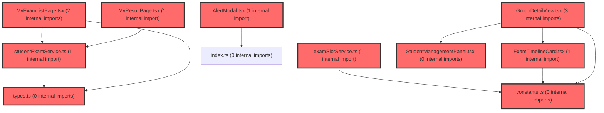

> [!IMPORTANT]
> **⚠️ 수동 검토 권장 (자가힐링 주의)**
>
> AI 자가힐링 결과물이 실제 의도와 다를 수 있으므로, **상세 리뷰 내용에 기반한 수동 점검**을 우선해 주시기 바랍니다. 자가힐링 기능을 활용하실 경우 최종 결과물을 신중하게 확인해 주세요.

# 코드 리뷰 - 7b5205ce

## 코드 복잡도 분석

**분석된 파일**: 24개 / 변경된 파일: 41개


### Import 의존관계 다이어그램



**범례**: 중심 파일 (변경됨) | 많은 import (10개 이상)


### 정상 범위 (NONE)


**`filemapper.xml`** (other)

- 평균 복잡도: **0.243**

- 최대 복잡도: 0.474

- 청크 수: 2개

- 평균 사용처: 7.0곳


**권장사항:**

- 복잡도 정상 범위


**`piopdfvo.java`** (other)

- 평균 복잡도: **0.229**

- 최대 복잡도: 0.474

- 청크 수: 91개

- 평균 사용처: 20.7곳


**권장사항:**

- 파일 크기가 큼 (91개 청크) - 파일 분리 검토


**`dgnsscontroller.java`** (other)

- 평균 복잡도: **0.227**

- 최대 복잡도: 0.470

- 청크 수: 23개

- 평균 사용처: 28.1곳


**권장사항:**

- 파일 크기가 큼 (23개 청크) - 파일 분리 검토


**`filemapper.java`** (other)

- 평균 복잡도: **0.223**

- 최대 복잡도: 0.465

- 청크 수: 25개

- 평균 사용처: 19.2곳


**권장사항:**

- 파일 크기가 큼 (25개 청크) - 파일 분리 검토


**`pdfservice.java`** (other)

- 평균 복잡도: **0.214**

- 최대 복잡도: 0.468

- 청크 수: 11개

- 평균 사용처: 33.8곳


**권장사항:**

- 복잡도 정상 범위


**`dgnssservice.java`** (other)

- 평균 복잡도: **0.125**

- 최대 복잡도: 0.473

- 청크 수: 61개

- 평균 사용처: 14.5곳


**권장사항:**

- 파일 크기가 큼 (61개 청크) - 파일 분리 검토


**`fileservice.java`** (other)

- 평균 복잡도: **0.113**

- 최대 복잡도: 0.468

- 청크 수: 17개

- 평균 사용처: 20.6곳


**권장사항:**

- 복잡도 정상 범위


**`qchtraceclient.java`** (other)

- 평균 복잡도: **0.012**

- 최대 복잡도: 0.012

- 청크 수: 1개


**권장사항:**

- 복잡도 정상 범위


**`qchtraceaspect.java`** (other)

- 평균 복잡도: **0.005**

- 최대 복잡도: 0.009

- 청크 수: 5개


**권장사항:**

- 복잡도 정상 범위


**`types.ts`** (other)

- 평균 복잡도: **0.005**

- 최대 복잡도: 0.008

- 청크 수: 4개


**권장사항:**

- 복잡도 정상 범위


**`studentexamservice.ts`** (other)

- 평균 복잡도: **0.004**

- 최대 복잡도: 0.008

- 청크 수: 17개


**권장사항:**

- 복잡도 정상 범위


**`examslotservice.ts`** (other)

- 평균 복잡도: **0.003**

- 최대 복잡도: 0.014

- 청크 수: 5개


**권장사항:**

- 복잡도 정상 범위


**`assessmentpagev2.tsx`** (component)

- 평균 복잡도: **0.002**

- 최대 복잡도: 0.010

- 청크 수: 72개


**권장사항:**

- 파일 크기가 큼 (72개 청크) - 파일 분리 검토


**`constants.ts`** (other)

- 평균 복잡도: **0.001**

- 최대 복잡도: 0.002

- 청크 수: 6개


**권장사항:**

- 복잡도 정상 범위


**`examtimelinecard.tsx`** (other)

- 평균 복잡도: **0.001**

- 최대 복잡도: 0.006

- 청크 수: 18개


**권장사항:**

- 복잡도 정상 범위


**`groupdetailview.tsx`** (component)

- 평균 복잡도: **0.001**

- 최대 복잡도: 0.004

- 청크 수: 16개


**권장사항:**

- 복잡도 정상 범위


**`studentmanagementpanel.tsx`** (other)

- 평균 복잡도: **0.001**

- 최대 복잡도: 0.006

- 청크 수: 10개


**권장사항:**

- 복잡도 정상 범위


**`schoolrecordpanel.tsx`** (other)

- 평균 복잡도: **0.001**

- 최대 복잡도: 0.007

- 청크 수: 58개


**권장사항:**

- 파일 크기가 큼 (58개 청크) - 파일 분리 검토


**`myexamlistpage.tsx`** (component)

- 평균 복잡도: **0.001**

- 최대 복잡도: 0.016

- 청크 수: 79개


**권장사항:**

- 파일 크기가 큼 (79개 청크) - 파일 분리 검토


**`qrcodemodal.tsx`** (other)

- 평균 복잡도: **0.000**

- 최대 복잡도: 0.004

- 청크 수: 35개


**권장사항:**

- 파일 크기가 큼 (35개 청크) - 파일 분리 검토


**`index.ts`** (other)

- 평균 복잡도: **0.000**

- 최대 복잡도: 0.000

- 청크 수: 9개


**권장사항:**

- 복잡도 정상 범위


**`myresultpage.tsx`** (component)

- 평균 복잡도: **0.000**

- 최대 복잡도: 0.008

- 청크 수: 92개


**권장사항:**

- 파일 크기가 큼 (92개 청크) - 파일 분리 검토


**`landingpage.tsx`** (component)

- 평균 복잡도: **0.000**

- 최대 복잡도: 0.002

- 청크 수: 14개


**권장사항:**

- 복잡도 정상 범위


**`alertmodal.tsx`** (other)

- 평균 복잡도: **0.000**

- 최대 복잡도: 0.006

- 청크 수: 28개


**권장사항:**

- 파일 크기가 큼 (28개 청크) - 파일 분리 검토


---


## 변경 배경

이 커밋은 **학습심리정서검사(DGNSS) 일괄 다운로드 시스템을 2단계 방식으로 전환**하고, **SSO-PII 통합에 따른 QCH 트레이스 식별자 정책 변경**을 적용하며, **프론트엔드 검사 시스템의 여러 이슈(HSJ-66/70/71/72)를 수정**한 복합 커밋입니다.

- **목적**: (1) 일괄 다운로드 OOM 위험 해소 및 이어받기 지원 (2) QCH 로그에 외부 식별자(spUserId)만 전달하도록 보안 강화 (3) 검사 시스템 UX 개선 (미제출 목록 동적 조회, QR코드 모달, AlertModal 통합 등)
- **도메인**: 백엔드 API/서비스 로직, 보안/AOP, 프론트엔드 UI/컴포넌트
- **변경 방향**: 메모리 스트리밍 -> 파일 기반 2단계 다운로드, 내부 PK 노출 제거, UI 상태 기반 로직으로 전환

---

## [GOOD] 잘된 점

1. **OOM 방지 아키텍처 전환**: 기존 `ByteArrayOutputStream`에 전체 zip을 적재하던 방식을 임시 파일 스트리밍(`File.createTempFile` + `FileOutputStream`)으로 변경하여 대용량 다운로드 시 힙 메모리 폭발을 근본적으로 차단했습니다. `finally` 블록에서 임시 파일 정리까지 처리한 점이 꼼꼼합니다.

2. **리소스 누수 방지 (PioPdfVO)**: `PioPdfVO.closeQuietly()` 메서드를 추가하고 3개의 PDF 생성 메서드에 `try/finally` 패턴을 적용하여 예외 발생 시 `PDDocument`가 닫히지 않는 문제를 해결했습니다. PDFBox의 `close()`가 멱등이라는 점을 주석에 명시한 것도 좋은 설계 결정입니다.

3. **QCH 식별자 정책 명확화**: `spUserId`만 외부로 전달하고 내부 `userNo`는 제외함으로써 개인정보 노출을 방지했습니다. 이전의 2순위 fallback 로직은 내부 PK가 외부 로그 시스템에 유출될 위험이 있었는데, 이를 제거한 것은 보안 측면에서 올바른 결정입니다.

---

## 변경사항 요약

- **백엔드**: `dgnssDownloadAll` -> `createDgnssDownloadAllZip`으로 변경, zip을 NAS에 저장 후 URL 반환 (2단계), MyBatis 매퍼에 type별 zip URL 컬럼 동적 매핑 추가, `PioPdfVO.closeQuietly()` 리소스 안전망 추가, QCH 트레이스에서 `userNo` 제거 및 `X-QCH-User-Id` 헤더 추가
- **프론트엔드**: 미제출 목록 API 동적 조회, QR코드 모달 컴포넌트 신규, `shortLabel` 정확한 값으로 수정, `onInvite` async 지원 및 토스트 피드백, `.env.development` 제거 및 `.gitignore` 등록, `qrcode.react` 의존성 추가

---

## [ISSUE] 개선이 필요한 부분

### Critical (즉시 수정 필요)

없음

### High (우선 수정 권장)

#### 1. `QchTraceAspect` - `resolvedUserId`가 null이면 QCH 이벤트 전송 자체를 건너뛰어야 함

**변경 내용:**
`QchTraceAspect.java`에서 `resolvedUserId` 결정 로직을 `spUser.spUserId()`만 사용하도록 단순화했습니다. 그런데 `spUser`가 null이거나 `spUserId()`가 null인 경우 `resolvedUserId`가 null이 되어, 이후 `QchTraceClient.send()`에서 `X-QCH-User-Id` 헤더가 설정되지 않습니다.

**문제점:**
`QchTraceClient`는 `event.getUserId()`가 null이면 헤더를 생략하도록 되어 있지만, QCH 수집 파이프라인이 userId 없이 이벤트를 어떻게 처리할지가 불확실합니다. userId가 null인 이벤트가 QCH에서 거부되거나, 식별 불가능한 레코드로 적재될 가능성이 있습니다.

**개선 제안:**
`resolvedUserId`가 null이면 QCH 이벤트 전송 자체를 skip하는 것이 안전합니다.

- **위치**: `QchTraceAspect.java` (around 135-145)
- **기존 코드**:
```java
String resolvedUserId = (spUser != null) ? spUser.spUserId() : null;
```
- **해결 방안 (수정 코드)**:
```java
String resolvedUserId = (spUser != null) ? spUser.spUserId() : null;
if (resolvedUserId == null) {
    log.debug("QCH trace skipped: no spUserId available for event type={}", event.getEventType());
    return pjp.proceed();
}
```

#### 2. `ExamTimelineCard` - 미제출 목록 API 호출이 불필요하게 중복될 수 있음

**변경 내용:**
`handleToggleMissing`에서 `fetchedStudents === null`일 때만 API를 호출하도록 캐싱했습니다. 그러나 컴포넌트가 언마운트/리마운트되면 상태가 초기화되어 다시 API를 호출하게 됩니다.

**문제점:**
`ExamTimelineCard`는 타임라인에 여러 개 존재할 수 있고, 사용자가 카드를 접었다 폈다 할 때마다 API가 재호출될 수 있습니다. `React Query`와 같은 서버 상태 관리 없이 `useState`로만 캐싱하고 있어, 컴포넌트 생명주기에 따라 캐시가 휘발됩니다.

**개선 제안:**
`React Query`의 `useQuery`로 전환하거나, 최소한 `sessionStorage`를 활용한 캐싱을 고려하세요.

- **위치**: `ExamTimelineCard.tsx` (around 43-60)
- **기존 코드**:
```tsx
const [fetchedStudents, setFetchedStudents] = useState<string[] | null>(null);
const [isFetchingStudents, setIsFetchingStudents] = useState(false);
```
- **해결 방안 (수정 코드)**:
```tsx
// React Query 사용 예시 (권장)
const { data: fetchedStudents, isLoading: isFetchingStudents } = useQuery({
  queryKey: ['not-submitted-students', slotState?.dgnssId],
  queryFn: async () => {
    const result = await fetchNotSubmittedStudents(slotState!.dgnssId);
    return result.map((s) => s.nickname);
  },
  enabled: showMissing && !!slotState?.dgnssId,
  staleTime: 30_000, // 30초 동안 재요청 방지
});
```

### Medium (개선 권장)

#### 3. `FileService.createDgnssDownloadAllZip` - `@Transactional` 범위가 불필요하게 큼

**변경 내용:**
`createDgnssDownloadAllZip` 메서드에 `@Transactional(rollbackFor = Exception.class)`이 선언되어 있습니다.

**문제점:**
이 메서드는 zip 파일 생성 -> 파일 업로드 등록 -> DB 업데이트 순으로 진행되는데, zip 생성 중 예외가 발생하면 DB 트랜잭션은 아무것도 변경하지 않은 상태이므로 `@Transactional`이 실질적으로 필요하지 않습니다. 오히려 zip 생성에 시간이 오래 걸리면 DB 커넥션을 오래 점유하게 되어 커넥션 풀 고갈 위험이 있습니다.

**개선 제안:**
`@Transactional`을 `updateDgnssZipFileUrl` 호출 직전의 더 좁은 범위로 이동하거나, `TransactionTemplate`을 사용하여 DB 업데이트 부분만 트랜잭션으로 감싸세요.

- **위치**: `FileService.java` (around 650)
- **기존 코드**:
```java
@Transactional(rollbackFor = Exception.class)
public String createDgnssDownloadAllZip(HttpServletRequest request, boolean isAuth, Map<String, Object> param) throws Exception {
```
- **해결 방안 (수정 코드)**:
```java
// DB 업데이트만 별도 @Transactional 메서드로 분리
@Transactional(rollbackFor = Exception.class)
public void updateZipFileUrl(String dgnssId, String type, String zipFileUrl) {
    Map<String, Object> updateParam = new HashMap<>();
    updateParam.put("dgnssId", dgnssId);
    updateParam.put("type", type);
    updateParam.put("zipFileUrl", zipFileUrl);
    fileMapper.updateDgnssZipFileUrl(updateParam);
}
```

#### 4. `QRCodeModal` - `inviteUrl`이 빈 문자열일 때의 처리

**변경 내용:**
`QRCodeModal`에서 `QRCodeCanvas`의 `value` prop에 `inviteUrl || ' '`를 전달하고 있습니다.

**문제점:**
`inviteUrl`이 빈 문자열(`''`)이면 공백 문자(`' '`)가 fallback으로 사용됩니다. 이 경우 QR 코드는 의미 없는 값을 인코딩하게 되어, 사용자가 QR을 스캔해도 아무 동작도 하지 않습니다. 또한 `GroupDetailView.tsx`에서 `MANUAL_URL_COMPREHENSIVE`와 `MANUAL_URL_SELF_REGULATED`가 빈 문자열로 선언되어 있어, PDF 설명서 링크가 동작하지 않습니다.

**개선 제안:**
`inviteUrl`이 유효하지 않으면 QR 코드를 아예 렌더링하지 않거나, placeholder를 표시하세요. PDF 설명서 URL은 실제 경로로 채워야 합니다.

- **위치**: `QRCodeModal.tsx` (line 162)
- **기존 코드**:
```tsx
<QRCodeCanvas ref={canvasRef} value={inviteUrl || ' '} size={220} level="H" includeMargin />
```
- **해결 방안 (수정 코드)**:
```tsx
{inviteUrl ? (
  <QRCodeCanvas ref={canvasRef} value={inviteUrl} size={220} level="H" includeMargin />
) : (
  <div style={{ width: 220, height: 220, display: 'flex', alignItems: 'center', justifyContent: 'center', color: '#9CA3AF', fontSize: 14 }}>
    초대 URL이 없습니다
  </div>
)}
```

#### 5. `.claude/settings.local.json`에 민감한 경로 노출

**변경 내용:**
`.claude/settings.local.json`에 절대 경로(`C:/Users/user/dev/meta-dashboard`)와 Playwright MCP 도구 목록이 포함되었습니다.

**문제점:**
이 파일이 버전 관리에 포함되면 개발자의 로컬 환경 정보(사용자명, 디렉토리 구조)가 저장소에 노출됩니다. 또한 `mcp__playwright__*` 도구 목록은 개인 개발 환경 설정으로, 팀 공유 저장소에 포함되기에 적절하지 않습니다.

**개선 제안:**
`.claude/settings.local.json`을 `.gitignore`에 추가하고, 이 파일의 변경사항을 커밋에서 제외하세요. 공유가 필요한 Claude 설정은 `.claude/settings.json`에만 작성하는 것이 좋습니다.

---

## 주요 파일 분석

### `FileService.java` - `createDgnssDownloadAllZip` 메서드

**변경 내용:**
기존 `dgnssDownloadAll` (zip 메모리 생성 -> `StreamingResponseBody` 스트리밍) -> `createDgnssDownloadAllZip` (임시 파일 생성 -> NAS 업로드 등록 -> URL 반환)으로 전환

**개선 제안:**
1. **zip 생성 중 클라이언트 취소 처리**: `File.createTempFile`로 생성된 임시 파일은 JVM 종료 시 삭제되지만, 장시간 실행되는 zip 생성 중 클라이언트가 연결을 끊으면 서버 스레드는 계속 zip을 생성하게 됩니다. `@Async` 또는 `CompletableFuture`를 고려하여 타임아웃 처리를 검토하세요.

2. **zip 파일명에 특수문자 처리**: `zipFileName`에 `[`, `]` 문자가 포함되어 NAS 파일 시스템에서 문제가 될 수 있습니다. `FileUtil.getSaveFileName()`에서 처리될 가능성이 높지만, 확인이 필요합니다.

### `QchTraceAspect.java` - 식별자 정책 변경

**변경 내용:**
`resolvedUserId`를 `spUser.spUserId()`만 사용하도록 단순화하고, `userNo` fallback 제거

**개선 제안:**
위 **High 이슈 #1**에서 언급한 대로, `resolvedUserId`가 null이면 QCH 전송을 skip하는 로직이 필요합니다. 또한 `QchTraceClient`에서 `X-QCH-User-Id` 헤더를 추가한 것은 좋은 변경이나, `event.getUserId()`가 null일 때 헤더를 생략하는 것만으로는 부족합니다. QCH 이벤트 본문(`event`)에도 userId가 포함되어 있을 텐데, 본문에서도 null이 전달되지 않도록 확인이 필요합니다.

### `PioPdfVO.java` - `closeQuietly()` 메서드

**변경 내용:**
`closeQuietly()` 메서드 추가 및 3개 PDF 생성 메서드에 `try/finally` 적용

**개선 제안:**
`closeQuietly()`는 `IOException`을 catch하고 로그만 남기는데, `log.error`보다 `log.warn`이 더 적절합니다. `close()` 실패는 리소스 누수를 의미하지만, 이미 예외가 발생한 상황에서의 close 실패는 부차적인 정보이므로 warn 레벨이 충분합니다.

### `ExamTimelineCard.tsx` - 미제출 목록 동적 조회

**변경 내용:**
`slotState.notSubmittedStudents` 정적 배열 -> `fetchNotSubmittedStudents()` API 동적 호출로 변경

**개선 제안:**
위 **High 이슈 #2**에서 언급한 대로, React Query 도입 또는 캐싱 전략 개선이 필요합니다. 또한 `missingCount` 계산이 `totalCount - submittedCount`로 단순화되었는데, 이는 `notSubmittedStudents` 배열 길이와 항상 일치한다고 보장할 수 없습니다. (예: 중간에 제출한 학생이 있으면 `totalCount`는 변하지 않지만 `submittedCount`는 증가)

### `QRCodeModal.tsx` - 신규 컴포넌트

**변경 내용:**
QR 코드 생성 및 다운로드 모달 컴포넌트 신규 작성

**개선 제안:**
1. `canvasRef`를 `useRef<HTMLCanvasElement>(null)`로 선언했는데, `QRCodeCanvas`가 실제로 `<canvas>`를 렌더링하는지 확인이 필요합니다. `qrcode.react` v4는 기본적으로 `<svg>`를 렌더링하며, `<QRCodeCanvas>`는 `<canvas>`를 사용합니다. 올바른 컴포넌트를 사용한 것은 좋습니다.
2. `Overlay`의 `onClick={onClose}`는 모달 외부 클릭 시 닫히도록 하는 UX 패턴으로 좋습니다. 다만 `Modal`의 `onClick={(e) => e.stopPropagation()}`과 함께 사용되어 이벤트 전파가 올바르게 차단됩니다.

### `GroupDetailView.tsx` - PDF 설명서 버튼

**변경 내용:**
`PdfBtn` styled component 추가 및 학습종합검사/자기조절학습검사 교사용 설명서 링크 버튼 추가

**개선 제안:**
`MANUAL_URL_COMPREHENSIVE`와 `MANUAL_URL_SELF_REGULATED`가 빈 문자열(`''`)로 선언되어 있습니다. 실제 URL로 채워지기 전까지는 버튼이 렌더링되어도 아무 페이지로도 이동하지 않습니다. 임시로 `href="#"` 또는 조건부 렌더링(`url && <PdfBtn ...>`)을 적용하거나, TODO 주석을 남겨두는 것이 좋습니다.

---

## 최종 평가

**결론**:
- [ ] [OK] **승인 (Approved)** - Critical/High 이슈 없음
- [ ] [WARN] **조건부 승인 (Approved with Comments)** - Medium 이하 이슈만 존재
- [X] [FIX] **수정 필요 (Changes Requested)** - Critical/High 이슈 존재

**종합 의견:**

이 커밋은 전반적으로 **잘 설계된 아키텍처 변경**과 **꼼꼼한 리소스 관리**가 돋보입니다. 특히 OOM 문제를 근본적으로 해결한 2단계 다운로드 방식과, PDFBox 리소스 누수를 방지한 `closeQuietly()` 패턴은 프로덕션 안정성에 직접적인 기여를 합니다.

다만 **High 이슈 2건**에 대해 수정이 필요합니다:
1. **QCH 트레이스**: `resolvedUserId`가 null일 때 이벤트 전송을 skip하지 않으면, 식별자 없는 레코드가 QCH에 적재되어 데이터 품질 문제가 발생할 수 있습니다. early return 로직을 추가해주세요.
2. **미제출 목록 캐싱**: `useState` 기반 캐싱은 컴포넌트 생명주기에 휘발되므로, React Query 도입이나 `sessionStorage` 활용을 검토해주세요.

위 2건만 해결되면 즉시 승인 가능한 수준의 퀄리티입니다.