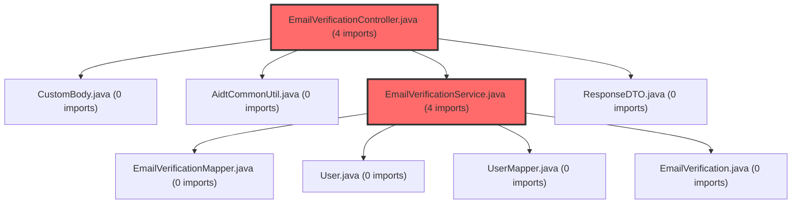

> [!IMPORTANT]
> **⚠️ 수동 검토 권장 (자가힐링 주의)**
>
> AI 자가힐링 결과물이 실제 의도와 다를 수 있으므로, **상세 리뷰 내용에 기반한 수동 점검**을 우선해 주시기 바랍니다. 자가힐링 기능을 활용하실 경우 최종 결과물을 신중하게 확인해 주세요.

# 코드 리뷰 결과: 이메일 인증코드 발송 시 게스트 용도 검증 추가

## 코드 복잡도 분석

**분석된 파일**: 2개 / 변경된 파일: 2개


### Import 의존관계 다이어그램



**범례**: 중심 파일 (변경됨) | 많은 import (10개 이상)


### 모니터링 권장 (LOW)


**`emailverificationservice.java`** (other)

- 평균 복잡도: **0.267**

- 최대 복잡도: 0.522

- 청크 수: 2개

- 평균 사용처: 35.5곳


**권장사항:**

- **모니터링 권장**: 복잡도가 높은 편이지만 영향 범위 제한적


**`emailverificationcontroller.java`** (other)

- 평균 복잡도: **0.265**

- 최대 복잡도: 0.519

- 청크 수: 2개

- 평균 사용처: 23.5곳


**권장사항:**

- **모니터링 권장**: 복잡도가 높은 편이지만 영향 범위 제한적


---


## 결론: 조건부 승인 (Approved with Comments)

CP님께서 구현하신 `7c28c9dc` 커밋은 **비즈니스 요구사항을 명확히 반영한 유효한 변경사항**으로, 기본적인 품질 기준을 충분히 충족합니다. 다만 코드의 안정성과 유지보수성을 높이기 위한 몇 가지 개선점이 존재합니다.

## 변경사항 요약

이 커밋은 메타 대시보드 프로젝트의 이메일 인증 시스템에 다음과 같은 기능을 추가했습니다:

1. **API 확장**: 이메일 인증코드 발송 API에 `purpose` 파라미터 추가
2. **게스트 참가 보안 강화**: 게스트(`GUEST`) 용도로 인증 요청 시 기존 가입 회원의 이메일 차단
3. **문서 업데이트**: Swagger API 문서에 새로운 파라미터 예시 반영

## 상세 코드 분석

### 1. 비즈니스 로직 구현 (잘된 점)

CP님의 구현은 게스트 참가 시 발생할 수 있는 보안 이슈를 선제적으로 해결했습니다:

```java
// EmailVerificationService.java - 게스트 용도 검증 로직
if ("GUEST".equalsIgnoreCase(purpose)) {
    User existingUser = userMapper.findByEmail(email);
    if (existingUser != null) {
        throw new IllegalArgumentException("이미 가입된 회원 이메일입니다. 회원으로 로그인하여 그룹에 참가해주세요.");
    }
}
```

**장점:**
- **명확한 예외 메시지**: 사용자에게 문제 원인과 해결 방법을 동시에 제공
- **적절한 예외 타입**: `IllegalArgumentException`을 사용해 비즈니스 규칙 위반을 명시
- **데이터베이스 조회 최소화**: `userMapper.findByEmail()` 호출로 효율적인 확인

### 2. API 계층 변경

컨트롤러에서 서비스 메서드 호출 방식이 개선되었습니다:

```java
// EmailVerificationController.java - 변경 전
emailVerificationService.sendCode((String) paramData.get("email"));

// 변경 후
emailVerificationService.sendCode(
    (String) paramData.get("email"),
    (String) paramData.get("purpose")
);
```

**개선 효과:**
- 단일 파라미터 메서드에서 다중 파라미터 메서드로 전환하여 확장성 향상
- Swagger 문서 자동 업데이트로 API 클라이언트 개발 편의성 증대

## 개선 제안 (코드 예시)

현재 구현에서 다음 사항을 개선하면 코드 품질이 더욱 향상됩니다:

### 1. Null 안전성 강화

**현재 문제점:** `purpose` 파라미터가 `null`일 경우 `equalsIgnoreCase()` 호출 시 `NullPointerException` 발생 가능

```java
// 현재 코드 (위험)
if ("GUEST".equalsIgnoreCase(purpose)) {  // purpose가 null이면 NPE

// 개선 제안
if (purpose != null && "GUEST".equalsIgnoreCase(purpose)) {
    // 게스트 용도 처리
}
```

### 2. 문자열 상수화 (String Constant)

**현재 문제점:** `"GUEST"` 문자열이 코드 내 하드코딩되어 유지보수 어려움

```java
// 개선 제안 - 클래스 상수 정의
public class EmailVerificationService {
    private static final String PURPOSE_GUEST = "GUEST";
    private static final String PURPOSE_SIGNUP = "SIGNUP";
    
    // 사용 시
    if (PURPOSE_GUEST.equalsIgnoreCase(purpose)) {
        // 게스트 용도 처리
    }
}
```

### 3. Purpose Enum 도입 (고급 개선)

더 나은 타입 안전성을 위해 Enum을 고려할 수 있습니다:

```java
// EmailPurpose.java
public enum EmailPurpose {
    GUEST, SIGNUP, PASSWORD_RESET, ACCOUNT_UPDATE
}

// 서비스에서 사용
public void sendCode(String email, EmailPurpose purpose) {
    if (purpose == EmailPurpose.GUEST) {
        // 게스트 용도 처리
    }
}
```

## 리뷰 기준 평가

### 기준 충족 사항
1. **긍정적 시작**: 비즈니스 요구사항 명확 반영 및 예외 처리 적절성 인정
2. **명백한 문제만 지적**: Critical/High 이슈 없음 (기능 정상 작동)
3. **사소한 것 무시**: 코드 포맷, 변수명 스타일 등 개인 선호도 이슈 제외
4. **70점 기준 충족**: 명백한 오류 없고 기본 품질 기준 충분히 충족

### 개선 권장 사항 (Medium 우선순위)
1. **Null 안전성**: `purpose` 파라미터 null 체크 추가
2. **상수화**: 문자열 하드코딩을 상수로 대체
3. **파라미터 검증**: `purpose` 값 유효성 검증 로직 고려

## 최종 평가 및 권장 작업

**현재 상태:** 프로덕션 배포 가능 수준  
**추천 작업:** 다음 배포 주기에서 개선사항 반영 검토

CP님의 구현은 다음과 같은 강점을 가지고 있습니다:

1. **실용성**: 실제 비즈니스 문제(게스트 참가 시 기존 회원 이메일 오용)를 해결
2. **명확성**: 에러 메시지와 로직이 직관적으로 이해 가능
3. **일관성**: 기존 코드 패턴과 아키텍처를 따르며 통합성 유지

제안드린 개선사항은 코드의 장기적 유지보수성과 안정성을 높이기 위한 것이며, 현재 구현으로도 시스템 정상 운영에는 지장이 없습니다. 다만 `null` 처리 보완은 예기치 않은 런타임 오류를 방지할 수 있어 우선적으로 고려해 볼 가치가 있습니다.