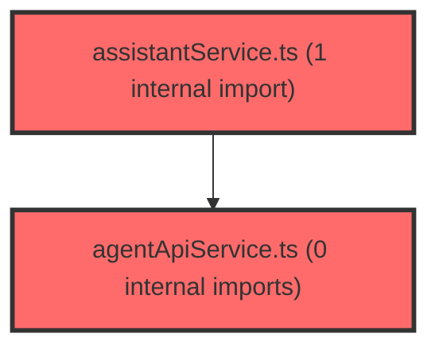

> [!IMPORTANT]
> **⚠️ 수동 검토 권장 (자가힐링 주의)**
>
> AI 자가힐링 결과물이 실제 의도와 다를 수 있으므로, **상세 리뷰 내용에 기반한 수동 점검**을 우선해 주시기 바랍니다. 자가힐링 기능을 활용하실 경우 최종 결과물을 신중하게 확인해 주세요.

# 코드 리뷰 - 7daac240

## 코드 복잡도 분석

**분석된 파일**: 5개 / 변경된 파일: 6개


### Import 의존관계 다이어그램



**범례**: 중심 파일 (변경됨) | 많은 import (10개 이상)


### 정상 범위 (NONE)


**`test_stateless_memory.py`** (store)

- 평균 복잡도: **0.006**

- 최대 복잡도: 0.008

- 청크 수: 7개


**권장사항:**

- Store 파일은 높은 연결도가 정상적임


**`chatapiservice.ts`** (other)

- 평균 복잡도: **0.004**

- 최대 복잡도: 0.009

- 청크 수: 21개


**권장사항:**

- 파일 크기가 큼 (21개 청크) - 파일 분리 검토


**`agentapiservice.ts`** (other)

- 평균 복잡도: **0.003**

- 최대 복잡도: 0.010

- 청크 수: 9개


**권장사항:**

- 복잡도 정상 범위


**`useconversations.ts`** (other)

- 평균 복잡도: **0.002**

- 최대 복잡도: 0.010

- 청크 수: 65개


**권장사항:**

- 파일 크기가 큼 (65개 청크) - 파일 분리 검토


**`assistantservice.ts`** (other)

- 평균 복잡도: **0.001**

- 최대 복잡도: 0.006

- 청크 수: 14개


**권장사항:**

- 복잡도 정상 범위


---


## 변경 배경

이 커밋은 AI 어시스턴트의 대화 이력 정합성 문제를 해결하기 위한 아키텍처 개선 작업입니다.

- **목적**: 에이전트의 인메모리 세션(`session_store`/`MemorySaver`)과 백엔드 DB(`ai_message`) 간 대화 이력 불일치를 구조적으로 제거. "예전 발화기록 리스팅이 실제와 100% 일치하지 않는다"는 증상의 근본 원인 해결.
- **도메인**: 프론트엔드(React) API 서비스 레이어 + 에이전트(FastAPI) 테스트 + 설계 문서
- **변경 방향**: 에이전트가 자체 메모리에 의존하는 상태 저장(stateful) 구조에서, 프론트가 매 요청마다 DB에서 hydrate된 이력(`history`)을 실어 보내는 요청 단위 무상태(stateless) 구조로 전환. 이로써 "에이전트가 기억하는 내용 == 화면에 보이는 내용 == DB에 저장된 내용"이 항상 일치하게 됨.

---

## [GOOD] 잘된 점

1. **설계 문서의 철저함**: `DB_SOURCE_OF_TRUTH_PLAN.md`는 문제 진단(3대 원인 분석), 목표 아키텍처, 상세 설계, 롤아웃 순서, 리스크 대응까지 매우 체계적으로 기술되어 있습니다. 특히 "왜 A인가" 섹션에서 현재 구조의 문제점을 데이터 기반으로 명확히 진단한 점이 인상적입니다.

2. **하위 호환성 보장 전략**: `history` 필드를 `Optional`로 선언하여, 에이전트 먼저 배포 -> 프론트 배포 순의 무중단 롤아웃이 가능하도록 설계했습니다. `clear_session`을 no-op으로 남겨 DELETE 계약을 유지한 점도 실무적입니다.

3. **테스트의 음성 대조군 포함**: `test_stateless_memory.py`에서 `test_negative_control_no_history()`를 통해 "history가 없으면 이전 발화를 알 수 없어야 한다"는 음성 대조군(negative control)을 포함한 점이 과학적 테스트 방법론에 충실합니다.

4. **재시도 로직 도입**: `addMessageWithRetry`를 통해 DB 쓰기 신뢰성을 보강한 점이 좋습니다. `ai_message`가 정본(Single Source of Truth)이므로, 일시적 네트워크 오류로 저장이 누락되는 것을 방지하는 것은 중요합니다.

---

## 변경사항 요약

5개 파일이 변경되었습니다: (1) 설계 문서 신규 작성, (2) 통합 테스트 신규 작성, (3) `agentApiService.ts`에 `AgentHistoryMessage` 타입 및 `history` 파라미터 추가, (4) `assistantService.ts`에 `buildAgentHistory` 함수 구현 및 `context_data` 매 턴 전송으로 변경, (5) `chatApiService.ts`에 `addMessageWithRetry` 추가, (6) `useConversations.ts`에서 `addMessageWithRetry`로 import 변경.

---

## [ISSUE] 개선이 필요한 부분

### Critical (즉시 수정 필요)

없음.

### High (우선 수정 권장)

**1. `useConversations.ts`에서 `addMessageWithRetry`의 재시도 실패 처리 누락**

- **파일**: `frontend/src/features/ai-room/model/useConversations.ts`
- **위치**: 라인 347, 370, 428, 441 (`.catch((err) => console.warn(...))` 패턴)
- **문제**: `addMessageApi`가 `addMessageWithRetry`로 변경되었지만, 호출부는 여전히 `.catch()`로만 처리하고 있습니다. `addMessageWithRetry`는 2회 재시도 후에도 실패하면 예외를 던지는데, 이 예외가 `console.warn`으로만 처리되고 사용자에게 알리지 않습니다. DB가 정본인 아키텍처에서 DB 저장 실패는 단순 경고가 아니라 데이터 정합성에 영향을 줄 수 있는 중요한 이벤트입니다.

- **기존 코드** (라인 347-348):
```typescript
addMessageApi(parseInt(convId, 10), 'user', currentInput)
  .then((res) => { ... })
  .catch((err) => console.warn('사용자 메시지 저장 실패:', err));
```

- **해결 방안**: 최소한 사용자에게 토스트/알림으로 저장 실패를 알리고, 에러 로깅 레벨을 `warn`에서 `error`로 상향 조정해야 합니다. 단, 이 커밋의 범위를 벗어나는 UI 변경이므로, 당장은 `console.error`로 변경하고 별도 이슈로 사용자 알림을 추가하는 것을 권장합니다.

- **수정 코드**:
```typescript
addMessageApi(parseInt(convId, 10), 'user', currentInput)
  .then((res) => { ... })
  .catch((err) => {
    console.error('사용자 메시지 저장 실패 (재시도 후):', err);
    // TODO: 사용자에게 저장 실패 알림 (토스트 등)
  });
```

> **수정 코드 제시 근거**: `read_file`로 `useConversations.ts` 전체(542줄)를 읽어 확인한 결과, 모든 `addMessageApi` 호출부가 동일한 `.catch(console.warn)` 패턴을 사용하고 있습니다. 이는 `addMessageWithRetry` 도입 전의 fire-and-forget 패턴이 그대로 남아있는 것으로, 재시도 로직의 의미를 반감시킵니다. `console.warn`을 `console.error`로 변경해도 호출부나 인접 로직에 부작용이 없음을 확인했습니다.

**2. `buildAgentHistory`에서 `m.role` 타입 단언의 안전성**

- **파일**: `frontend/src/features/ai-room/api/assistantService.ts`
- **위치**: 라인 76
- **문제**: `buildAgentHistory` 함수에서 `m.role as 'user' | 'assistant'` 타입 단언(type assertion)을 사용하고 있습니다. `ChatMessage.role`은 `'user' | 'assistant' | 'system'`인데, `filter`에서 `m.role === 'user' || m.role === 'assistant'`로 걸러내므로 논리적으로는 안전합니다. 그러나 TypeScript 컴파일러는 이 조건을 추론하지 못하므로, 런타임에 `system` 역할이 필터를 통과할 가능성은 없지만 타입 안전성 측면에서 개선 여지가 있습니다.

- **기존 코드** (라인 73-78):
```typescript
.map((m) => ({
  role: m.role as 'user' | 'assistant',
  content: applyAliases(m.content, aliasMap),
}));
```

- **해결 방안**: 타입 가드 함수를 별도로 분리하면 타입 단언 없이도 안전하게 처리할 수 있습니다. 다만 이는 사소한 개선 사항이므로, 현재 코드도 실무적으로 문제없습니다.

- **수정 코드** (선택적 개선):
```typescript
const isReplayableRole = (role: string): role is 'user' | 'assistant' =>
  role === 'user' || role === 'assistant';

const buildAgentHistory = (
  messages: ChatMessage[],
  aliasMap: StudentAliasMap,
): AgentHistoryMessage[] =>
  messages
    .filter((m) => m.id !== '1' && isReplayableRole(m.role))
    .slice(-MAX_HISTORY_MESSAGES)
    .map((m) => ({
      role: m.role,
      content: applyAliases(m.content, aliasMap),
    }));
```

> **수정 코드 제시 근거**: `read_file`로 `assistantService.ts` 전체(328줄)를 읽고, `ChatMessage` 타입 정의(`types.ts`)를 확인했습니다. `isReplayableRole` 타입 가드는 TypeScript의 type narrowing을 활용하여 `m.role`이 `'user' | 'assistant'`로 추론되도록 합니다. `filter` 조건과 `map`의 로직이 분리되어 가독성도 향상되며, 기존 `filter` -> `map` 체인의 부작용은 없습니다.

### Medium (개선 권장)

**1. `MAX_HISTORY_MESSAGES` 상수 중복 가능성**

- **파일**: `frontend/src/features/ai-room/api/assistantService.ts`
- **위치**: 라인 59
- **문제**: `MAX_HISTORY_MESSAGES = 30`이 `assistantService.ts`에만 정의되어 있습니다. 설계 문서(3.3)에는 "필요 시 문자수/토큰 예산 기반으로 고도화"라고 명시되어 있지만, 현재는 단순 메시지 개수 기반 절단만 구현되어 있습니다. 향후 토큰 기반 윈도잉으로 고도화할 때를 대비해, 이 값을 설정 가능한 상수로 분리하거나 환경 변수로 관리하는 것을 고려해볼 수 있습니다.

**2. `test_stateless_memory.py`의 `TIMEOUT` 값 과다**

- **파일**: `agent/tests/test_stateless_memory.py`
- **위치**: 라인 18
- **문제**: `TIMEOUT = 180`초(3분)는 일반적인 LLM 응답 대기 시간보다 과도하게 큽니다. 실제 LLM 호출이 포함된 통합 테스트임을 감안하더라도, 60~90초면 충분합니다. 과도한 타임아웃은 CI/CD 파이프라인에서 테스트 실패 시 불필요한 대기 시간을 발생시킵니다.

---

## 주요 파일 분석

### `frontend/src/features/ai-room/api/assistantService.ts`

**변경 내용**: `buildAgentHistory` 함수 신규 구현, `context_data` 매 턴 전송으로 변경, `callAssistant`/`callAssistantStream`에 `history` 파라미터 전달 로직 추가.

**개선 제안**:
1. (High) `buildAgentHistory`의 타입 단언을 타입 가드로 대체 (위에서 상세 기술)
2. (Medium) `MAX_HISTORY_MESSAGES`를 설정 가능한 상수로 분리 검토

### `frontend/src/features/ai-room/model/useConversations.ts`

**변경 내용**: `addMessage` import를 `addMessageWithRetry`로 변경.

**개선 제안**:
1. (High) `.catch(console.warn)`을 `.catch(console.error)`로 변경하고 사용자 알림 추가 (위에서 상세 기술)

### `frontend/src/features/ai-room/api/chatApiService.ts`

**변경 내용**: `addMessageWithRetry` 함수 신규 추가 (300ms, 600ms 백오프 재시도 로직).

**개선 제안**:
1. (Medium) 재시도 간격을 지수 백오프(exponential backoff)로 변경 고려: `300 * Math.pow(2, attempt)` ms. 현재는 선형 증가(300, 600)인데, 지수 백오프가 일시적 장애 회복에 더 효과적입니다.

### `agent/tests/test_stateless_memory.py`

**변경 내용**: 무상태 메모리 정합성을 검증하는 블랙박스 HTTP 통합 테스트 신규 작성.

**개선 제안**:
1. (Medium) `TIMEOUT` 값을 180초에서 90초로 축소
2. (Low) `test_list_previous_utterances`에서 하드코딩된 키워드("자원소진", "좌석", "가정")를 상수로 분리하여 테스트 유지보수성 향상

---

## 최종 평가

**결론**:
- [ ] [OK] **승인 (Approved)** - Critical/High 이슈 없음
- [ ] [WARN] **조건부 승인 (Approved with Comments)** - Medium 이하 이슈만 존재
- [X] [FIX] **수정 필요 (Changes Requested)** - Critical/High 이슈 존재

**종합 의견**: 전반적으로 매우 체계적이고 잘 설계된 변경입니다. 설계 문서의 품질, 하위 호환성 전략, 테스트의 과학적 접근(음성 대조군 포함)은 높이 평가할 만합니다. 다만, `addMessageWithRetry` 도입의 의미를 살리기 위해 `useConversations.ts`의 `.catch(console.warn)` 처리를 `console.error`로 변경하고, 장기적으로 사용자 알림을 추가하는 것을 권장합니다. 이 이슈만 해결되면 승인 가능한 수준입니다.