> [!IMPORTANT]
> **⚠️ 수동 검토 권장 (자가힐링 주의)**
>
> AI 자가힐링 결과물이 실제 의도와 다를 수 있으므로, **상세 리뷰 내용에 기반한 수동 점검**을 우선해 주시기 바랍니다. 자가힐링 기능을 활용하실 경우 최종 결과물을 신중하게 확인해 주세요.

# 코드 리뷰 - 7eadfeb4

## 코드 복잡도 분석

**분석된 파일**: 40개 / 변경된 파일: 52개


### Import 의존관계 다이어그램

```mermaid
flowchart TD
    F0["ResponseGridSummary.tsx (0 internal imports)"]:::center
    F1["LessonActivityReportEmbed.tsx (1 internal import)"]:::center
    F2["reportGridTypes.ts (1 internal import)"]:::center
    F3["PageContent.tsx (4 internal imports)"]:::center
    F4["PageList.tsx (0 internal imports)"]:::center
    F5["ResponseGrid.tsx (1 internal import)"]:::center
    F6["StudentTab.tsx (3 internal imports)"]:::center
    F7["cmsSetService.ts (0 internal imports)"]:::center
    F8["answerSavedTypes.ts (1 internal import)"]:::center
    F9["LessonActivityJoinEmbed.tsx (2 internal imports)"]:::center
    F10["useEveryCanvasEmbed.ts (0 internal imports)"]:::center
    F11["ReportDetail.tsx (3 internal imports)"]:::center
    F12["queries.ts (3 internal imports)"]:::center
    F13["mapAnswerSaved.ts (1 internal import)"]:::center
    F14["reportDetailUtils.ts (0 internal imports)"]:::center
    F15["SummaryStrip.tsx (0 internal imports)"]:::center
    F16["ResponseDetailOverlay.tsx (1 internal import)"]:::center
    F17["PageTab.tsx (2 internal imports)"]:::center
    F18["ReportSummary.tsx (0 internal imports)"]:::center
    F19["classMemberSubs.ts (0 internal imports)"]:::center
    F20["mapPageTab.ts (3 internal imports)"]:::center
    F21["lmsActivityService.ts (0 internal imports)"]:::center
    F22["cmsFileUrl.ts (0 internal imports)"]:::center
    F23["mapReportDetail.ts (1 internal import)"]:::center
    F24["StudentDetailReport.tsx (1 internal import)"]:::center
    F25["useParticipationAutosave.ts (3 internal imports)"]:::center
    F26["queryKeys.ts (0 internal imports)"]:::center
    F12 --> F19
    F12 --> F7
    F12 --> F26
    F8 --> F21
    F13 --> F8
    F20 --> F22
    F20 --> F7
    F20 --> F2
    F23 --> F14
    F2 --> F21
    F25 --> F8
    F25 --> F13
    F25 --> F21
    F9 --> F10
    F9 --> F8
    F1 --> F10
    F3 --> F16
    F3 --> F0
    F3 --> F15
    F3 --> F5
    F17 --> F4
    F17 --> F3
    F11 --> F6
    F11 --> F17
    F11 --> F18
    F16 --> F0
    F5 --> F0
    F6 --> F16
    F6 --> F0
    F6 --> F5
    F24 --> F0
    classDef center fill:#ff6b6b,stroke:#333,stroke-width:3px
    classDef high fill:#ffd93d,stroke:#333,stroke-width:2px
```



**범례**: 중심 파일 (변경됨) | 많은 import (10개 이상)


### 정상 범위 (NONE)


**`dgnssmapper.xml`** (other)

- 평균 복잡도: **0.243**

- 최대 복잡도: 0.474

- 청크 수: 2개

- 평균 사용처: 7.0곳


**권장사항:**

- 복잡도 정상 범위


**`dgnssservice.java`** (other)

- 평균 복잡도: **0.111**

- 최대 복잡도: 0.473

- 청크 수: 69개

- 평균 사용처: 12.8곳


**권장사항:**

- 파일 크기가 큼 (69개 청크) - 파일 분리 검토


**`routes.tsx`** (other)

- 평균 복잡도: **0.052**

- 최대 복잡도: 0.463

- 청크 수: 24개

- 평균 사용처: 2.3곳


**권장사항:**

- 파일 크기가 큼 (24개 청크) - 파일 분리 검토


**`index.ts`** (component)

- 평균 복잡도: **0.026**

- 최대 복잡도: 0.461

- 청크 수: 36개

- 평균 사용처: 1.7곳


**권장사항:**

- 파일 크기가 큼 (36개 청크) - 파일 분리 검토


**`cmssetservice.ts`** (other)

- 평균 복잡도: **0.004**

- 최대 복잡도: 0.010

- 청크 수: 12개


**권장사항:**

- 복잡도 정상 범위


**`mapanswersaved.ts`** (other)

- 평균 복잡도: **0.004**

- 최대 복잡도: 0.009

- 청크 수: 5개


**권장사항:**

- 복잡도 정상 범위


**`mappagetab.ts`** (component)

- 평균 복잡도: **0.004**

- 최대 복잡도: 0.014

- 청크 수: 28개


**권장사항:**

- 파일 크기가 큼 (28개 청크) - 파일 분리 검토


**`lmsactivityservice.ts`** (other)

- 평균 복잡도: **0.003**

- 최대 복잡도: 0.007

- 청크 수: 85개


**권장사항:**

- 파일 크기가 큼 (85개 청크) - 파일 분리 검토


**`queries.ts`** (other)

- 평균 복잡도: **0.003**

- 최대 복잡도: 0.012

- 청크 수: 120개


**권장사항:**

- 파일 크기가 큼 (120개 청크) - 파일 분리 검토


**`index.ts`** (other)

- 평균 복잡도: **0.002**

- 최대 복잡도: 0.012

- 청크 수: 46개


**권장사항:**

- 파일 크기가 큼 (46개 청크) - 파일 분리 검토


**`answersavedtypes.ts`** (other)

- 평균 복잡도: **0.002**

- 최대 복잡도: 0.004

- 청크 수: 4개


**권장사항:**

- 복잡도 정상 범위


**`classmembersubs.ts`** (other)

- 평균 복잡도: **0.002**

- 최대 복잡도: 0.004

- 청크 수: 6개


**권장사항:**

- 복잡도 정상 범위


**`cmsfileurl.ts`** (other)

- 평균 복잡도: **0.002**

- 최대 복잡도: 0.003

- 청크 수: 3개


**권장사항:**

- 복잡도 정상 범위


**`mapreportdetail.ts`** (other)

- 평균 복잡도: **0.002**

- 최대 복잡도: 0.007

- 청크 수: 27개


**권장사항:**

- 파일 크기가 큼 (27개 청크) - 파일 분리 검토


**`reportdetailutils.ts`** (utility)

- 평균 복잡도: **0.002**

- 최대 복잡도: 0.010

- 청크 수: 33개


**권장사항:**

- 파일 크기가 큼 (33개 청크) - 파일 분리 검토


**`reportgridtypes.ts`** (other)

- 평균 복잡도: **0.002**

- 최대 복잡도: 0.008

- 청크 수: 9개


**권장사항:**

- 복잡도 정상 범위


**`useparticipationautosave.ts`** (other)

- 평균 복잡도: **0.002**

- 최대 복잡도: 0.009

- 청크 수: 22개


**권장사항:**

- 파일 크기가 큼 (22개 청크) - 파일 분리 검토


**`lessonjoinpage.tsx`** (component)

- 평균 복잡도: **0.002**

- 최대 복잡도: 0.009

- 청크 수: 16개


**권장사항:**

- 복잡도 정상 범위


**`lessonresultdetailpage.tsx`** (component)

- 평균 복잡도: **0.002**

- 최대 복잡도: 0.005

- 청크 수: 9개


**권장사항:**

- 복잡도 정상 범위


**`index.ts`** (other)

- 평균 복잡도: **0.002**

- 최대 복잡도: 0.004

- 청크 수: 4개


**권장사항:**

- 복잡도 정상 범위


**`useeverycanvasembed.ts`** (utility)

- 평균 복잡도: **0.001**

- 최대 복잡도: 0.004

- 청크 수: 11개


**권장사항:**

- 복잡도 정상 범위


**`lessonactivityreportembed.tsx`** (other)

- 평균 복잡도: **0.001**

- 최대 복잡도: 0.003

- 청크 수: 10개


**권장사항:**

- 복잡도 정상 범위


**`studentlessonresultpage.tsx`** (component)

- 평균 복잡도: **0.001**

- 최대 복잡도: 0.003

- 청크 수: 7개


**권장사항:**

- 복잡도 정상 범위


**`pagelist.tsx`** (component)

- 평균 복잡도: **0.001**

- 최대 복잡도: 0.012

- 청크 수: 32개


**권장사항:**

- 파일 크기가 큼 (32개 청크) - 파일 분리 검토


**`responsedetailoverlay.tsx`** (other)

- 평균 복잡도: **0.001**

- 최대 복잡도: 0.005

- 청크 수: 83개


**권장사항:**

- 파일 크기가 큼 (83개 청크) - 파일 분리 검토


**`responsegridsummary.tsx`** (other)

- 평균 복잡도: **0.001**

- 최대 복잡도: 0.005

- 청크 수: 25개


**권장사항:**

- 파일 크기가 큼 (25개 청크) - 파일 분리 검토


**`studenttab.tsx`** (other)

- 평균 복잡도: **0.001**

- 최대 복잡도: 0.008

- 청크 수: 92개


**권장사항:**

- 파일 크기가 큼 (92개 청크) - 파일 분리 검토


**`studentlessonbanner.tsx`** (other)

- 평균 복잡도: **0.001**

- 최대 복잡도: 0.008

- 청크 수: 26개


**권장사항:**

- 파일 크기가 큼 (26개 청크) - 파일 분리 검토


**`querykeys.ts`** (other)

- 평균 복잡도: **0.000**

- 최대 복잡도: 0.001

- 청크 수: 20개


**권장사항:**

- 복잡도 정상 범위


**`lessonactivityjoinembed.tsx`** (other)

- 평균 복잡도: **0.000**

- 최대 복잡도: 0.004

- 청크 수: 15개


**권장사항:**

- 복잡도 정상 범위


**`pagecontent.tsx`** (component)

- 평균 복잡도: **0.000**

- 최대 복잡도: 0.002

- 청크 수: 30개


**권장사항:**

- 파일 크기가 큼 (30개 청크) - 파일 분리 검토


**`pagetab.tsx`** (component)

- 평균 복잡도: **0.000**

- 최대 복잡도: 0.005

- 청크 수: 27개


**권장사항:**

- 파일 크기가 큼 (27개 청크) - 파일 분리 검토


**`reportdetail.tsx`** (other)

- 평균 복잡도: **0.000**

- 최대 복잡도: 0.003

- 청크 수: 26개


**권장사항:**

- 파일 크기가 큼 (26개 청크) - 파일 분리 검토


**`reportsummary.tsx`** (other)

- 평균 복잡도: **0.000**

- 최대 복잡도: 0.004

- 청크 수: 50개


**권장사항:**

- 파일 크기가 큼 (50개 청크) - 파일 분리 검토


**`responsegrid.tsx`** (other)

- 평균 복잡도: **0.000**

- 최대 복잡도: 0.004

- 청크 수: 30개


**권장사항:**

- 파일 크기가 큼 (30개 청크) - 파일 분리 검토


**`statuspanel.tsx`** (other)

- 평균 복잡도: **0.000**

- 최대 복잡도: 0.003

- 청크 수: 54개


**권장사항:**

- 파일 크기가 큼 (54개 청크) - 파일 분리 검토


**`summarystrip.tsx`** (other)

- 평균 복잡도: **0.000**

- 최대 복잡도: 0.004

- 청크 수: 10개


**권장사항:**

- 복잡도 정상 범위


**`studentdetailreport.tsx`** (other)

- 평균 복잡도: **0.000**

- 최대 복잡도: 0.008

- 청크 수: 81개


**권장사항:**

- 파일 크기가 큼 (81개 청크) - 파일 분리 검토


**`studentreportdashboard.tsx`** (other)

- 평균 복잡도: **0.000**

- 최대 복잡도: 0.003

- 청크 수: 30개


**권장사항:**

- 파일 크기가 큼 (30개 청크) - 파일 분리 검토


**`index.ts`** (other)

- 평균 복잡도: **0.000**

- 최대 복잡도: 0.000

- 청크 수: 4개


**권장사항:**

- 복잡도 정상 범위


---


## 변경 배경

이 커밋은 학습심리정서검사(LPA) 코칭 기능의 도메인 지식 문서를 신규 추가하고, 백엔드 진단 서비스의 학생 분석 조회 로직을 개선한 변경입니다.

- **목적**: (1) 코칭·상담 도메인 지식 문서 신규 작성, (2) 학생 분석 조회 시 `claId` 필터로 다른 학급 결과 혼입 방지, (3) 신뢰도 '주의' 학생도 LPA 결과를 제공하되 `reliabilityWarnings` 플래그로 어떤 지표가 '주의'인지 전달하는 정책 통일
- **도메인**: 비즈니스 로직 (진단/코칭 API) + 문서
- **변경 방향**: 개별 API(`st/analysis`)와 벌크 API(`tc/analysis`) 간 LPA 제공 정책을 통일하고, 학급 단위 조회의 결정성(결정적 정렬)을 확보

## [GOOD] 잘된 점

- **정책 통일 의도가 명확함**: 개별 API와 벌크 API에서 신뢰도 '주의' 학생의 LPA 제공 정책을 일관되게 맞추고, `reliabilityWarnings`로 어떤 지표가 '주의'인지 명시적으로 전달하는 설계가 좋습니다. FE가 별도 추론 없이 플래그만으로 UI를 구성할 수 있습니다.
- **결정적 정렬 도입**: `ORDER BY a1.ord_no, c1.ANSWER_IDX DESC`로 동일 학생·회차의 중복 결과에서 최신 검사를 대표로 선택하도록 하여 비결정적 선택 문제를 해결했습니다.
- **주석으로 의도 문서화**: `claId` 필터와 `lernInclude` 정책 변경에 대한 주석이 상세하여 후임 개발자가 의도를 파악하기 쉽습니다.

## 변경사항 요약

- `DgnssService.java`: 학생 분석 조회에 `claId` 조건 추가, 벌크 LPA 조회를 `lernInclude='Y'`로 변경하여 '주의' 학생 포함, `reliabilityWarnings` 필드 추가
- `DgnssMapper.xml`: `selectStLernAnalysis`에 `claId` 조건 및 결정적 정렬 추가
- `domain_knowledge_coaching.md`: 코칭·상담 도메인 지식 문서 신규 작성 (v1.1)
- `frontend/docs/lesson/*.md`: 문서 rename 및 Phase C 구현 내용 반영

---

## [ISSUE] 개선이 필요한 부분

### Critical (즉시 수정 필요)

없음

### High (우선 수정 권장)

없음

### Medium (개선 권장)

1. **`selectClassTotalReport` 쿼리의 `parameterType` 선언 불일치**
   - **위치**: `DgnssMapper.xml` 3236행
   - **기존 코드**:
     ```xml
     <select id="selectClassTotalReport" resultType="map" parameterType="list">
     ```
   - **문제**: 이 쿼리는 `parameterType="list"`로 선언되어 있으나, 실제 호출부(`DgnssService.java` 1710~1714행)에서는 `Map<String, Object>`(`lpaInParam`)를 전달하고 있습니다. MyBatis에서 `parameterType`은 힌트일 뿐 실제 타입 검증은 하지 않으므로 동작에는 문제가 없지만, 선언과 실제 사용이 불일치하여 유지보수 시 혼란을 줄 수 있습니다.
   - **해결 방안**:
     ```xml
     <select id="selectClassTotalReport" resultType="map" parameterType="map">
     ```
     > 실제 호출부에서 `Map`을 전달하므로 `parameterType="map"`으로 정정하는 것이 명확합니다.

2. **`reliabilityWarnings` 필드가 `lernReportByOrd`에는 미적용 여부 확인 필요**
   - **위치**: `DgnssService.java` 1757~1760행, 2643~2646행
   - **문제**: `lpaTop`(개별 API)과 `lpaByOrd`(벌크 API)에는 `reliabilityWarnings`가 추가되었지만, `lernReportByOrd`(학습영역 리포트)에는 적용되지 않았습니다. `appendLernReportForOrd` 메서드가 별도로 처리하는지 확인이 필요합니다. 만약 학습영역 리포트에서도 '주의' 지표를 구분해야 한다면 일관성 있는 적용이 필요합니다.

---

## 주요 파일 분석

### backend/src/main/java/com/vs/meta/api/dgnss/service/DgnssService.java

**변경 내용:**
학생 분석 조회에 `claId` 필터 추가, 벌크 LPA 조회를 `lernInclude='Y'`로 변경, `reliabilityWarnings` 필드 추가

**상세 분석:**

1. **`claId` 필터 추가 (1417~1425행)**:
   ```java
   String claId = MapUtils.getString(param, "claId", "");
   if (StringUtils.isNotBlank(claId)) {
       analysisParam.put("claId", claId);
   }
   ```
   이전에는 `claId` 조건 없이 해당 학생의 모든 그룹 이력을 조회하여, 다른 학급의 검사 결과가 같은 `ord`로 섞여 LPA 유형이 비결정적으로 선택되는 문제가 있었습니다. 이제 `claId`가 전달되면 해당 학급 이력만 조회하도록 개선되었습니다.

2. **벌크 LPA 조회 정책 변경 (1705~1714행)**:
   ```java
   Map<String, Object> lpaInParam = new HashMap<>();
   lpaInParam.put("dgnssId", dgnssId);
   lpaInParam.put("notExistsYn", "N");
   lpaInParam.put("lernInclude", "Y");
   List<Map<String, Object>> lpaRows = new ArrayList<>(dgnssMapper.selectClassTotalReport(lpaInParam));
   ```
   기존에는 `fetchClassTotalReportCached`를 통해 '주의' 학생을 제외한 결과를 조회했지만, 이제 `lernInclude='Y'`로 직접 조회하여 '주의' 학생도 포함합니다. 이는 개별 API(`st/analysis`)와 정책을 통일하기 위한 변경입니다. 학급 평균 경로(`fetchClassTotalReportCached`)와는 별개 조회이므로 평균 계산에는 영향이 없습니다.

3. **`reliabilityWarnings` 추가 (1757~1760행)**:
   ```java
   lpaRow.put("reliabilityWarnings", buildReliabilityWarnings(row));
   ```
   `buildReliabilityWarnings` 메서드(1912~1925행)는 `desirable`(사회적바람직성), `reaction`(반응일관성), `repeatResponse`(연속동일반응) 필드를 확인하여 '주의'인 지표를 리스트로 반환합니다.

### backend/src/main/resources/mapper/dgnss/DgnssMapper.xml

**변경 내용:**
`selectStLernAnalysis`에 `claId` 조건 및 결정적 정렬 추가

**상세 분석:**

1. **`claId` 조건 추가 (3074~3077행)**:
   ```xml
   <if test="claId != null and claId != ''">
       AND a1.cla_id = #{claId}
   </if>
   ```
   `claId`가 전달된 경우에만 해당 학급 이력으로 제한합니다. 미전달 시 기존처럼 전체 그룹 이력을 조회합니다.

2. **결정적 정렬 추가 (3079행)**:
   ```sql
   ORDER BY a1.ord_no, c1.ANSWER_IDX DESC
   ```
   동일 학생·회차에 결과가 여러 건이면 최신 검사(`ANSWER_IDX` 큰 값)가 회차 대표로 선택되도록 결정적 정렬을 도입했습니다. 이는 `extractLpaTopByOrd`에서 `result.containsKey(ordKey)`로 첫 번째 행만 사용하는 로직과 결합되어, 항상 최신 결과가 선택되도록 보장합니다.

3. **`selectClassTotalReport`의 `lernInclude` 조건 (3248~3250행)**:
   ```xml
   <if test='notExistsYn != null and notExistsYn == "N" and lernInclude != "Y"'>
       AND c1.COCH_DGNSS_QESITM01_MARK <> '주의' AND c1.COCH_DGNSS_QESITM02_MARK <> '주의' AND c1.REPEATED_RESPONSE_YN <> 'Y'
   </if>
   ```
   `lernInclude='Y'`가 전달되면 '주의' 학생 제외 조건이 비활성화되어, 신뢰도 '주의' 학생도 LPA 결과에 포함됩니다.

### agent/app/core/prompts/domain_knowledge_coaching.md

**변경 내용:**
코칭·상담 도메인 지식 문서 신규 작성 (v1.1). 코칭 개요, 강점·보완 산정, 조절·매개 경로, 개별/학급 코칭 구성, STEP, 상담 연계, 효과 점검, 구현 현황 등을 상세 기술

**개선 제안:**
- 문서가 매우 상세하고 구조화되어 있어 좋습니다. 특히 §10 구현 현황에서 데드코드와 미확정 항목을 명시적으로 구분한 점이 우수합니다.
- §10에서 `reviews/REVIEW_d45b3521.md`를 참조로 언급하고 있는데, 이 파일이 저장소에 존재하는지 확인이 필요합니다.

---

## 최종 평가

**결론**:
- [ ] [OK] **승인 (Approved)** - Critical/High 이슈 없음
- [x] [WARN] **조건부 승인 (Approved with Comments)** - Medium 이하 이슈만 존재
- [ ] [FIX] **수정 필요 (Changes Requested)** - Critical/High 이슈 존재

**종합 의견:**

이 커밋은 LPA 코칭 기능의 정책을 개별/벌크 API 간에 일관되게 통일하고, 학급 단위 조회의 결정성을 확보한 안정적인 변경입니다. `reliabilityWarnings` 도입으로 신뢰도 '주의' 학생의 LPA 제공 정책이 명확해졌고, `claId` 필터로 다른 학급 결과 혼입 문제를 해결했습니다. 특히 `ORDER BY a1.ord_no, c1.ANSWER_IDX DESC` 결정적 정렬은 동일 학생·회차의 중복 결과에서 최신 검사를 대표로 선택하도록 보장하여 비결정적 동작을 제거한 점이 우수합니다.

다만 `selectClassTotalReport`의 `parameterType="list"` 선언이 실제 사용(`Map` 전달)과 불일치하는 점과, `lernReportByOrd`에 대한 `reliabilityWarnings` 일관 적용 여부 확인이 필요합니다. 이는 모두 Medium 수준의 개선 사항으로, 기능적 결함은 아닙니다.

전반적으로 실무에서 통용될 수 있는 수준의 품질을 갖추었으며, 조건부 승인(WARN)으로 판단합니다.