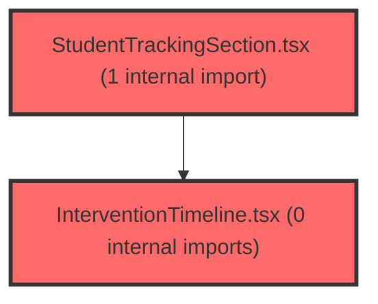

> [!IMPORTANT]
> **⚠️ 수동 검토 권장 (자가힐링 주의)**
>
> AI 자가힐링 결과물이 실제 의도와 다를 수 있으므로, **상세 리뷰 내용에 기반한 수동 점검**을 우선해 주시기 바랍니다. 자가힐링 기능을 활용하실 경우 최종 결과물을 신중하게 확인해 주세요.

# 코드 리뷰 - 7ef3de5d

## 코드 복잡도 분석

**분석된 파일**: 8개 / 변경된 파일: 8개


### Import 의존관계 다이어그램



**범례**: 중심 파일 (변경됨) | 많은 import (10개 이상)


### 정상 범위 (NONE)


**`routes.tsx`** (other)

- 평균 복잡도: **0.054**

- 최대 복잡도: 0.463

- 청크 수: 23개

- 평균 사용처: 2.4곳


**권장사항:**

- 파일 크기가 큼 (23개 청크) - 파일 분리 검토


**`resultcounselingobservationsection.tsx`** (other)

- 평균 복잡도: **0.001**

- 최대 복잡도: 0.011

- 청크 수: 96개


**권장사항:**

- 파일 크기가 큼 (96개 청크) - 파일 분리 검토


**`typeclassification.tsx`** (other)

- 평균 복잡도: **0.001**

- 최대 복잡도: 0.012

- 청크 수: 54개


**권장사항:**

- 파일 크기가 큼 (54개 청크) - 파일 분리 검토


**`examtrackingpage.tsx`** (component)

- 평균 복잡도: **0.001**

- 최대 복잡도: 0.003

- 청크 수: 9개


**권장사항:**

- 복잡도 정상 범위


**`studentdashboardpage.tsx`** (component)

- 평균 복잡도: **0.001**

- 최대 복잡도: 0.009

- 청크 수: 73개


**권장사항:**

- 파일 크기가 큼 (73개 청크) - 파일 분리 검토


**`classdashboardv2widget.tsx`** (other)

- 평균 복잡도: **0.001**

- 최대 복잡도: 0.012

- 청크 수: 168개


**권장사항:**

- 파일 크기가 큼 (168개 청크) - 파일 분리 검토


**`interventiontimeline.tsx`** (other)

- 평균 복잡도: **0.000**

- 최대 복잡도: 0.003

- 청크 수: 51개


**권장사항:**

- 파일 크기가 큼 (51개 청크) - 파일 분리 검토


**`studenttrackingsection.tsx`** (other)

- 평균 복잡도: **0.000**

- 최대 복잡도: 0.010

- 청크 수: 108개


**권장사항:**

- 파일 크기가 큼 (108개 청크) - 파일 분리 검토


---


## 변경 배경

이 커밋은 교사 라우트의 **인증/권한 검사와 화면 레이아웃을 분리**하는 프론트엔드 아키텍처 개선과, 학생 대시보드에 **상담·관찰 기록 기능**을 추가하고 **LPA 차트 UI**를 개선한 변경입니다.

- **목적**: 교사 화면을 '일반(GNB+LNB)'과 '집중형(전체화면)' 레이아웃으로 구분할 수 있는 구조를 마련하고, 학생 상세 대시보드에 상담/관찰 기록 기능을 신규 도입
- **도메인**: UI / 프론트엔드 라우팅 아키텍처 / 비즈니스 로직(상담·관찰 기록)
- **변경 방향**: 기존 단일 `ProtectedLayout`이 인증·권한·레이아웃을 모두 담당하던 것을 `TeacherAuthGuard`(인증/권한) + `TeacherShellLayout`(일반 레이아웃) + `TeacherFullscreenLayout`(집중형)으로 분리하여 관심사를 명확히 분리

---

## [GOOD] 잘된 점

- **관심사 분리**: `TeacherAuthGuard`가 인증/권한 검사만 담당하고 레이아웃은 하위 Route에서 선택하도록 분리한 설계가 명확하고 확장성이 좋습니다. 기존 `ProtectedLayout`이 인증 검사와 레이아웃 렌더링을 모두 담당하던 것을 분리하여, 향후 집중형 화면(수업 실행/발표/미리보기)을 추가할 때 인증 로직을 중복 작성하지 않아도 됩니다.
- **신규 기능의 구조화**: `ResultCounselingObservationSection`이 상담 기록과 관찰 메모를 하나의 일관된 UI(에디터 + 이력)로 통합하고, `useMemo`로 이력을 정렬·필터링하여 렌더링 성능을 고려했습니다. 상담과 관찰을 각각 별도 컴포넌트로 분리하지 않고 하나의 섹션으로 묶어 사용자 흐름을 자연스럽게 연결한 점이 좋습니다.
- **불필요한 코드 제거**: `StudentDashboardPage`에서 미사용 `TEST_META`, `InfoAlert`, `BreadcrumbRow` 등을 제거하고 `useRef` import를 정리하여 코드가 간결해졌습니다. `MainContent`의 불필요한 `transition`과 `padding-right` 조건부 스타일도 제거되어 불필요한 복잡성이 줄었습니다.

---

## 변경사항 요약

교사 라우트를 인증/권한 가드와 레이아웃 셸로 분리하고, 학생 대시보드에 상담·관찰 기록 섹션을 신규 추가했으며, LPA 차트의 툴팁·레이아웃을 개선했습니다. 또한 ExamTrackingPage에 뒤로가기 네비게이션을 추가했습니다.

---

## [ISSUE] 개선이 필요한 부분

### Critical (즉시 수정 필요)

없음

### High (우선 수정 권장)

- **`TeacherFullscreenLayout`이 미사용 상태로 남아 있음**: export 되었지만 실제 Route에 연결되지 않았고 주석만 존재합니다. grep 검색 결과 `routes.tsx` 내에서 정의(109번째 줄)와 주석(258번째 줄)만 존재하며, 실제로 이 레이아웃을 사용하는 Route는 없습니다. 후속 phase에서 사용 예정이라는 주석이 있으므로 의도적일 수 있으나, 현재 커밋 기준으로는 데드 코드입니다. 미사용 export 코드는 팀원에게 혼란을 유발할 수 있으므로, 사용 시점이 확정되기 전까지는 제거하거나 명확한 사용 예정 시점을 주석에 명시하는 것이 좋습니다.

### Medium (개선 권장)

- **`parseObservationContent` 정규식의 안전성**: `/^\[([^\]]+)]\s*(.*)$/s` 패턴은 `[제목] 내용` 형식을 파싱하지만, 제목이 없는 관찰 메모(기존 데이터)는 `{ title: '', content }`로 처리됩니다. 이때 `HistorySubject`가 `MEMO_CATEGORY_LABELS[record.category]`로 대체되므로 동작은 안전하나, `[` 문자만 포함된 일반 텍스트가 있을 경우 의도치 않게 파싱될 수 있습니다. 예를 들어 `[참고] 이 학생은...` 같은 일반 메모가 있다면 제목이 `참고`로 잘못 파싱될 수 있습니다.
- **`saveCounseling`의 `nextSteps` 하드코딩**: `'후속 상담 필요'` 문자열이 하드코딩되어 있어, 후속 상담 체크 시 항상 동일한 문구가 저장됩니다. 상수로 분리하거나 사용자 입력을 받는 것을 고려할 수 있습니다.

---

## 주요 파일 분석

### frontend/src/app/router/routes.tsx

**변경 내용:**
`ProtectedLayout`을 `TeacherAuthGuard` + `TeacherShellLayout` + `TeacherFullscreenLayout`으로 분리하고, 라우트를 중첩 구조로 재구성했습니다.

**구조 분석:**

기존 구조:
```
<Route element={<ProtectedLayout />}>
  {/* 인증/권한 검사 + 레이아웃 렌더링이 한 컴포넌트에 결합 */}
  <Route path='/assessment' element={<AssessmentPage />} />
  ...
</Route>
```

변경된 구조:
```
<Route element={<TeacherAuthGuard />}>
  {/* 인증/권한 검사만 담당 */}
  <Route element={<TeacherShellLayout />}>
    {/* GNB + LNB 레이아웃 */}
    <Route path='/assessment' element={<AssessmentPage />} />
    ...
  </Route>
  {/* 집중형 화면은 추후 TeacherFullscreenLayout으로 감싸서 추가 예정 */}
</Route>
```

이 구조는 `TeacherAuthGuard`가 인증/권한 검사를 수행한 후 `Outlet`을 렌더링하고, 하위 Route에서 레이아웃을 선택하는 방식입니다. `useLocation`이 `TeacherShellLayout`로 이동한 것도 적절합니다. `CaptureOverlay`가 `TeacherShellLayout`에만 존재하므로, 집중형 화면에서는 화면 캡처가 자연스럽게 제외됩니다.

**개선 제안:**

1. `TeacherFullscreenLayout` 미사용 export 정리
   - **위치 (라인 109)**: `export const TeacherFullscreenLayout = () => (...)`
   - **기존 코드**:
```
export const TeacherFullscreenLayout = () => (
  <MinimalLayout>
    <Outlet />
  </MinimalLayout>
);
```
   - **해결 방안**: 후속 phase에서 사용 예정이라면 주석으로 명시하거나, 현재 커밋에서 사용하지 않는다면 제거하는 것이 좋습니다. 사용 예정이라면 `export`를 유지하되 데드 코드임을 명확히 하는 주석을 추가하세요. **[수정 코드 제시 불가 — 문맥 파악 불충분]** (후속 phase의 라우트 연결 여부에 따라 수정 방향이 달라지므로)

### frontend/src/features/student-dashboard/ui/ResultCounselingObservationSection.tsx

**변경 내용:**
신규 파일로, 상담 기록과 관찰 메모를 생성하고 이력을 필터링/확장 표시하는 UI 컴포넌트입니다.

**구조 분석:**

이 컴포넌트는 크게 3가지 영역으로 구성됩니다:
1. **상담 기록 에디터**: 상담 유형/영역/방법/일자/시간/소요시간/내용을 입력하고 저장
2. **관찰 메모 에디터**: 관찰 영역/일자/기록명/내용을 입력하고 저장
3. **상담 & 관찰 이력**: 두 데이터를 통합하여 날짜순으로 정렬하고, 필터(전체/상담/관찰)와 확장/접기 기능 제공

핵심 로직:
- `history`는 `useMemo`로 상담 기록과 관찰 메모를 통합하고 `b.date.localeCompare(a.date)`로 내림차순 정렬합니다.
- `saveCounseling`은 `createCounseling.mutateAsync`를 호출하고, 성공 후 `content`와 `followUp`을 초기화합니다.
- `saveObservation`은 `createMemo.mutateAsync`를 호출하고, `content`를 `[제목] 내용` 형식으로 저장합니다.
- `parseObservationContent`는 저장된 `[제목] 내용` 형식을 다시 파싱하여 이력에서 제목과 내용을 분리합니다.

**개선 제안:**

1. `parseObservationContent` 정규식의 안전성
   - **위치 (라인 189)**: `const parseObservationContent = (content: string) => { const match = content.match(/^\[([^\]]+)]\s*(.*)$/s); ... }`
   - **기존 코드**:
```
const parseObservationContent = (content: string) => {
  const match = content.match(/^\[([^\]]+)]\s*(.*)$/s);
  return match ? { title: match[1], content: match[2] } : { title: '', content };
};
```
   - **해결 방안**: `[` 문자만 포함된 일반 텍스트가 있을 경우 의도치 않게 파싱될 수 있습니다. 제목이 반드시 존재해야 하는 형식이라면, 제목이 비어있지 않은 경우에만 파싱하도록 조건을 추가하는 것이 안전합니다. (선택적 개선)

### frontend/src/pages/student-dashboard/StudentDashboardPage.tsx

**변경 내용:**
대시보드 레이아웃을 스텝 기반 구조로 리팩토링하고, 상담·관찰 기록 섹션을 추가했으며, 미사용 코드를 제거했습니다.

**구조 분석:**

기존에는 `InfoAlert`, `BreadcrumbRow`, `TestBadge` 등으로 구성된 상단 정보 영역이 있었으나, 이를 `StepSection`(스텝 번호 + 레일 + 바디) 구조로 변경했습니다. `LearningStatusGrid`는 5열 그리드로 학습 상태를 표시하고, `FactorTopGrid`는 강점/약점 요인을 좌우로 나란히 배치하는 구조입니다.

`ResultCounselingObservationSection`이 새로 추가되어 상담 기록과 관찰 메모를 한 곳에서 관리할 수 있게 되었습니다. `CoachingStrategy`, `DataHelperChatbot`, `RightPanel` 등이 제거되면서 대시보드가 더 집중된 형태로 개편되었습니다.

**개선 제안:**

1. `ResultCounselingObservationSection`의 `nextSteps` 하드코딩
   - **위치 (라인 250 부근)**: `nextSteps: counseling.followUp ? '후속 상담 필요' : undefined`
   - **기존 코드**:
```
nextSteps: counseling.followUp ? '후속 상담 필요' : undefined,
```
   - **해결 방안**: 상수로 분리하거나 사용자 입력을 받는 것을 고려하세요. (선택적 개선)

---

## 최종 평가

**결론**:
- [ ] [OK] **승인 (Approved)** - Critical/High 이슈 없음
- [x] [WARN] **조건부 승인 (Approved with Comments)** - Medium 이하 이슈만 존재
- [ ] [FIX] **수정 필요 (Changes Requested)** - Critical/High 이슈 존재

**종합 의견:**

이 커밋은 교사 라우트의 관심사 분리와 학생 대시보드의 상담·관찰 기록 기능 추가라는 명확한 목적을 가진 좋은 변경입니다. `TeacherAuthGuard`와 `TeacherShellLayout`의 분리는 확장성이 뛰어난 설계이며, `ResultCounselingObservationSection`은 상담과 관찰이라는 두 가지 기록 유형을 하나의 일관된 UI로 통합한 점이 인상적입니다.

`TeacherFullscreenLayout`의 미사용 상태는 후속 phase에서 사용 예정으로 보이므로 큰 문제는 아니지만, 데드 코드로 남지 않도록 명확한 주석이나 사용 시점을 정리하는 것이 좋겠습니다. 전반적으로 구조가 명확하고 기능 구현이 잘 되어 있어 승인 가능한 수준입니다.