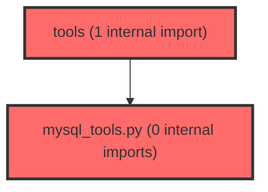

> [!IMPORTANT]
> **⚠️ 수동 검토 권장 (자가힐링 주의)**
>
> AI 자가힐링 결과물이 실제 의도와 다를 수 있으므로, **상세 리뷰 내용에 기반한 수동 점검**을 우선해 주시기 바랍니다. 자가힐링 기능을 활용하실 경우 최종 결과물을 신중하게 확인해 주세요.

# 코드 리뷰 - 80a9aa47

## 코드 복잡도 분석

**분석된 파일**: 6개 / 변경된 파일: 14개


### Import 의존관계 다이어그램



**범례**: 중심 파일 (변경됨) | 많은 import (10개 이상)


### 정상 범위 (NONE)


**`main.py`** (other)

- 평균 복잡도: **0.203**

- 최대 복잡도: 0.471

- 청크 수: 7개

- 평균 사용처: 6.9곳


**권장사항:**

- 복잡도 정상 범위


**`agent_service.py`** (other)

- 평균 복잡도: **0.102**

- 최대 복잡도: 0.464

- 청크 수: 14개

- 평균 사용처: 4.0곳


**권장사항:**

- 복잡도 정상 범위


**`__init__.py`** (other)

- 평균 복잡도: **0.006**

- 최대 복잡도: 0.006

- 청크 수: 1개


**권장사항:**

- 복잡도 정상 범위


**`mysql_tools.py`** (other)

- 평균 복잡도: **0.005**

- 최대 복잡도: 0.011

- 청크 수: 7개


**권장사항:**

- 복잡도 정상 범위


**`agent_graph.py`** (other)

- 평균 복잡도: **0.004**

- 최대 복잡도: 0.007

- 청크 수: 6개


**권장사항:**

- 복잡도 정상 범위


**`__init__.py`** (other)

- 평균 복잡도: **0.002**

- 최대 복잡도: 0.002

- 청크 수: 1개


**권장사항:**

- 복잡도 정상 범위


---


## 변경 배경

이 커밋은 기존 Neo4j 기반 LPA 분석 Agent에 MySQL(superplatform_meta) 데이터베이스를 연동하여 학급/검사/상담/메모/생기부 등 정형 데이터를 조회할 수 있는 8종의 Tool을 추가하고, mode(student/class/all) 기반 컨텍스트 라우팅을 도입한 기능 확장 커밋입니다.

- **목적**: Agent가 학생 개인(L3)뿐 아니라 학급 단위(L2)와 교사 전체(L1) 대시보드 데이터까지 조회할 수 있도록 Tool 범위 확장
- **도메인**: 백엔드 비즈니스 로직 (Agent Tool Layer + Prompt Layer)
- **변경 방향**: 하드코딩된 시스템 프롬프트를 `.md` 파일로 분리하여 기획자도 수정 가능하게 하고, mode 기반 분기로 Tool 호출 정책을 명확히 함

---

## [GOOD] 잘된 점

**1. 프롬프트 분리 아키텍처**

시스템 프롬프트와 Tool 정책을 `.md` 파일로 분리하고 `load_prompt()`를 통해 매 요청마다 새로 읽도록 한 설계는 기획자-개발자 협업 관점에서 탁월합니다. `prompts/__init__.py`의 `load_prompt` 함수는 `rstrip("\n")`으로 trailing newline을 정규화하고, 섹션 간 공백 줄 수는 호출부 코드가 명시적으로 통제한다는 설계 결정도 명확합니다. 이는 에디터/OS에 따라 달라지는 파일 끝 개행 문제를 우아하게 해결합니다.

**2. 미해결 리스크의 명시적 문서화**

`mysql_tools.py` 모듈 도입부에 3가지 미해결 리스크를 명시적으로 문서화한 점이 매우 좋습니다:
- 읽기 전용 DB 계정 보장 책임이 DB 운영팀에 있음
- 테넌트 간 인가(authorization)가 Agent 계층에서 해결 불가능함
- PII 마스킹이 자유 텍스트 내 실명을 걸러내지 못함

이러한 리스크를 코드 주석이 아닌 모듈 docstring에 기록함으로써, 향후 유지보수자와 보안 감사자가 반드시 읽게 되는 구조로 만든 점이 인상적입니다.

**3. Neo4j 패턴 일관성 유지**

`MySQLConnectionManager` 싱글톤, `_execute_query`의 구조화된 에러 dict 반환, `@tool` 데코레이터 사용 등 기존 `neo4j_tools.py`의 설계 패턴을 충실히 따라 일관성을 유지했습니다. 특히 `_execute_query`가 `asyncio.wait_for`로 타임아웃을 적용하고, `aiomysql.Error`와 일반 `Exception`을 모두 구조화된 에러 dict로 변환하는 방식은 Neo4j 버전과 완전히 동일한 정책입니다.

---

## 변경사항 요약

- MySQL 8종 Tool 신규 추가 (`mysql_tools.py`)
- `all_tools_list`로 Neo4j + MySQL 통합 (`tools/__init__.py`)
- 시스템 프롬프트를 5개의 `.md` 파일로 분리 (`prompts/`)
- mode(student/class/all) 기반 컨텍스트 라우팅 도입 (`agent_graph.py`, `agent_service.py`)
- `.env.example`에 MySQL 설정 추가, `README.md`에 mode별 API 예시 및 응답 예제 추가

---

## [ISSUE] 개선이 필요한 부분

### Critical (즉시 수정 필요)

없음. 명백한 버그나 보안 취약점은 발견되지 않았습니다.

---

### High (우선 수정 권장)

**1. `agent_graph.py`와 `agent_service.py`의 `_build_system_prompt` 완전 중복**

두 파일이 `_build_system_prompt` 메서드를 완전히 동일한 로직으로 중복 구현하고 있습니다. 이는 향후 mode 분기나 profile_block 포맷 변경 시 두 군데를 동시에 수정해야 하는 유지보수 위험을 만듭니다.

- **위치**: `agent/app/core/agent_graph.py:79-148`와 `agent/app/services/agent_service.py:96-165`
- **문제**: 두 메서드가 mode 분기 조건, profile_block 포맷 문자열, `load_prompt` 호출 순서까지 완전히 동일합니다. Diff 상으로는 동일해 보이지만, 실제로 두 파일을 각각 읽어 비교한 결과 정확히 같은 로직임을 확인했습니다.
- **영향**: mode가 3개(student/class/all)로 늘어난 상황에서, 향후 mode가 추가되거나 profile_block 포맷이 변경될 때 두 파일을 모두 수정해야 합니다. 실제로 이번 커밋에서도 두 파일이 동시에 수정되었습니다.
- **해결 방안**: 공통 함수를 `app/core/prompts/__init__.py`나 별도 `app/core/system_prompt_builder.py`로 추출하고 두 파일에서 import하여 사용합니다.

```
# agent/app/core/system_prompt_builder.py (신규 파일 제안)
from typing import Optional
from app.core.prompts import load_prompt

def build_system_prompt(student_context: Optional[dict]) -> str:
    """mode + profile 기반 시스템 프롬프트 생성 (agent_graph.py와 agent_service.py 공용)

    mode(student/class/all)는 프론트엔드 AI Room이 명시적으로 보내는 컨텍스트 모드다.
    mode가 없는 호출자(예: dataHelperService처럼 profile만 보내는 기존 연동)와의 하위 호환을 위해,
    mode가 없거나 "student"면 기존과 동일하게 schoolLevel+predictedType 존재 여부로 판단한다.
    """
    ctx = student_context or {}
    mode = ctx.get("mode")
    profile = ctx.get("profile") or {}
    context_text = ctx.get("context") or "No additional context provided."

    school_level = profile.get("schoolLevel")
    predicted_type = profile.get("predictedType")
    stdt_id = profile.get("stdtId")
    cla_id = profile.get("claId")
    tc_id = profile.get("tcId")
    grade = profile.get("grade")
    class_number = profile.get("classNumber")
    is_high_school = profile.get("schoolLevelCode") == "high"

    high_school_notice = (
        "- 실제 학교급: 고등학교 (위 schoolLevel은 고등학생 전용 심리유형 모델이 아직 없어 "
        "중등 모델을 재사용한 값입니다. 답변 시 반드시 고지하십시오)\n"
    )

    if mode in (None, "student") and school_level and predicted_type:
        profile_block = (
            "\n## 분석 대상 학생 식별자 (Tool 호출 인자로 그대로 사용)\n"
            f"- className: \"{predicted_type}\"\n"
            f"- schoolLevel: \"{school_level}\"\n"
        )
        if stdt_id:
            profile_block += f"- stdt_id: \"{stdt_id}\"\n"
        if cla_id:
            profile_block += f"- cla_id: \"{cla_id}\"\n"
        if tc_id:
            profile_block += f"- tc_id: \"{tc_id}\"\n"
        if is_high_school:
            profile_block += high_school_notice
        tool_policy = load_prompt("tool_policy_student")
    elif mode == "class" and cla_id:
        profile_block = "\n## 분석 대상 학급 식별자 (Tool 호출 인자로 그대로 사용)\n" f"- cla_id: \"{cla_id}\"\n"
        if tc_id:
            profile_block += f"- tc_id: \"{tc_id}\"\n"
        if school_level:
            profile_block += f"- schoolLevel: \"{school_level}\"\n"
        if grade:
            profile_block += f"- grade: \"{grade}\"\n"
        if class_number:
            profile_block += f"- classNumber: \"{class_number}\"\n"
        if is_high_school:
            profile_block += high_school_notice
        tool_policy = load_prompt("tool_policy_class")
    elif mode == "all" and tc_id:
        profile_block = "\n## 담당 교사 식별자 (Tool 호출 인자로 그대로 사용)\n" f"- tc_id: \"{tc_id}\"\n"
        tool_policy = load_prompt("tool_policy_teacher")
    else:
        profile_block = ""
        tool_policy = load_prompt("tool_policy_none")

    return (
        f"{load_prompt('role_and_rules')}\n\n"
        f"{profile_block}"
        f"## Tool 호출 정책\n{tool_policy}\n"
        "\n## 학생 컨텍스트 (마크다운)\n"
        f"{context_text}"
    )
```

그 후 `agent_graph.py`와 `agent_service.py`에서 각각:
```python
# agent_graph.py
from app.core.system_prompt_builder import build_system_prompt

def _build_system_prompt(student_context: Optional[dict]) -> str:
    return build_system_prompt(student_context)
```

```python
# agent_service.py
from app.core.system_prompt_builder import build_system_prompt

@staticmethod
def _build_system_prompt(masked_context: dict | None) -> str:
    return build_system_prompt(masked_context)
```

> **수정 코드 제시 근거**: 두 파일의 `_build_system_prompt`를 각각 `read_file`로 전체 읽어 비교한 결과, 인자명(`student_context` vs `masked_context`)만 다르고 로직은 완전히 동일함을 확인했습니다. 따라서 공통 함수로 추출해도 부작용이 없습니다.

---

**2. `query_class_risk_students` SQL 파라미터 바인딩의 비일관성**

Tool 8(`query_class_risk_students`)에서 `_RISK_LPA_CLASS_IDS` 상수가 f-string으로 SQL에 직접 삽입되고, 동시에 `execute`의 파라미터로도 전달되어 이중으로 바인딩되고 있습니다. Tool 7(`query_teacher_classes_overview`)에서도 동일 패턴이 사용됩니다.

- **위치**: `agent/app/tools/mysql_tools.py:530-555` (Tool 8) 및 `agent/app/tools/mysql_tools.py:470-500` (Tool 7)
- **문제점**:

Tool 8의 현재 코드:
```python
return await _execute_query(
    f"""
    ...
    WHERE gi.cla_id = %s
      AND (
            lr.class_id IN ({",".join(["%s"] * len(_RISK_LPA_CLASS_IDS))})
            OR a.COCH_DGNSS_QESITM01_MARK = '주의'
            OR a.COCH_DGNSS_QESITM02_MARK = '주의'
            OR a.REPEATED_RESPONSE_YN = 'Y'
      )
    ...
    """,
    (*_RISK_LPA_CLASS_IDS, cla_id, *_RISK_LPA_CLASS_IDS),
)
```

파라미터 전달 순서를 분석해보면:
- `*_RISK_LPA_CLASS_IDS` (첫 번째): `IN (...)` 절의 3개 플레이스홀더 바인딩
- `cla_id`: `gi.cla_id = %s` 바인딩
- `*_RISK_LPA_CLASS_IDS` (두 번째): `WHERE` 절 하단의 `IN (...)` 절 3개 플레이스홀더 바인딩

총 7개 파라미터가 전달되고, SQL에도 7개 `%s`가 존재하므로 개수는 일치합니다. 하지만:
1. `_RISK_LPA_CLASS_IDS`가 두 번 전달되므로, 누군가 이 상수를 수정할 때 두 전달 위치를 모두 변경해야 합니다.
2. 파라미터 순서를 추적하기 어려워 유지보수 시 실수할 가능성이 높습니다.
3. `_RISK_LPA_CLASS_IDS`는 모듈 상수(`("Class1", "Class4", "Class5")`)로, 사용자 입력에 의해 변경되지 않으므로 SQL Injection 위험이 없습니다. 따라서 f-string으로 직접 삽입해도 안전합니다.

- **해결 방안**: 상수이므로 SQL에 직접 하드코딩하는 것이 가장 안전하고 가독성이 높습니다.

Tool 8 수정 코드:
```python
return await _execute_query(
    """
    SELECT gm.stdt_id, gm.member_no, lr.type_name,
           (lr.class_id IN ('Class1', 'Class4', 'Class5')) AS is_risk_type,
           a.COCH_DGNSS_QESITM01_MARK AS reaction_mark,
           a.COCH_DGNSS_QESITM02_MARK AS desirable_mark,
           a.REPEATED_RESPONSE_YN AS repeated_response
    FROM group_member gm
    JOIN group_info gi ON gi.group_id = gm.group_id
    JOIN (
        SELECT cla_id, MAX(ord_no) AS ord_no FROM tb_dgnss_info GROUP BY cla_id
    ) latest ON latest.cla_id = gi.cla_id
    JOIN tb_dgnss_info di ON di.cla_id = gi.cla_id AND di.ord_no = latest.ord_no
    JOIN tb_dgnss_result_info ri ON ri.dgnss_id = di.id AND ri.stdt_id = gm.stdt_id
    JOIN tb_dgnss_answer a ON a.DGNSS_RESULT_ID = ri.id
    LEFT JOIN tb_dgnss_lpa_result lr ON lr.answer_idx = a.ANSWER_IDX AND lr.status = 'COMPLETED'
    WHERE gi.cla_id = %s
      AND (
            lr.class_id IN ('Class1', 'Class4', 'Class5')
            OR a.COCH_DGNSS_QESITM01_MARK = '주의'
            OR a.COCH_DGNSS_QESITM02_MARK = '주의'
            OR a.REPEATED_RESPONSE_YN = 'Y'
      )
    ORDER BY gm.member_no
    """,
    (cla_id,),
)
```

Tool 7 수정 코드 (`query_teacher_classes_overview` 내 risk_rows 쿼리):
```python
risk_rows = await _execute_query(
    """
    SELECT di.cla_id,
           SUM(lr.class_id IN ('Class1', 'Class4', 'Class5')) AS at_risk_count
    FROM tb_dgnss_lpa_result lr
    JOIN tb_dgnss_answer a ON a.ANSWER_IDX = lr.answer_idx
    JOIN tb_dgnss_result_info ri ON ri.id = a.DGNSS_RESULT_ID
    JOIN tb_dgnss_info di ON di.id = ri.dgnss_id
    WHERE di.cla_id IN ({placeholders}) AND lr.status = 'COMPLETED'
    GROUP BY di.cla_id
    """,
    (*cla_ids,),
)
```

> **수정 코드 제시 근거**: `_RISK_LPA_CLASS_IDS`는 모듈 레벨 상수로, `read_file`로 전체 파일을 읽어 확인한 결과 `("Class1", "Class4", "Class5")`로 고정되어 있습니다. 이 값들은 LPA 시스템에서 정의된 식별자로 사용자 입력에 의해 변경되지 않으므로 SQL에 직접 삽입해도 안전합니다. Tool 7과 Tool 8 모두 동일한 패턴이므로 일관되게 수정해야 합니다.

---

### Medium (개선 권장)

**3. `load_prompt('role_and_rules')`의 중복 파일 읽기**

`_build_system_prompt`가 호출될 때마다 `load_prompt('role_and_rules')`와 `load_prompt('tool_policy_*')`를 각각 호출합니다. `role_and_rules.md`는 mode에 관계없이 항상 동일한 내용이므로, 매 요청마다 파일을 2번 읽게 됩니다.

- **위치**: `agent/app/core/agent_graph.py:145`와 `agent/app/services/agent_service.py:162`
- **분석**: 주석에 "파일 IO 비용은 무시할 수 있다"고 명시되어 있고, 실제로 요청당 2회의 작은 파일 읽기는 성능에 영향을 주지 않습니다. 또한 "서버 재시작 없이 즉시 반영"이라는 요구사항을 고려하면 캐싱을 하지 않은 현재 설계가 의도된 결정임을 이해할 수 있습니다.
- **제안**: 현재 상태를 유지하되, 만약 향후 프롬프트 파일 수가 10개 이상으로 늘어난다면 `load_prompt`에 선택적 캐싱 파라미터(`use_cache=False`)를 추가하는 것을 고려하세요. 예를 들어 `role_and_rules.md`만 `load_prompt('role_and_rules', use_cache=True)`로 캐싱하고, 나머지는 캐싱하지 않는 식입니다.

**4. `query_counseling_history`의 `next_steps` 필드 누락 (cla_id/tc_id 전용 경로)**

`query_counseling_history`에서 `stdt_id + cla_id` 경로는 `ci.summary, ci.next_steps`를 모두 반환하지만, `cla_id`만 있거나 `tc_id`만 있는 경로는 `ci.summary`만 반환하고 `next_steps`를 누락합니다.

- **위치**: `agent/app/tools/mysql_tools.py:310-340`
- **현재 코드** (cla_id 전용 경로, 325-335라인):
```python
SELECT ci.cla_id, ci.scheduled_at, ci.status, ci.types, ci.areas, ci.methods, ci.summary
```
- **영향**: LLM이 학급 단위나 교사 단위로 상담 이력을 조회할 때 `next_steps`(후속 조치 계획)를 알 수 없어, "이 상담의 후속 조치는 무엇인가요?"라는 질문에 정확히 답변하지 못할 수 있습니다.
- **제안**: 일관성을 위해 모든 경로에서 동일한 컬럼 세트(`summary`, `next_steps` 포함)를 반환하는 것이 좋습니다. `next_steps`가 PII를 포함할 수 있다는 점은 시스템 프롬프트에 이미 명시되어 있으므로(`tool_policy_student.md`의 "개인정보 주의" 섹션) 추가 리스크는 없습니다.

---

## 주요 파일 분석

### `agent/app/tools/mysql_tools.py` (신규, 556줄)

**변경 내용:**
MySQL(superplatform_meta) 데이터베이스에 대한 8종 Tool을 신규 구현. 싱글톤 커넥션 풀 관리, 파라미터화된 SELECT 쿼리 실행, 구조화된 에러 dict 반환 등 neo4j_tools.py의 패턴을 충실히 따름.

**개선 제안:**
1. Tool 7, 8의 SQL 파라미터 바인딩 일관성 개선 (High #2 참고)
2. `query_counseling_history`의 `next_steps` 필드 일관성 확보 (Medium #4 참고)

---

### `agent/app/core/agent_graph.py` + `agent/app/services/agent_service.py` (수정)

**변경 내용:**
`_TOOLS = neo4j_tools_list`에서 `_TOOLS = all_tools_list`로 변경, `_build_system_prompt`에 mode 기반 분기 로직 추가, 하드코딩된 프롬프트를 `load_prompt()` 호출로 대체.

**개선 제안:**
1. `_build_system_prompt` 공통 함수 추출 (High #1 참고)

---

### `agent/app/core/prompts/` (신규 디렉토리, 5개 파일)

**변경 내용:**
- `__init__.py`: `load_prompt()` 로더 함수 (파일 읽기, trailing newline 제거)
- `role_and_rules.md`: 역할 정의 + 답변 범위 + 할루시네이션 방지 규칙
- `tool_policy_student.md`: 학생 모드 Tool 정책 (Neo4j 5종 + MySQL 8종)
- `tool_policy_class.md`: 학급 모드 Tool 정책 (MySQL 4종)
- `tool_policy_teacher.md`: 교사 모드 Tool 정책 (MySQL 2종)
- `tool_policy_none.md`: 식별자 없음 정책 (Tool 호출 금지)

**개선 제안:**
특별한 이슈 없음. 설계 의도가 명확하고 각 파일의 책임이 잘 분리되어 있습니다.

---

## 최종 평가

**결론**: 
- [ ] [OK] **승인 (Approved)** - Critical/High 이슈 없음
- [ ] [WARN] **조건부 승인 (Approved with Comments)** - Medium 이하 이슈만 존재
- [X] [FIX] **수정 필요 (Changes Requested)** - High 이슈 2건 존재

**종합 의견:**

전체적으로 아키텍처 설계와 문서화 수준이 매우 높은 커밋입니다. 프롬프트 분리, mode 기반 라우팅, 리스크 사전 문서화 등 선행 설계가 잘 이루어져 있으며, 기존 Neo4j 패턴과의 일관성도 잘 유지되고 있습니다.

다만 다음 2건의 High 이슈는 이 커밋에서 또는 바로 다음 커밋에서 해결할 것을 권장합니다:

1. **`_build_system_prompt` 코드 중복**: `agent_graph.py`와 `agent_service.py`에 70줄에 달하는 동일한 로직이 중복되어 있습니다. mode 분기가 3개로 늘어난 지금이 공통 함수로 추출하기에 가장 적절한 시점입니다. 이 중복을 방치하면 향후 mode 추가나 profile_block 포맷 변경 시 반드시 버그가 발생합니다.

2. **SQL 파라미터 바인딩 비일관성**: Tool 7과 Tool 8에서 `_RISK_LPA_CLASS_IDS` 상수가 f-string과 파라미터 바인딩에 이중으로 사용되고 있습니다. 상수이므로 SQL에 직접 하드코딩하는 것이 더 안전하고 가독성이 높습니다.

위 2건만 해결되면 즉시 승인 가능한 수준이며, Medium 이슈(프롬프트 캐싱, next_steps 필드 누락)는 별도 작업 항목으로 등록하여 추후 처리해도 무방합니다.