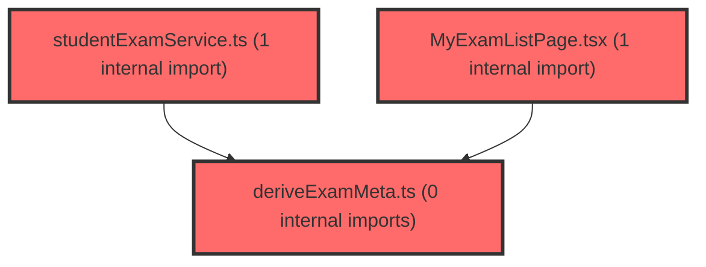

# 코드 리뷰 - 844768e7

## 코드 복잡도 분석

**분석된 파일**: 3개 / 변경된 파일: 8개


### Import 의존관계 다이어그램



**범례**: 중심 파일 (변경됨) | 많은 import (10개 이상)


### 정상 범위 (NONE)


**`studentexamservice.ts`** (other)

- 평균 복잡도: **0.004**

- 최대 복잡도: 0.009

- 청크 수: 20개


**권장사항:**

- 복잡도 정상 범위


**`deriveexammeta.ts`** (utility)

- 평균 복잡도: **0.003**

- 최대 복잡도: 0.006

- 청크 수: 8개


**권장사항:**

- 복잡도 정상 범위


**`myexamlistpage.tsx`** (component)

- 평균 복잡도: **0.000**

- 최대 복잡도: 0.008

- 청크 수: 115개


**권장사항:**

- 파일 크기가 큼 (115개 청크) - 파일 분리 검토


---


## 변경 배경

이 커밋은 두 가지 독립적인 개선을 포함합니다. 첫째, **프롬프트 정책 강화**로 검사 시스템 관련 사실 질문(학회 인증 현황·인증번호·유효기간, 설문 문항 선택지 등)에 대해 '확인할 수 없다'고 답하기 전에 반드시 `search_test_logic_reference`/`search_teacher_guide` Tool을 먼저 호출하도록 지시합니다. 둘째, **프론트엔드 잠금(locked) 상태 파생 로직의 위치 이동**으로, 한 반(claId) 응답만으로는 학생이 다른 반에서 1차를 제출했는지 알 수 없는 문제를 해결하기 위해 여러 반을 병합한 뒤 한 번만 적용하도록 수정했습니다.

- **목적**: (1) 검사 시스템 사실 질문에 대한 할루시네이션 방지 강화, (2) 다중 반 병합 시 잠금 상태 파생의 정확성 보장
- **도메인**: 프롬프트/LLM 정책(에이전트), 프론트엔드 비즈니스 로직(UI)
- **변경 방향**: Tool 호출을 '선택적'에서 '필수 선행'으로 강화하고, 잠금 파생을 데이터 병합 지점으로 이동하여 정확도 향상

## [GOOD] 잘된 점

- **잠금 파생 위치 이동이 논리적으로 타당**: `getStudentExamList`는 단일 claId 기준이므로 다른 반의 1차 제출 여부를 알 수 없습니다. 이를 `loadExams`의 병합 지점으로 옮긴 것은 데이터 정합성 관점에서 올바른 수정입니다.
- **이미 제출된 2차 항목 보호**: `alreadySubmitted` 조건을 추가하여 1차 미제출 후 2차만 완료한 학생의 결과가 가려지는 엣지 케이스를 방지한 점이 세심합니다.
- **프롬프트 일관성 유지**: 5개 프롬프트 파일(role_and_rules, tool_policy_class/none/student/teacher)에 동일한 정책 문구를 일관되게 반영했습니다.

## 변경사항 요약

- 프롬프트 5개 파일에서 검사 시스템 사실 질문 시 Tool 선행 호출을 의무화하고, 두 Tool 모두 빈 결과일 때만 '확인할 수 없음'을 허용하도록 강화.
- `getStudentExamList`에서 `deriveLockedStatus` 호출을 제거하고, `MyExamListPage.tsx`의 병합 지점에서 한 번만 적용.
- `deriveLockedStatus`에 이미 제출/완료된 2차 항목을 잠그지 않는 `alreadySubmitted` 조건 추가.

---

## [ISSUE] 개선이 필요한 부분

### Critical (즉시 수정 필요)

없음

### High (우선 수정 권장)

없음

### Medium (개선 권장)

- **`deriveLockedStatus`의 `alreadySubmitted` 조건과 `firstRoundSubmitted` 판정 로직의 대칭성**: 1차 항목은 `completed`/`result_ready`만 "제출 완료"로 보지만, 2차 항목의 `alreadySubmitted`도 동일한 두 상태만 검사합니다. 만약 2차 항목이 `in_progress`(진행중) 상태라면 잠금 처리되어 사용자가 진행 중인 검사를 잃을 수 있습니다. 다만 이는 기존 로직의 범위를 벗어나는 시나리오로, 현재 데이터 흐름상 2차가 `in_progress`인 경우는 드물어 우선순위가 낮습니다.

---

## 주요 파일 분석

### frontend/src/features/student-exam/utils/deriveExamMeta.ts

**변경 내용:**
`deriveLockedStatus`에 이미 제출/완료된 2차 항목을 잠그지 않는 `alreadySubmitted` 조건을 추가했습니다.

**개선 제안:**

1. `alreadySubmitted` 판정 로직을 1차/2차 공통 헬퍼로 추출하면 중복을 줄일 수 있습니다.
   - **위치 (라인 번호)**: 40-43
   - **기존 코드**:
```
  return items.map((item) => {
    const alreadySubmitted = item.status === 'completed' || item.status === 'result_ready';
    if (item.ordNo === 2 && !alreadySubmitted && !firstRoundSubmitted.has(item.paperIdx)) {
      return { ...item, status: 'locked' as const };
    }
    return item;
  });
```
   - **해결 방안 (수정 코드)**:
```
  const isSubmitted = (s: ExamStatus) => s === 'completed' || s === 'result_ready';
  return items.map((item) => {
    if (item.ordNo === 2 && !isSubmitted(item.status) && !firstRoundSubmitted.has(item.paperIdx)) {
      return { ...item, status: 'locked' as const };
    }
    return item;
  });
```
   > 위 수정은 `isSubmitted` 헬퍼를 추출하여 1차 판정 루프와 2차 판정에서 동일한 기준을 재사용하게 합니다. `ExamStatus` 타입 import가 필요하며, 기존 동작과 동일합니다.

### frontend/src/features/student-exam/api/studentExamService.ts

**변경 내용:**
`getStudentExamList`에서 `deriveLockedStatus` 호출을 제거하고 `withRecommendedMonth`만 적용하도록 변경했습니다.

**개선 제안:**
1. 함수 주석이 명확해져 좋습니다. 추가 제안은 없습니다.

### frontend/src/features/student-exam/ui/MyExamListPage.tsx

**변경 내용:**
`loadExams`에서 여러 반을 병합한 `flat` 배열에 `deriveLockedStatus`를 적용하도록 변경했습니다.

**개선 제안:**
1. `deriveLockedStatus(flat)` 호출이 병합 직후에 위치하여 데이터 정합성이 보장됩니다. 추가 제안은 없습니다.

---

## 최종 평가

**결론**:
- [x] [OK] **승인 (Approved)** - Critical/High 이슈 없음

**종합 의견:**
이 커밋은 잠금 상태 파생 로직의 위치를 데이터 병합 지점으로 이동하여 다중 반 시나리오의 정확성을 개선하고, 프롬프트 정책을 통해 검사 시스템 사실 질문에 대한 할루시네이션을 방지하는 방향으로 잘 구성되었습니다. 특히 이미 제출된 2차 항목을 보호하는 엣지 케이스 처리가 세심합니다. 승인합니다.