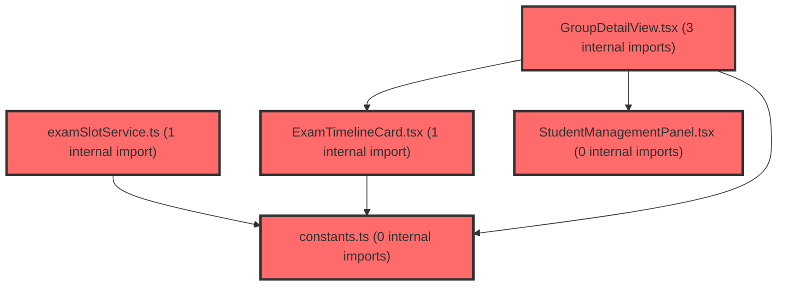

> [!IMPORTANT]
> **⚠️ 수동 검토 권장 (자가힐링 주의)**
>
> AI 자가힐링 결과물이 실제 의도와 다를 수 있으므로, **상세 리뷰 내용에 기반한 수동 점검**을 우선해 주시기 바랍니다. 자가힐링 기능을 활용하실 경우 최종 결과물을 신중하게 확인해 주세요.

# 코드 리뷰 - 8c15a2db

## 코드 복잡도 분석

**분석된 파일**: 8개 / 변경된 파일: 11개


### Import 의존관계 다이어그램



**범례**: 중심 파일 (변경됨) | 많은 import (10개 이상)


### 정상 범위 (NONE)


**`examslotservice.ts`** (other)

- 평균 복잡도: **0.003**

- 최대 복잡도: 0.014

- 청크 수: 5개


**권장사항:**

- 복잡도 정상 범위


**`assessmentpagev2.tsx`** (component)

- 평균 복잡도: **0.002**

- 최대 복잡도: 0.010

- 청크 수: 72개


**권장사항:**

- 파일 크기가 큼 (72개 청크) - 파일 분리 검토


**`constants.ts`** (other)

- 평균 복잡도: **0.001**

- 최대 복잡도: 0.002

- 청크 수: 6개


**권장사항:**

- 복잡도 정상 범위


**`examtimelinecard.tsx`** (other)

- 평균 복잡도: **0.001**

- 최대 복잡도: 0.006

- 청크 수: 18개


**권장사항:**

- 복잡도 정상 범위


**`groupdetailview.tsx`** (component)

- 평균 복잡도: **0.001**

- 최대 복잡도: 0.004

- 청크 수: 16개


**권장사항:**

- 복잡도 정상 범위


**`studentmanagementpanel.tsx`** (other)

- 평균 복잡도: **0.001**

- 최대 복잡도: 0.006

- 청크 수: 10개


**권장사항:**

- 복잡도 정상 범위


**`qrcodemodal.tsx`** (other)

- 평균 복잡도: **0.000**

- 최대 복잡도: 0.004

- 청크 수: 35개


**권장사항:**

- 파일 크기가 큼 (35개 청크) - 파일 분리 검토


**`index.ts`** (other)

- 평균 복잡도: **0.000**

- 최대 복잡도: 0.000

- 청크 수: 9개


**권장사항:**

- 복잡도 정상 범위


---


## 변경 배경

이 커밋은 assessment-v2(진단검사 관리) 기능의 사용자 경험(UX)을 개선하고 누락된 UI 요소를 보강하기 위한 변경입니다.

- **목적**: 미제출 학생 목록을 API로 동적 조회하도록 개선, QR 코드 초대 모달 구현, PDF 설명서 다운로드 버튼 추가, 초대 관련 사용자 피드백(toast) 추가, 불필요한 `activeStudentCount` prop 제거
- **도메인**: UI / 비즈니스 로직 (프론트엔드)
- **변경 방향**: 정적 데이터(notSubmittedStudents) 의존에서 API 기반 동적 조회로 전환, 누락된 UI 요소(QR 모달, PDF 버튼) 추가, 사용자 피드백 강화(toast), 불필요한 prop 정리

---

## [GOOD] 잘된 점

1. **미제출 학생 목록의 동적 조회 전환**: 기존에는 `slotState.notSubmittedStudents`에 정적으로 포함된 데이터만 사용했으나, 이제 `fetchNotSubmittedStudents` API를 통해 실제 미제출 학생 목록을 서버에서 동적으로 가져오도록 개선했습니다. 이는 데이터 정합성 측면에서 올바른 방향입니다. 특히 `examSlotService.ts`에서 `notSubmittedStudents` 필드를 `Array.isArray`로 안전하게 처리한 점도 좋습니다.

2. **QR 코드 초대 모달의 완성도**: `QRCodeModal` 컴포넌트가 `qrcode.react` 라이브러리를 활용하여 QR 코드 생성, PNG 다운로드, Escape 키 닫기, 오버레이 클릭 닫기 등 필요한 기능을 모두 갖추고 있습니다. 스타일드 컴포넌트를 활용한 일관된 디자인도 좋습니다.

3. **불필요한 prop 제거**: `activeStudentCount` prop이 `GroupDetailView`와 `ExamTimelineCard`에서 더 이상 사용되지 않음에도 전달되고 있었는데, 이를 깔끔하게 제거했습니다. 데드 코드 정리는 유지보수에 긍정적입니다.

---

## 변경사항 요약

- `ExamTimelineCard`: 미제출 학생 목록을 API로 동적 조회하도록 변경, `activeStudentCount` prop 제거
- `GroupDetailView`: PDF 설명서 버튼 추가, `activeStudentCount` prop 제거, `onInviteMember` 타입을 async로 변경
- `StudentManagementPanel`: 초대 시 toast 피드백 추가, `onInvite` 타입을 async로 변경
- `QRCodeModal`: 신규 QR 코드 초대 모달 컴포넌트 추가
- `AssessmentPageV2`: QR 모달 상태 관리, toast 피드백 추가, `handleInviteMember` 예외 처리 제거
- `constants.ts`: `shortLabel` 값을 전체 이름으로 통일
- `examSlotService.ts`: `notSubmittedStudents` 필드를 안전하게 배열로 변환

---

## [ISSUE] 개선이 필요한 부분

### Critical (즉시 수정 필요)

없음

### High (우선 수정 권장)

**1. `StudentManagementPanel`에서 toast.success가 API 호출보다 먼저 실행됨**

- **파일**: `frontend/src/features/assessment-v2/ui/StudentManagementPanel.tsx`
- **위치 (라인 37-44)**: `handleInvite` 함수
- **문제점**: `handleInvite` 함수에서 `setInviteEmail('')`과 `toast.success(...)`를 `await onInvite(email)`보다 먼저 호출하고 있습니다. `onInvite`가 아직 완료되지 않았는데 사용자에게 "초대 이메일을 발송했습니다"라는 성공 메시지가 먼저 표시됩니다. `onInvite`가 실패하면 `toast.error`가 뒤이어 표시되지만, 사용자는 성공 메시지를 이미 보게 됩니다. 이는 UX 관점에서 혼란을 줄 수 있습니다.

- **기존 코드**:
```typescript
const handleInvite = async () => {
    const email = inviteEmail.trim();
    if (!email) return;
    setIsInviting(true);
    setInviteEmail('');
    toast.success(`${email}로 초대 이메일을 발송했습니다.`);
    try {
      await onInvite(email);
    } catch {
      toast.error('초대 이메일 발송에 실패했습니다.');
    } finally {
      setIsInviting(false);
    }
};
```

- **해결 방안 (수정 코드)**: `toast.success`를 `await onInvite(email)` 성공 후로 이동하고, `setInviteEmail('')`도 성공 시에만 초기화하는 것이 적절합니다.

```typescript
const handleInvite = async () => {
    const email = inviteEmail.trim();
    if (!email) return;
    setIsInviting(true);
    try {
      await onInvite(email);
      setInviteEmail('');
      toast.success(`${email}로 초대 이메일을 발송했습니다.`);
    } catch {
      toast.error('초대 이메일 발송에 실패했습니다.');
    } finally {
      setIsInviting(false);
    }
};
```

**2. `handleInviteMember`에서 예외 처리 제거로 인한 미처리 에러 전파**

- **파일**: `frontend/src/pages/assessment-v2/AssessmentPageV2.tsx`
- **위치 (라인 341-343)**: `handleInviteMember` 함수
- **문제점**: 기존에는 `try/catch`로 감싸서 예외를 무시(`// noop`)하던 것을, `await sendEmailInvitation(...)`만 남기고 예외 처리를 완전히 제거했습니다. `handleInviteMember` 함수 자체가 `user?.id`나 `selectedGroupId`가 없을 때 `return`하는 early return 패턴을 사용하는데, 이 경우 `StudentManagementPanel`에서는 `onInvite(email)` 호출이 정상 완료된 것으로 간주하여 `toast.success`가 이미 출력된 상태가 됩니다. 즉, **초대가 실제로 실행되지 않았는데도 "초대 이메일을 발송했습니다"라는 toast가 먼저 표시됩니다.**

- **기존 코드**:
```typescript
const handleInviteMember = async (email: string) => {
    if (!user?.id || !selectedGroupId) return;
    await sendEmailInvitation({ groupId: selectedGroupId, email }, user.id);
};
```

- **해결 방안 (수정 코드)**: `handleInviteMember`가 early return하는 경우를 호출부에서 감지할 수 있도록, `sendEmailInvitation`이 정상 실행되었는지 여부를 반환값으로 전달하는 것이 좋습니다. 또는 `StudentManagementPanel`에서 `onInvite` 호출 전에 유효성 검사를 수행하도록 변경할 수 있습니다.

> **[수정 코드 제시 불가 -- 문맥 파악 불충분]**: `StudentManagementPanel`과 `AssessmentPageV2` 간의 계약을 재정의해야 하는 문제로, 단순 코드 치환만으로 해결하기 어렵습니다. `onInvite`가 `Promise<void>`를 반환하므로, 성공/실패 여부를 반환값으로 구분할 수 없습니다. `sendEmailInvitation`이 예외를 던지지 않고 내부적으로 처리하는 경우도 고려해야 합니다. `handleInviteMember`에서 `user?.id`나 `selectedGroupId`가 없을 때 예외를 throw하도록 변경하거나, `StudentManagementPanel`에서 `onInvite` 호출 전에 `selectedGroup`의 존재 여부를 확인하는 방식으로 해결할 수 있습니다.

### Medium (개선 권장)

**1. `shortLabel` 값을 전체 이름으로 통일한 것의 의도 확인 필요**

- **파일**: `frontend/src/features/assessment-v2/constants.ts`
- **변경 내용**: `shortLabel`이 `'학습종합'`/`'자기조절'`에서 `'학습종합검사'`/`'자기조절학습검사'`로 변경되었습니다.
- **분석**: `shortLabel`은 UI에서 짧게 표시하기 위한 용도로 보이는데, 이제 `label`과 동일한 값이 되었습니다. `ExamTimelineCard`에서 `slotDef.shortLabel`을 사용하고 있으므로, UI에서 검사명이 더 길게 표시되게 됩니다. 만약 이것이 의도된 디자인 변경이라면 문제없지만, `shortLabel`이라는 필드명과 역할이 불일치하게 되었습니다. 필드명을 `label`로 통일하거나, `shortLabel`의 의미를 재정의하는 것이 좋습니다.

**2. `MANUAL_URL_COMPREHENSIVE`와 `MANUAL_URL_SELF_REGULATED`가 빈 문자열**

- **파일**: `frontend/src/features/assessment-v2/ui/GroupDetailView.tsx`
- **변경 내용**: PDF 설명서 버튼이 추가되었지만, 링크 URL이 빈 문자열(`''`)로 설정되어 있습니다.
- **분석**: 실제 PDF URL이 아직 확정되지 않은 상태에서 UI만 먼저 추가한 것으로 보입니다. 빈 문자열 링크는 클릭 시 현재 페이지를 새로고침하게 됩니다. `href`가 유효하지 않을 때 버튼을 비활성화하거나, TODO 주석을 남겨두는 것이 좋습니다.

---

## 최종 평가

**결론**:
- [ ] [OK] **승인 (Approved)** - Critical/High 이슈 없음
- [ ] [WARN] **조건부 승인 (Approved with Comments)** - Medium 이하 이슈만 존재
- [X] [FIX] **수정 필요 (Changes Requested)** - Critical/High 이슈 존재

**종합 의견**:
전반적으로 기능 개선 방향은 적절하며, QR 코드 모달과 PDF 버튼 추가는 사용자 경험 향상에 기여합니다. 다만 `StudentManagementPanel`에서 toast.success가 API 호출보다 먼저 실행되는 문제(High)는 사용자에게 잘못된 피드백을 줄 수 있으므로 수정을 권장합니다. `handleInviteMember`의 예외 처리 제거도 호출부와의 계약을 고려할 때 재검토가 필요합니다. 위 High 이슈 2건이 해결되면 승인 가능합니다.