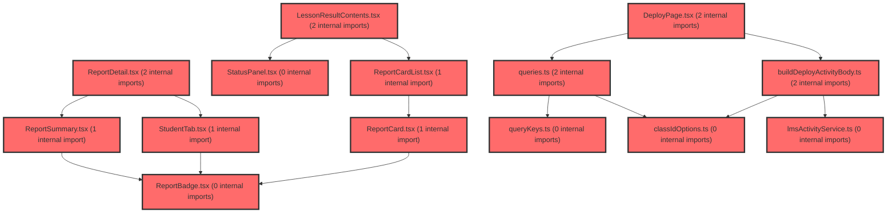

> [!IMPORTANT]
> **⚠️ 수동 검토 권장 (자가힐링 주의)**
>
> AI 자가힐링 결과물이 실제 의도와 다를 수 있으므로, **상세 리뷰 내용에 기반한 수동 점검**을 우선해 주시기 바랍니다. 자가힐링 기능을 활용하실 경우 최종 결과물을 신중하게 확인해 주세요.

# 코드 리뷰 - 8c3b51d8

## 코드 복잡도 분석

**분석된 파일**: 22개 / 변경된 파일: 23개


### Import 의존관계 다이어그램



**범례**: 중심 파일 (변경됨) | 많은 import (10개 이상)


### 정상 범위 (NONE)


**`lmsactivityservice.ts`** (other)

- 평균 복잡도: **0.003**

- 최대 복잡도: 0.007

- 청크 수: 71개


**권장사항:**

- 파일 크기가 큼 (71개 청크) - 파일 분리 검토


**`queries.ts`** (other)

- 평균 복잡도: **0.003**

- 최대 복잡도: 0.012

- 청크 수: 95개


**권장사항:**

- 파일 크기가 큼 (95개 청크) - 파일 분리 검토


**`index.ts`** (other)

- 평균 복잡도: **0.002**

- 최대 복잡도: 0.011

- 청크 수: 36개


**권장사항:**

- 파일 크기가 큼 (36개 청크) - 파일 분리 검토


**`classidoptions.ts`** (other)

- 평균 복잡도: **0.002**

- 최대 복잡도: 0.004

- 청크 수: 13개


**권장사항:**

- 복잡도 정상 범위


**`index.ts`** (other)

- 평균 복잡도: **0.002**

- 최대 복잡도: 0.004

- 청크 수: 4개


**권장사항:**

- 복잡도 정상 범위


**`builddeployactivitybody.ts`** (other)

- 평균 복잡도: **0.001**

- 최대 복잡도: 0.004

- 청크 수: 12개


**권장사항:**

- 복잡도 정상 범위


**`lessonmypage.tsx`** (component)

- 평균 복잡도: **0.001**

- 최대 복잡도: 0.006

- 청크 수: 17개


**권장사항:**

- 복잡도 정상 범위


**`lessonresultpage.tsx`** (component)

- 평균 복잡도: **0.001**

- 최대 복잡도: 0.006

- 청크 수: 14개


**권장사항:**

- 복잡도 정상 범위


**`lessonmycontents.tsx`** (utility)

- 평균 복잡도: **0.001**

- 최대 복잡도: 0.004

- 청크 수: 13개


**권장사항:**

- 복잡도 정상 범위


**`reportbadge.tsx`** (other)

- 평균 복잡도: **0.001**

- 최대 복잡도: 0.003

- 청크 수: 33개


**권장사항:**

- 파일 크기가 큼 (33개 청크) - 파일 분리 검토


**`querykeys.ts`** (other)

- 평균 복잡도: **0.000**

- 최대 복잡도: 0.001

- 청크 수: 18개


**권장사항:**

- 복잡도 정상 범위


**`deploypage.tsx`** (component)

- 평균 복잡도: **0.000**

- 최대 복잡도: 0.005

- 청크 수: 177개


**권장사항:**

- 파일 크기가 큼 (177개 청크) - 파일 분리 검토


**`scopetree.tsx`** (other)

- 평균 복잡도: **0.000**

- 최대 복잡도: 0.006

- 청크 수: 67개


**권장사항:**

- 파일 크기가 큼 (67개 청크) - 파일 분리 검토


**`index.ts`** (utility)

- 평균 복잡도: **0.000**

- 최대 복잡도: 0.000

- 청크 수: 2개


**권장사항:**

- 복잡도 정상 범위


**`lessonresultcontents.tsx`** (other)

- 평균 복잡도: **0.000**

- 최대 복잡도: 0.002

- 청크 수: 30개


**권장사항:**

- 파일 크기가 큼 (30개 청크) - 파일 분리 검토


**`reportcard.tsx`** (other)

- 평균 복잡도: **0.000**

- 최대 복잡도: 0.004

- 청크 수: 44개


**권장사항:**

- 파일 크기가 큼 (44개 청크) - 파일 분리 검토


**`reportcardlist.tsx`** (other)

- 평균 복잡도: **0.000**

- 최대 복잡도: 0.006

- 청크 수: 34개


**권장사항:**

- 파일 크기가 큼 (34개 청크) - 파일 분리 검토


**`reportdetail.tsx`** (other)

- 평균 복잡도: **0.000**

- 최대 복잡도: 0.003

- 청크 수: 26개


**권장사항:**

- 파일 크기가 큼 (26개 청크) - 파일 분리 검토


**`reportsummary.tsx`** (other)

- 평균 복잡도: **0.000**

- 최대 복잡도: 0.004

- 청크 수: 49개


**권장사항:**

- 파일 크기가 큼 (49개 청크) - 파일 분리 검토


**`statuspanel.tsx`** (other)

- 평균 복잡도: **0.000**

- 최대 복잡도: 0.002

- 청크 수: 52개


**권장사항:**

- 파일 크기가 큼 (52개 청크) - 파일 분리 검토


**`studenttab.tsx`** (other)

- 평균 복잡도: **0.000**

- 최대 복잡도: 0.008

- 청크 수: 85개


**권장사항:**

- 파일 크기가 큼 (85개 청크) - 파일 분리 검토


**`index.ts`** (other)

- 평균 복잡도: **0.000**

- 최대 복잡도: 0.000

- 청크 수: 7개


**권장사항:**

- 복잡도 정상 범위


---


## 변경 배경

- **목적**: 수업 메뉴(`/lesson/library`, `/lesson/my`, `/lesson/result`)를 사이드바에서 선택한 반(class) 단위 스코프로 전환하고, 기존 추가계획 15~18에서 보류했던 미제출 학생 조회, 반 배지, 참여 인원, 학생 점수/상태 기능을 신규 LMS API(`GET /activities/progress` 묶음, `GET /activities/{id}/participations`)로 해제하는 것이 핵심 목표입니다.
- **도메인**: 프론트엔드 비즈니스 로직 + LMS API 연동 (React Query, FSD Lite 구조)
- **변경 방향**: 페이지가 직접 fetch하던 구조를 위젯(`LessonResultContents`, `LessonMyContents`)으로 이동시켜 페이지를 얇게 유지하고, `optFilter=classId:like:{classId}` 필터와 `options.classId` 저장(store-and-echo)을 통해 반 단위 데이터 격리를 구현했습니다.

---

## [GOOD] 잘된 점

1. **FSD 계층 구조 준수**: `LessonMyPage`의 목록 fetch 로직을 `LessonMyContents` 위젯으로, `LessonResultPage`의 상태 관리와 가드를 `LessonResultContents` 위젯으로 이동시켜 페이지가 `scope.classId`만 전달하는 얇은 구조로 개선되었습니다. 계획서 §13의 FSD 다이어그램과 실제 구현이 일치합니다.
2. **반 없음/실패 가드의 세분화**: `LessonResultContents.tsx`에서 `groupsLoading`, `groupsError`, `groups.length === 0`, `isCurrentClassValid`를 각각 분기 처리하여 "반이 없는 것"과 "API 호출 실패"를 구분하고, 실패 시에만 `refetchGroups` 재시도 버튼을 노출한 점이 UX 측면에서 우수합니다.
3. **N+1 문제 회피**: 미제출 학생을 활동마다 단건 `GET .../progress`로 조회하지 않고 묶음 API `GET /activities/progress` 한 번으로 해결한 설계가 계획서 §10의 권장안 (a)와 정확히 일치합니다.
4. **`classIdOptions.ts` 유틸 모듈 분리**: `parseClassIds`, `joinClassIds`, `classIdLikeOptFilter`, `resolveClassNames`를 단일 모듈로 응집시켜 배포 body 생성과 반 배지 매핑, 필터 생성에 재사용한 점이 좋습니다.

---

## 변경사항 요약

수업 3개 경로에 반 기본 선택(`ScopeTree` useEffect)을 도입하고, 활동 목록·이번 주 건수·진행 중 건수 쿼리에 `optFilter=classId:like:{classId}`를 추가했습니다. 배포 시 `options.classId`를 콤마 결합으로 저장하고, 미제출 묶음 조회·참여요약·학생 명단(`participations`)을 신규 API로 연동했습니다. `assignees` API와 `useActivityAssigneesQuery`는 삭제되었습니다.

---

## [ISSUE] 개선이 필요한 부분

### Critical (즉시 수정 필요)

없음

### High (우선 수정 권장)

**1. `ScopeTree.tsx` useEffect의 무한 루프 위험**

`ScopeTree.tsx`의 새 useEffect는 의존성 배열에 `selectClass`를 포함하고 있습니다.

```ts
useEffect(() => {
  if (!location.pathname.startsWith('/lesson')) return;
  if (groupsLoading || groupsError || groups.length === 0) return;
  const isCurrentClassValid = groups.some((group) => group.id === scope.classId);
  if (isCurrentClassValid) return;
  const firstClassId = groups[0]?.id;
  if (firstClassId) selectClass(firstClassId);
}, [groups, groupsError, groupsLoading, location.pathname, scope.classId, selectClass]);
```

`selectClass`가 `LayoutContext`에서 `useCallback`으로 메모이제이션되지 않은 함수라면, `selectClass` 호출 → LayoutContext 상태 변경 → 컴포넌트 리렌더 → `selectClass` 참조 변경 → useEffect 재실행 → `selectClass` 재호출의 무한 루프가 발생할 수 있습니다. `scope.classId`가 설정되면 `isCurrentClassValid`가 true가 되어 루프가 중단되지만, `selectClass`가 `scope.classId`를 즉시 반영하지 않는 비동기적 구현이라면 위험이 있습니다.

- **위치**: `frontend/src/widgets/layout/v2/ScopeTree.tsx` (useEffect 블록)
- **해결 방안**: `selectClass`를 의존성 배열에서 제외하거나, `LayoutContext`에서 `selectClass`를 `useCallback`으로 감싸 참조 안정성을 보장하세요. React Query의 `selectClass`가 컨텍스트 상태를 업데이트하는 방식이라면 `useCallback` 적용이 가장 확실한 해결책입니다.

**[수정 코드 제시 불가 — 문맥 파악 불충분]**: `LayoutContext.tsx`의 `selectClass` 구현을 읽지 못해 정확한 수정 코드를 제시할 수 없습니다. `selectClass`가 `useCallback`으로 감싸져 있는지 확인 후, 아니라면 `useCallback` 적용을 권장합니다.

**2. `getActivityParticipationsAll`의 하드코딩 페이지 가드**

```ts
export async function getActivityParticipationsAll(
  activityId: string,
  signal?: AbortSignal,
): Promise<ActivityParticipationRow[]> {
  const rows: ActivityParticipationRow[] = [];
  let page = 0;
  for (;;) {
    const res = await getActivityParticipations(activityId, { page, size: 100 }, signal);
    rows.push(...(res.content ?? []));
    if (!res.hasNext) break;
    page += 1;
    if (page > 50) break;
  }
  return rows;
}
```

`page > 50` 가드는 5,000명(50페이지 × 100명) 이상의 학생이 있는 반에서 조용히 데이터를 잘라냅니다. 에러나 경고 없이 `hasNext`가 true인데도 루프가 종료되어, 사용자는 일부 학생만 보게 됩니다. 또한 `res.content`가 `undefined`일 때 `rows.push(...(res.content ?? []))`는 빈 배열을 푸시하지만, `hasNext`가 true인 상태로 `content`가 비어 있으면 무한 루프에 빠질 위험도 있습니다.

- **위치**: `frontend/src/features/lesson/api/lmsActivityService.ts` (getActivityParticipationsAll)
- **해결 방안**: 
  1. `content`가 비어 있는데 `hasNext`가 true인 경우를 명시적으로 처리(에러 throw 또는 break + 경고)
  2. `page > 50` 가드에 `console.warn`을 추가하거나, 가드 대신 최대 페이지 수를 상수로 추출

**[수정 코드 제시 불가 — 문맥 파악 불충분]**: `lmsFetch`의 에러 처리 방식과 `ActivityParticipationsPageResponse`의 실제 응답 형태를 확인하지 못해 안전한 수정 코드를 제시할 수 없습니다.

### Medium (개선 권장)

**1. `classIdLikeOptFilter` 값 인코딩 누락**

계획서 §7에서는 "값만 `encodeURIComponent`"라고 명시했지만, `classIdOptions.ts`의 `classIdLikeOptFilter`는 값을 인코딩하지 않습니다.

```ts
export function classIdLikeOptFilter(classId: string): string {
  return `classId:like:${classId}`;
}
```

`classId`가 UUID 형태라면 문제가 없지만, 특수문자나 공백이 포함된 id라면 URL 쿼리스트링에서 깨질 수 있습니다. `appendOptFilters`가 `URLSearchParams.append`를 사용하므로 값 자체는 인코딩되지만, `classId:like:` 접두사와 결합된 문자열 전체가 하나의 값으로 인코딩되는 구조입니다. `classId`에 `&`나 `=`가 포함된 경우 필터가 오염될 수 있습니다.

- **위치**: `frontend/src/features/lesson/model/classIdOptions.ts` (classIdLikeOptFilter)
- **해결 방안**: 
```ts
export function classIdLikeOptFilter(classId: string): string {
  return `classId:like:${encodeURIComponent(classId)}`;
}
```

**2. `LessonResultContents`의 `isCurrentClassValid` false 시 무한 로딩**

```ts
const isCurrentClassValid = Boolean(classId && groups.some((group) => group.id === classId));
if (!isCurrentClassValid || !classId) {
  return (
    <LoadingBox role='status' aria-busy='true'>
      <Loading size='md' text='불러오는 중...' />
    </LoadingBox>
  );
}
```

`classId`가 유효하지 않은 값(예: 삭제된 반의 id)으로 들어온 경우, `ScopeTree`의 useEffect가 첫 반으로 `selectClass`를 호출하지만, 그 사이에 이 컴포넌트는 영구히 로딩 상태를 표시합니다. `selectClass`가 상태를 업데이트하기 전까지 사용자는 로딩 화면만 보게 됩니다. 이는 `ScopeTree`의 useEffect가 `selectClass`를 호출한 직후의 짧은 순간이지만, `selectClass`가 실패하거나 지연되면 무한 로딩이 됩니다.

- **위치**: `frontend/src/widgets/lesson/result/LessonResultContents.tsx` (isCurrentClassValid 분기)
- **해결 방안**: 로딩 대신 "반을 선택하는 중..." 안내 문구를 표시하거나, 일정 시간 후에도 `classId`가 유효하지 않으면 안내 화면으로 전환하는 폴백을 추가하세요.

**3. `LessonMyContents`의 toast 스타일 제거**

기존 `LessonMyPage`에 있던 toast의 `position`, `unstyled`, `style` 옵션이 `LessonMyContents`로 이동하면서 제거되었습니다. 이는 의도적인 변경일 수 있지만, 기존 UI/UX가 변경되었는지 확인이 필요합니다.

---

## 주요 파일 분석

### `frontend/src/features/lesson/model/classIdOptions.ts` (신규)

**변경 내용:** 반 id 문자열 파싱/결합/필터 생성/이름 매핑 유틸 모듈.

**개선 제안:**
1. `classIdLikeOptFilter`에 `encodeURIComponent` 적용 필요 (Medium 1 참조)
2. `resolveClassNames`는 `Map`을 사용해 O(n) 조회로 효율적이며, 매칭 실패 id는 조용히 제외되어 계획서 §9의 "이름을 지어내지 않음" 원칙을 잘 지킵니다.

### `frontend/src/widgets/lesson/result/LessonResultContents.tsx` (신규)

**변경 내용:** 결과보기 페이지의 반 가드, StatusPanel/ReportCardList 조립, 미제출 학생 하이라이트 상태 관리.

**개선 제안:**
1. `isCurrentClassValid` false 시 무한 로딩 위험 (Medium 2 참조)
2. `handleSelectStudent`에서 `participant`가 null이면 `missingActivityIds`를 빈 배열로 리셋하는 로직이 명확합니다. 다만 `highlightParticipant`와 `highlightActivityIds`가 별도 상태로 관리되어 동기화가 깨질 가능성이 있습니다. `useState` 하나로 `{ participant, activityIds }` 객체를 관리하는 것이 더 안전합니다.

### `frontend/src/features/lesson/api/lmsActivityService.ts`

**변경 내용:** `optFilter`/`withParticipationSummary` 파라미터 추가, `getActivitiesProgressBundle`(묶음 조회), `getActivityParticipations`/`getActivityParticipationsAll`(명단 조회) 신규, `getActivityAssignees` 삭제.

**개선 제안:**
1. `getActivityParticipationsAll`의 `page > 50` 하드코딩 가드 (High 2 참조)
2. `appendOptFilters`가 빈 문자열 필터를 걸러내는 방어 로직이 좋습니다.

### `frontend/src/widgets/layout/v2/ScopeTree.tsx`

**변경 내용:** `/lesson` 경로 진입 시 그룹 로드 후 첫 반 자동 `selectClass`.

**개선 제안:**
1. `selectClass` 의존성 배열 포함으로 인한 무한 루프 위험 (High 1 참조)
2. `location.pathname.startsWith('/lesson')` 체크는 `/lesson/result/:activityId` 같은 하위 경로도 포함하므로 의도대로 동작합니다.

### `frontend/src/features/lesson/api/queries.ts`

**변경 내용:** `useThisWeekCountQuery`, `useRunningCountQuery`, `useActivityListQuery`에 `classId` 파라미터 추가 및 `optFilter` 적용, `useActivityAssigneesQuery` → `useActivityParticipationsQuery` 교체, `useActivitiesProgressBundleQuery` 신규.

**개선 제안:**
1. `queryKey`에 `classId ?? ''`를 사용해 반 전환 시 캐시를 분리한 점이 좋습니다.
2. `enabled: Boolean(classId)`로 반 선택 전 API 호출을 차단한 점이 계획서 §5의 "classId가 생긴 뒤에만 쿼리 enabled" 원칙과 일치합니다.

---

## 최종 평가

**결론**: 
- [ ] [OK] **승인 (Approved)** - Critical/High 이슈 없음
- [ ] [WARN] **조건부 승인 (Approved with Comments)** - Medium 이하 이슈만 존재
- [x] [FIX] **수정 필요 (Changes Requested)** - Critical/High 이슈 존재

**종합 의견:**

이 커밋은 수업 반 스코프 전환, 미제출 묶음 조회, 참여요약, 학생 점수/상태 연동이라는 복잡한 기능을 FSD 구조를 지키며 잘 구현했습니다. 특히 반 없음/실패 가드의 세분화, N+1 문제 회피, `classIdOptions` 유틸 모듈 분리는 높이 평가할 만합니다.

다만 `ScopeTree`의 useEffect 무한 루프 위험(High)과 `getActivityParticipationsAll`의 하드코딩 페이지 가드(High)는 실제 운영 환경에서 문제를 일으킬 수 있는 잠재적 이슈입니다. `selectClass`의 `useCallback` 적용 여부를 확인하고, 페이지 가드에 경고 로그를 추가하는 것을 권장합니다. 이 두 가지만 해결되면 승인 가능한 수준의 커밋입니다.