> [!IMPORTANT]
> **⚠️ 수동 검토 권장 (자가힐링 주의)**
>
> AI 자가힐링 결과물이 실제 의도와 다를 수 있으므로, **상세 리뷰 내용에 기반한 수동 점검**을 우선해 주시기 바랍니다. 자가힐링 기능을 활용하실 경우 최종 결과물을 신중하게 확인해 주세요.

# 코드 리뷰 - 8c55c14a

## 코드 복잡도 분석

**분석된 파일**: 74개 / 변경된 파일: 98개


### Import 의존관계 다이어그램

```mermaid
flowchart TD
    F0["coachingService.ts (0 internal imports)"]:::center
    F1["MySelfregResultPage.tsx (2 internal imports)"]:::center
    F2["assessmentService.ts (1 internal import)"]:::center
    F3["assessment/types.ts (0 internal imports)"]:::center
    F4["constants.ts (0 internal imports)"]:::center
    F5["api/queries.ts (1 internal import)"]:::center
    F6["useClassCoachingData.ts (2 internal imports)"]:::center
    F7["ExamClassManagementView.tsx (2 internal imports)"]:::center
    F8["MyResultPage.tsx (1 internal import)"]:::center
    F9["deriveExamMeta.ts (1 internal import)"]:::center
    F10["selfregSummaryGenerator.ts (1 internal import)"]:::center
    F11["classStrategyContent.ts (1 internal import)"]:::center
    F12["LessonActivityJoinEmbed.tsx (2 internal imports)"]:::center
    F13["LessonViewerEmbed.tsx (1 internal import)"]:::center
    F14["MyExamListPage.tsx (1 internal import)"]:::center
    F15["SelfregDiagnosisSummary.tsx (0 internal imports)"]:::center
    F16["utils.ts (1 internal import)"]:::center
    F17["api/queries.ts (2 internal imports)"]:::center
    F18["api/queries.ts (1 internal import)"]:::center
    F19["queryKeys.ts (0 internal imports)"]:::center
    F20["StrategyCard.tsx (0 internal imports)"]:::center
    F21["studentLearningStatusService.ts (0 internal imports)"]:::center
    F22["student-exam/types.ts (0 internal imports)"]:::center
    F23["SelfregStudentDashboardPage.tsx (0 internal imports)"]:::center
    F24["useExamReminderAction.ts (2 internal imports)"]:::center
    F25["TeacherDashboardPage.tsx (1 internal import)"]:::center
    F26["lpaTypeOrder.ts (1 internal import)"]:::center
    F27["studentExamService.ts (2 internal imports)"]:::center
    F28["coaching/types.ts (0 internal imports)"]:::center
    F29["useEveryCanvasEmbed.ts (2 internal imports)"]:::center
    F30["ClassCoachingSection.tsx (1 internal import)"]:::center
    F31["aiPrompts.ts (0 internal imports)"]:::center
    F32["everyCanvasEmbedSdk.ts (0 internal imports)"]:::center
    F33["LessonEditorEmbed.tsx (1 internal import)"]:::center
    F2 --> F3
    F18 --> F3
    F24 --> F16
    F24 --> F18
    F7 --> F16
    F7 --> F24
    F16 --> F3
    F5 --> F0
    F11 --> F28
    F26 --> F28
    F6 --> F28
    F6 --> F26
    F17 --> F21
    F17 --> F19
    F29 --> F32
    F29 --> F4
    F12 --> F32
    F12 --> F29
    F33 --> F29
    F13 --> F29
    F27 --> F9
    F27 --> F22
    F14 --> F22
    F8 --> F27
    F1 --> F27
    F1 --> F15
    F9 --> F22
    F25 --> F23
    F10 --> F31
    F30 --> F20
    classDef center fill:#ff6b6b,stroke:#333,stroke-width:3px
    classDef high fill:#ffd93d,stroke:#333,stroke-width:2px
```



**범례**: 중심 파일 (변경됨) | 많은 import (10개 이상)


### 정상 범위 (NONE)


**`securityconfig.java`** (config)

- 평균 복잡도: **0.200**

- 최대 복잡도: 0.464

- 청크 수: 14개

- 평균 사용처: 22.4곳


**권장사항:**

- Config 파일은 높은 연결도가 정상적임


**`adminuserdetailsservice.java`** (other)

- 평균 복잡도: **0.163**

- 최대 복잡도: 0.471

- 청크 수: 3개

- 평균 사용처: 15.3곳


**권장사항:**

- 복잡도 정상 범위


**`routes.tsx`** (other)

- 평균 복잡도: **0.052**

- 최대 복잡도: 0.463

- 청크 수: 24개

- 평균 사용처: 2.3곳


**권장사항:**

- 파일 크기가 큼 (24개 청크) - 파일 분리 검토


**`coachingadminmapper.xml`** (other)

- 평균 복잡도: **0.009**

- 최대 복잡도: 0.009

- 청크 수: 1개


**권장사항:**

- 복잡도 정상 범위


**`adminaccountmapper.xml`** (other)

- 평균 복잡도: **0.008**

- 최대 복잡도: 0.008

- 청크 수: 1개


**권장사항:**

- 복잡도 정상 범위


**`mustchangepasswordinterceptor.java`** (other)

- 평균 복잡도: **0.007**

- 최대 복잡도: 0.009

- 청크 수: 2개


**권장사항:**

- 복잡도 정상 범위


**`adminwebmvcconfig.java`** (config)

- 평균 복잡도: **0.007**

- 최대 복잡도: 0.008

- 청크 수: 2개


**권장사항:**

- Config 파일은 높은 연결도가 정상적임


**`adminaccount.java`** (other)

- 평균 복잡도: **0.007**

- 최대 복잡도: 0.007

- 청크 수: 1개


**권장사항:**

- 복잡도 정상 범위


**`env.ts`** (config)

- 평균 복잡도: **0.006**

- 최대 복잡도: 0.006

- 청크 수: 1개


**권장사항:**

- Config 파일은 높은 연결도가 정상적임


**`types.ts`** (other)

- 평균 복잡도: **0.005**

- 최대 복잡도: 0.010

- 청크 수: 4개


**권장사항:**

- 복잡도 정상 범위


**`adminaccountcontroller.java`** (other)

- 평균 복잡도: **0.004**

- 최대 복잡도: 0.007

- 청크 수: 7개


**권장사항:**

- 복잡도 정상 범위


**`adminaccountselfcontroller.java`** (other)

- 평균 복잡도: **0.004**

- 최대 복잡도: 0.006

- 청크 수: 2개


**권장사항:**

- 복잡도 정상 범위


**`studentexamservice.ts`** (other)

- 평균 복잡도: **0.004**

- 최대 복잡도: 0.009

- 청크 수: 20개


**권장사항:**

- 복잡도 정상 범위


**`aiprompts.ts`** (other)

- 평균 복잡도: **0.004**

- 최대 복잡도: 0.024

- 청크 수: 50개


**권장사항:**

- 파일 크기가 큼 (50개 청크) - 파일 분리 검토


**`adminaccountservice.java`** (other)

- 평균 복잡도: **0.003**

- 최대 복잡도: 0.004

- 청크 수: 4개


**권장사항:**

- 복잡도 정상 범위


**`assessmentservice.ts`** (other)

- 평균 복잡도: **0.003**

- 최대 복잡도: 0.008

- 청크 수: 34개


**권장사항:**

- 파일 크기가 큼 (34개 청크) - 파일 분리 검토


**`queries.ts`** (other)

- 평균 복잡도: **0.003**

- 최대 복잡도: 0.014

- 청크 수: 48개


**권장사항:**

- 파일 크기가 큼 (48개 청크) - 파일 분리 검토


**`utils.ts`** (utility)

- 평균 복잡도: **0.003**

- 최대 복잡도: 0.008

- 청크 수: 19개


**권장사항:**

- 복잡도 정상 범위


**`types.ts`** (other)

- 평균 복잡도: **0.003**

- 최대 복잡도: 0.006

- 청크 수: 4개


**권장사항:**

- 복잡도 정상 범위


**`queries.ts`** (other)

- 평균 복잡도: **0.003**

- 최대 복잡도: 0.012

- 청크 수: 48개


**권장사항:**

- 파일 크기가 큼 (48개 청크) - 파일 분리 검토


**`deriveexammeta.ts`** (utility)

- 평균 복잡도: **0.003**

- 최대 복잡도: 0.006

- 청크 수: 8개


**권장사항:**

- 복잡도 정상 범위


**`selfregfactordefinitions.ts`** (other)

- 평균 복잡도: **0.003**

- 최대 복잡도: 0.003

- 청크 수: 1개


**권장사항:**

- 복잡도 정상 범위


**`scopeconfig.ts`** (config)

- 평균 복잡도: **0.003**

- 최대 복잡도: 0.009

- 청크 수: 13개


**권장사항:**

- Config 파일은 높은 연결도가 정상적임


**`useapidata.ts`** (other)

- 평균 복잡도: **0.002**

- 최대 복잡도: 0.010

- 청크 수: 60개


**권장사항:**

- 파일 크기가 큼 (60개 청크) - 파일 분리 검토


**`useexamreminderaction.ts`** (other)

- 평균 복잡도: **0.002**

- 최대 복잡도: 0.009

- 청크 수: 7개


**권장사항:**

- 복잡도 정상 범위


**`coachingservice.ts`** (other)

- 평균 복잡도: **0.002**

- 최대 복잡도: 0.004

- 청크 수: 6개


**권장사항:**

- 복잡도 정상 범위


**`individualcoachingcontent.ts`** (other)

- 평균 복잡도: **0.002**

- 최대 복잡도: 0.004

- 청크 수: 5개


**권장사항:**

- 복잡도 정상 범위


**`lpatypeorder.ts`** (other)

- 평균 복잡도: **0.002**

- 최대 복잡도: 0.006

- 청크 수: 7개


**권장사항:**

- 복잡도 정상 범위


**`querykeys.ts`** (other)

- 평균 복잡도: **0.002**

- 최대 복잡도: 0.002

- 청크 수: 2개


**권장사항:**

- 복잡도 정상 범위


**`studentlearningstatusservice.ts`** (other)

- 평균 복잡도: **0.002**

- 최대 복잡도: 0.008

- 청크 수: 12개


**권장사항:**

- 복잡도 정상 범위


**`everycanvasembedsdk.ts`** (utility)

- 평균 복잡도: **0.002**

- 최대 복잡도: 0.006

- 청크 수: 13개


**권장사항:**

- 복잡도 정상 범위


**`selfregsummarygenerator.ts`** (utility)

- 평균 복잡도: **0.002**

- 최대 복잡도: 0.004

- 청크 수: 14개


**권장사항:**

- 복잡도 정상 범위


**`categorychangelist.tsx`** (other)

- 평균 복잡도: **0.002**

- 최대 복잡도: 0.010

- 청크 수: 27개


**권장사항:**

- 파일 크기가 큼 (27개 청크) - 파일 분리 검토


**`types.ts`** (other)

- 평균 복잡도: **0.001**

- 최대 복잡도: 0.006

- 청크 수: 13개


**권장사항:**

- 복잡도 정상 범위


**`queries.ts`** (other)

- 평균 복잡도: **0.001**

- 최대 복잡도: 0.003

- 청크 수: 7개


**권장사항:**

- 복잡도 정상 범위


**`individualtypecharacteristics.ts`** (other)

- 평균 복잡도: **0.001**

- 최대 복잡도: 0.003

- 청크 수: 5개


**권장사항:**

- 복잡도 정상 범위


**`useclasscoachingdata.ts`** (other)

- 평균 복잡도: **0.001**

- 최대 복잡도: 0.005

- 청크 수: 10개


**권장사항:**

- 복잡도 정상 범위


**`queries.ts`** (other)

- 평균 복잡도: **0.001**

- 최대 복잡도: 0.004

- 청크 수: 6개


**권장사항:**

- 복잡도 정상 범위


**`useeverycanvasembed.ts`** (utility)

- 평균 복잡도: **0.001**

- 최대 복잡도: 0.004

- 청크 수: 11개


**권장사항:**

- 복잡도 정상 범위


**`lessoneditorembed.tsx`** (other)

- 평균 복잡도: **0.001**

- 최대 복잡도: 0.007

- 청크 수: 11개


**권장사항:**

- 복잡도 정상 범위


**`lessonviewerembed.tsx`** (component)

- 평균 복잡도: **0.001**

- 최대 복잡도: 0.003

- 청크 수: 10개


**권장사항:**

- 복잡도 정상 범위


**`typeclassification.tsx`** (other)

- 평균 복잡도: **0.001**

- 최대 복잡도: 0.012

- 청크 수: 54개


**권장사항:**

- 파일 크기가 큼 (54개 청크) - 파일 분리 검토


**`selfregdiagnosissummary.tsx`** (other)

- 평균 복잡도: **0.001**

- 최대 복잡도: 0.006

- 청크 수: 16개


**권장사항:**

- 복잡도 정상 범위


**`coachingclasspage.tsx`** (component)

- 평균 복잡도: **0.001**

- 최대 복잡도: 0.002

- 청크 수: 2개


**권장사항:**

- 복잡도 정상 범위


**`coachingindividualpage.tsx`** (component)

- 평균 복잡도: **0.001**

- 최대 복잡도: 0.002

- 청크 수: 7개


**권장사항:**

- 복잡도 정상 범위


**`selfregstudentdashboardpage.tsx`** (component)

- 평균 복잡도: **0.001**

- 최대 복잡도: 0.012

- 청크 수: 68개


**권장사항:**

- 파일 크기가 큼 (68개 청크) - 파일 분리 검토


**`classdashboardv2widget.tsx`** (other)

- 평균 복잡도: **0.001**

- 최대 복잡도: 0.012

- 청크 수: 177개


**권장사항:**

- 파일 크기가 큼 (177개 청크) - 파일 분리 검토


**`timeline.tsx`** (other)

- 평균 복잡도: **0.001**

- 최대 복잡도: 0.005

- 청크 수: 19개


**권장사항:**

- 복잡도 정상 범위


**`adminaccountmapper.java`** (other)

- 평균 복잡도: **0.000**

- 최대 복잡도: 0.001

- 청크 수: 11개


**권장사항:**

- 복잡도 정상 범위


**`examclassmanagementview.tsx`** (component)

- 평균 복잡도: **0.000**

- 최대 복잡도: 0.005

- 청크 수: 76개


**권장사항:**

- 파일 크기가 큼 (76개 청크) - 파일 분리 검토


**`classstrategycontent.ts`** (other)

- 평균 복잡도: **0.000**

- 최대 복잡도: 0.000

- 청크 수: 2개


**권장사항:**

- 복잡도 정상 범위


**`constants.ts`** (other)

- 평균 복잡도: **0.000**

- 최대 복잡도: 0.000

- 청크 수: 1개


**권장사항:**

- 복잡도 정상 범위


**`lessonactivityjoinembed.tsx`** (other)

- 평균 복잡도: **0.000**

- 최대 복잡도: 0.004

- 청크 수: 13개


**권장사항:**

- 복잡도 정상 범위


**`selfregresultoverview.tsx`** (component)

- 평균 복잡도: **0.000**

- 최대 복잡도: 0.009

- 청크 수: 68개


**권장사항:**

- 파일 크기가 큼 (68개 청크) - 파일 분리 검토


**`selfregstudentsummary.tsx`** (other)

- 평균 복잡도: **0.000**

- 최대 복잡도: 0.002

- 청크 수: 26개


**권장사항:**

- 파일 크기가 큼 (26개 청크) - 파일 분리 검토


**`index.ts`** (other)

- 평균 복잡도: **0.000**

- 최대 복잡도: 0.000

- 청크 수: 13개


**권장사항:**

- 복잡도 정상 범위


**`myexamlistpage.tsx`** (component)

- 평균 복잡도: **0.000**

- 최대 복잡도: 0.008

- 청크 수: 114개


**권장사항:**

- 파일 크기가 큼 (114개 청크) - 파일 분리 검토


**`myresultpage.tsx`** (component)

- 평균 복잡도: **0.000**

- 최대 복잡도: 0.008

- 청크 수: 100개


**권장사항:**

- 파일 크기가 큼 (100개 청크) - 파일 분리 검토


**`myselfregresultpage.tsx`** (component)

- 평균 복잡도: **0.000**

- 최대 복잡도: 0.008

- 청크 수: 92개


**권장사항:**

- 파일 크기가 큼 (92개 청크) - 파일 분리 검토


**`landingpage.tsx`** (component)

- 평균 복잡도: **0.000**

- 최대 복잡도: 0.003

- 청크 수: 15개


**권장사항:**

- 복잡도 정상 범위


**`teacherdashboardpage.tsx`** (component)

- 평균 복잡도: **0.000**

- 최대 복잡도: 0.004

- 청크 수: 42개


**권장사항:**

- 파일 크기가 큼 (42개 청크) - 파일 분리 검토


**`airoomchatarea.tsx`** (other)

- 평균 복잡도: **0.000**

- 최대 복잡도: 0.003

- 청크 수: 53개


**권장사항:**

- 파일 크기가 큼 (53개 청크) - 파일 분리 검토


**`classcoachingsection.tsx`** (other)

- 평균 복잡도: **0.000**

- 최대 복잡도: 0.008

- 청크 수: 91개


**권장사항:**

- 파일 크기가 큼 (91개 청크) - 파일 분리 검토


**`coachingoverviewsection.tsx`** (component)

- 평균 복잡도: **0.000**

- 최대 복잡도: 0.001

- 청크 수: 54개


**권장사항:**

- 파일 크기가 큼 (54개 청크) - 파일 분리 검토


**`coachingpageframe.tsx`** (component)

- 평균 복잡도: **0.000**

- 최대 복잡도: 0.002

- 청크 수: 9개


**권장사항:**

- 복잡도 정상 범위


**`individualcoachingsection.tsx`** (other)

- 평균 복잡도: **0.000**

- 최대 복잡도: 0.007

- 청크 수: 102개


**권장사항:**

- 파일 크기가 큼 (102개 청크) - 파일 분리 검토


**`strategycard.tsx`** (other)

- 평균 복잡도: **0.000**

- 최대 복잡도: 0.004

- 청크 수: 61개


**권장사항:**

- 파일 크기가 큼 (61개 청크) - 파일 분리 검토


**`index.ts`** (other)

- 평균 복잡도: **0.000**

- 최대 복잡도: 0.000

- 청크 수: 4개


**권장사항:**

- 복잡도 정상 범위


**`studenttrackingsection.tsx`** (other)

- 평균 복잡도: **0.000**

- 최대 복잡도: 0.010

- 청크 수: 114개


**권장사항:**

- 파일 크기가 큼 (114개 청크) - 파일 분리 검토


**`examstatussection.tsx`** (other)

- 평균 복잡도: **0.000**

- 최대 복잡도: 0.008

- 청크 수: 54개


**권장사항:**

- 파일 크기가 큼 (54개 청크) - 파일 분리 검토


**`mainlayout.tsx`** (other)

- 평균 복잡도: **0.000**

- 최대 복잡도: 0.008

- 청크 수: 137개


**권장사항:**

- 파일 크기가 큼 (137개 청크) - 파일 분리 검토


**`studentlayout.tsx`** (other)

- 평균 복잡도: **0.000**

- 최대 복잡도: 0.008

- 청크 수: 96개


**권장사항:**

- 파일 크기가 큼 (96개 청크) - 파일 분리 검토


**`gnbheader.tsx`** (other)

- 평균 복잡도: **0.000**

- 최대 복잡도: 0.003

- 청크 수: 59개


**권장사항:**

- 파일 크기가 큼 (59개 청크) - 파일 분리 검토


**`scopetree.tsx`** (other)

- 평균 복잡도: **0.000**

- 최대 복잡도: 0.006

- 청크 수: 64개


**권장사항:**

- 파일 크기가 큼 (64개 청크) - 파일 분리 검토


---


## 변경 배경

이 커밋은 관리자(Admin) 영역의 **계정 관리 기능 신설**과 **비밀번호 변경 강제 정책 도입**을 주요 목적으로 합니다. 기존에는 관리자 계정이 코드/DB에 고정되어 있었으나, 이번 변경으로 SUPER_ADMIN이 관리자 계정을 직접 생성·초기화·상태/권한 변경할 수 있게 되었습니다. 또한 최초 로그인 또는 비밀번호 초기화 후 `must_change_password='Y'` 플래그를 통해 비밀번호 변경을 강제하는 인터셉터가 추가되었습니다.

- **목적**: 관리자 계정 셀프서비스(생성/초기화/상태·권한 관리) 및 비밀번호 변경 강제 정책 도입
- **도메인**: Admin(Thymeleaf UI) 영역, 보안/인증, FE 연동 문서
- **변경 방향**: 기존 고정 `ROLE_ADMIN` 단일 권한에서 `SUPER_ADMIN > ADMIN` 계층 구조로 확장, `role` 컬럼 기반 동적 권한 부여, 계정 관리 전용 컨트롤러/서비스/매퍼 신설

---

## [STATUS] 심각도별 이슈 요약

### Critical (즉시 수정 필요)
- **없음**

### High (우선 수정 권장)
1. **임시비밀번호 규칙의 결정적(deterministic) 취약점** — `AdminAccountService.tempPasswordOf()`가 `loginId + "!12"` 고정 규칙으로 임시비밀번호를 생성합니다. 아이디만 알면 누구나 임시비밀번호를 유추할 수 있어, 계정 생성 직후 또는 초기화 직후 **제3자가 해당 계정으로 로그인할 수 있는 보안 허점**이 존재합니다.
2. **임시비밀번호 평문 노출** — `AdminAccountController.create()`와 `resetPassword()`가 임시비밀번호를 평문으로 flash attribute에 담아 화면에 그대로 출력합니다. 브라우저 히스토리, 프록시 로그, 화면 캡처 등을 통해 노출될 수 있습니다.

### Medium (개선 권장)
1. **`actorId()` null 반환 시 자기 계정 보호 우회 가능** — `AdminAccountController.actorId()`가 `findByEmail` 결과가 null이면 `null`을 반환합니다. `updateStatus`/`updateRole`에서 `id.equals(actorId)` 비교 시 `actorId`가 null이면 `equals(null)`은 항상 false가 되어, **본인 계정의 상태/권한 변경이 가능해지는 경로**가 존재합니다.
2. **`role` 컬럼 마이그레이션 누락 위험** — `AdminUserDetailsService`가 `role` 컬럼 기반으로 권한을 부여하지만, 기존 `admin_account` 테이블에 `role` 컬럼이 없는 경우(또는 값이 NULL인 경우) `ADMIN`으로 기본 처리됩니다. **기존 데이터에 대한 마이그레이션 스크립트가 커밋에 포함되어 있지 않습니다.**
3. **`updateStatus`로 `SUSPENDED`된 계정의 비밀번호 초기화 불가** — `findByEmail`은 `status='ACTIVE'` 조건이 있어, 정지된 계정은 `findById`로만 조회 가능합니다. `resetPassword`는 `findById`를 사용하므로 정상 동작하지만, **정지된 계정의 상태를 다시 `ACTIVE`로 변경하려면 `updateStatus`를 사용해야 하는데, 이때 `findByEmail`이 아닌 `findById` 기반으로 동작하는지 확인이 필요합니다.**

### Low (참고 사항)
1. **`application-vs-dev.yml`의 SSO 도메인 변경** — `t-auth-api.vschool.at` → `t-auth-api.allvia.org`로 변경되었습니다. 운영 환경(`vs-prod`)과의 일관성 및 DNS/인증서 유효성 확인이 필요합니다.
2. **`MustChangePasswordInterceptor`의 예외 경로 누락 가능성** — `/admin/account/password`는 제외되어 있으나, **`/admin/account/password`에 대한 POST 요청도 인터셉터를 통과**합니다. `changeSubmit` 실패 시 `redirect:/admin/account/password`로 이동하므로 정상 동작하지만, **`/admin/account/**` 하위의 다른 경로가 추가될 경우 인터셉터에 걸릴 수 있습니다.**

---

## 변경사항 요약

1. **관리자 계정 관리 기능 신설**: `AdminAccountController`, `AdminAccountService`, `AdminAccountMapper`(인터페이스 + XML) 추가. SUPER_ADMIN 전용으로 계정 생성/비밀번호 초기화/상태·권한 변경 기능 구현.
2. **비밀번호 변경 강제 정책**: `MustChangePasswordInterceptor` + `AdminWebMvcConfig` 추가. `must_change_password='Y'`인 관리자는 `/admin/account/password`로 리다이렉트.
3. **권한 계층 도입**: `SecurityConfig`에 `RoleHierarchy` 빈(`ROLE_SUPER_ADMIN > ROLE_ADMIN`) 추가, `AdminUserDetailsService`가 `role` 컬럼 기반으로 권한 부여.
4. **FE 전달 문서 추가**: `st-coaching-fe-guide.md` 신설, `README.md`에 문서 목록 7종으로 갱신.
5. **코칭 관리 이력에 수정자 정보 추가**: `CoachingAdminMapper.xml`에서 `updated_by`/`changed_by`를 `admin_account`와 LEFT JOIN하여 수정자 이름 조회.
6. **SSO 도메인 변경**: `application-vs-dev.yml`의 JWKS/서버 URL을 `allvia.org`로 변경.

---

## 파일별 상세 분석

### 1. `AdminAccountService.java` (신규)

**변경 내용:**
- `tempPasswordOf(loginId)` — 임시비밀번호를 `loginId + "!12"`로 생성
- `create()` — 계정 생성, 중복 체크, 임시비밀번호 설정
- `resetPassword()` — 비밀번호 초기화, 임시비밀번호 반환
- `updateStatus()` / `updateRole()` — 본인 계정 변경 차단

**[PROBLEM] 발견된 문제:**

1. **[보안 취약점] 임시비밀번호 규칙의 결정적 생성**
   - **위치 (라인 번호)**: `AdminAccountService.java` 라인 31-33
   - **기존 코드**:
     ```java
     public static String tempPasswordOf(String loginId) {
         return loginId + "!12";
     }
     ```
   - **해결 방안 (수정 코드)**:
     ```java
     public static String tempPasswordOf(String loginId) {
         // 랜덤 12자리 임시비밀번호 생성 (영문 대/소문자 + 숫자 + 특수문자)
         String chars = "ABCDEFGHIJKLMNOPQRSTUVWXYZabcdefghijklmnopqrstuvwxyz0123456789!@#$%^&*";
         SecureRandom random = new SecureRandom();
         StringBuilder sb = new StringBuilder(12);
         for (int i = 0; i < 12; i++) {
             sb.append(chars.charAt(random.nextInt(chars.length())));
         }
         return sb.toString();
     }
     ```
   - **위험도**: High
   - **영향**: 아이디(이메일)를 아는 공격자가 임시비밀번호를 유추하여 해당 관리자 계정으로 로그인할 수 있습니다. `must_change_password='Y'` 플래그가 있지만, 변경 전까지는 공격자가 접근 가능합니다.

2. **[보안 취약점] 임시비밀번호 평문 노출**
   - **위치 (라인 번호)**: `AdminAccountController.java` 라인 44-46, 57-59
   - **기존 코드**:
     ```java
     ra.addFlashAttribute("success",
             "계정 생성 완료: " + loginId + " (임시비밀번호: " + AdminAccountService.tempPasswordOf(loginId) + " · 최초 로그인 시 변경 필요)");
     ```
   - **해결 방안 (수정 코드)**:
     ```java
     ra.addFlashAttribute("success",
             "계정 생성 완료: " + loginId + " (임시비밀번호는 별도 안내 예정 · 최초 로그인 시 변경 필요)");
     ```
     또는 임시비밀번호를 화면에 노출하지 않고, **이메일/내부 메신저로 전달**하는 방식으로 변경.
   - **위험도**: High
   - **영향**: 임시비밀번호가 브라우저 화면, 히스토리, 프록시 로그에 평문으로 남습니다. SUPER_ADMIN이 아닌 제3자가 화면을 보거나 로그를 열람할 경우 계정 탈취 위험이 있습니다.

**[GOOD] 잘된 점:**
- `@Transactional`을 서비스 메서드에 적용하여 원자성 보장
- `ROLES`/`STATUSES` 상수 집합으로 입력값 검증
- 본인 계정 변경 차단 로직(`id.equals(actorId)`)으로 자기 자신을 정지/권한 변경하는 사고 방지

---

### 2. `AdminAccountController.java` (신규)

**변경 내용:**
- `list()` — 페이징 + 키워드 검색
- `create()` — 계정 생성
- `resetPassword()` — 비밀번호 초기화
- `updateStatus()` / `updateRole()` — 상태/권한 변경
- `actorId()` — 현재 로그인 관리자 ID 조회

**[PROBLEM] 발견된 문제:**

1. **[NPE 가능성] `actorId()` null 반환**
   - **위치 (라인 번호)**: `AdminAccountController.java` 라인 108-112
   - **기존 코드**:
     ```java
     private Long actorId(Authentication auth) {
         AdminAccount me = mapper.findByEmail(auth.getName());
         return me != null ? me.getId() : null;
     }
     ```
   - **해결 방안 (수정 코드)**:
     ```java
     private Long actorId(Authentication auth) {
         AdminAccount me = mapper.findByEmail(auth.getName());
         if (me == null) {
             throw new IllegalStateException("로그인한 관리자 계정을 찾을 수 없습니다.");
         }
         return me.getId();
     }
     ```
   - **위험도**: Medium
   - **영향**: `findByEmail`이 null을 반환하면 `actorId()`가 null을 반환하고, `updateStatus`/`updateRole`에서 `id.equals(null)`이 false가 되어 **본인 계정의 상태/권한 변경이 가능**해집니다. 실제로는 로그인한 관리자는 `status='ACTIVE'`이므로 `findByEmail`이 항상 결과를 반환하지만, **DB 상태가 비정상인 경우(예: 관리자가 SUSPENDED 상태로 변경된 직후 세션 유지) 발생 가능**합니다.

2. **[보안] 임시비밀번호 평문 노출**
   - **위치 (라인 번호)**: `AdminAccountController.java` 라인 44-46, 57-59
   - **기존 코드**:
     ```java
     ra.addFlashAttribute("success",
             "계정 생성 완료: " + loginId + " (임시비밀번호: " + AdminAccountService.tempPasswordOf(loginId) + " · 최초 로그인 시 변경 필요)");
     ```
   - **해결 방안 (수정 코드)**: 위 `AdminAccountService` 섹션에서 제시한 방식과 동일하게, 임시비밀번호를 화면에 노출하지 않도록 변경.
   - **위험도**: High
   - **영향**: 임시비밀번호가 화면에 평문 노출되어 제3자에게 유출될 수 있습니다.

**[GOOD] 잘된 점:**
- `PageUtil`을 활용한 페이징 처리로 일관성 유지
- `RedirectAttributes`를 통한 flash 메시지로 PRG(Post-Redirect-Get) 패턴 준수
- 예외 발생 시 `log.warn`으로 로그 기록

---

### 3. `MustChangePasswordInterceptor.java` (신규)

**변경 내용:**
- `must_change_password='Y'`인 관리자를 비밀번호 변경 페이지로 리다이렉트

**[PROBLEM] 발견된 문제:**

1. **[기능적 이슈] 인터셉터 예외 경로 누락 가능성**
   - **위치 (라인 번호)**: `AdminWebMvcConfig.java` 라인 20-31
   - **기존 코드**:
     ```java
     .excludePathPatterns(
             "/admin/login",
             "/admin/logout",
             "/admin/account/password",
             "/admin/css/**",
             "/admin/js/**",
             "/admin/images/**"
     );
     ```
   - **해결 방안 (수정 코드)**:
     ```java
     .excludePathPatterns(
             "/admin/login",
             "/admin/logout",
             "/admin/account/**",   // 계정 관련 모든 경로 제외
             "/admin/css/**",
             "/admin/js/**",
             "/admin/images/**"
     );
     ```
   - **위험도**: Low
   - **영향**: 현재는 `/admin/account/password`만 제외되어 있어 정상 동작하지만, 향후 `/admin/account/profile` 등 다른 계정 관련 경로가 추가되면 인터셉터에 걸려 리다이렉트 루프가 발생할 수 있습니다.

**[GOOD] 잘된 점:**
- `AnonymousAuthenticationToken` 체크로 미인증 사용자를 필터에서 제외
- `sendRedirect` 후 `return false`로 체인 중단 처리
- `@Component` + `@RequiredArgsConstructor`로 의존성 주입 간결화

---

### 4. `SecurityConfig.java` (수정)

**변경 내용:**
- `RoleHierarchy` 빈 추가 (`ROLE_SUPER_ADMIN > ROLE_ADMIN`)
- `/admin/accounts/**` 경로에 `hasRole("SUPER_ADMIN")` 적용

**[PROBLEM] 발견된 문제:**

1. **[권한 설정] `hasRole("SUPER_ADMIN")`과 `RoleHierarchy`의 상호작용**
   - **위치 (라인 번호)**: `SecurityConfig.java` 라인 64-67, 122-124
   - **기존 코드**:
     ```java
     @Bean
     public RoleHierarchy roleHierarchy() {
         return RoleHierarchyImpl.fromHierarchy("ROLE_SUPER_ADMIN > ROLE_ADMIN");
     }
     ```
     ```java
     .requestMatchers("/admin/accounts/**").hasRole("SUPER_ADMIN")
     ```
   - **해결 방안 (수정 코드)**: 현재 구현은 정상 동작합니다. `RoleHierarchy` 빈이 `AuthorizationManager`에 자동 주입되어 `hasRole("SUPER_ADMIN")`이 `ROLE_SUPER_ADMIN` 권한을 가진 사용자만 접근하도록 처리합니다. 다만 **`RoleHierarchy` 빈이 `@EnableWebSecurity`가 적용된 `SecurityConfig` 내부에 정의되어 있어, 다른 SecurityFilterChain(API 체인)에도 영향을 줄 수 있는지 확인이 필요**합니다.
   - **위험도**: Low
   - **영향**: API 체인(`apiSecurityFilterChain`)은 JWT 기반 인증을 사용하므로 `RoleHierarchy`의 영향을 받지 않지만, **향후 API 체인에서도 `hasRole()`을 사용할 경우 SUPER_ADMIN 권한이 ADMIN 권한을 포함하는 것으로 해석**될 수 있습니다.

**[GOOD] 잘된 점:**
- `RoleHierarchyImpl.fromHierarchy()`를 사용하여 간결하게 계층 정의
- `/admin/accounts/**` 경로를 SUPER_ADMIN 전용으로 명시적 제한
- 기존 `anyRequest().hasRole("ADMIN")`과의 충돌 없이 우선순위 적용

---

### 5. `AdminUserDetailsService.java` (수정)

**변경 내용:**
- `role` 컬럼 기반 권한 부여, 미설정 시 `ADMIN` 기본값

**[PROBLEM] 발견된 문제:**

1. **[데이터 마이그레이션] 기존 계정의 `role` 컬럼 값 부재**
   - **위치 (라인 번호)**: `AdminUserDetailsService.java` 라인 27-35
   - **기존 코드**:
     ```java
     String role = admin.getRole();
     if (role == null || role.isBlank()) {
         role = "ADMIN";
     }
     return new org.springframework.security.core.userdetails.User(
             admin.getEmail(),
             admin.getPassword(),
             Collections.singletonList(new SimpleGrantedAuthority("ROLE_" + role))
     );
     ```
   - **해결 방안 (수정 코드)**: 기존 데이터에 `role` 컬럼이 없는 경우를 대비한 **마이그레이션 SQL**이 필요합니다.
     ```sql
     -- 기존 계정을 ADMIN으로 일괄 설정
     UPDATE admin_account SET role = 'ADMIN' WHERE role IS NULL OR role = '';
     ```
   - **위험도**: Medium
   - **영향**: 기존 `admin_account` 테이블에 `role` 컬럼이 추가되지 않은 상태에서 애플리케이션이 배포되면, `AdminAccountMapper.xml`의 `findByEmail` 쿼리가 `role` 컬럼을 SELECT하므로 **SQL 오류가 발생**할 수 있습니다. 또한 `role` 컬럼이 NULL인 경우 `ADMIN`으로 기본 처리되지만, **SUPER_ADMIN으로 승격된 계정이 없으면 최고관리자 기능을 사용할 수 없습니다.**

**[GOOD] 잘된 점:**
- `role`이 null/blank인 경우 `ADMIN`으로 기본값 처리하여 하위 호환성 유지
- `ROLE_` 접두사를 명시적으로 추가하여 Spring Security 권한 규칙 준수

---

### 6. `AdminAccountMapper.xml` (수정)

**변경 내용:**
- `role`, `must_change_password` 컬럼 추가
- 계정 관리용 쿼리(`countByEmail`, `countAccounts`, `selectAccounts`, `insert`, `updateStatus`, `updateRole`, `updatePasswordAndFlag`) 추가

**[PROBLEM] 발견된 문제:**

1. **[SQL 인젝션] `LIKE` 패턴의 와일드카드 미처리**
   - **위치 (라인 번호)**: `AdminAccountMapper.xml` 라인 47-53
   - **기존 코드**:
     ```xml
     <sql id="accountWhere">
         <if test="keyword != null and keyword != ''">
             WHERE (email LIKE CONCAT('%', #{keyword}, '%')
                    OR nickname LIKE CONCAT('%', #{keyword}, '%'))
         </if>
     </sql>
     ```
   - **해결 방안 (수정 코드)**: MyBatis의 `#{}` 파라미터 바인딩은 SQL 인젝션을 방지하지만, **`%` 또는 `_` 와일드카드 문자가 포함된 키워드**는 의도치 않은 검색 결과를 초래할 수 있습니다.
     ```xml
     <sql id="accountWhere">
         <if test="keyword != null and keyword != ''">
             WHERE (email LIKE CONCAT('%', REPLACE(REPLACE(#{keyword}, '%', '\\%'), '_', '\\_'), '%')
                    OR nickname LIKE CONCAT('%', REPLACE(REPLACE(#{keyword}, '%', '\\%'), '_', '\\_'), '%'))
         </if>
     </sql>
     ```
   - **위험도**: Low
   - **영향**: 키워드에 `%`나 `_`가 포함된 경우 전체 데이터가 조회될 수 있습니다. 다만 관리자 전용 페이지이므로 실제 공격 벡터로 활용될 가능성은 낮습니다.

**[GOOD] 잘된 점:**
- `<sql>` 태그로 공통 WHERE 절 재사용
- `useGeneratedKeys="true"`로 생성된 ID 자동 반환
- `NOW()` 함수로 생성/수정 시각 일괄 처리

---

### 7. `CoachingAdminMapper.xml` (수정)

**변경 내용:**
- `updated_by`/`changed_by`를 `admin_account`와 LEFT JOIN하여 수정자 이름 조회

**[GOOD] 잘된 점:**
- LEFT JOIN으로 수정자가 없는 경우(시스템)에도 데이터 조회 가능
- `changed_by=0`인 경우 템플릿에서 `'시스템'`으로 표시하는 로직이 `coaching-history.html`에 구현됨

---

### 8. `application-vs-dev.yml` (수정)

**변경 내용:**
- SSO 도메인을 `t-auth-api.vschool.at` → `t-auth-api.allvia.org`로 변경

**[PROBLEM] 발견된 문제:**

1. **[환경 설정] 도메인 변경의 영향 범위 미확인**
   - **위치 (라인 번호)**: `application-vs-dev.yml` 라인 8-13
   - **기존 코드**:
     ```yaml
     spring.security.oauth2.resourceserver.jwt:
       jwk-set-uri: https://t-auth-api.allvia.org/.well-known/jwks.json
       issuer-uri: superplatform
     superplatform:
       auth:
         server-url: https://t-auth-api.allvia.org
     ```
   - **해결 방안 (수정 코드)**: 변경된 도메인이 실제로 유효한지, JWKS 엔드포인트가 정상 응답하는지 확인이 필요합니다. 또한 **`vs-prod` 프로파일에도 동일한 변경이 필요한지 검토**해야 합니다.
   - **위험도**: Low
   - **영향**: dev 환경에서 SSO 인증이 실패할 경우 모든 API 요청이 401로 거부됩니다. 도메인 변경 후 반드시 **JWKS 엔드포인트 응답 확인**이 필요합니다.

---

### 9. `st-coaching-fe-guide.md` (신규)

**변경 내용:**
- 개인화 코칭 v2 API(`GET /api/dgnss/st/coaching/{answerIdx}`)의 FE 연동 가이드 문서

**[GOOD] 잘된 점:**
- 응답 구조를 JSON 예시로 명확히 제시
- `[학생명]` placeholder 치환, 인용 따옴표 렌더링, 순위 배지 부여 등 FE 처리 규칙을 명확히 문서화
- 빈 응답/예외 처리 시나리오를 구체적으로 기술

---

## 보안 분석

**발견된 보안 취약점:**

1. **[High] 임시비밀번호 규칙의 결정적 생성**
   - **공격 시나리오**: 공격자가 관리자 아이디(이메일)를 알게 되면, `{아이디}!12` 규칙으로 임시비밀번호를 유추할 수 있습니다. 계정 생성 직후 또는 초기화 직후 `must_change_password='Y'` 상태에서 공격자가 해당 계정으로 로그인할 수 있습니다.
   - **수정 방법**: `SecureRandom` 기반의 랜덤 임시비밀번호 생성으로 변경.

2. **[High] 임시비밀번호 평문 노출**
   - **공격 시나리오**: SUPER_ADMIN이 계정을 생성하거나 초기화할 때, 임시비밀번호가 화면에 평문으로 표시됩니다. 화면을 공유하거나 브라우저 히스토리를 열람할 수 있는 제3자가 임시비밀번호를 획득할 수 있습니다.
   - **수정 방법**: 임시비밀번호를 화면에 노출하지 않고, 이메일/내부 메신저로 전달.

3. **[Medium] `actorId()` null 반환 시 본인 계정 보호 우회**
   - **공격 시나리오**: 관리자 계정이 `SUSPENDED` 상태로 변경된 직후에도 기존 세션이 유지되는 경우, `findByEmail`이 null을 반환하여 `actorId()`가 null이 됩니다. 이때 `updateStatus`/`updateRole`에서 `id.equals(null)`이 false가 되어 본인 계정의 상태/권한을 변경할 수 있습니다.
   - **수정 방법**: `actorId()`에서 null 반환 시 예외를 던지도록 변경.

**보안 체크리스트:**
- [x] 인증/인가 검증 — `/admin/accounts/**` 경로에 `hasRole("SUPER_ADMIN")` 적용, `RoleHierarchy`로 계층 처리
- [x] 입력 검증 및 Sanitization — `ROLES`/`STATUSES` 상수 집합으로 입력값 검증, MyBatis `#{}` 파라미터 바인딩으로 SQL 인젝션 방지
- [ ] 민감 정보 보호 — **임시비밀번호 평문 노출 문제 존재**
- [x] HTTPS/암호화 사용 — `BCryptPasswordEncoder`로 비밀번호 해싱, `real` 프로파일에서 HSTS 적용

---

## 버그 가능성 분석

**잠재적 버그:**

1. **[Medium] `updateStatus`로 `SUSPENDED`된 계정의 재활성화 불가**
   - **재현 조건**: SUPER_ADMIN이 다른 관리자 계정을 `SUSPENDED`로 변경한 후, 해당 계정을 다시 `ACTIVE`로 변경하려는 경우.
   - **예상 결과**: `updateStatus`는 `findById`가 아닌 `mapper.updateStatus(id, status)`를 직접 호출하므로 정상 동작합니다. 다만 **`findByEmail`이 `status='ACTIVE'` 조건이므로, `SUSPENDED` 상태의 계정은 로그인 자체가 불가능**합니다. 이는 의도된 동작이지만, **`SUSPENDED` 계정의 비밀번호를 초기화하려면 `resetPassword`가 `findById`를 사용하므로 정상 동작**합니다.
   - **수정 방법**: 특별한 수정 불필요. 다만 `SUSPENDED` 계정의 비밀번호 초기화 후 `ACTIVE`로 변경하는 워크플로우가 문서화되어야 합니다.

2. **[Low] `RoleHierarchy` 빈이 API 체인에 영향을 줄 수 있음**
   - **재현 조건**: API 체인(`apiSecurityFilterChain`)에서 `hasRole("ADMIN")`을 사용하는 엔드포인트가 추가되는 경우.
   - **예상 결과**: `RoleHierarchy` 빈이 전역으로 적용되어, `ROLE_SUPER_ADMIN` 권한을 가진 JWT 사용자가 `ROLE_ADMIN`이 필요한 API에 접근할 수 있게 됩니다.
   - **수정 방법**: API 체인에서 `RoleHierarchy`를 사용하지 않도록 별도 설정 필요.

**Edge Case 검증:**
- [x] Null/Undefined 처리 — `role` null/blank 시 `ADMIN` 기본값, `actorId()` null 반환 가능
- [x] 빈 배열/객체 처리 — `strengthCards` 빈 배열, `coachingCard` null 처리 문서화
- [ ] 경계값 (0, 음수, 최대값) — `page` 파라미터는 `PageUtil.clampPage`로 처리
- [ ] 동시성 문제 — `countByEmail` 중복 체크 후 `insert` 사이에 동시 요청이 발생하면 중복 계정 생성 가능 (유니크 제약 조건 필요)

---

## 성능 분석

**성능 이슈:**

1. **[Low] `actorId()`의 매 요청 DB 조회**
   - **영향**: `list()`, `updateStatus()`, `updateRole()`에서 매번 `findByEmail`을 호출하여 DB 조회가 발생합니다. 관리자 페이지의 트래픽이 낮아 실질적 영향은 미미하지만, **세션에 관리자 ID를 저장하면 불필요한 DB 조회를 줄일 수 있습니다.**
   - **개선 방법**: 로그인 성공 시 `Authentication`의 `principal`에 관리자 ID를 저장하거나, 세션 attribute로 관리.

**성능 체크리스트:**
- [x] 불필요한 연산 제거 — 페이징 쿼리에서 `LIMIT/OFFSET` 사용
- [ ] 캐싱 활용 — 관리자 계정 목록은 자주 변경되지 않으므로 캐싱 고려 가능
- [ ] 비동기 처리 — 해당 없음
- [x] 메모리 효율성 — 페이징으로 전체 데이터 로드 방지

---

## 코드 품질 평가

- **가독성**: 8/10 — 클래스/메서드 주석이 잘 작성되어 있고, 네이밍이 명확합니다. 다만 `AdminAccountController`의 `actorId()`가 null을 반환할 수 있는 점이 혼란을 줄 수 있습니다.
- **유지보수성**: 7/10 — `ROLES`/`STATUSES` 상수 집합으로 검증 로직을 중앙화한 점은 좋지만, 임시비밀번호 규칙이 하드코딩되어 있어 변경 시 여러 곳을 수정해야 합니다.
- **테스트 커버리지**: 미흡 — 이번 커밋에 테스트 코드가 포함되어 있지 않습니다. 계정 생성/초기화/상태 변경의 비즈니스 로직에 대한 단위 테스트가 필요합니다.
- **문서화**: 8/10 — FE 전달 문서(`st-coaching-fe-guide.md`)가 상세하게 작성되었고, `README.md`에 문서 목록이 갱신되었습니다. 다만 관리자 계정 관리 기능에 대한 운영 문서가 부재합니다.

---

## 개선 제안 (우선순위별)

### 필수 (Must Fix)
1. **임시비밀번호 규칙 변경**: `loginId + "!12"` 고정 규칙을 `SecureRandom` 기반 랜덤 생성으로 변경.
2. **임시비밀번호 평문 노출 제거**: 화면에 임시비밀번호를 표시하지 않고, 이메일/내부 메신저로 전달.
3. **`actorId()` null 처리**: null 반환 시 예외를 던지도록 변경하여 본인 계정 보호 로직의 우회를 방지.

### 권장 (Should Fix)
1. **`role` 컬럼 마이그레이션 스크립트 추가**: 기존 `admin_account` 테이블에 `role` 컬럼을 추가하고 기본값 `ADMIN`으로 설정하는 SQL을 커밋에 포함.
2. **`updateStatus`/`updateRole`의 대상 계정 존재 확인**: `findById`로 대상 계정이 존재하는지 확인 후 변경하도록 로직 보강.
3. **`RoleHierarchy` 빈의 API 체인 영향 검토**: API 체인에서 `hasRole()` 사용 시 `RoleHierarchy`가 적용되지 않도록 별도 설정.

### 선택 (Nice to Have)
1. **`LIKE` 검색 와일드카드 이스케이프**: `%`/`_` 문자를 이스케이프 처리.
2. **관리자 계정 목록 캐싱**: 자주 변경되지 않는 데이터이므로 캐싱 고려.
3. **단위 테스트 추가**: `AdminAccountService`의 비즈니스 로직에 대한 테스트 코드 작성.

---

## 최종 평가

**결론**:
- [ ] [OK] **승인 (Approved)** - 문제 없음
- [ ] [WARN] **조건부 승인 (Approved with Comments)** - 경미한 이슈만 존재
- [x] [FIX] **수정 필요 (Changes Requested)** - 중요 이슈 수정 후 재검토
- [ ] [REJECT] **거부 (Rejected)** - 치명적 이슈로 인한 병합 불가

**핵심 코멘트:**

이 커밋은 관리자 계정 관리 기능과 비밀번호 변경 강제 정책을 도입한 의미 있는 변경입니다. 전반적인 구조(컨트롤러-서비스-매퍼 분리, `@Transactional` 적용, 권한 계층 도입)는 잘 설계되었습니다. 다만 **임시비밀번호 규칙의 결정적 생성(`loginId + "!12"`)과 평문 노출**은 보안상 즉시 수정이 필요한 High 이슈입니다. 아이디만 알면 누구나 임시비밀번호를 유추할 수 있어, 계정 생성 직후 또는 초기화 직후 제3자 로그인이 가능한 보안 허점이 존재합니다. 또한 `actorId()`의 null 반환 가능성으로 인한 본인 계정 보호 우회 경로도 확인되었습니다. 이 두 가지 High 이슈가 해결된 후 재검토를 권장합니다.

**리뷰어 노트:**
- 검토 시간: 약 45분
- 우선 수정 항목:
  1. `AdminAccountService.tempPasswordOf()`를 `SecureRandom` 기반 랜덤 생성으로 변경
  2. `AdminAccountController`의 임시비밀번호 평문 노출 제거
  3. `AdminAccountController.actorId()`의 null 반환 시 예외 처리