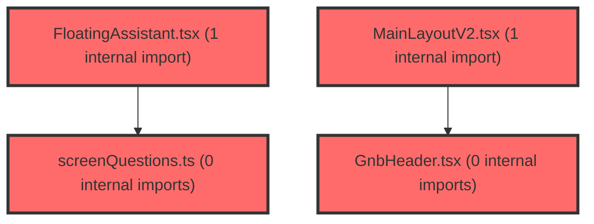

> [!IMPORTANT]
> **⚠️ 수동 검토 권장 (자가힐링 주의)**
>
> AI 자가힐링 결과물이 실제 의도와 다를 수 있으므로, **상세 리뷰 내용에 기반한 수동 점검**을 우선해 주시기 바랍니다. 자가힐링 기능을 활용하실 경우 최종 결과물을 신중하게 확인해 주세요.

# 코드 리뷰 - 8d7648e1

## 코드 복잡도 분석

**분석된 파일**: 12개 / 변경된 파일: 13개


### Import 의존관계 다이어그램



**범례**: 중심 파일 (변경됨) | 많은 import (10개 이상)


### 정상 범위 (NONE)


**`routes.tsx`** (other)

- 평균 복잡도: **0.066**

- 최대 복잡도: 0.463

- 청크 수: 19개

- 평균 사용처: 2.9곳


**권장사항:**

- 복잡도 정상 범위


**`usestreamguardstore.ts`** (store)

- 평균 복잡도: **0.003**

- 최대 복잡도: 0.007

- 청크 수: 7개


**권장사항:**

- Store 파일은 높은 연결도가 정상적임


**`screenquestions.ts`** (other)

- 평균 복잡도: **0.003**

- 최대 복잡도: 0.004

- 청크 수: 7개


**권장사항:**

- 복잡도 정상 범위


**`useconversations.ts`** (other)

- 평균 복잡도: **0.002**

- 최대 복잡도: 0.010

- 청크 수: 79개


**권장사항:**

- 파일 크기가 큼 (79개 청크) - 파일 분리 검토


**`streamguarddialog.tsx`** (other)

- 평균 복잡도: **0.002**

- 최대 복잡도: 0.007

- 청크 수: 7개


**권장사항:**

- 복잡도 정상 범위


**`usecapturestore.ts`** (store)

- 평균 복잡도: **0.001**

- 최대 복잡도: 0.006

- 청크 수: 12개


**권장사항:**

- Store 파일은 높은 연결도가 정상적임


**`mainlayoutv2.tsx`** (other)

- 평균 복잡도: **0.001**

- 최대 복잡도: 0.012

- 청크 수: 33개


**권장사항:**

- 파일 크기가 큼 (33개 청크) - 파일 분리 검토


**`captureoverlay.tsx`** (other)

- 평균 복잡도: **0.001**

- 최대 복잡도: 0.011

- 청크 수: 26개


**권장사항:**

- 파일 크기가 큼 (26개 청크) - 파일 분리 검토


**`floatingassistant.tsx`** (other)

- 평균 복잡도: **0.000**

- 최대 복잡도: 0.008

- 청크 수: 156개


**권장사항:**

- 파일 크기가 큼 (156개 청크) - 파일 분리 검토


**`index.ts`** (other)

- 평균 복잡도: **0.000**

- 최대 복잡도: 0.000

- 청크 수: 1개


**권장사항:**

- 복잡도 정상 범위


**`gnbheader.tsx`** (other)

- 평균 복잡도: **0.000**

- 최대 복잡도: 0.003

- 청크 수: 57개


**권장사항:**

- 파일 크기가 큼 (57개 청크) - 파일 분리 검토


**`index.ts`** (other)

- 평균 복잡도: **0.000**

- 최대 복잡도: 0.000

- 청크 수: 1개


**권장사항:**

- 복잡도 정상 범위


---


## 변경 배경

이 커밋은 기존의 단순한 `FloatingCaptureButton`(화면 캡처 전용 플로팅 버튼)을 제거하고, 화면 캡처 + AI 질문 + 추천 질문 + 대상 선택(학급/학생) + 스트리밍 가드까지 통합한 **`FloatingAssistant`** 위젯으로 대체하는 프론트엔드 아키텍처 개편입니다.

- **목적**: AI 어시스턴트를 대시보드 전 화면에서 상시 접근 가능한 플로팅 UI로 승격하고, AI 응답 스트리밍 중 화면 이동 시 발생하는 응답 중단 문제를 사용자 확인 다이얼로그로 보호
- **도메인**: UI / 프론트엔드 아키텍처 (React, Zustand, Emotion)
- **변경 방향**: 
  - 캡처 전용 버튼 → 캡처 + 채팅 + 추천 질문 + 대상 선택이 가능한 통합 플로팅 패널
  - `openInNewConversation` 플래그 제거 → 캡처 후 `/ai-room` 강제 이동 로직 삭제, 현재 화면에서 바로 첨부 가능
  - `useStreamGuardStore` 신설 → GNB/서브탭 이동을 `guardedNavigate`로 감싸 스트리밍 중 이동 시 확인 다이얼로그 표시

---

## [GOOD] 잘된 점

1. **스트리밍 가드(StreamGuard) 설계가 깔끔함**: `useStreamGuardStore`에 `guardedNavigate` / `confirmPending` / `cancelPending`을 두어, GNB와 서브탭의 모든 이동 호출을 일관되게 감쌀 수 있게 한 점이 좋습니다. `pendingAction`을 함수로 저장하는 패턴은 Zustand에서 콜백을 다루는 적절한 방식입니다.
2. **`handleSend`의 `overrideText` 파라미터 추가**: 추천 질문 카드를 클릭했을 때 `handleSend(text)`로 직접 전송할 수 있게 되어, 입력창에 텍스트를 세팅하는 불필요한 중간 단계를 제거했습니다. `effectiveInput = overrideText ?? input` 패턴도 명확합니다.
3. **`CaptureOverlay`의 관심사 분리**: `OverlayContent`를 내부 컴포넌트로 분리하고, `overlayOpen` 상태를 바깥에서 체크하여 불필요한 렌더링을 방지한 점이 좋습니다. 또한 `openInNewConversation` 관련 복잡한 로직을 제거하면서 코드가 크게 단순해졌습니다.
4. **화면별 추천 질문(`screenQuestions.ts`)을 별도 모듈로 분리**: 라우트 경로 → screenKey 매핑, 화면 라벨, 추천 질문 해석 로직을 한 파일에 응집시켜 유지보수가 용이합니다.

---

## 변경사항 요약

- `FloatingCaptureButton` 삭제, `FloatingAssistant` 신설 (버블/입력바/코너 패널/전체화면 4가지 뷰 모드, 드래그/리사이즈, 캡처 첨부, 대상 선택, 추천 질문)
- `useCaptureStore`에서 `openInNewConversation` 플래그 제거, `setPendingImage` 시그니처 단순화
- `useStreamGuardStore` + `StreamGuardDialog` 신설 — 스트리밍 중 GNB/서브탭 이동 시 확인 다이얼로그
- `useConversations.handleSend`에 `overrideText` 파라미터 추가, 캡처 후 새 대화방 생성 로직 제거
- `CaptureOverlay`에서 `/ai-room` 강제 이동 로직 제거, `OverlayContent` 분리

---

## [ISSUE] 개선이 필요한 부분

### Critical (즉시 수정 필요)

없음

### High (우선 수정 권장)

1. **`FloatingAssistant`의 `useEffect`에서 `setStreaming` 동기화 시점 문제**
   - **위치**: `FloatingAssistant.tsx` 내 `useEffect(() => { setStreaming(isLoading); }, [isLoading, setStreaming]);`
   - **문제**: `FloatingAssistant`가 마운트될 때 `isLoading`이 `false`이므로 `setStreaming(false)`가 호출됩니다. 하지만 `FloatingAssistant`는 `/ai-assistant` 경로에서 **렌더링되지 않습니다** (`MainLayoutV2`에서 `!location.pathname.startsWith('/ai-assistant')` 조건). 즉, `/ai-assistant` 페이지에서 AI 응답을 받는 동안에는 `isStreaming`이 `true`로 설정되지 않아, GNB 이동 시 스트리밍 가드가 동작하지 않습니다. `/ai-assistant` 페이지에서도 스트리밍 가드가 필요하다면, 해당 페이지의 `useConversations` 사용처에서도 `setStreaming`을 동기화해야 합니다.
   - **해결 방안**: `/ai-assistant` 페이지 컴포넌트에서도 동일한 `useEffect` 패턴을 추가하거나, `useConversations` 훅 내부에서 `isLoading` 변경 시 `useStreamGuardStore.setStreaming`을 직접 호출하도록 변경하는 것이 더 근본적인 해결책입니다.

2. **`useConversations`의 `handleSend`에서 `overrideText` 사용 시 `setInput('')` 호출로 인한 입력창 상태 불일치**
   - **위치**: `useConversations.ts`의 `handleSend` 내 `setInput('')` (약 380번째 줄)
   - **문제**: `FloatingAssistant`에서 추천 질문을 클릭하면 `handleSend(text)`가 호출되고, 내부에서 `setInput('')`이 실행됩니다. 이때 사용자가 입력창에 이미 텍스트를 입력 중이었다면, 그 텍스트가 의도치 않게 지워집니다. `overrideText`가 전달된 경우에는 `setInput('')` 대신 현재 입력값을 유지하는 것이 UX상 더 안전합니다.
   - **해결 방안**:
     ```
     // 기존 코드
     setInput('');
     
     // 수정 제안
     if (!overrideText) setInput('');
     ```

### Medium (개선 권장)

1. **`FloatingAssistant.tsx`의 파일 크기 (938줄)**
   - 단일 컴포넌트 파일에 Styled Components + 드래그/리사이즈 로직 + 컴포저 + 패널 + 모드 팝오버가 모두 포함되어 있습니다. `Panel`, `Composer`, `ModePopover`, `DragResize` 등을 별도 파일로 분리하면 유지보수성이 크게 향상될 것입니다.

2. **`screenQuestions.ts`의 `pathToScreenKey` 하드코딩**
   - 주석에 "같은 레이어(widgets)라 import하지 않고 경로 접두어를 독립적으로 하드코딩한다"고 명시되어 있지만, `gnbConfig.ts`의 라우트 경로가 변경되면 이 파일도 함께 수정해야 하는 취약점이 있습니다. 차라리 `gnbConfig.ts`에서 screenKey를 export하고 이를 import하는 것이 더 안전합니다.

3. **`useStreamGuardStore`의 `pendingAction`이 함수 타입인 점**
   - Zustand 스토어에 함수를 저장하는 것은 직렬화(devtools, persist) 시 문제가 될 수 있습니다. 현재는 `persist`를 사용하지 않으므로 동작에는 문제가 없지만, 향후 persist를 도입할 경우 `pendingAction`을 제외해야 합니다.

4. **`FloatingAssistant`의 `useEffect`에서 `setView` 호출 시 eslint-disable 사용**
   - `react-hooks/set-state-in-effect` 규칙을 `eslint-disable-next-line`으로 우회하고 있습니다. 이는 `pendingImage` 변화에 반응해 뷰 모드를 변경하는 의도된 동작이지만, 대안으로 `useEffect` 대신 이벤트 핸들러에서 직접 처리하는 방식도 고려할 수 있습니다.

---

## 주요 파일 분석

### FloatingAssistant.tsx (신규, 938줄)

**변경 내용:**
기존 `FloatingCaptureButton`을 대체하는 통합 플로팅 AI 어시스턴트. 버블/입력바/코너 패널/전체화면 4가지 뷰 모드를 지원하며, 드래그/리사이즈, 캡처 첨부, 대상(학급/학생) 선택, 화면별 추천 질문을 제공합니다.

**개선 제안:**

1. **`handleQuestionPick`에서 `isLoading` 체크 후에도 `handleSend` 내부에서 다시 체크하는 중복**
   - **위치**: `handleQuestionPick` 함수 (약 300번째 줄)
   - **기존 코드**:
     ```
     const handleQuestionPick = (text: string) => {
       if (isLoading) return;
       setView((v) => (v === 'bubble' || v === 'inputbar' ? 'corner' : v));
       handleSend(text);
     };
     ```
   - `handleSend` 내부에서도 `if ((!effectiveInput.trim() && !pendingImage) || isLoading) return;`으로 이미 `isLoading`을 체크하므로, `handleQuestionPick`에서의 중복 체크는 제거해도 됩니다. 다만 명시적 가드로서 유지하는 것도 나쁘지 않습니다.

2. **`askedTexts` 계산이 매 렌더링마다 수행됨**
   - **위치**: `const askedTexts = new Set(messages.filter((m) => m.role === 'user').map((m) => m.content));`
   - 메시지 수가 많아지면 매 렌더링마다 `filter` + `map` + `Set` 생성이 반복됩니다. `useMemo`로 감싸면 성능이 개선됩니다.
   - **해결 방안**:
     ```
     const askedTexts = useMemo(
       () => new Set(messages.filter((m) => m.role === 'user').map((m) => m.content)),
       [messages],
     );
     ```

### useConversations.ts

**변경 내용:**
`handleSend`에 `overrideText` 파라미터 추가, 캡처 후 새 대화방 생성 로직(`openInNewConversation`) 제거.

**개선 제안:**

1. **`handleSend`의 `overrideText` 사용 시 `setInput('')` 문제 (High 이슈 2번과 동일)**
   - **위치**: `handleSend` 함수 내 `setInput('')` (약 380번째 줄)
   - **기존 코드**:
     ```
     setMessages((prev) => [...prev, userMessage]);
     const currentInput = effectiveInput;
     setInput('');
     clearPendingImage();
     ```
   - **해결 방안**:
     ```
     setMessages((prev) => [...prev, userMessage]);
     const currentInput = effectiveInput;
     if (!overrideText) setInput('');
     clearPendingImage();
     ```

2. **`handleSend`의 `overrideText`가 빈 문자열인 경우**
   - `overrideText`가 `''`(빈 문자열)로 전달되면 `effectiveInput = ''`이 되어 `!effectiveInput.trim()`이 `true`가 되어 early return됩니다. 이는 `overrideText`가 `undefined`일 때만 `input`을 사용하도록 한 의도와 일치하지만, 호출부에서 빈 문자열을 넘기면 조용히 무시되는 동작이 발생할 수 있습니다. 호출부에서 빈 문자열을 필터링하거나, `overrideText?.trim()`을 체크하는 것이 더 명시적입니다.

### useCaptureStore.ts

**변경 내용:**
`openInNewConversation` 플래그 제거, `setPendingImage` 시그니처 단순화, `reset`에서 해당 필드 제거.

**개선 제안:**
없음 — 변경이 깔끔하고 목적에 부합합니다.

### CaptureOverlay.tsx

**변경 내용:**
`/ai-room` 강제 이동 로직 제거, `OverlayContent` 분리, `overlayOpen` 상태를 바깥에서 체크.

**개선 제안:**
없음 — 관심사 분리가 잘 되어 있습니다.

### useStreamGuardStore.ts (신규)

**변경 내용:**
스트리밍 중 GNB/서브탭 이동을 가드하는 Zustand 스토어.

**개선 제안:**

1. **`pendingAction`이 함수 타입인 점 (Medium 이슈 3번과 동일)**
   - Zustand에 함수를 저장하는 것은 devtools 직렬화 시 문제가 될 수 있습니다. `persist` 미들웨어를 사용하지 않으므로 현재는 문제없지만, 향후 확장 시 주의가 필요합니다.

2. **`guardedNavigate`에서 `isStreaming`이 `true`일 때 `pendingAction`을 덮어쓰는 문제**
   - 스트리밍 중 사용자가 GNB의 여러 항목을 연속으로 클릭하면 `pendingAction`이 마지막 클릭으로 덮어써집니다. 이는 의도된 동작일 수 있지만, 사용자가 첫 번째 이동 의도를 잃어버릴 수 있습니다. 다이얼로그가 이미 떠 있는 상태에서 추가 클릭을 무시하거나, 첫 번째 액션을 유지하는 정책을 명시적으로 결정하는 것이 좋습니다.

### StreamGuardDialog.tsx (신규)

**변경 내용:**
스트리밍 중 이동 시 표시되는 확인 다이얼로그.

**개선 제안:**
없음 — `AlertModal`을 재사용하여 간결하게 구현되었습니다.

### GnbHeader.tsx / MainLayoutV2.tsx

**변경 내용:**
GNB/서브탭/로고/올빼미 버튼의 이동을 `guardedNavigate`로 감싸고, `StreamGuardDialog`와 `FloatingAssistant`를 레이아웃에 추가.

**개선 제안:**

1. **`handleLogout`은 `guardedNavigate`로 감싸지 않음**
   - 로그아웃은 스트리밍 중에도 즉시 실행됩니다. 이는 의도된 동작일 수 있지만, 스트리밍 중 로그아웃 시 응답이 중단되는 문제가 발생할 수 있습니다. 로그아웃도 가드 대상에 포함할지 여부를 명시적으로 결정하는 것이 좋습니다.

2. **`FloatingAssistant`가 `/ai-assistant` 경로에서 렌더링되지 않는 조건 (High 이슈 1번과 동일)**
   - `!location.pathname.startsWith('/ai-assistant')` 조건으로 인해 `/ai-assistant` 페이지에서는 `FloatingAssistant`가 렌더링되지 않아 `isStreaming`이 `false`로 유지됩니다. `/ai-assistant` 페이지에서도 스트리밍 가드가 필요하다면 별도 처리가 필요합니다.

---

## 최종 평가

**결론**: 
- [ ] [OK] **승인 (Approved)** - Critical/High 이슈 없음
- [x] [WARN] **조건부 승인 (Approved with Comments)** - Medium 이하 이슈만 존재
- [ ] [FIX] **수정 필요 (Changes Requested)** - Critical/High 이슈 존재

**종합 의견:**

이 커밋은 전반적으로 잘 구조화된 아키텍처 개편입니다. `FloatingCaptureButton`을 단순히 제거하는 대신, 캡처 + AI 질문 + 추천 질문 + 대상 선택을 하나의 통합 위젯으로 승격시키고, 스트리밍 가드라는 새로운 보호 계층을 도입한 점이 인상적입니다. 특히 `useStreamGuardStore`의 `guardedNavigate` 패턴은 GNB/서브탭 이동을 일관되게 보호할 수 있는 확장 가능한 설계입니다.

다만 두 가지 사항을 확인해 주시기 바랍니다. 첫째, `/ai-assistant` 페이지에서 `FloatingAssistant`가 렌더링되지 않아 스트리밍 가드가 동작하지 않을 수 있습니다. 둘째, `handleSend`에 `overrideText`를 전달할 때 `setInput('')`이 실행되어 사용자가 입력 중이던 텍스트가 지워질 수 있습니다. 이 두 가지는 기능적 결함이라기보다는 엣지 케이스이므로, 다음 커밋에서 보완하면 충분할 것으로 판단됩니다.

전반적으로 70점 기준을 충족하는 좋은 커밋이며, 조건부 승인합니다.