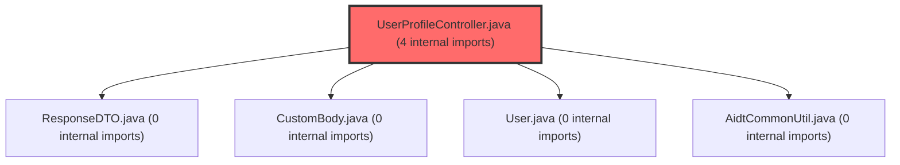

> [!IMPORTANT]
> **⚠️ 수동 검토 권장 (자가힐링 주의)**
>
> AI 자가힐링 결과물이 실제 의도와 다를 수 있으므로, **상세 리뷰 내용에 기반한 수동 점검**을 우선해 주시기 바랍니다. 자가힐링 기능을 활용하실 경우 최종 결과물을 신중하게 확인해 주세요.

# 코드 리뷰 - 8de5e908

## 코드 복잡도 분석

**분석된 파일**: 10개 / 변경된 파일: 12개


### Import 의존관계 다이어그램



**범례**: 중심 파일 (변경됨) | 많은 import (10개 이상)


### 정상 범위 (NONE)


**`filemapper.xml`** (other)

- 평균 복잡도: **0.244**

- 최대 복잡도: 0.475

- 청크 수: 2개

- 평균 사용처: 7.0곳


**권장사항:**

- 복잡도 정상 범위


**`dgnssmapper.xml`** (other)

- 평균 복잡도: **0.243**

- 최대 복잡도: 0.474

- 청크 수: 2개

- 평균 사용처: 7.0곳


**권장사항:**

- 복잡도 정상 범위


**`dgnsscontroller.java`** (other)

- 평균 복잡도: **0.227**

- 최대 복잡도: 0.470

- 청크 수: 23개

- 평균 사용처: 28.1곳


**권장사항:**

- 파일 크기가 큼 (23개 청크) - 파일 분리 검토


**`securityconfig.java`** (config)

- 평균 복잡도: **0.175**

- 최대 복잡도: 0.464

- 청크 수: 16개

- 평균 사용처: 19.6곳


**권장사항:**

- Config 파일은 높은 연결도가 정상적임


**`apiresponseaspect.java`** (other)

- 평균 복잡도: **0.159**

- 최대 복잡도: 0.467

- 청크 수: 3개

- 평균 사용처: 19.7곳


**권장사항:**

- 복잡도 정상 범위


**`fileservice.java`** (other)

- 평균 복잡도: **0.147**

- 최대 복잡도: 0.468

- 청크 수: 13개

- 평균 사용처: 27.0곳


**권장사항:**

- 복잡도 정상 범위


**`globalexceptionhandler.java`** (config)

- 평균 복잡도: **0.140**

- 최대 복잡도: 0.466

- 청크 수: 17개

- 평균 사용처: 14.8곳


**권장사항:**

- Config 파일은 높은 연결도가 정상적임


**`userprofilecontroller.java`** (other)

- 평균 복잡도: **0.011**

- 최대 복잡도: 0.011

- 청크 수: 1개


**권장사항:**

- 복잡도 정상 범위


**`mdcloggingfilter.java`** (config)

- 평균 복잡도: **0.005**

- 최대 복잡도: 0.008

- 청크 수: 2개


**권장사항:**

- Config 파일은 높은 연결도가 정상적임


**`spusermappingfilter.java`** (config)

- 평균 복잡도: **0.004**

- 최대 복잡도: 0.004

- 청크 수: 1개


**권장사항:**

- Config 파일은 높은 연결도가 정상적임


---


## 변경 배경

이 커밋은 학습심리정서검사(DGNSS) PDF 일괄 다운로드 기능에 **상세 보고서 + 요약 보고서 동시 다운로드(type=3)**를 지원하고, 전반적인 **로깅 인프라(MDC 기반 요청 추적, access log, 4xx 예외 분리)**를 개선하며, **DB 스키마 마이그레이션(tc_cla_mb_info → group_info/group_member)**에 따른 권한 체계를 함께 반영한 종합 작업입니다.

- **목적**: PDF 일괄 다운로드 기능 확장(type=3), 운영 모니터링 체계 고도화(MDC 로깅, access log, 4xx 예외 핸들러), DB 스키마 변경 대응
- **도메인**: API(Controller/Service), 인프라(로깅/예외처리/보안), DB(SQL 마이그레이션)
- **변경 방향**: 기존 단순 기능 중심에서 **운영 가시성(observability)**과 **보안(Path Traversal 방어, null 가드)**을 강화하는 방향으로 개선

---

## [GOOD] 잘된 점

**1. MDC 기반 로깅 인프라 구축이 체계적임**

`MdcLoggingFilter` → `SpUserMappingFilter` 순서로 `requestId` → `spUserId` → `userNo`가 단계적으로 MDC에 push되고, `finally`에서 `MDC.clear()`로 스레드 풀 오염을 방지한 설계가 명확합니다. 특히 `SpUserMappingFilter`의 주석에 "매핑 SQL 자체가 userNo를 결정하므로 그 SQL 로그는 본질적으로 userNo가 없는 상태"라고 명시한 점이 운영 경험에서 나온 인사이트입니다.

```java
// MdcLoggingFilter.java - finally에서 MDC.clear()로 스레드 풀 재사용 시 잔재 방지
try {
    MDC.put(MDC_REQUEST_ID, UUID.randomUUID().toString().substring(0, 8));
    String clientIp = resolveClientIp(request);
    MDC.put(MDC_CLIENT_IP, clientIp != null && !clientIp.isBlank() ? clientIp : "-");
    chain.doFilter(request, response);
} finally {
    MDC.clear();  // userNo 포함 모든 키 일괄 제거
}
```

또한 `SecurityConfig`에서 `FilterRegistrationBean.setEnabled(false)`로 자동 등록을 차단하고 Security Chain에서만 등록하는 패턴이 정확합니다. 주석에 "왜 자동 등록을 막는지"에 대한 상세한 설명이 포함되어 있어 의도를 명확히 파악할 수 있습니다.

**2. 4xx 예외를 명시적으로 분리한 GlobalExceptionHandler**

기존에는 모든 예외가 generic `Exception` 핸들러에서 500으로 처리되었으나, `HttpRequestMethodNotSupportedException`, `MissingServletRequestParameterException` 등 5가지 4xx 예외를 구체적으로 핸들링하고 로그 레벨을 `ERROR` → `WARN`으로 낮춘 점이 운영 알람 정확화에 효과적입니다.

```java
// GlobalExceptionHandler.java - 405 예시
@ExceptionHandler(HttpRequestMethodNotSupportedException.class)
public ResponseDTO<CustomBody> handleMethodNotSupported(HttpRequestMethodNotSupportedException e) {
    String supported = e.getSupportedHttpMethods() != null
            ? e.getSupportedHttpMethods().toString() : "";
    String message = String.format("지원하지 않는 요청 방식입니다. (요청: %s, 허용: %s)",
            e.getMethod(), supported);
    log.warn("Method not supported: {}", message);  // ERROR가 아닌 WARN
    ...
}
```

**3. resolveSafePath로 Path Traversal 방어**

`toRealPath()` + `baseDir` 하위 검증 + 심볼릭 링크 차단까지 3중 방어를 적용하여 CSAP(클라우드 보안) 대응을 고려한 점이 좋습니다.

```java
// FileService.java - resolveSafePath 메서드
public Path resolveSafePath(String filePath) throws IOException {
    Path baseDir = Paths.get(nasPath).toAbsolutePath().normalize();
    Path baseReal = baseDir.toRealPath(LinkOption.NOFOLLOW_LINKS);
    Path candidate = Paths.get(filePath).normalize();
    Path resolved;
    if (candidate.isAbsolute()) {
        Path candidateReal = candidate.toRealPath(LinkOption.NOFOLLOW_LINKS);
        if (!candidateReal.startsWith(baseReal)) {
            throw new SecurityException("Absolute path outside of baseDir not allowed");
        }
        resolved = candidateReal;
    } else {
        resolved = baseDir.resolve(candidate).normalize().toRealPath(LinkOption.NOFOLLOW_LINKS);
        if (!resolved.startsWith(baseReal)) {
            throw new SecurityException("Path escapes baseDir");
        }
    }
    if (Files.isSymbolicLink(resolved)) {
        throw new SecurityException("Symbolic link not allowed");
    }
    return resolved;
}
```

**4. UserProfileController.status() null 가드**

로그아웃 직후 FE의 `useProfileCheck` 호출 등 인증이 풀린 상태에서의 요청을 `spUser == null` 체크로 우아하게 처리합니다.

---

## 변경사항 요약

- DGNSS PDF 일괄 다운로드에 `type=3`(상세+요약 동시 ZIP) 지원, ZIP 내부 폴더 구조 및 파일명 규칙 명세화
- MDC 로깅 필터 신규 도입 및 SecurityConfig/SpUserMappingFilter 연동, 로그 패턴에 MDC 변수 추가
- GlobalExceptionHandler에 5종 4xx 예외 핸들러 추가, ApiResponseAspect에 access log 추가
- FileMapper.xml SQL 전면 개편: `tc_cla_mb_info` → `group_info`/`group_member` 기반 권한 체계로 마이그레이션, `userNm` 조회 방식 변경

---

## [ISSUE] 개선이 필요한 부분

### Critical (즉시 수정 필요)

없음

### High (우선 수정 권장)

**1. FileService.dgnssDownloadAll — type=3에서 param 맵에 type 값이 "3"으로 설정된 상태로 각각의 쿼리 호출**

`type=3` 분기에서 `detailFileInfoList`와 `summaryFileInfoList`를 조회할 때 동일한 `param` 맵을 사용합니다. `param`에는 `type=3`이 설정되어 있지만, `selectFileDgnssFileList`와 `selectFileDgnssSummaryList` 쿼리 내부에서는 `type` 파라미터를 사용하지 않으므로 현재는 문제가 없습니다. 그러나 향후 쿼리 수정 시 `type` 값이 의도치 않게 전달될 가능성이 있습니다.

```java
// FileService.java 라인 598-600 (현재 코드)
if (StringUtils.equals(type, "3")) {
    List<Map<String, Object>> detailFileInfoList = fileMapper.selectFileDgnssFileList(param);
    List<Map<String, Object>> summaryFileInfoList = fileMapper.selectFileDgnssSummaryList(param);
```

`param` 맵을 복제하여 각 쿼리 호출 전에 `type` 값을 원래 값으로 복원하는 것이 더 안전합니다.

```java
// 개선 제안
if (StringUtils.equals(type, "3")) {
    Map<String, Object> detailParam = new HashMap<>(param);
    detailParam.put("type", "1");
    Map<String, Object> summaryParam = new HashMap<>(param);
    summaryParam.put("type", "2");
    
    List<Map<String, Object>> detailFileInfoList = fileMapper.selectFileDgnssFileList(detailParam);
    List<Map<String, Object>> summaryFileInfoList = fileMapper.selectFileDgnssSummaryList(summaryParam);
```

**2. FileMapper.xml — selectFileDgnssFileList와 selectFileDgnssSummaryList의 userNm이 COALESCE(gm_st.nickname, tdri.stdt_id)로 fallback**

`userNm` 조회가 기존 `sri.flnm`(학생 실명)에서 `COALESCE(gm_st.nickname, tdri.stdt_id)`로 변경되었습니다. `gm_st`는 `LEFT JOIN group_member`이므로, `group_member` 테이블에 해당 학생이 없으면 `nickname`이 NULL이 되어 `tdri.stdt_id`(학생 ID)가 그대로 사용자명으로 노출됩니다. 이는 PDF 파일명에 학생 ID가 그대로 표시될 수 있음을 의미합니다.

```xml
<!-- FileMapper.xml 라인 57 (현재 코드) -->
, COALESCE(gm_st.nickname, tdri.stdt_id) AS userNm
```

`group_member`에 학생이 없는 경우를 대비한 추가 fallback이 필요합니다.

```xml
<!-- 개선 제안 -->
, COALESCE(gm_st.nickname, tdri.stdt_id, '학생') AS userNm
```

### Medium (개선 권장)

**1. GlobalExceptionHandler — 4xx 핸들러에 @ResponseStatus 누락**

새로 추가된 4xx 핸들러들은 모두 `ResponseDTO<CustomBody>`를 반환하면서 HTTP 상태 코드를 설정하지 않고 있습니다. body의 `resultCode`와 HTTP status가 불일치할 수 있습니다. 예를 들어 `handleMethodNotSupported`는 body에 `code: 405`를 담지만 실제 HTTP 응답 status는 200(기본값)이 됩니다.

```java
// GlobalExceptionHandler.java 라인 107 (현재 코드)
@ExceptionHandler(HttpRequestMethodNotSupportedException.class)
public ResponseDTO<CustomBody> handleMethodNotSupported(HttpRequestMethodNotSupportedException e) {
    ...
    return AidtCommonUtil.makeResultFail(null, errorData, message);
}
```

```java
// 개선 제안
@ExceptionHandler(HttpRequestMethodNotSupportedException.class)
@ResponseStatus(HttpStatus.METHOD_NOT_ALLOWED)
public ResponseDTO<CustomBody> handleMethodNotSupported(HttpRequestMethodNotSupportedException e) {
    ...
    return AidtCommonUtil.makeResultFail(null, errorData, message);
}
```

**2. ApiResponseAspect.logAccess — statusCode가 0으로 초기화되어 로깅됨**

`enrichResponse` 메서드에서 `statusCode`는 `ResponseDTO` + `CustomBody` 타입일 때만 설정되고, 그 외의 경우(예: `ResponseEntity<StreamingResponseBody>` 반환, 예외 발생 등)에는 `0`으로 남아 로그에 `API GET /api/dgnss/dgnss-download-all 0 (123ms)` 형태로 기록됩니다. 특히 `dgnssDownloadAll`은 `ResponseEntity<StreamingResponseBody>`를 반환하므로 항상 `statusCode=0`으로 로깅됩니다.

```java
// ApiResponseAspect.java 라인 47-48 (현재 코드)
int statusCode = 0;
if (result instanceof ResponseDTO<?> responseDTO
        && responseDTO.getBody() instanceof CustomBody oldBody) {
    statusCode = oldBody.resultCode();
    ...
}
```

```java
// 개선 제안
int statusCode = 200;
if (result instanceof ResponseDTO<?> responseDTO
        && responseDTO.getBody() instanceof CustomBody oldBody) {
    statusCode = oldBody.resultCode();
} else if (result instanceof ResponseEntity<?> responseEntity) {
    statusCode = responseEntity.getStatusCodeValue();
}
```

**3. FileMapper.xml — 권한 체크 서브쿼리 중복**

`selectFileDgnssFileList`와 `selectFileDgnssSummaryList`의 권한 체크 서브쿼리가 4중첩 `EXISTS`로 매우 복잡하고, 동일한 권한 로직이 두 쿼리에 중복되어 있습니다. 향후 권한 정책 변경 시 두 군데를 모두 수정해야 합니다. MyBatis `<sql>` fragment로 추출하여 재사용하는 것을 권장합니다.

---

## 주요 파일 분석

### FileService.java
**변경 내용:** `dgnssDownloadAll` 메서드 리팩토링 — `type=3` 지원, 메서드 분리(`addDgnssFilesToZip`, `prepareAndValidateDgnssFileMap`, `buildDgnssZipEntryPath`, `writeDgnssFileToZip`), 로깅 강화

**분석:**
- 기존에는 `type=1`/`type=2`에 따라 각각 `selectFileDgnssFileList`/`selectFileDgnssSummaryList`를 호출하고, 파일 검증 → ZIP 생성 로직이 하나의 메서드에 모두 들어 있었습니다.
- 이제 `addDgnssFilesToZip`으로 분리되어 `type=3`에서 상세+요약을 각각 호출할 수 있게 되었습니다.
- `prepareAndValidateDgnssFileMap`에서 파일 존재 여부, 체크섬, 권한, 개인정보 삭제 여부를 한 번에 검증합니다.
- `buildDgnssZipEntryPath`에서 동명이인 처리를 위해 `usedZipEntries` Set으로 중복을 관리합니다.
- `writeDgnssFileToZip`에서 `resolveSafePath`로 Path Traversal을 방어한 후 파일을 ZIP에写入합니다.

**개선 제안:**
1. `type=3`에서 `param` 맵 재사용 문제 (위 High #1 참조)
2. `buildDgnssZipEntryPath`의 중복 처리 로직이 3단계 fallback으로 복잡하나, `type=3`에서는 폴더 분리로 인해 중복 가능성이 낮아 단순화 가능

### GlobalExceptionHandler.java
**변경 내용:** 5종 4xx 예외 핸들러 추가 (MethodNotSupported, MediaTypeNotSupported, MissingParameter, TypeMismatch, MessageNotReadable)

**분석:**
- 기존에는 `DataIntegrityViolationException`, `AuthFailedException`, `IllegalArgumentException`, `IllegalStateException`, `ClientAbortException`, `IOException`, `Exception`만 처리했습니다.
- 이제 Spring Web 표준 4xx 예외 5종이 추가되어, 클라이언트의 잘못된 호출에 대해 명확한 메시지를 반환할 수 있게 되었습니다.
- 로그 레벨을 `ERROR` → `WARN`으로 낮춰 운영 알람 정확화를 도모했습니다.

**개선 제안:**
1. `@ResponseStatus` 누락으로 HTTP status가 200으로 내려감 (위 Medium #1 참조)

### FileMapper.xml
**변경 내용:** `selectFileDgnssFileList`, `selectFileDgnssSummaryList`, `selectTcDgnssInfoWithId`, `selectFileInfo`의 권한 체계를 `tc_cla_mb_info` → `group_info`/`group_member`로 전면 마이그레이션, `userNm` 조회 방식 변경

**분석:**
- 기존에는 `tc_cla_mb_info` 테이블로 교사-학생 관계를 관리했으나, 이제 `group_info`(그룹) + `group_member`(그룹원) + `user`(사용자)로 변경되었습니다.
- 권한 체크 로직이 4중첩 `EXISTS` 서브쿼리로 매우 복잡해졌습니다:
  1. 요청자가 교사이고 생성자가 같은 클래스의 교사/학생인 경우
  2. 요청자가 학생이고 생성자가 같은 클래스의 교사인 경우
  3. 요청자와 생성자가 동일인인 경우
- `userNm`이 `sri.flnm`(학생 실명) → `COALESCE(gm_st.nickname, tdri.stdt_id)`로 변경되어, `group_member`에 없는 학생의 ID가 그대로 노출될 가능성이 있습니다.
- `selectTcDgnssInfoWithId`에서 `claNm`이 `tci.cla_nm` → `gi.group_nm`으로 변경되었습니다.

**개선 제안:**
1. `userNm` fallback이 `tdri.stdt_id`로 되어 있어 학생 ID 노출 가능성 (위 High #2 참조)
2. 동일한 권한 로직이 4개 쿼리(`selectFileDgnssFileList`, `selectFileDgnssSummaryList`, `selectFileInfo`, `selectFileInfo`의 다른 분기)에 중복되어 있어, MyBatis `<sql>` fragment 추출 권장

### MdcLoggingFilter.java (신규)
**변경 내용:** HTTP 요청 진입 시 MDC에 `requestId`, `clientIp`를 push하는 필터

**분석:**
- `OncePerRequestFilter`를 상속하여 모든 요청에 대해 한 번만 실행됩니다.
- `requestId`는 `UUID.randomUUID().toString().substring(0, 8)`로 8자리 생성 — 충돌 가능성이 낮고 가독성이 좋습니다.
- `clientIp`는 `X-Forwarded-For` 헤더 우선, 없으면 `RemoteAddr`를 사용합니다.
- `finally`에서 `MDC.clear()`로 스레드 풀 재사용 시 잔재를 방지합니다.
- `userNo`는 `SpUserMappingFilter`에서 별도로 push하도록 설계되어 있어, 매핑 SQL 로그에는 `userNo`가 없는 상태가 자연스럽습니다.

**개선 제안:** 특별한 이슈 없음. 설계가 명확하고 주석이 상세하여 유지보수에 용이합니다.

### SecurityConfig.java
**변경 내용:** `MdcLoggingFilter`와 `SpUserMappingFilter`의 `FilterRegistrationBean` 자동 등록 차단, API Security Chain에 필터 순서 명시적 지정

**분석:**
- `@Component`로 등록된 Filter 빈은 Spring Boot가 자동으로 servlet chain에 추가하는데, 이렇게 되면 `MdcLoggingFilter`가 `SpUserMappingFilter`보다 먼저 실행되어 `USER_NO` request attribute가 아직 안 박힌 상태로 MDC.put이 호출됩니다.
- `FilterRegistrationBean.setEnabled(false)`로 자동 등록을 차단하고, `ApiSecurityConfig.configure()`에서 `addFilterBefore`/`addFilterAfter`로 명시적으로 순서를 지정합니다.
- 필터 순서: `MdcLoggingFilter` → `BearerTokenAuthenticationFilter` → `SpUserMappingFilter`

**개선 제안:** 특별한 이슈 없음. 필터 체인 순서 설계가 정확하고 주석이 상세합니다.

---

## 최종 평가

**결론**: 
- [ ] [OK] **승인 (Approved)** - Critical/High 이슈 없음
- [ ] [WARN] **조건부 승인 (Approved with Comments)** - Medium 이하 이슈만 존재
- [x] [FIX] **수정 필요 (Changes Requested)** - Critical/High 이슈 존재

**종합 의견:**

전반적으로 **운영 가시성(observability)과 보안을 크게 개선한 좋은 커밋**입니다. MDC 로깅 인프라, 4xx 예외 분리, Path Traversal 방어 등 실무 운영 경험이 녹아든 설계가 돋보입니다. 특히 `MdcLoggingFilter` → `SpUserMappingFilter`의 단계적 MDC push 설계와 `FilterRegistrationBean`으로 자동 등록을 차단하는 패턴은 매우 정교합니다.

다만 **두 가지 High 이슈**는 머지 전에 검토가 필요합니다:

1. **`FileService.dgnssDownloadAll`의 `type=3` 분기에서 `param` 맵 재사용 문제**: 현재는 쿼리가 `type`을 사용하지 않아 문제가 없지만, 향후 쿼리 수정 시 `type=3`이 의도치 않게 전달될 위험이 있습니다. `param` 맵을 복제하여 각 쿼리에 적절한 `type` 값을 전달하는 것이 안전합니다.

2. **`FileMapper.xml`의 `userNm` fallback이 학생 ID를 노출할 가능성**: `COALESCE(gm_st.nickname, tdri.stdt_id)`에서 `group_member`에 없는 학생의 경우 `tdri.stdt_id`(학생 ID)가 PDF 파일명에 그대로 표시됩니다. 개인정보 측면에서 민감한 이슈이므로, 최소한 `'학생'`과 같은 기본값으로 fallback하거나 `INNER JOIN`으로 변경하여 데이터 정합성을 강화하는 것이 좋습니다.

이 두 가지만 보완되면 충분히 승인 가능한 수준의 퀄리티입니다.