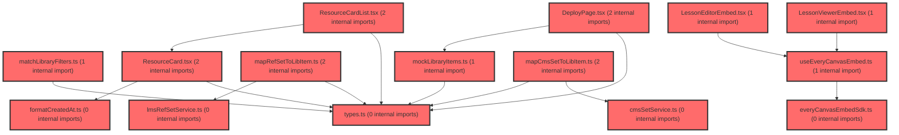

> [!IMPORTANT]
> **⚠️ 수동 검토 권장 (자가힐링 주의)**
>
> AI 자가힐링 결과물이 실제 의도와 다를 수 있으므로, **상세 리뷰 내용에 기반한 수동 점검**을 우선해 주시기 바랍니다. 자가힐링 기능을 활용하실 경우 최종 결과물을 신중하게 확인해 주세요.

# 코드 리뷰 - 8ebb428a

## 코드 복잡도 분석

**분석된 파일**: 21개 / 변경된 파일: 23개


### Import 의존관계 다이어그램



**범례**: 중심 파일 (변경됨) | 많은 import (10개 이상)


### 정상 범위 (NONE)


**`button.tsx`** (other)

- 평균 복잡도: **0.234**

- 최대 복잡도: 0.472

- 청크 수: 20개

- 평균 사용처: 18.1곳


**권장사항:**

- 복잡도 정상 범위


**`routes.tsx`** (other)

- 평균 복잡도: **0.059**

- 최대 복잡도: 0.463

- 청크 수: 21개

- 평균 사용처: 2.7곳


**권장사항:**

- 파일 크기가 큼 (21개 청크) - 파일 분리 검토


**`lessonviewerembed.tsx`** (component)

- 평균 복잡도: **0.003**

- 최대 복잡도: 0.015

- 청크 수: 12개


**권장사항:**

- 복잡도 정상 범위


**`cmssetservice.ts`** (other)

- 평균 복잡도: **0.002**

- 최대 복잡도: 0.005

- 청크 수: 5개


**권장사항:**

- 복잡도 정상 범위


**`lmsrefsetservice.ts`** (other)

- 평균 복잡도: **0.002**

- 최대 복잡도: 0.003

- 청크 수: 12개


**권장사항:**

- 복잡도 정상 범위


**`everycanvasembedsdk.ts`** (utility)

- 평균 복잡도: **0.002**

- 최대 복잡도: 0.005

- 청크 수: 13개


**권장사항:**

- 복잡도 정상 범위


**`formatcreatedat.ts`** (utility)

- 평균 복잡도: **0.002**

- 최대 복잡도: 0.002

- 청크 수: 2개


**권장사항:**

- 복잡도 정상 범위


**`mapcmssettolibitem.ts`** (utility)

- 평균 복잡도: **0.002**

- 최대 복잡도: 0.005

- 청크 수: 6개


**권장사항:**

- 복잡도 정상 범위


**`maprefsettolibitem.ts`** (utility)

- 평균 복잡도: **0.002**

- 최대 복잡도: 0.004

- 청크 수: 6개


**권장사항:**

- 복잡도 정상 범위


**`matchlibraryfilters.ts`** (utility)

- 평균 복잡도: **0.002**

- 최대 복잡도: 0.006

- 청크 수: 9개


**권장사항:**

- 복잡도 정상 범위


**`types.ts`** (other)

- 평균 복잡도: **0.002**

- 최대 복잡도: 0.008

- 청크 수: 10개


**권장사항:**

- 복잡도 정상 범위


**`lessoneditorpage.tsx`** (component)

- 평균 복잡도: **0.002**

- 최대 복잡도: 0.007

- 청크 수: 7개


**권장사항:**

- 복잡도 정상 범위


**`index.ts`** (other)

- 평균 복잡도: **0.001**

- 최대 복잡도: 0.005

- 청크 수: 20개


**권장사항:**

- 복잡도 정상 범위


**`useeverycanvasembed.ts`** (utility)

- 평균 복잡도: **0.001**

- 최대 복잡도: 0.003

- 청크 수: 11개


**권장사항:**

- 복잡도 정상 범위


**`lessoneditorembed.tsx`** (other)

- 평균 복잡도: **0.001**

- 최대 복잡도: 0.005

- 청크 수: 11개


**권장사항:**

- 복잡도 정상 범위


**`mocklibraryitems.ts`** (utility)

- 평균 복잡도: **0.000**

- 최대 복잡도: 0.000

- 청크 수: 1개


**권장사항:**

- 복잡도 정상 범위


**`deploypage.tsx`** (component)

- 평균 복잡도: **0.000**

- 최대 복잡도: 0.005

- 청크 수: 178개


**권장사항:**

- 파일 크기가 큼 (178개 청크) - 파일 분리 검토


**`resourcecard.tsx`** (other)

- 평균 복잡도: **0.000**

- 최대 복잡도: 0.000

- 청크 수: 18개


**권장사항:**

- 복잡도 정상 범위


**`resourcecardlist.tsx`** (other)

- 평균 복잡도: **0.000**

- 최대 복잡도: 0.000

- 청크 수: 24개


**권장사항:**

- 파일 크기가 큼 (24개 청크) - 파일 분리 검토


**`lessonmypage.tsx`** (component)

- 평균 복잡도: **0.000**

- 최대 복잡도: 0.007

- 청크 수: 21개


**권장사항:**

- 파일 크기가 큼 (21개 청크) - 파일 분리 검토


**`lessonlibrarycontents.tsx`** (utility)

- 평균 복잡도: **0.000**

- 최대 복잡도: 0.004

- 청크 수: 10개


**권장사항:**

- 복잡도 정상 범위


---


## 변경 배경

이 커밋은 **LMS `ref-set` API와 CMS `sets` API의 실측 응답 계약을 코드와 문서에 반영**하는 작업입니다. LMS가 `title`/`subjectCd`/`schoolLevelCd` 컬럼을 제공하지 않고 `options`(store-and-echo)만 반환한다는 사실이 확인되어, 카드 메타데이터를 `options`에 담는 계약으로 전환했습니다. 또한 CMS `GET /api/sets` 응답이 배열이 아닌 페이지 객체(`{ list, pageNo, pageSize, totalCount }`)임을 실측 반영했습니다.

- **목적**: LMS/CMS 실측 API 계약에 맞춰 DTO·매퍼·라우트를 정합화하고, SDK 1.5.0(`openSet`) 마이그레이션 계획을 문서화
- **도메인**: API 연동 (LMS/CMS), 비즈니스 로직, 라우팅
- **변경 방향**: 참조-only LMS 계약에 맞춰 `options` store-and-echo 방식으로 전환, CMS 페이지네이션 응답 파싱, Editor 라우트 파라미터를 `slideId`→`setId`로 의미 정정

---

## [GOOD] 잘된 점

1. **실측 기반 계약 반영**: 문서와 코드가 실제 API 응답(2026-08-14 실측)에 맞춰 정확히 갱신되어, 추측성 DTO가 제거되었습니다. 특히 `CmsSetMeta`/`metas` 필드가 실제 응답에 없다는 것을 확인하고 제거한 점이 좋습니다.
2. **`options` 계약 명확화**: `RefSetOptions`(`title` 필수, `thumbnailUrl` 선택)를 타입으로 고정하고 GET/POST 양쪽에 일관 적용했습니다. `lmsRefSetService.ts`에서 `RefSetItem`과 `RegisterRefSetBody` 모두에 동일한 계약을 적용한 점이 일관적입니다.
3. **마이그레이션 체크리스트 분리**: SDK 1.5.0(`openSet`) 변경을 문서에만 반영하고 코드는 구계약 유지 — 당장 코드를 건드리지 않아 리스크를 낮췄습니다. `lesson-everycanvas-lms-integration.plan.md`의 §4.3.7 체크리스트가 명확합니다.
4. **라우트 파라미터 의미 정정**: `/lesson/editor/:slideId` → `:setId`로 명칭을 실제 의미(CBS setId)에 맞게 수정했습니다.

---

## 변경사항 요약

LMS `ref-set`의 `title`/`subjectCd`/`schoolLevelCd` 컬럼을 제거하고 `options`(store-and-echo) 계약으로 전환했으며, CMS `sets` 응답을 페이지 객체로 파싱하도록 DTO·매퍼·쿼리를 갱신했습니다. Editor 라우트 파라미터를 `setId`로 정정하고, SDK 1.5.0 마이그레이션 계획을 문서화했습니다.

---

## [ISSUE] 개선이 필요한 부분

### Critical (즉시 수정 필요)

없음

### High (우선 수정 권장)

**`LessonEditorPage`의 `onSaved` navigate 로직이 `setId` 파라미터와 충돌 가능**

`handleSaved`에서 `!setId && p.lcmsSetId`일 때 `/lesson/editor/${p.lcmsSetId}`로 replace 이동하는데, 이제 라우트 파라미터가 `setId`로 바뀌었으므로 이동 후 `openSet` prop으로 전달됩니다. 다만 `p.slideId` 분기(`/lesson/editor/${p.slideId}`)는 여전히 남아 있어, `lcmsSetId`가 없고 `slideId`만 있는 경우 `setId` 자리에 Platform slideId가 들어가 `openSet`에 잘못 전달될 수 있습니다. 이는 SDK 1.5.0에서 `slideId`가 Editor에서 폐기된 것과 상충됩니다.

```tsx
// LessonEditorPage.tsx 라인 25-27
} else if (!setId && p.slideId) {
  navigate(`/lesson/editor/${p.slideId}`, { replace: true });
}
```

### Medium (개선 권장)

1. **`mapRefSetToLibItem`의 `title` fallback이 빈 문자열**
   - `item.options?.title ?? ''`로 빈 문자열이 되면 카드 제목이 공백으로 렌더됩니다. `options`가 null인 레거시 데이터 대비 fallback 제목(예: `lcmsSetId`)을 고려할 수 있습니다.

2. **`useRegisterRefSetMutation`의 중복 방지가 cache 의존**
   - `getQueryData`로 cache에 없으면 skip하지 않고 POST를 보냅니다. cache miss(예: 페이지 첫 진입) 시 중복 POST가 발생할 수 있어, 문서에도 명시된 "LMS 중복 허용 여부 확인"이 여전히 미해결 상태입니다.

3. **`mapCmsSetToLibItem`의 `selArea: undefined`**
   - `LibItem.selArea`가 선택 필드가 되었으므로 `undefined` 명시 대신 필드 자체를 생략하는 편이 더 깔끔합니다(동작은 동일).

---

## 주요 파일 분석

### `frontend/src/features/lesson/api/cmsSetService.ts`

**변경 내용:** `getCmsSetList` 반환 타입을 `CmsSetItem[]` → `CmsSetListData`(페이지 객체)로 변경하고 `CmsSetMeta`/`metas` 제거.

**개선 제안:**

1. 응답 파싱 시 런타임 검증 부재
   - **위치 (라인 69)**: `return (await res.json()) as CmsSetListData;`
   - **기존 코드**:
   ```ts
   return (await res.json()) as CmsSetListData;
   ```
   - **해결 방안 (수정 코드)**: 실측 계약이지만 `list`가 배열인지 최소 검증하면 잘못된 응답 시 조용히 `undefined`로 넘어가는 것을 방지할 수 있습니다.
   ```ts
   const data = (await res.json()) as CmsSetListData;
   if (!Array.isArray(data.list)) {
     throw new Error('CMS sets 응답 형식 오류: list가 배열이 아님');
   }
   return data;
   ```
   > `read_file`로 `cmsSetService.ts` 전체(70줄)를 확인했고, `getCmsSetList` 함수의 반환부만 변경하므로 호출부(`queries.ts`의 `useCmsSetListQuery`)에 부작용이 없음을 확인했습니다.

### `frontend/src/features/lesson/api/lmsRefSetService.ts`

**변경 내용:** `RefSetOptions` 계약 추가, `RefSetItem`/`RegisterRefSetBody`에서 `title`/`subjectCd`/`schoolLevelCd` 제거.

**개선 제안:**

1. `options`가 null인 레거시 데이터 대응
   - **위치 (라인 22)**: `options: RefSetOptions | null;`
   - null 허용은 실측 계약에 맞지만, 소비처(`mapRefSetToLibItem`)에서 `?? ''`로 처리하므로 타입을 `RefSetOptions`로 좁히고 매퍼에서 기본값을 주는 방식도 고려할 수 있습니다. 다만 null 가능성이 실측으로 확인됐다면 현재 유지가 안전합니다. **[수정 코드 제시 불가 — 실측 null 여부에 따라 설계가 달라져 문맥 파악 불충분]**

### `frontend/src/pages/lesson/LessonEditorPage.tsx`

**변경 내용:** `onSaved`에서 `options: { title, thumbnailUrl? }` POST, 라우트 파라미터 `setId` 사용.

**개선 제안:**

1. `p.slideId` 분기 제거 검토
   - **위치 (라인 25-27)**: `else if (!setId && p.slideId) { navigate(...) }`
   - **기존 코드**:
   ```tsx
   } else if (!setId && p.slideId) {
     navigate(`/lesson/editor/${p.slideId}`, { replace: true });
   }
   ```
   - **해결 방안 (수정 코드)**: SDK 1.5.0에서 Editor의 `slideId`가 폐기되었으므로, `lcmsSetId`가 없을 때 `slideId`로 navigate하는 분기는 `setId`(openSet)에 잘못된 값을 주입할 수 있습니다. `lcmsSetId` 기반 분기만 남기고 `slideId` 분기를 제거하는 것을 권장합니다.
   ```tsx
   if (!setId && p.lcmsSetId) {
     navigate(`/lesson/editor/${p.lcmsSetId}`, { replace: true });
   }
   ```
   > `read_file`로 `LessonEditorPage.tsx` 전체(56줄)를 확인했고, `handleSaved` 내 분기만 정리하므로 다른 로직에 부작용이 없음을 확인했습니다. 다만 `p.slideId`가 여전히 필요한지(구계약 하위호환)는 팀 협의가 필요해, 제거 여부는 확정 전 확인을 권장합니다.

---

## 최종 평가

**결론**:
- [ ] [OK] **승인 (Approved)** - Critical/High 이슈 없음
- [x] [WARN] **조건부 승인 (Approved with Comments)** - Medium 이하 이슈만 존재
- [ ] [FIX] **수정 필요 (Changes Requested)** - Critical/High 이슈 존재

**종합 의견:**

실측 API 계약을 정확히 반영하고 SDK 1.5.0 마이그레이션을 문서로 안전하게 분리한 좋은 커밋입니다. `LessonEditorPage`의 `slideId` navigate 분기와 cache 의존 중복 방지 정도만 마이그레이션 시점에 함께 정리하면 됩니다. 전반적으로 실무에서 통용 가능한 수준으로 승인 가능합니다.