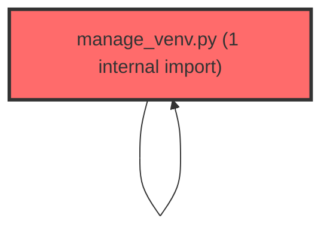

> [!IMPORTANT]
> **⚠️ 수동 검토 권장 (자가힐링 주의)**
>
> AI 자가힐링 결과물이 실제 의도와 다를 수 있으므로, **상세 리뷰 내용에 기반한 수동 점검**을 우선해 주시기 바랍니다. 자가힐링 기능을 활용하실 경우 최종 결과물을 신중하게 확인해 주세요.

# 코드 리뷰 - 8f5ab0f1

## 코드 복잡도 분석

**분석된 파일**: 3개 / 변경된 파일: 6개


### Import 의존관계 다이어그램



**범례**: 중심 파일 (변경됨) | 많은 import (10개 이상)


### 정상 범위 (NONE)


**`manage_venv.py`** (other)

- 평균 복잡도: **0.241**

- 최대 복잡도: 0.474

- 청크 수: 2개

- 평균 사용처: 6.5곳


**권장사항:**

- 복잡도 정상 범위


**`llm_router.py`** (other)

- 평균 복잡도: **0.238**

- 최대 복잡도: 0.469

- 청크 수: 2개

- 평균 사용처: 9.0곳


**권장사항:**

- 복잡도 정상 범위


**`agent_service.py`** (other)

- 평균 복잡도: **0.157**

- 최대 복잡도: 0.464

- 청크 수: 9개

- 평균 사용처: 6.2곳


**권장사항:**

- 복잡도 정상 범위


---


## 변경 배경

이 커밋은 AI 에이전트의 LangSmith 트레이싱 방식을 근본적으로 개선하고, 로컬 HTTPS 개발 환경을 구축하기 위한 변경입니다.

- **목적**: (1) LangSmith Run 중복 기록 문제 해결 -- LiteLLM success_callback과 `@traceable` 데코레이터가 동시에 활성화되어 동일 LLM 호출이 중복 기록되던 문제를 수정하고, (2) 로컬 개발 환경에서 실서버 도메인으로 HTTPS 접속을 가능하게 하는 Caddy 리버스 프록시 인프라 추가
- **도메인**: API (AI Agent 서비스 로직), 인프라 (로컬 HTTPS 개발 환경)
- **변경 방향**: 수동 `langsmith.trace()` context manager + `parent_run_id` 메타데이터 전달 방식에서 `@traceable` 데코레이터 기반의 ContextVar 자동 연결 방식으로 전환하여 코드 복잡도를 낮추고, 로컬 개발 생산성을 높이기 위한 HTTPS 인프라 추가

## [GOOD] 잘된 점

**LangSmith 중복 기록 문제 인지 및 해결 방향**

`llm_router.py`에서 LiteLLM success_callback="langsmith"를 제거하고 `@traceable` 데코레이터로 일원화한 결정은 정확합니다. LangSmith 공식 문서에서도 두 방식을 동시에 사용하지 말 것을 권고하며, 이로 인한 중복 Run 생성 문제를 사전에 차단했습니다. 기존 코드는 `llm_router.py`에서 LiteLLM 레벨의 LangSmith 콜백을 등록하고, 동시에 `agent_service.py`에서 `langsmith.trace()` context manager로 수동 트레이싱을 수행하여 동일 LLM 호출이 LangSmith에 두 번 기록되는 문제가 있었습니다. 이 커밋은 이 문제를 명확히 인지하고 해결했습니다.

**`@traceable` 데코레이터 도입으로 코드 단순화**

기존에는 `_invoke_tool_with_tracing`에서 수동으로 `langsmith.trace()` context manager를 생성하고, `parent_run_id`를 LiteLLM metadata로 전달하는 복잡한 구조였습니다. 구체적으로 살펴보면:

- 기존 코드: `_invoke_tool_with_tracing` 메서드가 `run_tree` 파라미터를 받아 수동으로 자식 Run을 생성하고, `child_ctx.__enter__()` / `child_ctx.__exit__()`를 직접 호출하며, 성공/실패 여부를 수동으로 `child_run.end()`에 전달
- `run_agent`의 while 루프에서 `router.acompletion()` 호출 시 `metadata`에 `parent_run_id`와 `trace_id`를 수동으로 주입 (`_ls_meta` 딕셔너리)
- 변경 후: `@traceable(run_type="llm")`과 `@traceable(run_type="tool")` 데코레이터가 LangSmith ContextVar를 통해 자동으로 부모-자식 관계를 연결

이로 인해 `_ls_meta` 딕셔너리, `run_tree` 파라미터 전달 로직, 수동 context manager 생명주기 관리 코드가 모두 제거되었습니다. 이는 유지보수성을 크게 향상시킵니다.

**로컬 HTTPS 개발 환경 구축**

`setup-local-https.sh` 스크립트와 `Caddyfile.local`을 통해 `/chat/stream` 경로만 로컬 에이전트로 라우팅하고 나머지는 실서버로 투명 전달하는 구조는 실용적입니다. 개발자가 실서버 도메인(`t-meta-agent-api.vsaidt.com`)으로 로컬에서 개발 중인 SSE 스트리밍만 테스트할 수 있어 생산성이 높아집니다. 특히 `manage_venv.py`에서 `LOCAL_HTTPS=true` 환경변수로 Caddy 프로세스를 자동 실행/종료하는 구조는 개발자 경험을 고려한 설계입니다.

## 변경사항 요약

5개 파일 변경:
1. `agent/app/services/agent_service.py` -- LangSmith 트레이싱을 `@traceable` 데코레이터 기반으로 전환하고 `_invoke_tool_with_tracing` 리팩토링, LangSmith inputs/outputs 구조 개선
2. `agent/app/core/llm_router.py` -- 중복 LangSmith 콜백 제거 (success_callback/failure_callback)
3. `agent/manage_venv.py` -- `LOCAL_HTTPS` 환경변수 지원 및 Caddy 프로세스 생명주기 관리 추가
4. `agent/scripts/setup-local-https.sh` -- 로컬 HTTPS 셋업 자동화 스크립트 신규 (mkcert + Caddy + /etc/hosts)
5. `package.json` / `.gitignore` -- `agent:local` 스크립트 추가, 인증서 디렉토리 gitignore 등록

---

## [ISSUE] 개선이 필요한 부분

### Critical (즉시 수정 필요)

없음

### High (우선 수정 권장)

**1. `_invoke_tool_with_tracing`에서 예외 발생 시 LangSmith 실패 기록이 동작하지 않음**

`_invoke_tool_with_tracing` 메서드는 Tool 미존재 시 `ValueError`를 raise하도록 변경되었습니다. 메서드 문서화에도 다음과 같이 명시되어 있습니다:

```python
@traceable(run_type="tool")
async def _invoke_tool_with_tracing(self, func_name: str, arguments: dict) -> str:
    """
    ...
    Tool 미존재 또는 실행 오류 시 예외를 그대로 raise하여 @traceable이
    LangSmith에 실패 Run으로 기록할 수 있도록 한다.
    """
    if func_name not in self.tool_map:
        raise ValueError(f"Tool '{func_name}' not found")
```

그러나 `run_agent`의 호출부(라인 244-248)와 `run_agent_stream`의 호출부(라인 400-404)는 모두 `try/except Exception`으로 이 예외를 캐치하여 `result_str = json.dumps({"error": str(e)})`로 변환하고 있습니다:

```python
# run_agent, 라인 244-248
try:
    arguments = json.loads(tool_call.function.arguments)
    arguments = self._normalize_tool_args(func_name, arguments)
    result_str = await self._invoke_tool_with_tracing(func_name, arguments)
except Exception as e:
    logger.error(f"Tool error ({func_name}): {e}", exc_info=True)
    result_str = json.dumps({"error": str(e)})
```

**문제점**: `@traceable(run_type="tool")` 데코레이터가 예외를 감지하여 LangSmith에 실패 Run을 기록하려면, 예외가 데코레이터까지 전파되어야 합니다. 하지만 호출부에서 `except Exception`으로 캐치해버리면 `@traceable` 데코레이터는 해당 함수 호출이 정상 완료된 것으로 인식하고 `outputs`만 기록합니다. 즉, "예외를 raise하여 LangSmith에 실패 기록"이라는 설계 의도가 실제로는 동작하지 않는 상태입니다.

**해결 방안**: 두 가지 선택지가 있습니다.

(a) `@traceable`이 예외를 감지하도록 하려면 호출부에서 예외를 캐치하지 않고 그대로 전파한 후, 상위 루프 레벨에서 처리하는 구조로 변경해야 합니다. 하지만 이 경우 Tool 호출 실패 시에도 LLM이 다음 턴에 대응할 수 있도록 에러 메시지를 messages에 추가해야 하는 현재의 비즈니스 로직 흐름이 깨집니다.

(b) 현재처럼 `except`로 처리하되, `_invoke_tool_with_tracing`의 문서화를 현실에 맞게 수정하고 `@traceable`의 실패 기록을 포기합니다. 이 경우 Tool 실행 중 발생한 예외(예: Neo4j 연결 오류)도 LangSmith에는 정상 완료로 기록되므로, 디버깅 시 주의가 필요합니다.

**권장**: 현재 구조에서는 (b)가 더 현실적입니다. `run_agent`의 while 루프 내에서 Tool 호출 실패 시에도 에러 메시지를 messages에 추가하여 LLM이 다음 턴에 대응할 수 있어야 하므로, 예외를 전파하면 이 흐름이 깨집니다. 다만, 이 결정의 트레이드오프(Tool 실패가 LangSmith에 정상으로 기록됨)를 문서화하고, 필요시 LangSmith의 `@traceable`보다는 `langsmith.trace()` context manager를 사용한 수동 실패 기록을 고려할 수 있습니다.

**[수정 코드 제시 불가 -- 문맥 파악 불충분]**: `@traceable` 데코레이터가 예외를 감지했을 때와 감지하지 못했을 때의 LangSmith 대시보드상 실제 차이를 현재 코드베이스 분석만으로는 확인할 수 없습니다. LangSmith SDK 버전에 따라 `@traceable`의 예외 처리 동작이 다를 수 있으며, 실제로 예외가 캐치된 후에도 데코레이터가 이를 감지하는 방식이 SDK 내부에서 구현되어 있을 가능성도 있습니다. 따라서 구체적인 수정 방향은 실제 LangSmith 대시보드에서 Tool 호출의 Run 상태를 확인한 후 결정해야 합니다.

### Medium (개선 권장)

**1. `run_agent_stream`의 `history` 저장 로직 분산**

`run_agent_stream`은 generator(async generator)입니다. `history.add_user_message(text)`와 `history.add_ai_message(...)`가 다음과 같이 여러 분기에서 각각 호출되고 있습니다:

- 정상 완료 시 (라인 379-380): `history.add_user_message(text)` / `history.add_ai_message(final_content)`
- max_iterations 도달 시 (라인 423-424): `history.add_user_message(text)` / `history.add_ai_message(max_iter_message)`
- 각 예외 핸들러 (라인 432-434, 439-441, 446-448, 453-455): 각각 `history.add_user_message(text)` / `history.add_ai_message(msg)`

반면 `run_agent`(non-stream)는 `finally` 블록에서 한 번에 처리합니다:

```python
# run_agent, 라인 282-283
history.add_user_message(text)
history.add_ai_message(answer)
```

현재는 각 분기가 상호 배타적이므로 중복 호출은 발생하지 않지만, 향후 리팩토링 시 실수로 중복 호출될 위험이 있습니다. `run_agent`처럼 `finally` 블록에서 `history` 저장을 한 번만 수행하도록 통일하는 것이 더 안전한 패턴입니다. 단, 이는 현재 동작에 버그가 있는 것은 아니므로 Medium 수준의 제안입니다.

---

## 주요 파일 분석

### `agent/app/services/agent_service.py`

**변경 내용:**
LangSmith 트레이싱 방식을 수동 context manager + metadata 전달에서 `@traceable` 데코레이터 기반으로 전환하고, `_invoke_tool_with_tracing`의 인터페이스를 단순화했습니다. 또한 `run_agent`와 `run_agent_stream`의 LangSmith inputs/outputs 구조를 개선하여 `text` 단일 문자열 대신 `messages` 배열을 직접 기록하도록 변경했습니다.

**구체적인 변경 포인트:**
1. `_invoke_tool_with_tracing`에서 `run_tree` 파라미터 제거, `@traceable(run_type="tool")` 데코레이터로 대체
2. 신규 `_call_llm_once` 메서드 추가 (`@traceable(run_type="llm", name="LiteLLM")`)
3. `run_agent`의 while 루프에서 `router.acompletion()` 직접 호출 대신 `_call_llm_once()` 호출로 변경
4. `_ls_meta` 딕셔너리 및 `parent_run_id` / `trace_id` 수동 전달 로직 제거
5. LangSmith inputs를 `{"text": text, "session_id": session_id}`에서 `{"messages": list(messages)}`로 변경
6. LangSmith outputs를 `{"response": answer}`에서 `{"messages": messages[_initial_msg_len:], "response": answer}`로 변경 (에이전트가 추가한 메시지만 슬라이싱)
7. `run_agent_stream`에서 최종 AI 응답을 `messages`에 추가하는 로직 추가 (라인 380, 423)

**개선 제안:**
1. `_invoke_tool_with_tracing`의 예외 처리 정책 문서화와 실제 동작 간 불일치 (위 High #1 참조)
2. `run_agent_stream`의 `history` 저장 로직을 `finally` 블록으로 통일하는 리팩토링 고려 (Medium #1 참조)

### `agent/app/core/llm_router.py`

**변경 내용:**
LangSmith success_callback/failure_callback 등록 코드를 제거하고, `agent_service.py`의 `@traceable` 데코레이터가 트레이싱을 전담하도록 변경했습니다. 제거된 코드는 다음과 같습니다:

```python
# 제거된 코드 (llm_router.py)
_langsmith_tracing = os.getenv("LANGSMITH_TRACING", "false").lower() == "true"
_langsmith_api_key = os.getenv("LANGSMITH_API_KEY", "").strip()

if _langsmith_tracing and _langsmith_api_key:
    if "langsmith" not in litellm.success_callback:
        litellm.success_callback.append("langsmith")
    if "langsmith" not in litellm.failure_callback:
        litellm.failure_callback.append("langsmith")
    logger.info("LiteLLM LangSmith 콜백 등록 완료.")
```

**개선 제안:**
별다른 이슈 없음. 변경 자체는 명확하고 올바른 방향입니다. 주석으로 남겨진 설명도 충분히 상세하여 향후 유지보수에 도움이 됩니다.

### `agent/manage_venv.py` + `agent/scripts/setup-local-https.sh`

**변경 내용:**
`LOCAL_HTTPS=true` 환경변수 기반으로 Caddy 리버스 프록시를 병행 실행하는 기능과, 최초 1회 실행하는 HTTPS 셋업 스크립트를 추가했습니다.

**`manage_venv.py`의 Caddy 생명주기 관리:**
```python
caddy_proc = _start_caddy(agent_dir) if local_https else None

try:
    subprocess.run([str(uvicorn_executable), "main:app", ...])
except KeyboardInterrupt:
    print("\nStopping Agent...")
finally:
    if caddy_proc and caddy_proc.poll() is None:
        caddy_proc.send_signal(signal.SIGTERM)
        caddy_proc.wait()
        print("[LOCAL_HTTPS] Caddy 종료")
```

**`setup-local-https.sh`의 주요 단계:**
1. 의존성 확인 (mkcert, caddy, dig)
2. 실서버 IP 조회 (dig +short)
3. mkcert 로컬 CA 신뢰 등록 및 인증서 발급
4. /etc/hosts에 127.0.0.1 등록
5. Caddyfile.local 생성 (handle /chat* -> localhost:8000, handle /* -> 실서버)

**개선 제안:**
`_start_caddy` 함수에서 Caddyfile.local 존재 여부와 caddy 바이너리 존재 여부를 각각 검사하여 실패 시 `None`을 반환하는 것은 적절합니다. 다만, Caddy 프로세스가 비정상 종료되었는지 모니터링하는 로직은 없습니다. `manage_venv.py`는 `--reload` 모드로 Uvicorn을 실행하므로 파일 변경 시 자동 재시작되지만, Caddy는 재시작되지 않습니다. 이는 의도된 설계로 보이며, 개발 편의성과 안정성 사이의 적절한 트레이드오프입니다.

---

## 최종 평가

**결론**:
- [ ] [OK] **승인 (Approved)** - Critical/High 이슈 없음
- [ ] [WARN] **조건부 승인 (Approved with Comments)** - Medium 이하 이슈만 존재
- [X] [FIX] **수정 필요 (Changes Requested)** - Critical/High 이슈 존재

**종합 의견:**

전반적으로 LangSmith 트레이싱 개선과 로컬 HTTPS 개발 환경 구축이라는 두 가지 목표를 명확히 달성한 좋은 커밋입니다. `@traceable` 데코레이터 도입으로 코드 복잡도가 크게 낮아졌고, `setup-local-https.sh`는 실용적인 개발자 경험 개선을 제공합니다. 특히 기존의 수동 context manager 생명주기 관리 코드와 `parent_run_id` 메타데이터 전달 로직을 모두 제거한 점은 높이 평가할 만합니다.

다만, `_invoke_tool_with_tracing`의 예외 raise 설계와 호출부의 `except` 처리 간 불일치(High #1)는 반드시 검토가 필요합니다. 현재 상태에서는 `@traceable(run_type="tool")` 데코레이터가 Tool 실행 실패를 LangSmith에 정상 완료로 기록할 가능성이 높습니다. 이는 디버깅 시 혼란을 초래할 수 있습니다.

**권장 조치**: `_invoke_tool_with_tracing`의 문서화를 현재 실제 동작에 맞게 수정하거나(예외를 raise한다는 표현 제거), 또는 `@traceable` 데코레이터가 예외를 감지할 수 있도록 호출부의 예외 처리 구조를 변경하는 두 가지 중 하나를 선택하여 일관성을 맞추는 것을 권장합니다. 이 한 가지만 보완되면 바로 승인 가능한 수준입니다.