> [!IMPORTANT]
> **⚠️ 수동 검토 권장 (자가힐링 주의)**
>
> AI 자가힐링 결과물이 실제 의도와 다를 수 있으므로, **상세 리뷰 내용에 기반한 수동 점검**을 우선해 주시기 바랍니다. 자가힐링 기능을 활용하실 경우 최종 결과물을 신중하게 확인해 주세요.

# 코드 리뷰 - 8f9b7ec6

## 코드 복잡도 분석

**분석된 파일**: 117개 / 변경된 파일: 481개


### Import 의존관계 다이어그램

```mermaid
flowchart TD
    F0["typeUtils.ts (0 imports)"]:::center
    F1["schoolRecordService.ts (1 imports)"]:::center
    F2["GroupDetailPage.tsx (2 imports)"]:::center
    F3["dashboardService.ts (1 imports)"]:::center
    F4["GroupInfoMapper.java (1 imports)"]:::center
    F5["CounselingController.java (5 imports)"]:::center
    F6["MyExamListPage.tsx (3 imports)"]:::center
    F7["AssessmentList.tsx (1 imports)"]:::center
    F8["student-exam/types.ts (0 imports)"]:::center
    F9["SignUpPage.tsx (1 imports)"]:::center
    F10["Layout.tsx (0 imports)"]:::center
    F11["router/routes.tsx (0 imports)"]:::center
    F12["StudentLayout.tsx (0 imports)"]:::center
    F13["assessmentService.ts (0 imports)"]:::center
    F14["studentExamService.ts (1 imports)"]:::center
    F15["IdGenerator.java (0 imports)"]:::center
    F16["EmailVerificationService.java (2 imports)"]:::center
    F17["ScheduleStudentPicker.tsx (0 imports)"]:::center
    F18["ClassInsights.tsx (1 imports)"]:::center
    F19["examService.ts (0 imports)"]:::center
    F20["CounselingRecordPanel.tsx (2 imports)"]:::center
    F21["TeacherDashboardPage.tsx (1 imports)"]:::center
    F22["lpaProfiles.ts (1 imports)"]:::center
    F23["LoginForm.tsx (0 imports)"]:::center
    F24["PdfService.java (2 imports)"]:::center
    F25["MemoController.java (5 imports)"]:::center
    F26["AIRoomPage.tsx (1 imports)"]:::center
    F27["AssessmentPage.tsx (0 imports)"]:::center
    F28["FileService.java (6 imports)"]:::center
    F29["GroupService.java (16 imports)"]:::center
    F30["RefreshToken.java (0 imports)"]:::center
    F31["groupService.ts (0 imports)"]:::center
    F32["ScheduleModal.tsx (1 imports)"]:::center
    F33["DgnssService.java (6 imports)"]:::center
    F34["index.tsx (2 imports)"]:::center
    F35["AdminUserService.java (11 imports)"]:::center
    F36["DgnssMapper.java (1 imports)"]:::center
    F37["TestLoginForm.tsx (0 imports)"]:::center
    F38["ExamCard.tsx (2 imports)"]:::center
    F39["apiClient.ts (0 imports)"]:::center
    F40["JwtAuthenticationFilter.java (3 imports)"]:::center
    F41["app/App.tsx (2 imports)"]:::center
    F42["StrategySection.tsx (1 imports)"]:::center
    F43["api.ts (0 imports)"]:::center
    F44["GroupMemberMapper.java (1 imports)"]:::center
    F45["RefreshTokenMapper.java (1 imports)"]:::center
    F46["DgnssController.java (4 imports)"]:::center
    F47["GroupQueryMapper.java (0 imports)"]:::center
    F48["GroupController.java (6 imports)"]:::center
    F49["app/App.tsx (2 imports)"]:::center
    F50["AuthContext.tsx (1 imports)"]:::center
    F51["LoginPage.tsx (3 imports)"]:::center
    F52["TypeClassification.tsx (3 imports)"]:::center
    F53["JoinGroupPage.tsx (1 imports)"]:::center
    F54["index.ts (0 imports)"]:::center
    F55["GuestController.java (5 imports)"]:::center
    F56["ClassDashboardPage.tsx (2 imports)"]:::center
    F57["app/routes.tsx (20 imports)"]:::center
    F58["exam/types.ts (0 imports)"]:::center
    F59["ExamCodeEntryPage.tsx (1 imports)"]:::center
    F60["CommunityWritePage.tsx (1 imports)"]:::center
    F61["JwtUtil.java (2 imports)"]:::center
    F62["MemberService.java (11 imports)"]:::center
    F63["lpaClassifier.ts (3 imports)"]:::center
    F64["GeneralSection.tsx (1 imports)"]:::center
    F65["SecurityUtil.java (0 imports)"]:::center
    F66["AdminController.java (8 imports)"]:::center
    F67["knowledgeGraph.ts (1 imports)"]:::center
    F68["ExamPage.tsx (1 imports)"]:::center
    F66 --> F35
    F66 --> F4
    F35 --> F15
    F35 --> F45
    F46 --> F33
    F33 --> F28
    F33 --> F36
    F24 --> F28
    F48 --> F29
    F48 --> F65
    F29 --> F15
    F29 --> F16
    F29 --> F4
    F29 --> F62
    F29 --> F44
    F29 --> F47
    F55 --> F65
    F45 --> F30
    F62 --> F30
    F62 --> F15
    F62 --> F61
    F62 --> F45
    F40 --> F61
    F28 --> F61
    F49 --> F11
    F41 --> F50
    F41 --> F57
    F57 --> F12
    F57 --> F27
    F57 --> F37
    F57 --> F50
    F57 --> F54
    F57 --> F56
    F57 --> F58
    F57 --> F60
    F57 --> F10
    F7 --> F13
    F64 --> F7
    F50 --> F37
    F51 --> F50
    F51 --> F23
    F51 --> F37
    F9 --> F50
    F56 --> F0
    F59 --> F19
    F53 --> F31
    F2 --> F31
    F32 --> F17
    F52 --> F22
    F52 --> F63
    F52 --> F43
    F38 --> F8
    F38 --> F14
    F6 --> F8
    F6 --> F14
    F14 --> F8
    F22 --> F43
    F67 --> F43
    F3 --> F39
    F63 --> F22
    F63 --> F43
    classDef center fill:#ff6b6b,stroke:#333,stroke-width:3px
    classDef high fill:#ffd93d,stroke:#333,stroke-width:2px
```



**범례**: 중심 파일 (변경됨) | 많은 import (10개 이상)


### 모니터링 권장 (LOW)


**`llm_router.py`** (other)

- 평균 복잡도: **0.526**

- 최대 복잡도: 0.526

- 청크 수: 1개

- 평균 사용처: 11.0곳


**권장사항:**

- **모니터링 권장**: 복잡도가 높은 편이지만 영향 범위 제한적


**`ncpmailsender.java`** (other)

- 평균 복잡도: **0.523**

- 최대 복잡도: 0.523

- 청크 수: 1개

- 평균 사용처: 71.0곳


**권장사항:**

- **모니터링 권장**: 복잡도가 높은 편이지만 영향 범위 제한적


**`emailverificationservice.java`** (other)

- 평균 복잡도: **0.522**

- 최대 복잡도: 0.522

- 청크 수: 1개

- 평균 사용처: 71.0곳


**권장사항:**

- **모니터링 권장**: 복잡도가 높은 편이지만 영향 범위 제한적


**`adminuserservice.java`** (other)

- 평균 복잡도: **0.521**

- 최대 복잡도: 0.521

- 청크 수: 1개

- 평균 사용처: 61.0곳


**권장사항:**

- **모니터링 권장**: 복잡도가 높은 편이지만 영향 범위 제한적


**`pdfservice.java`** (other)

- 평균 복잡도: **0.521**

- 최대 복잡도: 0.521

- 청크 수: 1개

- 평균 사용처: 36.0곳


**권장사항:**

- **모니터링 권장**: 복잡도가 높은 편이지만 영향 범위 제한적


**`dgnssmapper.xml`** (other)

- 평균 복잡도: **0.521**

- 최대 복잡도: 0.521

- 청크 수: 1개

- 평균 사용처: 14.0곳


**권장사항:**

- **모니터링 권장**: 복잡도가 높은 편이지만 영향 범위 제한적


**`joingrouppage.tsx`** (component)

- 평균 복잡도: **0.521**

- 최대 복잡도: 0.531

- 청크 수: 15개

- 평균 사용처: 58.8곳


**권장사항:**

- **모니터링 권장**: 복잡도가 높은 편이지만 영향 범위 제한적


**`counselingcontroller.java`** (other)

- 평균 복잡도: **0.520**

- 최대 복잡도: 0.520

- 청크 수: 1개

- 평균 사용처: 62.0곳


**권장사항:**

- **모니터링 권장**: 복잡도가 높은 편이지만 영향 범위 제한적


**`groupmembermapper.java`** (other)

- 평균 복잡도: **0.520**

- 최대 복잡도: 0.520

- 청크 수: 1개

- 평균 사용처: 68.0곳


**권장사항:**

- **모니터링 권장**: 복잡도가 높은 편이지만 영향 범위 제한적


**`guestcontroller.java`** (other)

- 평균 복잡도: **0.520**

- 최대 복잡도: 0.520

- 청크 수: 1개

- 평균 사용처: 60.0곳


**권장사항:**

- **모니터링 권장**: 복잡도가 높은 편이지만 영향 범위 제한적


**`memocontroller.java`** (other)

- 평균 복잡도: **0.520**

- 최대 복잡도: 0.520

- 청크 수: 1개

- 평균 사용처: 63.0곳


**권장사항:**

- **모니터링 권장**: 복잡도가 높은 편이지만 영향 범위 제한적


**`studentlayout.tsx`** (other)

- 평균 복잡도: **0.520**

- 최대 복잡도: 0.536

- 청크 수: 11개

- 평균 사용처: 55.5곳


**권장사항:**

- **모니터링 권장**: 복잡도가 높은 편이지만 영향 범위 제한적


**`authcontext.tsx`** (other)

- 평균 복잡도: **0.520**

- 최대 복잡도: 0.551

- 청크 수: 19개

- 평균 사용처: 70.5곳


**권장사항:**

- **모니터링 권장**: 복잡도가 높은 편이지만 영향 범위 제한적


**`admincontroller.java`** (other)

- 평균 복잡도: **0.519**

- 최대 복잡도: 0.519

- 청크 수: 1개

- 평균 사용처: 34.0곳


**권장사항:**

- **모니터링 권장**: 복잡도가 높은 편이지만 영향 범위 제한적


**`dgnssmapper.java`** (other)

- 평균 복잡도: **0.519**

- 최대 복잡도: 0.519

- 청크 수: 1개

- 평균 사용처: 55.0곳


**권장사항:**

- **모니터링 권장**: 복잡도가 높은 편이지만 영향 범위 제한적


**`layout.tsx`** (other)

- 평균 복잡도: **0.519**

- 최대 복잡도: 0.549

- 청크 수: 16개

- 평균 사용처: 42.4곳


**권장사항:**

- **모니터링 권장**: 복잡도가 높은 편이지만 영향 범위 제한적


**`schoolrecordpanel.tsx`** (component)

- 평균 복잡도: **0.519**

- 최대 복잡도: 0.574

- 청크 수: 31개

- 평균 사용처: 36.7곳


**권장사항:**

- **모니터링 권장**: 복잡도가 높은 편이지만 영향 범위 제한적

- 파일 크기가 큼 (31개 청크) - 파일 분리 검토


**`myresultpage.tsx`** (component)

- 평균 복잡도: **0.519**

- 최대 복잡도: 0.546

- 청크 수: 17개

- 평균 사용처: 67.6곳


**권장사항:**

- **모니터링 권장**: 복잡도가 높은 편이지만 영향 범위 제한적


**`groupinfomapper.java`** (other)

- 평균 복잡도: **0.518**

- 최대 복잡도: 0.518

- 청크 수: 1개

- 평균 사용처: 71.0곳


**권장사항:**

- **모니터링 권장**: 복잡도가 높은 편이지만 영향 범위 제한적


**`groupquerymapper.java`** (other)

- 평균 복잡도: **0.518**

- 최대 복잡도: 0.518

- 청크 수: 1개

- 평균 사용처: 70.0곳


**권장사항:**

- **모니터링 권장**: 복잡도가 높은 편이지만 영향 범위 제한적


**`groupservice.java`** (other)

- 평균 복잡도: **0.518**

- 최대 복잡도: 0.518

- 청크 수: 1개

- 평균 사용처: 30.0곳


**권장사항:**

- **모니터링 권장**: 복잡도가 높은 편이지만 영향 범위 제한적


**`memberservice.java`** (other)

- 평균 복잡도: **0.518**

- 최대 복잡도: 0.518

- 청크 수: 1개

- 평균 사용처: 31.0곳


**권장사항:**

- **모니터링 권장**: 복잡도가 높은 편이지만 영향 범위 제한적


**`fileservice.java`** (other)

- 평균 복잡도: **0.518**

- 최대 복잡도: 0.518

- 청크 수: 1개

- 평균 사용처: 31.0곳


**권장사항:**

- **모니터링 권장**: 복잡도가 높은 편이지만 영향 범위 제한적


**`assessmentcodemodal.tsx`** (component)

- 평균 복잡도: **0.518**

- 최대 복잡도: 0.526

- 청크 수: 14개

- 평균 사용처: 45.4곳


**권장사항:**

- **모니터링 권장**: 복잡도가 높은 편이지만 영향 범위 제한적


**`classinsights.tsx`** (component)

- 평균 복잡도: **0.518**

- 최대 복잡도: 0.529

- 청크 수: 16개

- 평균 사용처: 66.5곳


**권장사항:**

- **모니터링 권장**: 복잡도가 높은 편이지만 영향 범위 제한적


**`communitywritepage.tsx`** (component)

- 평균 복잡도: **0.518**

- 최대 복잡도: 0.531

- 청크 수: 13개

- 평균 사용처: 54.9곳


**권장사항:**

- **모니터링 권장**: 복잡도가 높은 편이지만 영향 범위 제한적


**`exampage.tsx`** (component)

- 평균 복잡도: **0.518**

- 최대 복잡도: 0.572

- 청크 수: 29개

- 평균 사용처: 43.9곳


**권장사항:**

- **모니터링 권장**: 복잡도가 높은 편이지만 영향 범위 제한적

- 파일 크기가 큼 (29개 청크) - 파일 분리 검토


**`groupdetailpage.tsx`** (component)

- 평균 복잡도: **0.518**

- 최대 복잡도: 0.581

- 청크 수: 30개

- 평균 사용처: 50.6곳


**권장사항:**

- **모니터링 권장**: 복잡도가 높은 편이지만 영향 범위 제한적

- 파일 크기가 큼 (30개 청크) - 파일 분리 검토


**`studentdashboardpage.tsx`** (component)

- 평균 복잡도: **0.518**

- 최대 복잡도: 0.557

- 청크 수: 21개

- 평균 사용처: 65.4곳


**권장사항:**

- **모니터링 권장**: 복잡도가 높은 편이지만 영향 범위 제한적

- 파일 크기가 큼 (21개 청크) - 파일 분리 검토


**`api.ts`** (other)

- 평균 복잡도: **0.518**

- 최대 복잡도: 0.520

- 청크 수: 16개

- 평균 사용처: 38.3곳


**권장사항:**

- **모니터링 권장**: 복잡도가 높은 편이지만 영향 범위 제한적


**`dgnsscontroller.java`** (other)

- 평균 복잡도: **0.517**

- 최대 복잡도: 0.517

- 청크 수: 1개

- 평균 사용처: 31.0곳


**권장사항:**

- **모니터링 권장**: 복잡도가 높은 편이지만 영향 범위 제한적


**`dgnssservice.java`** (other)

- 평균 복잡도: **0.517**

- 최대 복잡도: 0.517

- 청크 수: 1개

- 평균 사용처: 30.0곳


**권장사항:**

- **모니터링 권장**: 복잡도가 높은 편이지만 영향 범위 제한적


**`groupcontroller.java`** (other)

- 평균 복잡도: **0.517**

- 최대 복잡도: 0.517

- 청크 수: 1개

- 평균 사용처: 27.0곳


**권장사항:**

- **모니터링 권장**: 복잡도가 높은 편이지만 영향 범위 제한적


**`refreshtokenmapper.java`** (other)

- 평균 복잡도: **0.517**

- 최대 복잡도: 0.517

- 청크 수: 1개

- 평균 사용처: 72.0곳


**권장사항:**

- **모니터링 권장**: 복잡도가 높은 편이지만 영향 범위 제한적


**`groupquerymapper.xml`** (other)

- 평균 복잡도: **0.517**

- 최대 복잡도: 0.517

- 청크 수: 1개

- 평균 사용처: 14.0곳


**권장사항:**

- **모니터링 권장**: 복잡도가 높은 편이지만 영향 범위 제한적


**`loginpage.tsx`** (component)

- 평균 복잡도: **0.517**

- 최대 복잡도: 0.524

- 청크 수: 16개

- 평균 사용처: 51.1곳


**권장사항:**

- **모니터링 권장**: 복잡도가 높은 편이지만 영향 범위 제한적


**`signuppage.tsx`** (component)

- 평균 복잡도: **0.517**

- 최대 복잡도: 0.535

- 청크 수: 25개

- 평균 사용처: 51.5곳


**권장사항:**

- **모니터링 권장**: 복잡도가 높은 편이지만 영향 범위 제한적

- 파일 크기가 큼 (25개 청크) - 파일 분리 검토


**`examcodeentrypage.tsx`** (component)

- 평균 복잡도: **0.517**

- 최대 복잡도: 0.521

- 청크 수: 9개

- 평균 사용처: 53.9곳


**권장사항:**

- **모니터링 권장**: 복잡도가 높은 편이지만 영향 범위 제한적


**`schedulestudentpicker.tsx`** (component)

- 평균 복잡도: **0.517**

- 최대 복잡도: 0.522

- 청크 수: 21개

- 평균 사용처: 47.5곳


**권장사항:**

- **모니터링 권장**: 복잡도가 높은 편이지만 영향 범위 제한적

- 파일 크기가 큼 (21개 청크) - 파일 분리 검토


**`typeclassification.tsx`** (component)

- 평균 복잡도: **0.517**

- 최대 복잡도: 0.520

- 청크 수: 9개

- 평균 사용처: 53.6곳


**권장사항:**

- **모니터링 권장**: 복잡도가 높은 편이지만 영향 범위 제한적


**`studentexamservice.ts`** (other)

- 평균 복잡도: **0.517**

- 최대 복잡도: 0.530

- 청크 수: 14개

- 평균 사용처: 35.6곳


**권장사항:**

- **모니터링 권장**: 복잡도가 높은 편이지만 영향 범위 제한적


**`lpaprofiles.ts`** (other)

- 평균 복잡도: **0.517**

- 최대 복잡도: 0.586

- 청크 수: 35개

- 평균 사용처: 64.1곳


**권장사항:**

- **모니터링 권장**: 복잡도가 높은 편이지만 영향 범위 제한적

- 파일 크기가 큼 (35개 청크) - 파일 분리 검토


**`groupinfomapper.xml`** (other)

- 평균 복잡도: **0.516**

- 최대 복잡도: 0.516

- 청크 수: 1개

- 평균 사용처: 14.0곳


**권장사항:**

- **모니터링 권장**: 복잡도가 높은 편이지만 영향 범위 제한적


**`groupmembermapper.xml`** (other)

- 평균 복잡도: **0.516**

- 최대 복잡도: 0.516

- 청크 수: 1개

- 평균 사용처: 14.0곳


**권장사항:**

- **모니터링 권장**: 복잡도가 높은 편이지만 영향 범위 제한적


**`refreshtokenmapper.xml`** (other)

- 평균 복잡도: **0.516**

- 최대 복잡도: 0.516

- 청크 수: 1개

- 평균 사용처: 14.0곳


**권장사항:**

- **모니터링 권장**: 복잡도가 높은 편이지만 영향 범위 제한적


**`badge.tsx`** (other)

- 평균 복잡도: **0.516**

- 최대 복잡도: 0.524

- 청크 수: 8개

- 평균 사용처: 47.9곳


**권장사항:**

- **모니터링 권장**: 복잡도가 높은 편이지만 영향 범위 제한적


**`loginform.tsx`** (component)

- 평균 복잡도: **0.516**

- 최대 복잡도: 0.524

- 청크 수: 6개

- 평균 사용처: 63.5곳


**권장사항:**

- **모니터링 권장**: 복잡도가 높은 편이지만 영향 범위 제한적


**`classdashboardpage.tsx`** (component)

- 평균 복잡도: **0.516**

- 최대 복잡도: 0.599

- 청크 수: 42개

- 평균 사용처: 57.5곳


**권장사항:**

- **모니터링 권장**: 복잡도가 높은 편이지만 영향 범위 제한적

- 파일 크기가 큼 (42개 청크) - 파일 분리 검토


**`guestexamentrystep.tsx`** (component)

- 평균 복잡도: **0.516**

- 최대 복잡도: 0.521

- 청크 수: 3개

- 평균 사용처: 57.7곳


**권장사항:**

- **모니터링 권장**: 복잡도가 높은 편이지만 영향 범위 제한적


**`teacherdashboardpage.tsx`** (component)

- 평균 복잡도: **0.516**

- 최대 복잡도: 0.524

- 청크 수: 20개

- 평균 사용처: 65.5곳


**권장사항:**

- **모니터링 권장**: 복잡도가 높은 편이지만 영향 범위 제한적


**`refreshtoken.java`** (other)

- 평균 복잡도: **0.515**

- 최대 복잡도: 0.515

- 청크 수: 1개

- 평균 사용처: 17.0곳


**권장사항:**

- **모니터링 권장**: 복잡도가 높은 편이지만 영향 범위 제한적


**`app.tsx`** (other)

- 평균 복잡도: **0.515**

- 최대 복잡도: 0.518

- 청크 수: 5개

- 평균 사용처: 33.4곳


**권장사항:**

- **모니터링 권장**: 복잡도가 높은 편이지만 영향 범위 제한적


**`index.tsx`** (other)

- 평균 복잡도: **0.515**

- 최대 복잡도: 0.518

- 청크 수: 7개

- 평균 사용처: 126.7곳


**권장사항:**

- **모니터링 권장**: 복잡도가 높은 편이지만 영향 범위 제한적


**`generalsection.tsx`** (component)

- 평균 복잡도: **0.515**

- 최대 복잡도: 0.518

- 청크 수: 6개

- 평균 사용처: 57.2곳


**권장사항:**

- **모니터링 권장**: 복잡도가 높은 편이지만 영향 범위 제한적


**`myexamlistpage.tsx`** (component)

- 평균 복잡도: **0.515**

- 최대 복잡도: 0.527

- 청크 수: 15개

- 평균 사용처: 69.3곳


**권장사항:**

- **모니터링 권장**: 복잡도가 높은 편이지만 영향 범위 제한적


**`schoolrecordservice.ts`** (other)

- 평균 복잡도: **0.515**

- 최대 복잡도: 0.518

- 청크 수: 6개

- 평균 사용처: 51.5곳


**권장사항:**

- **모니터링 권장**: 복잡도가 높은 편이지만 영향 범위 제한적


**`assessmentpage.tsx`** (component)

- 평균 복잡도: **0.514**

- 최대 복잡도: 0.567

- 청크 수: 30개

- 평균 사용처: 51.1곳


**권장사항:**

- **모니터링 권장**: 복잡도가 높은 편이지만 영향 범위 제한적

- 파일 크기가 큼 (30개 청크) - 파일 분리 검토


**`examauthstep.tsx`** (component)

- 평균 복잡도: **0.514**

- 최대 복잡도: 0.517

- 청크 수: 4개

- 평균 사용처: 61.2곳


**권장사항:**

- **모니터링 권장**: 복잡도가 높은 편이지만 영향 범위 제한적


**`examguidestep.tsx`** (component)

- 평균 복잡도: **0.514**

- 최대 복잡도: 0.516

- 청크 수: 3개

- 평균 사용처: 70.3곳


**권장사항:**

- **모니터링 권장**: 복잡도가 높은 편이지만 영향 범위 제한적


**`createassessmentmodal.tsx`** (component)

- 평균 복잡도: **0.513**

- 최대 복잡도: 0.525

- 청크 수: 19개

- 평균 사용처: 57.3곳


**권장사항:**

- **모니터링 권장**: 복잡도가 높은 편이지만 영향 범위 제한적


**`testloginform.tsx`** (component)

- 평균 복잡도: **0.513**

- 최대 복잡도: 0.527

- 청크 수: 15개

- 평균 사용처: 60.6곳


**권장사항:**

- **모니터링 권장**: 복잡도가 높은 편이지만 영향 범위 제한적


**`schedulemodal.tsx`** (component)

- 평균 복잡도: **0.513**

- 최대 복잡도: 0.570

- 청크 수: 30개

- 평균 사용처: 41.3곳


**권장사항:**

- **모니터링 권장**: 복잡도가 높은 편이지만 영향 범위 제한적

- 파일 크기가 큼 (30개 청크) - 파일 분리 검토


**`schedulepage.tsx`** (component)

- 평균 복잡도: **0.513**

- 최대 복잡도: 0.589

- 청크 수: 36개

- 평균 사용처: 51.8곳


**권장사항:**

- **모니터링 권장**: 복잡도가 높은 편이지만 영향 범위 제한적

- 파일 크기가 큼 (36개 청크) - 파일 분리 검토


**`dashboardservice.ts`** (other)

- 평균 복잡도: **0.513**

- 최대 복잡도: 0.545

- 청크 수: 46개

- 평균 사용처: 61.0곳


**권장사항:**

- **모니터링 권장**: 복잡도가 높은 편이지만 영향 범위 제한적

- 파일 크기가 큼 (46개 청크) - 파일 분리 검토


**`memoservice.ts`** (other)

- 평균 복잡도: **0.513**

- 최대 복잡도: 0.515

- 청크 수: 6개

- 평균 사용처: 41.8곳


**권장사항:**

- **모니터링 권장**: 복잡도가 높은 편이지만 영향 범위 제한적


**`index.ts`** (other)

- 평균 복잡도: **0.512**

- 최대 복잡도: 0.513

- 청크 수: 3개

- 평균 사용처: 56.0곳


**권장사항:**

- **모니터링 권장**: 복잡도가 높은 편이지만 영향 범위 제한적


**`apiclient.ts`** (other)

- 평균 복잡도: **0.512**

- 최대 복잡도: 0.524

- 청크 수: 32개

- 평균 사용처: 51.5곳


**권장사항:**

- **모니터링 권장**: 복잡도가 높은 편이지만 영향 범위 제한적

- 파일 크기가 큼 (32개 청크) - 파일 분리 검토


**`unifiedcounselingservice.ts`** (other)

- 평균 복잡도: **0.512**

- 최대 복잡도: 0.516

- 청크 수: 11개

- 평균 사용처: 54.2곳


**권장사항:**

- **모니터링 권장**: 복잡도가 높은 편이지만 영향 범위 제한적


**`counselingrecordpanel.tsx`** (component)

- 평균 복잡도: **0.511**

- 최대 복잡도: 0.594

- 청크 수: 41개

- 평균 사용처: 42.0곳


**권장사항:**

- **모니터링 권장**: 복잡도가 높은 편이지만 영향 범위 제한적

- 파일 크기가 큼 (41개 청크) - 파일 분리 검토


**`index.ts`** (other)

- 평균 복잡도: **0.511**

- 최대 복잡도: 0.511

- 청크 수: 3개

- 평균 사용처: 52.3곳


**권장사항:**

- **모니터링 권장**: 복잡도가 높은 편이지만 영향 범위 제한적


**`index.ts`** (component)

- 평균 복잡도: **0.510**

- 최대 복잡도: 0.512

- 청크 수: 2개

- 평균 사용처: 69.0곳


**권장사항:**

- **모니터링 권장**: 복잡도가 높은 편이지만 영향 범위 제한적


**`card.tsx`** (other)

- 평균 복잡도: **0.510**

- 최대 복잡도: 0.520

- 청크 수: 12개

- 평균 사용처: 37.4곳


**권장사항:**

- **모니터링 권장**: 복잡도가 높은 편이지만 영향 범위 제한적


**`index.ts`** (other)

- 평균 복잡도: **0.509**

- 최대 복잡도: 0.509

- 청크 수: 1개

- 평균 사용처: 124.0곳


**권장사항:**

- **모니터링 권장**: 복잡도가 높은 편이지만 영향 범위 제한적


**`index.ts`** (other)

- 평균 복잡도: **0.509**

- 최대 복잡도: 0.509

- 청크 수: 1개

- 평균 사용처: 21.0곳


**권장사항:**

- **모니터링 권장**: 복잡도가 높은 편이지만 영향 범위 제한적


**`index.ts`** (other)

- 평균 복잡도: **0.509**

- 최대 복잡도: 0.509

- 청크 수: 3개

- 평균 사용처: 158.7곳


**권장사항:**

- **모니터링 권장**: 복잡도가 높은 편이지만 영향 범위 제한적


**`index.ts`** (component)

- 평균 복잡도: **0.509**

- 최대 복잡도: 0.509

- 청크 수: 3개

- 평균 사용처: 74.3곳


**권장사항:**

- **모니터링 권장**: 복잡도가 높은 편이지만 영향 범위 제한적


**`guestcompletestep.tsx`** (component)

- 평균 복잡도: **0.509**

- 최대 복잡도: 0.509

- 청크 수: 1개

- 평균 사용처: 124.0곳


**권장사항:**

- **모니터링 권장**: 복잡도가 높은 편이지만 영향 범위 제한적


**`assessmentservice.ts`** (other)

- 평균 복잡도: **0.507**

- 최대 복잡도: 0.545

- 청크 수: 20개

- 평균 사용처: 63.2곳


**권장사항:**

- **모니터링 권장**: 복잡도가 높은 편이지만 영향 범위 제한적


**`index.ts`** (other)

- 평균 복잡도: **0.507**

- 최대 복잡도: 0.526

- 청크 수: 94개

- 평균 사용처: 56.2곳


**권장사항:**

- **모니터링 권장**: 복잡도가 높은 편이지만 영향 범위 제한적

- 파일 크기가 큼 (94개 청크) - 파일 분리 검토


**`observationmemopanel.tsx`** (component)

- 평균 복잡도: **0.506**

- 최대 복잡도: 0.524

- 청크 수: 17개

- 평균 사용처: 62.2곳


**권장사항:**

- **모니터링 권장**: 복잡도가 높은 편이지만 영향 범위 제한적


**`loginpage.tsx`** (component)

- 평균 복잡도: **0.505**

- 최대 복잡도: 0.518

- 청크 수: 21개

- 평균 사용처: 57.1곳


**권장사항:**

- **모니터링 권장**: 복잡도가 높은 편이지만 영향 범위 제한적

- 파일 크기가 큼 (21개 청크) - 파일 분리 검토


**`coachingstrategy.tsx`** (component)

- 평균 복잡도: **0.505**

- 최대 복잡도: 0.534

- 청크 수: 12개

- 평균 사용처: 44.8곳


**권장사항:**

- **모니터링 권장**: 복잡도가 높은 편이지만 영향 범위 제한적


**`strategysection.tsx`** (component)

- 평균 복잡도: **0.503**

- 최대 복잡도: 0.519

- 청크 수: 13개

- 평균 사용처: 37.4곳


**권장사항:**

- **모니터링 권장**: 복잡도가 높은 편이지만 영향 범위 제한적


**`communitylistpage.tsx`** (component)

- 평균 복잡도: **0.503**

- 최대 복잡도: 0.524

- 청크 수: 11개

- 평균 사용처: 39.8곳


**권장사항:**

- **모니터링 권장**: 복잡도가 높은 편이지만 영향 범위 제한적


**`routes.tsx`** (other)

- 평균 복잡도: **0.502**

- 최대 복잡도: 0.542

- 청크 수: 22개

- 평균 사용처: 30.2곳


**권장사항:**

- **모니터링 권장**: 복잡도가 높은 편이지만 영향 범위 제한적

- 파일 크기가 큼 (22개 청크) - 파일 분리 검토


**`groupservice.ts`** (other)

- 평균 복잡도: **0.502**

- 최대 복잡도: 0.569

- 청크 수: 53개

- 평균 사용처: 66.4곳


**권장사항:**

- **모니터링 권장**: 복잡도가 높은 편이지만 영향 범위 제한적

- 파일 크기가 큼 (53개 청크) - 파일 분리 검토


**`knowledgegraph.ts`** (other)

- 평균 복잡도: **0.502**

- 최대 복잡도: 0.526

- 청크 수: 42개

- 평균 사용처: 51.5곳


**권장사항:**

- **모니터링 권장**: 복잡도가 높은 편이지만 영향 범위 제한적

- 파일 크기가 큼 (42개 청크) - 파일 분리 검토


**`index.ts`** (other)

- 평균 복잡도: **0.499**

- 최대 복잡도: 0.518

- 청크 수: 6개

- 평균 사용처: 37.5곳


**권장사항:**

- **모니터링 권장**: 복잡도가 높은 편이지만 영향 범위 제한적


**`useapidata.ts`** (other)

- 평균 복잡도: **0.499**

- 최대 복잡도: 0.557

- 청크 수: 21개

- 평균 사용처: 70.0곳


**권장사항:**

- **모니터링 권장**: 복잡도가 높은 편이지만 영향 범위 제한적

- 파일 크기가 큼 (21개 청크) - 파일 분리 검토


**`typechangechart.tsx`** (component)

- 평균 복잡도: **0.498**

- 최대 복잡도: 0.571

- 청크 수: 28개

- 평균 사용처: 45.5곳


**권장사항:**

- **모니터링 권장**: 복잡도가 높은 편이지만 영향 범위 제한적

- 파일 크기가 큼 (28개 청크) - 파일 분리 검토


**`aiprompts.ts`** (other)

- 평균 복잡도: **0.497**

- 최대 복잡도: 0.527

- 청크 수: 49개

- 평균 사용처: 43.6곳


**권장사항:**

- **모니터링 권장**: 복잡도가 높은 편이지만 영향 범위 제한적

- 파일 크기가 큼 (49개 청크) - 파일 분리 검토


**`airoompage.tsx`** (component)

- 평균 복잡도: **0.496**

- 최대 복잡도: 0.522

- 청크 수: 13개

- 평균 사용처: 52.1곳


**권장사항:**

- **모니터링 권장**: 복잡도가 높은 편이지만 영향 범위 제한적


**`typedistributionchart.tsx`** (component)

- 평균 복잡도: **0.496**

- 최대 복잡도: 0.525

- 청크 수: 11개

- 평균 사용처: 64.6곳


**권장사항:**

- **모니터링 권장**: 복잡도가 높은 편이지만 영향 범위 제한적


**`app.tsx`** (other)

- 평균 복잡도: **0.493**

- 최대 복잡도: 0.514

- 청크 수: 6개

- 평균 사용처: 42.3곳


**권장사항:**

- **모니터링 권장**: 복잡도가 높은 편이지만 영향 범위 제한적


**`pdfextractionservice.ts`** (other)

- 평균 복잡도: **0.492**

- 최대 복잡도: 0.524

- 청크 수: 21개

- 평균 사용처: 37.1곳


**권장사항:**

- **모니터링 권장**: 복잡도가 높은 편이지만 영향 범위 제한적

- 파일 크기가 큼 (21개 청크) - 파일 분리 검토


**`index.ts`** (component)

- 평균 복잡도: **0.490**

- 최대 복잡도: 0.513

- 청크 수: 12개

- 평균 사용처: 101.4곳


**권장사항:**

- **모니터링 권장**: 복잡도가 높은 편이지만 영향 범위 제한적


**`index.ts`** (other)

- 평균 복잡도: **0.489**

- 최대 복잡도: 0.516

- 청크 수: 7개

- 평균 사용처: 104.6곳


**권장사항:**

- **모니터링 권장**: 복잡도가 높은 편이지만 영향 범위 제한적


**`lpa_classifier.js`** (other)

- 평균 복잡도: **0.488**

- 최대 복잡도: 0.529

- 청크 수: 11개

- 평균 사용처: 47.8곳


**권장사항:**

- **모니터링 권장**: 복잡도가 높은 편이지만 영향 범위 제한적


**`assessmentlist.tsx`** (component)

- 평균 복잡도: **0.487**

- 최대 복잡도: 0.521

- 청크 수: 10개

- 평균 사용처: 42.5곳


**권장사항:**

- **모니터링 권장**: 복잡도가 높은 편이지만 영향 범위 제한적


**`types.ts`** (other)

- 평균 복잡도: **0.487**

- 최대 복잡도: 0.523

- 청크 수: 4개

- 평균 사용처: 18.8곳


**권장사항:**

- **모니터링 권장**: 복잡도가 높은 편이지만 영향 범위 제한적


**`examservice.ts`** (other)

- 평균 복잡도: **0.478**

- 최대 복잡도: 0.536

- 청크 수: 29개

- 평균 사용처: 47.1곳


**권장사항:**

- **모니터링 권장**: 복잡도가 높은 편이지만 영향 범위 제한적

- 파일 크기가 큼 (29개 청크) - 파일 분리 검토


**`types.ts`** (other)

- 평균 복잡도: **0.477**

- 최대 복잡도: 0.521

- 청크 수: 8개

- 평균 사용처: 37.6곳


**권장사항:**

- **모니터링 권장**: 복잡도가 높은 편이지만 영향 범위 제한적


**`examcard.tsx`** (component)

- 평균 복잡도: **0.470**

- 최대 복잡도: 0.521

- 청크 수: 6개

- 평균 사용처: 43.2곳


**권장사항:**

- **모니터링 권장**: 복잡도가 높은 편이지만 영향 범위 제한적


**`index.ts`** (component)

- 평균 복잡도: **0.461**

- 최대 복잡도: 0.516

- 청크 수: 7개

- 평균 사용처: 78.9곳


**권장사항:**

- **모니터링 권장**: 복잡도가 높은 편이지만 영향 범위 제한적


**`routes.tsx`** (other)

- 평균 복잡도: **0.446**

- 최대 복잡도: 0.513

- 청크 수: 3개

- 평균 사용처: 18.0곳


**권장사항:**

- **모니터링 권장**: 복잡도가 높은 편이지만 영향 범위 제한적


**`client.ts`** (other)

- 평균 복잡도: **0.419**

- 최대 복잡도: 0.525

- 청크 수: 8개

- 평균 사용처: 18.6곳


**권장사항:**

- **모니터링 권장**: 복잡도가 높은 편이지만 영향 범위 제한적


### 정상 범위 (NONE)


**`jwtutil.java`** (utility)

- 평균 복잡도: **0.523**

- 최대 복잡도: 0.523

- 청크 수: 1개

- 평균 사용처: 54.0곳


**권장사항:**

- 복잡도 정상 범위


**`securityutil.java`** (utility)

- 평균 복잡도: **0.522**

- 최대 복잡도: 0.522

- 청크 수: 1개

- 평균 사용처: 29.0곳


**권장사항:**

- 복잡도 정상 범위


**`idgenerator.java`** (utility)

- 평균 복잡도: **0.521**

- 최대 복잡도: 0.521

- 청크 수: 1개

- 평균 사용처: 36.0곳


**권장사항:**

- 복잡도 정상 범위


**`jwtauthenticationfilter.java`** (config)

- 평균 복잡도: **0.519**

- 최대 복잡도: 0.519

- 청크 수: 1개

- 평균 사용처: 44.0곳


**권장사항:**

- Config 파일은 높은 연결도가 정상적임


**`securityconfig.java`** (config)

- 평균 복잡도: **0.516**

- 최대 복잡도: 0.516

- 청크 수: 1개

- 평균 사용처: 30.0곳


**권장사항:**

- Config 파일은 높은 연결도가 정상적임


**`config.ts`** (config)

- 평균 복잡도: **0.515**

- 최대 복잡도: 0.518

- 청크 수: 5개

- 평균 사용처: 49.4곳


**권장사항:**

- Config 파일은 높은 연결도가 정상적임


**`typeutils.ts`** (utility)

- 평균 복잡도: **0.507**

- 최대 복잡도: 0.523

- 청크 수: 22개

- 평균 사용처: 51.7곳


**권장사항:**

- 파일 크기가 큼 (22개 청크) - 파일 분리 검토


**`lpaclassifier.ts`** (utility)

- 평균 복잡도: **0.503**

- 최대 복잡도: 0.523

- 청크 수: 18개

- 평균 사용처: 39.4곳


**권장사항:**

- 복잡도 정상 범위


**`vite.config.ts`** (config)

- 평균 복잡도: **0.346**

- 최대 복잡도: 0.518

- 청크 수: 6개

- 평균 사용처: 10.8곳


**권장사항:**

- Config 파일은 높은 연결도가 정상적임


**`vite.config.ts`** (config)

- 평균 복잡도: **0.329**

- 최대 복잡도: 0.393

- 청크 수: 3개

- 평균 사용처: 5.3곳


**권장사항:**

- Config 파일은 높은 연결도가 정상적임


**`index.ts`** (other)

- 평균 복잡도: **0.269**

- 최대 복잡도: 0.269

- 청크 수: 1개

- 평균 사용처: 4.0곳


**권장사항:**

- 복잡도 정상 범위


---


## [GOOD] 잘된 점
1. **프로덕션 환경 최적화**: 에이전트 서비스의 Dockerfile이 다단계 빌드로 개선되어 이미지 크기와 보안이 향상되었습니다. 비루트 사용자(appuser) 실행으로 컨테이너 보안이 강화되었습니다.
2. **서버 아키텍처 개선**: 개발용 Uvicorn에서 프로덕션용 Gunicorn + UvicornWorker로 전환하여 안정성과 성능이 개선되었습니다. 워커 설정에 대한 명확한 주석으로 설계 의도가 잘 전달됩니다.
3. **비즈니스 로직 확장**: 백엔드에 LPA(Learning Profile Analysis) 분류 서비스와 그룹 초대 기능이 체계적으로 추가되어 플랫폼 기능이 확장되었습니다.

## 변경사항 요약
vs-develop 브랜치를 develop 브랜치로 병합한 커밋으로, 에이전트 서비스의 프로덕션 배포 준비와 백엔드의 새로운 기능(LPA 학습 프로필 분석, 그룹 초대 시스템)이 추가되었습니다.

---

## [ISSUE] 개선이 필요한 부분

### Critical (즉시 수정 필요)
없음

### High (우선 수정 권장)
없음

### Medium (개선 권장)
1. **Docker 이미지 버전 고정**: Python 기본 이미지 태그를 보다 구체적인 버전으로 지정하여 보안 업데이트와 재현성을 보장할 수 있습니다.
2. **NcpMailSender 패키지 이동 확인**: 파일 위치 변경이 모든 의존성에 정상적으로 반영되었는지 최종 확인이 필요합니다.

---

## 주요 파일 분석

### agent/Dockerfile
**변경 내용:**
단순한 Python 실행 환경에서 다단계 빌드, 비루트 사용자 실행, Gunicorn 프로덕션 서버로 전환

**개선 제안:**
1. **Python 버전 명시성 강화**
   - **위치 (라인 번호)**: 6, 24
   - **기존 코드**: 
   ```dockerfile
   FROM python:3.11-slim AS builder
   ```
   ```dockerfile
   FROM python:3.11-slim
   ```
   - **해결 방안 (수정 코드)**:
   ```dockerfile
   FROM python:3.11.9-slim AS builder
   ```
   ```dockerfile
   FROM python:3.11.9-slim
   ```
   *이유: 보안 패치와 재현성을 위해 특정 부 버전을 명시하는 것이 좋습니다.*

### backend/src/main/java/com/vs/meta/api/dgnss/service/DgnssLpaService.java
**변경 내용:**
새로운 LPA(Learning Profile Analysis) 분류 서비스 구현 - 베이지안 분류 모델을 활용한 학습 프로필 분석

**개선 제안:**
1. **예외 처리 보강**
   - **위치 (라인 번호)**: 54-60 (loadLpaResources 메서드)
   - **기존 코드**:
   ```java
   @PostConstruct
   void loadLpaResources() {
       try {
           profileMeansByClassId = loadProfileMeans();
           typeMetaByClassId = loadTypeMetadata();
       } catch (IOException e) {
           throw new java.lang.IllegalStateException("Failed to load LPA resource files.", e);
       }
   }
   ```
   - **해결 방안 (수정 코드)**:
   ```java
   @PostConstruct
   void loadLpaResources() {
       try {
           profileMeansByClassId = loadProfileMeans();
           typeMetaByClassId = loadTypeMetadata();
           log.info("LPA resources loaded successfully. Profile classes: {}, Type metadata: {}", 
                    profileMeansByClassId.size(), typeMetaByClassId.size());
       } catch (IOException e) {
           log.error("Failed to load LPA resource files. Service will not function correctly.", e);
           throw new IllegalStateException("Failed to load LPA resource files.", e);
       }
   }
   ```
   *이유: 리소스 로딩 실패 시 더 명확한 로깅과 시스템 상태 정보를 제공합니다.*

---

## 최종 평가

**결론**: 
- [x] [OK] **승인 (Approved)** - Critical/High 이슈 없음

**종합 의견:**
CP님의 이번 병합 커밋은 프로덕션 환경을 고려한 실용적인 개선과 확장된 비즈니스 로직을 잘 반영하고 있습니다. 에이전트 서비스의 컨테이너 최적화와 백엔드의 새로운 기능 추가가 체계적으로 이루어져 프로젝트의 성숙도가 높아졌습니다. 제안된 개선 사항은 선택적으로 반영하시면 됩니다.