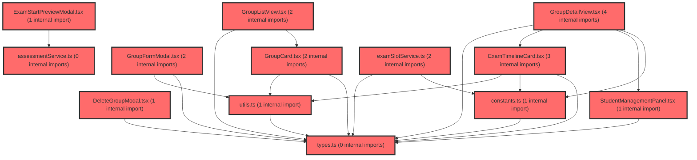

> [!IMPORTANT]
> **⚠️ 수동 검토 권장 (자가힐링 주의)**
>
> AI 자가힐링 결과물이 실제 의도와 다를 수 있으므로, **상세 리뷰 내용에 기반한 수동 점검**을 우선해 주시기 바랍니다. 자가힐링 기능을 활용하실 경우 최종 결과물을 신중하게 확인해 주세요.

# 코드 리뷰 - 91cdd4fa

## 코드 복잡도 분석

**분석된 파일**: 20개 / 변경된 파일: 21개


### Import 의존관계 다이어그램



**범례**: 중심 파일 (변경됨) | 많은 import (10개 이상)


### 정상 범위 (NONE)


**`routes.tsx`** (other)

- 평균 복잡도: **0.073**

- 최대 복잡도: 0.463

- 청크 수: 17개

- 평균 사용처: 3.3곳


**권장사항:**

- 복잡도 정상 범위


**`index.ts`** (component)

- 평균 복잡도: **0.032**

- 최대 복잡도: 0.461

- 청크 수: 29개

- 평균 사용처: 2.1곳


**권장사항:**

- 파일 크기가 큼 (29개 청크) - 파일 분리 검토


**`examslotservice.ts`** (other)

- 평균 복잡도: **0.003**

- 최대 복잡도: 0.014

- 청크 수: 5개


**권장사항:**

- 복잡도 정상 범위


**`assessmentservice.ts`** (other)

- 평균 복잡도: **0.003**

- 최대 복잡도: 0.007

- 청크 수: 28개


**권장사항:**

- 파일 크기가 큼 (28개 청크) - 파일 분리 검토


**`types.ts`** (other)

- 평균 복잡도: **0.002**

- 최대 복잡도: 0.006

- 청크 수: 10개


**권장사항:**

- 복잡도 정상 범위


**`utils.ts`** (utility)

- 평균 복잡도: **0.002**

- 최대 복잡도: 0.006

- 청크 수: 15개


**권장사항:**

- 복잡도 정상 범위


**`assessmentpagev2.tsx`** (component)

- 평균 복잡도: **0.002**

- 최대 복잡도: 0.012

- 청크 수: 66개


**권장사항:**

- 파일 크기가 큼 (66개 청크) - 파일 분리 검토


**`assessmentpage.tsx`** (component)

- 평균 복잡도: **0.002**

- 최대 복잡도: 0.011

- 청크 수: 51개


**권장사항:**

- 파일 크기가 큼 (51개 청크) - 파일 분리 검토


**`constants.ts`** (other)

- 평균 복잡도: **0.001**

- 최대 복잡도: 0.002

- 청크 수: 6개


**권장사항:**

- 복잡도 정상 범위


**`examtimelinecard.tsx`** (other)

- 평균 복잡도: **0.001**

- 최대 복잡도: 0.005

- 청크 수: 9개


**권장사항:**

- 복잡도 정상 범위


**`groupdetailview.tsx`** (component)

- 평균 복잡도: **0.001**

- 최대 복잡도: 0.004

- 청크 수: 14개


**권장사항:**

- 복잡도 정상 범위


**`groupformmodal.tsx`** (other)

- 평균 복잡도: **0.001**

- 최대 복잡도: 0.004

- 청크 수: 24개


**권장사항:**

- 파일 크기가 큼 (24개 청크) - 파일 분리 검토


**`grouplistview.tsx`** (component)

- 평균 복잡도: **0.001**

- 최대 복잡도: 0.004

- 청크 수: 7개


**권장사항:**

- 복잡도 정상 범위


**`studentmanagementpanel.tsx`** (other)

- 평균 복잡도: **0.001**

- 최대 복잡도: 0.004

- 청크 수: 9개


**권장사항:**

- 복잡도 정상 범위


**`deletegroupmodal.tsx`** (other)

- 평균 복잡도: **0.000**

- 최대 복잡도: 0.002

- 청크 수: 6개


**권장사항:**

- 복잡도 정상 범위


**`emptystate.tsx`** (store)

- 평균 복잡도: **0.000**

- 최대 복잡도: 0.000

- 청크 수: 1개


**권장사항:**

- Store 파일은 높은 연결도가 정상적임


**`groupcard.tsx`** (other)

- 평균 복잡도: **0.000**

- 최대 복잡도: 0.000

- 청크 수: 5개


**권장사항:**

- 복잡도 정상 범위


**`index.ts`** (other)

- 평균 복잡도: **0.000**

- 최대 복잡도: 0.000

- 청크 수: 8개


**권장사항:**

- 복잡도 정상 범위


**`examstartpreviewmodal.tsx`** (component)

- 평균 복잡도: **0.000**

- 최대 복잡도: 0.005

- 청크 수: 39개


**권장사항:**

- 파일 크기가 큼 (39개 청크) - 파일 분리 검토


**`mainlayout.tsx`** (other)

- 평균 복잡도: **0.000**

- 최대 복잡도: 0.010

- 청크 수: 125개


**권장사항:**

- 파일 크기가 큼 (125개 청크) - 파일 분리 검토


---


## 변경 배경

이 커밋은 기존 `AssessmentPage`(v1)를 대체하는 **검사 관리 시스템 v2**를 도입하기 위한 아키텍처 변경입니다. 기존의 `/groups` 기반 그룹 관리와 `/assessment` 기반 검사 관리가 분리되어 있던 구조를 통합하여, **그룹 = 검사 단위**라는 도메인 개념을 라우팅과 UI에 일관되게 반영하고 있습니다.

- **목적**: 검사 관리 기능을 그룹 중심으로 재구성하고, v2 UI/UX로 마이그레이션
- **도메인**: UI (라우팅, 컴포넌트, 스타일), 비즈니스 로직 (검사 슬롯 상태 관리)
- **변경 방향**: 기존 `GroupListPage`/`GroupDetailPage`/`AssessmentPage`를 `AssessmentPageV2` 단일 페이지로 통합하고, `/groups` 경로를 `/assessment`로 리다이렉트 처리

---

## [GOOD] 잘된 점

1. **리다이렉트 전략이 명확함**: `/groups`와 `/groups/:groupId`를 각각 `/assessment`와 `/assessment/:groupId`로 리다이렉트하는 `GroupDetailRedirect` 컴포넌트를 별도로 분리하여, 기존 북마크/링크의 하위 호환성을 유지하면서 새로운 URL 체계로 전환했습니다.

2. **검사 슬롯 상태 관리 로직이 견고함**: `getSlotStatus()` 함수에서 2차 검사(L2, S2)가 1차 검사(L1, S1) 완료 전에는 `locked` 상태가 되도록 하는 선행 조건 검사를 명확하게 구현했습니다. 이는 도메인 규칙을 코드에 정확히 반영한 좋은 사례입니다.

3. **타입 시스템 활용이 적절함**: `ExamSlotDefinition`과 `ExamSlotState`를 분리하여 **정의(definition)**와 **상태(state)**를 명확히 구분했습니다. `ExamSlotDefinition`은 `isComingSoon` 같은 UI 메타데이터를 포함하고, `ExamSlotState`는 API 응답 기반의 동적 상태를 표현합니다.

4. **CSS 변수 기반 디자인 시스템**: `vj.css`에서 `:root`에 CSS 커스텀 속성을 정의하여 일관된 컬러 팔레트를 제공하고, `vj-*` 네임스페이스를 사용해 스타일 충돌을 방지했습니다.

---

## 변경사항 요약

- **라우팅**: `/groups` -> `/assessment` 리다이렉트, `AssessmentPageV2` 도입, `GroupDetailRedirect` 컴포넌트 추가
- **스타일**: `vj.css` (947줄) 신규 추가 - Variant J 디자인 시스템
- **API 서비스**: `examSlotService.ts` - `getExamSlots()`로 검사 슬롯 상태 조회
- **상수/타입**: `constants.ts` (4개 슬롯 정의), `types.ts` (도메인 타입)
- **UI 컴포넌트**: `ExamTimelineCard`, `DeleteGroupModal`, `EmptyState` 신규

---

## [ISSUE] 개선이 필요한 부분

### Critical (즉시 수정 필요)

**없음**

### High (우선 수정 권장)

#### 1. `examSlotService.ts`: `fetchExamList` 호출 시 `paperIdx` 누락으로 인한 데이터 불일치 위험

**파일**: `frontend/src/features/assessment-v2/api/examSlotService.ts`

**변경 내용**: `getExamSlots()` 함수가 `fetchExamList(claId, tcId)`를 호출할 때 `paperIdx` 인자를 전달하지 않고 있습니다.

**분석**:
- `fetchExamList` 함수는 `paperIdx`를 선택적 인자로 받으며, 전달되지 않으면 API에 `paperIdx` 파라미터를 포함하지 않습니다.
- `EXAM_SLOTS`에는 `paperIdx: '1'`(학습종합)과 `paperIdx: '2'`(자기조절) 두 가지 유형이 존재합니다.
- 현재 구현은 `fetchExamList`가 모든 `paperIdx`의 데이터를 반환한다고 가정하고, 이후 `items.find()`로 필터링하는 방식입니다.

**문제점**: API가 `paperIdx` 없이 호출될 때 **모든 paperIdx의 데이터를 반환하는지, 아니면 기본값(예: '1')만 반환하는지**가 불확실합니다. 만약 API가 기본값으로 '1'만 반환한다면, `paperIdx: '2'`인 슬롯(S1, S2)은 항상 `not_started` 상태로 잘못 표시됩니다.

**위치 (라인 4)**: `export async function getExamSlots(claId: string, tcId: string): Promise<ExamSlotState[]> {`

**기존 코드**:
```typescript
export async function getExamSlots(claId: string, tcId: string): Promise<ExamSlotState[]> {
  const items = await fetchExamList(claId, tcId);
```

**해결 방안 (수정 코드)**:
```typescript
export async function getExamSlots(claId: string, tcId: string): Promise<ExamSlotState[]> {
  // 모든 paperIdx의 데이터를 가져오기 위해 각각 호출
  const [itemsPaper1, itemsPaper2] = await Promise.all([
    fetchExamList(claId, tcId, '1'),
    fetchExamList(claId, tcId, '2'),
  ]);
  const items = [...itemsPaper1, ...itemsPaper2];
```

> **수정 코드 제시 근거**: `fetchExamList` 함수의 시그니처(`paperIdx?: string`)와 내부 구현(`if (paperIdx) endpoint += ...`)을 `read_file`로 확인했습니다. API가 `paperIdx` 없이 호출될 때의 동작이 불확실하므로, 명시적으로 두 번 호출하여 모든 데이터를 수집하는 것이 안전합니다. `Promise.all`을 사용하여 네트워크 지연을 최소화했습니다.

---

#### 2. `vj.css`: 947줄의 거대한 CSS 파일로 인한 유지보수성 저하

**파일**: `frontend/src/app/styles/vj.css`

**변경 내용**: 단일 CSS 파일에 947줄의 모든 Variant J 스타일이 포함되어 있습니다.

**분석**:
- `vj.css`는 카드, 그리드, 상태 표시, 타임라인, 모달, 폼 등 **여러 도메인의 스타일**이 하나의 파일에 혼재되어 있습니다.
- `vj-*` 네임스페이스로 접두사 충돌은 방지했지만, 파일 단위 분리가 되어 있지 않아 특정 컴포넌트의 스타일을 찾거나 수정할 때 전체 파일을 탐색해야 합니다.
- `@emotion/styled`를 사용하는 `DeleteGroupModal`과 CSS 클래스 기반인 `ExamTimelineCard`가 혼재되어 있어 스타일링 전략이 일관되지 않습니다.

**개선 제안**:
1. `vj.css`를 도메인별로 분할 (예: `vj-card.css`, `vj-timeline.css`, `vj-modal.css`, `vj-layout.css`)
2. 또는 CSS Modules / CSS-in-JS로 마이그레이션하여 컴포넌트 단위 스타일 캡슐화
3. 최소한 `vj.css` 내에 주석으로 **섹션 구분**을 더 명확히 하고, 각 섹션의 시작 줄을 문서화

---

#### 3. `DeleteGroupModal`: Emotion `styled`와 CSS 클래스 방식의 혼용으로 인한 일관성 부재

**파일**: `frontend/src/features/assessment-v2/ui/DeleteGroupModal.tsx`

**변경 내용**: `DeleteGroupModal`은 `@emotion/styled`를 사용하여 스타일링하고 있지만, 같은 디렉토리의 `ExamTimelineCard`와 `EmptyState`는 `vj.css`의 CSS 클래스를 사용하고 있습니다.

**분석**:
- `DeleteGroupModal`: `styled.div`, `styled.button` 등 Emotion styled-components 사용
- `ExamTimelineCard`: `className="vj-tc v2"`, `className="vj-tc2-main"` 등 CSS 클래스 사용
- `EmptyState`: `className="vj-empty"`, `className="vj-empty-steps"` 등 CSS 클래스 사용

**문제점**: 같은 기능(assessment-v2) 내에서도 스타일링 방식이 통일되지 않아, 신규 개발자가 어떤 방식을 따라야 할지 혼란스럽습니다. 또한 `DeleteGroupModal`은 `vj.css`에 정의된 `vj-fade-in`, `vj-slide-up` 애니메이션을 참조하고 있어(`animation: vj-fade-in 0.15s ease-out;`) CSS 클래스 방식에 부분적으로 의존하고 있습니다.

**개선 제안**: 프로젝트 차원에서 스타일링 전략을 통일하거나, 최소한 `assessment-v2` 도메인 내에서는 일관된 방식을 채택하세요. 현재 추세로는 `vj.css` 클래스 방식을 계속 사용할 것이라면 `DeleteGroupModal`도 CSS 클래스 기반으로 리팩토링하는 것이 좋습니다.

---

### Medium (개선 권장)

#### 4. `ExamTimelineCard`: `cardClass` 문자열 조합 방식의 가독성 문제

**파일**: `frontend/src/features/assessment-v2/ui/ExamTimelineCard.tsx` (라인 60-68)

**변경 내용**: 카드의 CSS 클래스를 조건부로 조합할 때 배열과 `filter(Boolean).join(' ')` 패턴을 사용하고 있습니다.

**분석**:
```typescript
const cardClass = [
  'vj-tc v2',
  slotDef.kind,
  status === 'in_progress' ? 'live' : '',
  status === 'completed' ? 'done' : '',
  isLocked ? 'locked' : '',
  isComingSoon ? 'coming-soon' : '',
]
  .filter(Boolean)
  .join(' ');
```

이 패턴은 일반적이지만, `clsx` 또는 `classnames` 같은 유틸리티 라이브러리를 사용하면 더 간결하고 실수 가능성이 줄어듭니다. 다만 이는 프로젝트 컨벤션의 문제이므로, 기존 코드베이스에서 `clsx`를 사용하고 있다면 통일하는 것이 좋습니다.

#### 5. `constants.ts`: `GRADE_OPTIONS`와 `CLASS_OPTIONS`가 현재 사용되지 않음

**파일**: `frontend/src/features/assessment-v2/constants.ts` (라인 56-63)

**변경 내용**: `GRADE_OPTIONS`, `CLASS_OPTIONS`, `SCHOOL_LEVEL_OPTIONS`가 정의되어 있지만, 현재 Diff에 포함된 코드에서는 이들을 사용하는 곳이 없습니다.

**분석**: 이 상수들은 `GroupFormModal`(이 커밋에 포함되지 않음)에서 사용될 것으로 예상됩니다. 미래 사용을 위해 정의한 것으로 보이나, **데드 코드(dead code)**가 될 위험이 있습니다. 사용 시점에 추가하거나, 최소한 `TODO` 주석으로 의도를 명시하는 것이 좋습니다.

---

## 주요 파일 분석

### `frontend/src/app/router/routes.tsx`

**변경 내용**: `/groups` 경로를 `/assessment`로 리다이렉트하고, `AssessmentPageV2`를 도입하여 기존 3개 페이지를 단일 페이지로 통합

**개선 제안**:
1. **`GroupDetailRedirect` 컴포넌트의 `useParams` 타입 안전성** (라인 44-47)
   - `useParams<{ groupId: string }>()`는 `groupId`가 `string | undefined`임을 보장하지 않습니다. `Navigate`의 `to` prop에 `undefined`가 전달될 가능성이 있습니다.
   - **위치 (라인 44-47)**:
     ```typescript
     const GroupDetailRedirect = () => {
       const { groupId } = useParams<{ groupId: string }>();
       return <Navigate to={`/assessment/${groupId}`} replace />;
     };
     ```
   - **해결 방안**: `groupId`가 없을 경우 `/assessment`로 fallback 처리
     ```typescript
     const GroupDetailRedirect = () => {
       const { groupId } = useParams<{ groupId: string }>();
       return <Navigate to={groupId ? `/assessment/${groupId}` : '/assessment'} replace />;
     };
     ```

### `frontend/src/features/assessment-v2/api/examSlotService.ts`

**변경 내용**: `getExamSlots()` 함수로 검사 슬롯별 상태를 조회하고 `ExamSlotState[]`로 변환

**개선 제안**:
1. **`paperIdx` 누락 문제** (위 High 이슈 #1 참조)
2. **`new Date(item.dgnssStDt)`의 유효성**: API 응답의 `dgnssStDt`가 `string` 타입이지만, 빈 문자열이나 `null`이 될 가능성에 대한 방어 코드가 없습니다. `startDate: item.dgnssStDt ? new Date(item.dgnssStDt) : undefined`로 변경하는 것이 안전합니다.

### `frontend/src/features/assessment-v2/ui/ExamTimelineCard.tsx`

**변경 내용**: 검사 슬롯의 상태에 따라 다양한 UI 상태(시작 전, 진행 중, 완료, 잠금, Coming Soon)를 표현하는 카드 컴포넌트

**개선 제안**:
1. **`ActionButtons` 컴포넌트의 `disabled` 조건** (라인 260-265)
   - `in_progress` 상태에서 `onEndExam` 버튼의 `disabled` 조건이 `submittedCount === 0`일 때만 비활성화됩니다. 그러나 `dgnssId`가 `undefined`인 경우도 버튼이 동작하지 않아야 합니다.
   - **위치 (라인 262)**: `onClick={() => dgnssId && submittedCount > 0 && onEndExam(slotId, dgnssId)}`
   - `disabled` prop에도 `!dgnssId` 조건을 추가하는 것이 일관성 측면에서 좋습니다.

---

## 최종 평가

**결론**:
- [ ] [OK] **승인 (Approved)**
- [ ] [WARN] **조건부 승인 (Approved with Comments)**
- [X] [FIX] **수정 필요 (Changes Requested)** - High 이슈 1건 존재

**종합 의견**:
전반적으로 아키텍처 설계와 도메인 모델링이 잘 이루어져 있습니다. `ExamSlotDefinition`/`ExamSlotState` 분리, `getSlotStatus()`의 선행 조건 검사, 리다이렉트 전략 등이 인상적입니다. 다만 **`examSlotService.ts`의 `paperIdx` 누락 문제**는 실제 운영 환경에서 S1/S2 슬롯의 상태가 항상 `not_started`로 표시되는 심각한 버그로 이어질 수 있으므로, 머지 전에 반드시 수정이 필요합니다. 또한 `vj.css`의 파일 크기와 스타일링 전략의 일관성 부재는 중장기적으로 기술 부채가 될 수 있으므로 팀 내 논의를 권장합니다.