> [!IMPORTANT]
> **⚠️ 수동 검토 권장 (자가힐링 주의)**
>
> AI 자가힐링 결과물이 실제 의도와 다를 수 있으므로, **상세 리뷰 내용에 기반한 수동 점검**을 우선해 주시기 바랍니다. 자가힐링 기능을 활용하실 경우 최종 결과물을 신중하게 확인해 주세요.

# 코드 리뷰 - 9700d124

## 코드 복잡도 분석

**분석된 파일**: 80개 / 변경된 파일: 121개


### Import 의존관계 다이어그램

```mermaid
flowchart TD
    F0["GroupMemberMapper.java (0 internal imports)"]:::center
    F1["GroupInfoMapper.java (0 internal imports)"]:::center
    F2["UserMapper.java (0 internal imports)"]:::center
    F3["GroupServiceTest.java (12 internal imports)"]:::center
    F4["AidtCommonUtil.java (0 internal imports)"]
    F5["GroupQueryMapper.java (0 internal imports)"]
    F6["ResponseDTO.java (0 internal imports)"]
    F7["User.java (0 internal imports)"]
    F8["MemberController.java (6 internal imports)"]:::center
    F9["CustomBody.java (0 internal imports)"]
    F10["MemberService.java (0 internal imports)"]
    F11["NoStudentModal.tsx (0 internal imports)"]:::center
    F12["MemberStatus.java (0 internal imports)"]:::center
    F13["GroupInfo.java (0 internal imports)"]
    F14["NotificationStreamController.java (1 internal import)"]:::center
    F15["SsoUserResolveService.java (0 internal imports)"]:::center
    F16["SecurityUtil.java (0 internal imports)"]:::center
    F17["GroupMember.java (0 internal imports)"]
    F18["EmailVerificationService.java (0 internal imports)"]
    F19["AssessmentPageV2.tsx (1 internal import)"]:::center
    F8 --> F9
    F8 --> F10
    F8 --> F4
    F8 --> F15
    F8 --> F6
    F8 --> F7
    F14 --> F16
    F3 --> F0
    F3 --> F1
    F3 --> F2
    F3 --> F10
    F3 --> F12
    F3 --> F5
    F3 --> F17
    F3 --> F18
    F3 --> F13
    F3 --> F7
    F19 --> F11
    classDef center fill:#ff6b6b,stroke:#333,stroke-width:3px
    classDef high fill:#ffd93d,stroke:#333,stroke-width:2px
```



**범례**: 중심 파일 (변경됨) | 많은 import (10개 이상)


### 정상 범위 (NONE)


**`rolegroupmapper.xml`** (other)

- 평균 복잡도: **0.471**

- 최대 복잡도: 0.471

- 청크 수: 1개

- 평균 사용처: 14.0곳


**권장사항:**

- 복잡도 정상 범위


**`authschoolmapmapper.xml`** (other)

- 평균 복잡도: **0.469**

- 최대 복잡도: 0.469

- 청크 수: 1개

- 평균 사용처: 14.0곳


**권장사항:**

- 복잡도 정상 범위


**`authschoolmap.java`** (other)

- 평균 복잡도: **0.468**

- 최대 복잡도: 0.468

- 청크 수: 1개

- 평균 사용처: 11.0곳


**권장사항:**

- 복잡도 정상 범위


**`rolegroup.java`** (other)

- 평균 복잡도: **0.467**

- 최대 복잡도: 0.467

- 청크 수: 1개

- 평균 사용처: 12.0곳


**권장사항:**

- 복잡도 정상 범위


**`adminuserservice.java`** (other)

- 평균 복잡도: **0.465**

- 최대 복잡도: 0.472

- 청크 수: 16개

- 평균 사용처: 40.0곳


**권장사항:**

- 복잡도 정상 범위


**`authschoolmapmapper.java`** (other)

- 평균 복잡도: **0.463**

- 최대 복잡도: 0.464

- 청크 수: 4개

- 평균 사용처: 44.5곳


**권장사항:**

- 복잡도 정상 범위


**`rolegroupmapper.java`** (other)

- 평균 복잡도: **0.462**

- 최대 복잡도: 0.464

- 청크 수: 5개

- 평균 사용처: 36.8곳


**권장사항:**

- 복잡도 정상 범위


**`admincontroller.java`** (other)

- 평균 복잡도: **0.405**

- 최대 복잡도: 0.470

- 청크 수: 15개

- 평균 사용처: 26.8곳


**권장사항:**

- 복잡도 정상 범위


**`membercontroller.java`** (other)

- 평균 복잡도: **0.391**

- 최대 복잡도: 0.470

- 청크 수: 6개

- 평균 사용처: 53.7곳


**권장사항:**

- 복잡도 정상 범위


**`swaggerconfig.java`** (config)

- 평균 복잡도: **0.280**

- 최대 복잡도: 0.466

- 청크 수: 5개

- 평균 사용처: 31.0곳


**권장사항:**

- Config 파일은 높은 연결도가 정상적임


**`fileutil.java`** (utility)

- 평균 복잡도: **0.271**

- 최대 복잡도: 0.474

- 청크 수: 19개

- 평균 사용처: 37.5곳


**권장사항:**

- 복잡도 정상 범위


**`filemapper.xml`** (other)

- 평균 복잡도: **0.244**

- 최대 복잡도: 0.475

- 청크 수: 2개

- 평균 사용처: 7.0곳


**권장사항:**

- 복잡도 정상 범위


**`dgnssmapper.xml`** (other)

- 평균 복잡도: **0.243**

- 최대 복잡도: 0.475

- 청크 수: 2개

- 평균 사용처: 7.0곳


**권장사항:**

- 복잡도 정상 범위


**`filemapper.java`** (other)

- 평균 복잡도: **0.242**

- 최대 복잡도: 0.465

- 청크 수: 23개

- 평균 사용처: 20.9곳


**권장사항:**

- 파일 크기가 큼 (23개 청크) - 파일 분리 검토


**`llm_router.py`** (other)

- 평균 복잡도: **0.238**

- 최대 복잡도: 0.469

- 청크 수: 2개

- 평균 사용처: 9.0곳


**권장사항:**

- 복잡도 정상 범위


**`groupmembermapper.xml`** (other)

- 평균 복잡도: **0.238**

- 최대 복잡도: 0.469

- 청크 수: 2개

- 평균 사용처: 7.0곳


**권장사항:**

- 복잡도 정상 범위


**`groupinfomapper.xml`** (other)

- 평균 복잡도: **0.238**

- 최대 복잡도: 0.468

- 청크 수: 2개

- 평균 사용처: 7.0곳


**권장사항:**

- 복잡도 정상 범위


**`usermapper.xml`** (other)

- 평균 복잡도: **0.238**

- 최대 복잡도: 0.469

- 청크 수: 2개

- 평균 사용처: 7.0곳


**권장사항:**

- 복잡도 정상 범위


**`indexcontroller.java`** (other)

- 평균 복잡도: **0.236**

- 최대 복잡도: 0.470

- 청크 수: 6개

- 평균 사용처: 13.5곳


**권장사항:**

- 복잡도 정상 범위


**`filecontroller.java`** (other)

- 평균 복잡도: **0.235**

- 최대 복잡도: 0.465

- 청크 수: 2개

- 평균 사용처: 27.0곳


**권장사항:**

- 복잡도 정상 범위


**`piopdfvo.java`** (other)

- 평균 복잡도: **0.232**

- 최대 복잡도: 0.474

- 청크 수: 90개

- 평균 사용처: 20.9곳


**권장사항:**

- 파일 크기가 큼 (90개 청크) - 파일 분리 검토


**`loginratelimiter.java`** (utility)

- 평균 복잡도: **0.232**

- 최대 복잡도: 0.464

- 청크 수: 12개

- 평균 사용처: 28.9곳


**권장사항:**

- 복잡도 정상 범위


**`dgnsscontroller.java`** (other)

- 평균 복잡도: **0.227**

- 최대 복잡도: 0.470

- 청크 수: 23개

- 평균 사용처: 28.1곳


**권장사항:**

- 파일 크기가 큼 (23개 청크) - 파일 분리 검토


**`counselingservice.java`** (other)

- 평균 복잡도: **0.226**

- 최대 복잡도: 0.470

- 청크 수: 27개

- 평균 사용처: 20.6곳


**권장사항:**

- 파일 크기가 큼 (27개 청크) - 파일 분리 검토


**`memberstatus.java`** (other)

- 평균 복잡도: **0.217**

- 최대 복잡도: 0.427

- 청크 수: 2개

- 평균 사용처: 4.5곳


**권장사항:**

- 복잡도 정상 범위


**`securityconfig.java`** (config)

- 평균 복잡도: **0.215**

- 최대 복잡도: 0.464

- 청크 수: 13개

- 평균 사용처: 24.2곳


**권장사항:**

- Config 파일은 높은 연결도가 정상적임


**`metaapplication.java`** (other)

- 평균 복잡도: **0.214**

- 최대 복잡도: 0.465

- 청크 수: 4개

- 평균 사용처: 9.8곳


**권장사항:**

- 복잡도 정상 범위


**`pdfservice.java`** (other)

- 평균 복잡도: **0.214**

- 최대 복잡도: 0.468

- 청크 수: 11개

- 평균 사용처: 33.8곳


**권장사항:**

- 복잡도 정상 범위


**`agent_service.py`** (other)

- 평균 복잡도: **0.200**

- 최대 복잡도: 0.464

- 청크 수: 7개

- 평균 사용처: 8.0곳


**권장사항:**

- 복잡도 정상 범위


**`groupinfomapper.java`** (other)

- 평균 복잡도: **0.198**

- 최대 복잡도: 0.464

- 청크 수: 14개

- 평균 사용처: 17.6곳


**권장사항:**

- 복잡도 정상 범위


**`usermapper.java`** (other)

- 평균 복잡도: **0.193**

- 최대 복잡도: 0.463

- 청크 수: 12개

- 평균 사용처: 16.4곳


**권장사항:**

- 복잡도 정상 범위


**`groupmembermapper.java`** (other)

- 평균 복잡도: **0.185**

- 최대 복잡도: 0.465

- 청크 수: 20개

- 평균 사용처: 14.6곳


**권장사항:**

- 복잡도 정상 범위


**`securityutil.java`** (utility)

- 평균 복잡도: **0.158**

- 최대 복잡도: 0.475

- 청크 수: 9개

- 평균 사용처: 17.3곳


**권장사항:**

- 복잡도 정상 범위


**`dgnssservice.java`** (other)

- 평균 복잡도: **0.129**

- 최대 복잡도: 0.473

- 청크 수: 59개

- 평균 사용처: 14.9곳


**권장사항:**

- 파일 크기가 큼 (59개 청크) - 파일 분리 검토


**`globalexceptionhandler.java`** (config)

- 평균 복잡도: **0.126**

- 최대 복잡도: 0.466

- 청크 수: 19개

- 평균 사용처: 13.2곳


**권장사항:**

- Config 파일은 높은 연결도가 정상적임


**`fileservice.java`** (other)

- 평균 복잡도: **0.120**

- 최대 복잡도: 0.468

- 청크 수: 16개

- 평균 사용처: 21.9곳


**권장사항:**

- 복잡도 정상 범위


**`apiresponseaspect.java`** (other)

- 평균 복잡도: **0.097**

- 최대 복잡도: 0.467

- 청크 수: 5개

- 평균 사용처: 11.8곳


**권장사항:**

- 복잡도 정상 범위


**`notificationstreamcontroller.java`** (other)

- 평균 복잡도: **0.012**

- 최대 복잡도: 0.012

- 청크 수: 1개


**권장사항:**

- 복잡도 정상 범위


**`qchtraceclient.java`** (other)

- 평균 복잡도: **0.012**

- 최대 복잡도: 0.012

- 청크 수: 1개


**권장사항:**

- 복잡도 정상 범위


**`groupservicetest.java`** (other)

- 평균 복잡도: **0.010**

- 최대 복잡도: 0.010

- 청크 수: 1개


**권장사항:**

- 복잡도 정상 범위


**`ssoeventfeedresponse.java`** (other)

- 평균 복잡도: **0.009**

- 최대 복잡도: 0.009

- 청크 수: 1개


**권장사항:**

- 복잡도 정상 범위


**`ssopollcursormapper.xml`** (other)

- 평균 복잡도: **0.009**

- 최대 복잡도: 0.009

- 청크 수: 1개


**권장사항:**

- 복잡도 정상 범위


**`userprofilecontroller.java`** (other)

- 평균 복잡도: **0.008**

- 최대 복잡도: 0.008

- 청크 수: 1개


**권장사항:**

- 복잡도 정상 범위


**`guestauthcontroller.java`** (other)

- 평균 복잡도: **0.007**

- 최대 복잡도: 0.008

- 청크 수: 2개


**권장사항:**

- 복잡도 정상 범위


**`ssoeventpollingscheduler.java`** (other)

- 평균 복잡도: **0.007**

- 최대 복잡도: 0.009

- 청크 수: 2개


**권장사항:**

- 복잡도 정상 범위


**`ssopollcursor.java`** (other)

- 평균 복잡도: **0.007**

- 최대 복잡도: 0.007

- 청크 수: 1개


**권장사항:**

- 복잡도 정상 범위


**`ssouserwithdrawalservice.java`** (other)

- 평균 복잡도: **0.006**

- 최대 복잡도: 0.006

- 청크 수: 1개


**권장사항:**

- 복잡도 정상 범위


**`qchrequestbodycachingfilter.java`** (config)

- 평균 복잡도: **0.006**

- 최대 복잡도: 0.009

- 청크 수: 2개


**권장사항:**

- Config 파일은 높은 연결도가 정상적임


**`emailverificationservicetest.java`** (other)

- 평균 복잡도: **0.006**

- 최대 복잡도: 0.007

- 청크 수: 5개


**권장사항:**

- 복잡도 정상 범위


**`aiconversationservice.java`** (other)

- 평균 복잡도: **0.005**

- 최대 복잡도: 0.009

- 청크 수: 15개


**권장사항:**

- 복잡도 정상 범위


**`speventfeedclient.java`** (other)

- 평균 복잡도: **0.005**

- 최대 복잡도: 0.006

- 청크 수: 4개


**권장사항:**

- 복잡도 정상 범위


**`qchtraceaspect.java`** (other)

- 평균 복잡도: **0.005**

- 최대 복잡도: 0.009

- 청크 수: 5개


**권장사항:**

- 복잡도 정상 범위


**`mdcloggingfilter.java`** (config)

- 평균 복잡도: **0.005**

- 최대 복잡도: 0.008

- 청크 수: 2개


**권장사항:**

- Config 파일은 높은 연결도가 정상적임


**`ssoeventpollproperties.java`** (config)

- 평균 복잡도: **0.005**

- 최대 복잡도: 0.005

- 청크 수: 1개


**권장사항:**

- Config 파일은 높은 연결도가 정상적임


**`ncpmailsender.java`** (utility)

- 평균 복잡도: **0.005**

- 최대 복잡도: 0.007

- 청크 수: 7개


**권장사항:**

- 복잡도 정상 범위


**`dgnsslpaservice.java`** (other)

- 평균 복잡도: **0.004**

- 최대 복잡도: 0.007

- 청크 수: 20개


**권장사항:**

- 복잡도 정상 범위


**`redispubsubdispatcher.java`** (other)

- 평균 복잡도: **0.004**

- 최대 복잡도: 0.005

- 청크 수: 2개


**권장사항:**

- 복잡도 정상 범위


**`redispubsubsubscriber.java`** (other)

- 평균 복잡도: **0.004**

- 최대 복잡도: 0.005

- 청크 수: 2개


**권장사항:**

- 복잡도 정상 범위


**`ssouserresolveservice.java`** (other)

- 평균 복잡도: **0.004**

- 최대 복잡도: 0.006

- 청크 수: 2개


**권장사항:**

- 복잡도 정상 범위


**`spusermappingfilter.java`** (config)

- 평균 복잡도: **0.004**

- 최대 복잡도: 0.004

- 청크 수: 1개


**권장사항:**

- Config 파일은 높은 연결도가 정상적임


**`piimasker.java`** (utility)

- 평균 복잡도: **0.004**

- 최대 복잡도: 0.009

- 청크 수: 8개


**권장사항:**

- 복잡도 정상 범위


**`ncpmailsendertest.java`** (utility)

- 평균 복잡도: **0.004**

- 최대 복잡도: 0.008

- 청크 수: 3개


**권장사항:**

- 복잡도 정상 범위


**`membermapperreadtest.java`** (other)

- 평균 복잡도: **0.004**

- 최대 복잡도: 0.008

- 청크 수: 3개


**권장사항:**

- 복잡도 정상 범위


**`notificationredisconfig.java`** (config)

- 평균 복잡도: **0.003**

- 최대 복잡도: 0.004

- 청크 수: 3개


**권장사항:**

- Config 파일은 높은 연결도가 정상적임


**`authproxycontroller.java`** (other)

- 평균 복잡도: **0.003**

- 최대 복잡도: 0.005

- 청크 수: 4개


**권장사항:**

- 복잡도 정상 범위


**`ssoeventpollservice.java`** (other)

- 평균 복잡도: **0.003**

- 최대 복잡도: 0.005

- 청크 수: 5개


**권장사항:**

- 복잡도 정상 범위


**`metaapiapplicationcontexttest.java`** (other)

- 평균 복잡도: **0.003**

- 최대 복잡도: 0.004

- 청크 수: 2개


**권장사항:**

- 복잡도 정상 범위


**`spservicetokenprovider.java`** (other)

- 평균 복잡도: **0.002**

- 최대 복잡도: 0.002

- 청크 수: 2개


**권장사항:**

- 복잡도 정상 범위


**`securityswaggersmoketest.java`** (other)

- 평균 복잡도: **0.002**

- 최대 복잡도: 0.003

- 청크 수: 5개


**권장사항:**

- 복잡도 정상 범위


**`usenotificationstream.ts`** (other)

- 평균 복잡도: **0.002**

- 최대 복잡도: 0.009

- 청크 수: 12개


**권장사항:**

- 복잡도 정상 범위


**`qrcodemodal.tsx`** (component)

- 평균 복잡도: **0.002**

- 최대 복잡도: 0.008

- 청크 수: 9개


**권장사항:**

- 복잡도 정상 범위


**`assessmentpagev2.tsx`** (component)

- 평균 복잡도: **0.002**

- 최대 복잡도: 0.012

- 청크 수: 68개


**권장사항:**

- 파일 크기가 큼 (68개 청크) - 파일 분리 검토


**`ssopollcursormapper.java`** (other)

- 평균 복잡도: **0.001**

- 최대 복잡도: 0.002

- 청크 수: 2개


**권장사항:**

- 복잡도 정상 범위


**`inmemorymultipartfile.java`** (utility)

- 평균 복잡도: **0.001**

- 최대 복잡도: 0.010

- 청크 수: 10개


**권장사항:**

- 복잡도 정상 범위


**`cancelexammodal.tsx`** (component)

- 평균 복잡도: **0.001**

- 최대 복잡도: 0.002

- 청크 수: 4개


**권장사항:**

- 복잡도 정상 범위


**`endexammodal.tsx`** (component)

- 평균 복잡도: **0.001**

- 최대 복잡도: 0.002

- 청크 수: 2개


**권장사항:**

- 복잡도 정상 범위


**`examtimelinecard.tsx`** (component)

- 평균 복잡도: **0.001**

- 최대 복잡도: 0.006

- 청크 수: 7개


**권장사항:**

- 복잡도 정상 범위


**`nostudentmodal.tsx`** (component)

- 평균 복잡도: **0.001**

- 최대 복잡도: 0.002

- 청크 수: 3개


**권장사항:**

- 복잡도 정상 범위


**`toast.tsx`** (component)

- 평균 복잡도: **0.001**

- 최대 복잡도: 0.003

- 청크 수: 6개


**권장사항:**

- 복잡도 정상 범위


**`index.ts`** (component)

- 평균 복잡도: **0.000**

- 최대 복잡도: 0.000

- 청크 수: 14개


**권장사항:**

- 복잡도 정상 범위


---


## 변경 배경

이 커밋은 두 가지 주요 축으로 구성됩니다. 첫째, AI Agent의 LLM 프로바이더 아키텍처를 기존 Gemini 단일 구조에서 OpenAI(Primary) + Gemini(Fallback) 이중화 구조로 전환하여 가용성을 높였습니다. 둘째, Backend를 Spring Boot 2.7.17(Java 17)에서 Spring Boot 4.0.5(Java 21)로 메이저 업그레이드하고, SSO 전환에 따라 불필요해진 Admin 사용자/역할/학교 매핑 관리 기능을 대거 폐기하여 유지보수 대상을 축소했습니다.

- **목적**: LLM 프로바이더 장애 대비 이중화 + 프레임워크 현대화 및 레거시 코드 정리
- **도메인**: AI Agent 인프라 / Backend 인프라 및 API
- **변경 방향**: 단일 프로바이더 의존성 탈피, 논리 모델명 추상화로 클라이언트 코드 변경 최소화, Admin 영역을 버그리포트 관리 전용으로 슬림화

---

## [GOOD] 잘된 점

**1. 논리 모델명 추상화 (`ROUTER_MODEL_NAME`)**

`AgentService`가 하드코딩된 `"meta-agent-service"` 문자열 대신 `ROUTER_MODEL_NAME` 상수를 참조하도록 변경한 설계가 우수합니다. `llm_router.py`에서 `_call_model = MODEL_NAME_PRIMARY if has_primary else MODEL_NAME_FALLBACK` 로직으로 Primary/Fallback을 자동 결정하고, `AgentService`는 단순히 `ROUTER_MODEL_NAME`만 바라보므로 프로바이더 교체 시 `llm_router.py`만 수정하면 됩니다. 변경 영향 범위를 극도로 좁히는 좋은 패턴입니다.

```python
# llm_router.py
_call_model = MODEL_NAME_PRIMARY if has_primary else MODEL_NAME_FALLBACK
ROUTER_MODEL_NAME = _call_model

# agent_service.py
response = await self.router.acompletion(
    model=ROUTER_MODEL_NAME,  # 이전: "meta-agent-service"
    messages=messages,
    tools=self.tools
)
```

**2. 방어 로직과 명시적 상태 로깅**

Primary(OpenAI) 키가 없으면 Fallback(Gemini)을 Primary로 자동 승격하는 `_call_model` 로직과, `has_primary`/`has_fallback` 상태에 따른 명시적 로깅은 운영 안정성에 큰 도움이 됩니다. 키 설정 실수나 환경 변수 누락 상황에서도 서비스가 완전히 죽지 않고 Fallback으로 동작할 수 있도록 한 점이 실무적입니다.

```python
if not has_primary:
    logger.warning("OpenAI 키가 없습니다. Gemini를 기본으로 사용합니다.")
if not has_fallback:
    logger.warning("Gemini 키가 없습니다. OpenAI 단독 운영됩니다.")
```

**3. LiteLLM 예외 타입별 세분화된 에러 핸들링**

`run_agent_stream()`에 `AuthenticationError`, `RateLimitError`, `Timeout`, `APIError` 등 `litellm.exceptions`의 구체적 예외 타입별 핸들러를 추가하여, 사용자에게 상황에 맞는 메시지를 제공하고 세션 히스토리도 정상 기록하도록 한 점이 좋습니다. 기존에는 모든 예외가 하나의 `except Exception`으로 처리되어 사용자에게 모호한 메시지만 전달되었습니다.

```python
except litellm.exceptions.AuthenticationError as e:
    msg = "API 키 인증 오류가 발생했습니다. 관리자에게 문의하세요."
    history.add_user_message(text)
    history.add_ai_message(msg)
    yield msg
except litellm.exceptions.RateLimitError as e:
    msg = "현재 요청이 많아 일시적으로 서비스 제한이 발생했습니다."
    ...
```

**4. Backend 의존성 현대화 정확성**

Spring Boot 4.0.5 + Java 21 마이그레이션에서 다음 변경들이 정확하게 이루어졌습니다:
- `spring-boot-starter-aop` -> `spring-boot-starter-aspectj` (Boot 4.x에서 이름 변경)
- `springdoc-openapi-ui:1.7.0` -> `springdoc-openapi-starter-webmvc-ui:2.8.6` (Jakarta/Swagger 3 호환)
- `thymeleaf-extras-springsecurity5` -> `thymeleaf-extras-springsecurity6:3.1.2.RELEASE`
- `neo4j-java-driver:5.28.5` -> 버전 명시 제거(Boot 4 BOM이 6.0.3으로 관리)
- `jasypt-spring-boot-starter` 제거(미사용 확인)
- `mockitoAgent` configuration 분리로 JDK 21+ dynamic agent self-attach 문제 우회

**5. AdminController 슬림화**

기존 약 418줄의 `AdminController`에서 사용자 관리, 역할 관리, 학교 매핑, API 테스트, 그룹 관리 등 SSO 전환으로 불필요해진 모든 기능을 제거하고, AI 버그리포트 관리(약 42줄)만 남긴 결정이 명확합니다. `AdminUserService`(378줄), `RoleGroupMapper`, `AuthSchoolMapMapper` 등 관련 클래스도 함께 삭제하여 유지보수 부담을 줄였습니다.

---

## [ISSUE] 개선이 필요한 부분

### Critical (즉시 수정 필요)

**없음**

### High (우선 수정 권장)

**1. `llm_router.py` — 모듈 레벨 Router 인스턴스 생성 시 예외 처리 부재**

- **파일**: `agent/app/core/llm_router.py`
- **위치**: 104~109번째 줄 (모듈 최상단)

**문제 분석**: `Router(model_list=model_list, fallbacks=_fallbacks, ...)`가 모듈 로드 시점에 즉시 실행됩니다. `model_list`가 비어 있거나(API 키가 하나도 없는 환경), LiteLLM 버전 불일치로 Router 생성자가 실패하면 `ImportError`가 발생하여 FastAPI 앱 전체가 기동되지 않습니다. 이는 단순한 500 에러가 아니라 애플리케이션 자체가 실행되지 않는 치명적 상황입니다.

**실행 경로 추적**:
1. `python app/main.py` 실행
2. `from app.services.agent_service import MetaAgentService` -> `from app.core.llm_router import llm_router` 실행
3. `llm_router = Router(...)` 실행 -> 실패 시 `ImportError`로 앱 기동 중단
4. FastAPI의 `@app.exception_handler`조차 동작하지 않음

**기존 코드**:
```python
llm_router = Router(
    model_list=model_list,
    fallbacks=_fallbacks,
    routing_strategy="least-busy",
    num_retries=3,
    set_verbose=False
)
```

**해결 방안**: Router 생성을 FastAPI의 `lifespan` 이벤트(startup)로 지연 초기화하거나, 최소한 try-except로 감싸서 실패 시 `logger.critical`과 함께 `None`을 할당하고 `AgentService.__init__`에서 `None` 체크 후 graceful shutdown하도록 개선하세요.

```python
# llm_router.py (모듈 레벨)
_router_instance = None

def get_router() -> Router:
    global _router_instance
    if _router_instance is not None:
        return _router_instance
    try:
        _router_instance = Router(
            model_list=model_list,
            fallbacks=_fallbacks,
            routing_strategy="least-busy",
            num_retries=3,
            set_verbose=False
        )
    except Exception as e:
        logger.critical(f"LiteLLM Router 초기화 실패: {e}", exc_info=True)
        _router_instance = None
    return _router_instance

# agent_service.py
class MetaAgentService:
    def __init__(self):
        self.router = get_router()
        if self.router is None:
            raise RuntimeError("LiteLLM Router를 초기화할 수 없습니다. .env 파일을 확인하세요.")
```

**2. `agent_service.py` — `run_agent()`와 `run_agent_stream()`의 예외 처리 불일치**

- **파일**: `agent/app/services/agent_service.py`
- **위치**: `run_agent()` 메서드(140~210번째 줄) vs `run_agent_stream()` 메서드(220~350번째 줄)

**문제 분석**: `run_agent_stream()`은 `fallback_message` 변수를 별도로 선언하고(`"응답을 생성하지 못했습니다. 잠시 후 다시 시도해 주세요."`), 최종 `except Exception`에서만 이 변수를 사용합니다. 구체적 예외 핸들러(`AuthenticationError`, `RateLimitError` 등)에서는 각자 지역 변수 `msg`를 사용하여 일관성이 떨어집니다. 또한 `run_agent()`(비스트리밍)는 동일한 예외 상황에서 다른 메시지 문자열을 사용합니다.

**기존 코드**:
```python
# run_agent_stream()
fallback_message = "응답을 생성하지 못했습니다. 잠시 후 다시 시도해 주세요."
try:
    ...
except litellm.exceptions.AuthenticationError as e:
    msg = "API 키 인증 오류가 발생했습니다. 관리자에게 문의하세요."
    ...
    yield msg
except Exception as e:
    ...
    yield fallback_message  # 다른 메시지 사용

# run_agent()
except Exception as e:
    answer = "예상치 못한 오류가 발생했습니다."  # 또 다른 메시지
```

**해결 방안**: 두 메서드 간 예외 메시지를 상수로 통일하고, `fallback_message` 변수를 제거하여 일관성을 유지하세요.

```python
# agent_service.py (클래스 레벨 상수)
ERROR_MESSAGES = {
    "auth": "API 키 인증 오류가 발생했습니다. 관리자에게 문의하세요.",
    "rate_limit": "현재 요청이 많아 일시적으로 서비스 제한이 발생했습니다.",
    "timeout": "응답 시간이 초과되었습니다.",
    "api": "AI 서비스 연동 중 오류가 발생했습니다.",
    "unknown": "예상치 못한 오류가 발생했습니다.",
}
```

### Medium (개선 권장)

**1. `llm_router.py` — `gemini_model.replace('gemini/', '')`의 불필요한 방어 로직**

- **파일**: `agent/app/core/llm_router.py`
- **위치**: 72번째 줄

**내용**: `f"gemini/{gemini_model.replace('gemini/', '')}"`는 환경 변수 `GEMINI_MODEL`에 이미 `gemini/` 접두사가 포함될 가능성에 대비한 방어 코드입니다. 그러나 `.env.example`에서 `GEMINI_MODEL=gemini-3.5-flash`로 설정되어 있어 `gemini/` 접두사가 들어갈 일이 없고, OpenAI 쪽(`f"openai/{openai_model}"`)에는 동등한 방어 로직이 없어 일관성이 떨어집니다. 제거하거나 OpenAI 쪽에도 동일 패턴을 적용하세요.

**2. `AdminController.java` — 컨트롤러에서 Mapper 직접 호출**

- **파일**: `backend/src/main/java/com/vs/meta/admin/controller/AdminController.java`
- **위치**: 70~80번째 줄 (Diff 기준)

**내용**: `AdminAccount admin = adminAccountMapper.findByEmail(auth.getName());` — `AdminUserService`가 삭제되면서 컨트롤러가 MyBatis Mapper를 직접 호출하게 되었습니다. 현재는 단순 조회이므로 허용 가능한 수준이나, 추후 트랜잭션 경계나 캐싱이 필요해지면 서비스 레이어 복원을 고려하세요.

---

## 최종 평가

**결론**:
- [ ] [OK] **승인 (Approved)**
- [ ] [WARN] **조건부 승인 (Approved with Comments)**
- [x] [FIX] **수정 필요 (Changes Requested)**

**종합 의견**: 전반적으로 아키텍처 결정(논리 모델명 추상화, Primary/Fallback 이중화, Admin 슬림화)은 방향성이 명확하고 잘 설계되었습니다. 특히 `ROUTER_MODEL_NAME` 상수 도입으로 클라이언트 코드 변경을 최소화한 점과, LiteLLM 예외 타입별 세분화된 핸들링을 추가한 점은 프로덕션 품질을 높이는 좋은 변경입니다.

다만, `llm_router.py`의 모듈 레벨 Router 인스턴스 생성이 예외 발생 시 전체 애플리케이션 기동을 실패시킬 수 있는 구조적 위험이 있어 **High 이슈 2건**에 대한 수정을 요청드립니다. 특히 Router 생성 실패 시의 복원력은 프로덕션 환경에서 치명적일 수 있으므로, `lazy initialization` 패턴이나 `lifespan` 이벤트로 지연 초기화하는 것을 권장합니다. 이 두 이슈만 해결되면 즉시 승인 가능한 수준의 퀄리티입니다.