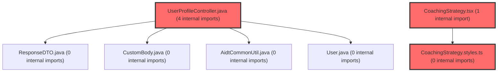

> [!IMPORTANT]
> **⚠️ 수동 검토 권장 (자가힐링 주의)**
>
> AI 자가힐링 결과물이 실제 의도와 다를 수 있으므로, **상세 리뷰 내용에 기반한 수동 점검**을 우선해 주시기 바랍니다. 자가힐링 기능을 활용하실 경우 최종 결과물을 신중하게 확인해 주세요.

# 코드 리뷰 - 98060897

## 코드 복잡도 분석

**분석된 파일**: 21개 / 변경된 파일: 30개


### Import 의존관계 다이어그램



**범례**: 중심 파일 (변경됨) | 많은 import (10개 이상)


### 정상 범위 (NONE)


**`filemapper.xml`** (other)

- 평균 복잡도: **0.243**

- 최대 복잡도: 0.474

- 청크 수: 2개

- 평균 사용처: 7.0곳


**권장사항:**

- 복잡도 정상 범위


**`dgnssmapper.xml`** (other)

- 평균 복잡도: **0.243**

- 최대 복잡도: 0.475

- 청크 수: 2개

- 평균 사용처: 7.0곳


**권장사항:**

- 복잡도 정상 범위


**`dgnsscontroller.java`** (other)

- 평균 복잡도: **0.227**

- 최대 복잡도: 0.470

- 청크 수: 23개

- 평균 사용처: 28.1곳


**권장사항:**

- 파일 크기가 큼 (23개 청크) - 파일 분리 검토


**`securityconfig.java`** (config)

- 평균 복잡도: **0.175**

- 최대 복잡도: 0.464

- 청크 수: 16개

- 평균 사용처: 19.6곳


**권장사항:**

- Config 파일은 높은 연결도가 정상적임


**`apiresponseaspect.java`** (other)

- 평균 복잡도: **0.159**

- 최대 복잡도: 0.467

- 청크 수: 3개

- 평균 사용처: 19.7곳


**권장사항:**

- 복잡도 정상 범위


**`fileservice.java`** (other)

- 평균 복잡도: **0.147**

- 최대 복잡도: 0.468

- 청크 수: 13개

- 평균 사용처: 27.0곳


**권장사항:**

- 복잡도 정상 범위


**`globalexceptionhandler.java`** (config)

- 평균 복잡도: **0.140**

- 최대 복잡도: 0.466

- 청크 수: 17개

- 평균 사용처: 14.8곳


**권장사항:**

- Config 파일은 높은 연결도가 정상적임


**`client.ts`** (other)

- 평균 복잡도: **0.082**

- 최대 복잡도: 0.473

- 청크 수: 33개

- 평균 사용처: 2.8곳


**권장사항:**

- 파일 크기가 큼 (33개 청크) - 파일 분리 검토


**`userprofilecontroller.java`** (other)

- 평균 복잡도: **0.011**

- 최대 복잡도: 0.011

- 청크 수: 1개


**권장사항:**

- 복잡도 정상 범위


**`mdcloggingfilter.java`** (config)

- 평균 복잡도: **0.005**

- 최대 복잡도: 0.008

- 청크 수: 2개


**권장사항:**

- Config 파일은 높은 연결도가 정상적임


**`spusermappingfilter.java`** (config)

- 평균 복잡도: **0.004**

- 최대 복잡도: 0.004

- 청크 수: 1개


**권장사항:**

- Config 파일은 높은 연결도가 정상적임


**`usecoachingstrategy.ts`** (other)

- 평균 복잡도: **0.004**

- 최대 복잡도: 0.013

- 청크 수: 3개


**권장사항:**

- 복잡도 정상 범위


**`dashboardservice.ts`** (other)

- 평균 복잡도: **0.003**

- 최대 복잡도: 0.011

- 청크 수: 50개


**권장사항:**

- 파일 크기가 큼 (50개 청크) - 파일 분리 검토


**`counselingservice.ts`** (other)

- 평균 복잡도: **0.002**

- 최대 복잡도: 0.004

- 청크 수: 12개


**권장사항:**

- 복잡도 정상 범위


**`useapidata.ts`** (other)

- 평균 복잡도: **0.001**

- 최대 복잡도: 0.010

- 청크 수: 36개


**권장사항:**

- 파일 크기가 큼 (36개 청크) - 파일 분리 검토


**`index.ts`** (other)

- 평균 복잡도: **0.001**

- 최대 복잡도: 0.002

- 청크 수: 2개


**권장사항:**

- 복잡도 정상 범위


**`coachingstrategy.styles.ts`** (other)

- 평균 복잡도: **0.001**

- 최대 복잡도: 0.010

- 청크 수: 154개


**권장사항:**

- 파일 크기가 큼 (154개 청크) - 파일 분리 검토


**`studentdashboardpage.tsx`** (component)

- 평균 복잡도: **0.001**

- 최대 복잡도: 0.006

- 청크 수: 39개


**권장사항:**

- 파일 크기가 큼 (39개 청크) - 파일 분리 검토


**`coachingstrategy.tsx`** (other)

- 평균 복잡도: **0.000**

- 최대 복잡도: 0.002

- 청크 수: 5개


**권장사항:**

- 복잡도 정상 범위


**`index.ts`** (other)

- 평균 복잡도: **0.000**

- 최대 복잡도: 0.000

- 청크 수: 1개


**권장사항:**

- 복잡도 정상 범위


**`coachingstrategy.tsx`** (other)

- 평균 복잡도: **0.000**

- 최대 복잡도: 0.002

- 청크 수: 125개


**권장사항:**

- 파일 크기가 큼 (125개 청크) - 파일 분리 검토


---


## 변경 배경

이 커밋은 학습심리정서검사(DGNSS) PDF 일괄 다운로드 기능의 **type=3 (상세+요약 동시 ZIP)** 지원과, 전반적인 **운영 관측성(observability) 개선**을 위한 변경입니다.

- **목적**: PDF 일괄 다운로드 시 상세 보고서와 요약 보고서를 하나의 ZIP 파일로 동시 다운로드 가능하게 하고, 모든 API 호출에 대한 access log 및 MDC 기반 요청 추적 체계를 도입하여 운영 디버깅 효율을 높임
- **도메인**: API (DgnssController/FileService), 인프라/로깅 (MdcLoggingFilter, ApiResponseAspect, GlobalExceptionHandler, SecurityConfig)
- **변경 방향**: 기존 type=1(상세만), type=2(요약만)에서 type=3(상세+요약 동시) 확장, 레거시 `tc_cla_mb_info`/`tc_cla_info`/`stdt_reg_info` 테이블 의존성을 `group_info`/`group_member` 기반으로 마이그레이션, 모든 API 호출에 access log 추가, Spring Web 표준 4xx 예외에 대한 명시적 핸들러 추가

---

## [GOOD] 잘된 점

1. **MDC 기반 요청 추적 체계 도입**: `MdcLoggingFilter`에서 진입 즉시 `requestId`(UUID 8자)와 `clientIp`를 MDC에 push하고, `SpUserMappingFilter`에서 인증 후 `spUserId`/`userNo`를 추가하는 2단계 구조는 매우 적절합니다. 특히 `SpUserMappingFilter`의 매핑 SQL 로그는 본질적으로 `userNo`가 없는 상태에서 찍히므로, `requestId`만이라도 박혀있어야 추적 가능하다는 설계 근거가 주석에 명확히 기술되어 있어 이해와 유지보수에 큰 도움이 됩니다.

2. **FilterRegistrationBean으로 자동 등록 차단**: `MdcLoggingFilter`와 `SpUserMappingFilter`를 `@Component`로 빈 등록하면서도 `FilterRegistrationBean.setEnabled(false)`로 servlet chain 자동 등록을 차단하고, `SecurityConfig`의 security chain에서 명시적으로 순서를 제어한 설계는 Spring Security 필터 체인과 servlet 필터 체인의 차이를 정확히 이해한 결정입니다.

3. **FileService 리팩토링 - 메서드 분리**: 기존 `dgnssDownloadAll` 메서드(약 120줄)에서 `addDgnssFilesToZip`, `prepareAndValidateDgnssFileMap`, `buildDgnssZipEntryPath`, `writeDgnssFileToZip`으로 책임을 분리한 것은 가독성과 테스트 용이성을 크게 향상시킵니다. 특히 `buildDgnssZipEntryPath`에서 동일 파일명 충돌 시 `userId` 접미사, 시퀀스 번호로 fallback 처리하는 로직은 실무에서 자주 발생하는 문제를 잘 예방했습니다.

---

## 변경사항 요약

- **DgnssController**: `dgnssDownloadAll`에 try-catch + 오류 로깅 추가, `dgnssPdfStudentSearch`에 `type` 파라미터(@Parameter description) 추가
- **UserProfileController**: `/status` 엔드포인트에 `spUser == null` 가드 추가 (인증되지 않은 요청 처리)
- **ApiResponseAspect**: 모든 컨트롤러 호출에 `API GET /path 200 (42ms)` 형식의 access log 추가
- **GlobalExceptionHandler**: `HttpRequestMethodNotSupportedException`(405), `HttpMediaTypeNotSupportedException`(415), `MissingServletRequestParameterException`(400), `MethodArgumentTypeMismatchException`(400), `HttpMessageNotReadableException`(400) 핸들러 추가
- **MdcLoggingFilter (신규)**: 요청 진입 시 MDC에 `requestId`, `clientIp` 설정, finally에서 `MDC.clear()`
- **SecurityConfig**: `MdcLoggingFilter`를 `BearerTokenAuthenticationFilter` 앞에 등록, 두 필터의 자동 등록 차단
- **SpUserMappingFilter**: MDC에 `spUserId`(앞 8자), `userNo` 추가
- **FileService**: `dgnssDownloadAll` 리팩토링 - type=3 지원, 메서드 분리, 로깅 강화, ZIP 내 폴더 구조 지원
- **FileMapper.xml**: SQL JOIN 조건을 `group_info`/`group_member` 기반으로 변경, `userNm` 조회를 `COALESCE(gm_st.nickname, tdri.stdt_id)`로 변경, 권한 체크 로직을 `group_info` 기반으로 재작성
- **application.yml**: 로그 패턴에 `%X{requestId}`, `%X{spUserId}`, `%X{userNo}`, `%X{clientIp}` 추가

---

## [ISSUE] 개선이 필요한 부분

### Critical (즉시 수정 필요)

없음

### High (우선 수정 권장)

**1. `ApiResponseAspect.logAccess`에서 `statusCode`가 0으로 남는 케이스 존재**

`enrichResponse` 메서드에서 `statusCode`는 `result instanceof ResponseDTO && body instanceof CustomBody` 조건을 만족할 때만 갱신됩니다. 만약 컨트롤러가 `ResponseDTO`가 아닌 타입(예: `ResponseEntity<StreamingResponseBody>`)을 반환하면 `statusCode`가 0으로 로깅됩니다. 실제로 `DgnssController.dgnssDownloadAll`은 `ResponseEntity<StreamingResponseBody>`를 반환하므로, 이 API의 access log는 항상 `statusCode=0`으로 기록됩니다.

- **위치**: `ApiResponseAspect.java` 라인 52-53
- **기존 코드**:
```java
int statusCode = 0;
if (result instanceof ResponseDTO<?> responseDTO
        && responseDTO.getBody() instanceof CustomBody oldBody) {
    statusCode = oldBody.resultCode();
```
- **해결 방안**: `ResponseEntity`인 경우 `getStatusCodeValue()`를 읽도록 분기 처리
```java
int statusCode = 0;
if (result instanceof ResponseDTO<?> responseDTO
        && responseDTO.getBody() instanceof CustomBody oldBody) {
    statusCode = oldBody.resultCode();
} else if (result instanceof org.springframework.http.ResponseEntity<?> resEntity) {
    statusCode = resEntity.getStatusCodeValue();
}
```

**2. `FileService.dgnssDownloadAll` - ZIP 생성 중 예외 발생 시 `baos` 리소스 누수 가능성**

`ByteArrayOutputStream baos = new ByteArrayOutputStream()`가 try-with-resources 블록 밖에서 선언되고, `ZipOutputStream`만 try-with-resources로 감싸져 있습니다. `ZipOutputStream` 생성자에 `baos`를 전달하므로 `zipOut.close()` 시 `baos`도 flush되지만, 만약 `ZipOutputStream` 생성 이전에 예외가 발생하면 `baos`가 정리되지 않습니다. 다만 `ByteArrayOutputStream`은 메모리 기반이고 `close()`가 no-op에 가까워 실질적 리스크는 낮지만, 일관성을 위해 try-with-resources로 감싸는 것이 좋습니다.

- **위치**: `FileService.java` 라인 640-641 (Diff 기준)
- **기존 코드**:
```java
ByteArrayOutputStream baos = new ByteArrayOutputStream();
try (ZipOutputStream zipOut = new ZipOutputStream(baos, StandardCharsets.UTF_8)) {
```
- **해결 방안**:
```java
try (ByteArrayOutputStream baos = new ByteArrayOutputStream();
     ZipOutputStream zipOut = new ZipOutputStream(baos, StandardCharsets.UTF_8)) {
```

**3. `SpUserMappingFilter` - `spUserId` 길이가 8 미만일 때 MDC에 아무것도 기록되지 않음**

`spUserId`가 null이거나 8자 미만이면 MDC에 `spUserId`가 기록되지 않습니다. `spUserId`가 UUID 형태가 아닌 짧은 식별자일 가능성도 있는데, 이 경우 로그에서 사용자 식별이 어려워집니다.

- **위치**: `SpUserMappingFilter.java` 라인 49-51
- **기존 코드**:
```java
String spUserId = spUser.spUserId();
if (spUserId != null && spUserId.length() >= 8) {
    MDC.put(MdcLoggingFilter.MDC_SP_USER_ID, spUserId.substring(0, 8));
}
```
- **해결 방안**: 길이 제한 없이 전체 값을 기록하거나, 짧은 경우 그대로 기록
```java
String spUserId = spUser.spUserId();
if (spUserId != null && !spUserId.isBlank()) {
    MDC.put(MdcLoggingFilter.MDC_SP_USER_ID,
            spUserId.length() > 8 ? spUserId.substring(0, 8) : spUserId);
}
```

### Medium (개선 권장)

**4. `GlobalExceptionHandler` - 4xx 핸들러들의 `resultCode` 누락**

새로 추가된 4xx 핸들러들은 모두 `AidtCommonUtil.makeResultFail(null, errorData, message)`를 사용하는데, 이 메서드가 내부적으로 적절한 HTTP status code를 `resultCode`에 설정하는지 확인이 필요합니다. 기존 `handleAuthFailed`는 `HttpStatus.UNAUTHORIZED.value()`를 `errorData`에만 넣고 `makeResultFail`에 전달하지 않는데, 만약 `makeResultFail`이 `resultCode`를 항상 500 또는 200으로 설정한다면 클라이언트가 실제 HTTP status code와 응답 body의 `resultCode`가 불일치할 수 있습니다.

- **위치**: `GlobalExceptionHandler.java` 라인 108-115, 128-135, 148-155, 168-175, 188-195
- **제안**: `makeResultFail` 시그니처를 확인하여 `resultCode`가 올바르게 설정되는지 검증하고, 필요하면 `HttpStatus` 값을 명시적으로 전달하도록 수정

**5. `FileMapper.xml` - `selectTcDgnssInfoWithId`에서 `group_info` LEFT JOIN 시 중복 가능성**

`selectTcDgnssInfoWithId` 쿼리에서 `LEFT JOIN group_info gi ON tdi.cla_id = gi.cla_id`로 조인하는데, `group_info`에 동일 `cla_id`에 대해 여러 레코드가 존재할 경우 결과가 중복될 수 있습니다. `group_info`의 `cla_id`가 unique하지 않다면 `DISTINCT` 또는 `LIMIT 1`이 필요할 수 있습니다.

---

## 주요 파일 분석

### `MdcLoggingFilter.java` (신규)

**변경 내용:**
모든 HTTP 요청 진입 시 MDC에 `requestId`(UUID 8자)와 `clientIp`를 push하고, finally에서 `MDC.clear()`로 스레드 풀 잔재를 방지하는 OncePerRequestFilter

**개선 제안:**
1. `resolveClientIp`에서 `X-Forwarded-For` 헤더의 신뢰성 문제
   - **위치**: 라인 62-68
   - **내용**: `X-Forwarded-For`는 클라이언트가 위조할 수 있는 헤더입니다. 내부 LB/프록시를 거치는 환경이라면, 신뢰할 수 있는 프록시 IP 목록을 기준으로 실제 클라이언트 IP를 추출하는 로직이 필요할 수 있습니다. 다만 현재 구조는 대부분의 운영 환경에서 실용적으로 동작하므로 Medium 수준의 제안입니다.

### `FileService.java` - `dgnssDownloadAll` 리팩토링

**변경 내용:**
type=3(상세+요약 동시 ZIP) 지원, 메서드 분리, 로깅 강화, ZIP 내 폴더 구조 지원

**개선 제안:**
1. `addDgnssFilesToZip`에서 `usedZipEntries`를 `HashSet`으로 관리하는 것은 적절하나, `buildDgnssZipEntryPath`가 매번 `usedZipEntries.add()`를 호출하고 성공 여부로 판단하는 방식은 부수 효과(side effect)가 있습니다. `contains()`로 먼저 확인 후 `add()`하는 것이 의도를 더 명확히 드러냅니다.
   - **위치**: `FileService.java` 라인 680-683 (Diff 기준)
   - **기존 코드**:
   ```java
   if (usedZipEntries.add(entryPath)) {
       return entryPath;
   }
   ```
   - **해결 방안**:
   ```java
   if (!usedZipEntries.contains(entryPath)) {
       usedZipEntries.add(entryPath);
       return entryPath;
   }
   ```

---

## 최종 평가

**결론**:
- [ ] [OK] **승인 (Approved)**
- [ ] [WARN] **조건부 승인 (Approved with Comments)**
- [X] [FIX] **수정 필요 (Changes Requested)**

**종합 의견:**
전반적으로 매우 잘 설계된 커밋입니다. MDC 기반 요청 추적, 4xx 예외 핸들러 분리, FileService 리팩토링 모두 운영 안정성과 유지보수성을 크게 향상시키는 방향입니다. 다만 **High 이슈 3건**(statusCode 0 문제, ByteArrayOutputStream 리소스 관리, spUserId 8자 미만 케이스)은 실제 운영 로그의 정확성과 직결되므로 커밋 전 수정을 권장합니다. 특히 `ApiResponseAspect`의 `statusCode=0` 문제는 `dgnssDownloadAll`(StreamingResponseBody 반환)의 access log가 항상 0으로 기록되어 모니터링에 혼란을 줄 수 있습니다.