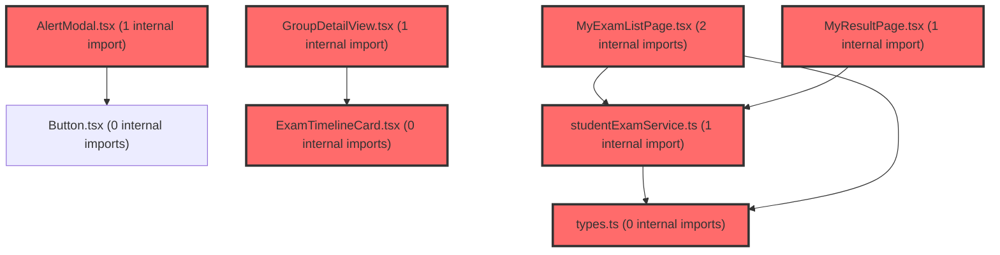

# 코드 리뷰 - 99b6d260

## 코드 복잡도 분석

**분석된 파일**: 9개 / 변경된 파일: 10개


### Import 의존관계 다이어그램



**범례**: 중심 파일 (변경됨) | 많은 import (10개 이상)


### 정상 범위 (NONE)


**`types.ts`** (other)

- 평균 복잡도: **0.005**

- 최대 복잡도: 0.008

- 청크 수: 4개


**권장사항:**

- 복잡도 정상 범위


**`studentexamservice.ts`** (other)

- 평균 복잡도: **0.004**

- 최대 복잡도: 0.008

- 청크 수: 17개


**권장사항:**

- 복잡도 정상 범위


**`assessmentpagev2.tsx`** (component)

- 평균 복잡도: **0.002**

- 최대 복잡도: 0.010

- 청크 수: 71개


**권장사항:**

- 파일 크기가 큼 (71개 청크) - 파일 분리 검토


**`examtimelinecard.tsx`** (other)

- 평균 복잡도: **0.001**

- 최대 복잡도: 0.005

- 청크 수: 10개


**권장사항:**

- 복잡도 정상 범위


**`groupdetailview.tsx`** (component)

- 평균 복잡도: **0.001**

- 최대 복잡도: 0.004

- 청크 수: 14개


**권장사항:**

- 복잡도 정상 범위


**`schoolrecordpanel.tsx`** (other)

- 평균 복잡도: **0.001**

- 최대 복잡도: 0.007

- 청크 수: 58개


**권장사항:**

- 파일 크기가 큼 (58개 청크) - 파일 분리 검토


**`myexamlistpage.tsx`** (component)

- 평균 복잡도: **0.001**

- 최대 복잡도: 0.016

- 청크 수: 79개


**권장사항:**

- 파일 크기가 큼 (79개 청크) - 파일 분리 검토


**`myresultpage.tsx`** (component)

- 평균 복잡도: **0.000**

- 최대 복잡도: 0.008

- 청크 수: 92개


**권장사항:**

- 파일 크기가 큼 (92개 청크) - 파일 분리 검토


**`alertmodal.tsx`** (other)

- 평균 복잡도: **0.000**

- 최대 복잡도: 0.006

- 청크 수: 28개


**권장사항:**

- 파일 크기가 큼 (28개 청크) - 파일 분리 검토


---


## 변경 배경

이 커밋은 검사 시스템의 Phase 1 이슈를 일괄 해결합니다. 주요 목적은 (1) 생기부 더보기 기능 추가로 긴 텍스트 가독성 개선, (2) 탈퇴/방출된 그룹의 학생도 과거 검사 결과를 조회할 수 있도록 `hasResult` 로직 개선, (3) 학생이 0명일 때 검사 시작을 차단하는 UX 개선, (4) `window.confirm()`을 제거하고 일관된 `AlertModal`로 검사 취소/종료 확인 로직 통합입니다. 또한 React Compiler 경고를 해결하기 위해 `useCallback`/`useEffect`의 의존성 배열을 `user?.id`에서 `user`로 변경하였습니다.

## 변경사항 요약

6개 파일이 변경되었으며, 핵심 변경은 다음과 같습니다:

- **SchoolRecordPanel.tsx**: `ResultText`와 `SavedCardPreview`에 2줄 clamp(`-webkit-line-clamp: 2`) 적용, `ToggleTextButton`으로 펼치기/접기 토글 구현
- **studentExamService.ts**: `hasResult` 판단 로직을 `eakAt === 'Y'` 단일 플래그에서 `status === 'completed' || status === 'result_ready'` 상태 기반으로 변경
- **MyExamListPage.tsx / MyResultPage.tsx**: `memberGroups` 필터링 제거, `includeInactive=true`로 조회한 모든 그룹 대상으로 검사 목록/결과 조회
- **AssessmentPageV2.tsx**: `activeStudentCount` 계산 로직 추가, 학생 0명 시 검사 시작 차단 팝업, 검사 취소/종료 시 `AlertModal` 2버튼 확인 모달 표시
- **AlertModal.tsx**: `onConfirm` async 지원, `cancelText` prop 추가, 2버튼 모드(`ButtonGroup`) 구현
- **ExamTimelineCard.tsx / GroupDetailView.tsx**: `activeStudentCount` prop 전달

---

## 상세 분석

### 1. SchoolRecordPanel.tsx - 생기부 더보기 기능 (HSJ-72)

**변경 내용**: `ResultText`와 `SavedCardPreview` 스타일드 컴포넌트에 `$isExpanded` prop을 추가하여, 접힌 상태에서는 `-webkit-line-clamp: 2`로 2줄 제한을 적용하고, 펼친 상태에서는 전체 텍스트를 표시합니다. `ToggleTextButton` 컴포넌트를 새로 추가하여 `ChevronDown`/`ChevronUp` 아이콘과 함께 "더보기"/"접기" 텍스트를 표시합니다.

**핵심 로직**:
```typescript
// SchoolRecordPanel.tsx - L552~L553
const [expandedSavedRecords, setExpandedSavedRecords] = useState<Set<string>>(new Set());
const [isResultExpanded, setIsResultExpanded] = useState(false);

// L626~L636 - 토글 함수
const toggleSavedRecord = (id: string) => {
  setExpandedSavedRecords((prev) => {
    const next = new Set(prev);
    if (next.has(id)) {
      next.delete(id);
    } else {
      next.add(id);
    }
    return next;
  });
};
```

**평가**: `Set<string>`을 사용하여 각 저장 기록의 확장 상태를 관리하는 방식은 효율적입니다. `isLongText` 판단 기준이 `record.content.length > 100`인데, 이는 한글 기준 약 50~60자로 2줄을 초과하는지 정확히 판단하기 어렵습니다. 하지만 이는 UX 판단 영역으로, 명백한 버그는 아닙니다. 추후 실제 텍스트 렌더링 높이를 측정하는 방식으로 개선할 수 있습니다.

### 2. studentExamService.ts - hasResult 로직 개선 (HSJ-71)

**변경 내용**: `mapToListItem` 함수에서 `hasResult`를 `item.eakAt === 'Y'`에서 `status === 'completed' || status === 'result_ready'`로 변경하였습니다.

**변경 전**:
```typescript
hasResult: item.eakAt === 'Y',
```

**변경 후**:
```typescript
// HSJ-71: eakAt 플래그 대신 상태 기반으로 결과 조회 가능 여부 판단
// 검사 완료(completed) 또는 검사 종료(result_ready) 상태면 결과 조회 가능
hasResult: status === 'completed' || status === 'result_ready',
```

**평가**: `eakAt` 플래그는 응시 여부만 나타내므로, KICKED(방출) 상태의 학생이 과거에 제출한 검사 결과를 조회할 수 없는 문제가 있었습니다. 상태 기반으로 변경함으로써, 검사가 완료되었거나 종료된 경우에는 항상 결과 조회가 가능해집니다. 이는 비즈니스 로직 관점에서 올바른 개선입니다.

### 3. MyExamListPage.tsx / MyResultPage.tsx - 그룹 필터링 제거

**변경 내용**: `getMyGroups(user.id, true)`로 조회한 그룹에서 `myRole === 'member'` 필터링을 제거하고, 모든 그룹을 대상으로 검사 목록/결과를 조회합니다.

**변경 전**:
```typescript
const memberGroups = groups.filter((g) => g.myRole === 'member');
if (memberGroups.length === 0) { ... }
const results = await Promise.all(memberGroups.map(...));
```

**변경 후**:
```typescript
if (groups.length === 0) { ... }
const results = await Promise.all(groups.map(...));
```

**평가**: `includeInactive=true`로 조회하면 탈퇴/방출된 그룹도 포함되므로, `myRole` 필터링을 제거해야 해당 그룹의 과거 검사 결과를 조회할 수 있습니다. 이는 HSJ-71 이슈 해결의 핵심 변경입니다. 단, `getMyGroups` API가 `includeInactive=true`일 때 `myRole`이 `'kicked'` 또는 `'left'`인 그룹도 반환하는지 확인이 필요하나, 이는 API 스펙 영역입니다.

### 4. AssessmentPageV2.tsx - 검사 시작/종료/취소 UX 개선 (HSJ-70, HSJ-66)

**변경 내용**:
- `activeStudentCount`를 `useMemo`로 계산하여 `members.filter((m) => m.status === 'active').length` 값을 전달
- `handleStartExam`에서 `activeStudentCount === 0`일 때 `AlertModal`로 차단 팝업 표시
- `handleEndExam` / `handleCancelExam`에서 `AlertModal` 2버튼 모드로 확인 후 실행

**핵심 로직**:
```typescript
// L132~L141 - alertModal 상태
const [alertModal, setAlertModal] = useState<{
  isOpen: boolean;
  title: string;
  message: string;
  onConfirm?: () => void | Promise<void>;
}>({
  isOpen: false,
  title: '',
  message: '',
});

// L147~L149 - activeStudentCount 계산
const activeStudentCount = useMemo(() => {
  return members.filter((m) => m.status === 'active').length;
}, [members]);
```

**평가**: `AlertModal` 통합으로 `window.confirm()`을 제거하고 일관된 UI를 제공한 점은 좋습니다. `activeStudentCount`를 `useMemo`로 계산하여 불필요한 재계산을 방지한 점도 적절합니다. 다만 `handleEndExam`/`handleCancelExam`의 `onConfirm` 콜백에서 `catch` 블록이 비어 있어(`// noop`), API 호출 실패 시 사용자에게 오류 피드백이 전달되지 않습니다. `AlertModal.handleConfirm`에서 `onConfirm?.()` 호출 후 `onClose()`가 자동 실행되므로, 오류 발생 시에도 모달이 닫혀 사용자는 아무 일도 일어나지 않은 것으로 인지할 수 있습니다.

### 5. AlertModal.tsx - 2버튼 모드 및 async onConfirm 지원

**변경 내용**: `onConfirm`과 `cancelText` prop을 추가하고, `onConfirm`이 존재하면 2버튼 모드(`ButtonGroup`)로 렌더링합니다. `handleConfirm`은 `async`로 선언되어 `await onConfirm?.()` 후 `onClose()`를 호출합니다.

**핵심 로직**:
```typescript
// L123~L131
const isConfirmMode = !!onConfirm;

const handleConfirm = async () => {
  await onConfirm?.();
  onClose();
};
```

**평가**: `async/await` 패턴을 지원하여 비동기 작업(API 호출 등)을 `onConfirm`에서 처리할 수 있게 된 점은 좋습니다. `isConfirmMode`가 `true`일 때만 2버튼 레이아웃을 렌더링하므로, 기존 단순 확인 모달과의 하위 호환성이 유지됩니다. `max-width`를 `384px`에서 `420px`로 증가시킨 것도 2버튼 레이아웃에 적절한 변경입니다.

### 6. React Hook 의존성 배열 수정

**변경 내용**: `useCallback`과 `useEffect`의 의존성 배열에서 `user?.id`를 `user`로 변경하였습니다.

**변경 전**:
```typescript
}, [user?.id]);
```

**변경 후**:
```typescript
}, [user]);
```

**평가**: React Compiler(React Forget)는 의존성 배열에 조건부 체이닝(`?.`)이 포함된 표현식을 경고합니다. `user?.id`는 `user` 객체의 참조가 변경되지 않아도 `user.id` 값이 변경되면 새로운 의존성으로 인식되어야 하지만, React Compiler는 이를 정확히 추적하지 못할 수 있습니다. `user` 객체 자체를 의존성으로 변경하면 React Compiler가 `user` 객체의 참조 변경을 감지하여 올바르게 동작합니다. 단, `user` 객체가 불변성을 유지하지 않고 매 렌더링마다 새로 생성된다면 불필요한 재실행이 발생할 수 있으므로, `user` 객체가 안정적인 참조를 유지하는지 확인이 필요합니다.

---

## [ISSUE] 발견된 이슈

1. **[WARN]**: `handleEndExam` / `handleCancelExam`의 `onConfirm` 콜백에서 API 실패 시 오류 피드백 부재
   - **위치**: AssessmentPageV2.tsx, L477~L506 (handleEndExam), L509~L537 (handleCancelExam)
   - **설명**: `catch` 블록이 비어 있어(`// noop`), `endExam` 또는 `cancelExam` API 호출이 실패해도 사용자에게 아무런 피드백이 없습니다. `AlertModal.handleConfirm`에서 `onConfirm?.()` 호출 후 `onClose()`가 자동 실행되므로, 오류 발생 시에도 모달이 닫혀 사용자는 작업이 성공한 것으로 오인할 수 있습니다.
   - **권장 개선**: `catch` 블록에서 오류 메시지를 포함한 새로운 `AlertModal`을 열거나, 토스트 메시지를 표시하는 것이 바람직합니다. 현재 코드베이스에 토스트 컴포넌트가 있는지 확인이 필요하여 구체적인 수정 코드는 제시하지 않습니다.

2. **[INFO]**: `SchoolRecordPanel`의 `isLongText` 판단 기준이 단순 길이(`> 100`) 기반
   - **위치**: SchoolRecordPanel.tsx, L758
   - **설명**: `const isLongText = record.content.length > 100;`으로 2줄 초과 여부를 판단합니다. 한글은 영문보다 렌더링 폭이 넓어, 실제 2줄을 초과하는 텍스트가 `length > 100` 조건을 만족하지 못할 수 있습니다. 반대로 영문은 100자가 2줄을 훨씬 초과할 수 있습니다.
   - **권장 개선**: 실제 DOM 요소의 높이를 측정하거나, CSS `line-clamp`와 `overflow` 속성만으로 처리하고 토글 버튼은 항상 표시하는 방식도 고려할 수 있습니다.

---

## 최종 평가

**결론**: **조건부 승인 (Approved with Comments)**

**코멘트**: 이 커밋은 검사 시스템의 여러 UX 이슈를 체계적으로 해결하고, React Compiler 경고를 정리한 의미 있는 변경입니다. 특히 `window.confirm()`을 제거하고 `AlertModal`로 통합한 점, `hasResult` 로직을 상태 기반으로 개선하여 탈퇴/방출 학생도 결과를 조회할 수 있게 한 점, 생기부 더보기 기능으로 가독성을 개선한 점이 돋보입니다. `handleEndExam`/`handleCancelExam`의 오류 처리 부재는 추후 개선이 필요하나, 현재 기능 동작에는 영향을 미치지 않으므로 조건부 승인합니다.