> [!IMPORTANT]
> **⚠️ 수동 검토 권장 (자가힐링 주의)**
>
> AI 자가힐링 결과물이 실제 의도와 다를 수 있으므로, **상세 리뷰 내용에 기반한 수동 점검**을 우선해 주시기 바랍니다. 자가힐링 기능을 활용하실 경우 최종 결과물을 신중하게 확인해 주세요.

## 코드 복잡도 분석

**분석된 파일**: 1개 / 변경된 파일: 1개


### Import 의존관계 다이어그램

```mermaid
flowchart TD
    F0["GroupMemberMapper.java (0 imports)"]
    F1["GroupInfo.java (0 imports)"]
    F2["GroupMember.java (0 imports)"]
    F3["GroupQueryMapper.java (0 imports)"]
    F4["DgnssService.java (0 imports)"]
    F5["GroupInfoMapper.java (0 imports)"]
    F6["MemberType.java (0 imports)"]
    F7["UserStatus.java (0 imports)"]
    F8["MemberStatus.java (0 imports)"]
    F9["ConvertUtils.java (0 imports)"]
    F10["EmailVerificationService.java (0 imports)"]
    F11["MemberService.java (0 imports)"]
    F12["SchoolLevel.java (0 imports)"]
    F13["UserMapper.java (0 imports)"]
    F14["PageUtil.java (0 imports)"]
    F15["User.java (0 imports)"]
    F16["GroupService.java (17 imports)"]:::center
    F17["IdGenerator.java (0 imports)"]
    F16 --> F0
    F16 --> F1
    F16 --> F2
    F16 --> F3
    F16 --> F4
    F16 --> F5
    F16 --> F6
    F16 --> F7
    F16 --> F8
    F16 --> F9
    F16 --> F10
    F16 --> F11
    F16 --> F12
    F16 --> F13
    F16 --> F14
    F16 --> F15
    F16 --> F17
    classDef center fill:#ff6b6b,stroke:#333,stroke-width:3px
    classDef high fill:#ffd93d,stroke:#333,stroke-width:2px
```



**범례**: 중심 파일 (변경됨) | 많은 import (10개 이상)


### 모니터링 권장 (LOW)


**`groupservice.java`** (other)

- 평균 복잡도: **0.264**

- 최대 복잡도: 0.518

- 청크 수: 2개

- 평균 사용처: 15.0곳


**권장사항:**

- **모니터링 권장**: 복잡도가 높은 편이지만 영향 범위 제한적


---

# 게스트 참가 시 이메일 중복 검증 추가 코드 리뷰

## 결론: 승인 (Approved)

CP님께서 제출하신 커밋 9a245ae8는 **기능적으로 완전하며, 비즈니스 로직을 보완하는 중요한 개선사항**입니다. 코드는 기존 패턴과 일관성을 유지하고 있으며, 명확한 오류 메시지를 통해 사용자 경험을 향상시킵니다.

## 변경 사항 요약

`backend/src/main/java/com/vs/meta/api/group/service/GroupService.java` 파일의 `joinGroupAsGuest` 메서드에 5줄의 검증 코드를 추가했습니다:

```java
User existingUser = userMapper.findByEmail(email);
if (existingUser != null) {
    throw new IllegalArgumentException("이미 가입된 회원 이메일입니다. 회원으로 로그인하여 그룹에 참가해주세요.");
}
```

이 변경으로 게스트로 그룹에 참가할 때, 해당 이메일로 이미 가입된 정회원이 존재하는 경우 참가를 차단하게 되었습니다.

## 상세 분석

### 1. 비즈니스 로직 보완의 필요성

기존 `joinGroupAsGuest` 메서드는 다음 순서로 검증을 수행했습니다:
1. 이메일 필수 여부 검증
2. 이메일 인증 여부 검증 (`emailVerificationService.isVerified(email)`)
3. 초대코드 유효성 검증
4. 그룹 최대 인원 검증
5. 성별 필수값 및 유효성 검증

**문제점**: 이메일 인증만 통과하면 기존 회원이더라도 게스트로 중복 참가할 수 있었습니다.

**해결 방안**: 이메일 인증 검증 직후에 `userMapper.findByEmail(email)` 호출을 추가하여 시스템에 등록된 정회원 여부를 확인합니다.

### 2. 코드 구현 분석

추가된 코드는 다음과 같은 장점을 가집니다:

**일관성 유지**: 기존에 사용하던 `IllegalArgumentException`을 그대로 사용하여 예외 처리 패턴을 유지합니다.

**명확한 오류 메시지**: "이미 가입된 회원 이메일입니다. 회원으로 로그인하여 그룹에 참가해주세요."라는 메시지는:
- 문제 원인을 명확히 설명합니다.
- 사용자에게 해결 방법(회원 로그인)을 제시합니다.
- 친절한 어조로 사용자 경험을 고려했습니다.

**적절한 위치**: 이메일 인증 검증 직후에 배치되어 논리적 흐름이 자연스럽습니다:
1. 이메일 존재 여부 → 2. 이메일 인증 여부 → 3. 기존 회원 여부 → 4. 초대코드 검증

### 3. 기술적 구현 검토

**트랜잭션 처리**: `@Transactional` 어노테이션이 적용된 메서드 내부이므로, 예외 발생 시 롤백이 정상적으로 작동합니다.

**의존성 주입**: `UserMapper`는 이미 `GroupService`에 `private final` 필드로 선언되어 있었으므로, 추가적인 의존성 변경 없이 활용할 수 있었습니다.

**null 안전성**: `findByEmail` 메서드는 존재하지 않을 경우 `null`을 반환하므로, `null` 체크가 적절합니다.

## 개선 제안 (Medium)

### 1. 이메일 대소문자 처리 검증

현재 구현에서는 `findByEmail` 메서드의 내부 구현에 따라 이메일 비교 시 대소문자 처리가 달라질 수 있습니다. 이메일 주소는 표준적으로 대소문자를 구분하지 않으므로, 다음 중 하나의 방식으로 처리하는 것이 바람직합니다:

**방법 1: 데이터베이스 수준에서 해결**
```sql
-- MySQL 예시: 컬럼에 case-insensitive collation 적용
ALTER TABLE users MODIFY email VARCHAR(255) COLLATE utf8mb4_unicode_ci;
```

**방법 2: MyBatis 매퍼에서 해결**
```xml
<!-- UserMapper.xml -->
<select id="findByEmail" resultType="User">
    SELECT * FROM users WHERE LOWER(email) = LOWER(#{email})
</select>
```

**방법 3: 서비스 계층에서 해결**
```java
User existingUser = userMapper.findByEmail(email.toLowerCase());
```

### 2. 예외 메시지 상수화 (선택적)

프로젝트의 기존 패턴을 따르는 것이 중요하지만, 향후 유지보수성을 위해 예외 메시지를 상수로 분리할 수 있습니다:

```java
// ErrorMessages.java
public class ErrorMessages {
    public static final String DUPLICATE_MEMBER_EMAIL = 
        "이미 가입된 회원 이메일입니다. 회원으로 로그인하여 그룹에 참가해주세요.";
}

// GroupService.java
if (existingUser != null) {
    throw new IllegalArgumentException(ErrorMessages.DUPLICATE_MEMBER_EMAIL);
}
```

## 정리

CP님의 이번 커밋은 다음과 같은 가치를 제공합니다:

1. **시스템 무결성 강화**: 게스트와 회원 간의 경계를 명확히 하여 데이터 일관성을 보장합니다.
2. **사용자 경험 개선**: 잘못된 경로로 시도하는 사용자에게 명확한 안내를 제공합니다.
3. **보안성 향상**: 인증된 이메일이라도 권한 없는 접근을 차단합니다.
4. **코드 품질 유지**: 기존 아키텍처 패턴과 일관성을 유지하며 변경을 최소화했습니다.

이 변경사항은 현재 프로덕션 환경에 안전하게 적용될 수 있으며, 기존 기능에 부정적인 영향을 주지 않습니다. Medium 수준의 제안사항은 향후 리팩토링 시 고려할 만한 사항이지만, 현재 구현으로도 기능적 완성도를 충분히 갖추고 있습니다.