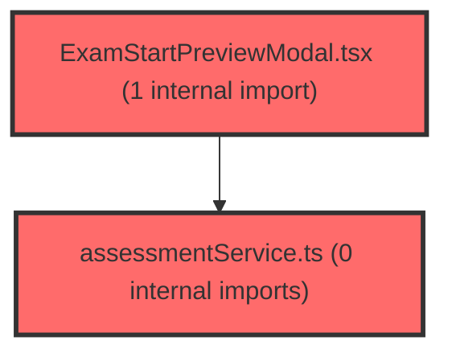

> [!IMPORTANT]
> **⚠️ 수동 검토 권장 (자가힐링 주의)**
>
> AI 자가힐링 결과물이 실제 의도와 다를 수 있으므로, **상세 리뷰 내용에 기반한 수동 점검**을 우선해 주시기 바랍니다. 자가힐링 기능을 활용하실 경우 최종 결과물을 신중하게 확인해 주세요.

# 코드 리뷰 - 9d0c3de7

## 코드 복잡도 분석

**분석된 파일**: 6개 / 변경된 파일: 6개


### Import 의존관계 다이어그램



**범례**: 중심 파일 (변경됨) | 많은 import (10개 이상)


### 정상 범위 (NONE)


**`assessmentservice.ts`** (other)

- 평균 복잡도: **0.003**

- 최대 복잡도: 0.007

- 청크 수: 28개


**권장사항:**

- 파일 크기가 큼 (28개 청크) - 파일 분리 검토


**`ai.ts`** (other)

- 평균 복잡도: **0.003**

- 최대 복잡도: 0.010

- 청크 수: 26개


**권장사항:**

- 파일 크기가 큼 (26개 청크) - 파일 분리 검토


**`assessmentpage.tsx`** (component)

- 평균 복잡도: **0.002**

- 최대 복잡도: 0.011

- 청크 수: 51개


**권장사항:**

- 파일 크기가 큼 (51개 청크) - 파일 분리 검토


**`examstartpreviewmodal.tsx`** (component)

- 평균 복잡도: **0.000**

- 최대 복잡도: 0.006

- 청크 수: 39개


**권장사항:**

- 파일 크기가 큼 (39개 청크) - 파일 분리 검토


**`generalsection.tsx`** (other)

- 평균 복잡도: **0.000**

- 최대 복잡도: 0.000

- 청크 수: 35개


**권장사항:**

- 파일 크기가 큼 (35개 청크) - 파일 분리 검토


**`index.ts`** (other)

- 평균 복잡도: **0.000**

- 최대 복잡도: 0.002

- 청크 수: 5개


**권장사항:**

- 복잡도 정상 범위


---


## 변경 배경

이 커밋은 두 가지 주요 변경을 포함합니다: (1) 2회차 출제 시 사전 검증(preview) 기능을 추가하여 차단 학생이 있는 경우 경고 모달을 표시하고, (2) AI 서비스 레이어에 Agent Provider 폴백을 추가하여 Gemini API 키가 없을 때도 AI 기능이 동작하도록 합니다.

- **목적**: 2회차 출제 전 사전 검증 UX 개선 및 AI 서비스 가용성 향상
- **도메인**: 비즈니스 로직 (2회차 검증) / API (AI Provider 폴백) / UI (ExamStartPreviewModal)
- **변경 방향**: 기존 `handleCreateAssessment`에서 `doCreateExam`을 분리하여 2회차 검증 로직을 삽입; AI Provider 체인에 agent 폴백 추가

## [GOOD] 잘된 점

1. **`doCreateExam` 분리 리팩토링**: 기존 `handleCreateAssessment`에서 실제 검사 생성 로직을 `doCreateExam`으로 분리하고, `handleCreateAssessment`는 검증/라우팅 역할만 담당하도록 개선한 점이 좋습니다. 관심사 분리 원칙을 잘 지켰습니다. `doCreateExam`은 `useCallback`으로 메모이제이션되어 불필요한 재생성을 방지합니다.

2. **모달 상태 관리의 명확성**: `previewModal` 상태를 `isOpen`, `preview`, `pendingData`, `pendingClaId`로 구조화하여, 모달이 열린 상태에서도 이후 실행될 액션의 컨텍스트를 보존한 설계가 깔끔합니다. `pendingData`와 `pendingClaId`를 보존함으로써 사용자가 모달에서 "계속 출제"를 선택했을 때 원래 입력했던 데이터를 그대로 사용할 수 있습니다.

3. **AI Provider 폴백 체인**: `gemini -> agent -> mock` 순서로 우선순위를 두고, `isAgentConfigured()`로 `AGENT_API_URL` 존재 여부를 확인하는 방식은 확장성과 복원력 측면에서 좋은 접근입니다. `getProvider` 함수가 단순히 환경 변수 존재 여부만 확인하므로, 새로운 Provider 추가 시 최소한의 변경만 필요합니다.

## 변경사항 요약

- `assessmentService.ts`에 `previewExamStart` API 함수와 `ExamStartPreviewStudent`, `ExamStartPreviewResponse` 타입 추가
- `ExamStartPreviewModal.tsx` 신규 생성 (2회차 출제 사전 검증 결과 표시 모달)
- `GeneralSection.tsx`에서 미사용 `UploadSection` 관련 styled-components 및 import 제거
- `AssessmentPage.tsx`에서 `doCreateExam` 분리 및 2회차 검증 로직 추가, `handlePreviewConfirm` 콜백 추가
- `ai.ts`에 `'agent'` Provider 타입 추가 및 `callAgentProvider` 함수 구현

---

## [ISSUE] 개선이 필요한 부분

### Critical (즉시 수정 필요)

없음

### High (우선 수정 권장)

**1. `callAgentProvider`에서 `agentResetSession` 호출이 불필요함**

- **파일**: `frontend/src/shared/services/ai.ts`
- **위치**: 157-158번째 줄 (`callAgentProvider` 함수 내)
- **문제 분석**: `callAgentProvider` 함수는 다음과 같이 구현되어 있습니다.

```typescript
const callAgentProvider = async (request: AIRequest): Promise<AIResponse> => {
  try {
    const systemContent = request.messages
      .filter((m) => m.role === 'system')
      .map((m) => m.content)
      .join('\n\n');
    const userContent = request.messages
      .filter((m) => m.role === 'user')
      .map((m) => m.content)
      .join('\n\n');

    const text = systemContent ? `${systemContent}\n\n---\n\n${userContent}` : userContent;
    const sessionId = `summary-${Date.now()}`;

    const response = await agentChat(text, sessionId);
    void agentResetSession(sessionId);

    return { success: true, content: response.response };
  } catch (e) {
    return {
      success: false,
      content: '',
      error: e instanceof Error ? e.message : 'Agent 호출 실패',
    };
  }
};
```

`sessionId`가 `summary-${Date.now()}`로 생성되므로 매 호출마다 고유한 값입니다. 즉, 일회성 세션입니다. `agentResetSession`은 `DELETE /chat/{session_id}`를 호출하여 서버 측 세션을 삭제하는데, 이미 재사용되지 않을 세션을 삭제하는 것은 불필요한 네트워크 호출입니다. 또한 `void` 프리픽스로 fire-and-forget 처리되어 있어, 이 호출이 실패하더라도 메인 로직에는 영향을 주지 않지만, 불필요한 HTTP 요청이 발생합니다.

- **해결 방안**: `agentResetSession` 호출을 제거합니다.

```typescript
const sessionId = `summary-${Date.now()}`;
const response = await agentChat(text, sessionId);
// sessionId가 일회성이므로 별도 세션 초기화 불필요
return { success: true, content: response.response };
```

**2. `previewExamStart` URL에 쿼리 파라미터 인코딩 누락**

- **파일**: `frontend/src/features/assessment/api/assessmentService.ts`
- **위치**: 226번째 줄
- **문제 분석**: `previewExamStart` 함수는 다음과 같이 URL을 구성합니다.

```typescript
export async function previewExamStart(
  claId: string,
  paperIdx: string = '1',
): Promise<ExamStartPreviewResponse> {
  const res = await apiClient.get<ExamStartPreviewResponse>(
    `/api/dgnss/tc/start/preview?claId=${claId}&paperIdx=${paperIdx}&ordNo=2`,
  );
  return res.resultData;
}
```

`claId`에 공백, 특수문자, 한글 등이 포함될 경우 URL이 깨질 수 있습니다. `apiClient`가 내부적으로 `axios`를 사용한다면 `params` 객체를 전달할 때 자동 인코딩을 처리하지만, 현재는 URL 문자열을 직접拼接하고 있습니다. `apiClient.get`의 시그니처를 확인할 수 없어 정확한 판단은 어렵지만, 안전하게 `encodeURIComponent`를 적용하는 것이 좋습니다.

- **해결 방안**: `encodeURIComponent`로 각 파라미터를 감쌉니다.

```typescript
const res = await apiClient.get<ExamStartPreviewResponse>(
  `/api/dgnss/tc/start/preview?claId=${encodeURIComponent(claId)}&paperIdx=${encodeURIComponent(paperIdx)}&ordNo=2`,
);
```

> **참고**: `apiClient`의 구현을 `read_file`로 확인한 후, 만약 `apiClient.get`이 내부적으로 `URLSearchParams`나 `axios params`를 사용한다면 이 이슈는 해당하지 않을 수 있습니다. 확인 후 적용하세요.

### Medium (개선 권장)

**1. `ExamStartPreviewModal`의 `useEffect` 의존성에 `onClose` 포함으로 인한 불필요한 리바인딩 가능성**

- **파일**: `frontend/src/features/assessment/ui/ExamStartPreviewModal.tsx`
- **위치**: 93-103번째 줄
- **내용**: `useEffect`의 의존성 배열이 `[isOpen, onClose]`입니다. `AssessmentPage`에서 `onClose`를 다음과 같이 인라인 화살표 함수로 전달하고 있습니다.

```typescript
<ExamStartPreviewModal
  isOpen={previewModal.isOpen}
  preview={previewModal.preview}
  onClose={() => setPreviewModal((prev) => ({ ...prev, isOpen: false }))}
  onConfirm={handlePreviewConfirm}
/>
```

인라인 함수는 매 렌더링마다 새로운 참조를 생성하므로, `ExamStartPreviewModal`의 `useEffect`가 매 렌더링마다 실행되어 이벤트 리스너가 재등록됩니다. `isOpen`이 `false`일 때는 `useEffect` 내부에서 `document.addEventListener`가 실행되지 않으므로(`if (isOpen)` 조건), 실제 문제는 `isOpen=true` 상태에서 부모 컴포넌트가 리렌더링될 때 발생합니다. 이 경우 불필요하게 `removeEventListener`와 `addEventListener`가 반복됩니다.

- **해결 방안**: `AssessmentPage`에서 `onClose`를 `useCallback`으로 감싸거나, `ExamStartPreviewModal` 내부에서 `useEffect`의 의존성에서 `onClose`를 제외하고 `useRef`로 안정적인 참조를 유지합니다.

```typescript
// AssessmentPage.tsx
const handleClosePreviewModal = useCallback(() => {
  setPreviewModal((prev) => ({ ...prev, isOpen: false }));
}, []);

// ExamStartPreviewModal.tsx
const onCloseRef = useRef(onClose);
onCloseRef.current = onClose;

useEffect(() => {
  const handleEscape = (e: KeyboardEvent) => {
    if (e.key === 'Escape') onCloseRef.current();
  };
  if (isOpen) {
    document.addEventListener('keydown', handleEscape);
    document.body.style.overflow = 'hidden';
  }
  return () => {
    document.removeEventListener('keydown', handleEscape);
    document.body.style.overflow = 'unset';
  };
}, [isOpen]); // onClose 제거
```

**2. `handlePreviewConfirm`에서 생성 모달 닫힘과 `doCreateExam` 실행 순서**

- **파일**: `frontend/src/pages/assessment/AssessmentPage.tsx`
- **위치**: 494-498번째 줄
- **내용**: `handlePreviewConfirm`은 다음과 같이 구현되어 있습니다.

```typescript
const handlePreviewConfirm = useCallback(async () => {
  const { pendingData, pendingClaId } = previewModal;
  if (!pendingData || !pendingClaId) return;

  setPreviewModal((prev) => ({ ...prev, isOpen: false }));
  setIsCreateModalOpen(false);
  await doCreateExam(pendingData, pendingClaId);
}, [previewModal, doCreateExam]);
```

`setIsCreateModalOpen(false)`가 `doCreateExam`보다 먼저 실행되므로, 사용자는 "처리 중" 상태(ProcessingOverlay)에서 생성 모달이 갑자기 사라지는 경험을 합니다. `doCreateExam` 내부에서 `setIsCodeModalOpen(true)`가 호출되어 코드 모달이 열리기까지 약간의 시간차가 있습니다. 이 시간 동안 사용자는 아무 모달도 없는 빈 화면을 보게 됩니다.

- **해결 방안**: `doCreateExam`이 완료된 후 생성 모달을 닫거나, `doCreateExam` 내부에서 생성 모달 닫기를 처리합니다. 단, `doCreateExam`은 `handleCreateAssessment`(2회차가 아닌 경우)에서도 직접 호출되므로, 생성 모달 닫기를 `doCreateExam` 내부에 넣으면 일반 생성 플로우에도 영향을 줍니다. 따라서 `handlePreviewConfirm`에서 `setIsCreateModalOpen(false)`를 `doCreateExam` 완료 후로 이동하는 것이 좋습니다.

```typescript
const handlePreviewConfirm = useCallback(async () => {
  const { pendingData, pendingClaId } = previewModal;
  if (!pendingData || !pendingClaId) return;

  setPreviewModal((prev) => ({ ...prev, isOpen: false }));
  await doCreateExam(pendingData, pendingClaId);
  setIsCreateModalOpen(false);
}, [previewModal, doCreateExam]);
```

---

## 주요 파일 분석

### `frontend/src/shared/services/ai.ts`

**변경 내용:**
AI Provider에 `'agent'` 타입을 추가하고, Gemini 키가 없을 때 Agent API로 폴백하는 `callAgentProvider` 함수 구현. `getProvider` 함수의 우선순위를 `gemini -> agent -> mock`으로 변경.

**분석:**
- `callAgentProvider`는 `agentChat` 함수를 호출하여 Agent 서버와 통신합니다. `agentChat`은 `fetch`를 직접 사용하므로 `apiClient`의 인터셉터(에러 핸들링, 토큰 갱신 등)를 우회합니다. 이는 의도된 설계로 보입니다(Agent API는 별도 도메인).
- `system` 메시지와 `user` 메시지를 `---` 구분자로 결합하여 단일 텍스트로 전달하는 방식은 Agent API의 인터페이스 제약을 우회한 실용적인 접근입니다.
- `getProvider` 함수가 `isGeminiConfigured()`와 `isAgentConfigured()`를 각각 호출하는데, `isAgentConfigured`는 `ENV.AGENT_API_URL`의 truthy 여부만 확인합니다. `ENV.AGENT_API_URL`의 기본값이 `'https://t-meta-agent-api.vsaidt.com'`이므로, 별도 환경 변수 설정이 없어도 항상 `true`를 반환합니다. 즉, Gemini 키가 없으면 항상 Agent Provider로 폴백됩니다.

### `frontend/src/pages/assessment/AssessmentPage.tsx`

**변경 내용:**
`doCreateExam` 분리, `handleCreateAssessment`에 2회차 검증 로직 추가, `handlePreviewConfirm` 콜백 추가, `ExamStartPreviewModal` 렌더링 추가.

**분석:**
- `doCreateExam`의 의존성 배열이 `[user?.id, tcId, groups, assessments]`입니다. `assessments`가 의존성에 포함된 이유는 중복 검사 에러 처리 시 `assessments.find((a) => a.round === data.round)`를 사용하기 때문입니다. 이는 `doCreateExam`이 `assessments` 상태의 최신 값을 참조해야 하므로 올바른 설계입니다.
- `handleCreateAssessment`의 의존성 배열이 `[groups, selectedClaId, doCreateExam]`입니다. `doCreateExam`이 `useCallback`으로 메모이제이션되어 있으므로, `handleCreateAssessment`는 `groups`나 `selectedClaId`가 변경될 때만 재생성됩니다.
- 2회차 검증 실패 시 `setIsProcessing(false)`를 호출한 후 `setPreviewModal`을 호출하는데, 이 사이에 `return`이 있어 `doCreateExam`이 실행되지 않습니다. `canStart=true`이고 `blockedOtherClassCount=0`인 경우(검증 통과)에는 `doCreateExam`이 바로 실행됩니다.

### `frontend/src/features/assessment/ui/ExamStartPreviewModal.tsx`

**변경 내용:**
2회차 출제 사전 검증 결과를 표시하는 모달 컴포넌트 신규 생성.

**분석:**
- `isBlocked` 상태에 따라 두 가지 UI를 조건부 렌더링합니다: (1) `isBlocked=true` -> "2회차 출제 불가" 메시지와 확인 버튼만 표시, (2) `isBlocked=false` -> 차단 학생 목록과 "계속 출제"/"취소" 버튼 표시.
- `StudentList`는 `max-height: 180px`와 `overflow-y: auto`로 설정되어 많은 차단 학생이 있을 경우 스크롤 가능합니다.
- `IconWrapper`는 `$blocked` transient prop을 사용하여 `isBlocked` 상태에 따라 배경색과 아이콘 색상을 변경합니다. `$` 프리픽스는 Emotion의 transient prop 규칙을 따르므로 DOM으로 전달되지 않습니다.
- `useEffect`에서 `document.body.style.overflow = 'hidden'`으로 배경 스크롤을 막고, cleanup에서 `'unset'`으로 복원합니다. `'unset'` 대신 원래 값을 저장했다가 복원하는 것이 더 안전할 수 있지만, 현재 구현도 실용적입니다.

---

## 최종 평가

**결론**:
- [ ] [OK] **승인 (Approved)** - Critical/High 이슈 없음
- [ ] [WARN] **조건부 승인 (Approved with Comments)** - Medium 이하 이슈만 존재
- [x] [FIX] **수정 필요 (Changes Requested)** - Critical/High 이슈 존재

**종합 의견:**
전반적으로 코드 품질이 양호하고, `doCreateExam` 분리 리팩토링과 모달 상태 관리 설계가 잘 되어 있습니다. 특히 `ExamStartPreviewModal`의 조건부 렌더링 로직과 `previewModal` 상태 구조는 명확하고 이해하기 쉽습니다. 다만 `callAgentProvider`에서 `agentResetSession`의 불필요한 호출(불필요한 네트워크 비용)과 `previewExamStart` URL의 쿼리 파라미터 인코딩 누락(잠재적 URL 깨짐)은 실제 장애로 이어질 수 있는 이슈입니다. 두 가지 High 이슈를 검토 후 수정을 권장합니다. 수정 완료 시 승인 가능합니다.