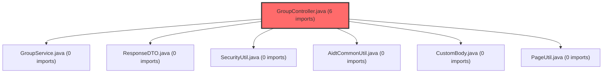

> [!IMPORTANT]
> **⚠️ 수동 검토 권장 (자가힐링 주의)**
>
> AI 자가힐링 결과물이 실제 의도와 다를 수 있으므로, **상세 리뷰 내용에 기반한 수동 점검**을 우선해 주시기 바랍니다. 자가힐링 기능을 활용하실 경우 최종 결과물을 신중하게 확인해 주세요.

## 코드 복잡도 분석

**분석된 파일**: 2개 / 변경된 파일: 7개


### Import 의존관계 다이어그램



**범례**: 중심 파일 (변경됨) | 많은 import (10개 이상)


### 모니터링 권장 (LOW)


**`groupcontroller.java`** (other)

- 평균 복잡도: **0.263**

- 최대 복잡도: 0.517

- 청크 수: 2개

- 평균 사용처: 13.5곳


**권장사항:**

- **모니터링 권장**: 복잡도가 높은 편이지만 영향 범위 제한적


### 정상 범위 (NONE)


**`securityconfig.java`** (config)

- 평균 복잡도: **0.262**

- 최대 복잡도: 0.516

- 청크 수: 2개

- 평균 사용처: 15.0곳


**권장사항:**

- Config 파일은 높은 연결도가 정상적임


---

# a0028248 커밋 코드 리뷰 분석 결과

## 결론: 승인 가능한 우수한 환경 구성 개선

CP님의 a0028248 커밋은 **프로젝트의 환경별 설정 관리를 체계적으로 개선한 우수한 작업**으로, Critical 또는 High 수준의 문제는 없으며 **즉시 승인 가능한 상태**입니다.

## 상세 코드 분석

### 1. 환경별 설정의 명확한 분리 (핵심 개선사항)

이 커밋의 가장 중요한 기여는 CORS와 프론트엔드 URL 설정을 프로파일별로 분리한 것입니다:

```yaml
# application.yml (기본값 - 로컬 개발)
app:
  frontend-url: ${APP_FRONTEND_URL:http://localhost:5173}
  cors:
    allowed-origins: ${APP_CORS_ALLOWED_ORIGINS:http://localhost:5173,http://localhost:5174}

# application-dev.yml (개발 환경)
app:
  frontend-url: https://t-meta-service.vsaidt.com
  cors:
    allowed-origins: https://t-meta-service.vsaidt.com,http://localhost:5173,http://localhost:5174

# application-prod.yml (운영 환경)
app:
  frontend-url: https://meta-service.vsaidt.com
  cors:
    allowed-origins: https://meta-service.vsaidt.com
```

**설계적 우수성:**
- **계층적 설정 관리**: 기본값 → 환경 변수 → 프로파일별 설정의 우선순위를 명확히 정의
- **보안 강화**: 운영 환경에서는 오직 `meta-service.vsaidt.com`만 허용하여 불필요한 도메인 접근 차단
- **개발 편의성**: 개발 환경에서는 테스트 서버와 로컬 개발 환경을 동시에 지원

### 2. 초대 코드 조회 API의 접근성 개선

`GroupController.java`에서 초대 코드 조회 기능을 비로그인 사용자도 접근 가능하도록 수정했습니다:

```java
// 변경 전: 인증된 사용자만 접근 가능
paramData.put("userNo", SecurityUtil.requireCurrentUserNo());

// 변경 후: 비로그인 사용자도 접근 가능 (null 허용)
paramData.put("userNo", SecurityUtil.getCurrentUserNo());
```

이와 함께 `SecurityConfig.java`에서 해당 엔드포인트를 명시적으로 허용:

```java
.antMatchers("/member/login", "/member/signup", "/member/token/refresh",
        "/member/logout", "/member/send-code", "/member/verify-code",
        "/group/invite", "/group/join-guest",  // ← 추가됨
        "/guest/exists", "/guest/auth").permitAll()
```

**기능적 개선점:**
- **사용자 경험 향상**: 초대 링크를 받은 사용자가 로그인 없이도 그룹 정보를 미리 확인 가능
- **온보딩 장벽 완화**: 신규 사용자의 서비스 진입 장벽을 낮춤
- **보안과 편의성의 균형**: 핵심 기능은 인증 유지하면서 초대 기능만 예외 처리

## 기술적 평가

### 긍정적 측면

1. **설정 관리의 모범 사례**
   - Spring Boot의 프로파일 기능을 적절히 활용
   - 환경별 차이를 소스 코드에서 명확하게 분리
   - 기본값을 로컬 개발에 최적화하여 개발자 경험 향상

2. **보안 구성의 투명성**
   - SecurityConfig에 허용된 엔드포인트를 명시적으로 나열
   - CORS 정책을 환경별로 세분화하여 불필요한 도메인 접근 방지

3. **코드 품질 일관성**
   - 모든 YAML 파일이 동일한 구조 유지
   - 변경 범위가 명확하고 집중되어 있음

### 개선 제안 사항 (Medium 수준)

1. **Null 안전성 문서화**
   ```java
   // 제안: 주석 추가로 의도 명시
   // getCurrentUserNo()는 인증되지 않은 사용자의 경우 null 반환
   // groupService.findGroupByInviteCode는 null userNo을 처리할 수 있어야 함
   paramData.put("userNo", SecurityUtil.getCurrentUserNo());
   ```

2. **포트 설정의 유연성 강화**
   - 현재: `application-dev.yml`에 포트 번호 하드코딩
   - 제안: 환경 변수로 포트 번호 구성 가능하도록 확장 고려

## 아키텍처적 의의

이 커멧은 다음과 같은 장기적 가치를 제공합니다:

1. **다중 환경 운영의 기반 마련**: dev/stage/prod 등 추가 환경 도입이 용이
2. **CI/CD 파이프라인과의 연동성**: 환경별 설정 분리가 자동 배포에 필수적
3. **팀 협업 효율성**: 로컬 개발 설정과 공유 개발 환경 설정의 명확한 분리

## 최종 평가 요약

**승인 근거:**
- ✅ Critical/High 수준의 버그 또는 보안 취약점 없음
- ✅ 환경별 설정 관리를 위한 견고한 기반 구축
- ✅ 사용자 접근성 개선과 보안 요구사항의 적절한 균형
- ✅ 코드 변경이 명확하고 이해하기 쉬움

**종합 의견:**
CP님의 이번 커밋은 프로젝트의 설정 관리 체계를 성숙 단계로 끌어올린 의미 있는 작업입니다. 특히 운영 환경의 보안 강화와 개발 환경의 유연성을 동시에 확보한 점이 인상적이며, 초대 기능의 접근성 개선은 실제 서비스 사용성 향상에 기여할 것입니다. 전반적으로 실무에서 통용될 수 있는 수준을 넘어선 우수한 구현으로 평가됩니다.