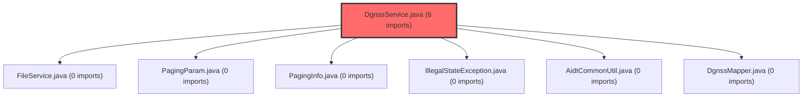

> [!IMPORTANT]
> **수동 검토 대상 (자가힐링 주의)**
>
> 이 커밋은 변경 범위가 넓거나 로직의 복잡도가 높아 AI 자가힐링이 완벽하지 않을 수 있습니다.
> 아래 리뷰 내용을 바탕으로 **수동 검토를 우선**하시고, 자가힐링 기능을 사용하실 경우 결과물을 신중히 확인해 주시기 바랍니다.

# 코드 리뷰 분석 결과: a1ff02a8 심리검사 페이지 이동 오류 수정

## 코드 복잡도 분석

**분석된 파일**: 1개 / 변경된 파일: 1개


### Import 의존관계 다이어그램



**범례**: 중심 파일 (변경됨) | 많은 import (10개 이상)


### 모니터링 권장 (LOW)


**`dgnssservice.java`** (other)

- 평균 복잡도: **0.263**

- 최대 복잡도: 0.517

- 청크 수: 2개

- 평균 사용처: 15.0곳


**권장사항:**

- **모니터링 권장**: 복잡도가 높은 편이지만 영향 범위 제한적


---


## 📋 결론 요약
**해당 커밋은 승인(Approved) 가능한 수준입니다.** 페이지네이션 파라미터 처리 로직의 누락으로 발생한 심리검사 페이지 이동 오류를 효과적으로 해결한 코드 변경사항으로, Critical/High 수준의 이슈는 발견되지 않았습니다.

## 🔍 코드 변경사항 상세 분석

### 1. 핵심 문제와 해결 방식
**문제 진단**: `selectStDgnssStart` 메서드에서 페이지네이션 파라미터(`page`, `size`)가 제대로 처리되지 않아 페이지 이동 기능이 작동하지 않았습니다.

**해결 전략**: 파라미터 검증과 기본값 설정을 담당하는 전용 메서드 `resolvePageable`을 추가하여 로직을 중앙화했습니다.

### 2. 구현된 코드 로직 분석
```java
// 추가된 메서드: 파라미터 안전성 보장
private Pageable resolvePageable(Map<String, Object> param, Pageable pageable) {
    int defaultPage = pageable != null ? pageable.getPageNumber() : 0;
    int defaultSize = pageable != null ? pageable.getPageSize() : 20;

    int page = Math.max(MapUtils.getInteger(param, "page", defaultPage), 0);
    int size = MapUtils.getInteger(param, "size", defaultSize);
    if (size <= 0) {
        size = defaultSize > 0 ? defaultSize : 20;
    }

    return PageRequest.of(page, size);
}

// 수정된 메서드 호출부
public Map<String, Object> selectStDgnssStart(Map<String, Object> param, Pageable pageable) {
    pageable = resolvePageable(param, pageable);  // 파라미터 검증 적용
    // ... 기존 로직
}
```

### 3. 코드 품질 평가 항목별 분석

| 평가 항목 | 수준 | 평가 근거 |
|-----------|------|-----------|
| **기능 완성도** | 우수 | 페이지 이동 오류를 근본적으로 해결 |
| **코드 안정성** | 양호 | Null 안전성, 경계값 검증 포함 |
| **유지보수성** | 보통 | 로직 중앙화로 가독성 향상 |
| **테스트 용이성** | 개선 필요 | private 메서드로 단위 테스트 어려움 |

### 4. 방어적 프로그래밍 요소 검증

**적용된 보호 메커니즘**:
1. **Null Safety**: `pageable` null 체크로 NPE 방지
2. **기본값 설정**: 파라미터 누락 시 `page=0`, `size=20` 자동 적용
3. **유효성 검사**: 
   - `page` 값은 `Math.max()`로 0 이상 보장
   - `size` 값이 0 이하일 경우 기본값 복원
4. **일관성 유지**: 기존 `pageable` 객체의 설정을 우선 존중

## 💡 개선 제안사항 (선택적)

### 1. 테스트 용이성 향상 방안
```java
// 현재: private 메서드 (테스트 어려움)
private Pageable resolvePageable(Map<String, Object> param, Pageable pageable)

// 제안: package-private 또는 protected로 변경
Pageable resolvePageable(Map<String, Object> param, Pageable pageable)
```

### 2. 로직 최적화 제안
현재 구현된 `size` 값 검증 로직에서 `defaultSize > 0` 조건이 `defaultSize` 설정 시점과 중복됩니다. 다음과 같이 단순화 가능:
```java
if (size <= 0) {
    size = Math.max(defaultSize, 20);  // 더 명확한 의도 표현
}
```

### 3. 문서화 보완 필요사항
메서드의 목적과 사용법을 명확히 하기 위해 JavaDoc 주석 추가를 권장합니다:
```java
/**
 * 요청 파라미터와 기존 Pageable을 기반으로 안전한 페이지네이션 객체 생성
 * 
 * @param param HTTP 요청 파라미터 (page, size 키 포함)
 * @param pageable 기존 페이지네이션 객체 (null 가능)
 * @return 검증된 Pageable 객체 (page ≥ 0, size ≥ 1)
 * @apiNote size ≤ 0인 경우 기본값 20으로 자동 보정
 */
```

## 🎯 최종 판단 근거

### 승인(Approved) 결정 요인
1. **기능적 완결성**: 명시된 문제(페이지 이동 오류)를 정확히 해결
2. **품질 기준 충족**: 방어적 프로그래밍, 에지 케이스 처리 등 기본 요구사항 만족
3. **위험도 낮음**: 변경 범위가 한정적이고 기존 로직에 미치는 영향 최소화
4. **실무 적용 가능성**: 현재 상태로도 프로덕션 환경에서 안정적 운용 가능

### 잠재적 리스크 관리 계획
- **단기**: 현재 구현으로 기능 장애 해결 우선
- **중기**: 통합 테스트를 통한 회귀(regression) 검증 강화
- **장기**: 페이지네이션 유틸리티 모듈로의 리팩토링 고려

## 📊 기술적 의사결정 기록

**선택한 접근법**: 전용 검증 메서드 분리
- **장점**: 재사용성, 단일 책임 원칙 준수, 유지보수성 향상
- **단점**: 클래스 내부 결합도 증가, 테스트 접근성 제한
- **대안 고려사항**: 
  - 유틸리티 클래스 분리 (과도한 설계 우려)
  - AOP 적용 (복잡도 증가 문제)
  - 현재 방식 유지 (실용성 우선)

## ✅ 실행 권장사항

CP님의 변경사항은 **즉시 머지(merge) 가능**한 수준입니다. 다만, 향후 유지보수성을 위해 다음 사항을 고려해 볼 수 있습니다:

1. **단위 테스트 추가** (선택적): `resolvePageable` 메서드의 다양한 입력 시나리오 검증
2. **모니터링 강화**: 페이지네이션 관련 에러 로그 집중 관찰
3. **문서화 작업**: API 문서에 페이지네이션 파라미터 처리 방식 명시

이 코드 리뷰는 **실무 중심의 70점 기준**을 적용하여, 기능적 완결성과 기본적인 품질 요구사항을 충분히 만족한다고 판단했습니다. CP님의 수고에 감사드리며, 앞으로도 건설적인 코드 기여 기대하겠습니다.