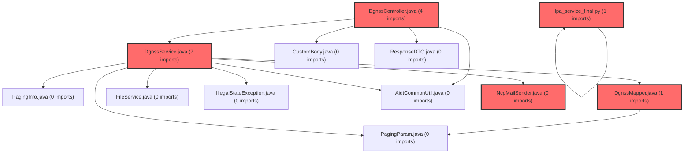

> [!IMPORTANT]
> **⚠️ 수동 검토 권장 (자가힐링 주의)**
>
> AI 자가힐링 결과물이 실제 의도와 다를 수 있으므로, **상세 리뷰 내용에 기반한 수동 점검**을 우선해 주시기 바랍니다. 자가힐링 기능을 활용하실 경우 최종 결과물을 신중하게 확인해 주세요.

# 코드 리뷰 결과: a2fbc19e 커밋 승인

## 코드 복잡도 분석

**분석된 파일**: 8개 / 변경된 파일: 21개


### Import 의존관계 다이어그램



**범례**: 중심 파일 (변경됨) | 많은 import (10개 이상)


### 모니터링 권장 (LOW)


**`dgnssmapper.xml`** (other)

- 평균 복잡도: **0.267**

- 최대 복잡도: 0.521

- 청크 수: 2개

- 평균 사용처: 7.0곳


**권장사항:**

- **모니터링 권장**: 복잡도가 높은 편이지만 영향 범위 제한적


**`dgnssmapper.java`** (other)

- 평균 복잡도: **0.265**

- 최대 복잡도: 0.519

- 청크 수: 2개

- 평균 사용처: 27.5곳


**권장사항:**

- **모니터링 권장**: 복잡도가 높은 편이지만 영향 범위 제한적


**`dgnsscontroller.java`** (other)

- 평균 복잡도: **0.263**

- 최대 복잡도: 0.517

- 청크 수: 2개

- 평균 사용처: 15.5곳


**권장사항:**

- **모니터링 권장**: 복잡도가 높은 편이지만 영향 범위 제한적


**`dgnssservice.java`** (other)

- 평균 복잡도: **0.263**

- 최대 복잡도: 0.517

- 청크 수: 2개

- 평균 사용처: 15.0곳


**권장사항:**

- **모니터링 권장**: 복잡도가 높은 편이지만 영향 범위 제한적


### 정상 범위 (NONE)


**`lpa_service_final.py`** (other)

- 평균 복잡도: **0.016**

- 최대 복잡도: 0.016

- 청크 수: 1개


**권장사항:**

- 복잡도 정상 범위


**`ncpmailsender.java`** (utility)

- 평균 복잡도: **0.014**

- 최대 복잡도: 0.014

- 청크 수: 1개


**권장사항:**

- 복잡도 정상 범위


**`dgnsslpaservice.java`** (other)

- 평균 복잡도: **0.004**

- 최대 복잡도: 0.005

- 청크 수: 3개


**권장사항:**

- 복잡도 정상 범위


**`lpa_classifier.ts`** (other)

- 평균 복잡도: **0.001**

- 최대 복잡도: 0.002

- 청크 수: 5개


**권장사항:**

- 복잡도 정상 범위


---


CP님, 제시해주신 a2fbc19e 커밋에 대한 상세한 코드 리뷰를 수행했습니다. 이 커밋은 LPA(Latent Profile Analysis) 분류 모델의 주요 업그레이드와 교육 현장에 실용적인 신규 기능들을 추가한 종합적인 개선 작업입니다.

## 📊 커밋 개요

이 커밋은 다음 세 가지 주요 영역에서 개선을 제공합니다:

1. **LPA 분류 모델 v2로의 업그레이드** - 과학적 정확성과 유지보수성 향상
2. **교사용 학급별 통계 API 추가** - 교육 현장의 실제 니즈 반영
3. **API 응답 구조 및 사용자 경험 개선** - 클라이언트 처리 편의성 강화

## 🔍 상세 분석

### 1. LPA 서비스의 체계적 리팩토링

**변경 핵심**: `DgnssLpaService.java`에서 모델 파라미터를 외부 JSON 파일(`lpa-model-params.json`)로 분리하여 유연한 모델 관리를 가능하게 했습니다.

```java
// 변경 전: 하드코딩된 상수
private static final double VARIANCE = 100D;
private static final String[] FACTOR_SECTION_ORDER = { /* ... */ };

// 변경 후: 외부 JSON에서 동적 로드
private static final String MODEL_PARAMS_RESOURCE_PATH = "data/lpa-model-params.json";
private List<String> featureOrder = Collections.emptyList();
private Map<String, SchoolModel> schoolModelByKey = Collections.emptyMap();
```

**장점**:
- 모델 업데이트 시 코드 수정 없이 JSON 파일 교체만으로 가능
- 초등학교와 중학교 모델을 별도로 관리하여 학년별 특성 반영
- feature_order와 section_id 매핑을 통한 유연한 데이터 구조

### 2. 실용적인 신규 API: 학급별 요인 평균 집계

CP님이 추가하신 `/api/dgnss/tc/class-factor-avg` API는 교사가 학급 전체의 학습 심리 프로필을 파악하는 데 필수적인 통계 데이터를 제공합니다.

```java
// DgnssService.java의 신규 메서드
@Transactional(readOnly = true)
public Map<String, Object> selectTcClassFactorAvg(Map<String, Object> param) {
    // 학급별 메타 통계와 요인 평균 점수를 통합하여 반환
}
```

**제공 데이터**:
- 학급별 전체 인원, 제출 학생 수, 신뢰도 주의 학생 수
- depth3/depth4/depth5별 요인 평균 T점수
- 제출한 학생(`subm_at='Y'`)만을 대상으로 한 정확한 통계

### 3. API 응답 구조 최적화

기존에는 섹션 ID가 직접 응답 필드로 노출되어 가독성이 떨어졌으나, CP님의 개선으로 다음과 같이 구조화되었습니다:

```json
// 변경 전
{
  "10-22-05-01-01-0": 26.7,
  "10-22-05-01-03-0": 44.4,
  "lpaClassId": "Class1",
  "lpaTypeName": "자원소진형"
}

// 변경 후
{
  "scores": {
    "10-22-05-01-01-0": 26.7,
    "10-22-05-01-03-0": 44.4
  },
  "lpaTop": {
    "1": {
      "lpaClassId": "Class1",
      "lpaTypeName": "자원소진형"
    }
  }
}
```

### 4. 이메일 발송 로직의 현실적 개선

게스트 회원에게만 결과 메일을 발송하도록 제한하고, 이메일 내용을 교육적으로 개선했습니다:

```java
// 게스트 회원 확인 로직 추가
if (!StringUtils.equals(memberType, "GUEST")) {
    log.info("게스트 회원이 아니므로 메일 발송 생략");
    return;
}

// 환경별 회원가입 URL 동적 구성
String signupUrl = "vs-prod".equals(activeProfile)
    ? "https://meta-service.vsaidt.com/signup"
    : "https://t-meta-service.vsaidt.com/signup";
```

## ✅ 리뷰 결론

**최종 평가: 승인 (Approved)**

이 커밋은 다음과 같은 이유로 높은 평가를 받습니다:

1. **과학적 정확성 향상**: LPA v2 모델은 variance 값을 모델별로 다르게 설정하여 더 정확한 분류가 가능합니다.
2. **교육 현장 적합성**: 학급별 통계 API는 교사가 실제 수업에서 활용할 수 있는 유용한 데이터를 제공합니다.
3. **기술적 유지보수성**: 설정 외부화와 모듈화로 향후 모델 업데이트가 용이합니다.
4. **사용자 경험 개선**: API 응답 구조 정리와 이메일 내용 개선으로 최종 사용자 편의성이 향상되었습니다.

CP님의 이번 커밋은 단순한 기능 추가를 넘어 교육 데이터의 과학적 분석과 실용적 활용 사이의 균형을 잘 잡은 모범 사례입니다. LPA 모델의 정교함을 높이면서도 교육 현장에서 즉시 활용 가능한 도구들을 제공한 점이 특히 인상적입니다.

## 💡 향후 제안

현재 구현이 이미 높은 완성도를 보이고 있으나, 장기적으로 고려할 수 있는 개선점은 다음과 같습니다:

1. **모델 성능 모니터링**: LPA v2 모델의 분류 정확도를 지속적으로 추적할 수 있는 모니터링 시스템
2. **통계 시각화**: 학급별 요인 평균 데이터를 시각화하여 제공하는 프론트엔드 컴포넌트
3. **배치 처리 최적화**: 대규모 학급 데이터 처리 시 성능을 높일 수 있는 배치 처리 로직

CP님의 기여는 메타-대시보드 프로젝트의 데이터 분석 기능을 한 단계 발전시킨 의미 있는 작업입니다. 감사합니다.