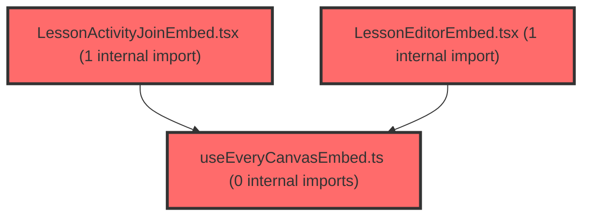

> [!IMPORTANT]
> **⚠️ 수동 검토 권장 (자가힐링 주의)**
>
> AI 자가힐링 결과물이 실제 의도와 다를 수 있으므로, **상세 리뷰 내용에 기반한 수동 점검**을 우선해 주시기 바랍니다. 자가힐링 기능을 활용하실 경우 최종 결과물을 신중하게 확인해 주세요.

# 코드 리뷰 - a465c780

## 코드 복잡도 분석

**분석된 파일**: 12개 / 변경된 파일: 13개


### Import 의존관계 다이어그램



**범례**: 중심 파일 (변경됨) | 많은 import (10개 이상)


### 정상 범위 (NONE)


**`routes.tsx`** (other)

- 평균 복잡도: **0.054**

- 최대 복잡도: 0.463

- 청크 수: 23개

- 평균 사용처: 2.4곳


**권장사항:**

- 파일 크기가 큼 (23개 청크) - 파일 분리 검토


**`index.ts`** (component)

- 평균 복잡도: **0.028**

- 최대 복잡도: 0.461

- 청크 수: 33개

- 평균 사용처: 1.8곳


**권장사항:**

- 파일 크기가 큼 (33개 청크) - 파일 분리 검토


**`lmsactivityservice.ts`** (other)

- 평균 복잡도: **0.002**

- 최대 복잡도: 0.002

- 청크 수: 4개


**권장사항:**

- 복잡도 정상 범위


**`lessonjoinpage.tsx`** (component)

- 평균 복잡도: **0.002**

- 최대 복잡도: 0.012

- 청크 수: 14개


**권장사항:**

- 복잡도 정상 범위


**`index.ts`** (other)

- 평균 복잡도: **0.001**

- 최대 복잡도: 0.005

- 청크 수: 24개


**권장사항:**

- 파일 크기가 큼 (24개 청크) - 파일 분리 검토


**`useeverycanvasembed.ts`** (utility)

- 평균 복잡도: **0.001**

- 최대 복잡도: 0.004

- 청크 수: 11개


**권장사항:**

- 복잡도 정상 범위


**`lessoneditorembed.tsx`** (other)

- 평균 복잡도: **0.001**

- 최대 복잡도: 0.007

- 청크 수: 13개


**권장사항:**

- 복잡도 정상 범위


**`lessoneditorpage.tsx`** (component)

- 평균 복잡도: **0.001**

- 최대 복잡도: 0.010

- 청크 수: 26개


**권장사항:**

- 파일 크기가 큼 (26개 청크) - 파일 분리 검토


**`lessonmypage.tsx`** (component)

- 평균 복잡도: **0.001**

- 최대 복잡도: 0.010

- 청크 수: 25개


**권장사항:**

- 파일 크기가 큼 (25개 청크) - 파일 분리 검토


**`deploypage.tsx`** (component)

- 평균 복잡도: **0.000**

- 최대 복잡도: 0.005

- 청크 수: 174개


**권장사항:**

- 파일 크기가 큼 (174개 청크) - 파일 분리 검토


**`lessonactivityjoinembed.tsx`** (other)

- 평균 복잡도: **0.000**

- 최대 복잡도: 0.004

- 청크 수: 12개


**권장사항:**

- 복잡도 정상 범위


**`resourcecard.tsx`** (other)

- 평균 복잡도: **0.000**

- 최대 복잡도: 0.003

- 청크 수: 43개


**권장사항:**

- 파일 크기가 큼 (43개 청크) - 파일 분리 검토


---


## 변경 배경

이 커밋은 학생 수업 참여 기능의 **Phase A** 구현입니다. 교사가 DeployPage에서 배포한 활동에 대해 학생이 QR/참여링크로 진입할 수 있는 `/student/lesson/:activityId` 라우트와 `activity-join` 모드의 everyCanvas embed를 추가하고, 저작툴(`LessonEditorPage`)에 저장 완료 모달과 수업 시작 시 DeployPage로 이동하는 흐름을 연결했습니다. 또한 `location.search`(쿼리 파라미터)를 유지한 채 페이지 간 이동하도록 여러 navigate 호출을 보강했습니다.

- **목적**: 학생용 수업 참여 라우트 신설 + 저작툴 저장 UX 개선 + 쿼리 파라미터 보존
- **도메인**: 프론트엔드 UI / 라우팅 / everyCanvas SDK 연동
- **변경 방향**: API 스펙이 확정되지 않은 상태에서 **스켈레톤 + 임시 값**으로 Phase A를 구현하고, Phase B(실 API 연동)를 명확히 분리한 점이 구조적으로 우수합니다.

---

## [GOOD] 잘된 점

1. **API 스펙 대기 상태를 명시적으로 코드에 반영** — `lmsActivityService.ts`의 `createActivity`/`getActivityJoinEligibility`/`getActivityJoinSetId`가 모두 `throw new Error('... 스펙 대기 — 호출하지 말 것')`으로 구현되어, 실수로 호출되는 것을 방지합니다. 미확정 계약을 추측으로 고정하지 않는 원칙이 잘 지켜졌습니다.
2. **FSD(Feature-Sliced Design) 경계 준수** — `LessonActivityJoinEmbed`를 별도 컴포넌트로 분리하고, assessment의 `QRCodeModal`을 import하지 않고 `qrcode.react`만 재사용하겠다는 계획이 문서에 명시되어 있습니다. feature 간 의존성을 피하려는 의도가 좋습니다.
3. **`useEveryCanvasEmbed`의 `openSet` 호출을 `mode === 'editor'`로 제한** — 기존에는 `setId`만 있으면 무조건 `openSet`을 호출했지만, 이제 `activity-join`/`viewer` 모드에서는 호출하지 않도록 수정하여 모드별 SDK 계약 차이를 올바르게 반영했습니다.
4. **`embedIdentityKey` 도입** — 저장 후 `replace` navigate로 URL만 바뀔 때 embed가 리마운트되는 문제를 방지하기 위해 마운트 시점의 identity를 고정한 설계가 타당합니다.

---

## 변경사항 요약

- 학생 풀스크린 라우트(`/student/lesson/:activityId`) + `StudentFullscreenLayout`(인증/역할 가드, 사이드바 없음) 추가
- `LessonActivityJoinEmbed`(mode: `activity-join`) 신규, `useEveryCanvasEmbed`에 `submitted`/`phaseChanged`/`progress` 이벤트 구독 추가
- `LessonEditorPage`에 저장 완료 모달 추가, `handleStartLesson`이 `/lesson/deploy/:setId`로 이동
- `DeployPage`/`ResourceCard`/`LessonMyPage`의 navigate에 `location.search` 보존 적용
- `lmsActivityService.ts` 스켈레톤(throw) 신규

---

## [ISSUE] 개선이 필요한 부분

### Critical (즉시 수정 필요)

없음

### High (우선 수정 권장)

**1. `LessonEditorPage.tsx` — `location` 미선언으로 인한 컴파일 에러 가능성**

`handleSaved`와 `handleStartLesson`, `goMyData`에서 `location.search`를 사용하지만, `useLocation` 훅을 import하지 않았습니다. 현재 import는 `useNavigate, useParams`만 존재합니다. 이는 TypeScript 컴파일 에러(`Cannot find name 'location'`)를 유발합니다.

- **위치**: `frontend/src/pages/lesson/LessonEditorPage.tsx` 라인 2 (import), 라인 70, 78, 106
- **기존 코드**:
```tsx
import { useNavigate, useParams } from 'react-router-dom';
```
- **해결 방안**:
```tsx
import { useLocation, useNavigate, useParams } from 'react-router-dom';
```
그리고 컴포넌트 내부에 `const location = useLocation();` 추가가 필요합니다.

**2. `LessonEditorPage.tsx` — `setSavedOpen(true)` 중복 호출로 저장 실패 시에도 모달이 열림**

`handleSaved`에서 `registerRefSet`의 `onSuccess` 콜백과 함수 본문 양쪽에서 `setSavedOpen(true)`를 호출합니다. 이로 인해:
- `registerRefSet`이 **실패**해도 `setSavedOpen(true)`가 실행되어 "저장되었습니다" 모달이 잘못 표시됩니다.
- `onSuccess`에서도 호출되므로 성공 시 **2회** 호출됩니다(React 상태 업데이트는 동일 값이면 무시되지만, 실패 경로가 문제).

- **위치**: `frontend/src/pages/lesson/LessonEditorPage.tsx` 라인 57-68
- **기존 코드**:
```tsx
{
  onSuccess: () => setSavedOpen(true),
  onError: () => toast.error('나의 자료 등록에 실패했습니다'),
},
);
setSavedOpen(true);
```
- **해결 방안**: `onSuccess` 콜백에서만 호출하고, 본문의 직접 호출을 제거합니다.
```tsx
{
  onSuccess: () => setSavedOpen(true),
  onError: () => toast.error('나의 자료 등록에 실패했습니다'),
},
);
// setSavedOpen(true);  // 제거
```

**3. `LessonEditorEmbed.tsx` — `onStartLesson`/`startLessonRequested` 핸들러가 실제 SDK 이벤트와 불일치**

`handlers`에 `onStartLesson`과 `startLessonRequested`가 추가되었지만, `useEveryCanvasEmbed`의 `EmbedEventHandlers` 타입과 `KNOWN_EVENTS` 배열에는 이 두 이벤트가 존재하지 않습니다. `KNOWN_EVENTS`에는 `startLesson`만 있습니다. 따라서 이 두 핸들러는 **실제로 SDK에서 구독되지 않는 죽은 코드**입니다. `startLesson` 핸들러가 이미 동일한 `onStartLesson` 콜백을 호출하므로, 중복 정의는 혼란만 가중합니다.

- **위치**: `frontend/src/features/lesson/ui/LessonEditorEmbed.tsx` 라인 78-81
- **기존 코드**:
```tsx
handlers: {
  saved: (p) => onSaved?.(p as SavedPayload),
  startLesson: (p) => onStartLesson?.(p as StartLessonPayload),
  exitRequested: (p) => onExitRequested?.(p as { reason?: 'userClose' | 'done' }),
  onStartLesson: (p) => onStartLesson?.(p as StartLessonPayload),
  startLessonRequested: (p) => onStartLesson?.(p as StartLessonPayload),
},
```
- **해결 방안**: `onStartLesson`과 `startLessonRequested`를 제거합니다.
```tsx
handlers: {
  saved: (p) => onSaved?.(p as SavedPayload),
  startLesson: (p) => onStartLesson?.(p as StartLessonPayload),
  exitRequested: (p) => onExitRequested?.(p as { reason?: 'userClose' | 'done' }),
},
```

### Medium (개선 권장)

**1. `LessonJoinPage.tsx` — `not_allowed` 분기가 도달 불가능한 죽은 코드**

`resolveJoinViewState`는 항상 `{ kind: 'ready' }`를 반환하며 `not_allowed`를 반환하는 경로가 없습니다. Phase A 의도(임시 허용)이긴 하나, `not_allowed` UI가 실제로 렌더링될 수 없는 상태로 남아 있습니다. Phase B에서 API 연동 시 이 분기가 활성화될 예정이므로, 주석으로 "Phase B에서 활성화"를 명시하거나, 개발 중 임시로 `not_allowed`를 강제로 켤 수 있는 스위치를 제공하면 좋습니다.

**2. `LessonEditorPage.tsx` — `p.title` 없이도 `registerRefSet` 호출 가능**

기존 코드는 `p.lcmsSetId && p.title`이 모두 있을 때만 `registerRefSet`을 호출했지만, 이제 `p.lcmsSetId`만 있으면 호출하고 `title: p.title ?? ''`로 빈 문자열을 전달합니다. 빈 제목으로 나의 자료에 등록될 가능성이 있습니다. `p.title`이 없을 때 toast 경고를 띄우거나, `p.title`이 필수인지 API 스펙을 확인할 필요가 있습니다.

**3. `LessonEditorPage.tsx` — 인라인 CSS 상수 중복**

`SavedModalActions`의 두 버튼에 인라인 `css` 객체가 하드코딩되어 있습니다. 색상(`#a855f7`, `#9333ea`, `#d1d5db` 등)이 테마 토큰(`theme.colors`)을 사용하지 않고 직접 지정되어 있어, 테마 변경 시 유지보수가 어렵습니다. `@shared/ui/Button`의 variant 스타일을 활용하거나 테마 토큰으로 교체하는 것을 권장합니다.

---

## 주요 파일 분석

### `frontend/src/pages/lesson/LessonEditorPage.tsx`

**변경 내용:**
저장 완료 모달 추가, `handleStartLesson`이 `/lesson/deploy/:setId`로 이동, `embedSetId`/`embedIdentityKey`로 마운트 시점 identity 고정.

**개선 제안:**
1. `useLocation` import 누락 (High #1)
2. `setSavedOpen(true)` 중복 호출 (High #2)
3. `p.title` 없이 등록 가능한 문제 (Medium #2)

### `frontend/src/features/lesson/ui/LessonEditorEmbed.tsx`

**변경 내용:**
`embedIdentityKey` prop 추가, `identity` 배열에 적용.

**개선 제안:**
1. `onStartLesson`/`startLessonRequested` 죽은 핸들러 제거 (High #3)

### `frontend/src/features/lesson/lib/useEveryCanvasEmbed.ts`

**변경 내용:**
`submitted`/`phaseChanged`/`progress` 이벤트 구독 추가, `openSet` 호출을 `mode === 'editor'`로 제한.

**개선 제안:**
1. `EmbedEventHandlers` 타입에 `onStartLesson`/`startLessonRequested`가 없는데 `LessonEditorEmbed`에서 전달되는 불일치를 정리 (High #3과 연계)

### `frontend/src/pages/lesson/LessonJoinPage.tsx`

**변경 내용:**
`/student/lesson/:activityId` 진입 시 `resolveJoinViewState`로 상태 분기 후 `LessonActivityJoinEmbed` 마운트.

**개선 제안:**
1. `not_allowed` 분기가 도달 불가능한 죽은 코드 (Medium #1)

### `frontend/src/app/router/routes.tsx`

**변경 내용:**
`StudentFullscreenLayout` 추가, `/student/lesson/:activityId` 라우트 등록.

**개선 제안:**
1. `StudentFullscreenLayout`에서 `user?.roleCode !== 'STUDENT'` 체크 시 `roleCode`가 `undefined`인 경우(예: roleCode가 아직 로드되지 않은 상태)에도 `/dashboard`로 이동하게 되어, 인증 직후 깜빡임이 발생할 수 있습니다. `user?.roleCode && user.roleCode !== 'STUDENT'` 조건은 `roleCode`가 `undefined`일 때 통과하므로, `roleCode` 로딩 상태를 별도로 처리할 필요가 있습니다.

---

## 최종 평가

**결론**:
- [ ] [OK] **승인 (Approved)** - Critical/High 이슈 없음
- [x] [WARN] **조건부 승인 (Approved with Comments)** - Medium 이하 이슈만 존재
- [ ] [FIX] **수정 필요 (Changes Requested)** - Critical/High 이슈 존재

**종합 의견:**

전반적으로 Phase A 구현이 계획 문서와 잘 정합되어 있으며, API 스펙 대기 상태를 코드에 명시적으로 반영한 점, FSD 경계를 준수한 점, `openSet` 호출을 모드별로 제한한 점이 우수합니다. 다만 `LessonEditorPage.tsx`의 `useLocation` import 누락(컴파일 에러 가능성), `setSavedOpen(true)` 중복 호출(저장 실패 시 모달 오표시), `LessonEditorEmbed.tsx`의 죽은 핸들러 3건은 수정을 권장합니다. 이 세 가지를 해결하면 바로 머지 가능한 수준입니다.