> [!IMPORTANT]
> **⚠️ 수동 검토 권장 (자가힐링 주의)**
>
> AI 자가힐링 결과물이 실제 의도와 다를 수 있으므로, **상세 리뷰 내용에 기반한 수동 점검**을 우선해 주시기 바랍니다. 자가힐링 기능을 활용하실 경우 최종 결과물을 신중하게 확인해 주세요.

# 코드 리뷰 결과: 조건부 승인 (Approved with Comments)

## 코드 복잡도 분석

**분석된 파일**: 3개 / 변경된 파일: 3개


### Import 의존관계 다이어그램

```mermaid
flowchart TD
    F0["GroupQueryMapper.java (0 imports)"]
    F1["PageUtil.java (0 imports)"]
    F2["DgnssService.java (0 imports)"]
    F3["GroupInfoMapper.java (0 imports)"]
    F4["UserMapper.java (0 imports)"]
    F5["ConvertUtils.java (0 imports)"]
    F6["GroupMemberMapper.java (1 imports)"]:::center
    F7["MemberStatus.java (0 imports)"]
    F8["UserStatus.java (0 imports)"]
    F9["MemberType.java (0 imports)"]
    F10["IdGenerator.java (0 imports)"]
    F11["GroupMember.java (0 imports)"]
    F12["MemberService.java (0 imports)"]
    F13["User.java (0 imports)"]
    F14["SchoolLevel.java (0 imports)"]
    F15["EmailVerificationService.java (0 imports)"]
    F16["GroupInfo.java (0 imports)"]
    F17["GroupService.java (17 imports)"]:::center
    F6 --> F11
    F17 --> F0
    F17 --> F1
    F17 --> F4
    F17 --> F3
    F17 --> F5
    F17 --> F8
    F17 --> F6
    F17 --> F7
    F17 --> F2
    F17 --> F9
    F17 --> F10
    F17 --> F11
    F17 --> F12
    F17 --> F13
    F17 --> F14
    F17 --> F15
    F17 --> F16
    classDef center fill:#ff6b6b,stroke:#333,stroke-width:3px
    classDef high fill:#ffd93d,stroke:#333,stroke-width:2px
```



**범례**: 중심 파일 (변경됨) | 많은 import (10개 이상)


### 모니터링 권장 (LOW)


**`groupmembermapper.java`** (other)

- 평균 복잡도: **0.266**

- 최대 복잡도: 0.520

- 청크 수: 2개

- 평균 사용처: 34.0곳


**권장사항:**

- **모니터링 권장**: 복잡도가 높은 편이지만 영향 범위 제한적


**`groupservice.java`** (other)

- 평균 복잡도: **0.264**

- 최대 복잡도: 0.518

- 청크 수: 2개

- 평균 사용처: 15.0곳


**권장사항:**

- **모니터링 권장**: 복잡도가 높은 편이지만 영향 범위 제한적


**`groupmembermapper.xml`** (other)

- 평균 복잡도: **0.262**

- 최대 복잡도: 0.516

- 청크 수: 2개

- 평균 사용처: 7.0곳


**권장사항:**

- **모니터링 권장**: 복잡도가 높은 편이지만 영향 범위 제한적


---


**결론**: CP님의 커밋(a679324e)은 그룹 자진탈퇴(LEFT) 학생의 재가입 허용 기능을 명확하게 구현하였으며, 비즈니스 요구사항을 잘 반영하고 있습니다. 데이터 일관성을 유지한 점이 특히 우수합니다. Medium 수준의 개선 사항이 있으나, 즉시 수정이 필요한 Critical/High 이슈는 없어 **조건부 승인**합니다.

---

## 변경사항 요약
이 커밋은 그룹 가입 로직을 확장하여:
1. 기존 LEFT 상태 멤버의 재가입 허용 (기존 row 재활성화)
2. KICKED 상태 멤버의 재가입 차단
3. ACTIVE 상태 멤버에 대한 중복 가입 방지

## 상세 분석

### 1. 구현된 로직의 작동 방식
```java
// 핵심 로직 순서
1. 기존 멤버 조회 (findByGroupIdAndUserNo)
2. 상태별 분기 처리:
   - ACTIVE: 예외 발생 ("이미 해당 그룹에 가입되어 있습니다.")
   - KICKED: 예외 발생 ("강퇴된 그룹에는 재가입할 수 없습니다.")
   - LEFT: 기존 row 재활성화 (UPDATE)
3. 새 멤버인 경우: INSERT
```

### 2. 잘된 점 (GOOD)
**비즈니스 로직의 명확성**
- 각 멤버 상태(ACTIVE/KICKED/LEFT)에 따른 처리가 논리적으로 명확합니다.
- LEFT 상태만 재가입을 허용하는 정책이 사용자 경험을 고려한 합리적인 결정입니다.

**데이터 일관성 유지**
- 기존 row를 재활성화하는 방식(`UPDATE`)을 선택하여:
  - 불필요한 데이터 증식 방지
  - `stdtId`, `memberId` 등 기존 식별자 유지
  - 데이터 정합성 보장

**사용자 친화적인 예외 처리**
- 예외 메시지가 일반 사용자가 이해하기 쉽게 작성되었습니다.
- 로깅을 통해 재가입 이력을 추적할 수 있습니다.

### 3. 개선 제안 (Medium 수준)

#### 3.1 예외 메시지 상수화
**현재 코드:**
```java
throw new IllegalStateException("이미 해당 그룹에 가입되어 있습니다.");
throw new IllegalStateException("강퇴된 그룹에는 재가입할 수 없습니다.");
```

**개선 방안:**
```java
// 클래스 상단에 상수 정의
private static final String ALREADY_JOINED_MSG = "이미 해당 그룹에 가입되어 있습니다.";
private static final String KICKED_NO_REJOIN_MSG = "강퇴된 그룹에는 재가입할 수 없습니다.";

// 사용 시
throw new IllegalStateException(ALREADY_JOINED_MSG);
```

**이점:**
- 메시지 변경 시 한 곳에서 관리 가능
- 오타 방지
- 국제화(i18n) 대비 용이

#### 3.2 데이터베이스 인덱스 고려
**SQL 매퍼 파일(GroupMemberMapper.xml)에 주석 추가 권장:**

```xml
<!-- group_id와 user_no 컬럼에 복합 인덱스 권장 -->
<!-- 기존: (group_id, user_no) 인덱스가 있으면 성능 최적화 -->
<select id="findByGroupIdAndUserNo" resultMap="groupMemberResultMap">
    /* GroupMemberMapper.findByGroupIdAndUserNo */
    SELECT <include refid="groupMemberColumns"/>
    FROM group_member
    WHERE group_id = #{groupId} AND user_no = #{userNo}
    LIMIT 1
</select>
```

**이점:**
- 향후 성능 튜닝 시 가이드 역할
- 동료 개발자에게 인덱스 중요성 인식 제고

#### 3.3 예외 처리 계층화 고려
현재 `IllegalStateException`을 사용하고 있으나, 비즈니스 예외 전용 클래스(예: `GroupBusinessException`)를 도입하면:
- 예외 처리 코드의 일관성 향상
- 예외 유형별로 다른 처리 전략 적용 가능
- REST API 응답 시 예외 정보 체계화 용이

### 4. 코드 품질 평가

**가독성**: ⭐⭐⭐⭐ (4/5)
- 로직 흐름이 직관적이고 주석이 적절히 배치됨

**유지보수성**: ⭐⭐⭐⭐ (4/5)
- 상태별 분기가 명확하여 기능 추가/수정이 용이

**안정성**: ⭐⭐⭐⭐⭐ (5/5)
- 기존 데이터를 재활성화하는 방식으로 데이터 무결성 보장
- 모든 상태에 대한 처리가 명시적으로 정의됨

**성능**: ⭐⭐⭐⭐ (4/5)
- 추가된 쿼리 1개로 재가입 여부 판단 가능
- 불필요한 INSERT 방지로 데이터베이스 부하 감소

## 종합 의견

CP님의 구현은 실무에서 통용될 수 있는 수준을 넘어서는 훌륭한 품질을 보여줍니다. LEFT 상태 멤버의 재가입 허용이라는 비즈니스 요구사항을 데이터 일관성을 유지하면서 구현한 점이 특히 인상적입니다. 제안드린 개선 사항들은 코드의 장기적인 유지보수성과 성능 최적화를 위한 것이며, 현재 버전으로도 충분히 운영 환경에 적용 가능합니다.

이 커밋은 그룹 관리 기능의 사용자 경험을 크게 향상시키는 의미 있는 변경입니다. 특히 학생들이 실수로 탈퇴한 경우 재가입할 수 있도록 하는 기능은 실제 서비스 운영에서 매우 유용할 것입니다.