> [!IMPORTANT]
> **⚠️ 수동 검토 권장 (자가힐링 주의)**
>
> AI 자가힐링 결과물이 실제 의도와 다를 수 있으므로, **상세 리뷰 내용에 기반한 수동 점검**을 우선해 주시기 바랍니다. 자가힐링 기능을 활용하실 경우 최종 결과물을 신중하게 확인해 주세요.

# 코드 리뷰 - a9a98a17

## 코드 복잡도 분석

**분석된 파일**: 57개 / 변경된 파일: 87개


### Import 의존관계 다이어그램

```mermaid
flowchart TD
    F0["MyResultPage.tsx (1 internal import)"]:::center
    F1["SelfregDiagnosisSummary.tsx (0 internal imports)"]:::center
    F2["queries.ts (1 internal import)"]:::center
    F3["summaryGenerator.ts (0 internal imports)"]:::center
    F4["MySelfregResultPage.tsx (2 internal imports)"]:::center
    F5["studentExamService.ts (1 internal import)"]:::center
    F6["MyExamListPage.tsx (1 internal import)"]:::center
    F7["queryKeys.ts (0 internal imports)"]:::center
    F8["index.ts (0 internal imports)"]:::center
    F9["classComparisonUtils.ts (2 internal imports)"]:::center
    F10["LayoutContext.tsx (0 internal imports)"]:::center
    F11["ScopeTree.tsx (1 internal import)"]:::center
    F12["ExamClassManagementView.tsx (1 internal import)"]:::center
    F13["scopeConfig.ts (0 internal imports)"]:::center
    F14["classDisplayName.ts (0 internal imports)"]:::center
    F15["DiagnosisSummary.tsx (2 internal imports)"]:::center
    F16["scopeUtils.ts (1 internal import)"]:::center
    F17["deriveExamMeta.ts (0 internal imports)"]:::center
    F2 --> F7
    F12 --> F2
    F15 --> F8
    F15 --> F3
    F5 --> F17
    F6 --> F17
    F0 --> F5
    F4 --> F5
    F4 --> F1
    F16 --> F13
    F9 --> F8
    F9 --> F14
    F11 --> F10
    classDef center fill:#ff6b6b,stroke:#333,stroke-width:3px
    classDef high fill:#ffd93d,stroke:#333,stroke-width:2px
```



**범례**: 중심 파일 (변경됨) | 많은 import (10개 이상)


### 정상 범위 (NONE)


**`dgnssmapper.xml`** (other)

- 평균 복잡도: **0.243**

- 최대 복잡도: 0.474

- 청크 수: 2개

- 평균 사용처: 7.0곳


**권장사항:**

- 복잡도 정상 범위


**`dgnssmapper.java`** (other)

- 평균 복잡도: **0.188**

- 최대 복잡도: 0.466

- 청크 수: 198개

- 평균 사용처: 28.0곳


**권장사항:**

- 파일 크기가 큼 (198개 청크) - 파일 분리 검토


**`dgnssservice.java`** (other)

- 평균 복잡도: **0.111**

- 최대 복잡도: 0.473

- 청크 수: 69개

- 평균 사용처: 12.8곳


**권장사항:**

- 파일 크기가 큼 (69개 청크) - 파일 분리 검토


**`apiresponseaspect.java`** (other)

- 평균 복잡도: **0.097**

- 최대 복잡도: 0.467

- 청크 수: 5개

- 평균 사용처: 11.8곳


**권장사항:**

- 복잡도 정상 범위


**`coachingresponse.java`** (other)

- 평균 복잡도: **0.012**

- 최대 복잡도: 0.012

- 청크 수: 1개


**권장사항:**

- 복잡도 정상 범위


**`studentlearningstatusresponse.java`** (other)

- 평균 복잡도: **0.008**

- 최대 복잡도: 0.008

- 청크 수: 1개


**권장사항:**

- 복잡도 정상 범위


**`dgnssstudentcontroller.java`** (other)

- 평균 복잡도: **0.007**

- 최대 복잡도: 0.008

- 청크 수: 2개


**권장사항:**

- 복잡도 정상 범위


**`tcsubmissionsresponse.java`** (other)

- 평균 복잡도: **0.007**

- 최대 복잡도: 0.007

- 청크 수: 1개


**권장사항:**

- 복잡도 정상 범위


**`schoolcoachingservice.java`** (other)

- 평균 복잡도: **0.006**

- 최대 복잡도: 0.006

- 청크 수: 1개


**권장사항:**

- 복잡도 정상 범위


**`dgnssteachercontroller.java`** (other)

- 평균 복잡도: **0.006**

- 최대 복잡도: 0.008

- 청크 수: 9개


**권장사항:**

- 복잡도 정상 범위


**`reminderresult.java`** (other)

- 평균 복잡도: **0.006**

- 최대 복잡도: 0.006

- 청크 수: 1개


**권장사항:**

- 복잡도 정상 범위


**`dgnssgraphservice.java`** (other)

- 평균 복잡도: **0.005**

- 최대 복잡도: 0.008

- 청크 수: 8개


**권장사항:**

- 복잡도 정상 범위


**`dgnssgraphcontroller.java`** (other)

- 평균 복잡도: **0.004**

- 최대 복잡도: 0.004

- 청크 수: 2개


**권장사항:**

- 복잡도 정상 범위


**`paperpermissionresponse.java`** (other)

- 평균 복잡도: **0.004**

- 최대 복잡도: 0.004

- 청크 수: 1개


**권장사항:**

- 복잡도 정상 범위


**`paperpermissionservice.java`** (other)

- 평균 복잡도: **0.004**

- 최대 복잡도: 0.004

- 청크 수: 2개


**권장사항:**

- 복잡도 정상 범위


**`studentexamservice.ts`** (other)

- 평균 복잡도: **0.004**

- 최대 복잡도: 0.009

- 청크 수: 20개


**권장사항:**

- 복잡도 정상 범위


**`scopeutils.ts`** (utility)

- 평균 복잡도: **0.004**

- 최대 복잡도: 0.009

- 청크 수: 13개


**권장사항:**

- 복잡도 정상 범위


**`dashboardservice.ts`** (other)

- 평균 복잡도: **0.004**

- 최대 복잡도: 0.010

- 청크 수: 69개


**권장사항:**

- 파일 크기가 큼 (69개 청크) - 파일 분리 검토


**`assessmentservice.ts`** (other)

- 평균 복잡도: **0.003**

- 최대 복잡도: 0.008

- 청크 수: 37개


**권장사항:**

- 파일 크기가 큼 (37개 청크) - 파일 분리 검토


**`queries.ts`** (other)

- 평균 복잡도: **0.003**

- 최대 복잡도: 0.014

- 청크 수: 51개


**권장사항:**

- 파일 크기가 큼 (51개 청크) - 파일 분리 검토


**`deriveexammeta.ts`** (utility)

- 평균 복잡도: **0.003**

- 최대 복잡도: 0.008

- 청크 수: 9개


**권장사항:**

- 복잡도 정상 범위


**`scopeconfig.ts`** (config)

- 평균 복잡도: **0.003**

- 최대 복잡도: 0.009

- 청크 수: 13개


**권장사항:**

- Config 파일은 높은 연결도가 정상적임


**`index.ts`** (other)

- 평균 복잡도: **0.003**

- 최대 복잡도: 0.011

- 청크 수: 92개


**권장사항:**

- 파일 크기가 큼 (92개 청크) - 파일 분리 검토


**`classdisplayname.ts`** (utility)

- 평균 복잡도: **0.003**

- 최대 복잡도: 0.006

- 청크 수: 5개


**권장사항:**

- 복잡도 정상 범위


**`summarygenerator.ts`** (utility)

- 평균 복잡도: **0.003**

- 최대 복잡도: 0.012

- 청크 수: 25개


**권장사항:**

- 파일 크기가 큼 (25개 청크) - 파일 분리 검토


**`useapidata.ts`** (other)

- 평균 복잡도: **0.002**

- 최대 복잡도: 0.010

- 청크 수: 60개


**권장사항:**

- 파일 크기가 큼 (60개 청크) - 파일 분리 검토


**`studentlearningstatusservice.ts`** (other)

- 평균 복잡도: **0.002**

- 최대 복잡도: 0.008

- 청크 수: 16개


**권장사항:**

- 복잡도 정상 범위


**`aggregatetypedistributionbyround.ts`** (utility)

- 평균 복잡도: **0.002**

- 최대 복잡도: 0.008

- 청크 수: 11개


**권장사항:**

- 복잡도 정상 범위


**`classcomparisonutils.ts`** (utility)

- 평균 복잡도: **0.002**

- 최대 복잡도: 0.008

- 청크 수: 25개


**권장사항:**

- 파일 크기가 큼 (25개 청크) - 파일 분리 검토


**`selfregsummarygenerator.ts`** (utility)

- 평균 복잡도: **0.002**

- 최대 복잡도: 0.008

- 청크 수: 15개


**권장사항:**

- 복잡도 정상 범위


**`layoutcontext.tsx`** (other)

- 평균 복잡도: **0.002**

- 최대 복잡도: 0.010

- 청크 수: 23개


**권장사항:**

- 파일 크기가 큼 (23개 청크) - 파일 분리 검토


**`examreminderservice.java`** (other)

- 평균 복잡도: **0.001**

- 최대 복잡도: 0.001

- 청크 수: 1개


**권장사항:**

- 복잡도 정상 범위


**`errorboundaryprovider.tsx`** (other)

- 평균 복잡도: **0.001**

- 최대 복잡도: 0.005

- 청크 수: 6개


**권장사항:**

- 복잡도 정상 범위


**`querykeys.ts`** (other)

- 평균 복잡도: **0.001**

- 최대 복잡도: 0.003

- 청크 수: 4개


**권장사항:**

- 복잡도 정상 범위


**`studentmanagementpanel.tsx`** (other)

- 평균 복잡도: **0.001**

- 최대 복잡도: 0.004

- 청크 수: 8개


**권장사항:**

- 복잡도 정상 범위


**`diagnosissummary.tsx`** (other)

- 평균 복잡도: **0.001**

- 최대 복잡도: 0.008

- 청크 수: 22개


**권장사항:**

- 파일 크기가 큼 (22개 청크) - 파일 분리 검토


**`selfregstudentsummary.tsx`** (other)

- 평균 복잡도: **0.001**

- 최대 복잡도: 0.008

- 청크 수: 19개


**권장사항:**

- 복잡도 정상 범위


**`myexamlistpage.tsx`** (component)

- 평균 복잡도: **0.001**

- 최대 복잡도: 0.008

- 청크 수: 63개


**권장사항:**

- 파일 크기가 큼 (63개 청크) - 파일 분리 검토


**`selfregdiagnosissummary.tsx`** (other)

- 평균 복잡도: **0.001**

- 최대 복잡도: 0.008

- 청크 수: 20개


**권장사항:**

- 복잡도 정상 범위


**`categorycomparisonchart.tsx`** (other)

- 평균 복잡도: **0.001**

- 최대 복잡도: 0.004

- 청크 수: 12개


**권장사항:**

- 복잡도 정상 범위


**`typedistributionchart.tsx`** (other)

- 평균 복잡도: **0.001**

- 최대 복잡도: 0.010

- 청크 수: 23개


**권장사항:**

- 파일 크기가 큼 (23개 청크) - 파일 분리 검토


**`selfregstudentdashboardpage.tsx`** (component)

- 평균 복잡도: **0.001**

- 최대 복잡도: 0.012

- 청크 수: 68개


**권장사항:**

- 파일 크기가 큼 (68개 청크) - 파일 분리 검토


**`studentdashboardpage.tsx`** (component)

- 평균 복잡도: **0.001**

- 최대 복잡도: 0.009

- 청크 수: 75개


**권장사항:**

- 파일 크기가 큼 (75개 청크) - 파일 분리 검토


**`factorheatmapsection.tsx`** (component)

- 평균 복잡도: **0.001**

- 최대 복잡도: 0.012

- 청크 수: 63개


**권장사항:**

- 파일 크기가 큼 (63개 청크) - 파일 분리 검토


**`koreannamesearch.ts`** (utility)

- 평균 복잡도: **0.001**

- 최대 복잡도: 0.002

- 청크 수: 3개


**권장사항:**

- 복잡도 정상 범위


**`classdashboardv2widget.tsx`** (other)

- 평균 복잡도: **0.001**

- 최대 복잡도: 0.012

- 청크 수: 179개


**권장사항:**

- 파일 크기가 큼 (179개 청크) - 파일 분리 검토


**`classdashboardwidget.tsx`** (other)

- 평균 복잡도: **0.001**

- 최대 복잡도: 0.009

- 청크 수: 132개


**권장사항:**

- 파일 크기가 큼 (132개 청크) - 파일 분리 검토


**`studentpickermodal.tsx`** (other)

- 평균 복잡도: **0.000**

- 최대 복잡도: 0.007

- 청크 수: 89개


**권장사항:**

- 파일 크기가 큼 (89개 청크) - 파일 분리 검토


**`examclassmanagementview.tsx`** (component)

- 평균 복잡도: **0.000**

- 최대 복잡도: 0.006

- 청크 수: 80개


**권장사항:**

- 파일 크기가 큼 (80개 청크) - 파일 분리 검토


**`classstrategycontent.ts`** (other)

- 평균 복잡도: **0.000**

- 최대 복잡도: 0.000

- 청크 수: 2개


**권장사항:**

- 복잡도 정상 범위


**`schedulestudentpicker.tsx`** (other)

- 평균 복잡도: **0.000**

- 최대 복잡도: 0.007

- 청크 수: 103개


**권장사항:**

- 파일 크기가 큼 (103개 청크) - 파일 분리 검토


**`myresultpage.tsx`** (component)

- 평균 복잡도: **0.000**

- 최대 복잡도: 0.004

- 청크 수: 101개


**권장사항:**

- 파일 크기가 큼 (101개 청크) - 파일 분리 검토


**`myselfregresultpage.tsx`** (component)

- 평균 복잡도: **0.000**

- 최대 복잡도: 0.008

- 청크 수: 93개


**권장사항:**

- 파일 크기가 큼 (93개 청크) - 파일 분리 검토


**`selfregclassdashboardwidget.tsx`** (other)

- 평균 복잡도: **0.000**

- 최대 복잡도: 0.007

- 청크 수: 112개


**권장사항:**

- 파일 크기가 큼 (112개 청크) - 파일 분리 검토


**`studenttrackingsection.tsx`** (other)

- 평균 복잡도: **0.000**

- 최대 복잡도: 0.010

- 청크 수: 115개


**권장사항:**

- 파일 크기가 큼 (115개 청크) - 파일 분리 검토


**`studentlayout.tsx`** (other)

- 평균 복잡도: **0.000**

- 최대 복잡도: 0.008

- 청크 수: 96개


**권장사항:**

- 파일 크기가 큼 (96개 청크) - 파일 분리 검토


**`scopetree.tsx`** (other)

- 평균 복잡도: **0.000**

- 최대 복잡도: 0.006

- 청크 수: 68개


**권장사항:**

- 파일 크기가 큼 (68개 청크) - 파일 분리 검토


---


## 변경 배경

이 커밋은 학습심리검사 도메인의 **컨트롤러 구조 개편**과 **AI 프롬프트 정책 강화**를 동시에 수행합니다. 기존 단일 `DgnssController`에 교사/학생/그래프 운영 API가 혼재되어 있던 것을 역할별로 분리하고, 개인화 코칭 v2 응답을 타입 안전한 record로 전환했습니다. 또한 검사 시스템 사실 질문에 대해 '확인할 수 없다'고 답하기 전에 반드시 도메인 검색 Tool을 먼저 호출하도록 프롬프트를 강화해 할루시네이션을 줄이고자 했습니다.

- **목적**: 컨트롤러 관심사 분리(교사/학생/그래프), 코칭 응답 타입 안전성 확보, 검사 시스템 사실 질문의 Tool 우선 조회 정책 강화
- **도메인**: API(백엔드 컨트롤러 리팩토링) + AI 프롬프트(에이전트 정책)
- **변경 방향**: `Map<String,Object>` 기반의 비정형 응답 → record DTO로 전환, 단일 컨트롤러 → 역할별 3개 컨트롤러로 분리, `tc/overview` 제거 및 `tc/submissions` 신규 추가

## [GOOD] 잘된 점

- **타입 안전한 DTO 전환**: `SchoolCoachingService`가 `Map<String,Object>` 대신 `CoachingResponse` record를 반환하도록 개선되어, 응답 구조가 컴파일 타임에 보장되고 FE 계약이 명확해졌습니다. `MapUtils.getString`을 활용해 null 안전성도 유지했습니다.
- **컨트롤러 관심사 분리**: 교사(`DgnssTeacherController`), 학생(`DgnssStudentController`), 그래프/운영(`DgnssGraphController`)로 분리하여 각 컨트롤러의 책임이 명확해졌고, Swagger 태그도 역할별로 구분되어 API 문서 가독성이 향상되었습니다.
- **프롬프트 정책 일관성**: 5개 프롬프트 파일(`role_and_rules`, `tool_policy_class/none/student/teacher`)에 동일한 "Tool 먼저, 단정은 나중" 원칙을 일관되게 적용하여, 검사 시스템 사실 질문 시 할루시네이션 가능성을 체계적으로 낮췄습니다.

## 변경사항 요약

프롬프트 5개 파일에 검사 시스템 사실 질문 시 `search_test_logic_reference`/`search_teacher_guide` Tool을 '확인할 수 없다'고 답하기 전에 반드시 호출하도록 정책을 강화했습니다. 백엔드에서는 `DgnssController`를 `DgnssTeacherController`로 rename하고 학생/그래프 API를 별도 컨트롤러로 분리했으며, `SchoolCoachingService`의 반환 타입을 `CoachingResponse` record로 전환하고 `tc/overview`를 제거·`tc/submissions`를 신규 추가했습니다.

---

## [ISSUE] 개선이 필요한 부분

### Critical (즉시 수정 필요)

없음

### High (우선 수정 권장)

- **`tc/overview` API 제거에 따른 하위 호환성 위험**: Diff에서 `GET /api/dgnss/tc/overview` 엔드포인트가 완전히 제거되었습니다. 이는 FE 핸드오프 문서(`paper-permission-fe-guide.md`)에서도 `tc/overview` 관련 내용을 함께 삭제하며 동기화되었지만, **이미 배포된 프론트엔드나 외부 연동 시스템이 이 API를 호출하고 있다면 404가 발생**합니다. API 제거는 breaking change이므로, 제거 전에 실제 호출처가 없는지 확인하고, 있다면 마이그레이션 기간 동안 deprecated 처리하거나 FE 배포와 함께 순차 배포가 필요합니다.
  - **위치**: `DgnssTeacherController.java` (기존 `tchMetaOverview` 메서드 제거)
  - **제안**: 제거 전 `grep`으로 `tc/overview` 호출처를 전수 확인하고, FE 배포와 동시에 제거하는 배포 순서를 보장하세요. 만약 아직 호출처가 남아 있다면 `@Deprecated` 처리 후 유지하는 것이 안전합니다.

### Medium (개선 권장)

- **`DgnssStudentController.stMetaNew`의 미사용 파라미터**: `stMetaNew` 메서드가 `dgnssResultId`, `paperIdx`를 `@RequestParam`으로 받지만 실제로는 `paramData`(전체 파라미터 맵)만 `selectNewOmr`에 전달합니다. 명시적 파라미터가 실제 로직에서 사용되지 않아 혼란을 줄 수 있습니다. `paramData`로 이미 모든 값이 전달되므로, 명시적 파라미터를 제거하거나 실제 사용 여부를 확인해 정리하는 것이 좋습니다.
  - **위치**: `DgnssStudentController.java` `stMetaNew` 메서드 (라인 ~40)
- **`CoachingResponse` record의 null 허용 필드 문서화**: `coachingCard`가 null일 수 있고 `strengthCards`가 빈 리스트일 수 있음이 주석으로 명시되어 있으나, `Coaching1`/`Coaching2` 내부 필드의 null 가능성은 명시되지 않았습니다. `MapUtils.getString`이 null을 반환할 수 있으므로, FE 계약 명확화를 위해 record 필드에 null 허용 여부를 문서화하거나 `@Nullable` 어노테이션을 추가하는 것을 권장합니다.
  - **위치**: `CoachingResponse.java` (record 정의부)

---

## 주요 파일 분석

### SchoolCoachingService.java

**변경 내용:**
`Map<String,Object>` 기반 응답 조립을 `CoachingResponse` record로 전환하고, `LinkedHashMap` 의존성을 제거했습니다.

**개선 제안:**

1. `buildStrengthCards`에서 `byFactor` 맵에 `MapUtils.getString(t, "factor", "")`를 키로 사용하는데, 빈 문자열 키가 중복될 가능성이 있습니다. 다만 기존 로직과 동일하므로 동작 변화는 없습니다.
   - **위치**: `buildStrengthCards` 메서드 내 `byFactor.put(...)` (라인 ~55)
   - **기존 코드**:
```java
byFactor.put(MapUtils.getString(t, "factor", ""), t);
```
   - **해결 방안 (수정 코드)**: 빈 문자열 키를 방지하기 위해 null/빈 값 체크를 추가할 수 있습니다.
```java
String factor = MapUtils.getString(t, "factor", "");
if (StringUtils.isNotBlank(factor)) {
    byFactor.put(factor, t);
}
```
   > `read_file`로 `SchoolCoachingService.java` 전체(98줄)를 읽어 확인했습니다. `byFactor`는 이후 `factors` 루프에서 `byFactor.get(factor)`로만 조회되며, 빈 문자열 키가 추가되어도 조회 대상 `factor`가 빈 문자열인 경우에만 영향이 있어 부작용이 없음을 확인했습니다.

### DgnssGraphController.java (신규)

**변경 내용:**
그래프/운영 API(`lpa/reprocess`, `graph/load`, `graph/lpa/coaching-v2`)를 별도 컨트롤러로 분리했습니다.

**개선 제안:**

1. `loadLpaGraph`와 `loadCoachingV2`가 `@Parameter(hidden = true) @RequestParam Map<String, Object> paramData`를 받지만 실제로는 사용하지 않습니다. 불필요한 파라미터를 제거하거나, `paramData`를 응답에 포함시키는 기존 패턴을 유지한다면 명시적으로 주석을 남기는 것이 좋습니다.
   - **위치**: `DgnssGraphController.java` `loadLpaGraph`/`loadCoachingV2` (라인 ~60, ~75)

### DgnssTeacherController.java (rename)

**변경 내용:**
`DgnssController`에서 rename되고, 학생/그래프 API가 제거되어 교사 전용 컨트롤러로 정리되었습니다. `tc/submissions` 신규 API가 추가되었습니다.

**개선 제안:**

1. `tchMetaSubmissions`에서 `dgnssId <= 0`일 때 `IllegalArgumentException`을 던지는데, 이는 전역 예외 처리에 의존합니다. 다른 메서드들이 `AidtCommonUtil.makeResultFail`로 처리하는 것과 달리 예외 방식이 혼재되어 있어 일관성이 부족합니다. 다만 기존 `sendUnsubmittedReminder`도 동일한 패턴을 사용하므로 프로젝트 컨벤션에 부합합니다.

---

## 최종 평가

**결론**: 
- [ ] [OK] **승인 (Approved)** - Critical/High 이슈 없음
- [x] [WARN] **조건부 승인 (Approved with Comments)** - Medium 이하 이슈만 존재
- [ ] [FIX] **수정 필요 (Changes Requested)** - Critical/High 이슈 존재

**종합 의견:**

CP님, 이 커밋은 컨트롤러 관심사 분리와 타입 안전한 DTO 전환, 그리고 AI 프롬프트의 할루시네이션 방지 정책 강화라는 세 가지 측면에서 모두 방향성이 명확하고 품질이 우수합니다. 특히 `CoachingResponse` record 도입과 프롬프트 정책의 5개 파일 일관 적용은 유지보수성과 신뢰성을 크게 높였습니다. 다만 `tc/overview` API 제거가 breaking change이므로, 배포 전 호출처 전수 확인과 FE 배포와의 순차 배포만 유의하시면 됩니다. 전반적으로 승인 가능한 수준의 변경입니다.