> [!IMPORTANT]
> **⚠️ 수동 검토 권장 (자가힐링 주의)**
>
> AI 자가힐링 결과물이 실제 의도와 다를 수 있으므로, **상세 리뷰 내용에 기반한 수동 점검**을 우선해 주시기 바랍니다. 자가힐링 기능을 활용하실 경우 최종 결과물을 신중하게 확인해 주세요.

# 코드 리뷰 - a9d860bf

## 코드 복잡도 분석

**분석된 파일**: 33개 / 변경된 파일: 34개


### Import 의존관계 다이어그램

```mermaid
flowchart TD
    F0["formatters.ts (1 internal import)"]:::center
    F1["assessmentService.ts (1 internal import)"]:::center
    F2["ExamManagementOverview.tsx (1 internal import)"]:::center
    F3["assessment/types.ts (0 internal imports)"]:::center
    F4["schoolRecordApi.ts (0 internal imports)"]:::center
    F5["useSchoolRecordStudentData.ts (4 internal imports)"]:::center
    F6["school-record/types.ts (0 internal imports)"]:::center
    F7["situations.ts (1 internal import)"]:::center
    F8["AiGenerationNotice.tsx (0 internal imports)"]:::center
    F9["ClassStatusSection.tsx (1 internal import)"]:::center
    F10["useSchoolRecordClassData.ts (4 internal imports)"]:::center
    F11["StudentWritingSection.tsx (1 internal import)"]:::center
    F12["queries.ts (2 internal imports)"]:::center
    F13["ScopeTree.tsx (0 internal imports)"]:::center
    F14["factorInfo.ts (1 internal import)"]:::center
    F15["examSlotService.ts (1 internal import)"]:::center
    F16["computeStudentProfile.ts (1 internal import)"]:::center
    F17["RecordPreviewModal.tsx (0 internal imports)"]:::center
    F18["BulkGenerateSection.tsx (1 internal import)"]:::center
    F19["api/queryKeys.ts (0 internal imports)"]:::center
    F20["api/queryKeys.ts (0 internal imports)"]:::center
    F21["buildObservationInput.ts (1 internal import)"]:::center
    F22["MainLayoutV2.tsx (1 internal import)"]:::center
    F1 --> F3
    F15 --> F3
    F12 --> F19
    F12 --> F3
    F2 --> F3
    F14 --> F6
    F7 --> F6
    F16 --> F6
    F10 --> F6
    F10 --> F4
    F10 --> F16
    F10 --> F20
    F5 --> F6
    F5 --> F4
    F5 --> F16
    F5 --> F20
    F21 --> F6
    F0 --> F6
    F22 --> F13
    F18 --> F8
    F9 --> F17
    F11 --> F8
    classDef center fill:#ff6b6b,stroke:#333,stroke-width:3px
    classDef high fill:#ffd93d,stroke:#333,stroke-width:2px
```



**범례**: 중심 파일 (변경됨) | 많은 import (10개 이상)


### 정상 범위 (NONE)


**`routes.tsx`** (other)

- 평균 복잡도: **0.057**

- 최대 복잡도: 0.463

- 청크 수: 22개

- 평균 사용처: 2.5곳


**권장사항:**

- 파일 크기가 큼 (22개 청크) - 파일 분리 검토


**`assessmentservice.ts`** (other)

- 평균 복잡도: **0.003**

- 최대 복잡도: 0.008

- 청크 수: 32개


**권장사항:**

- 파일 크기가 큼 (32개 청크) - 파일 분리 검토


**`queries.ts`** (other)

- 평균 복잡도: **0.003**

- 최대 복잡도: 0.014

- 청크 수: 45개


**권장사항:**

- 파일 크기가 큼 (45개 청크) - 파일 분리 검토


**`schoolrecordapi.ts`** (other)

- 평균 복잡도: **0.003**

- 최대 복잡도: 0.006

- 청크 수: 9개


**권장사항:**

- 복잡도 정상 범위


**`buildobservationinput.ts`** (utility)

- 평균 복잡도: **0.003**

- 최대 복잡도: 0.006

- 청크 수: 6개


**권장사항:**

- 복잡도 정상 범위


**`downloadcsv.ts`** (utility)

- 평균 복잡도: **0.003**

- 최대 복잡도: 0.005

- 청크 수: 8개


**권장사항:**

- 복잡도 정상 범위


**`scopeconfig.ts`** (config)

- 평균 복잡도: **0.003**

- 최대 복잡도: 0.009

- 청크 수: 13개


**권장사항:**

- Config 파일은 높은 연결도가 정상적임


**`examslotservice.ts`** (other)

- 평균 복잡도: **0.002**

- 최대 복잡도: 0.013

- 청크 수: 6개


**권장사항:**

- 복잡도 정상 범위


**`situations.ts`** (other)

- 평균 복잡도: **0.002**

- 최대 복잡도: 0.004

- 청크 수: 5개


**권장사항:**

- 복잡도 정상 범위


**`computestudentprofile.ts`** (other)

- 평균 복잡도: **0.002**

- 최대 복잡도: 0.010

- 청크 수: 10개


**권장사항:**

- 복잡도 정상 범위


**`types.ts`** (other)

- 평균 복잡도: **0.002**

- 최대 복잡도: 0.006

- 청크 수: 15개


**권장사항:**

- 복잡도 정상 범위


**`formatters.ts`** (utility)

- 평균 복잡도: **0.002**

- 최대 복잡도: 0.005

- 청크 수: 9개


**권장사항:**

- 복잡도 정상 범위


**`assessmentpage.tsx`** (component)

- 평균 복잡도: **0.002**

- 최대 복잡도: 0.009

- 청크 수: 55개


**권장사항:**

- 파일 크기가 큼 (55개 청크) - 파일 분리 검토


**`querykeys.ts`** (other)

- 평균 복잡도: **0.001**

- 최대 복잡도: 0.002

- 청크 수: 3개


**권장사항:**

- 복잡도 정상 범위


**`types.ts`** (other)

- 평균 복잡도: **0.001**

- 최대 복잡도: 0.006

- 청크 수: 11개


**권장사항:**

- 복잡도 정상 범위


**`querykeys.ts`** (other)

- 평균 복잡도: **0.001**

- 최대 복잡도: 0.002

- 청크 수: 3개


**권장사항:**

- 복잡도 정상 범위


**`useschoolrecordclassdata.ts`** (other)

- 평균 복잡도: **0.001**

- 최대 복잡도: 0.005

- 청크 수: 16개


**권장사항:**

- 복잡도 정상 범위


**`useschoolrecordstudentdata.ts`** (other)

- 평균 복잡도: **0.001**

- 최대 복잡도: 0.009

- 청크 수: 26개


**권장사항:**

- 파일 크기가 큼 (26개 청크) - 파일 분리 검토


**`schoolrecordpage.tsx`** (component)

- 평균 복잡도: **0.001**

- 최대 복잡도: 0.009

- 청크 수: 27개


**권장사항:**

- 파일 크기가 큼 (27개 청크) - 파일 분리 검토


**`topchangesummary.tsx`** (other)

- 평균 복잡도: **0.001**

- 최대 복잡도: 0.010

- 청크 수: 62개


**권장사항:**

- 파일 크기가 큼 (62개 청크) - 파일 분리 검토


**`aigenerationnotice.tsx`** (other)

- 평균 복잡도: **0.001**

- 최대 복잡도: 0.004

- 청크 수: 16개


**권장사항:**

- 복잡도 정상 범위


**`classstatussection.tsx`** (other)

- 평균 복잡도: **0.001**

- 최대 복잡도: 0.008

- 청크 수: 89개


**권장사항:**

- 파일 크기가 큼 (89개 청크) - 파일 분리 검토


**`examclassmanagementview.tsx`** (component)

- 평균 복잡도: **0.000**

- 최대 복잡도: 0.005

- 청크 수: 75개


**권장사항:**

- 파일 크기가 큼 (75개 청크) - 파일 분리 검토


**`exammanagementoverview.tsx`** (component)

- 평균 복잡도: **0.000**

- 최대 복잡도: 0.008

- 청크 수: 99개


**권장사항:**

- 파일 크기가 큼 (99개 청크) - 파일 분리 검토


**`index.ts`** (other)

- 평균 복잡도: **0.000**

- 최대 복잡도: 0.000

- 청크 수: 10개


**권장사항:**

- 복잡도 정상 범위


**`factorinfo.ts`** (other)

- 평균 복잡도: **0.000**

- 최대 복잡도: 0.000

- 청크 수: 1개


**권장사항:**

- 복잡도 정상 범위


**`mainlayoutv2.tsx`** (other)

- 평균 복잡도: **0.000**

- 최대 복잡도: 0.008

- 청크 수: 46개


**권장사항:**

- 파일 크기가 큼 (46개 청크) - 파일 분리 검토


**`scopetree.tsx`** (other)

- 평균 복잡도: **0.000**

- 최대 복잡도: 0.006

- 청크 수: 64개


**권장사항:**

- 파일 크기가 큼 (64개 청크) - 파일 분리 검토


**`bulkgeneratesection.tsx`** (other)

- 평균 복잡도: **0.000**

- 최대 복잡도: 0.007

- 청크 수: 59개


**권장사항:**

- 파일 크기가 큼 (59개 청크) - 파일 분리 검토


**`recordemptystate.tsx`** (store)

- 평균 복잡도: **0.000**

- 최대 복잡도: 0.005

- 청크 수: 21개


**권장사항:**

- 파일 크기가 큼 (21개 청크) - 파일 분리 검토

- Store 파일은 높은 연결도가 정상적임


**`recordpreviewmodal.tsx`** (component)

- 평균 복잡도: **0.000**

- 최대 복잡도: 0.003

- 청크 수: 54개


**권장사항:**

- 파일 크기가 큼 (54개 청크) - 파일 분리 검토


**`studentwritingsection.tsx`** (other)

- 평균 복잡도: **0.000**

- 최대 복잡도: 0.009

- 청크 수: 139개


**권장사항:**

- 파일 크기가 큼 (139개 청크) - 파일 분리 검토


**`index.ts`** (other)

- 평균 복잡도: **0.000**

- 최대 복잡도: 0.000

- 청크 수: 4개


**권장사항:**

- 복잡도 정상 범위


---


## 변경 배경

이 커밋은 교사용 검사 관리 기능에 **검사 유형(paperIdx) 전환** 기능을 도입하고, **생활기록부(School Record) 작성 기능**의 신규 프레임워크를 추가한 것입니다.

- **목적**: 학습종합검사(paperIdx='1')와 자기조절학습검사(paperIdx='2')를 교사 권한에 따라 전환하며 조회·관리할 수 있게 하고, 기존 placeholder였던 `/exam/record` 라우트를 실제 생활기록부 페이지로 교체
- **도메인**: UI(React/TypeScript) + API 연동(React Query)
- **변경 방향**: 검사 유형을 하드코딩된 학습종합검사 중심에서 권한 기반 동적 전환 구조로 개선하고, 신규 도메인(생활기록부)의 API·타입·데이터 레이어를 체계적으로 신설

## [GOOD] 잘된 점

- **타입 안전성 강화**: `PaperIdx = '1' | '2'` 유니온 타입을 신설하고 `ExamSlotDefinition.paperIdx`에 적용하여, 기존 문자열 리터럴 남용을 제거하고 컴파일 타임 검증을 확보했습니다.
- **쿼리 키 설계가 명확**: `assessmentKeys.examSlots`에 `paperIdx ?? 'all'` 기본값을 두어 paperIdx 미지정 시에도 일관된 캐시 키를 생성하며, `useInvalidateAssessmentGroup`의 접두사 무효화(`[...all, 'exam-slots', claId, userId]`)가 paperIdx가 추가된 모든 하위 키를 함께 갱신하도록 설계되어 캐시 일관성이 유지됩니다.
- **권한 기반 UI 분기**: `usePaperPermissionQuery`로 권한을 조회하고 `allowedPaperIndices`/`canSwitchPaper`로 전환 가능 여부를 제어하는 구조가 명확하며, `staleTime: Infinity`로 권한 정보의 불필요한 재조회를 방지했습니다.
- **신규 도메인 레이어 분리**: 생활기록부를 `features/school-record`로 독립 구성하고 API·queryKeys·types·data를 명확히 분리한 점이 확장성 측면에서 좋습니다.

## 변경사항 요약

검사 관리 페이지에 paperIdx 기반 유형 전환(권한 연동)을 추가하고, `fetchExamList`/`getExamSlots`에 paperIdx 필터를 전파했습니다. 동시에 생활기록부 도메인의 API 서비스·타입·38개 요인 메타데이터를 신설하고 `/exam/record` 라우트를 실제 페이지로 연결했습니다.

---

## [ISSUE] 개선이 필요한 부분

### Critical (즉시 수정 필요)

없음

### High (우선 수정 권장)

- **`fetchExamList`의 `_tcId` 파라미터가 여전히 미사용**: `tcId`가 함수 시그니처에 존재하지만 실제 API 호출에 포함되지 않습니다. 기존에도 `_tcId`로 무시되던 부분이지만, 이번 커밋에서 `URLSearchParams`로 쿼리 구성 로직을 개편하면서 `tcId`를 함께 전달할 기회가 있었음에도 누락되었습니다. 만약 서버가 `tcId`를 요구하는 경우 검사 목록 조회가 정상 동작하지 않을 수 있습니다.

  - **위치**: `assessmentService.ts`의 `fetchExamList` 함수
  - **기존 코드**:
```ts
export async function fetchExamList(
  claId: string,
  _tcId: string,
  paperIdx?: PaperIdx,
): Promise<ExamListItem[]> {
  const params = new URLSearchParams({ claId });
  if (paperIdx) params.set('paperIdx', paperIdx);
  const endpoint = `/api/dgnss/tc/info?${params.toString()}`;
```
  - **해결 방안**: `tcId`가 실제로 필요한지 서버 API 명세를 확인한 뒤, 필요하다면 쿼리에 포함하세요. 필요하지 않다면 시그니처에서 제거하거나 명시적으로 주석으로 의도를 남기는 것이 좋습니다.
```ts
export async function fetchExamList(
  claId: string,
  tcId: string,
  paperIdx?: PaperIdx,
): Promise<ExamListItem[]> {
  const params = new URLSearchParams({ claId, tcId });
  if (paperIdx) params.set('paperIdx', paperIdx);
  const endpoint = `/api/dgnss/tc/info?${params.toString()}`;
```
  > **[수정 코드 제시 불가 — 문맥 파악 불충분]**: `tcId`가 서버 API에서 필수 파라미터인지 여부를 확인할 수 없어, 위 코드는 서버가 `tcId`를 요구한다는 가정 하의 제안입니다. 실제 적용 전에 API 명세 확인이 필요합니다.

### Medium (개선 권장)

- **`usePaperPermissionQuery`의 `staleTime: Infinity`와 무효화 부재**: 권한 정보를 영구 캐시하지만, 교사 권한이 변경되는 경우(예: 관리자가 권한 수정) 캐시가 갱신되지 않습니다. 권한 변경 시나리오가 있다면 `invalidateQueries` 연동이나 `refetchOnWindowFocus` 옵션을 고려하세요.
- **`ExamClassManagementView`의 `missingIdentifiers` 로직 복잡성**: `missingIdentifiers.has(member.stdtId) || missingIdentifiers.has(member.name) || missingIdentifiers.has(getMemberName(member))`로 세 가지 키를 모두 비교하는데, `getMemberName`이 마스킹된 이름('****')을 반환하는 경우와 원본 `member.name`이 함께 비교되어 중복 검사가 발생합니다. 마스킹 여부에 따라 비교 대상을 명확히 분리하면 가독성이 개선됩니다.
- **`schoolRecordApi.saveDraft`의 `DRAFT_STATUS_CODE[payload.status]` 타입 안전성**: `payload.status`가 `Exclude<DraftStatus, 'EMPTY'>`로 제한되어 있어 `DRAFT_STATUS_CODE`의 키와 정확히 일치하므로 타입 안전성은 확보되어 있습니다. 다만 `DRAFT_STATUS_CODE`가 `Record<Exclude<DraftStatus, 'EMPTY'>, string>`으로 선언되어 있어, 향후 DraftStatus에 새 값이 추가될 때 `saveDraft`의 `Exclude`와의 불일치가 발생할 수 있으므로 주의가 필요합니다.

---

## 주요 파일 분석

### frontend/src/features/assessment/api/queries.ts

**변경 내용:**
`usePaperPermissionQuery` 신설, `useAssessmentSlotsQueries`에 `paperIdx`/`enabled` 파라미터 추가, `useInvalidateAssessmentGroup`의 무효화 키를 접두사 기반으로 변경.

**개선 제안:**
1. `useAssessmentSlotsQueries`의 `enabled` 기본값이 `true`인데, 호출부(AssessmentPage)에서는 `paperPermissionQuery.isSuccess && activePaperIdx !== null`로 명시적으로 전달합니다. 기본값 `true`는 paperIdx가 undefined인 기존 호출부(사이드바 등)와의 호환을 위한 것으로 보이나, paperIdx가 undefined일 때 `getExamSlots`가 전체 슬롯을 조회하는 동작과 함께 사용되면 의도치 않은 전체 조회가 발생할 수 있습니다. 호출부별 의도를 명확히 주석으로 남기면 좋습니다.

### frontend/src/features/assessment/api/assessmentService.ts

**변경 내용:**
`PaperPermission` 인터페이스와 `fetchPaperPermission` 함수 신설, `fetchExamList`에 paperIdx 쿼리 파라미터 추가.

**개선 제안:**
1. `fetchPaperPermission`의 응답 타입이 `PaperPermission`으로 단순하지만, `apiClient.get<PaperPermission>`의 `resultData`가 실제로 `{ comprehensive, selfreg }` 형태인지 서버 응답 구조와 일치하는지 확인이 필요합니다. (기존 `fetchExamList`처럼 `resultData`가 래핑 구조일 수 있음)

### frontend/src/features/assessment/ui/ExamClassManagementView.tsx (신규)

**변경 내용:**
반 단위 검사 관리 뷰로, paperIdx 전환, 회차 탭, 진행률 링, 학생 제출 현황 테이블, 미제출 배너 등을 포함한 725줄 규모의 컴포넌트.

**개선 제안:**
1. **컴포넌트 크기**: 725줄의 단일 컴포넌트는 유지보수 측면에서 부담이 큽니다. styled-components 정의(약 300줄)와 로직/렌더링을 분리하거나, 테이블·배너·헤더 등을 하위 컴포넌트로 추출하는 것을 권장합니다.
2. **`renderActions`의 `status` 클로저 사용**: `renderActions`가 컴포넌트 상위의 `status`(선택된 회차 기준)를 클로저로 참조하는데, `selectedDefinition`/`selectedSlot`과 함께 사용되어 현재 선택된 회차의 상태에만 의존합니다. 회차 전환 시 상태가 올바르게 반영되는지 확인이 필요합니다.
3. **`submitted` 계산 로직**: `hasIdentifiableSubmissionState = missingIdentifiers.size > 0 || pendingCount === 0` 조건이 다소 복잡합니다. `missingIdentifiers`가 비어있고 `pendingCount > 0`인 경우(즉, 미제출 학생 식별이 불가능한 경우) 모든 학생이 `submitted=false`로 표시되는데, 이는 의도된 동작인지 확인이 필요합니다.

### frontend/src/features/school-record/api/schoolRecordApi.ts (신규)

**변경 내용:**
생활기록부 작업본의 목록 조회, 상세 조회, 저장(UPSERT), 삭제 API를 캡슐화한 서비스.

**개선 제안:**
1. `toSummary`/`toDetail` 변환 함수가 `DRAFT_STATUS_FROM_CODE[raw.status] ?? 'EMPTY'`로 처리하는데, 서버가 예상치 못한 status 코드를 반환할 경우 `EMPTY`로 폴백됩니다. 이는 안전한 기본값이지만, 실제로는 `EMPTY`가 "서버에 행이 없는 상태"를 의미하므로, 서버가 유효하지 않은 코드를 반환한 경우와 행이 없는 경우를 구분하지 못할 수 있습니다. 로깅이나 명시적 에러 처리를 고려하세요.

---

## 최종 평가

**결론**: 
- [ ] [OK] **승인 (Approved)** - Critical/High 이슈 없음
- [x] [WARN] **조건부 승인 (Approved with Comments)** - Medium 이하 이슈만 존재
- [ ] [FIX] **수정 필요 (Changes Requested)** - Critical/High 이슈 존재

**종합 의견:**

검사 유형 전환 기능과 생활기록부 도메인 신설이 타입 안전성과 캐시 설계 측면에서 견고하게 구현되었습니다. `fetchExamList`의 `tcId` 미사용 여부만 서버 API 명세와 대조해 확인하면 되며, 전반적으로 승인 가능한 수준의 품질입니다. 다만 `ExamClassManagementView`의 725줄 규모는 향후 분리 리팩토링을 권장합니다.