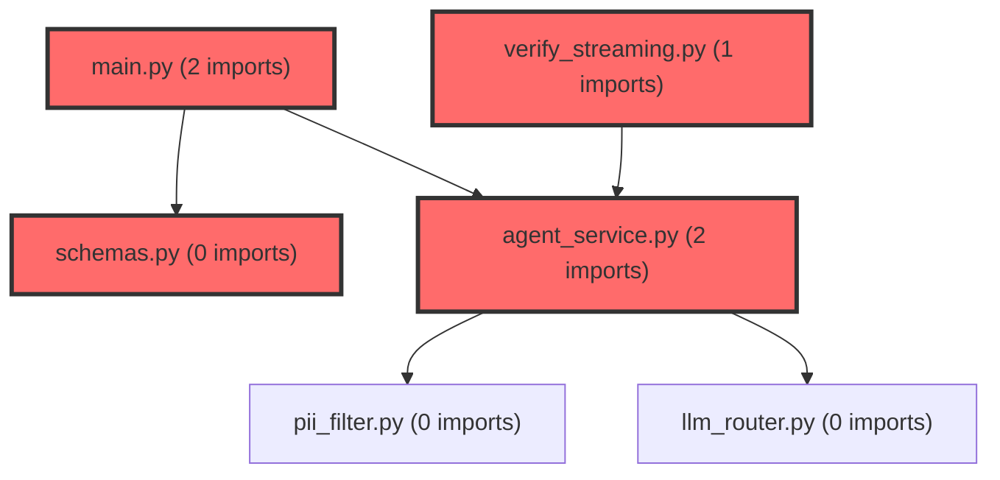

> [!IMPORTANT]
> **⚠️ 수동 검토 권장 (자가힐링 주의)**
>
> AI 자가힐링 결과물이 실제 의도와 다를 수 있으므로, **상세 리뷰 내용에 기반한 수동 점검**을 우선해 주시기 바랍니다. 자가힐링 기능을 활용하실 경우 최종 결과물을 신중하게 확인해 주세요.

# 코드 리뷰 - ab1d9d59

## 코드 복잡도 분석

**분석된 파일**: 5개 / 변경된 파일: 5개


### Import 의존관계 다이어그램



**범례**: 중심 파일 (변경됨) | 많은 import (10개 이상)


### 정상 범위 (NONE)


**`main.py`** (other)

- 평균 복잡도: **0.208**

- 최대 복잡도: 0.402

- 청크 수: 2개

- 평균 사용처: 3.5곳


**권장사항:**

- 복잡도 정상 범위


**`schemas.py`** (other)

- 평균 복잡도: **0.204**

- 최대 복잡도: 0.397

- 청크 수: 2개

- 평균 사용처: 3.5곳


**권장사항:**

- 복잡도 정상 범위


**`agent_service.py`** (other)

- 평균 복잡도: **0.183**

- 최대 복잡도: 0.354

- 청크 수: 2개

- 평균 사용처: 3.5곳


**권장사항:**

- 복잡도 정상 범위


**`streamlit_app.py`** (other)

- 평균 복잡도: **0.015**

- 최대 복잡도: 0.015

- 청크 수: 1개


**권장사항:**

- 복잡도 정상 범위


**`verify_streaming.py`** (other)

- 평균 복잡도: **0.014**

- 최대 복잡도: 0.014

- 청크 수: 1개


**권장사항:**

- 복잡도 정상 범위


---


## [GOOD] 잘된 점
CP님이 구현하신 AI 에이전트 실시간 스트리밍 기능은 다음과 같은 장점을 가지고 있습니다:

1. **하위 호환성 유지**: 기존 `/chat` 엔드포인트를 그대로 유지하면서 새로운 `/chat/stream` 엔드포인트를 추가하여 기존 클라이언트의 영향을 최소화했습니다.
2. **적절한 아키텍처 설계**: SSE(Server-Sent Events) 방식을 채택하여 실시간 스트리밍에 적합한 프로토콜을 선택했으며, FastAPI의 `StreamingResponse`를 효율적으로 활용했습니다.
3. **코드 재사용성**: `run_agent_stream` 메서드에서 기존 `run_agent`의 메시지 구성 로직을 공유하여 중복을 방지했습니다.
4. **사용자 경험 향상**: Streamlit 프론트엔드에 실시간 타이핑 효과를 구현하여 사용자에게 더 생동감 있는 경험을 제공했습니다.

## 변경사항 요약
CP님은 AI 에이전트의 실시간 스트리밍 응답 기능을 구현하고 Streamlit 프론트엔드와 연동하였습니다. 주요 변경사항으로는 스트리밍 전용 API 엔드포인트 추가, 서비스 계층의 스트리밍 메서드 구현, 그리고 프론트엔드의 실시간 렌더링 로직 개선이 포함됩니다.

---

## [ISSUE] 개선이 필요한 부분

### Critical (즉시 수정 필요)
없음

### High (우선 수정 권장)
없음

### Medium (개선 권장)
1. **일관성 없는 오류 응답 형식**: 스트리밍 중 예외 발생 시 일반 텍스트를 반환하지만, 프론트엔드는 JSON 형식을 기대합니다.
2. **히스토리 업데이트 누락 가능성**: 스트리밍 중 예외 발생 시 대화 이력이 저장되지 않아 메모리 일관성이 깨질 수 있습니다.
3. **스트리밍 완료 신호 미사용**: `StreamChunk` 스키마에 `is_final` 필드를 정의했지만 실제 스트리밍 데이터에서는 활용되지 않았습니다.

---

## 주요 파일 분석

### agent/app/services/agent_service.py
**변경 내용:**
`run_agent_stream` 메서드를 추가하여 LiteLLM Router의 스트리밍 기능을 활용한 실시간 응답 생성 구현

**개선 제안:**
1. **오타 수정 및 오류 처리 개선**
   - **위치 (라인 124)**: `# 3. 스트림 환료 후 이력 업데이트` 주석의 오타
   - **기존 코드**: `# 3. 스트림 환료 후 이력 업데이트`
   - **해결 방안 (수정 코드)**: `# 3. 스트림 완료 후 이력 업데이트`

2. **예외 발생 시 히스토리 저장 방지**
   - **위치 (라인 127-132)**: 예외 처리 블록
   - **기존 코드**:
   ```python
   except Exception as e:
       logger.error(f"Streaming error in agent service: {str(e)}", exc_info=True)
       yield f"Error: {str(e)}"
   ```
   - **해결 방안 (수정 코드)**:
   ```python
   except Exception as e:
       logger.error(f"Streaming error in agent service: {str(e)}", exc_info=True)
       # 히스토리를 업데이트하지 않고 오류만 반환
       yield json.dumps({"error": str(e), "is_final": True})
       return  # 추가 로직 실행 방지
   ```

### agent/main.py
**변경 내용:**
`/chat/stream` 엔드포인트 추가로 SSE 기반 실시간 스트리밍 지원

**개선 제안:**
1. **StreamChunk 스키마 활용**
   - **위치 (라인 46-47)**: JSON 직렬화 부분
   - **기존 코드**:
   ```python
   data = json.dumps({"text": chunk, "is_final": False}, ensure_ascii=False)
   ```
   - **해결 방안 (수정 코드)**:
   ```python
   from app.models.schemas import StreamChunk
   
   # StreamChunk 인스턴스 생성 후 직렬화
   chunk_data = StreamChunk(text=chunk, is_final=False, session_id=query.session_id)
   data = chunk_data.model_dump_json(ensure_ascii=False)
   ```

2. **최종 신호에 session_id 포함**
   - **위치 (라인 50)**: 최종 종료 메시지
   - **기존 코드**:
   ```python
   yield f"data: {json.dumps({'text': '', 'is_final': True})}\n\n"
   ```
   - **해결 방안 (수정 코드)**:
   ```python
   yield f"data: {json.dumps({'text': '', 'is_final': True, 'session_id': query.session_id})}\n\n"
   ```

### agent/streamlit_app.py
**변경 내용:**
실시간 스트리밍 옵션 추가 및 SSE 응답 처리 로직 구현

**개선 제안:**
1. **오류 응답 처리 개선**
   - **위치 (라인 113-115)**: 오류 처리 부분
   - **기존 코드**:
   ```python
   elif "error" in chunk:
       st.error(f"에러: {chunk['error']}")
   ```
   - **해결 방안 (수정 코드)**:
   ```python
   elif "error" in chunk:
       st.error(f"에러: {chunk['error']}")
       full_response += f"\n\n[시스템 오류: {chunk['error']}]"
       break  # 추가 스트리밍 중단
   ```

---

## 최종 평가

**결론**: 
- [ ] [OK] **승인 (Approved)** - Critical/High 이슈 없음
- [x] [WARN] **조건부 승인 (Approved with Comments)** - Medium 이하 이슈만 존재
- [ ] [FIX] **수정 필요 (Changes Requested)** - Critical/High 이슈 존재

**종합 의견:**
CP님의 실시간 스트리밍 기능 구현은 기본 아키텍처 설계가 탄탄하며 사용자 경험을 크게 향상시킬 수 있는 가치 있는 기능입니다. Medium 수준의 개선 사항들은 코드 품질과 일관성을 높이기 위한 제안이며, 현재 상태로도 프로덕션 환경에서 안정적으로 동작할 수 있습니다. 특히 하위 호환성을 유지한 점과 기존 로직을 재사용한 점은 훌륭한 설계 결정으로 평가됩니다.