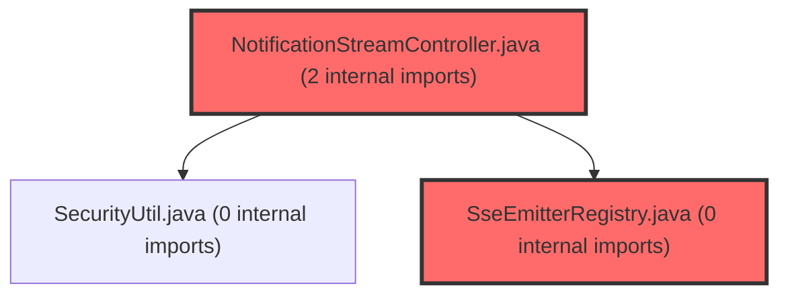

> [!IMPORTANT]
> **⚠️ 수동 검토 권장 (자가힐링 주의)**
>
> AI 자가힐링 결과물이 실제 의도와 다를 수 있으므로, **상세 리뷰 내용에 기반한 수동 점검**을 우선해 주시기 바랍니다. 자가힐링 기능을 활용하실 경우 최종 결과물을 신중하게 확인해 주세요.

# 코드 리뷰 - b3e4f39f

## 코드 복잡도 분석

**분석된 파일**: 35개 / 변경된 파일: 73개


### Import 의존관계 다이어그램



**범례**: 중심 파일 (변경됨) | 많은 import (10개 이상)


### 정상 범위 (NONE)


**`aiprompts.ts`** (other)

- 평균 복잡도: **0.235**

- 최대 복잡도: 0.477

- 청크 수: 98개

- 평균 사용처: 50.5곳


**권장사항:**

- 파일 크기가 큼 (98개 청크) - 파일 분리 검토


**`metaapplication.java`** (other)

- 평균 복잡도: **0.213**

- 최대 복잡도: 0.465

- 청크 수: 4개

- 평균 사용처: 9.8곳


**권장사항:**

- 복잡도 정상 범위


**`securityconfig.java`** (config)

- 평균 복잡도: **0.200**

- 최대 복잡도: 0.464

- 청크 수: 14개

- 평균 사용처: 22.4곳


**권장사항:**

- Config 파일은 높은 연결도가 정상적임


**`groupservice.java`** (other)

- 평균 복잡도: **0.160**

- 최대 복잡도: 0.471

- 청크 수: 6개

- 평균 사용처: 12.5곳


**권장사항:**

- 복잡도 정상 범위


**`routes.tsx`** (other)

- 평균 복잡도: **0.078**

- 최대 복잡도: 0.463

- 청크 수: 16개

- 평균 사용처: 3.5곳


**권장사항:**

- 복잡도 정상 범위


**`notificationstreamcontroller.java`** (other)

- 평균 복잡도: **0.011**

- 최대 복잡도: 0.011

- 청크 수: 1개


**권장사항:**

- 복잡도 정상 범위


**`groupinvitationservice.java`** (other)

- 평균 복잡도: **0.008**

- 최대 복잡도: 0.008

- 청크 수: 1개


**권장사항:**

- 복잡도 정상 범위


**`notificationtesterpagecontroller.java`** (component)

- 평균 복잡도: **0.007**

- 최대 복잡도: 0.008

- 청크 수: 2개


**권장사항:**

- 복잡도 정상 범위


**`notificationdto.java`** (other)

- 평균 복잡도: **0.007**

- 최대 복잡도: 0.010

- 청크 수: 2개


**권장사항:**

- 복잡도 정상 범위


**`groupinvitedevent.java`** (other)

- 평균 복잡도: **0.007**

- 최대 복잡도: 0.007

- 청크 수: 1개


**권장사항:**

- 복잡도 정상 범위


**`studentjoinedgroupevent.java`** (other)

- 평균 복잡도: **0.007**

- 최대 복잡도: 0.007

- 청크 수: 1개


**권장사항:**

- 복잡도 정상 범위


**`notificationeventhandler.java`** (other)

- 평균 복잡도: **0.007**

- 최대 복잡도: 0.008

- 청크 수: 4개


**권장사항:**

- 복잡도 정상 범위


**`notificationretentionscheduler.java`** (other)

- 평균 복잡도: **0.007**

- 최대 복잡도: 0.010

- 청크 수: 2개


**권장사항:**

- 복잡도 정상 범위


**`notificationmapper.xml`** (other)

- 평균 복잡도: **0.007**

- 최대 복잡도: 0.007

- 청크 수: 1개


**권장사항:**

- 복잡도 정상 범위


**`studentkickedevent.java`** (other)

- 평균 복잡도: **0.006**

- 최대 복잡도: 0.006

- 청크 수: 1개


**권장사항:**

- 복잡도 정상 범위


**`studentleftgroupevent.java`** (other)

- 평균 복잡도: **0.006**

- 최대 복잡도: 0.006

- 청크 수: 1개


**권장사항:**

- 복잡도 정상 범위


**`notificationshedlockconfig.java`** (config)

- 평균 복잡도: **0.006**

- 최대 복잡도: 0.008

- 청크 수: 2개


**권장사항:**

- Config 파일은 높은 연결도가 정상적임


**`notificationcategory.java`** (other)

- 평균 복잡도: **0.006**

- 최대 복잡도: 0.006

- 청크 수: 1개


**권장사항:**

- 복잡도 정상 범위


**`notificationheartbeatscheduler.java`** (other)

- 평균 복잡도: **0.005**

- 최대 복잡도: 0.006

- 청크 수: 2개


**권장사항:**

- 복잡도 정상 범위


**`notification.java`** (other)

- 평균 복잡도: **0.005**

- 최대 복잡도: 0.008

- 청크 수: 2개


**권장사항:**

- 복잡도 정상 범위


**`inmemorydispatcher.java`** (other)

- 평균 복잡도: **0.004**

- 최대 복잡도: 0.006

- 청크 수: 2개


**권장사항:**

- 복잡도 정상 범위


**`redispubsubdispatcher.java`** (other)

- 평균 복잡도: **0.004**

- 최대 복잡도: 0.005

- 청크 수: 2개


**권장사항:**

- 복잡도 정상 범위


**`redispubsubsubscriber.java`** (other)

- 평균 복잡도: **0.004**

- 최대 복잡도: 0.005

- 청크 수: 2개


**권장사항:**

- 복잡도 정상 범위


**`notificationlistresponse.java`** (other)

- 평균 복잡도: **0.004**

- 최대 복잡도: 0.004

- 청크 수: 1개


**권장사항:**

- 복잡도 정상 범위


**`notificationservice.java`** (other)

- 평균 복잡도: **0.004**

- 최대 복잡도: 0.008

- 청크 수: 8개


**권장사항:**

- 복잡도 정상 범위


**`notificationcontroller.java`** (other)

- 평균 복잡도: **0.003**

- 최대 복잡도: 0.004

- 청크 수: 4개


**권장사항:**

- 복잡도 정상 범위


**`notificationdebugcontroller.java`** (other)

- 평균 복잡도: **0.003**

- 최대 복잡도: 0.004

- 청크 수: 16개


**권장사항:**

- 복잡도 정상 범위


**`notificationredisconfig.java`** (config)

- 평균 복잡도: **0.003**

- 최대 복잡도: 0.004

- 청크 수: 3개


**권장사항:**

- Config 파일은 높은 연결도가 정상적임


**`redisdispatchmessage.java`** (other)

- 평균 복잡도: **0.003**

- 최대 복잡도: 0.003

- 청크 수: 1개


**권장사항:**

- 복잡도 정상 범위


**`sseemitterregistry.java`** (other)

- 평균 복잡도: **0.003**

- 최대 복잡도: 0.006

- 청크 수: 6개


**권장사항:**

- 복잡도 정상 범위


**`ssepocpage.tsx`** (component)

- 평균 복잡도: **0.003**

- 최대 복잡도: 0.012

- 청크 수: 6개


**권장사항:**

- 복잡도 정상 범위


**`usessepoc.ts`** (other)

- 평균 복잡도: **0.002**

- 최대 복잡도: 0.005

- 청크 수: 11개


**권장사항:**

- 복잡도 정상 범위


**`ssepocpanel.tsx`** (other)

- 평균 복잡도: **0.001**

- 최대 복잡도: 0.009

- 청크 수: 14개


**권장사항:**

- 복잡도 정상 범위


**`notificationdispatcher.java`** (other)

- 평균 복잡도: **0.000**

- 최대 복잡도: 0.000

- 청크 수: 1개


**권장사항:**

- 복잡도 정상 범위


**`notificationmapper.java`** (other)

- 평균 복잡도: **0.000**

- 최대 복잡도: 0.002

- 청크 수: 7개


**권장사항:**

- 복잡도 정상 범위


---


## 변경 배경

이 커밋은 학심정(meta-dashboard)에 실시간 알림(Notification) 기능을 도입하기 위한 설계 문서와 기반 의존성을 추가한 작업입니다.

- **목적**: 검사/그룹 카테고리의 교사/학생 알림 이벤트(T1~T6, S1~S6, C1)를 SSE(Server-Sent Events) 기반으로 전달하기 위한 아키텍처 설계 및 Redis Pub/Sub, ShedLock 의존성 추가
- **도메인**: 인프라/아키텍처 설계 (실제 구현 코드는 포함되지 않은 설계 단계 커밋)
- **변경 방향**: 기존 폴링 방식에서 SSE 기반 실시간 푸시로 전환, 다중 서버 환경에서의 메시지 공유를 Redis Pub/Sub으로 해결, 스케줄러 중복 실행 방지를 ShedLock으로 처리

---

## [GOOD] 잘된 점

1. **설계 문서의 체계적인 구성**: 01-spec(기획 스펙)부터 10-roadmap(구현 로드맵)까지 10개 문서로 분리하여 각 관심사를 명확히 분리했습니다. 특히 09-open-questions.md에 기획/법무 확인이 필요한 22개의 미결 항목을 우선순위(Critical/High/Medium)별로 정리한 점은 개발 전 리스크를 사전에 식별한 모범 사례입니다.

2. **build.gradle 의존성 추가 시 주석의 명확성**: Redis 의존성 추가 시 "토글 OFF 시 RedisAutoConfiguration 빈은 등록되지만 Lettuce가 lazy connect라 실제 Redis 미가용 환경에서도 startup 안 깨짐"이라는 주석을 통해 토글 기반 구조의 동작 방식을 명확히 문서화했습니다. 이는 향후 유지보수 시 혼란을 방지합니다.

3. **트레이드오프를 명시한 기술 결정**: 02-tech-decisions.md에서 SSE vs WebSocket vs 폴링의 비교, Redis vs Kafka의 선택 근거, Tomcat blocking I/O의 스레드 한계와 Virtual Threads 로드맵 연계 등 각 기술 선택의 장단점을 명시적으로 기록했습니다.

---

## 변경사항 요약

- `backend/build.gradle`: spring-boot-starter-data-redis, shedlock-spring 4.46.0, shedlock-provider-jdbc-template 4.46.0 의존성 3개 추가
- `backend/docs/notification/`: README.md를 포함한 11개의 설계 문서 신규 생성 (기획 스펙, 기술 결정, 데이터 모델, API 설계, 이벤트 상세, BE/FE/인프라 체크리스트, 미결 항목, 로드맵)

---

## [ISSUE] 개선이 필요한 부분

### Critical (즉시 수정 필요)

없음. 이 커밋은 설계 문서와 의존성 추가만 포함하고 있어 명백한 버그나 보안 취약점은 존재하지 않습니다.

### High (우선 수정 권장)

**1. ShedLock 의존성 버전 고정의 장기적 리스크**

`build.gradle`에서 ShedLock 의존성 버전을 `4.46.0`으로 하드코딩했습니다. Spring Boot의 BOM(Bill of Materials)을 통해 관리되는 의존성과 달리, ShedLock은 별도 버전 관리가 필요하지만, 향후 Spring Boot 버전 업그레이드 시 호환성 문제가 발생할 수 있습니다.

- **위치**: `backend/build.gradle`, 라인 107-108
- **기존 코드**:
```gradle
implementation 'net.javacrumbs.shedlock:shedlock-spring:4.46.0'
implementation 'net.javacrumbs.shedlock:shedlock-provider-jdbc-template:4.46.0'
```
- **해결 방안**: ShedLock 버전을 별도 속성으로 추출하여 중앙 관리하고, 향후 업그레이드 시 한 곳만 수정하면 되도록 개선합니다.
```gradle
ext {
    shedlockVersion = '4.46.0'
}

dependencies {
    implementation "net.javacrumbs.shedlock:shedlock-spring:${shedlockVersion}"
    implementation "net.javacrumbs.shedlock:shedlock-provider-jdbc-template:${shedlockVersion}"
}
```

**2. SSE 연결 타임아웃 설정의 경직성**

04-api.md의 `NotificationStreamController` 예제 코드에서 `SseEmitter`의 타임아웃을 `Duration.ofHours(1).toMillis()`로 고정했습니다. 이 값은 인프라 환경(LB idle timeout, Nginx proxy_read_timeout 등)에 따라 조정이 필요하며, 하드코딩보다는 설정 파일에서 관리하는 것이 바람직합니다.

- **위치**: `backend/docs/notification/04-api.md`, `NotificationStreamController` 예제
- **기존 코드**:
```java
SseEmitter emitter = new SseEmitter(Duration.ofHours(1).toMillis());
```
- **해결 방안**: 타임아웃 값을 application.yml에서 주입받도록 변경합니다.
```java
@Value("${notification.sse.timeout-hours:1}")
private int sseTimeoutHours;

SseEmitter emitter = new SseEmitter(Duration.ofHours(sseTimeoutHours).toMillis());
```

### Medium (개선 권장)

**1. 03-data-model.md의 `notification` 테이블 인덱스 중복 가능성**

`idx_user_created` (user_no, created_at DESC)와 `idx_user_read` (user_no, read_at)는 모두 `user_no`로 시작하는 복합 인덱스입니다. `idx_user_created`는 `user_no` 단일 조건 검색에도 사용될 수 있어 `idx_user_read`가 불필요할 가능성이 있습니다. 다만 `read_at IS NULL` 조건의 선택도(selectivity)가 높아 별도 인덱스가 성능상 유리할 수 있으므로, 실제 쿼리 패턴에 따라 결정이 필요합니다.

**2. 05-events.md의 T4 전원 완료 체크 로직 위치**

T4 알림(전원 제출 완료)을 T3 알림 리스너 내에서 `submittedCount == totalCount` 조건으로 즉시 체크하는 방식은 트랜잭션 내에서 동시성 이슈가 발생할 수 있습니다. 두 명의 학생이 동시에 제출할 경우 `submittedCount`가 정확히 `totalCount`와 일치하지 않을 수 있습니다. 별도 배치로 분리하거나, DB 레벨의 원자적 카운트 체크를 고려해야 합니다.

---

## 주요 파일 분석

### backend/build.gradle

**변경 내용:**
Redis Pub/Sub과 ShedLock을 위한 3개 의존성 추가. 주석에 토글 기반 구조와 Lettuce lazy connect 특성을 명시.

**개선 제안:**
1. ShedLock 버전을 ext 블록으로 분리하여 중앙 관리 (위 High 항목에서 상세 기술)

### backend/docs/notification/04-api.md

**변경 내용:**
REST API 5종(GET 목록, GET 미확인 카운트, POST 개별 읽음, POST 전체 읽음, GET SSE 스트림)의 상세 스펙과 응답 예시, SQL, 컨트롤러 예제 코드 포함.

**개선 제안:**
1. SSE 타임아웃 값을 설정 파일에서 주입받도록 변경 (위 High 항목에서 상세 기술)
2. SSE 재연결 시 `Last-Event-ID`를 통한 놓친 이벤트 복구 로직이 문서에는 언급되었으나, 실제 컨트롤러 예제 코드에는 구현이 누락되었습니다. `SseEmitter` 생성 시 `Last-Event-ID` 헤더를 읽어 해당 ID 이후의 알림을 DB에서 조회하여 재전송하는 로직이 필요합니다.

### backend/docs/notification/09-open-questions.md

**변경 내용:**
기획/법무/유관팀 확인이 필요한 22개 항목을 Critical(6개), High(7개), Medium(3개), 법무(3개), 기술(3개)로 분류하여 정리.

**개선 제안:**
1. 각 질문 항목에 "답변 완료일"과 "결정 사항"을 기록할 수 있는 템플릿 필드를 추가하면, 문서가 단순한 질문 목록에서 의사결정 추적 도구로 발전할 수 있습니다.

---

## 최종 평가

**결론**:
- [ ] [OK] **승인 (Approved)** - Critical/High 이슈 없음
- [x] [WARN] **조건부 승인 (Approved with Comments)** - Medium 이하 이슈만 존재
- [ ] [FIX] **수정 필요 (Changes Requested)** - Critical/High 이슈 존재

**종합 의견:**

이 커밋은 설계 문서와 의존성 추가만 포함하고 있어, 명백한 버그나 보안 취약점은 존재하지 않습니다. 설계 문서의 구성과 기술 결정의 근거가 매우 체계적으로 정리되어 있어, 실제 구현 단계에서 팀원 간 의사소통 비용을 크게 줄여줄 것으로 예상됩니다.

다만, ShedLock 버전을 ext 속성으로 분리하여 중앙 관리하는 것과 SSE 타임아웃 값을 설정 파일로 분리하는 것은 실제 구현 시작 전에 반영하는 것이 좋습니다. 또한 09-open-questions.md의 22개 미결 항목 중 Critical 6개(Q1~Q6)는 개발 시작 전에 반드시 해결되어야 하며, 특히 Q17(닉네임 박제 법무 검토)은 데이터 모델에 영향을 줄 수 있는 사항이므로 최우선으로 처리해야 합니다.

전반적으로 설계 단계에서 고려할 수 있는 모든 측면(기술, 인프라, 법무, UX, 운영)을 빠짐없이 문서화한 우수한 커밋입니다. 조건부 승인하며, 위 Medium 제안 사항들은 구현 단계에서 자연스럽게 반영될 것으로 기대합니다.