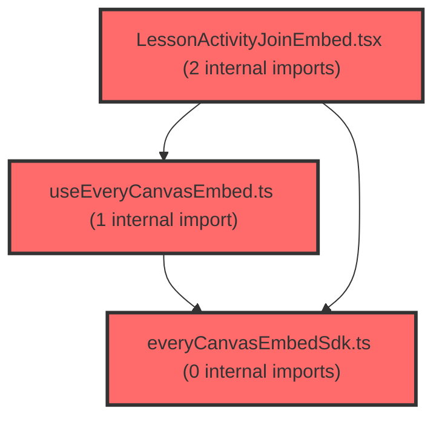

> [!IMPORTANT]
> **⚠️ 수동 검토 권장 (자가힐링 주의)**
>
> AI 자가힐링 결과물이 실제 의도와 다를 수 있으므로, **상세 리뷰 내용에 기반한 수동 점검**을 우선해 주시기 바랍니다. 자가힐링 기능을 활용하실 경우 최종 결과물을 신중하게 확인해 주세요.

# 코드 리뷰 - b57ce04c

## 코드 복잡도 분석

**분석된 파일**: 4개 / 변경된 파일: 6개


### Import 의존관계 다이어그램



**범례**: 중심 파일 (변경됨) | 많은 import (10개 이상)


### 정상 범위 (NONE)


**`everycanvasembedsdk.ts`** (utility)

- 평균 복잡도: **0.002**

- 최대 복잡도: 0.005

- 청크 수: 13개


**권장사항:**

- 복잡도 정상 범위


**`useeverycanvasembed.ts`** (utility)

- 평균 복잡도: **0.001**

- 최대 복잡도: 0.004

- 청크 수: 10개


**권장사항:**

- 복잡도 정상 범위


**`lessonjoinpage.tsx`** (component)

- 평균 복잡도: **0.001**

- 최대 복잡도: 0.007

- 청크 수: 12개


**권장사항:**

- 복잡도 정상 범위


**`lessonactivityjoinembed.tsx`** (other)

- 평균 복잡도: **0.000**

- 최대 복잡도: 0.004

- 청크 수: 12개


**권장사항:**

- 복잡도 정상 범위


---


## 변경 배경

이 커밋은 EveryCanvas LMS 통합의 계약 확정 단계로, 기존에 임시로 사용하던 `activityId` 파라미터를 공식 `accessKey` 파라미터로 전환하고, 더 이상 사용되지 않는 `embedTokenService.ts`(embed token 조달 서비스)를 제거하는 리팩토링입니다.

- **목적**: EveryCanvas SDK 계약 확정에 따른 파라미터 명칭 정리(`activityId` → `accessKey`) 및 불필요한 embed token 서비스 제거
- **도메인**: 프론트엔드 UI (EveryCanvas LMS embed 통합)
- **변경 방향**: 임시 계약(PoC)에서 확정 계약으로 전환하며, 사용하지 않는 코드를 정리하고 파라미터 명칭을 명확화

## [GOOD] 잘된 점

1. **문서-코드 일관성 유지**: `embedTokenService.ts` 삭제와 함께 관련 문서(`lesson-everycanvas-lms-integration.plan.md`)의 구조도 함께 갱신하여, 문서와 실제 코드 구조가 어긋나지 않도록 했습니다. 이는 유지보수 관점에서 매우 중요한 부분입니다.

2. **파라미터 명칭의 일관된 전파**: `accessKey` 파라미터가 페이지(`LessonJoinPage`)부터 컴포넌트(`LessonActivityJoinEmbed`)까지 일관되게 전파되어, 데이터 흐름을 추적하기 쉽습니다. 기존의 임시 명칭(`activityId`)이 계약 확정 후 공식 명칭(`accessKey`)으로 정리된 것은 적절한 결정입니다.

3. **SDK 옵션의 사용 모드 명시**: `everyCanvasEmbedSdk.ts`의 `CreateEmbedOptions`에 각 파라미터의 사용 모드(viewer/activity-join)를 주석으로 명시하여, SDK 옵션의 의도를 명확히 했습니다.

## 변경사항 요약

`activityId` 파라미터를 `accessKey`로 리네임하고, SDK 옵션에 `accessKey`를 추가했습니다. 동시에 더 이상 사용되지 않는 `embedTokenService.ts`를 삭제하고 관련 문서를 갱신했습니다.

---

## [ISSUE] 개선이 필요한 부분

### Critical (즉시 수정 필요)

없음

### High (우선 수정 권장)

없음

### Medium (개선 권장)

1. **`accessKey`와 `activityId` 중복 전달** (`LessonActivityJoinEmbed.tsx` 라인 49-50)

   `LessonActivityJoinEmbed.tsx`에서 SDK 옵션에 `accessKey`와 `activityId`를 동일한 값으로 동시에 전달하고 있습니다.

   ```typescript
   // frontend/src/features/lesson/ui/LessonActivityJoinEmbed.tsx (라인 46-52)
   options: {
     embedBaseUrl: ENV.EVERYCLASS_EMBED_BASE_URL,
     mode: 'activity-join',
     accessKey,
     activityId: accessKey,
     slideId: setId,
     locale: 'ko-KR',
     theme: embedTheme,
   },
   ```

   `everyCanvasEmbedSdk.ts`의 주석에 따르면 `activityId`는 `mode: activity-join 전용`으로 명시되어 있습니다. 그러나 `accessKey`가 추가된 상황에서 `activityId`를 동일한 값으로 중복 전달하는 것은 혼란을 줄 수 있습니다. SDK 계약상 `activityId`가 여전히 필요한지 확인 후, 불필요하다면 제거하는 것이 좋습니다.

   **제안**:
   ```typescript
   options: {
     embedBaseUrl: ENV.EVERYCLASS_EMBED_BASE_URL,
     mode: 'activity-join',
     accessKey,
     slideId: setId,
     locale: 'ko-KR',
     theme: embedTheme,
   },
   ```

   > 단, SDK 계약에 따라 `activityId`가 여전히 필요한 경우에는 유지해도 무방합니다. 이 부분은 EveryCanvas SDK 문서를 확인하여 결정하시기 바랍니다.

2. **`identity` 배열의 중복 요소** (`LessonActivityJoinEmbed.tsx` 라인 64)

   `identity` 배열이 `[ENV.EVERYCLASS_EMBED_BASE_URL, accessKey, setId]`로 구성되어 있는데, `accessKey`와 `activityId`가 동일한 값이므로 identity가 중복 요소를 포함하게 됩니다. `identity`는 마운트 재생성 트리거로 사용되므로, 중복 요소는 불필요합니다. 다만 이 부분은 기능상 문제를 일으키지 않으므로, 위 1번 항목과 함께 정리하면 됩니다.

---

## 주요 파일 분석

### frontend/src/features/lesson/ui/LessonActivityJoinEmbed.tsx

**변경 내용:**
`activityId` prop을 `accessKey`로 리네임하고, SDK 옵션에 `accessKey`와 `activityId`를 동시에 전달하도록 변경했습니다.

**개선 제안:**
1. `accessKey`와 `activityId` 중복 전달 제거
   - **위치 (라인 49-50)**: `accessKey,` / `activityId: accessKey,`
   - **기존 코드**:
   ```typescript
   accessKey,
   activityId: accessKey,
   ```
   - **해결 방안 (수정 코드)**:
   ```typescript
   accessKey,
   ```
   > `activityId`가 SDK 1.5에서 제거된 capability임을 고려하면, `accessKey`만 전달하는 것이 명확합니다. 다만 SDK 계약에 따라 `activityId`가 여전히 필요한 경우에는 유지해도 무방합니다.

### frontend/src/features/lesson/lib/everyCanvasEmbedSdk.ts

**변경 내용:**
`CreateEmbedOptions`에서 `getToken`을 제거하고 `accessKey`를 추가했습니다. 각 파라미터의 사용 모드를 주석으로 명시했습니다.

**분석:**
`getToken` 제거는 `embedTokenService.ts` 삭제와 함께 이루어진 것으로, embed token 조달 방식이 더 이상 필요 없어졌거나 다른 방식으로 대체되었음을 의미합니다. `accessKey` 추가는 activity-join 모드에서 사용되는 것으로 보입니다.

### frontend/src/features/lesson/lib/useEveryCanvasEmbed.ts

**변경 내용:**
`createEmbed` 호출 시 `getToken` 래핑을 제거했습니다.

**분석:**
기존에는 `getToken` 콜백을 `optionsRef.current.getToken?.()`로 래핑하여 TOKEN_EXPIRED 재발급 시 최신 콜백을 사용하도록 했습니다. 이제 `getToken` 자체가 제거되었으므로 해당 래핑도 함께 제거된 것입니다. `getSsoToken` 래핑은 유지되고 있어, SSO 토큰 갱신 로직은 그대로 동작합니다.

### frontend/src/features/lesson/api/embedTokenService.ts (삭제)

**변경 내용:**
파일이 삭제되었습니다.

**분석:**
`fetchEmbedToken` 함수가 더 이상 사용되지 않아 삭제되었습니다. 이는 embed token 조달 방식이 변경되었거나, 해당 기능이 다른 경로로 대체되었음을 의미합니다. 삭제된 파일에 대한 참조가 남아있지 않은지 확인이 필요합니다.

### frontend/src/pages/lesson/LessonJoinPage.tsx

**변경 내용:**
`LessonActivityJoinEmbed`에 전달하던 `activityId` prop을 `accessKey`로 변경했습니다.

**분석:**
```typescript
// 변경 전
<LessonActivityJoinEmbed
  activityId={accessKey}
  setId={lcmsSetId}
  ...
/>

// 변경 후
<LessonActivityJoinEmbed
  accessKey={accessKey}
  setId={lcmsSetId}
  ...
/>
```

페이지 레벨에서 이미 `accessKey`라는 변수를 사용하고 있었으므로, prop 명칭이 실제 데이터 의미와 일치하게 된 것입니다. 이는 명확성 측면에서 개선된 부분입니다.

---

## 최종 평가

**결론**:
- [ ] [OK] **승인 (Approved)** - Critical/High 이슈 없음
- [x] [WARN] **조건부 승인 (Approved with Comments)** - Medium 이하 이슈만 존재
- [ ] [FIX] **수정 필요 (Changes Requested)** - Critical/High 이슈 존재

**종합 의견:**

계약 확정에 따른 파라미터 명칭 정리와 불필요한 코드 제거가 깔끔하게 이루어졌습니다. `accessKey`와 `activityId`의 중복 전달만 확인 후 정리하면 완성도가 높아질 것입니다. 전반적으로 안정적인 리팩토링이며, 승인 가능한 수준입니다.