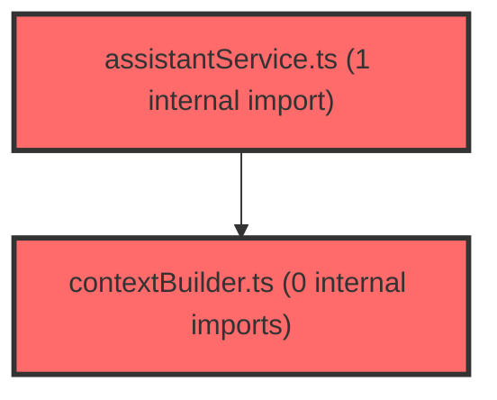

> [!IMPORTANT]
> **⚠️ 수동 검토 권장 (자가힐링 주의)**
>
> AI 자가힐링 결과물이 실제 의도와 다를 수 있으므로, **상세 리뷰 내용에 기반한 수동 점검**을 우선해 주시기 바랍니다. 자가힐링 기능을 활용하실 경우 최종 결과물을 신중하게 확인해 주세요.

# 코드 리뷰 - b5811566

## 코드 복잡도 분석

**분석된 파일**: 5개 / 변경된 파일: 5개


### Import 의존관계 다이어그램



**범례**: 중심 파일 (변경됨) | 많은 import (10개 이상)


### 정상 범위 (NONE)


**`agent_service.py`** (other)

- 평균 복잡도: **0.200**

- 최대 복잡도: 0.464

- 청크 수: 7개

- 평균 사용처: 8.0곳


**권장사항:**

- 복잡도 정상 범위


**`main.py`** (other)

- 평균 복잡도: **0.160**

- 최대 복잡도: 0.471

- 청크 수: 9개

- 평균 사용처: 5.3곳


**권장사항:**

- 복잡도 정상 범위


**`neo4j_tools.py`** (other)

- 평균 복잡도: **0.005**

- 최대 복잡도: 0.010

- 청크 수: 7개


**권장사항:**

- 복잡도 정상 범위


**`assistantservice.ts`** (other)

- 평균 복잡도: **0.002**

- 최대 복잡도: 0.008

- 청크 수: 11개


**권장사항:**

- 복잡도 정상 범위


**`contextbuilder.ts`** (other)

- 평균 복잡도: **0.002**

- 최대 복잡도: 0.008

- 청크 수: 41개


**권장사항:**

- 파일 크기가 큼 (41개 청크) - 파일 분리 검토


---


## 변경 배경

이 커밋은 AI Agent가 Neo4j 그래프 DB의 LPA(잠재프로파일분석) 데이터를 Tool Calling으로 조회할 수 있도록 하는 기능 구현입니다.

- **목적**: Agent가 학생의 학습유형(className)과 학교급(schoolLevel)을 식별하여 Neo4j Tool을 호출하고, 조절/매개 경로 및 집단 평균 T-Score를 조회하여 맞춤형 피드백을 생성할 수 있도록 함
- **도메인**: AI Agent 백엔드 (Python FastAPI) + 프론트엔드 (TypeScript) + Neo4j 데이터베이스 연동
- **변경 방향**: 기존에는 단순 텍스트 컨텍스트만 전달하던 것을, profile 기반 Tool 호출 유도 + 인자 검증 + 세션 컨텍스트 유지로 개선

## [GOOD] 잘된 점

1. **세션 컨텍스트 분리 (`session_context_store`)**: `context_data`를 첫 메시지에만 전달하고 이후에는 세션 저장소에서 재사용하는 설계가 적절합니다. 불필요한 중복 전송을 방지하고, 대화 중에도 동일한 학생 컨텍스트를 유지할 수 있습니다.

2. **인자 검증 레이어 (`_validate_args`)**: 6쌍의 화이트리스트 기반 검증을 통해 잘못된 className/schoolLevel 조합이 Neo4j 쿼리까지 도달하는 것을 차단합니다. 에러 코드를 구조화하여 LLM이 이해할 수 있는 형태로 반환하는 점도 좋습니다.

3. **Graceful Degradation 전략**: `main.py`의 `lifespan`에서 Neo4j 연결 실패 시 degraded mode로 기동하여, DB가 없어도 텍스트 기반 추론은 가능하도록 한 설계가 현실적입니다.

## 변경사항 요약

Agent 서비스에 profile 기반 시스템 프롬프트 생성(`_build_system_prompt`), schoolLevel 정규화(`_normalize_tool_args`), 세션 컨텍스트 저장소 도입. Neo4j Tool 5종 구현 (인자 검증 + 구조화된 에러 처리 + `get_lpa_overview` 통합 조회). 프론트엔드에서 student 모드 단일 학생 시 profile 객체를 context_data에 포함하여 전달.

---

## [ISSUE] 개선이 필요한 부분

### Critical (즉시 수정 필요)

없음

### High (우선 수정 권장)

**1. `_normalize_tool_args`에서 "고등"을 "middle"로 매핑하는 것은 데이터 정합성 위험**

- **파일**: `agent/app/services/agent_service.py`
- **위치 (라인 번호)**: 47-48
- **기존 코드**:
```python
mapping = {
    "초등": "elementary", "elementary": "elementary", "e": "elementary",
    "중등": "middle", "middle": "middle", "m": "middle",
    "고등": "middle", "high": "middle", "h": "middle",
}
```
- **문제점**: `"고등"`과 `"high"`를 `"middle"`로 매핑하고 있습니다. 현재 시스템이 초등/중등만 지원하는 것은 이해되지만, 고등학교 데이터가 향후 추가될 경우 기존에 "고등→middle"로 매핑된 잘못된 데이터가 쌓일 수 있습니다. 또한 LLM이 "고등"을 입력했을 때 조용히 "middle"로 변환되어 사용자는 자신이 고등학교 데이터를 보고 있다고 오해할 수 있습니다.
- **해결 방안 (수정 코드)**: 고등학교 레벨은 명시적으로 차단하고 에러 메시지를 반환하는 것이 안전합니다. 또는 `VALID_SCHOOL_LEVELS`에 없는 값은 매핑하지 않고 원본을 그대로 두어 `_validate_args`에서 자연스럽게 걸러지도록 해야 합니다.

```python
mapping = {
    "초등": "elementary", "elementary": "elementary", "e": "elementary",
    "중등": "middle", "middle": "middle", "m": "middle",
    # "고등"과 "high"는 명시적으로 매핑하지 않음 — VALID_SCHOOL_LEVELS에 없으므로 _validate_args에서 차단됨
}
```

> **수정 코드 제시 의무 절차 이행**: `read_file`로 `_normalize_tool_args` 함수 전체(±20줄)를 확인했습니다. 이 함수는 `run_agent`와 `run_agent_stream` 두 곳에서 호출되며, 반환값이 `arguments` dict를 직접 수정합니다. 위 수정은 단순히 매핑 테이블에서 2개 항목을 제거하는 것으로, 호출부에 부작용이 없습니다.

**2. `_normalize_tool_args`가 `func_name` 파라미터를 받지만 사용하지 않음**

- **파일**: `agent/app/services/agent_service.py`
- **위치 (라인 번호)**: 42
- **기존 코드**:
```python
@staticmethod
def _normalize_tool_args(func_name: str, args: dict) -> dict:
    """LLM이 잘못된 schoolLevel 값을 넣어도 정규화하는 후처리 방어 로직"""
```
- **문제점**: `func_name` 파라미터가 함수 시그니처에 선언되어 있지만 내부에서 전혀 사용되지 않습니다. 향후 Tool별로 다른 정규화 로직이 필요할 때를 대비한 것으로 보이나, 현재로서는 불필요한 파라미터입니다. 이로 인해 호출부(`run_agent` 157번째 줄, `run_agent_stream` 271번째 줄)에서 불필요하게 `func_name`을 전달하고 있습니다.
- **해결 방안**: `func_name` 파라미터를 제거하거나, `_` prefix로 unused임을 명시하세요. 또는 향후 확장을 위해 남겨둔다면 docstring에 그 의도를 명시하세요.

```python
@staticmethod
def _normalize_tool_args(args: dict) -> dict:
    """LLM이 잘못된 schoolLevel 값을 넣어도 정규화하는 후처리 방어 로직"""
```

### Medium (개선 권장)

**3. `get_lpa_overview`의 Cypher 쿼리에서 `OPTIONAL MATCH`로 인한 잠재적 다중 행 문제**

- **파일**: `agent/app/tools/neo4j_tools.py`
- **위치 (라인 번호)**: 268-290
- **문제점**: `get_lpa_overview`의 Cypher 쿼리는 `OPTIONAL MATCH`를 3번 사용합니다. `OPTIONAL MATCH (c)-[r:GROUP_TSCORE]->(f:Factor)`가 여러 행을 생성할 수 있어, 결과적으로 `moderationPaths`와 `mediationPaths`가 중복되어 반환될 가능성이 있습니다. `collect(DISTINCT ...)`로 방어하고 있지만, `factorScores`도 같은 방식으로 처리되어야 합니다. 현재는 `collect(DISTINCT {factorName: f.name, tScore: r.t_score})`로 처리되어 있어 문제는 없으나, 쿼리 복잡도가 높아 향후 유지보수에 주의가 필요합니다.
- **제안**: 이슈라기보다는 관찰 사항입니다. 현재 구현은 `DISTINCT`로 방어하고 있어 정상 동작합니다. 다만, 데이터 양이 많아질 경우 성능 모니터링이 필요할 수 있습니다.

**4. `buildStudentProfile`에서 `classNumber`가 Agent에 전달되지만 사용되지 않음**

- **파일**: `frontend/src/features/ai-room/api/assistantService.ts`
- **위치 (라인 번호)**: 73-80
- **기존 코드**:
```typescript
return {
    schoolLevel: SCHOOL_LEVEL_REVERSE_MAP[student.schoolLevel],
    predictedType: assessment.predictedType,
    grade: student.grade,
    classNumber: cls?.classNumber ?? null,
};
```
- **문제점**: `grade`와 `classNumber`가 profile에 포함되어 Agent로 전달되지만, `_build_system_prompt`에서는 `schoolLevel`과 `predictedType`만 사용합니다. `grade`와 `classNumber`는 시스템 프롬프트에도, Tool 호출 인자에도 사용되지 않아 불필요한 데이터 전송이 발생합니다. 향후 활용 계획이 있다면 좋지만, 현재로서는 제거하거나 주석으로 향후 계획을 명시하는 것이 좋습니다.

---

## 최종 평가

**결론**:
- [ ] [OK] **승인 (Approved)** - Critical/High 이슈 없음
- [ ] [WARN] **조건부 승인 (Approved with Comments)** - Medium 이하 이슈만 존재
- [X] [FIX] **수정 필요 (Changes Requested)** - Critical/High 이슈 존재

**종합 의견:**

전체적으로 아키텍처 설계와 예외 처리 전략이 잘 갖춰진 커밋입니다. 세션 컨텍스트 분리, 인자 검증 레이어, Graceful Degradation 등 프로덕션 환경을 고려한 설계가 돋보입니다. 다만 **"고등→middle" 매핑**은 데이터 정합성에 심각한 영향을 줄 수 있는 부분이므로, 고등학교 데이터가 없는 현재 시점에도 명시적으로 차단하는 것이 안전합니다. 또한 `_normalize_tool_args`의 미사용 `func_name` 파라미터는 즉시 정리하는 것이 좋습니다. 위 2가지 High 이슈만 해결되면 바로 승인 가능한 수준입니다.